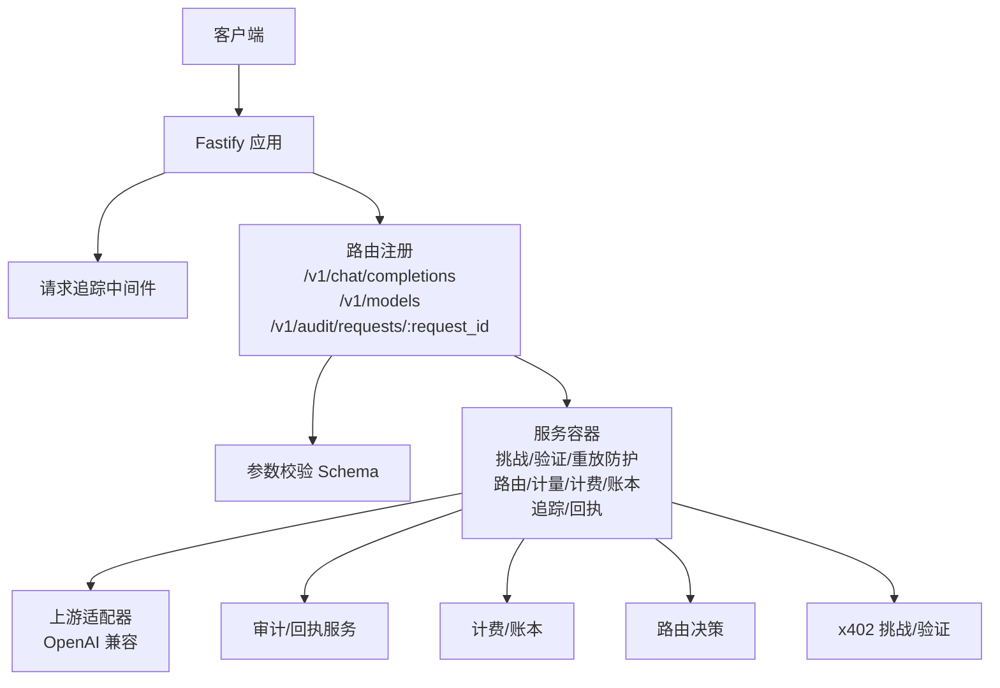
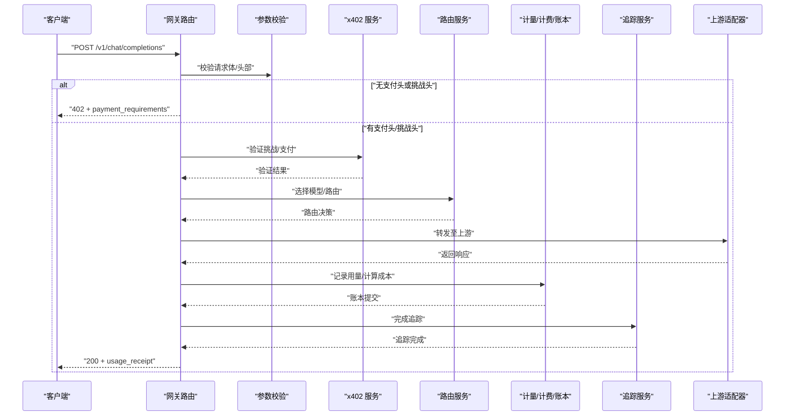
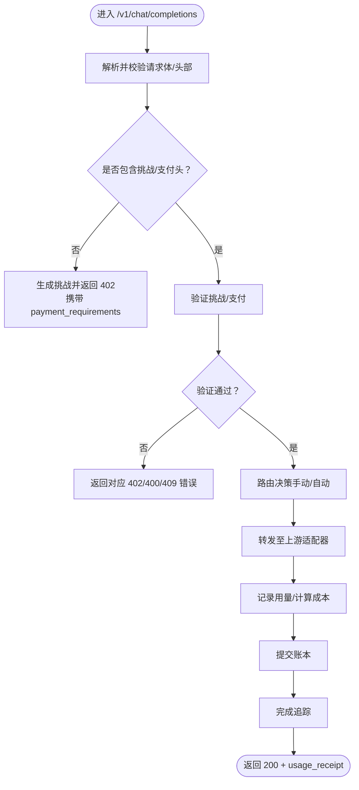
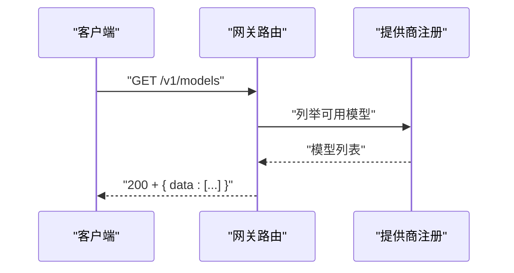
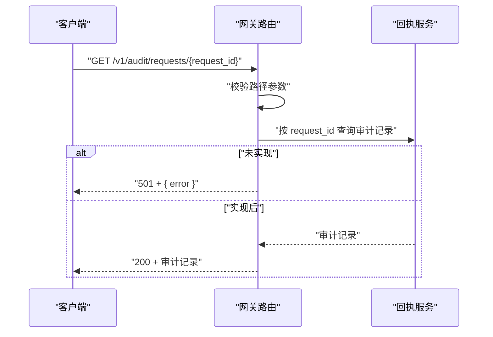
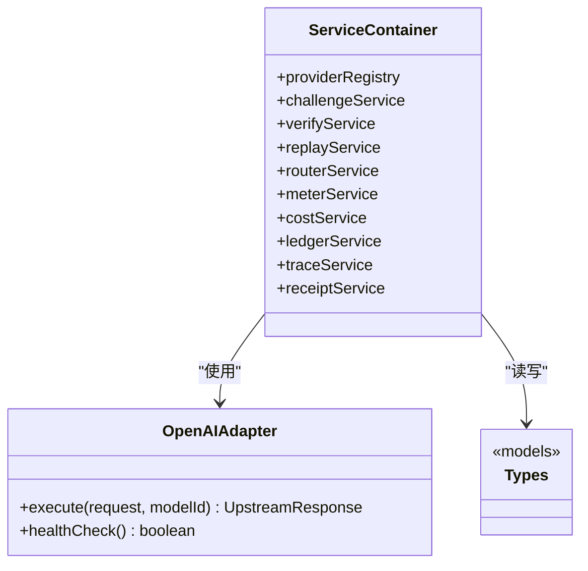

# API 参考

<cite>
**本文引用的文件**
- [src/gateway/routes.ts](file://src/gateway/routes.ts)
- [src/gateway/schemas.ts](file://src/gateway/schemas.ts)
- [src/gateway/middleware.ts](file://src/gateway/middleware.ts)
- [src/app.ts](file://src/app.ts)
- [src/config.ts](file://src/config.ts)
- [src/types.ts](file://src/types.ts)
- [src/errors.ts](file://src/errors.ts)
- [src/provider/openai.adapter.ts](file://src/provider/openai.adapter.ts)
- [src/provider/types.ts](file://src/provider/types.ts)
- [src/router/types.ts](file://src/router/types.ts)
- [src/x402/types.ts](file://src/x402/types.ts)
- [src/billing/types.ts](file://src/billing/types.ts)
- [src/audit/types.ts](file://src/audit/types.ts)
- [src/audit/receipt.service.ts](file://src/audit/receipt.service.ts)
- [docs/api-spec-v0-x402-gateway.md](file://docs/api-spec-v0-x402-gateway.md)
- [package.json](file://package.json)
</cite>

## 目录
1. [简介](#简介)
2. [项目结构](#项目结构)
3. [核心组件](#核心组件)
4. [架构总览](#架构总览)
5. [详细组件分析](#详细组件分析)
6. [依赖关系分析](#依赖关系分析)
7. [性能与限流](#性能与限流)
8. [故障排查指南](#故障排查指南)
9. [结论](#结论)
10. [附录](#附录)

## 简介
本文件为 x402 Gateway 的完整 API 参考，覆盖以下端点：
- POST /v1/chat/completions（OpenAI 兼容）
- GET /v1/models
- GET /v1/audit/requests/:request_id

内容涵盖：HTTP 方法、URL 模式、请求/响应结构、认证与支付流程、参数与数据类型、验证规则、错误码与处理策略、速率限制、版本控制与兼容性说明。

## 项目结构
- 路由与校验位于 gateway 子模块，负责注册端点与参数解析。
- 应用入口在 app.ts 中装配服务容器与全局中间件、错误处理。
- 类型定义集中在 types.ts，统一了请求/响应模型与审计、计费、路由等领域的数据结构。
- 提供商适配器位于 provider 子模块，当前实现 OpenAI 兼容适配器。
- 审计、计费、路由、x402 验证等能力通过服务容器注入到路由层。

图表来源
- [src/app.ts:35-100](file://src/app.ts#L35-L100)
- [src/gateway/routes.ts:9-96](file://src/gateway/routes.ts#L9-L96)
- [src/gateway/schemas.ts:1-32](file://src/gateway/schemas.ts#L1-L32)

章节来源
- [src/app.ts:35-100](file://src/app.ts#L35-L100)
- [src/gateway/routes.ts:9-96](file://src/gateway/routes.ts#L9-L96)
- [src/gateway/schemas.ts:1-32](file://src/gateway/schemas.ts#L1-L32)

## 核心组件
- 请求追踪中间件：为每个请求注入唯一 trace/request ID，便于日志与审计。
- 服务容器：集中管理提供商注册、x402 挑战/验证/重放防护、路由、计量、计费、账本、追踪、回执等服务。
- 参数校验：使用 Zod 对请求体、路径参数与头部进行严格校验。
- 错误体系：统一的 AppError 体系映射到标准 HTTP 状态码与错误码。

章节来源
- [src/gateway/middleware.ts:1-13](file://src/gateway/middleware.ts#L1-L13)
- [src/app.ts:21-33](file://src/app.ts#L21-L33)
- [src/gateway/schemas.ts:1-32](file://src/gateway/schemas.ts#L1-L32)
- [src/errors.ts:6-105](file://src/errors.ts#L6-L105)

## 架构总览
下图展示从客户端到上游提供商的整体调用链路，以及 x402 支付流程的关键节点。

图表来源
- [src/gateway/routes.ts:23-67](file://src/gateway/routes.ts#L23-L67)
- [src/gateway/schemas.ts:4-22](file://src/gateway/schemas.ts#L4-L22)
- [src/app.ts:77-94](file://src/app.ts#L77-L94)
- [src/provider/openai.adapter.ts:25-42](file://src/provider/openai.adapter.ts#L25-L42)

## 详细组件分析

### 通用约定
- 版本控制与兼容性
  - 基于 API 规范 v0，当前为 MVP 草案；保持 OpenAI 兼容请求体，通过额外头部与 402 响应实现按需付费。
- 认证与安全
  - 本版本不使用传统 API Key；通过 X-402-* 头部与 402 挑战响应实现支付授权。
  - 请求哈希绑定、幂等键、挑战过期时间、重复支付防护等安全规则见“安全与幂等”章节。
- 错误处理
  - 统一错误映射到 AppError，错误响应包含 code 与 message 字段；402 场景可携带 payment_requirements。

章节来源
- [docs/api-spec-v0-x402-gateway.md:165-197](file://docs/api-spec-v0-x402-gateway.md#L165-L197)
- [src/errors.ts:92-105](file://src/errors.ts#L92-L105)

### POST /v1/chat/completions（OpenAI 兼容）
- 描述
  - OpenAI 兼容的聊天补全端点，支持自动/手动路由模式；首次请求无支付头时返回 402 并提供支付要求；二次请求携带 X-402-Challenge、X-402-Payment 与幂等键后执行。
- HTTP 方法与路径
  - POST /v1/chat/completions
- 请求头
  - Content-Type: application/json
  - X-402-Challenge: <token>（二次请求必填）
  - X-402-Payment: <proof>（二次请求必填）
  - Idempotency-Key: <uuid>（二次请求必填）
- 请求体（OpenAI 兼容）
  - model: 字符串，必填
  - messages: 数组，元素含 role（system/user/assistant）与 content（字符串），至少 1 条
  - temperature: 数字，范围 0..2，可选
  - stream: 布尔，可选，默认 false
  - routing_mode: 'manual' | 'auto'，可选，默认 'manual'
- 成功响应
  - 200 OK，包含标准 OpenAI 字段与 usage_receipt
  - usage_receipt 包含请求标识、报价单号、付款人地址、路由模式、模型、单价与总成本、路由证明哈希等
- 402 响应（首次支付挑战）
  - 返回 payment_requirements，字段包括 quote_id、chain、asset、amount、expires_at、merchant_address、request_hash、challenge_token
- 错误码
  - 400: validation_error（参数校验失败）、request_hash_mismatch
  - 402: payment_required、challenge_expired、payment_verification_failed、insufficient_payment
  - 409: payment_replayed
  - 503/504: upstream_unavailable、upstream_timeout
  - 500: internal_error
- 流程要点
  - 首次请求：若缺少挑战/支付头，生成挑战并返回 402
  - 二次请求：验证挑战与支付，路由到上游，记录用量与成本，生成 usage_receipt
  - 流式场景：需在首 token 前完成支付验证（详见“流式注意”）

图表来源
- [src/gateway/routes.ts:23-67](file://src/gateway/routes.ts#L23-L67)
- [src/gateway/schemas.ts:4-22](file://src/gateway/schemas.ts#L4-L22)
- [src/errors.ts:17-81](file://src/errors.ts#L17-L81)

章节来源
- [src/gateway/routes.ts:10-67](file://src/gateway/routes.ts#L10-L67)
- [src/gateway/schemas.ts:4-15](file://src/gateway/schemas.ts#L4-L15)
- [src/types.ts:22-62](file://src/types.ts#L22-L62)
- [src/errors.ts:17-81](file://src/errors.ts#L17-L81)
- [docs/api-spec-v0-x402-gateway.md:21-103](file://docs/api-spec-v0-x402-gateway.md#L21-L103)

### GET /v1/models
- 描述
  - 返回可用模型目录与定价元数据
- HTTP 方法与路径
  - GET /v1/models
- 响应体
  - data: 模型数组，每项包含 id、provider、context_window、capabilities、pricing（input_usd_per_token、output_usd_per_token、effective_at）

图表来源
- [src/gateway/routes.ts:73-76](file://src/gateway/routes.ts#L73-L76)
- [src/types.ts:74-84](file://src/types.ts#L74-L84)

章节来源
- [src/gateway/routes.ts:69-76](file://src/gateway/routes.ts#L69-L76)
- [src/types.ts:74-84](file://src/types.ts#L74-L84)

### GET /v1/audit/requests/:request_id
- 描述
  - 返回已完成请求的路由与结算证据（审计查询）
- HTTP 方法与路径
  - GET /v1/audit/requests/:request_id
- 路径参数
  - request_id: 字符串，必填
- 响应体
  - request_id、request_hash、routing_mode
  - route_decision：selected_model、fallback_chain、score_summary
  - usage：prompt_tokens、completion_tokens、total_tokens
  - cost：subtotal_usd、platform_fee_usd、total_usd
  - payment：quote_id、chain、asset、payer_address、verification_status
- 当前状态
  - 路由层返回 501（未实现）；回执服务接口已定义，待实现

图表来源
- [src/gateway/routes.ts:82-94](file://src/gateway/routes.ts#L82-L94)
- [src/gateway/schemas.ts:25-27](file://src/gateway/schemas.ts#L25-L27)
- [src/audit/receipt.service.ts:4-25](file://src/audit/receipt.service.ts#L4-L25)
- [src/audit/types.ts:14-37](file://src/audit/types.ts#L14-L37)

章节来源
- [src/gateway/routes.ts:78-94](file://src/gateway/routes.ts#L78-L94)
- [src/gateway/schemas.ts:25-27](file://src/gateway/schemas.ts#L25-L27)
- [src/audit/receipt.service.ts:4-25](file://src/audit/receipt.service.ts#L4-L25)
- [src/audit/types.ts:14-37](file://src/audit/types.ts#L14-L37)
- [docs/api-spec-v0-x402-gateway.md:129-163](file://docs/api-spec-v0-x402-gateway.md#L129-L163)

## 依赖关系分析
- 服务容器装配
  - providerRegistry：模型与提供商注册
  - challengeService / verifyService / replayService：x402 挑战签发、支付验证、重放防护
  - routerService：路由决策与证明
  - meterService / costService / ledgerService：用量计量、成本计算、账本提交
  - traceService / receiptService：请求追踪与审计回执
- 上游适配器
  - OpenAIAdapter：封装上游兼容调用与健康检查
- 数据模型
  - ChatCompletionRequest/Response、TokenUsage、UsageReceipt、ModelInfo、AuditRecord 等

图表来源
- [src/app.ts:22-33](file://src/app.ts#L22-L33)
- [src/app.ts:77-94](file://src/app.ts#L77-L94)
- [src/provider/openai.adapter.ts:10-43](file://src/provider/openai.adapter.ts#L10-L43)
- [src/types.ts:17-119](file://src/types.ts#L17-L119)

章节来源
- [src/app.ts:77-94](file://src/app.ts#L77-L94)
- [src/provider/openai.adapter.ts:10-43](file://src/provider/openai.adapter.ts#L10-L43)
- [src/types.ts:17-119](file://src/types.ts#L17-L119)

## 性能与限流
- 速率限制
  - 默认启用 @fastify/rate-limit：每分钟最多 100 次请求
- 日志与追踪
  - 注入唯一请求 ID，便于定位问题
- 上游健康检查
  - OpenAIAdapter 提供 healthCheck 接口（待实现），建议在生产中定期探测上游可用性

章节来源
- [src/app.ts:46](file://src/app.ts#L46)
- [src/gateway/middleware.ts:9-12](file://src/gateway/middleware.ts#L9-L12)
- [src/provider/openai.adapter.ts:39-42](file://src/provider/openai.adapter.ts#L39-L42)

## 故障排查指南
- 常见错误与处理
  - 402 支付相关：检查挑战是否过期、金额/资产/商户是否匹配、是否重复使用同一支付证明
  - 400 校验错误：确认请求体字段类型与取值范围
  - 503/504 上游错误：检查上游健康状态与网络连通性
  - 500 内部错误：查看服务日志，定位具体异常
- 定位手段
  - 使用请求 ID 在日志中检索完整调用链
  - 对比 payment_requirements 与实际支付信息
  - 核对 routing_mode 与最终使用的模型

章节来源
- [src/errors.ts:17-81](file://src/errors.ts#L17-L81)
- [src/app.ts:53-70](file://src/app.ts#L53-L70)
- [src/gateway/middleware.ts:9-12](file://src/gateway/middleware.ts#L9-L12)

## 结论
本参考文档基于现有实现与 API 规范 v0，系统化梳理了 x402 Gateway 的三大核心端点与配套机制。当前 /v1/chat/completions 与 /v1/audit/requests/:request_id 仍处于部分实现阶段（标记 TODO），建议在生产环境启用更严格的上游健康检查与监控告警，并尽快补齐支付与审计功能以满足安全与合规要求。

## 附录

### 数据模型速览
- 请求与响应
  - ChatCompletionRequest / ChatCompletionResponse / ChatCompletionChoice / TokenUsage / UsageReceipt
- 模型目录
  - ModelInfo / ModelPricing / ModelListResponse
- 审计
  - AuditRouteDecision / AuditCost / AuditPayment / AuditRecord
- 路由
  - RouteDecision / RouteCandidate / RoutingContext
- 计费与账本
  - UsageRecord / CostBreakdown / LedgerEntry
- x402
  - ChallengePayload / PaymentProof / PaymentRequirements / VerificationResult

章节来源
- [src/types.ts:17-119](file://src/types.ts#L17-L119)
- [src/router/types.ts:1-22](file://src/router/types.ts#L1-L22)
- [src/billing/types.ts:1-32](file://src/billing/types.ts#L1-L32)
- [src/x402/types.ts:1-37](file://src/x402/types.ts#L1-L37)
- [src/audit/types.ts:3-37](file://src/audit/types.ts#L3-L37)

### 配置项摘要
- 关键配置（节选）
  - challengeSecret、challengeTtlSeconds：挑战密钥与过期时间
  - merchantAddress、paymentChain、paymentAsset：收款方与支付资产
  - openaiApiKey、anthropicApiKey：上游提供商密钥（可选）
  - platformFeeBps：平台费率（基点）
  - databaseUrl、redisUrl：外部存储连接
- 速率限制：默认每分钟 100 次

章节来源
- [src/config.ts:4-24](file://src/config.ts#L4-L24)
- [src/app.ts:46](file://src/app.ts#L46)