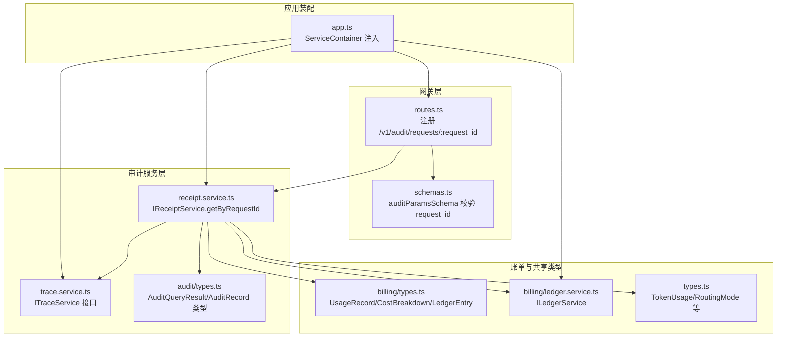
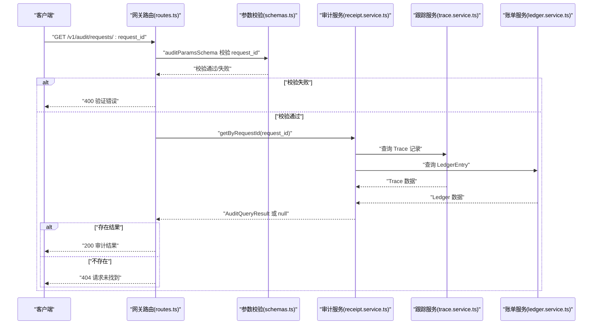
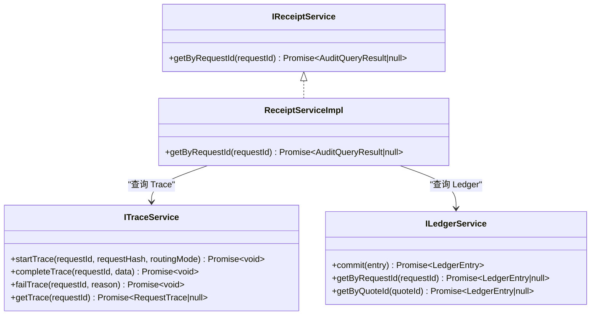
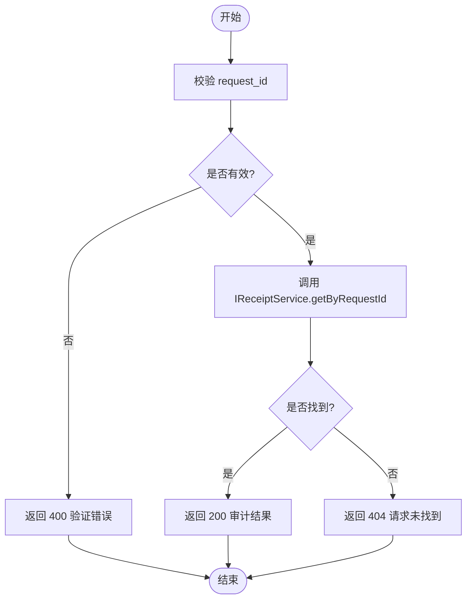
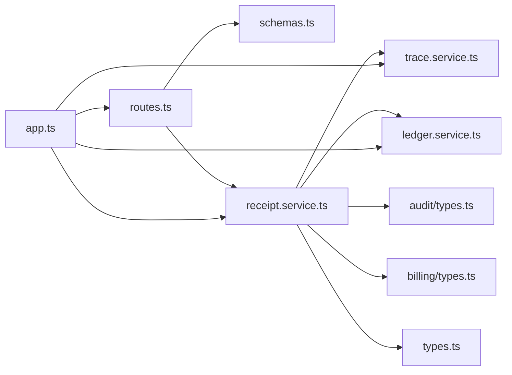

# 审计查询端点

<cite>
**本文引用的文件**
- [src/gateway/routes.ts](file://src/gateway/routes.ts)
- [src/gateway/schemas.ts](file://src/gateway/schemas.ts)
- [src/audit/index.ts](file://src/audit/index.ts)
- [src/audit/receipt.service.ts](file://src/audit/receipt.service.ts)
- [src/audit/trace.service.ts](file://src/audit/trace.service.ts)
- [src/audit/types.ts](file://src/audit/types.ts)
- [src/types.ts](file://src/types.ts)
- [src/billing/types.ts](file://src/billing/types.ts)
- [src/billing/ledger.service.ts](file://src/billing/ledger.service.ts)
- [src/app.ts](file://src/app.ts)
- [docs/api-spec-v0-x402-gateway.md](file://docs/api-spec-v0-x402-gateway.md)
- [test/integration/flow.test.ts](file://test/integration/flow.test.ts)
</cite>

## 目录
1. [简介](#简介)
2. [项目结构](#项目结构)
3. [核心组件](#核心组件)
4. [架构总览](#架构总览)
5. [详细组件分析](#详细组件分析)
6. [依赖关系分析](#依赖关系分析)
7. [性能考虑](#性能考虑)
8. [故障排查指南](#故障排查指南)
9. [结论](#结论)
10. [附录](#附录)

## 简介
本文件为 /v1/audit/requests/:request_id 审计查询端点提供完整的技术文档。该端点用于查询已完成请求的路由决策证据与结算信息，返回结构严格遵循 API 规范第 5 节定义。文档涵盖：
- 路径参数 request_id 的格式要求与验证规则
- 审计响应的数据结构与字段含义（路由决策、使用量、成本明细、支付证据）
- 查询流程与错误处理
- 参数验证、错误码映射与安全注意事项
- 性能优化建议与可扩展性设计

## 项目结构
该审计能力由网关层路由、参数校验模式、审计服务与账单服务共同协作完成。核心文件分布如下：
- 网关路由与参数校验：src/gateway/routes.ts、src/gateway/schemas.ts
- 审计服务与类型：src/audit/receipt.service.ts、src/audit/trace.service.ts、src/audit/types.ts、src/audit/index.ts
- 共享类型与账单类型：src/types.ts、src/billing/types.ts、src/billing/ledger.service.ts
- 应用装配与服务容器：src/app.ts
- API 规范与集成测试：docs/api-spec-v0-x402-gateway.md、test/integration/flow.test.ts

图表来源
- [src/gateway/routes.ts:78-94](file://src/gateway/routes.ts#L78-L94)
- [src/gateway/schemas.ts:24-27](file://src/gateway/schemas.ts#L24-L27)
- [src/audit/receipt.service.ts:4-12](file://src/audit/receipt.service.ts#L4-L12)
- [src/audit/trace.service.ts:4-36](file://src/audit/trace.service.ts#L4-L36)
- [src/audit/types.ts:14-37](file://src/audit/types.ts#L14-L37)
- [src/billing/types.ts:3-31](file://src/billing/types.ts#L3-L31)
- [src/billing/ledger.service.ts:3-15](file://src/billing/ledger.service.ts#L3-L15)
- [src/app.ts:21-33](file://src/app.ts#L21-L33)

章节来源
- [src/gateway/routes.ts:78-94](file://src/gateway/routes.ts#L78-L94)
- [src/gateway/schemas.ts:24-27](file://src/gateway/schemas.ts#L24-L27)
- [src/audit/receipt.service.ts:4-12](file://src/audit/receipt.service.ts#L4-L12)
- [src/audit/trace.service.ts:4-36](file://src/audit/trace.service.ts#L4-L36)
- [src/audit/types.ts:14-37](file://src/audit/types.ts#L14-L37)
- [src/billing/types.ts:3-31](file://src/billing/types.ts#L3-L31)
- [src/billing/ledger.service.ts:3-15](file://src/billing/ledger.service.ts#L3-L15)
- [src/app.ts:21-33](file://src/app.ts#L21-L33)

## 核心组件
- 路由与参数校验
  - 路由注册：在网关层注册 GET /v1/audit/requests/:request_id，并通过 auditParamsSchema 对路径参数进行校验。
  - 参数要求：request_id 必填且长度大于 0。
- 审计服务
  - IReceiptService.getByRequestId：根据 request_id 拼装审计结果，返回 AuditQueryResult 或 null。
  - 当未找到时，应返回 404。
- 账单与类型
  - UsageRecord、CostBreakdown、LedgerEntry 提供使用量、成本与账单证据的数据模型。
  - TokenUsage、RoutingMode 等共享类型贯穿审计结果。
- 应用装配
  - ServiceContainer 将审计服务注入到路由处理器中，便于后续实现。

章节来源
- [src/gateway/routes.ts:78-94](file://src/gateway/routes.ts#L78-L94)
- [src/gateway/schemas.ts:24-27](file://src/gateway/schemas.ts#L24-L27)
- [src/audit/receipt.service.ts:4-12](file://src/audit/receipt.service.ts#L4-L12)
- [src/billing/types.ts:3-31](file://src/billing/types.ts#L3-L31)
- [src/types.ts:36-40](file://src/types.ts#L36-L40)

## 架构总览
审计查询端点的调用链路如下：
- 客户端发起 GET /v1/audit/requests/:request_id
- 路由层解析路径参数并进行校验
- 调用审计服务 IReceiptService.getByRequestId
- 审计服务从跟踪服务、账单服务等聚合数据，组装为审计结果
- 返回 200 成功或 404 未找到

图表来源
- [src/gateway/routes.ts:78-94](file://src/gateway/routes.ts#L78-L94)
- [src/gateway/schemas.ts:24-27](file://src/gateway/schemas.ts#L24-L27)
- [src/audit/receipt.service.ts:14-25](file://src/audit/receipt.service.ts#L14-L25)
- [src/audit/trace.service.ts:34-36](file://src/audit/trace.service.ts#L34-L36)
- [src/billing/ledger.service.ts:10-15](file://src/billing/ledger.service.ts#L10-L15)

## 详细组件分析

### 路由与参数校验
- 路由定义
  - 在 routes.ts 中注册 GET /v1/audit/requests/:request_id，当前实现返回 501（未实现）。
- 参数校验
  - auditParamsSchema 对 request_id 进行最小长度校验（>0），确保非空字符串。
- 错误处理
  - 当前路由层未接入审计服务，直接返回 501；后续应接入 IReceiptService 并按规范返回 404。

章节来源
- [src/gateway/routes.ts:78-94](file://src/gateway/routes.ts#L78-L94)
- [src/gateway/schemas.ts:24-27](file://src/gateway/schemas.ts#L24-L27)

### 审计服务接口与实现
- IReceiptService
  - getByRequestId：接收 RequestId，返回 AuditQueryResult 或 null。
  - 当未找到时，应返回 null，以便上层路由返回 404。
- 实现要点
  - 查询 Trace 记录（ITraceService.getTrace）
  - 查询账单证据（ILedgerService.getByRequestId）
  - 组装审计结果（AuditQueryResult）

图表来源
- [src/audit/receipt.service.ts:4-12](file://src/audit/receipt.service.ts#L4-L12)
- [src/audit/trace.service.ts:4-36](file://src/audit/trace.service.ts#L4-L36)
- [src/billing/ledger.service.ts:3-15](file://src/billing/ledger.service.ts#L3-L15)

章节来源
- [src/audit/receipt.service.ts:4-12](file://src/audit/receipt.service.ts#L4-L12)
- [src/audit/trace.service.ts:4-36](file://src/audit/trace.service.ts#L4-L36)
- [src/billing/ledger.service.ts:3-15](file://src/billing/ledger.service.ts#L3-L15)

### 审计响应数据结构
- AuditQueryResult 字段说明
  - request_id：请求标识符
  - request_hash：请求哈希
  - routing_mode：路由模式（manual/auto）
  - route_decision：路由决策
    - selected_model：最终选择的模型
    - fallback_chain：回退链
    - score_summary：评分摘要
  - usage：使用量统计
    - prompt_tokens：提示词令牌数
    - completion_tokens：生成令牌数
    - total_tokens：总令牌数
  - cost：成本明细
    - subtotal_usd：小计美元
    - platform_fee_usd：平台费用美元
    - total_usd：总计美元
  - payment：支付证据
    - quote_id：报价标识
    - chain：链
    - asset：资产
    - payer_address：付款人地址
    - verification_status：验证状态

章节来源
- [src/audit/types.ts:14-37](file://src/audit/types.ts#L14-L37)
- [src/types.ts:36-40](file://src/types.ts#L36-L40)
- [src/types.ts:90-108](file://src/types.ts#L90-L108)

### 账单与使用量模型
- UsageRecord：单次请求的令牌用量
- CostBreakdown：确定性的成本分解
- LedgerEntry：不可变的账单条目，包含 quote_id、payer_address、usage、cost 等

章节来源
- [src/billing/types.ts:3-31](file://src/billing/types.ts#L3-L31)

### 路由决策与评分摘要
- 路由决策元数据（RouteDecision）包含 selected_model、fallback_chain、score_summary、route_proof_hash。
- 审计结果中的 route_decision 字段与 RouteDecision 保持一致，但不包含 route_proof_hash。

章节来源
- [src/router/types.ts:1-7](file://src/router/types.ts#L1-L7)
- [src/audit/types.ts:19-23](file://src/audit/types.ts#L19-L23)

### 查询流程与错误处理
- 正常流程
  - 校验 request_id
  - 通过 IReceiptService 获取审计结果
  - 若存在则返回 200，否则返回 404
- 错误处理
  - 参数校验失败：返回 400
  - 服务未实现：返回 501
  - 未找到：返回 404
  - 其他内部错误：返回 500

图表来源
- [src/gateway/schemas.ts:24-27](file://src/gateway/schemas.ts#L24-L27)
- [src/gateway/routes.ts:78-94](file://src/gateway/routes.ts#L78-L94)
- [src/audit/receipt.service.ts:14-25](file://src/audit/receipt.service.ts#L14-L25)

## 依赖关系分析
- 组件耦合
  - routes.ts 仅负责薄层处理，参数校验与业务逻辑分离，符合单一职责。
  - IReceiptService 依赖 ITraceService 与 ILedgerService，形成清晰的聚合边界。
- 外部依赖
  - 使用 Zod 进行参数校验
  - 使用 Fastify 作为运行时框架
- 可能的循环依赖
  - 当前模块间无循环导入，结构清晰

图表来源
- [src/gateway/routes.ts:78-94](file://src/gateway/routes.ts#L78-L94)
- [src/gateway/schemas.ts:24-27](file://src/gateway/schemas.ts#L24-L27)
- [src/audit/receipt.service.ts:4-12](file://src/audit/receipt.service.ts#L4-L12)
- [src/audit/trace.service.ts:4-36](file://src/audit/trace.service.ts#L4-L36)
- [src/billing/ledger.service.ts:3-15](file://src/billing/ledger.service.ts#L3-L15)
- [src/audit/types.ts:14-37](file://src/audit/types.ts#L14-L37)
- [src/billing/types.ts:3-31](file://src/billing/types.ts#L3-L31)
- [src/types.ts:36-40](file://src/types.ts#L36-L40)
- [src/app.ts:21-33](file://src/app.ts#L21-L33)

章节来源
- [src/gateway/routes.ts:78-94](file://src/gateway/routes.ts#L78-L94)
- [src/audit/receipt.service.ts:4-12](file://src/audit/receipt.service.ts#L4-L12)
- [src/audit/trace.service.ts:4-36](file://src/audit/trace.service.ts#L4-L36)
- [src/billing/ledger.service.ts:3-15](file://src/billing/ledger.service.ts#L3-L15)
- [src/audit/types.ts:14-37](file://src/audit/types.ts#L14-L37)
- [src/billing/types.ts:3-31](file://src/billing/types.ts#L3-L31)
- [src/types.ts:36-40](file://src/types.ts#L36-L40)
- [src/app.ts:21-33](file://src/app.ts#L21-L33)

## 性能考虑
- 缓存策略
  - 对高频查询的审计结果可引入只读缓存（如 Redis），设置合理 TTL，避免重复查询数据库。
- 数据库访问
  - 合理索引：request_id、quote_id 等常用查询键需建立索引。
  - 批量查询：若未来支持批量审计，可合并查询以减少往返。
- 响应序列化
  - 使用流式或分页策略（如适用）降低大对象序列化开销。
- 并发控制
  - 对同一 request_id 的并发查询可采用互斥或去重队列，避免重复计算。
- 日志与监控
  - 记录慢查询与错误率，结合指标监控评估性能瓶颈。

## 故障排查指南
- 常见问题
  - 400 验证错误：检查 request_id 是否为空或格式不符。
  - 501 未实现：确认审计服务已实现并注入到 ServiceContainer。
  - 404 请求未找到：确认请求是否已完成、是否存在对应 Trace/Ledger 记录。
  - 500 内部错误：检查审计服务与账单服务的实现是否抛出异常。
- 测试参考
  - 集成测试中对 /v1/audit/requests/:request_id 的行为有明确断言，可作为回归测试依据。

章节来源
- [test/integration/flow.test.ts:39-49](file://test/integration/flow.test.ts#L39-L49)
- [src/gateway/routes.ts:78-94](file://src/gateway/routes.ts#L78-L94)

## 结论
/v1/audit/requests/:request_id 端点目前处于未实现阶段，但其架构设计清晰、职责分离良好。实现时应重点关注：
- 参数校验与错误码映射
- 审计结果的数据拼装与一致性
- 与跟踪与账单服务的集成
- 性能与可扩展性设计

## 附录

### API 规范摘要（审计查询）
- 端点：GET /v1/audit/requests/{request_id}
- 请求头：无特殊头要求
- 路径参数：
  - request_id：必填，字符串，长度 > 0
- 成功响应：200，返回审计结果对象
- 错误响应：
  - 400：参数校验失败
  - 404：请求未找到
  - 501：功能未实现
  - 500：内部错误

章节来源
- [docs/api-spec-v0-x402-gateway.md:129-163](file://docs/api-spec-v0-x402-gateway.md#L129-L163)
- [src/gateway/schemas.ts:24-27](file://src/gateway/schemas.ts#L24-L27)
- [src/gateway/routes.ts:78-94](file://src/gateway/routes.ts#L78-L94)