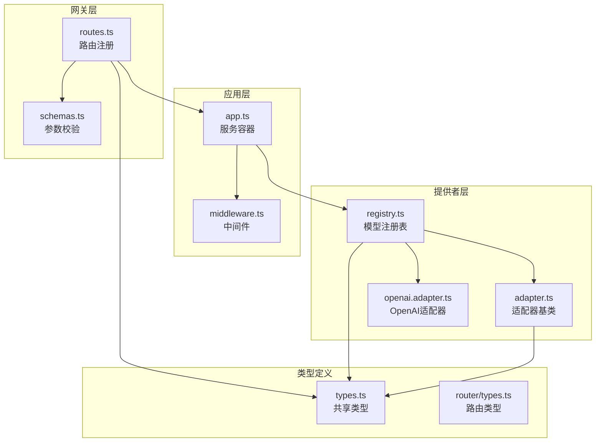
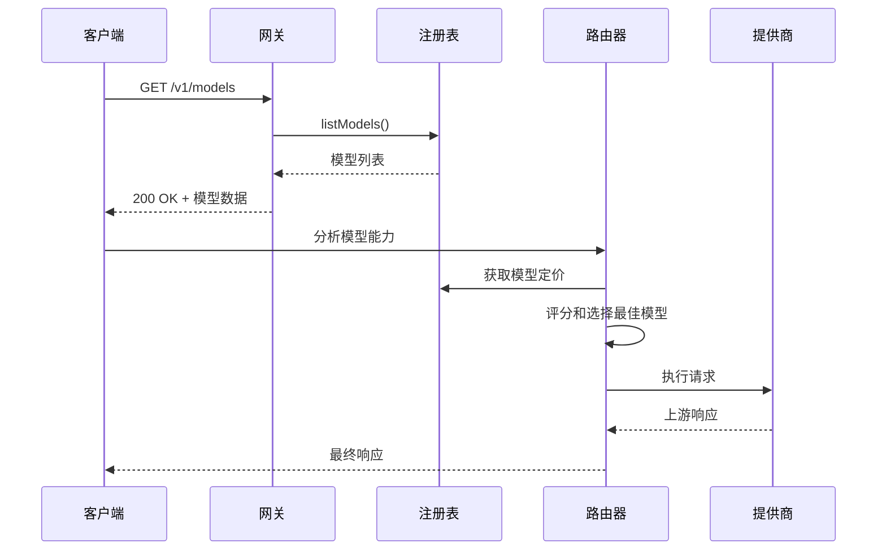
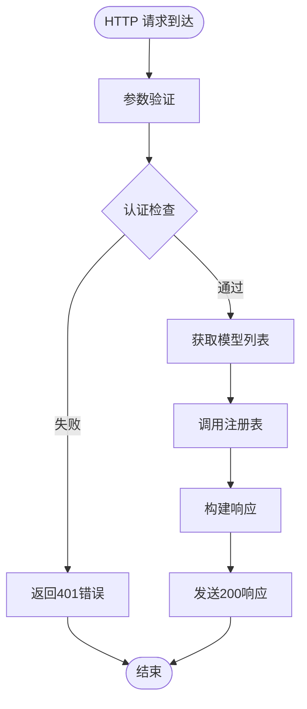
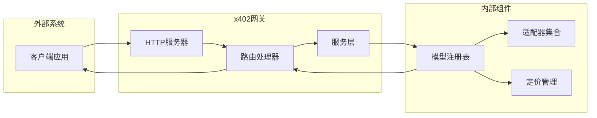
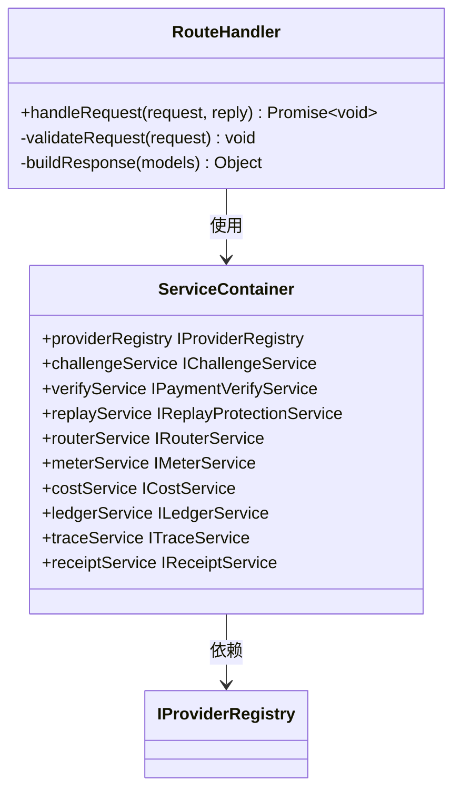
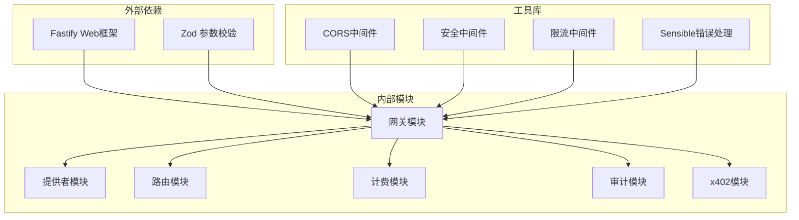
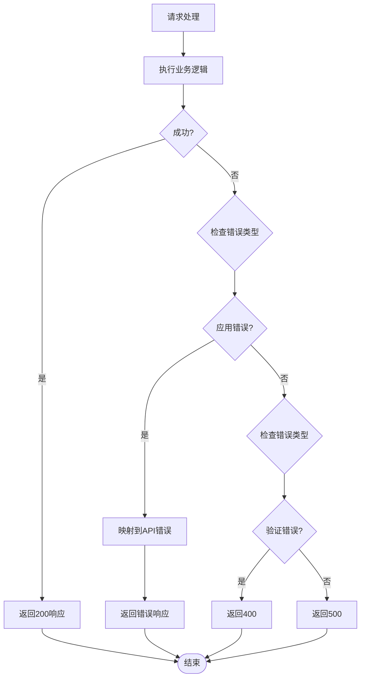

# 模型目录端点

<cite>
**本文档引用的文件**
- [routes.ts](file://src/gateway/routes.ts)
- [types.ts](file://src/types.ts)
- [registry.ts](file://src/provider/registry.ts)
- [index.ts](file://src/app.ts)
- [api-spec-v0-x402-gateway.md](file://docs/api-spec-v0-x402-gateway.md)
- [router.service.ts](file://src/router/router.service.ts)
- [policy.ts](file://src/router/policy.ts)
- [errors.ts](file://src/errors.ts)
</cite>

## 目录
1. [简介](#简介)
2. [项目结构](#项目结构)
3. [核心组件](#核心组件)
4. [架构概览](#架构概览)
5. [详细组件分析](#详细组件分析)
6. [依赖关系分析](#依赖关系分析)
7. [性能考虑](#性能考虑)
8. [故障排除指南](#故障排除指南)
9. [结论](#结论)

## 简介

本文档详细说明了 `/v1/models` 端点的 API 规范，该端点用于查询可用的模型目录和定价元数据。该端点采用 GET 方法，返回当前系统中所有可用模型的完整信息，包括模型标识符、提供商信息、上下文窗口大小、功能特性以及定价信息。

该端点是 x402 网关架构中的关键组件，为客户端提供了模型发现和选择的基础数据。通过统一的模型目录接口，客户端可以了解所有可用的 LLM 模型及其特性，从而做出明智的路由决策。

## 项目结构

`/v1/models` 端点的实现遵循清晰的分层架构：

**图表来源**
- [routes.ts:1-96](file://src/gateway/routes.ts#L1-L96)
- [app.ts:1-101](file://src/app.ts#L1-L101)
- [registry.ts:1-65](file://src/provider/registry.ts#L1-L65)

**章节来源**
- [routes.ts:1-96](file://src/gateway/routes.ts#L1-L96)
- [app.ts:1-101](file://src/app.ts#L1-L101)

## 核心组件

### 模型目录数据结构

模型目录端点返回的数据结构基于统一的类型定义，包含以下核心组件：

#### 模型信息结构
- **id**: 模型唯一标识符，格式为 "provider/model-id"
- **provider**: 提供商名称
- **context_window**: 上下文窗口大小（整数）
- **capabilities**: 模型功能特性数组
- **pricing**: 定价信息对象

#### 定价元数据结构
- **input_usd_per_token**: 输入令牌单价（字符串格式的十进制数）
- **output_usd_per_token**: 输出令牌单价（字符串格式的十进制数）
- **effective_at**: 定价生效时间戳

#### 响应包装结构
- **data**: 包含所有模型信息的数组

**章节来源**
- [types.ts:68-84](file://src/types.ts#L68-L84)

### 路由决策支持

模型目录不仅提供静态信息，还为后续的路由决策提供基础数据：

**图表来源**
- [routes.ts:73-76](file://src/gateway/routes.ts#L73-L76)
- [registry.ts:52-54](file://src/provider/registry.ts#L52-L54)
- [router.service.ts:5-18](file://src/router/router.service.ts#L5-L18)

**章节来源**
- [router.service.ts:1-50](file://src/router/router.service.ts#L1-L50)
- [policy.ts:1-33](file://src/router/policy.ts#L1-L33)

## 架构概览

### 端点工作流程

`/v1/models` 端点的完整工作流程如下：

**图表来源**
- [routes.ts:73-76](file://src/gateway/routes.ts#L73-L76)
- [registry.ts:52-54](file://src/provider/registry.ts#L52-L54)

### 数据流图

**图表来源**
- [app.ts:77-94](file://src/app.ts#L77-L94)
- [routes.ts:9-96](file://src/gateway/routes.ts#L9-L96)

## 详细组件分析

### 路由处理器实现

路由处理器负责处理 `/v1/models` 请求，其核心逻辑简洁而高效：

**图表来源**
- [routes.ts:73-76](file://src/gateway/routes.ts#L73-L76)
- [app.ts:22-33](file://src/app.ts#L22-L33)

### 模型注册表设计

模型注册表采用内存存储机制，提供高效的模型查询能力：

#### 注册表接口
- `register(modelId, adapter, pricing)`: 注册新模型
- `getAdapter(modelId)`: 获取模型适配器
- `listModels()`: 返回所有可用模型
- `getModelPricing(modelId)`: 获取特定模型定价

#### 内存存储策略
- 使用 Map 数据结构存储模型条目
- 每个模型条目包含信息和适配器
- 默认上下文窗口设置为 128000
- 默认功能特性包含 "chat"

**章节来源**
- [registry.ts:4-16](file://src/provider/registry.ts#L4-L16)
- [registry.ts:27-64](file://src/provider/registry.ts#L27-L64)

### 类型系统设计

系统采用 TypeScript 类型系统确保数据结构的一致性和完整性：

#### 核心类型定义
- `ModelInfo`: 模型基本信息
- `ModelPricing`: 定价信息
- `ModelListResponse`: 列表响应包装
- `RouteDecision`: 路由决策元数据

#### 类型约束
- 使用品牌类型防止类型混淆
- 字符串格式的价格值确保精度
- 枚举类型限制路由模式取值

**章节来源**
- [types.ts:68-84](file://src/types.ts#L68-L84)

## 依赖关系分析

### 组件耦合度

系统的模块化设计实现了良好的低耦合高内聚：

**图表来源**
- [app.ts:1-101](file://src/app.ts#L1-L101)
- [routes.ts:1-96](file://src/gateway/routes.ts#L1-L96)

### 服务容器模式

应用采用服务容器模式管理依赖注入：

#### 服务容器接口
- `providerRegistry`: 模型注册表
- `challengeService`: 挑战服务
- `verifyService`: 支付验证服务
- `replayService`: 重放保护服务
- `routerService`: 路由服务
- `meterService`: 计量服务
- `costService`: 成本计算服务
- `ledgerService`: 账本服务
- `traceService`: 追踪服务
- `receiptService`: 凭证服务

**章节来源**
- [app.ts:22-33](file://src/app.ts#L22-L33)

## 性能考虑

### 缓存策略

由于模型目录相对静态，建议实施适当的缓存策略：

- **内存缓存**: 使用 Map 结构存储模型信息
- **响应头优化**: 设置合适的 Cache-Control 头
- **批量更新**: 支持批量模型注册和更新

### 查询优化

- **索引设计**: 为模型 ID 和提供商建立索引
- **分页支持**: 对于大量模型时支持分页查询
- **条件过滤**: 支持按提供商或功能特性的过滤查询

### 并发处理

- **无状态设计**: 路由处理器保持无状态以支持水平扩展
- **连接池**: 数据库连接使用连接池管理
- **超时控制**: 设置合理的请求超时时间

## 故障排除指南

### 常见错误场景

#### 404 错误
- **原因**: 模型未找到或注册表为空
- **解决方案**: 检查模型注册过程和配置

#### 500 错误
- **原因**: 服务器内部错误
- **解决方案**: 查看服务器日志和错误堆栈

#### 501 错误
- **原因**: 功能尚未实现
- **解决方案**: 等待功能完善或使用替代方案

### 错误处理机制

系统采用统一的错误处理机制：

**图表来源**
- [errors.ts:1-105](file://src/errors.ts#L1-L105)
- [app.ts:53-70](file://src/app.ts#L53-L70)

**章节来源**
- [errors.ts:1-105](file://src/errors.ts#L1-L105)
- [app.ts:53-70](file://src/app.ts#L53-L70)

## 结论

`/v1/models` 端点作为 x402 网关的核心组件，提供了完整的模型目录查询功能。通过清晰的架构设计、严格的类型系统和完善的错误处理机制，该端点为上层应用提供了可靠的基础服务。

该端点的设计充分考虑了可扩展性和性能要求，支持未来的功能增强和集成需求。随着系统的发展，该端点将继续发挥关键作用，为智能路由和成本优化提供重要支撑。