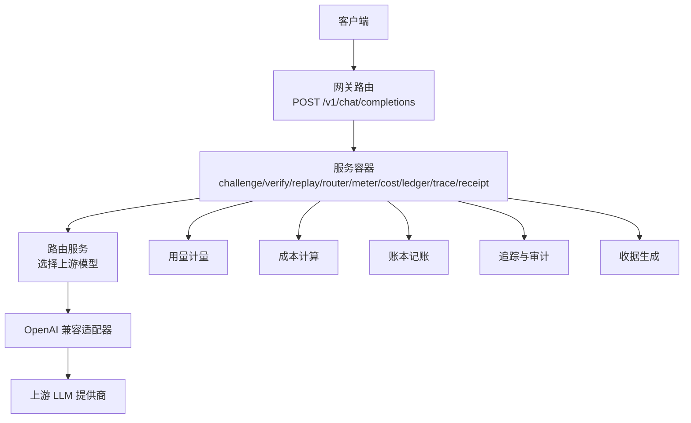
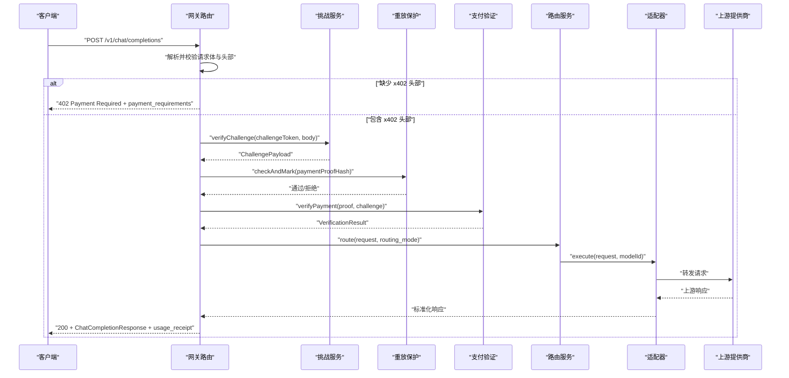
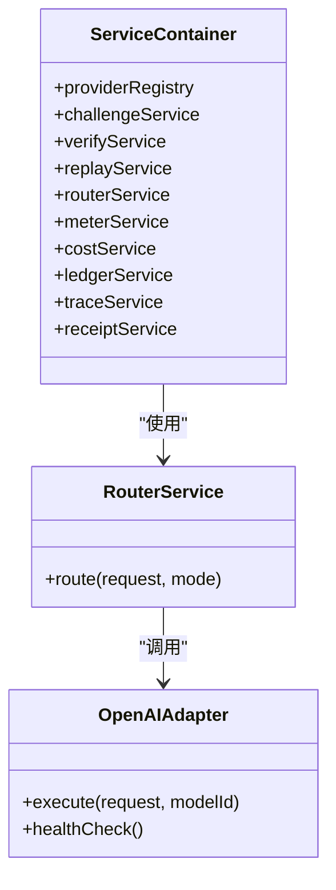

# 聊天补全端点

<cite>
**本文引用的文件**
- [src/gateway/routes.ts](file://src/gateway/routes.ts)
- [src/gateway/schemas.ts](file://src/gateway/schemas.ts)
- [src/types.ts](file://src/types.ts)
- [src/x402/types.ts](file://src/x402/types.ts)
- [src/x402/challenge.service.ts](file://src/x402/challenge.service.ts)
- [src/x402/verify.service.ts](file://src/x402/verify.service.ts)
- [src/x402/replay.service.ts](file://src/x402/replay.service.ts)
- [src/router/router.service.ts](file://src/router/router.service.ts)
- [src/billing/meter.service.ts](file://src/billing/meter.service.ts)
- [src/billing/types.ts](file://src/billing/types.ts)
- [src/provider/openai.adapter.ts](file://src/provider/openai.adapter.ts)
- [src/provider/types.ts](file://src/provider/types.ts)
- [src/app.ts](file://src/app.ts)
- [test/integration/flow.test.ts](file://test/integration/flow.test.ts)
- [docs/api-spec-v0-x402-gateway.md](file://docs/api-spec-v0-x402-gateway.md)
</cite>

## 目录
1. [简介](#简介)
2. [项目结构](#项目结构)
3. [核心组件](#核心组件)
4. [架构总览](#架构总览)
5. [详细组件分析](#详细组件分析)
6. [依赖关系分析](#依赖关系分析)
7. [性能考虑](#性能考虑)
8. [故障排查指南](#故障排查指南)
9. [结论](#结论)
10. [附录](#附录)

## 简介
本文件为 /v1/chat/completions 端点的详细 API 文档，覆盖以下内容：
- 请求方法与兼容性：基于 OpenAI 的聊天补全接口风格
- 请求体结构与参数：messages 数组、model、temperature、stream、routing_mode 等
- 头部参数：x402 挑战与支付头、幂等性键
- 响应格式：ChatCompletionResponse 与 usage_receipt
- x402 支付流程：402 挑战响应、支付证明校验、重放保护
- 成功与支付挑战场景的请求/响应示例
- 错误处理策略、状态码与常见问题

## 项目结构
该服务采用分层设计：
- 网关层（Fastify）负责路由注册、参数解析与错误处理
- 业务服务层（挑战、支付验证、重放保护、路由、计费、账本、审计）
- 上游适配器层（OpenAI 兼容）

图表来源
- [src/gateway/routes.ts:9-67](file://src/gateway/routes.ts#L9-L67)
- [src/app.ts:21-94](file://src/app.ts#L21-L94)
- [src/router/router.service.ts:5-49](file://src/router/router.service.ts#L5-L49)
- [src/provider/openai.adapter.ts:10-43](file://src/provider/openai.adapter.ts#L10-L43)

章节来源
- [src/gateway/routes.ts:9-67](file://src/gateway/routes.ts#L9-L67)
- [src/app.ts:35-100](file://src/app.ts#L35-L100)

## 核心组件
- 路由与处理器：注册 /v1/chat/completions，解析请求体与头部，执行 x402 流程
- 参数校验：使用 Zod 对请求体与 x402 头部进行强类型校验
- 数据模型：ChatCompletionRequest/Response、UsageReceipt、ModelInfo 等
- x402 服务：挑战生成/校验、支付证明验证、重放保护
- 路由与适配：根据 routing_mode 选择上游模型并调用适配器
- 计费与账本：用量记录、成本计算、不可变账本条目
- 审计与收据：路由决策证据、结算证据、usage_receipt

章节来源
- [src/gateway/schemas.ts:3-31](file://src/gateway/schemas.ts#L3-L31)
- [src/types.ts:17-62](file://src/types.ts#L17-L62)
- [src/x402/types.ts:1-37](file://src/x402/types.ts#L1-L37)
- [src/router/router.service.ts:5-49](file://src/router/router.service.ts#L5-L49)
- [src/billing/types.ts:3-31](file://src/billing/types.ts#L3-L31)
- [src/provider/types.ts:3-35](file://src/provider/types.ts#L3-L35)

## 架构总览
下图展示从客户端到上游模型的完整调用链路，以及 x402 支付流程在其中的位置。

图表来源
- [src/gateway/routes.ts:23-67](file://src/gateway/routes.ts#L23-L67)
- [src/x402/challenge.service.ts:4-26](file://src/x402/challenge.service.ts#L4-L26)
- [src/x402/replay.service.ts:3-21](file://src/x402/replay.service.ts#L3-L21)
- [src/x402/verify.service.ts:3-16](file://src/x402/verify.service.ts#L3-L16)
- [src/router/router.service.ts:14-17](file://src/router/router.service.ts#L14-L17)
- [src/provider/openai.adapter.ts:25-34](file://src/provider/openai.adapter.ts#L25-L34)

## 详细组件分析

### 接口定义与请求体规范
- HTTP 方法：POST
- 路径：/v1/chat/completions
- 兼容性：OpenAI 兼容的聊天补全请求体
- 必填字段：model、messages（至少一条）
- 可选字段：temperature（范围 0..2）、stream（默认 false）、routing_mode（默认 manual）
- 头部要求（支付重试路径）：x-402-challenge、x-402-payment、idempotency-key（UUID）

章节来源
- [src/gateway/schemas.ts:4-15](file://src/gateway/schemas.ts#L4-L15)
- [docs/api-spec-v0-x402-gateway.md:25-44](file://docs/api-spec-v0-x402-gateway.md#L25-L44)

### 响应格式
- 成功响应：标准 OpenAI 风格的聊天补全响应，额外包含 usage_receipt
- 关键字段：
  - choices：包含 message（role/content）与 finish_reason
  - usage：prompt_tokens、completion_tokens、total_tokens
  - usage_receipt：包含 request_id、quote_id、payer_address、routing_mode、model_used、单价与总费用、route_proof_hash

章节来源
- [src/types.ts:54-62](file://src/types.ts#L54-L62)
- [docs/api-spec-v0-x402-gateway.md:69-103](file://docs/api-spec-v0-x402-gateway.md#L69-L103)

### x402 支付流程详解
- 402 挑战响应：当缺少 x402 头部时，返回 402，并携带 payment_requirements
- 支付要求字段：quote_id、chain、asset、amount、expires_at、merchant_address、request_hash、challenge_token
- 支付重试路径：
  1) 校验挑战令牌与请求哈希绑定
  2) 重放保护检查
  3) 校验支付证明（金额、资产、收款人）
  4) 路由到上游模型
  5) 记录用量、计算成本、提交账本
  6) 返回带 usage_receipt 的 200 响应

章节来源
- [src/gateway/routes.ts:23-67](file://src/gateway/routes.ts#L23-L67)
- [src/x402/types.ts:19-36](file://src/x402/types.ts#L19-L36)
- [docs/api-spec-v0-x402-gateway.md:46-67](file://docs/api-spec-v0-x402-gateway.md#L46-L67)

### 头部参数说明
- Content-Type：application/json
- X-402-Challenge：挑战令牌（重试时必填）
- X-402-Payment：支付证明（重试时必填）
- Idempotency-Key：UUID，用于幂等性与缓存

章节来源
- [src/gateway/schemas.ts:17-22](file://src/gateway/schemas.ts#L17-L22)
- [docs/api-spec-v0-x402-gateway.md:25-30](file://docs/api-spec-v0-x402-gateway.md#L25-L30)

### 请求/响应示例

- 成功场景（简化示意）
  - 请求：POST /v1/chat/completions（含 x402 头部与有效支付）
  - 响应：200，包含 choices、usage、usage_receipt
  - 参考：[示例响应结构:69-103](file://docs/api-spec-v0-x402-gateway.md#L69-L103)

- 支付挑战场景（简化示意）
  - 请求：POST /v1/chat/completions（无 x402 头部）
  - 响应：402，包含 error 与 payment_requirements
  - 参考：[402 响应结构:46-67](file://docs/api-spec-v0-x402-gateway.md#L46-L67)

- 集成测试验证
  - 未携带 x402 头部时返回 402
  - 参考：[集成测试:20-37](file://test/integration/flow.test.ts#L20-L37)

章节来源
- [test/integration/flow.test.ts:20-37](file://test/integration/flow.test.ts#L20-L37)
- [docs/api-spec-v0-x402-gateway.md:32-44](file://docs/api-spec-v0-x402-gateway.md#L32-L44)
- [docs/api-spec-v0-x402-gateway.md:46-67](file://docs/api-spec-v0-x402-gateway.md#L46-L67)
- [docs/api-spec-v0-x402-gateway.md:69-103](file://docs/api-spec-v0-x402-gateway.md#L69-L103)

### 错误处理与状态码
- 402：payment_required、challenge_expired、payment_verification_failed、payment_replayed、insufficient_payment
- 400：request_hash_mismatch
- 409：payment_replayed
- 503/504：upstream_unavailable、upstream_timeout
- 500：internal_error
- 400 验证错误：Zod 校验失败映射为 validation_error

章节来源
- [docs/api-spec-v0-x402-gateway.md:165-176](file://docs/api-spec-v0-x402-gateway.md#L165-L176)
- [src/app.ts:52-70](file://src/app.ts#L52-L70)

### 安全与幂等性规则
- 挑战令牌必须签名且短期有效
- request_hash 将挑战与请求体绑定
- 重试路径必须携带 idempotency-key
- 同一支付证明不得重复消费
- 支付金额/资产/收款人需与挑战一致

章节来源
- [docs/api-spec-v0-x402-gateway.md:177-183](file://docs/api-spec-v0-x402-gateway.md#L177-L183)

## 依赖关系分析
- 路由依赖服务容器中的各子服务
- 路由服务依赖适配器以访问上游提供商
- 计费与账本依赖用量记录与成本计算
- 审计依赖追踪与收据服务

图表来源
- [src/app.ts:21-33](file://src/app.ts#L21-L33)
- [src/router/router.service.ts:5-18](file://src/router/router.service.ts#L5-L18)
- [src/provider/openai.adapter.ts:10-43](file://src/provider/openai.adapter.ts#L10-L43)

章节来源
- [src/app.ts:77-94](file://src/app.ts#L77-L94)
- [src/router/router.service.ts:20-49](file://src/router/router.service.ts#L20-L49)
- [src/provider/types.ts:26-35](file://src/provider/types.ts#L26-L35)

## 性能考虑
- 路由策略：auto 模式下可引入评分与回退链，建议在路由前做轻量级预热与健康检查
- 计费与账本：批量写入与异步结算可降低尾延迟
- 缓存与幂等：合理设置幂等性 TTL，避免热点键竞争
- 上游适配：连接池与超时配置，避免阻塞请求队列

## 故障排查指南
- 402 场景
  - 检查 x-402-challenge 是否过期或与当前请求体不匹配
  - 确认 x-402-payment 金额/资产/收款人与挑战一致
  - 若提示 payment_replayed，请更换支付证明或等待重放窗口结束
- 400 场景
  - request_hash_mismatch：请求体被修改或未按规范序列化
- 5xx 场景
  - upstream_timeout/unavailable：上游不稳定，建议重试或切换模型
- 幂等性
  - 使用 idempotency-key 缓存响应，避免重复消费

章节来源
- [docs/api-spec-v0-x402-gateway.md:165-183](file://docs/api-spec-v0-x402-gateway.md#L165-L183)
- [src/app.ts:52-70](file://src/app.ts#L52-L70)

## 结论
/v1/chat/completions 在保持 OpenAI 兼容的同时，通过 x402 挑战-支付机制实现了无需传统 API Key 的授权与结算闭环。本文档提供了请求/响应规范、x402 流程、错误处理与排障建议，便于集成与运维。

## 附录

### OpenAI 兼容参数一览
- model：模型标识符或 auto
- messages：消息数组，每项包含 role 与 content
- temperature：采样温度（0..2）
- stream：是否流式返回
- routing_mode：manual/auto

章节来源
- [src/gateway/schemas.ts:4-15](file://src/gateway/schemas.ts#L4-L15)
- [docs/api-spec-v0-x402-gateway.md:32-44](file://docs/api-spec-v0-x402-gateway.md#L32-L44)

### usage_receipt 字段说明
- request_id：请求唯一标识
- quote_id：报价/挑战唯一标识
- payer_address：付款人地址
- routing_mode：路由模式
- model_used：实际使用的模型
- 单价与总费用：单位价格输入/输出与总费用
- route_proof_hash：路由决策与执行的摘要

章节来源
- [src/types.ts:42-52](file://src/types.ts#L42-L52)
- [docs/api-spec-v0-x402-gateway.md:91-101](file://docs/api-spec-v0-x402-gateway.md#L91-L101)