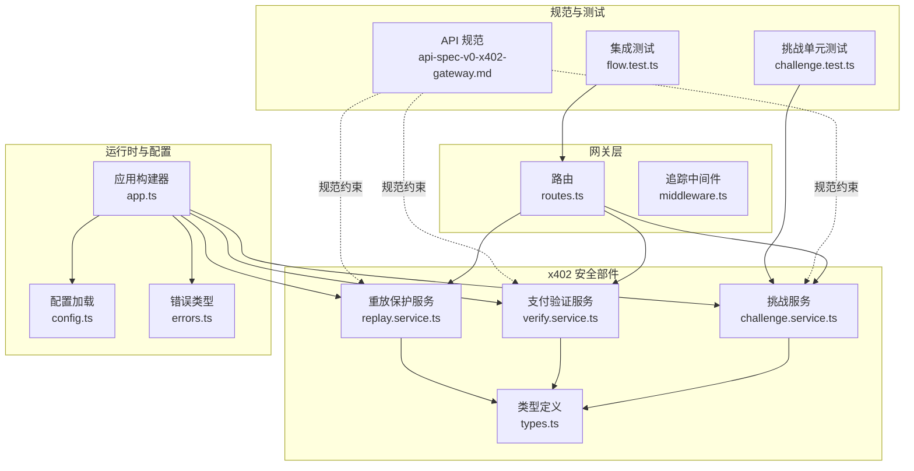
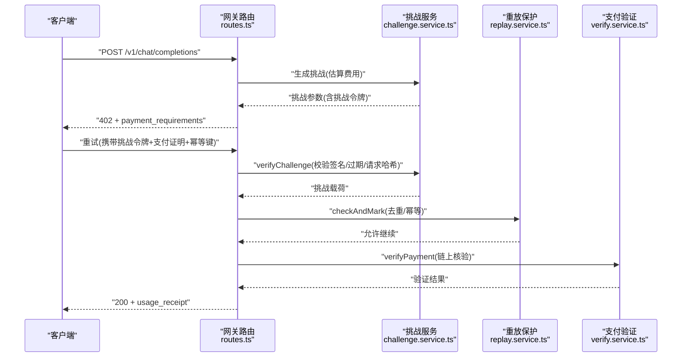
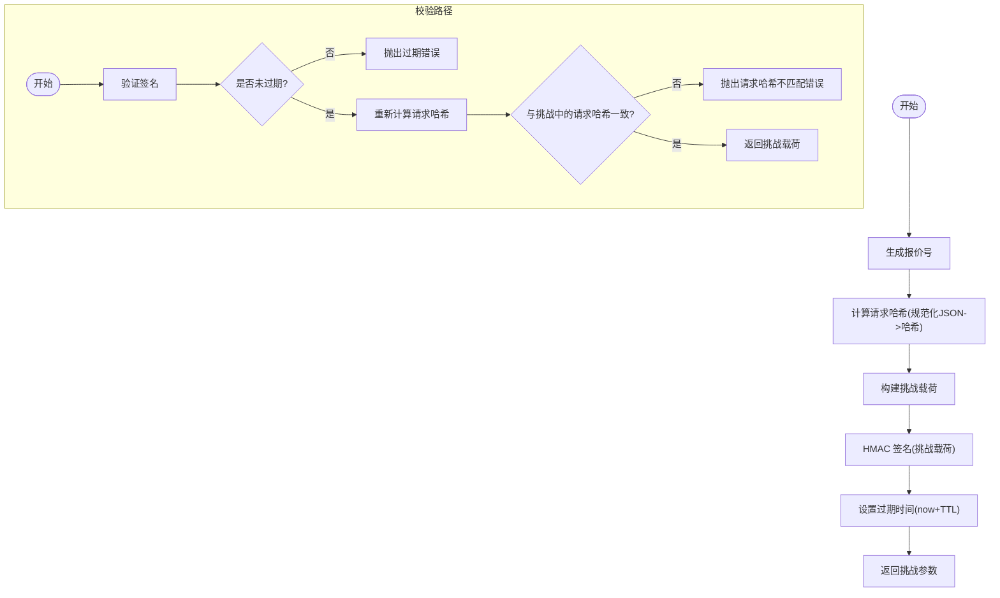
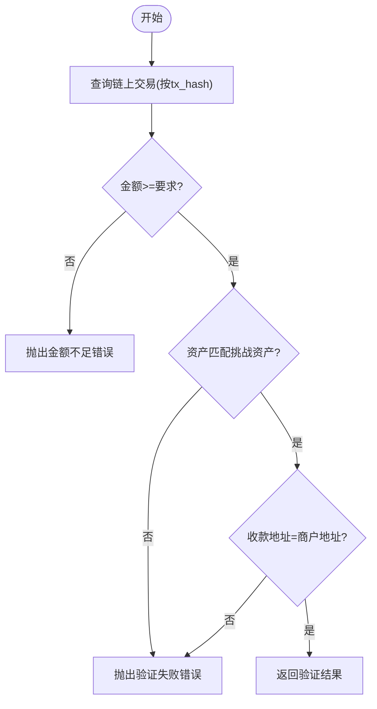
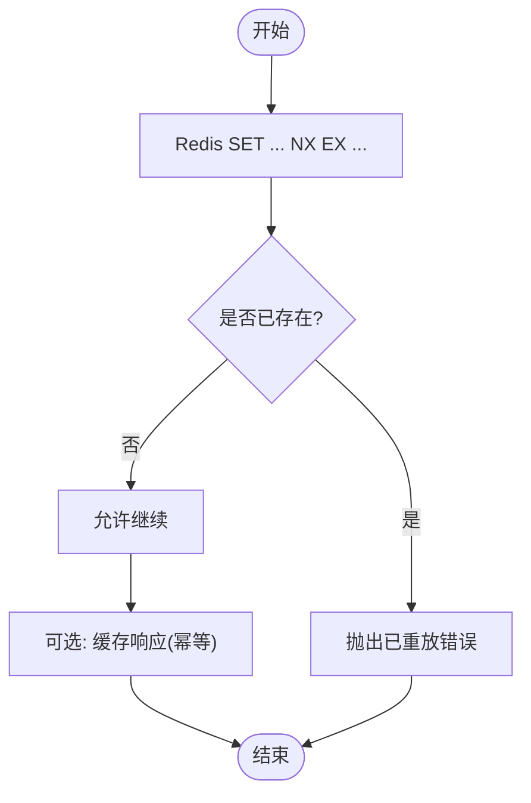
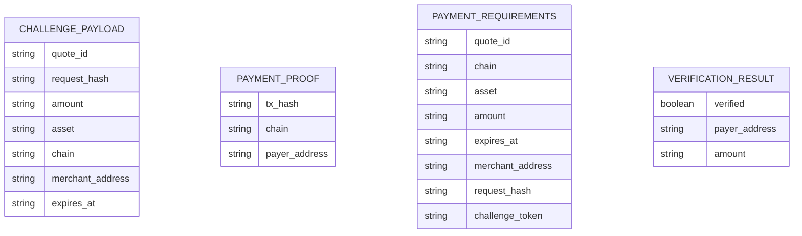
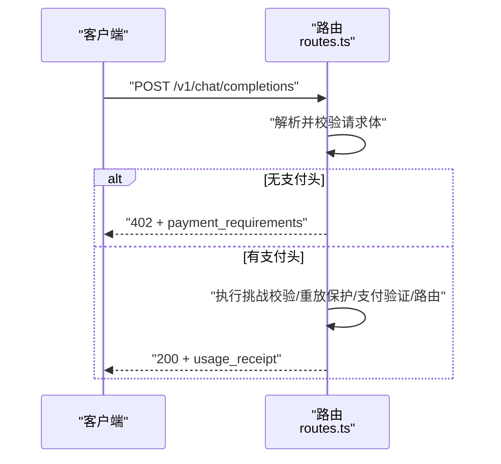
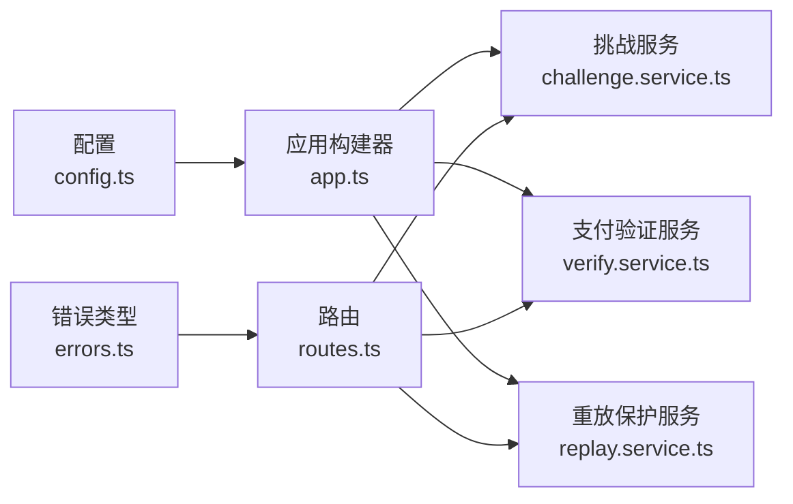

# x402 协议安全机制

<cite>
**本文引用的文件**
- [challenge.service.ts](file://src/x402/challenge.service.ts)
- [verify.service.ts](file://src/x402/verify.service.ts)
- [replay.service.ts](file://src/x402/replay.service.ts)
- [types.ts](file://src/x402/types.ts)
- [routes.ts](file://src/gateway/routes.ts)
- [middleware.ts](file://src/gateway/middleware.ts)
- [config.ts](file://src/config.ts)
- [app.ts](file://src/app.ts)
- [errors.ts](file://src/errors.ts)
- [api-spec-v0-x402-gateway.md](file://docs/api-spec-v0-x402-gateway.md)
- [challenge.test.ts](file://test/x402/challenge.test.ts)
- [flow.test.ts](file://test/integration/flow.test.ts)
</cite>

## 目录
1. [引言](#引言)
2. [项目结构](#项目结构)
3. [核心组件](#核心组件)
4. [架构总览](#架构总览)
5. [详细组件分析](#详细组件分析)
6. [依赖关系分析](#依赖关系分析)
7. [性能考量](#性能考量)
8. [故障排查指南](#故障排查指南)
9. [结论](#结论)
10. [附录](#附录)

## 引言
本文件系统性阐述 x402 支付协议在本仓库中的安全机制与实现要点，重点覆盖以下方面：
- 挑战-响应机制的安全原理：挑战令牌生成、HMAC 签名验证、过期时间控制
- 请求哈希绑定：如何通过 request_hash 防止请求内容被篡改或重放
- 挑战令牌生命周期管理、密钥轮换策略与安全存储要求
- 常见攻击向量的防护：重放攻击、请求修改攻击、时序攻击等
- 安全配置最佳实践与威胁模型分析

## 项目结构
x402 安全相关代码集中在 x402 子模块，并与网关路由、中间件、配置、错误类型以及 API 规范协同工作。

**图表来源**
- [routes.ts:1-96](file://src/gateway/routes.ts#L1-L96)
- [middleware.ts:1-13](file://src/gateway/middleware.ts#L1-L13)
- [challenge.service.ts:1-71](file://src/x402/challenge.service.ts#L1-L71)
- [verify.service.ts:1-34](file://src/x402/verify.service.ts#L1-L34)
- [replay.service.ts:1-52](file://src/x402/replay.service.ts#L1-L52)
- [types.ts:1-37](file://src/x402/types.ts#L1-L37)
- [app.ts:1-101](file://src/app.ts#L1-L101)
- [config.ts:1-46](file://src/config.ts#L1-L46)
- [errors.ts:1-106](file://src/errors.ts#L1-L106)
- [api-spec-v0-x402-gateway.md:1-198](file://docs/api-spec-v0-x402-gateway.md#L1-L198)
- [challenge.test.ts:1-28](file://test/x402/challenge.test.ts#L1-L28)
- [flow.test.ts:1-51](file://test/integration/flow.test.ts#L1-L51)

**章节来源**
- [routes.ts:1-96](file://src/gateway/routes.ts#L1-L96)
- [app.ts:1-101](file://src/app.ts#L1-L101)
- [config.ts:1-46](file://src/config.ts#L1-L46)
- [api-spec-v0-x402-gateway.md:1-198](file://docs/api-spec-v0-x402-gateway.md#L1-L198)

## 核心组件
- 挑战服务（ChallengeService）：负责生成挑战、校验挑战令牌、计算请求哈希
- 支付验证服务（PaymentVerifyService）：基于链上交易证明进行支付核验
- 重放保护服务（ReplayProtectionService）：基于 Redis 的幂等与去重能力
- 类型定义（types.ts）：统一挑战载荷、支付证明、返回体与验证结果的数据结构
- 错误类型（errors.ts）：映射到 API 规范的错误码与状态码
- 路由与中间件（routes.ts、middleware.ts）：HTTP 入口、追踪 ID 注入
- 配置（config.ts）：挑战密钥、TTL、商户地址、资产与链信息等

**章节来源**
- [challenge.service.ts:1-71](file://src/x402/challenge.service.ts#L1-L71)
- [verify.service.ts:1-34](file://src/x402/verify.service.ts#L1-L34)
- [replay.service.ts:1-52](file://src/x402/replay.service.ts#L1-L52)
- [types.ts:1-37](file://src/x402/types.ts#L1-L37)
- [errors.ts:1-106](file://src/errors.ts#L1-L106)
- [routes.ts:1-96](file://src/gateway/routes.ts#L1-L96)
- [middleware.ts:1-13](file://src/gateway/middleware.ts#L1-L13)
- [config.ts:1-46](file://src/config.ts#L1-L46)

## 架构总览
x402 在本系统中的安全流程如下：
- 无支付头时返回 402 并附带挑战参数
- 客户端携带挑战令牌与支付证明重试
- 服务端按顺序执行：挑战校验 → 重放保护 → 支付验证 → 上游路由与计费 → 返回含收据的 200 响应

**图表来源**
- [routes.ts:23-67](file://src/gateway/routes.ts#L23-L67)
- [challenge.service.ts:12-19](file://src/x402/challenge.service.ts#L12-L19)
- [replay.service.ts:9-21](file://src/x402/replay.service.ts#L9-L21)
- [verify.service.ts:3-16](file://src/x402/verify.service.ts#L3-L16)

## 详细组件分析

### 挑战服务（ChallengeService）
- 生成挑战
  - 计算请求哈希：对请求体进行规范化 JSON 序列化后做哈希，确保请求内容与挑战绑定
  - 构建挑战载荷：包含报价号、请求哈希、金额、资产、链、商户地址、过期时间
  - 使用 HMAC 对挑战载荷签名，形成挑战令牌
  - 设置过期时间（TTL），默认来自配置
- 校验挑战
  - 验证签名有效性
  - 检查过期时间
  - 重新计算请求哈希并与挑战中的请求哈希比对
  - 任一不满足则抛出对应错误
- 请求哈希计算
  - 规范化 JSON（键排序）→ 哈希 → 前缀标识的字符串形式

**图表来源**
- [challenge.service.ts:12-26](file://src/x402/challenge.service.ts#L12-L26)
- [challenge.service.ts:36-68](file://src/x402/challenge.service.ts#L36-L68)
- [types.ts:1-10](file://src/x402/types.ts#L1-L10)

**章节来源**
- [challenge.service.ts:1-71](file://src/x402/challenge.service.ts#L1-L71)
- [types.ts:1-37](file://src/x402/types.ts#L1-L37)
- [config.ts:13-14](file://src/config.ts#L13-L14)
- [api-spec-v0-x402-gateway.md:46-67](file://docs/api-spec-v0-x402-gateway.md#L46-L67)

### 支付验证服务（PaymentVerifyService）
- 输入：支付证明（链上交易哈希、链、付款人地址）
- 对比挑战载荷中的金额、资产、收款地址
- 使用链上 RPC 查询交易，完成金额≥要求、资产匹配、收款方匹配
- 返回验证结果（是否通过、付款人、金额）

**图表来源**
- [verify.service.ts:3-16](file://src/x402/verify.service.ts#L3-L16)
- [types.ts:13-17](file://src/x402/types.ts#L13-L17)
- [types.ts:32-36](file://src/x402/types.ts#L32-L36)

**章节来源**
- [verify.service.ts:1-34](file://src/x402/verify.service.ts#L1-L34)
- [types.ts:1-37](file://src/x402/types.ts#L1-L37)

### 重放保护服务（ReplayProtectionService）
- 原子检查与标记：使用 Redis SET key NX EX ttl 判断是否已见过该支付证明哈希
- 幂等键缓存：以 idempotency-key 为键，缓存响应，支持后续相同请求直接命中
- 若重复消费则抛出“已重放”错误

**图表来源**
- [replay.service.ts:3-21](file://src/x402/replay.service.ts#L3-L21)

**章节来源**
- [replay.service.ts:1-52](file://src/x402/replay.service.ts#L1-L52)

### 数据模型与接口契约
- 挑战载荷：包含报价号、请求哈希、金额、资产、链、商户地址、过期时间
- 支付证明：链上交易哈希、链、付款人地址
- 挑战参数：与挑战载荷一致，外加挑战令牌
- 验证结果：是否通过、付款人、金额

**图表来源**
- [types.ts:1-37](file://src/x402/types.ts#L1-L37)

**章节来源**
- [types.ts:1-37](file://src/x402/types.ts#L1-L37)

### HTTP 流程与安全头
- 入口路由：解析请求体，读取 x-402-challenge、x-402-payment、idempotency-key
- 无支付头：返回 402，附带挑战参数
- 有支付头：按顺序执行挑战校验、重放保护、支付验证、上游路由与计费

**图表来源**
- [routes.ts:23-67](file://src/gateway/routes.ts#L23-L67)

**章节来源**
- [routes.ts:1-96](file://src/gateway/routes.ts#L1-L96)
- [api-spec-v0-x402-gateway.md:25-31](file://docs/api-spec-v0-x402-gateway.md#L25-L31)

## 依赖关系分析
- 应用构建器装配各服务，注入配置；路由依赖挑战/验证/重放服务
- 错误类型统一映射到 API 规范错误码
- 配置提供挑战密钥、TTL、商户地址、链与资产等关键参数

**图表来源**
- [app.ts:77-94](file://src/app.ts#L77-L94)
- [config.ts:1-46](file://src/config.ts#L1-L46)
- [routes.ts:1-96](file://src/gateway/routes.ts#L1-L96)
- [errors.ts:1-106](file://src/errors.ts#L1-L106)

**章节来源**
- [app.ts:1-101](file://src/app.ts#L1-L101)
- [config.ts:1-46](file://src/config.ts#L1-L46)
- [errors.ts:1-106](file://src/errors.ts#L1-L106)

## 性能考量
- 挑战令牌 TTL：建议根据业务吞吐与用户等待容忍度设定，过短会增加重试成本，过长会增大风险窗口
- 请求哈希计算：规范化 JSON 与哈希计算开销较小，但需避免重复序列化
- Redis 去重与幂等缓存：合理设置 TTL，避免热点键导致的延迟
- 链上查询：尽量批量或异步化，减少主路径阻塞

## 故障排查指南
- 常见错误与定位
  - 挑战过期：检查服务器时间同步与 TTL 设置
  - 请求哈希不匹配：确认请求体规范化与字段一致性
  - 已重放：检查幂等键是否正确传递与 Redis 连接状态
  - 支付验证失败/金额不足：核对链上交易、资产与金额
- 日志与追踪
  - 使用追踪中间件注入唯一请求 ID，便于跨服务串联
- 单元与集成测试
  - 挑战服务接口存在性与占位实现验证
  - 集成测试覆盖 402 与未实现路径

**章节来源**
- [errors.ts:17-81](file://src/errors.ts#L17-L81)
- [middleware.ts:1-13](file://src/gateway/middleware.ts#L1-L13)
- [challenge.test.ts:1-28](file://test/x402/challenge.test.ts#L1-L28)
- [flow.test.ts:1-51](file://test/integration/flow.test.ts#L1-L51)

## 结论
本仓库实现了 x402 协议的核心安全要素：挑战-响应、HMAC 签名、过期控制、请求哈希绑定与重放防护。当前挑战服务与验证服务仍处于占位实现阶段，建议尽快补齐签名算法、链上查询与 Redis 去重逻辑，并配套完善监控与告警体系，以满足生产环境的安全与可靠性要求。

## 附录

### 安全配置最佳实践
- 挑战密钥
  - 长度至少 32 字符，定期轮换，严格保密
  - 不同环境使用不同密钥，避免泄露影响范围扩大
- TTL 与过期
  - 合理设置挑战 TTL，兼顾用户体验与安全风险
  - 服务器时间应与 NTP 同步，避免时钟漂移导致误判
- 请求哈希
  - 统一规范化 JSON（键排序），避免因字段顺序差异导致哈希不一致
- 重放与幂等
  - 必须启用幂等键并在重试路径中强制传递
  - Redis 连接与超时配置需稳定可靠
- 链上验证
  - 选择高可用 RPC 提供商，必要时多节点冗余
  - 对交易状态与回滚场景进行充分测试

### 威胁模型与缓解
- 重放攻击
  - 通过 Redis 去重与幂等键缓存抵御
- 请求修改攻击
  - 通过 request_hash 将挑战与具体请求体绑定，任何字段改动都会导致哈希不匹配
- 时序攻击
  - HMAC 校验与过期判断采用常量时间比较，避免泄露内部状态
- 中间人伪造挑战
  - 仅持有挑战密钥方可签发有效挑战令牌，密钥轮换周期内旧令牌应在 TTL 到期后失效
- 金额/资产/收款方绕过
  - 链上核验必须严格比对三项条件，任一不符拒绝服务