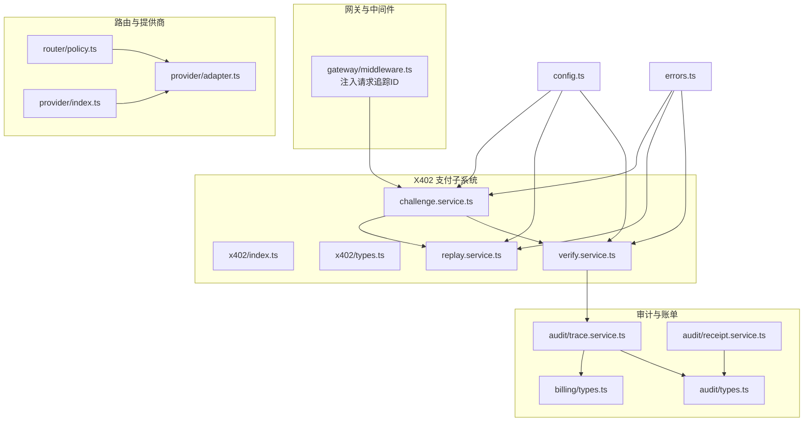
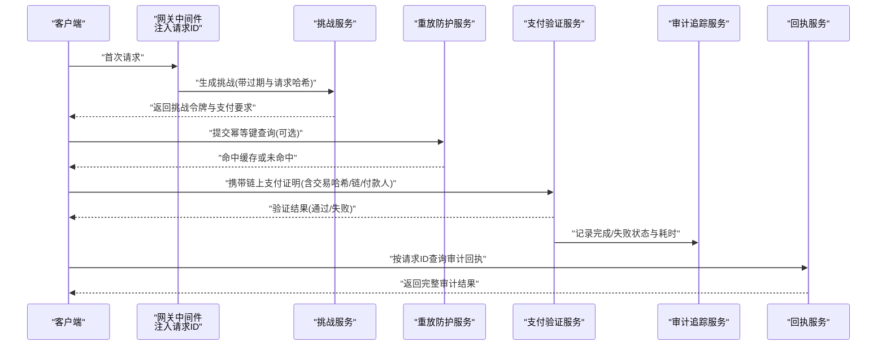
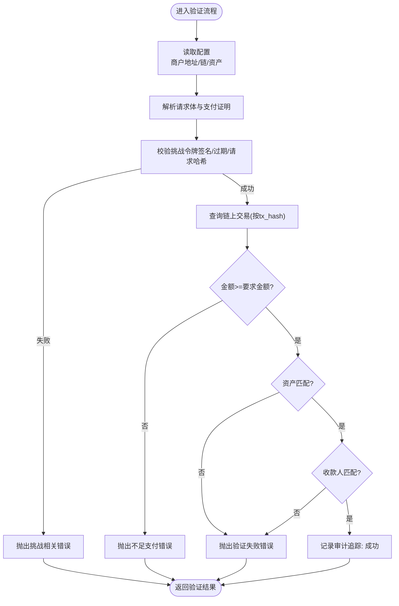
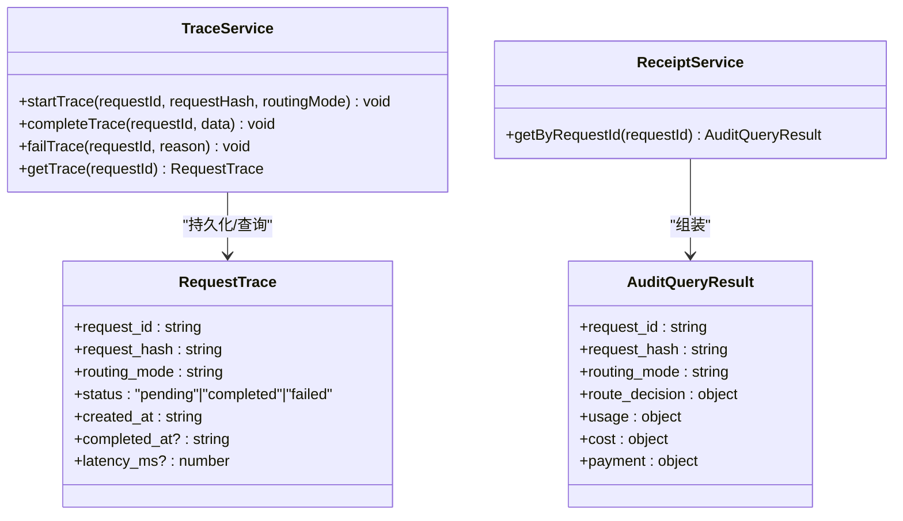
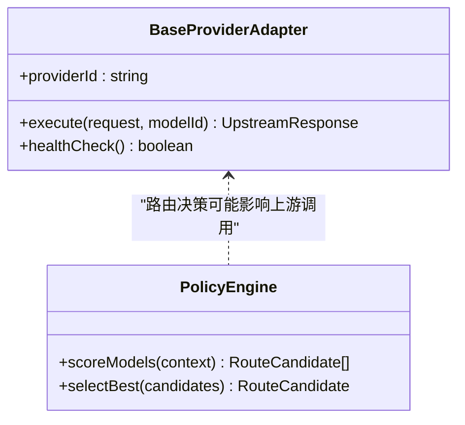
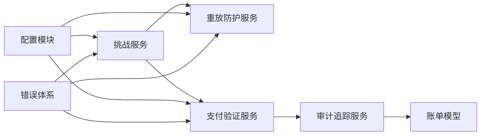

# 区块链交互安全

<cite>
**本文档引用的文件**
- [src/x402/index.ts](file://src/x402/index.ts)
- [src/x402/types.ts](file://src/x402/types.ts)
- [src/x402/verify.service.ts](file://src/x402/verify.service.ts)
- [src/x402/replay.service.ts](file://src/x402/replay.service.ts)
- [src/x402/challenge.service.ts](file://src/x402/challenge.service.ts)
- [src/config.ts](file://src/config.ts)
- [src/errors.ts](file://src/errors.ts)
- [src/gateway/middleware.ts](file://src/gateway/middleware.ts)
- [src/audit/trace.service.ts](file://src/audit/trace.service.ts)
- [src/audit/receipt.service.ts](file://src/audit/receipt.service.ts)
- [src/audit/types.ts](file://src/audit/types.ts)
- [src/billing/types.ts](file://src/billing/types.ts)
- [src/router/policy.ts](file://src/router/policy.ts)
- [src/provider/adapter.ts](file://src/provider/adapter.ts)
- [src/provider/index.ts](file://src/provider/index.ts)
</cite>

## 目录
1. [引言](#引言)
2. [项目结构](#项目结构)
3. [核心组件](#核心组件)
4. [架构总览](#架构总览)
5. [详细组件分析](#详细组件分析)
6. [依赖关系分析](#依赖关系分析)
7. [性能考量](#性能考量)
8. [故障排查指南](#故障排查指南)
9. [结论](#结论)
10. [附录](#附录)

## 引言
本文件面向区块链交互场景，聚焦于链上支付验证与安全控制，覆盖以下主题：
- 链上支付验证流程：交易确认机制、区块确认延迟策略、重放攻击防护
- 私钥管理安全最佳实践：硬件安全模块（HSM）使用、密钥分割与多重签名
- 网络通信安全：RPC 节点选择、SSL/TLS 配置、网络隔离策略
- 智能合约交互安全：gas 限制、交易超时处理、回滚机制
- 安全监控与异常检测：审计追踪、幂等性保障、错误分类与响应

该代码库当前处于开发阶段，核心安全能力以接口与类型定义为主，部分服务仍为占位实现（TODO）。本文在不暴露具体代码的前提下，基于现有接口与配置，给出可落地的安全设计与实施建议。

## 项目结构
项目采用按功能域分层的组织方式，x402 子系统负责 402 支付挑战与验证；审计子系统提供请求追踪与账单记录；路由与计费模块支撑成本与用量统计；网关中间件提供请求追踪 ID 注入；配置模块集中管理运行参数；错误体系统一 API 错误码与语义。

图表来源
- [src/gateway/middleware.ts:1-13](file://src/gateway/middleware.ts#L1-L13)
- [src/x402/index.ts:1-13](file://src/x402/index.ts#L1-L13)
- [src/x402/types.ts:1-37](file://src/x402/types.ts#L1-L37)
- [src/x402/challenge.service.ts:1-71](file://src/x402/challenge.service.ts#L1-L71)
- [src/x402/replay.service.ts:1-52](file://src/x402/replay.service.ts#L1-L52)
- [src/x402/verify.service.ts:1-34](file://src/x402/verify.service.ts#L1-L34)
- [src/audit/trace.service.ts:1-68](file://src/audit/trace.service.ts#L1-L68)
- [src/audit/receipt.service.ts:1-26](file://src/audit/receipt.service.ts#L1-L26)
- [src/audit/types.ts:1-38](file://src/audit/types.ts#L1-L38)
- [src/billing/types.ts:1-32](file://src/billing/types.ts#L1-L32)
- [src/router/policy.ts:1-34](file://src/router/policy.ts#L1-L34)
- [src/provider/adapter.ts:1-16](file://src/provider/adapter.ts#L1-L16)
- [src/provider/index.ts:1-6](file://src/provider/index.ts#L1-L6)
- [src/config.ts:1-46](file://src/config.ts#L1-L46)
- [src/errors.ts:1-106](file://src/errors.ts#L1-L106)

章节来源
- [src/x402/index.ts:1-13](file://src/x402/index.ts#L1-L13)
- [src/x402/types.ts:1-37](file://src/x402/types.ts#L1-L37)
- [src/config.ts:1-46](file://src/config.ts#L1-L46)

## 核心组件
- 支付挑战与验证
  - 挑战生成与校验：基于 HMAC 的挑战令牌、过期时间、请求哈希绑定
  - 链上支付验证：金额、资产、收款人匹配校验
  - 重放防护：基于 Redis 的原子检查与幂等缓存
- 审计与账单
  - 请求追踪：开始、完成、失败状态机与耗时统计
  - 凭据回执：按请求 ID 组装完整审计结果
  - 账单模型：不可变账本条目与费用明细
- 网关与路由
  - 请求追踪 ID 注入
  - 策略引擎：评分与最优候选选择
- 提供商适配
  - 抽象适配器：统一执行与健康检查接口
- 配置与错误
  - 运行参数集中化校验与加载
  - 统一错误类型与 API 响应映射

章节来源
- [src/x402/challenge.service.ts:1-71](file://src/x402/challenge.service.ts#L1-L71)
- [src/x402/replay.service.ts:1-52](file://src/x402/replay.service.ts#L1-L52)
- [src/x402/verify.service.ts:1-34](file://src/x402/verify.service.ts#L1-L34)
- [src/audit/trace.service.ts:1-68](file://src/audit/trace.service.ts#L1-L68)
- [src/audit/receipt.service.ts:1-26](file://src/audit/receipt.service.ts#L1-L26)
- [src/billing/types.ts:1-32](file://src/billing/types.ts#L1-L32)
- [src/gateway/middleware.ts:1-13](file://src/gateway/middleware.ts#L1-L13)
- [src/router/policy.ts:1-34](file://src/router/policy.ts#L1-L34)
- [src/provider/adapter.ts:1-16](file://src/provider/adapter.ts#L1-L16)
- [src/config.ts:1-46](file://src/config.ts#L1-L46)
- [src/errors.ts:1-106](file://src/errors.ts#L1-L106)

## 架构总览
下图展示从网关到支付验证与审计的整体调用路径，以及关键安全控制点。

图表来源
- [src/gateway/middleware.ts:1-13](file://src/gateway/middleware.ts#L1-L13)
- [src/x402/challenge.service.ts:1-71](file://src/x402/challenge.service.ts#L1-L71)
- [src/x402/replay.service.ts:1-52](file://src/x402/replay.service.ts#L1-L52)
- [src/x402/verify.service.ts:1-34](file://src/x402/verify.service.ts#L1-L34)
- [src/audit/trace.service.ts:1-68](file://src/audit/trace.service.ts#L1-L68)
- [src/audit/receipt.service.ts:1-26](file://src/audit/receipt.service.ts#L1-L26)

## 详细组件分析

### 支付挑战与验证组件
- 挑战生成
  - 生成报价标识、计算请求哈希、HMAC 签名挑战令牌、设置过期时间
  - 用于防止请求体被篡改与重放
- 挑战校验
  - 校验签名有效性、过期时间、请求哈希一致性
  - 失败抛出明确错误类型，便于前端与网关处理
- 链上支付验证
  - 待实现：通过 RPC 查询交易、校验金额≥要求金额、资产匹配、收款人匹配
  - 返回验证结果与付款人地址、金额
- 重放防护
  - 原子检查支付证明哈希是否已存在，避免重复消费
  - 幂等键支持：按请求幂等键缓存响应，提升可用性与一致性

图表来源
- [src/x402/challenge.service.ts:1-71](file://src/x402/challenge.service.ts#L1-L71)
- [src/x402/verify.service.ts:1-34](file://src/x402/verify.service.ts#L1-L34)
- [src/config.ts:1-46](file://src/config.ts#L1-L46)
- [src/errors.ts:1-106](file://src/errors.ts#L1-L106)

章节来源
- [src/x402/challenge.service.ts:1-71](file://src/x402/challenge.service.ts#L1-L71)
- [src/x402/verify.service.ts:1-34](file://src/x402/verify.service.ts#L1-L34)
- [src/x402/replay.service.ts:1-52](file://src/x402/replay.service.ts#L1-L52)
- [src/x402/types.ts:1-37](file://src/x402/types.ts#L1-L37)
- [src/config.ts:1-46](file://src/config.ts#L1-L46)
- [src/errors.ts:1-106](file://src/errors.ts#L1-L106)

### 审计与账单组件
- 请求追踪
  - 开始：记录请求 ID、请求哈希、路由模式、状态为 pending
  - 完成：填充路由决策、用量、费用、支付信息，标记完成并记录耗时
  - 失败：记录失败原因
  - 查询：按请求 ID 获取追踪记录
- 回执服务
  - 按请求 ID 组合完整审计结果，包含路由、用量、费用、支付状态
- 账单模型
  - 不可变账本条目，包含请求 ID、报价号、付款人、模型、用量、费用与时间戳

图表来源
- [src/audit/trace.service.ts:1-68](file://src/audit/trace.service.ts#L1-L68)
- [src/audit/receipt.service.ts:1-26](file://src/audit/receipt.service.ts#L1-L26)
- [src/audit/types.ts:1-38](file://src/audit/types.ts#L1-L38)

章节来源
- [src/audit/trace.service.ts:1-68](file://src/audit/trace.service.ts#L1-L68)
- [src/audit/receipt.service.ts:1-26](file://src/audit/receipt.service.ts#L1-L26)
- [src/audit/types.ts:1-38](file://src/audit/types.ts#L1-L38)
- [src/billing/types.ts:1-32](file://src/billing/types.ts#L1-L32)

### 网关与路由组件
- 请求追踪 ID 注入：在请求进入时生成唯一 ID，便于跨服务追踪
- 策略引擎：根据成本、能力匹配与可用性对候选模型进行评分与选择
- 提供商适配器抽象：统一上游执行与健康检查接口，便于扩展与隔离

图表来源
- [src/provider/adapter.ts:1-16](file://src/provider/adapter.ts#L1-L16)
- [src/router/policy.ts:1-34](file://src/router/policy.ts#L1-L34)

章节来源
- [src/gateway/middleware.ts:1-13](file://src/gateway/middleware.ts#L1-L13)
- [src/router/policy.ts:1-34](file://src/router/policy.ts#L1-L34)
- [src/provider/adapter.ts:1-16](file://src/provider/adapter.ts#L1-L16)

## 依赖关系分析
- 组件耦合
  - 挑战服务与验证服务通过挑战令牌与支付证明解耦
  - 重放防护服务依赖 Redis，提供原子性与幂等缓存
  - 审计服务贯穿验证流程，形成闭环
- 外部依赖
  - 配置模块集中管理数据库、Redis、挑战密钥、商户地址等
  - 错误体系统一 API 错误码与语义，便于可观测与告警
- 可能的循环依赖
  - 当前模块间通过接口与类型解耦，未见直接循环导入

图表来源
- [src/x402/challenge.service.ts:1-71](file://src/x402/challenge.service.ts#L1-L71)
- [src/x402/replay.service.ts:1-52](file://src/x402/replay.service.ts#L1-L52)
- [src/x402/verify.service.ts:1-34](file://src/x402/verify.service.ts#L1-L34)
- [src/audit/trace.service.ts:1-68](file://src/audit/trace.service.ts#L1-L68)
- [src/billing/types.ts:1-32](file://src/billing/types.ts#L1-L32)
- [src/config.ts:1-46](file://src/config.ts#L1-L46)
- [src/errors.ts:1-106](file://src/errors.ts#L1-L106)

章节来源
- [src/config.ts:1-46](file://src/config.ts#L1-L46)
- [src/errors.ts:1-106](file://src/errors.ts#L1-L106)

## 性能考量
- 验证路径优化
  - 使用 Redis 原子操作与幂等缓存减少重复计算与外部调用
  - 审计写入异步化，避免阻塞主流程
- 路由与上游调用
  - 策略评分与候选选择应尽量本地化，减少外部依赖
  - 上游调用设置合理超时与重试退避，避免级联故障
- 数据库与缓存
  - 审计表与账单表建立必要索引（请求 ID、报价 ID、时间戳）
  - 缓存 TTL 合理设置，平衡一致性与性能

## 故障排查指南
- 常见错误与定位
  - 挑战过期：检查挑战令牌过期时间与服务器时间同步
  - 请求哈希不匹配：核对请求体序列化规则与哈希算法
  - 验证失败：确认链上交易哈希、金额、资产、收款人字段
  - 重复支付：检查重放防护键值与 TTL 设置
- 日志与追踪
  - 通过请求 ID 快速关联审计记录与回执
  - 将错误类型映射到统一 API 响应，便于前端与监控系统识别
- 依赖健康检查
  - Redis 与数据库连接池健康检查
  - 上游提供商可用性与超时阈值监控

章节来源
- [src/errors.ts:1-106](file://src/errors.ts#L1-L106)
- [src/audit/receipt.service.ts:1-26](file://src/audit/receipt.service.ts#L1-L26)
- [src/audit/trace.service.ts:1-68](file://src/audit/trace.service.ts#L1-L68)

## 结论
本项目在架构层面已具备清晰的安全边界与可观测性基础：挑战-验证、重放防护、审计追踪与错误体系相互配合，形成闭环。建议在后续实现中优先补齐链上验证逻辑、完善 RPC 交互与网络隔离策略，并结合 HSM、密钥分割与多重签名机制进一步强化私钥与密钥材料的安全性。

## 附录

### 链上支付验证安全清单
- 交易确认机制
  - 通过 RPC 查询交易回执，确认交易已包含在区块内
  - 对于 EVM 兼容链，建议等待 N 个区块确认后再视为最终确认
- 区块确认延迟策略
  - 根据链特性与风险容忍度设定确认区块数（如 12 或更高）
  - 对高价值交易启用更高的确认阈值
- 重入攻击防护
  - 使用一次性哈希与原子标记，避免同一笔支付证明被重复消费
  - 幂等键缓存仅在严格一致前提下使用，避免跨请求污染

章节来源
- [src/x402/verify.service.ts:1-34](file://src/x402/verify.service.ts#L1-L34)
- [src/x402/replay.service.ts:1-52](file://src/x402/replay.service.ts#L1-L52)

### 私钥管理安全最佳实践
- 硬件安全模块（HSM）
  - 在 HSM 中生成与存储密钥，避免导出明文私钥
  - 使用 HSM 执行签名与加密操作，最小化私钥暴露面
- 密钥分割与多重签名
  - 采用阈值签名方案，至少需要 N/M 个密钥持有者授权
  - 将密钥片段分发至不同物理或逻辑隔离位置
- 访问控制与审计
  - 严格的访问审批与最小权限原则
  - 完整的操作日志与定期审计

### 网络通信安全
- RPC 节点选择
  - 使用多节点冗余与轮询策略，避免单点故障
  - 优先选择可信的托管 RPC 服务或自建节点
- SSL/TLS 配置
  - 强制启用 TLS 1.2+，禁用弱密码套件
  - 证书校验与主机名校验，防止中间人攻击
- 网络隔离策略
  - 将验证服务置于受限子网，仅开放必要端口
  - 使用防火墙与安全组限制内外部访问

### 智能合约交互安全
- gas 限制与交易超时
  - 为链上交互设置合理的超时与重试上限
  - 明确 gas 价格与上限，避免交易长时间挂起
- 回滚机制
  - 对于可逆业务，设计补偿与回滚流程
  - 审计日志保留足够上下文以便回溯

### 安全监控与异常检测
- 实施方案
  - 将错误类型映射到统一指标与告警规则
  - 对挑战过期、请求哈希不匹配、验证失败、重复支付等事件设置阈值告警
  - 审计回执查询作为异常复盘入口，结合请求 ID 进行关联分析

章节来源
- [src/errors.ts:1-106](file://src/errors.ts#L1-L106)
- [src/audit/receipt.service.ts:1-26](file://src/audit/receipt.service.ts#L1-L26)
- [src/audit/trace.service.ts:1-68](file://src/audit/trace.service.ts#L1-L68)