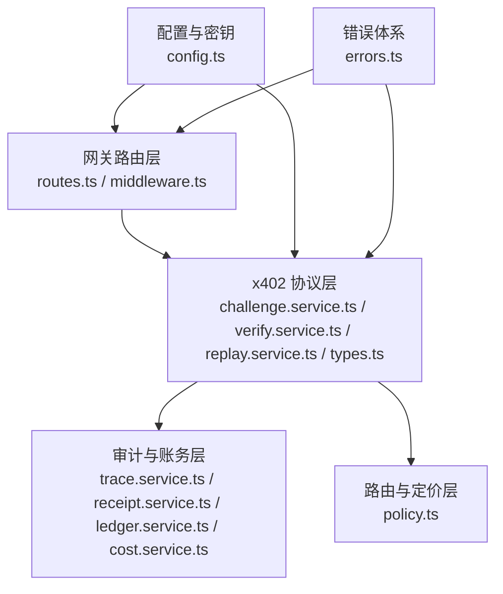
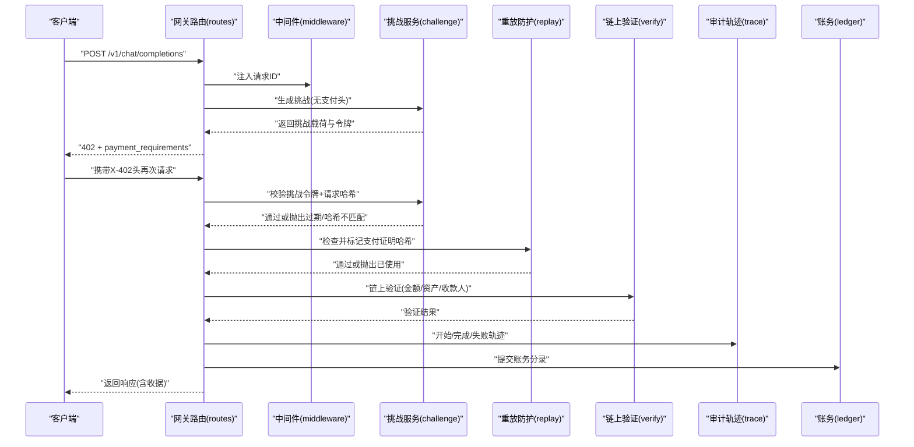
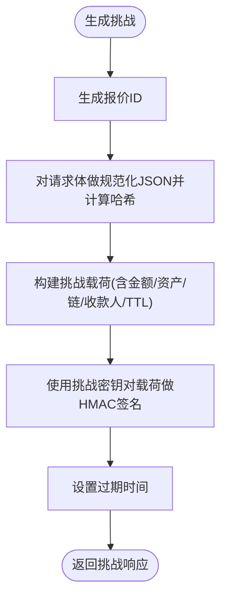
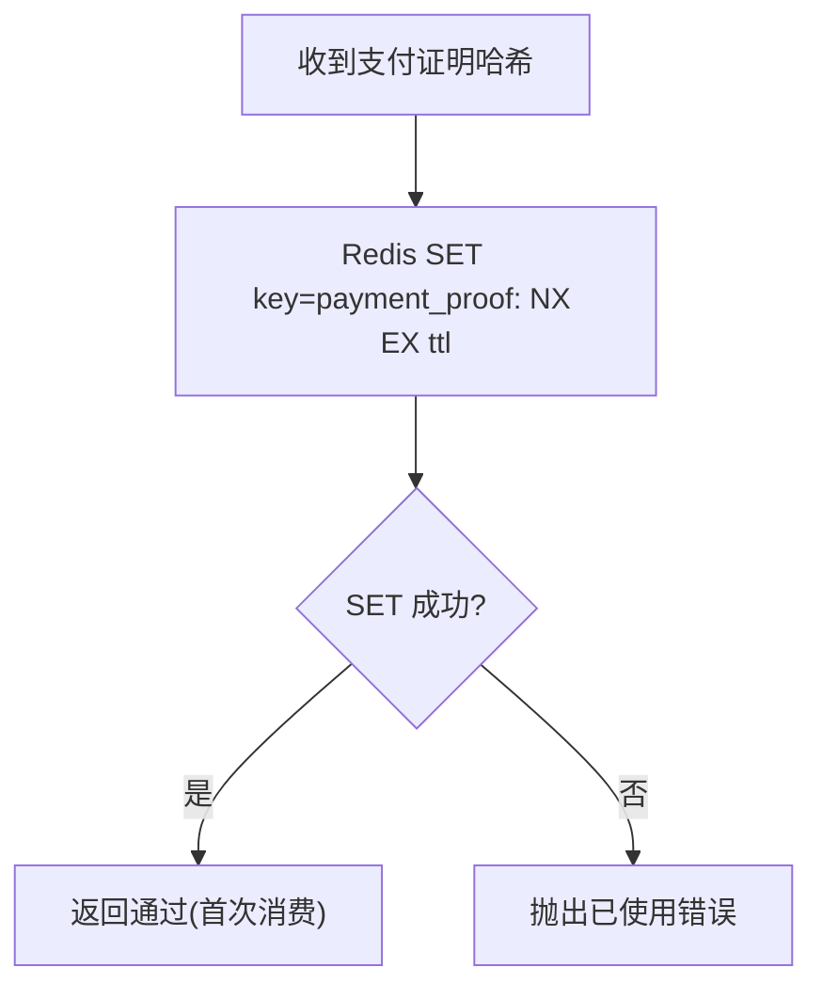
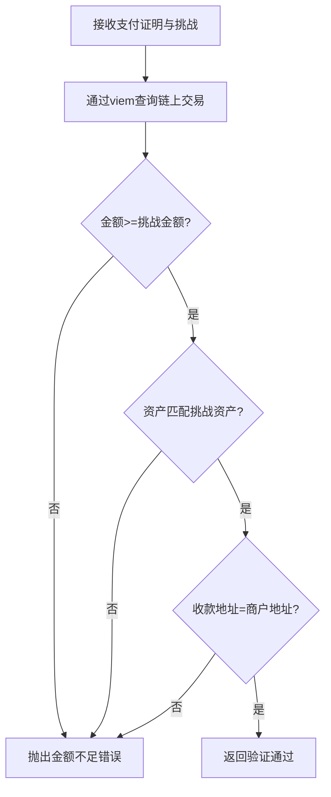
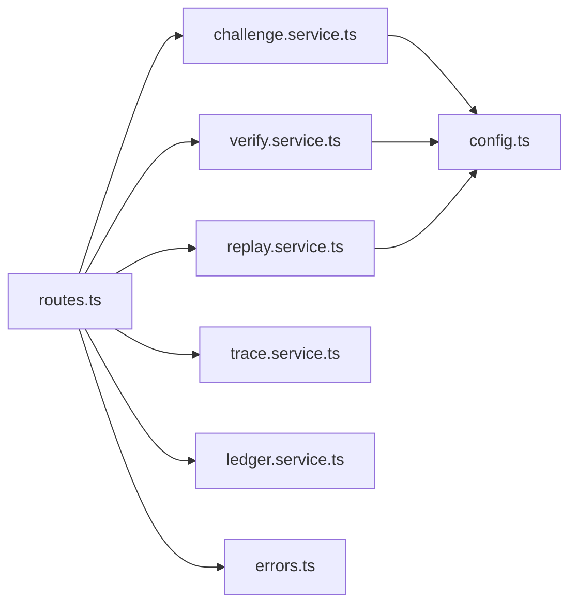

# 安全与合规

<cite>
**本文引用的文件**
- [src/x402/index.ts](file://src/x402/index.ts)
- [src/x402/challenge.service.ts](file://src/x402/challenge.service.ts)
- [src/x402/replay.service.ts](file://src/x402/replay.service.ts)
- [src/x402/verify.service.ts](file://src/x402/verify.service.ts)
- [src/x402/types.ts](file://src/x402/types.ts)
- [src/gateway/routes.ts](file://src/gateway/routes.ts)
- [src/gateway/middleware.ts](file://src/gateway/middleware.ts)
- [src/audit/types.ts](file://src/audit/types.ts)
- [src/audit/receipt.service.ts](file://src/audit/receipt.service.ts)
- [src/audit/trace.service.ts](file://src/audit/trace.service.ts)
- [src/billing/cost.service.ts](file://src/billing/cost.service.ts)
- [src/billing/ledger.service.ts](file://src/billing/ledger.service.ts)
- [src/router/policy.ts](file://src/router/policy.ts)
- [src/config.ts](file://src/config.ts)
- [src/errors.ts](file://src/errors.ts)
</cite>

## 目录
1. [引言](#引言)
2. [项目结构](#项目结构)
3. [核心组件](#核心组件)
4. [架构总览](#架构总览)
5. [详细组件分析](#详细组件分析)
6. [依赖关系分析](#依赖关系分析)
7. [性能与安全权衡](#性能与安全权衡)
8. [故障排查指南](#故障排查指南)
9. [结论](#结论)
10. [附录](#附录)

## 引言
本文件面向 x402 Gateway 的安全与合规设计，聚焦以下目标：
- 解释 x402 支付协议的安全机制：挑战生成、请求哈希绑定、防重放与支付验证。
- 阐述链上交互的安全考虑与最佳实践（如 EVM RPC 查询）。
- 明确数据保护、密钥管理与访问控制策略。
- 提供安全漏洞预防、监控告警与应急响应建议。
- 梳理合规要求、隐私保护与数据治理政策。

## 项目结构
从安全视角看，系统围绕“网关路由层”“x402 协议层”“审计与账务层”“路由与定价层”展开。安全职责在各层边界清晰分离：网关负责请求追踪与头信息解析；x402 层负责挑战、重放防护与链上验证；审计与账务层确保可追溯与不可篡改；路由与定价层提供公平选择与成本计算。

图表来源
- [src/gateway/routes.ts:1-96](file://src/gateway/routes.ts#L1-L96)
- [src/gateway/middleware.ts:1-13](file://src/gateway/middleware.ts#L1-L13)
- [src/x402/challenge.service.ts:1-71](file://src/x402/challenge.service.ts#L1-L71)
- [src/x402/verify.service.ts:1-34](file://src/x402/verify.service.ts#L1-L34)
- [src/x402/replay.service.ts:1-52](file://src/x402/replay.service.ts#L1-L52)
- [src/x402/types.ts:1-37](file://src/x402/types.ts#L1-L37)
- [src/audit/trace.service.ts:1-68](file://src/audit/trace.service.ts#L1-L68)
- [src/audit/receipt.service.ts:1-26](file://src/audit/receipt.service.ts#L1-L26)
- [src/billing/ledger.service.ts:1-42](file://src/billing/ledger.service.ts#L1-L42)
- [src/billing/cost.service.ts:1-32](file://src/billing/cost.service.ts#L1-L32)
- [src/router/policy.ts:1-34](file://src/router/policy.ts#L1-L34)
- [src/config.ts:1-46](file://src/config.ts#L1-L46)
- [src/errors.ts:1-106](file://src/errors.ts#L1-L106)

章节来源
- [src/gateway/routes.ts:1-96](file://src/gateway/routes.ts#L1-L96)
- [src/gateway/middleware.ts:1-13](file://src/gateway/middleware.ts#L1-L13)
- [src/config.ts:1-46](file://src/config.ts#L1-L46)

## 核心组件
- 挑战服务：生成与校验挑战令牌，绑定请求哈希，设置过期时间。
- 链上支付验证服务：基于 EVM RPC 校验金额、资产与收款人。
- 重放防护服务：基于 Redis 原子标记与幂等键缓存，防止重复消费。
- 网关路由与中间件：注入唯一请求 ID，解析与转发支付头。
- 审计与账务：请求轨迹、收据重建、账本提交与查询。
- 错误体系：统一映射到 API 规范错误码，便于可观测与告警。

章节来源
- [src/x402/challenge.service.ts:1-71](file://src/x402/challenge.service.ts#L1-L71)
- [src/x402/verify.service.ts:1-34](file://src/x402/verify.service.ts#L1-L34)
- [src/x402/replay.service.ts:1-52](file://src/x402/replay.service.ts#L1-L52)
- [src/gateway/routes.ts:1-96](file://src/gateway/routes.ts#L1-L96)
- [src/gateway/middleware.ts:1-13](file://src/gateway/middleware.ts#L1-L13)
- [src/audit/trace.service.ts:1-68](file://src/audit/trace.service.ts#L1-L68)
- [src/audit/receipt.service.ts:1-26](file://src/audit/receipt.service.ts#L1-L26)
- [src/billing/ledger.service.ts:1-42](file://src/billing/ledger.service.ts#L1-L42)
- [src/billing/cost.service.ts:1-32](file://src/billing/cost.service.ts#L1-L32)
- [src/errors.ts:1-106](file://src/errors.ts#L1-L106)

## 架构总览
下图展示一次完整支付流程的关键安全交互：挑战生成与校验、请求哈希绑定、链上验证、重放防护与审计记账。

图表来源
- [src/gateway/routes.ts:23-67](file://src/gateway/routes.ts#L23-L67)
- [src/gateway/middleware.ts:9-12](file://src/gateway/middleware.ts#L9-L12)
- [src/x402/challenge.service.ts:36-68](file://src/x402/challenge.service.ts#L36-L68)
- [src/x402/replay.service.ts:25-49](file://src/x402/replay.service.ts#L25-L49)
- [src/x402/verify.service.ts:20-31](file://src/x402/verify.service.ts#L20-L31)
- [src/audit/trace.service.ts:40-65](file://src/audit/trace.service.ts#L40-L65)
- [src/billing/ledger.service.ts:19-39](file://src/billing/ledger.service.ts#L19-L39)

## 详细组件分析

### 挑战生成与请求哈希绑定
- 安全目标
  - 将挑战与具体请求体绑定，防止请求体被篡改后复用。
  - 使用 HMAC 对挑战载荷签名，确保完整性与来源可信。
  - 设置 TTL，降低令牌泄露窗口。
- 关键实现点
  - 请求哈希：对请求体进行规范化 JSON 序列化后计算哈希，作为绑定因子。
  - 挑战令牌：以挑战载荷为输入，使用密钥进行 HMAC 签名。
  - 过期时间：在挑战中记录到期时间，服务端校验当前时间是否早于到期时间。
- 安全建议
  - 密钥轮换：定期更换挑战密钥，缩短泄露影响面。
  - 最小暴露：仅在挑战令牌中包含必要字段，避免泄露敏感上下文。
  - 传输加密：强制 TLS，防止中间人截获挑战令牌与请求体。

图表来源
- [src/x402/challenge.service.ts:36-68](file://src/x402/challenge.service.ts#L36-L68)
- [src/x402/types.ts:2-10](file://src/x402/types.ts#L2-L10)

章节来源
- [src/x402/challenge.service.ts:1-71](file://src/x402/challenge.service.ts#L1-L71)
- [src/x402/types.ts:1-37](file://src/x402/types.ts#L1-L37)

### 防重放攻击与幂等性
- 安全目标
  - 防止同一笔支付证明被重复消费。
  - 在高并发场景下保持一致性与原子性。
- 关键实现点
  - 原子检查：使用 Redis SET NX EX 对支付证明哈希进行原子标记，失败则判定重复。
  - 幂等键缓存：对相同幂等键查询缓存响应，避免重复执行昂贵操作。
- 安全建议
  - TTL 设定：根据业务峰值与处理时延合理设置过期时间，避免缓存雪崩。
  - 命名空间隔离：使用前缀区分不同业务域，降低冲突风险。
  - 失败回退：原子写入失败时应明确返回重复消费错误，避免静默失败。

图表来源
- [src/x402/replay.service.ts:25-33](file://src/x402/replay.service.ts#L25-L33)

章节来源
- [src/x402/replay.service.ts:1-52](file://src/x402/replay.service.ts#L1-L52)

### 链上支付验证
- 安全目标
  - 确保链上交易满足最小金额、资产类型与收款地址要求。
  - 通过 EVM RPC 获取交易详情，避免离线伪造。
- 关键实现点
  - 金额校验：比较链上金额与挑战金额，要求不低于挑战金额。
  - 资产校验：交易资产需与挑战资产一致。
  - 收款人校验：交易收款地址需与挑战中的商户地址一致。
- 安全建议
  - 多节点与超时：使用多 RPC 节点与合理超时，避免单点故障与长尾延迟。
  - 重试策略：对临时性错误进行指数退避重试，避免放大网络抖动。
  - 交易确认深度：在生产环境引入区块确认深度阈值，降低双花风险。

图表来源
- [src/x402/verify.service.ts:20-31](file://src/x402/verify.service.ts#L20-L31)

章节来源
- [src/x402/verify.service.ts:1-34](file://src/x402/verify.service.ts#L1-L34)

### 网关路由与中间件
- 安全目标
  - 为每条请求注入唯一跟踪 ID，便于端到端追踪与审计。
  - 统一解析与转发支付相关头部，避免业务逻辑泄漏到路由层。
- 关键实现点
  - 请求 ID 注入：在 onRequest 钩子中生成并附加到请求对象。
  - 支付头解析：在路由层读取挑战与支付头，按流程分支处理。
- 安全建议
  - 头部白名单：仅接受受信来源的支付头，拒绝任意伪造头。
  - 日志脱敏：记录日志时对敏感字段进行脱敏处理。

章节来源
- [src/gateway/middleware.ts:1-13](file://src/gateway/middleware.ts#L1-L13)
- [src/gateway/routes.ts:23-67](file://src/gateway/routes.ts#L23-L67)

### 审计与账务
- 安全目标
  - 可追溯：完整记录请求轨迹、路由决策、用量与费用。
  - 不可篡改：账本采用追加式写入，补偿通过新增条目实现。
- 关键实现点
  - 轨迹：开始/完成/失败状态机，记录耗时与关键指标。
  - 收据：按规范组装审计查询结果，支持按请求 ID 查询。
  - 账务：按请求维度提交账务分录，支持按请求/报价号查询。
- 安全建议
  - 审计数据持久化：轨迹与账务均应落库，避免内存态丢失。
  - 数据保留策略：遵循合规要求设定保留周期，定期清理过期数据。

章节来源
- [src/audit/trace.service.ts:1-68](file://src/audit/trace.service.ts#L1-L68)
- [src/audit/receipt.service.ts:1-26](file://src/audit/receipt.service.ts#L1-L26)
- [src/billing/ledger.service.ts:1-42](file://src/billing/ledger.service.ts#L1-L42)
- [src/audit/types.ts:1-38](file://src/audit/types.ts#L1-L38)

### 错误与异常处理
- 安全目标
  - 将内部错误映射为标准 API 错误码，避免泄露实现细节。
  - 对 402/400/409 等语义化错误进行明确区分，便于客户端与监控系统识别。
- 关键实现点
  - 错误类：定义了支付必需、挑战过期、请求哈希不匹配、支付验证失败、重复支付、金额不足等错误。
  - 响应转换：将错误转换为统一的 API 响应结构，必要时附带挑战需求。
- 安全建议
  - 严格错误分类：避免将内部错误码直接透传给客户端。
  - 告警规则：针对高频错误码建立阈值告警与根因分析。

章节来源
- [src/errors.ts:1-106](file://src/errors.ts#L1-L106)

## 依赖关系分析
- 组件耦合
  - 网关路由依赖挑战与重放服务进行支付前置校验，再调用链上验证与审计账务。
  - x402 协议层依赖配置中的挑战密钥、商户地址、链与资产等参数。
  - 审计与账务层对数据库与 Redis 存在外部依赖，需关注可用性与一致性。
- 外部依赖
  - viem：用于链上交易查询，需关注 RPC 质量与稳定性。
  - Redis：用于原子标记与幂等缓存，需关注连接池与过期策略。
- 循环依赖
  - 当前模块间为单向依赖，未见循环导入。

图表来源
- [src/gateway/routes.ts:1-96](file://src/gateway/routes.ts#L1-L96)
- [src/x402/challenge.service.ts:1-71](file://src/x402/challenge.service.ts#L1-L71)
- [src/x402/replay.service.ts:1-52](file://src/x402/replay.service.ts#L1-L52)
- [src/x402/verify.service.ts:1-34](file://src/x402/verify.service.ts#L1-L34)
- [src/audit/trace.service.ts:1-68](file://src/audit/trace.service.ts#L1-L68)
- [src/billing/ledger.service.ts:1-42](file://src/billing/ledger.service.ts#L1-L42)
- [src/config.ts:1-46](file://src/config.ts#L1-L46)
- [src/errors.ts:1-106](file://src/errors.ts#L1-L106)

章节来源
- [src/gateway/routes.ts:1-96](file://src/gateway/routes.ts#L1-L96)
- [src/config.ts:1-46](file://src/config.ts#L1-L46)

## 性能与安全权衡
- 挑战 TTL 与重放窗口
  - TTL 过短会增加客户端重试频率；过长会扩大泄露影响面。建议结合业务峰值与处理时延动态调整。
- Redis 原子写入
  - 原子标记与幂等缓存可显著降低重复消费风险，但需注意连接池大小与过期策略，避免成为瓶颈。
- 链上查询
  - 多节点与超时配置可提升鲁棒性，但会增加延迟。建议对关键路径启用缓存与预热。
- 日志与追踪
  - 请求 ID 有助于定位问题，但需避免记录敏感字段，防止日志泄露。

[本节为通用指导，无需列出章节来源]

## 故障排查指南
- 常见错误与定位
  - 支付必需：检查客户端是否正确携带挑战与支付头；确认网关路由解析逻辑。
  - 挑战过期：核对服务端时间同步与 TTL 设置；检查客户端重试时机。
  - 请求哈希不匹配：确认请求体序列化是否一致（排序键、空格、编码）。
  - 支付验证失败：检查链上交易是否存在、金额与资产是否匹配、收款地址是否正确。
  - 已使用：确认 Redis 标记是否正确写入与过期；排查并发场景下的竞争条件。
  - 金额不足：核对链上金额单位与挑战金额；检查小数位精度。
- 监控与告警
  - 关键指标：402/400/409/5xx 比例、链上查询延迟与成功率、Redis 命中率、账务提交延迟。
  - 告警阈值：对错误码比例突增、链上查询超时、Redis 写入失败设置阈值告警。
- 应急响应
  - 快速降级：在链上验证失败时允许兜底放行或限流，保障主业务可用。
  - 回滚与补偿：账务采用追加式写入，若出现异常可通过新增条目进行补偿。
  - 审计取证：通过审计接口导出轨迹与账务，配合合规审查。

章节来源
- [src/errors.ts:17-81](file://src/errors.ts#L17-L81)
- [src/x402/replay.service.ts:25-33](file://src/x402/replay.service.ts#L25-L33)
- [src/x402/verify.service.ts:20-31](file://src/x402/verify.service.ts#L20-L31)
- [src/audit/receipt.service.ts:16-22](file://src/audit/receipt.service.ts#L16-L22)

## 结论
x402 Gateway 的安全设计围绕“挑战令牌 + 请求哈希绑定 + 链上验证 + 重放防护 + 审计账务”构建，形成闭环。通过严格的错误分类、可观测性与合规策略，可在保障用户体验的同时满足安全与监管要求。后续实现中应重点关注挑战密钥轮换、Redis 原子写入一致性、链上查询的鲁棒性与审计数据的持久化。

[本节为总结性内容，无需列出章节来源]

## 附录

### 配置与密钥管理
- 必填项
  - 数据库与 Redis 连接串：用于审计与账务持久化。
  - 挑战密钥：长度不少于 32 字节，定期轮换。
  - 商户地址：以 0x 开头的链上地址。
  - 支付链与资产：默认值可配置，生产环境需与链上一致。
- 访问控制
  - 限制对审计与账务接口的访问范围，采用鉴权与速率限制。
  - 严格控制配置加载权限，避免明文泄露。

章节来源
- [src/config.ts:13-18](file://src/config.ts#L13-L18)

### 合规与隐私
- 数据最小化：仅收集与审计、账务与合规必要的字段。
- 数据保留：依据法规设定保留期限，到期自动清理。
- 数据跨境：如涉及跨境传输，需满足相应合规要求。
- 审计留痕：所有关键操作均应具备可追溯性，满足监管审查。

[本节为通用指导，无需列出章节来源]