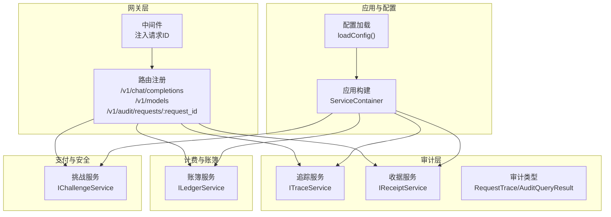
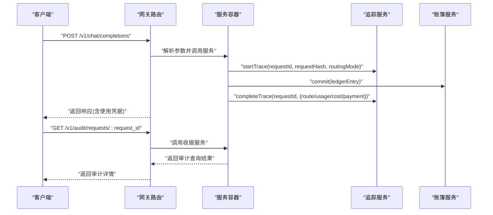
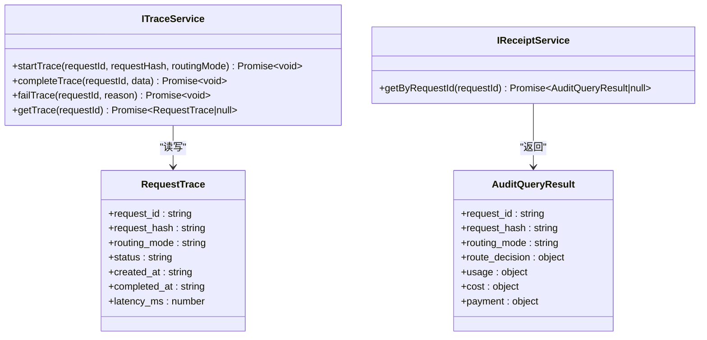
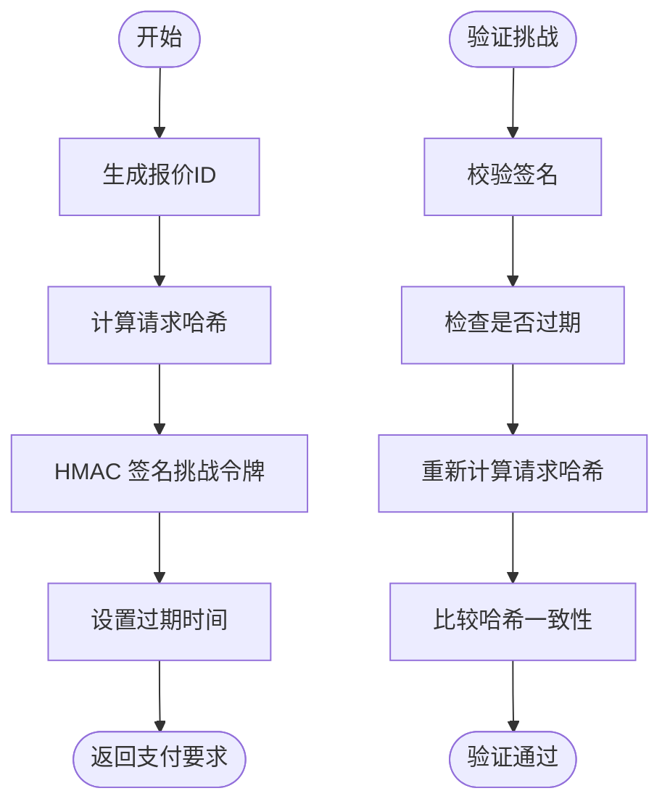
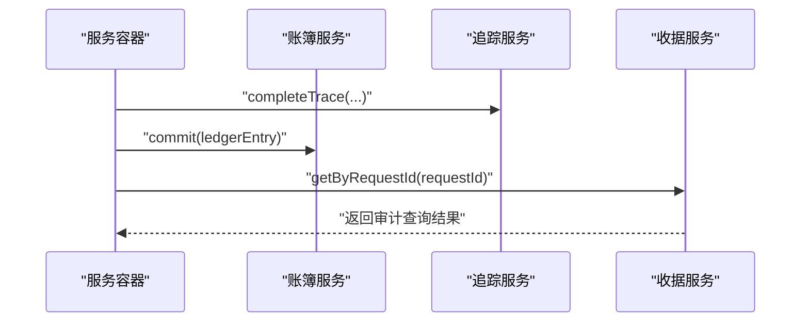
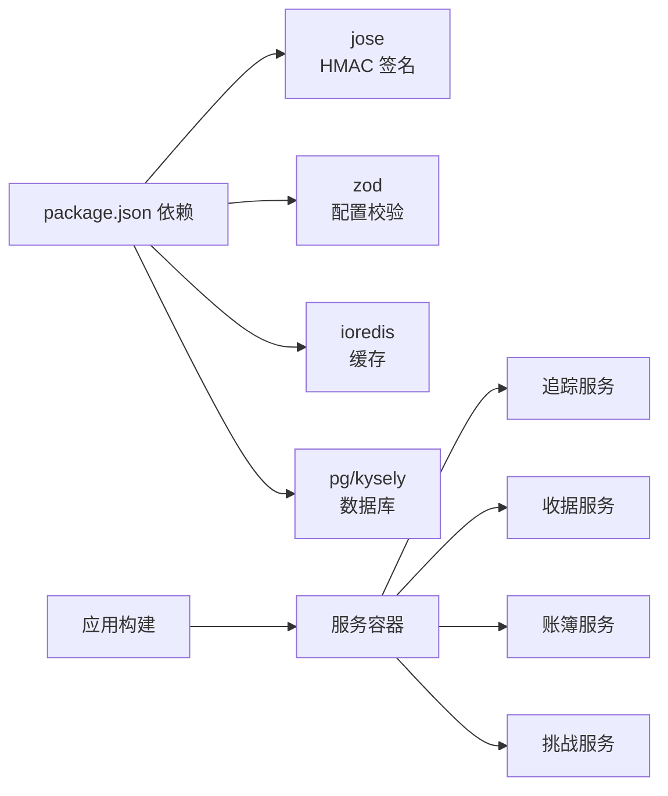

# 数据保护与合规

<cite>
**本文引用的文件**
- [src/audit/index.ts](file://src/audit/index.ts)
- [src/audit/types.ts](file://src/audit/types.ts)
- [src/audit/receipt.service.ts](file://src/audit/receipt.service.ts)
- [src/audit/trace.service.ts](file://src/audit/trace.service.ts)
- [src/gateway/middleware.ts](file://src/gateway/middleware.ts)
- [src/gateway/routes.ts](file://src/gateway/routes.ts)
- [src/types.ts](file://src/types.ts)
- [src/config.ts](file://src/config.ts)
- [src/app.ts](file://src/app.ts)
- [src/server.ts](file://src/server.ts)
- [src/billing/ledger.service.ts](file://src/billing/ledger.service.ts)
- [src/x402/challenge.service.ts](file://src/x402/challenge.service.ts)
- [src/errors.ts](file://src/errors.ts)
- [package.json](file://package.json)
</cite>

## 目录
1. [引言](#引言)
2. [项目结构](#项目结构)
3. [核心组件](#核心组件)
4. [架构总览](#架构总览)
5. [详细组件分析](#详细组件分析)
6. [依赖关系分析](#依赖关系分析)
7. [性能考量](#性能考量)
8. [故障排查指南](#故障排查指南)
9. [结论](#结论)
10. [附录](#附录)

## 引言
本文件面向数据保护与合规，围绕审计日志、个人数据处理、跨境传输、数据分类与敏感信息保护、隐私影响评估（PRA）以及数据泄露响应流程，结合代码库现状进行系统性梳理与落地建议。当前代码库已具备请求追踪与审计查询的接口设计与服务边界，但审计持久化、访问控制、加密与保留策略等在实现层面仍处于待完成状态（多处 TODO）。本文在不披露具体代码的前提下，基于现有类型与接口，给出可操作的合规实施路径。

## 项目结构
项目采用分层与按功能域划分的组织方式：
- 网关层：负责请求注入唯一ID、路由注册与错误处理
- 审计层：定义审计记录结构与查询结果，并提供追踪与收据服务
- 计费与账簿：提供账簿写入与查询能力
- x402 支付挑战：生成与验证挑战令牌，绑定请求哈希
- 配置与启动：集中加载环境变量并初始化应用

图表来源
- [src/gateway/middleware.ts:1-13](file://src/gateway/middleware.ts#L1-L13)
- [src/gateway/routes.ts:1-96](file://src/gateway/routes.ts#L1-L96)
- [src/audit/trace.service.ts:1-68](file://src/audit/trace.service.ts#L1-L68)
- [src/audit/receipt.service.ts:1-26](file://src/audit/receipt.service.ts#L1-L26)
- [src/audit/types.ts:1-38](file://src/audit/types.ts#L1-L38)
- [src/billing/ledger.service.ts:1-42](file://src/billing/ledger.service.ts#L1-L42)
- [src/x402/challenge.service.ts:1-71](file://src/x402/challenge.service.ts#L1-L71)
- [src/app.ts:1-101](file://src/app.ts#L1-L101)
- [src/config.ts:1-46](file://src/config.ts#L1-L46)

章节来源
- [src/gateway/middleware.ts:1-13](file://src/gateway/middleware.ts#L1-L13)
- [src/gateway/routes.ts:1-96](file://src/gateway/routes.ts#L1-L96)
- [src/app.ts:1-101](file://src/app.ts#L1-L101)
- [src/config.ts:1-46](file://src/config.ts#L1-L46)

## 核心组件
- 请求追踪与审计
  - 追踪服务：用于创建初始追踪记录、完成追踪、标记失败与查询追踪
  - 收据服务：根据请求ID组装完整审计记录（待实现）
  - 审计类型：定义追踪记录与审计查询结果的数据结构
- 支付挑战与请求哈希绑定
  - 挑战服务：生成挑战、校验挑战、计算请求哈希
- 账簿服务：仅追加写入，支持按请求ID或报价ID查询
- 中间件与路由：注入唯一请求ID，注册审计查询端点
- 应用与配置：集中初始化各服务容器与运行参数

章节来源
- [src/audit/trace.service.ts:1-68](file://src/audit/trace.service.ts#L1-L68)
- [src/audit/receipt.service.ts:1-26](file://src/audit/receipt.service.ts#L1-L26)
- [src/audit/types.ts:1-38](file://src/audit/types.ts#L1-L38)
- [src/x402/challenge.service.ts:1-71](file://src/x402/challenge.service.ts#L1-L71)
- [src/billing/ledger.service.ts:1-42](file://src/billing/ledger.service.ts#L1-L42)
- [src/gateway/middleware.ts:1-13](file://src/gateway/middleware.ts#L1-L13)
- [src/gateway/routes.ts:1-96](file://src/gateway/routes.ts#L1-L96)
- [src/app.ts:1-101](file://src/app.ts#L1-L101)
- [src/config.ts:1-46](file://src/config.ts#L1-L46)

## 架构总览
下图展示从客户端到审计与账簿的关键调用链，以及审计查询端点的调用关系。

图表来源
- [src/gateway/routes.ts:1-96](file://src/gateway/routes.ts#L1-L96)
- [src/audit/trace.service.ts:1-68](file://src/audit/trace.service.ts#L1-L68)
- [src/billing/ledger.service.ts:1-42](file://src/billing/ledger.service.ts#L1-L42)
- [src/audit/receipt.service.ts:1-26](file://src/audit/receipt.service.ts#L1-L26)

## 详细组件分析

### 审计追踪与收据服务
- 追踪服务职责
  - 创建初始追踪记录（状态 pending）
  - 完成追踪（填充路由决策、用量、费用、支付信息，状态 completed 并记录耗时）
  - 标记失败（状态 failed）
  - 查询追踪
- 收据服务职责
  - 通过请求ID重构完整审计记录（形状与审计查询结果一致），用于审计查询端点
  - 当未找到时返回空值
- 类型与数据模型
  - 追踪记录包含请求ID、请求哈希、路由模式、状态、时间戳等
  - 审计查询结果包含路由决策、用量、费用、支付信息等字段

图表来源
- [src/audit/trace.service.ts:1-68](file://src/audit/trace.service.ts#L1-L68)
- [src/audit/receipt.service.ts:1-26](file://src/audit/receipt.service.ts#L1-L26)
- [src/audit/types.ts:1-38](file://src/audit/types.ts#L1-L38)

章节来源
- [src/audit/trace.service.ts:1-68](file://src/audit/trace.service.ts#L1-L68)
- [src/audit/receipt.service.ts:1-26](file://src/audit/receipt.service.ts#L1-L26)
- [src/audit/types.ts:1-38](file://src/audit/types.ts#L1-L38)

### 支付挑战与请求哈希绑定
- 挑战服务职责
  - 生成挑战：产出报价ID、计算请求哈希、签名挑战令牌、设置过期时间
  - 验证挑战：校验签名、过期时间、请求哈希一致性
  - 计算请求哈希：对请求体进行规范化序列化后做哈希
- 与审计的关系
  - 请求哈希用于将挑战与特定请求绑定，防止重放与篡改
  - 完成追踪时应包含路由决策、用量、费用、支付信息，便于审计

图表来源
- [src/x402/challenge.service.ts:1-71](file://src/x402/challenge.service.ts#L1-L71)
- [src/audit/trace.service.ts:1-68](file://src/audit/trace.service.ts#L1-L68)

章节来源
- [src/x402/challenge.service.ts:1-71](file://src/x402/challenge.service.ts#L1-L71)

### 账簿服务与审计数据持久化
- 账簿服务职责
  - 仅追加写入，保证不可篡改性
  - 提供按请求ID与报价ID查询的能力
- 与审计的关系
  - 完成追踪时应同时提交账簿条目，确保审计证据链完整
  - 审计查询端点依赖收据服务整合追踪、路由决策、用量、费用与支付信息

图表来源
- [src/billing/ledger.service.ts:1-42](file://src/billing/ledger.service.ts#L1-L42)
- [src/audit/trace.service.ts:1-68](file://src/audit/trace.service.ts#L1-L68)
- [src/audit/receipt.service.ts:1-26](file://src/audit/receipt.service.ts#L1-L26)

章节来源
- [src/billing/ledger.service.ts:1-42](file://src/billing/ledger.service.ts#L1-L42)

### 中间件与路由中的数据保护要点
- 唯一请求ID注入
  - 在请求进入时注入唯一ID，贯穿审计与追踪，便于端到端关联
- 审计查询端点
  - 提供按请求ID查询审计详情的接口，需配合访问控制与最小权限原则

章节来源
- [src/gateway/middleware.ts:1-13](file://src/gateway/middleware.ts#L1-L13)
- [src/gateway/routes.ts:1-96](file://src/gateway/routes.ts#L1-L96)

## 依赖关系分析
- 外部依赖与合规相关
  - 加密与签名：jose 用于 HMAC 签名挑战令牌
  - 配置校验：zod 用于环境变量解析与校验
  - 数据库与缓存：ioredis、pg、kysely 用于持久化与缓存
- 内部耦合
  - 应用构建函数集中装配服务容器，路由层仅薄薄封装，降低业务逻辑耦合
  - 审计与账簿服务通过接口解耦，便于替换实现

图表来源
- [package.json:1-52](file://package.json#L1-L52)
- [src/app.ts:1-101](file://src/app.ts#L1-L101)

章节来源
- [package.json:1-52](file://package.json#L1-L52)
- [src/app.ts:1-101](file://src/app.ts#L1-L101)

## 性能考量
- 追加式账簿写入避免更新与删除，有利于写入性能与审计完整性
- 追踪与收据服务当前为占位实现，实际部署中应优先选择高性能存储（如 PostgreSQL + 适当索引、Redis 缓存热点）
- 审计查询端点应限制查询频率与并发，结合速率限制与缓存策略
- 请求哈希计算与签名应在路由阶段尽量轻量，避免阻塞主链路

## 故障排查指南
- 常见错误类型
  - 402 无支付证明：触发挑战生成
  - 挑战过期：验证挑战时抛出过期错误
  - 请求哈希不匹配：重试请求体与挑战不一致
  - 支付验证失败：链上支付核验未通过
  - 重复支付：同一支付证明被多次使用
  - 上游超时/不可用：上游模型提供商异常
- 错误到响应映射
  - 应用错误类统一转换为标准 API 响应格式，便于前端与审计系统识别
- 审计与账簿
  - 若审计查询为空，检查追踪是否已完成、账簿是否成功提交
  - 若挑战校验失败，检查签名、过期时间与请求哈希一致性

章节来源
- [src/errors.ts:1-106](file://src/errors.ts#L1-L106)
- [src/x402/challenge.service.ts:1-71](file://src/x402/challenge.service.ts#L1-L71)
- [src/billing/ledger.service.ts:1-42](file://src/billing/ledger.service.ts#L1-L42)
- [src/audit/receipt.service.ts:1-26](file://src/audit/receipt.service.ts#L1-L26)

## 结论
当前代码库已具备审计查询与追踪服务的清晰边界与数据模型，但审计持久化、访问控制、加密与保留策略尚未落地。建议在实现追踪与收据服务的同时，同步完成以下合规建设：
- 审计日志保护：追踪与账簿写入采用强一致与不可篡改设计；审计查询端点增加访问控制与最小权限
- 个人数据处理：遵循数据最小化原则，仅收集必要字段；明确用户同意机制与删除权实现路径
- 跨境传输：依据适用法规（如 GDPR、CCPA）制定标准合同条款与安全措施
- 数据分类与敏感信息：建立 PII 分类清单与匿名化策略
- PRA 实施：以审计与账簿为核心场景开展 PRA，覆盖数据流、风险与缓解措施
- 泄露响应：建立事件分级、通知时限与补救措施

## 附录

### 审计日志数据保护措施（基于现有接口的落地建议）
- 日志加密
  - 存储侧：对包含敏感字段（如支付人地址）的审计记录进行加密存储
  - 传输侧：启用 TLS，确保审计查询与账簿写入在传输过程中的机密性
- 访问控制
  - 审计查询端点增加鉴权与授权：仅授权人员可在限定范围内查询
  - 最小权限：审计查询与账簿访问仅授予必要角色
- 保留策略
  - 明确审计记录与账簿条目的保留期限与销毁流程
  - 保留期满后执行安全擦除，确保不可恢复

章节来源
- [src/audit/receipt.service.ts:1-26](file://src/audit/receipt.service.ts#L1-L26)
- [src/billing/ledger.service.ts:1-42](file://src/billing/ledger.service.ts#L1-L42)
- [src/gateway/routes.ts:1-96](file://src/gateway/routes.ts#L1-L96)

### 个人数据处理的合规要求
- 数据最小化
  - 仅记录完成审计所需的最少字段（如请求ID、路由决策、用量、费用、支付摘要）
- 用户同意机制
  - 在服务条款中明确说明审计与计费数据的用途与保留期
  - 提供用户撤回同意与删除其数据的渠道
- 删除权
  - 提供按请求ID检索与删除对应审计与账簿记录的能力
  - 删除操作需留痕并满足可追溯性要求

章节来源
- [src/audit/types.ts:1-38](file://src/audit/types.ts#L1-L38)
- [src/types.ts:110-119](file://src/types.ts#L110-L119)

### 跨境数据传输的合规考虑
- 适用法规
  - GDPR：确保标准合同条款（SCCs）、安全措施与数据主体权利保障
  - CCPA：提供访问、删除与反对销售的权利
- 技术与组织措施
  - 传输前进行数据影响评估，实施加密与匿名化
  - 与第三方供应商签署具备足够保护水平的合同

（本节为概念性指导，不直接分析具体文件）

### 数据分类与敏感信息保护策略
- PII 分类
  - 明确“支付人地址”等字段属于高敏数据
- 匿名化与去标识化
  - 对高敏字段在审计记录中仅保留必要摘要（如哈希或聚合统计）
  - 使用差分隐私或统计匿名化技术处理批量数据

（本节为概念性指导，不直接分析具体文件）

### 隐私影响评估（PRA）实施指南
- 评估范围
  - 围绕审计与账簿数据流，覆盖收集、处理、存储、查询与销毁全生命周期
- 风险识别
  - 数据泄露、越权访问、误删与不可恢复
- 缓解措施
  - 加密、访问控制、最小权限、保留与销毁策略、监控与告警
- 文档与培训
  - 形成评估报告并定期复评，对相关人员进行合规培训

（本节为概念性指导，不直接分析具体文件）

### 数据泄露事件响应流程
- 事件分级
  - 根据影响范围与敏感度确定级别（如低/中/高）
- 通知与处置
  - 触发应急预案，隔离受影响系统，修复漏洞
  - 按规定时限向监管与受影响主体通知
- 复盘与改进
  - 分析原因、完善控制措施、更新演练计划

（本节为概念性指导，不直接分析具体文件）