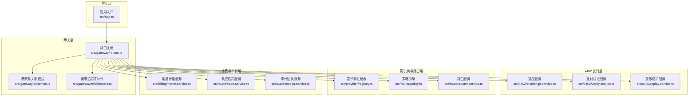
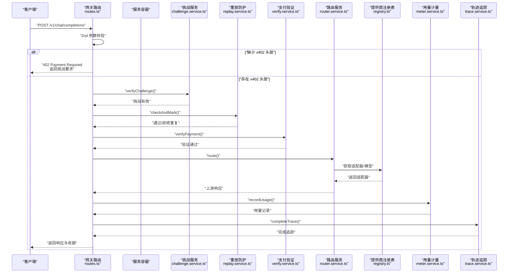
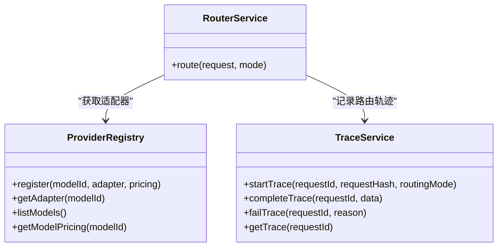
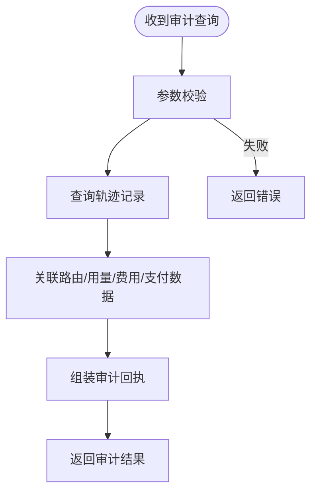
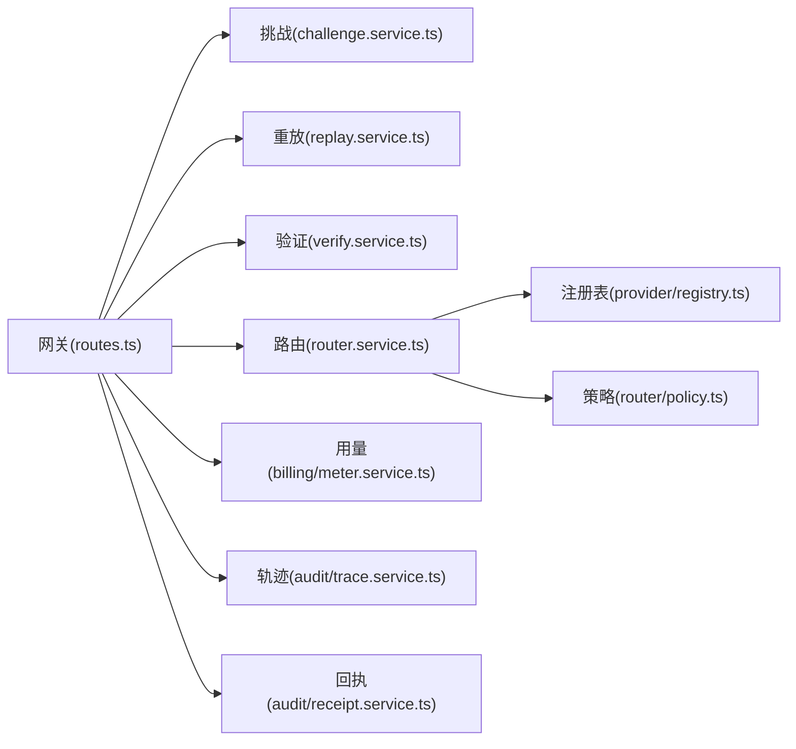

# 访问控制与权限管理

<cite>
**本文引用的文件**
- [src/app.ts](file://src/app.ts)
- [src/gateway/index.ts](file://src/gateway/index.ts)
- [src/gateway/middleware.ts](file://src/gateway/middleware.ts)
- [src/gateway/routes.ts](file://src/gateway/routes.ts)
- [src/gateway/schemas.ts](file://src/gateway/schemas.ts)
- [src/x402/index.ts](file://src/x402/index.ts)
- [src/x402/challenge.service.ts](file://src/x402/challenge.service.ts)
- [src/x402/verify.service.ts](file://src/x402/verify.service.ts)
- [src/x402/replay.service.ts](file://src/x402/replay.service.ts)
- [src/provider/registry.ts](file://src/provider/registry.ts)
- [src/router/policy.ts](file://src/router/policy.ts)
- [src/router/router.service.ts](file://src/router/router.service.ts)
- [src/audit/trace.service.ts](file://src/audit/trace.service.ts)
- [src/audit/receipt.service.ts](file://src/audit/receipt.service.ts)
- [src/billing/meter.service.ts](file://src/billing/meter.service.ts)
</cite>

## 目录
1. [引言](#引言)
2. [项目结构](#项目结构)
3. [核心组件](#核心组件)
4. [架构总览](#架构总览)
5. [详细组件分析](#详细组件分析)
6. [依赖关系分析](#依赖关系分析)
7. [性能考虑](#性能考虑)
8. [故障排查指南](#故障排查指南)
9. [结论](#结论)
10. [附录](#附录)

## 引言
本文件聚焦于本项目的访问控制与权限管理设计，围绕“支付驱动的访问控制”展开，涵盖以下主题：
- 基于角色的访问控制（RBAC）现状与扩展建议
- 用户身份认证与权限分配
- 会话管理与追踪
- API 端点访问控制策略：速率限制、IP 白名单、请求签名验证
- 密钥与凭证管理：API 密钥生成、轮换、撤销
- 第三方集成的安全访问控制：提供商适配器的权限隔离
- 安全审计与异常访问检测：入侵检测与响应流程

当前代码库以“x402 支付挑战-证明”机制为核心访问控制手段，通过挑战生成、支付验证与重放防护实现无状态的访问授权；同时提供审计与计费服务用于可追溯性与合规。

## 项目结构
系统采用分层模块化组织：
- 应用入口与插件装配：Fastify 插件注册、全局中间件与错误处理
- 网关层：路由定义、参数校验、头部解析
- x402 支付层：挑战生成与校验、支付证明验证、重放防护
- 提供商与路由层：模型注册、策略评分、路由决策
- 计费与审计层：用量记录、账单计算、轨迹追踪与审计回执
- 配置与类型：统一的类型与配置接口

图表来源
- [src/app.ts:35-100](file://src/app.ts#L35-L100)
- [src/gateway/routes.ts:9-96](file://src/gateway/routes.ts#L9-L96)
- [src/gateway/schemas.ts:1-32](file://src/gateway/schemas.ts#L1-L32)
- [src/gateway/middleware.ts:1-13](file://src/gateway/middleware.ts#L1-L13)
- [src/x402/challenge.service.ts:28-71](file://src/x402/challenge.service.ts#L28-L71)
- [src/x402/verify.service.ts:18-34](file://src/x402/verify.service.ts#L18-L34)
- [src/x402/replay.service.ts:23-52](file://src/x402/replay.service.ts#L23-L52)
- [src/provider/registry.ts:27-65](file://src/provider/registry.ts#L27-L65)
- [src/router/policy.ts:16-34](file://src/router/policy.ts#L16-L34)
- [src/router/router.service.ts:20-50](file://src/router/router.service.ts#L20-L50)
- [src/audit/trace.service.ts:38-68](file://src/audit/trace.service.ts#L38-L68)
- [src/audit/receipt.service.ts:14-26](file://src/audit/receipt.service.ts#L14-L26)
- [src/billing/meter.service.ts:13-29](file://src/billing/meter.service.ts#L13-L29)

章节来源
- [src/app.ts:35-100](file://src/app.ts#L35-L100)
- [src/gateway/routes.ts:9-96](file://src/gateway/routes.ts#L9-L96)

## 核心组件
- 应用入口与插件装配：注册 CORS、安全头、速率限制、通用工具，并注入服务容器与全局错误处理。
- 网关路由与参数校验：定义 /v1/chat/completions 与 /v1/models 等端点，使用 Zod 校验请求体与路径参数。
- x402 支付链路：挑战生成与校验、支付证明验证、重放防护与幂等缓存。
- 路由与策略：手动/自动模式下的路由决策与候选模型评分。
- 审计与计费：用量记录、轨迹追踪、审计回执查询。

章节来源
- [src/app.ts:35-100](file://src/app.ts#L35-L100)
- [src/gateway/routes.ts:9-96](file://src/gateway/routes.ts#L9-L96)
- [src/gateway/schemas.ts:1-32](file://src/gateway/schemas.ts#L1-L32)
- [src/x402/challenge.service.ts:28-71](file://src/x402/challenge.service.ts#L28-L71)
- [src/x402/verify.service.ts:18-34](file://src/x402/verify.service.ts#L18-L34)
- [src/x402/replay.service.ts:23-52](file://src/x402/replay.service.ts#L23-L52)
- [src/router/router.service.ts:20-50](file://src/router/router.service.ts#L20-L50)
- [src/router/policy.ts:16-34](file://src/router/policy.ts#L16-L34)
- [src/audit/trace.service.ts:38-68](file://src/audit/trace.service.ts#L38-L68)
- [src/audit/receipt.service.ts:14-26](file://src/audit/receipt.service.ts#L14-L26)
- [src/billing/meter.service.ts:13-29](file://src/billing/meter.service.ts#L13-L29)

## 架构总览
下图展示从客户端到上游模型的完整访问控制与计费流程，重点体现 x402 支付挑战-证明与审计追踪：

图表来源
- [src/gateway/routes.ts:23-67](file://src/gateway/routes.ts#L23-L67)
- [src/x402/challenge.service.ts:49-60](file://src/x402/challenge.service.ts#L49-L60)
- [src/x402/replay.service.ts:25-33](file://src/x402/replay.service.ts#L25-L33)
- [src/x402/verify.service.ts:20-31](file://src/x402/verify.service.ts#L20-L31)
- [src/router/router.service.ts:27-46](file://src/router/router.service.ts#L27-L46)
- [src/provider/registry.ts:44-49](file://src/provider/registry.ts#L44-L49)
- [src/billing/meter.service.ts:15-25](file://src/billing/meter.service.ts#L15-L25)
- [src/audit/trace.service.ts:49-55](file://src/audit/trace.service.ts#L49-L55)

## 详细组件分析

### 基于角色的访问控制（RBAC）现状与扩展
- 现状
  - 当前未实现基于角色的细粒度权限控制。访问控制主要通过 x402 支付挑战-证明实现，即“付费即授权”。
  - 提供商注册表支持按模型维度进行能力与定价信息管理，但未引入用户/角色/权限映射。
- 扩展建议
  - 引入用户/角色/权限实体与映射表，结合请求头或 JWT 中的用户标识进行授权判定。
  - 在网关层增加鉴权中间件：解析用户身份、加载角色与权限集合、匹配端点所需权限。
  - 对敏感端点（如审计查询）实施更严格的 RBAC 控制，仅允许具备审计权限的角色访问。
  - 将“模型可见性/可用性”纳入权限矩阵，实现按角色的模型白名单。

章节来源
- [src/provider/registry.ts:27-65](file://src/provider/registry.ts#L27-L65)
- [src/gateway/routes.ts:72-94](file://src/gateway/routes.ts#L72-L94)

### 用户身份认证与会话管理
- 请求追踪 ID 注入
  - onRequest 钩子为每个请求生成唯一请求 ID，便于跨服务追踪与审计。
- 会话与状态
  - 当前实现为无状态访问控制，不维护传统会话状态。
  - 可选方案：在鉴权中间件中引入短期会话令牌（如 JWT），携带用户角色与权限，结合速率限制与 IP 白名单策略。
- 与 x402 的协同
  - x402 作为“一次性凭据”，适合无状态场景；RBAC 则更适合长期权限管理。二者可并行：RBAC 决定“谁可以发起请求”，x402 决定“是否已付费”。

章节来源
- [src/gateway/middleware.ts:9-12](file://src/gateway/middleware.ts#L9-L12)
- [src/app.ts:50](file://src/app.ts#L50)

### API 端点访问控制策略
- 速率限制
  - 已注册 @fastify/rate-limit 插件，默认每分钟最多 100 次请求，可按端点细化策略。
- IP 白名单
  - 可在网关层增加中间件：读取客户端真实 IP（考虑反向代理头），与白名单比对后放行或拒绝。
- 请求签名验证
  - 可在鉴权中间件中实现：对特定端点启用签名验证，使用私钥对请求参数签名，服务端用公钥验证。
- 端点策略示例
  - /v1/chat/completions：默认开启速率限制；可选启用签名验证与 IP 白名单。
  - /v1/models：公开端点，仅做基本速率限制。
  - /v1/audit/requests/:request_id：敏感端点，需 RBAC 授权与 IP 白名单。

章节来源
- [src/app.ts:46](file://src/app.ts#L46)
- [src/gateway/routes.ts:9-96](file://src/gateway/routes.ts#L9-L96)

### 密钥管理系统（API 密钥）
- 生成
  - 为每个用户/客户端生成一对公私钥，私钥仅在客户端保存，公钥上送至服务端注册。
- 轮换
  - 提供密钥轮换接口：生成新密钥对，旧密钥在到期时间后失效。
- 撤销
  - 在鉴权中间件中维护“撤销列表”，命中则拒绝请求。
- 与签名验证协同
  - 对启用签名验证的端点，使用公钥验证客户端签名；对未启用签名的端点，仅执行 RBAC 与速率限制。

章节来源
- [src/gateway/routes.ts:9-96](file://src/gateway/routes.ts#L9-L96)

### 第三方集成的安全访问控制（提供商适配器）
- 权限隔离
  - 通过提供商注册表集中管理适配器与模型信息，避免路由阶段直接暴露底层实现细节。
  - 在路由服务中仅使用注册表提供的适配器，确保调用路径可控。
- 能力与定价约束
  - 将模型能力与定价信息纳入注册表，配合策略引擎实现“能力匹配+成本优先”的路由选择。
- 审计证据
  - 路由决策与实际执行结果均写入轨迹追踪，形成可审计的“路由证明”。

图表来源
- [src/provider/registry.ts:27-65](file://src/provider/registry.ts#L27-L65)
- [src/router/router.service.ts:20-50](file://src/router/router.service.ts#L20-L50)
- [src/audit/trace.service.ts:38-68](file://src/audit/trace.service.ts#L38-L68)

章节来源
- [src/provider/registry.ts:27-65](file://src/provider/registry.ts#L27-L65)
- [src/router/router.service.ts:20-50](file://src/router/router.service.ts#L20-L50)
- [src/audit/trace.service.ts:38-68](file://src/audit/trace.service.ts#L38-L68)

### 安全审计与异常访问检测
- 审计回执
  - 审计查询端点用于重建完整的审计记录，包含路由决策、用量、费用与支付数据。
- 轨迹追踪
  - 追踪请求生命周期：开始、完成、失败，记录关键指标与证明数据。
- 异常检测与响应
  - 建议在审计服务中增加异常规则：高频失败、异常耗时、异常金额、重复请求等，触发告警与临时封禁。
  - 结合重放防护与速率限制，降低滥用风险。

图表来源
- [src/gateway/routes.ts:82-94](file://src/gateway/routes.ts#L82-L94)
- [src/audit/receipt.service.ts:14-26](file://src/audit/receipt.service.ts#L14-L26)
- [src/audit/trace.service.ts:38-68](file://src/audit/trace.service.ts#L38-L68)

章节来源
- [src/gateway/routes.ts:82-94](file://src/gateway/routes.ts#L82-L94)
- [src/audit/receipt.service.ts:14-26](file://src/audit/receipt.service.ts#L14-L26)
- [src/audit/trace.service.ts:38-68](file://src/audit/trace.service.ts#L38-L68)

## 依赖关系分析
- 组件耦合
  - 网关层依赖 x402 服务与路由服务；路由服务依赖注册表与策略引擎；审计与计费服务贯穿请求链路。
- 外部依赖
  - Redis 用于重放防护与幂等缓存（待初始化）。
  - 数据库用于审计与账单持久化（待初始化）。
- 待实现与待初始化
  - 速率限制细化、IP 白名单、请求签名验证、Redis 初始化、数据库连接初始化。

图表来源
- [src/gateway/routes.ts:9-96](file://src/gateway/routes.ts#L9-L96)
- [src/x402/challenge.service.ts:28-71](file://src/x402/challenge.service.ts#L28-L71)
- [src/x402/replay.service.ts:23-52](file://src/x402/replay.service.ts#L23-L52)
- [src/x402/verify.service.ts:18-34](file://src/x402/verify.service.ts#L18-L34)
- [src/router/router.service.ts:20-50](file://src/router/router.service.ts#L20-L50)
- [src/router/policy.ts:16-34](file://src/router/policy.ts#L16-L34)
- [src/provider/registry.ts:27-65](file://src/provider/registry.ts#L27-L65)
- [src/billing/meter.service.ts:13-29](file://src/billing/meter.service.ts#L13-L29)
- [src/audit/trace.service.ts:38-68](file://src/audit/trace.service.ts#L38-L68)
- [src/audit/receipt.service.ts:14-26](file://src/audit/receipt.service.ts#L14-L26)

章节来源
- [src/gateway/routes.ts:9-96](file://src/gateway/routes.ts#L9-L96)
- [src/app.ts:77-94](file://src/app.ts#L77-L94)

## 性能考虑
- 无状态访问控制
  - x402 无需维护会话状态，有利于水平扩展与低延迟。
- 缓存与幂等
  - 使用 Redis 缓存幂等响应，减少重复计算与下游压力。
- 速率限制
  - 建议按端点与来源 IP 维度细分配额，避免热点资源被刷爆。
- 审计与计费
  - 审计与账单写入应异步化，避免阻塞主请求链路。

## 故障排查指南
- 常见问题定位
  - 402 未返回挑战：检查网关路由对 x402 头部的判断逻辑与参数校验。
  - 支付验证失败：核对资产、金额、收款地址与挑战要求一致。
  - 重放防护触发：确认 Redis 初始化与键空间命名规范。
  - 审计查询为空：确认轨迹记录是否成功写入与索引是否存在。
- 错误处理
  - 全局错误处理器区分业务错误与内部错误，确保对外输出一致且安全。

章节来源
- [src/app.ts:53-70](file://src/app.ts#L53-L70)
- [src/gateway/routes.ts:23-67](file://src/gateway/routes.ts#L23-L67)

## 结论
本项目以 x402 支付挑战-证明为核心实现了“付费即授权”的访问控制，结合无状态设计具备良好的可扩展性。为进一步强化安全，建议：
- 引入 RBAC 体系，对用户身份与端点权限进行精细化控制；
- 实施 IP 白名单、请求签名验证与速率限制细化；
- 完成 Redis 与数据库初始化，保障重放防护与审计持久化；
- 建立异常检测与响应机制，提升整体抗攻击能力。

## 附录
- 关键流程图与类图已在前述章节中给出，对应源码位置详见“图表来源”与“章节来源”。