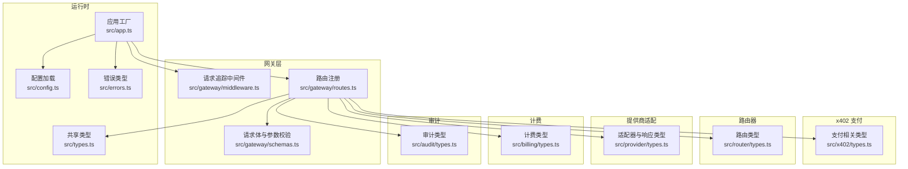
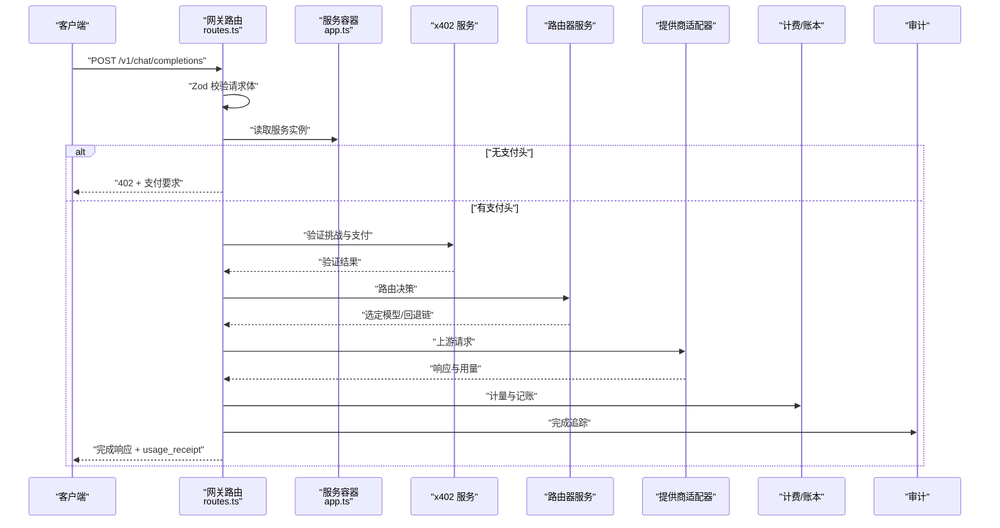
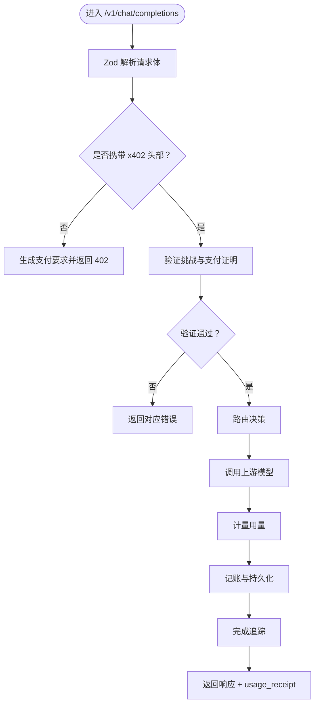
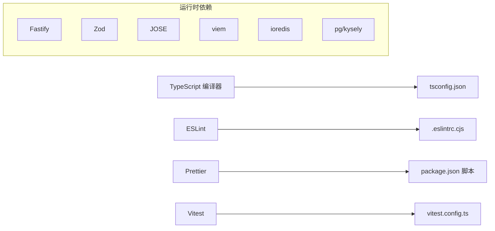

# 代码规范

<cite>
**本文引用的文件**
- [.eslintrc.cjs](file://.eslintrc.cjs)
- [package.json](file://package.json)
- [tsconfig.json](file://tsconfig.json)
- [README.md](file://README.md)
- [vitest.config.ts](file://vitest.config.ts)
- [src/app.ts](file://src/app.ts)
- [src/config.ts](file://src/config.ts)
- [src/errors.ts](file://src/errors.ts)
- [src/types.ts](file://src/types.ts)
- [src/gateway/middleware.ts](file://src/gateway/middleware.ts)
- [src/gateway/routes.ts](file://src/gateway/routes.ts)
- [src/gateway/schemas.ts](file://src/gateway/schemas.ts)
- [src/x402/types.ts](file://src/x402/types.ts)
- [src/router/types.ts](file://src/router/types.ts)
- [src/provider/types.ts](file://src/provider/types.ts)
- [src/billing/types.ts](file://src/billing/types.ts)
- [src/audit/types.ts](file://src/audit/types.ts)
</cite>

## 目录
1. [引言](#引言)
2. [项目结构](#项目结构)
3. [核心组件](#核心组件)
4. [架构总览](#架构总览)
5. [详细组件分析](#详细组件分析)
6. [依赖分析](#依赖分析)
7. [性能考虑](#性能考虑)
8. [故障排查指南](#故障排查指南)
9. [结论](#结论)
10. [附录](#附录)

## 引言
本文件为 x402 Gateway 项目的代码规范与最佳实践指南，覆盖 TypeScript 编码标准、命名约定、文件组织、ESLint 规则、代码格式化、导入顺序、错误处理模式、类型定义最佳实践、接口设计原则、注释与文档字符串要求、代码审查检查清单，以及架构约束、模块边界与依赖管理规则。内容基于仓库现有配置与源码进行提炼与总结，旨在统一团队开发体验、提升可维护性与一致性。

## 项目结构
项目采用按功能域分层的目录组织方式：入口与应用工厂位于根级，核心业务模块按领域拆分至独立子目录，测试与文档分别置于 test 与 docs 目录。该结构有利于职责清晰、边界明确、易于扩展与维护。

- 入口与应用工厂
  - 入口文件负责监听与优雅关闭
  - 应用工厂负责插件注册、钩子注入、全局错误处理与服务装配
- 核心模块
  - 网关层：路由、中间件、请求校验
  - x402 支付：挑战生成、支付验证、重放保护
  - 路由器：模型选择、回退链、路由证明
  - 提供商适配：上游模型适配器与注册表
  - 计费：用量计量、成本计算、账本
  - 审计：请求追踪、收据查询
- 类型与配置
  - 共享类型定义于统一文件
  - 环境变量通过 Zod 校验加载
- 测试与工具
  - Vitest 配置与覆盖率设置
  - ESLint 与 Prettier 脚本

图表来源
- [src/app.ts:1-101](file://src/app.ts#L1-L101)
- [src/config.ts:1-46](file://src/config.ts#L1-L46)
- [src/errors.ts:1-106](file://src/errors.ts#L1-L106)
- [src/types.ts:1-119](file://src/types.ts#L1-L119)
- [src/gateway/middleware.ts:1-13](file://src/gateway/middleware.ts#L1-L13)
- [src/gateway/routes.ts:1-96](file://src/gateway/routes.ts#L1-L96)
- [src/gateway/schemas.ts:1-32](file://src/gateway/schemas.ts#L1-L32)
- [src/x402/types.ts:1-37](file://src/x402/types.ts#L1-L37)
- [src/router/types.ts:1-22](file://src/router/types.ts#L1-L22)
- [src/provider/types.ts:1-36](file://src/provider/types.ts#L1-L36)
- [src/billing/types.ts:1-32](file://src/billing/types.ts#L1-L32)
- [src/audit/types.ts:1-38](file://src/audit/types.ts#L1-L38)

章节来源
- [README.md:79-106](file://README.md#L79-L106)
- [src/app.ts:1-101](file://src/app.ts#L1-L101)
- [src/config.ts:1-46](file://src/config.ts#L1-L46)

## 核心组件
- 应用工厂与服务容器
  - 统一注册 CORS、安全、限流、通用能力插件
  - 注入请求追踪钩子，生成唯一请求 ID
  - 全局错误处理器：区分业务错误、Zod 校验错误与内部错误
  - 服务容器集中装配各领域服务实例，供路由层调用
- 配置系统
  - 使用 Zod 对环境变量进行强类型校验与默认值设定
  - 涵盖端口、主机、日志级别、数据库与缓存连接、挑战密钥与过期时间、商户地址、支付链与资产、上游提供商密钥、平台费率等
- 错误体系
  - 继承自统一错误基类，映射到 API 错误码与状态码
  - 提供错误到响应体的转换函数，支持在特定错误类型下附加业务字段（如 402 需要的支付要求）
- 类型系统
  - 使用品牌化字符串类型避免混淆
  - 明确请求体、响应体、路由决策、用量、账本、审计等领域的数据契约
  - 保持与 API 规范一致的字段命名与结构

章节来源
- [src/app.ts:21-100](file://src/app.ts#L21-L100)
- [src/config.ts:4-26](file://src/config.ts#L4-L26)
- [src/errors.ts:6-105](file://src/errors.ts#L6-L105)
- [src/types.ts:6-119](file://src/types.ts#L6-L119)

## 架构总览
系统遵循“薄路由、厚服务”的分层设计：路由层仅做参数解析与调用服务，业务逻辑下沉至各领域服务；全局错误处理与中间件保证横切关注点的一致性；类型与校验贯穿始终，确保输入输出稳定可靠。

图表来源
- [src/gateway/routes.ts:23-67](file://src/gateway/routes.ts#L23-L67)
- [src/app.ts:77-94](file://src/app.ts#L77-L94)
- [src/x402/types.ts:1-37](file://src/x402/types.ts#L1-L37)
- [src/router/types.ts:1-22](file://src/router/types.ts#L1-L22)
- [src/provider/types.ts:26-35](file://src/provider/types.ts#L26-L35)
- [src/billing/types.ts:3-31](file://src/billing/types.ts#L3-L31)
- [src/audit/types.ts:3-12](file://src/audit/types.ts#L3-L12)

## 详细组件分析

### 网关层（路由与中间件）
- 中间件
  - 在 onRequest 钩子中注入唯一请求 ID，便于日志与追踪
  - 使用品牌化类型确保 ID 的语义一致性
- 路由
  - 严格区分公开端点与受 x402 保护的端点
  - 请求体使用 Zod Schema 进行编译期与运行期双重校验
  - 审计端点参数同样进行 Zod 校验
  - 当前支付流程处于 TODO 状态，后续将串联挑战验证、重放保护、支付验证、路由、计量、记账与追踪

图表来源
- [src/gateway/routes.ts:23-67](file://src/gateway/routes.ts#L23-L67)
- [src/gateway/schemas.ts:3-27](file://src/gateway/schemas.ts#L3-L27)
- [src/gateway/middleware.ts:9-12](file://src/gateway/middleware.ts#L9-L12)

章节来源
- [src/gateway/middleware.ts:1-13](file://src/gateway/middleware.ts#L1-L13)
- [src/gateway/routes.ts:1-96](file://src/gateway/routes.ts#L1-L96)
- [src/gateway/schemas.ts:1-32](file://src/gateway/schemas.ts#L1-L32)

### x402 支付（挑战、验证与重放）
- 类型设计
  - 挑战载荷：包含报价、请求哈希、金额、资产、链、商户地址与过期时间
  - 支付证明：包含交易哈希、链、付款人地址
  - 支付要求：API 响应体结构
  - 验证结果：链上验证的布尔结果与关键信息
- 设计原则
  - 将挑战与支付证明的结构化定义与业务逻辑解耦
  - 通过接口抽象验证流程，便于替换底层实现

章节来源
- [src/x402/types.ts:1-37](file://src/x402/types.ts#L1-L37)

### 路由器（模型选择与回退）
- 关键类型
  - 路由决策：包含选中模型、回退链、评分摘要与路由证明哈希
  - 候选模型：带分数与原因
  - 路由上下文：请求模型、路由模式与可用模型集合
- 设计原则
  - 将路由决策元数据纳入审计轨迹，便于复盘与合规

章节来源
- [src/router/types.ts:1-22](file://src/router/types.ts#L1-L22)

### 提供商适配（上游抽象）
- 接口设计
  - 统一执行接口与健康检查接口
  - 标准化上游响应结构（choices、usage、latency）
  - 统一错误形态（含提供商标识、状态码与消息）
- 设计原则
  - 通过抽象接口屏蔽不同提供商差异
  - 保持执行接口幂等与可测试性

章节来源
- [src/provider/types.ts:26-35](file://src/provider/types.ts#L26-L35)

### 计费与账本（用量与成本）
- 关键类型
  - 用量记录：请求维度的 prompt/completion/total tokens
  - 成本明细：小计、平台费用、总计与单价
  - 账本条目：不可变写入，包含请求、用量、成本与时间戳
- 设计原则
  - 账本为只增不改，确保审计一致性
  - 成本计算与用量计量分离，便于扩展与测试

章节来源
- [src/billing/types.ts:3-31](file://src/billing/types.ts#L3-L31)

### 审计（追踪与查询）
- 关键类型
  - 请求追踪：请求 ID、哈希、路由模式、状态、时间与延迟
  - 审计查询结果：路由决策、用量、成本、支付信息
- 设计原则
  - 审计数据结构与 API 规范对齐
  - 追踪贯穿请求生命周期，便于问题定位与复盘

章节来源
- [src/audit/types.ts:3-37](file://src/audit/types.ts#L3-L37)

### 配置与类型（共享契约）
- 配置
  - 使用 Zod schema 校验与默认值，确保运行时安全
- 类型
  - 品牌化字符串避免混用
  - 与 API 规范一致的请求/响应契约

章节来源
- [src/config.ts:4-26](file://src/config.ts#L4-L26)
- [src/types.ts:6-119](file://src/types.ts#L6-L119)

## 依赖分析
- 运行时与框架
  - Fastify 及其生态插件（CORS、Helmet、Rate Limit、Sensible）
  - 数据库与缓存：PostgreSQL 与 Redis
  - 验证与序列化：Zod
  - 加解密与令牌：JOSE
  - 区块链交互：viem
- 开发工具
  - TypeScript、ESLint、Prettier、Vitest
- 依赖管理
  - Node 16 模块解析与 ES2022 目标
  - 严格类型检查与未使用变量/参数报告
  - 未访问索引访问增强与未使用本地变量检测

图表来源
- [tsconfig.json:2-22](file://tsconfig.json#L2-L22)
- [.eslintrc.cjs:1-22](file://.eslintrc.cjs#L1-L22)
- [package.json:21-47](file://package.json#L21-L47)
- [vitest.config.ts:3-15](file://vitest.config.ts#L3-L15)

章节来源
- [package.json:21-47](file://package.json#L21-L47)
- [tsconfig.json:2-22](file://tsconfig.json#L2-L22)
- [.eslintrc.cjs:1-22](file://.eslintrc.cjs#L1-L22)
- [vitest.config.ts:3-15](file://vitest.config.ts#L3-L15)

## 性能考虑
- 严格类型与编译期检查可减少运行时错误，提高稳定性
- 使用品牌化字符串与 Zod 校验降低数据歧义与越界风险
- 将路由决策与上游调用解耦，便于缓存与并发优化
- 审计与账本的只增不改设计有助于长期可维护性与审计效率

## 故障排查指南
- 错误分类与处理
  - 业务错误：继承统一错误基类，映射到 API 错误码与状态码
  - Zod 校验错误：统一返回 400 并包含错误描述
  - 内部错误：记录日志并返回通用 500
- 建议排查步骤
  - 检查请求体是否符合 Zod Schema
  - 核对 x402 头部与挑战/支付证明
  - 查看路由决策与上游响应
  - 核对用量与成本计算
  - 检查审计追踪与账本条目

章节来源
- [src/errors.ts:6-105](file://src/errors.ts#L6-L105)
- [src/app.ts:53-70](file://src/app.ts#L53-L70)

## 结论
本规范以现有配置与源码为基础，明确了编码风格、类型设计、错误处理与模块边界。建议在后续开发中持续完善支付流程的完整实现，并补充各领域服务的具体实现细节与单元测试，以进一步提升系统的可靠性与可维护性。

## 附录

### TypeScript 编码标准与命名约定
- 文件与模块
  - 按功能域划分目录，每个模块导出 index.ts 作为聚合入口
  - 类型定义集中于 src/types.ts 或领域内 types.ts
- 命名
  - 接口与类型：名词或形容词，首字母大写
  - 函数与方法：动词短语，驼峰命名
  - 常量：全大写下划线
  - 品牌化字符串：以只读符号区分语义
- 导入顺序
  - 优先第三方库，再内部模块，最后相对路径
  - 同组内按字母序排列
- 注释与文档字符串
  - 公共 API 与复杂逻辑需提供 JSDoc 风格注释
  - TODO/FIXME 仅用于临时标记，需尽快清理
- 类型定义最佳实践
  - 优先使用 Zod Schema 进行输入校验
  - 输出结构尽量与 API 规范保持一致
  - 使用品牌化字符串与字面量类型提升安全性
- 接口设计原则
  - 单一职责、高内聚低耦合
  - 明确输入输出契约，避免隐式依赖
  - 抽象公共行为，隔离外部依赖

### ESLint 配置与代码格式化
- 已启用规则
  - TypeScript 推荐规则集
  - 忽略以单下划线开头的未使用变量
  - 控制台警告而非错误
- 格式化工具
  - 使用 Prettier 统一格式化
- 导入顺序
  - 通过 ESLint 插件与 Prettier 配合，确保导入顺序稳定
- 脚本命令
  - lint：检查源码
  - lint:fix：自动修复可修复问题
  - format：格式化代码
  - typecheck：类型检查

章节来源
- [.eslintrc.cjs:9-16](file://.eslintrc.cjs#L9-L16)
- [package.json:14-17](file://package.json#L14-L17)

### 代码审查检查清单
- 代码质量
  - 是否通过 lint 与 typecheck
  - 是否存在未使用的变量/参数
  - 是否使用品牌化字符串与 Zod 校验
- 错误处理
  - 是否覆盖所有分支错误场景
  - 是否正确抛出业务错误并映射到 API 错误码
- 类型与契约
  - 输入输出类型是否与 API 规范一致
  - 是否新增必要类型定义
- 可测试性
  - 是否提供单元测试与集成测试
  - 是否覆盖边界条件与异常路径
- 文档与注释
  - 是否更新相关文档
  - 是否补充必要的注释与 JSDoc

### 架构约束与模块边界
- 模块边界
  - 路由层只做薄处理，不包含业务逻辑
  - 服务层负责具体业务，保持无副作用与幂等
  - 类型与校验贯穿所有层，确保契约稳定
- 依赖管理
  - 通过服务容器集中装配，避免循环依赖
  - 第三方库与外部服务通过接口抽象，便于替换
- 变更策略
  - 新增功能优先在领域内扩展，避免侵入其他模块
  - 对外暴露的类型与错误码需保持向后兼容