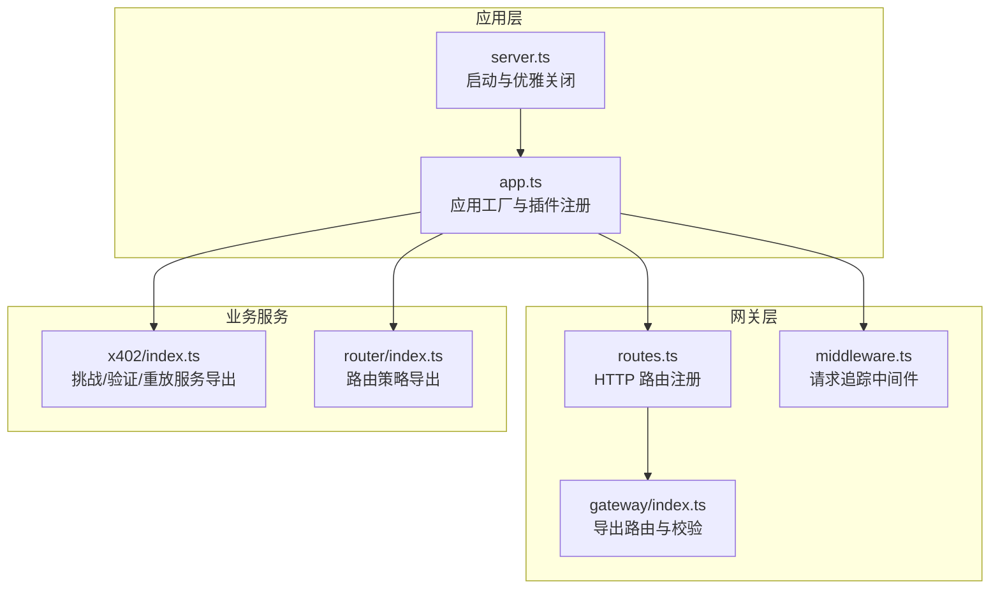
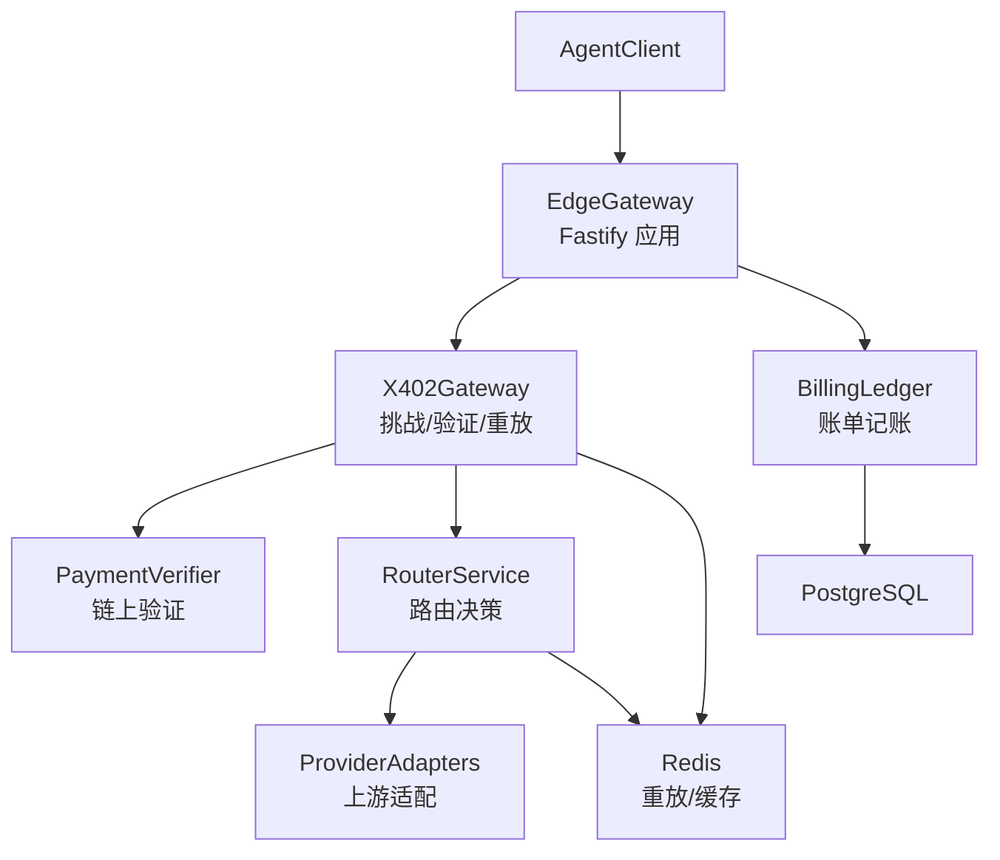
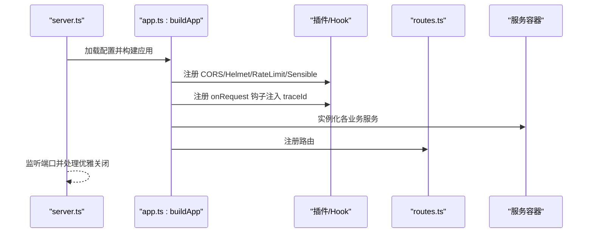
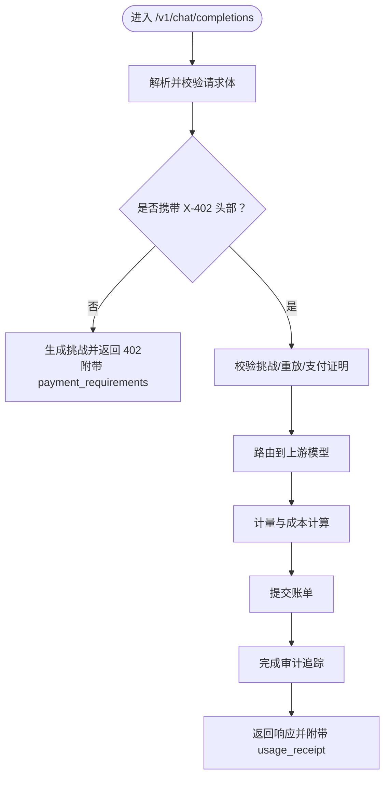
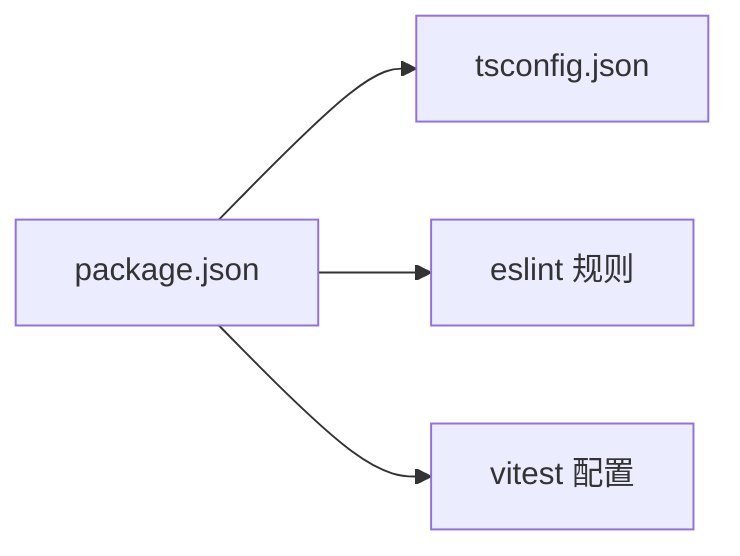

# 开发指南

<cite>
**本文引用的文件**
- [README.md](file://README.md)
- [package.json](file://package.json)
- [vitest.config.ts](file://vitest.config.ts)
- [.eslintrc.cjs](file://.eslintrc.cjs)
- [tsconfig.json](file://tsconfig.json)
- [src/app.ts](file://src/app.ts)
- [src/server.ts](file://src/server.ts)
- [src/config.ts](file://src/config.ts)
- [src/types.ts](file://src/types.ts)
- [src/errors.ts](file://src/errors.ts)
- [src/gateway/index.ts](file://src/gateway/index.ts)
- [src/gateway/middleware.ts](file://src/gateway/middleware.ts)
- [src/gateway/routes.ts](file://src/gateway/routes.ts)
- [src/x402/index.ts](file://src/x402/index.ts)
- [src/router/index.ts](file://src/router/index.ts)
- [test/setup.ts](file://test/setup.ts)
- [test/helpers.ts](file://test/helpers.ts)
- [test/integration/flow.test.ts](file://test/integration/flow.test.ts)
- [test/router/router.test.ts](file://test/router/router.test.ts)
- [test/x402/challenge.test.ts](file://test/x402/challenge.test.ts)
</cite>

## 目录
1. [简介](#简介)
2. [项目结构](#项目结构)
3. [核心组件](#核心组件)
4. [架构总览](#架构总览)
5. [详细组件分析](#详细组件分析)
6. [依赖分析](#依赖分析)
7. [性能考虑](#性能考虑)
8. [故障排查指南](#故障排查指南)
9. [结论](#结论)
10. [附录](#附录)

## 简介
本指南面向 x402 Gateway 项目的开发者，覆盖从开发环境搭建、代码贡献流程、测试策略到代码规范与质量保障的完整工作流。项目采用 TypeScript + Fastify 构建，支持 per-request x402 支付、链上验证、路由与账单结算、审计追踪等能力。当前仓库提供了基础应用工厂、配置加载、类型定义、错误体系以及模块化服务容器，测试框架使用 Vitest，并通过 ESLint、Prettier、TypeScript 编译器进行质量控制。

## 项目结构
项目采用按功能域分层的模块化组织方式，核心入口位于 src/，测试位于 test/，文档位于 docs/。关键职责划分如下：
- 应用工厂与启动：src/app.ts、src/server.ts
- 配置与类型：src/config.ts、src/types.ts
- 错误体系：src/errors.ts
- 网关路由与中间件：src/gateway/*
- x402 支付与验证：src/x402/*
- 路由策略与回退：src/router/*
- 审计与账单：src/audit/*、src/billing/*
- 提供商适配：src/provider/*
- 测试：test/*（含集成、模块级测试）

图表来源
- [src/server.ts:1-33](file://src/server.ts#L1-L33)
- [src/app.ts:35-100](file://src/app.ts#L35-L100)
- [src/gateway/routes.ts:1-96](file://src/gateway/routes.ts#L1-L96)
- [src/gateway/middleware.ts:1-13](file://src/gateway/middleware.ts#L1-L13)
- [src/gateway/index.ts:1-9](file://src/gateway/index.ts#L1-L9)
- [src/x402/index.ts:1-13](file://src/x402/index.ts#L1-L13)
- [src/router/index.ts:1-8](file://src/router/index.ts#L1-L8)

章节来源
- [README.md:79-106](file://README.md#L79-L106)
- [src/app.ts:35-100](file://src/app.ts#L35-L100)
- [src/server.ts:1-33](file://src/server.ts#L1-L33)

## 核心组件
- 应用工厂 buildApp：负责插件注册（CORS、Helmet、限流、通用响应）、全局错误处理、服务容器装配与路由注册。
- 配置加载 loadConfig：基于 zod 对环境变量进行强类型校验与默认值设置。
- 类型系统：统一的领域模型（聊天补全、模型目录、审计记录、收据）与品牌化标识符，确保类型安全。
- 错误体系：统一的 AppError 及其子类映射到 API 错误码，配合 errorToResponse 统一响应格式。
- 网关路由：/v1/chat/completions（OpenAI 兼容）、/v1/models、/v1/audit/requests/:request_id；当前支付流程为占位实现，待完善。
- x402 模块：挑战生成、支付证明验证、重放保护服务导出接口。
- 路由模块：策略引擎、回退服务、路由服务导出接口。

章节来源
- [src/app.ts:35-100](file://src/app.ts#L35-L100)
- [src/config.ts:28-45](file://src/config.ts#L28-L45)
- [src/types.ts:1-119](file://src/types.ts#L1-L119)
- [src/errors.ts:6-105](file://src/errors.ts#L6-L105)
- [src/gateway/routes.ts:9-96](file://src/gateway/routes.ts#L9-L96)
- [src/x402/index.ts:1-13](file://src/x402/index.ts#L1-L13)
- [src/router/index.ts:1-8](file://src/router/index.ts#L1-L8)

## 架构总览
下图展示从客户端到链上验证与上游提供商的整体调用链路，以及各模块间的依赖关系。

图表来源
- [README.md:26-35](file://README.md#L26-L35)
- [src/app.ts:72-97](file://src/app.ts#L72-L97)
- [src/gateway/routes.ts:10-22](file://src/gateway/routes.ts#L10-L22)

## 详细组件分析

### 应用工厂与启动
- 插件与钩子：注册 CORS、Helmet、限流、通用响应；在 onRequest 钩子注入唯一请求 ID。
- 全局错误处理：区分 AppError、Zod 校验错误与未知异常，输出标准化响应。
- 服务容器：装配 ProviderRegistry、ChallengeService、VerifyService、ReplayProtectionService、RouterService、MeterService、CostService、LedgerService、TraceService、ReceiptService。
- 路由注册：委托给 gateway/routes 注册所有 API。

图表来源
- [src/server.ts:4-26](file://src/server.ts#L4-L26)
- [src/app.ts:43-97](file://src/app.ts#L43-L97)

章节来源
- [src/server.ts:1-33](file://src/server.ts#L1-L33)
- [src/app.ts:35-100](file://src/app.ts#L35-L100)

### 配置与类型
- 配置校验：使用 zod 对端口、主机、数据库、Redis、挑战密钥、商户地址、支付链与资产、上游提供商密钥、平台费率等进行强类型解析与默认值设定。
- 类型定义：统一的聊天补全请求/响应、模型目录、审计记录、收据等结构体，避免跨模块的数据不一致。

章节来源
- [src/config.ts:28-45](file://src/config.ts#L28-L45)
- [src/types.ts:17-119](file://src/types.ts#L17-L119)

### 错误体系与统一响应
- 错误类：涵盖 402（首次请求无支付）、挑战过期、请求哈希不匹配、支付验证失败、重放、金额不足、上游超时/不可用、内部错误等。
- 响应转换：errorToResponse 将 AppError 映射为 API 响应结构，必要时附加 payment_requirements 字段。

章节来源
- [src/errors.ts:6-105](file://src/errors.ts#L6-L105)

### 网关路由与中间件
- 中间件：在 onRequest 阶段注入唯一请求 ID，便于日志与追踪。
- 路由：
  - POST /v1/chat/completions：当前返回 402 并附带占位的 payment_requirements；后续将实现挑战校验、重放检查、支付验证、路由、计量、记账与审计闭环。
  - GET /v1/models：返回模型目录。
  - GET /v1/audit/requests/:request_id：占位返回 501，后续接入收据查询服务。

图表来源
- [src/gateway/routes.ts:23-67](file://src/gateway/routes.ts#L23-L67)

章节来源
- [src/gateway/middleware.ts:9-12](file://src/gateway/middleware.ts#L9-L12)
- [src/gateway/routes.ts:9-96](file://src/gateway/routes.ts#L9-L96)

### x402 挑战与验证
- 挑战服务：根据配置生成挑战，包含到期时间、商户地址、支付链与资产等。
- 验证服务：对支付证明进行链上验证。
- 重放保护：基于 Redis 或内存实现幂等与去重。

章节来源
- [src/app.ts:77-94](file://src/app.ts#L77-L94)
- [src/x402/index.ts:1-13](file://src/x402/index.ts#L1-L13)

### 路由策略与回退
- 策略引擎：根据路由模式（手动/自动）与评分选择最优模型。
- 回退服务：在主选失败时按预设链路回退。
- 路由服务：对外提供路由决策接口。

章节来源
- [src/app.ts:88-88](file://src/app.ts#L88-L88)
- [src/router/index.ts:1-8](file://src/router/index.ts#L1-L8)

## 依赖分析
- 运行时依赖：Fastify 生态（CORS、Helmet、限流、通用响应）、Redis、PostgreSQL/Kysely、Zod、JOSE、viem、nanoid、pino、dotenv。
- 开发依赖：TypeScript、Vitest、ESLint、Prettier、TSX。
- 构建与脚本：dev/build/start/test/lint/typecheck/format/db:*。

图表来源
- [package.json:1-52](file://package.json#L1-L52)
- [tsconfig.json:1-24](file://tsconfig.json#L1-L24)
- [.eslintrc.cjs:1-22](file://.eslintrc.cjs#L1-L22)
- [vitest.config.ts:1-16](file://vitest.config.ts#L1-L16)

章节来源
- [package.json:1-52](file://package.json#L1-L52)
- [tsconfig.json:1-24](file://tsconfig.json#L1-L24)
- [.eslintrc.cjs:1-22](file://.eslintrc.cjs#L1-L22)
- [vitest.config.ts:1-16](file://vitest.config.ts#L1-L16)

## 性能考虑
- 启动与运行
  - 使用 Fastify 插件与内置限流降低请求延迟与资源占用。
  - 日志级别通过配置控制，生产环境建议使用 info/warn。
- 数据访问
  - PostgreSQL 与 Redis 连接应在应用启动阶段建立并复用，避免每次请求重复连接。
  - 在服务容器中注入已初始化的连接实例，减少 IO 开销。
- 缓存与去重
  - 利用 Redis 存储挑战、重放标记与路由缓存，缩短热路径响应时间。
- 计算与序列化
  - 类型校验与错误转换在边界处集中处理，避免重复逻辑。
  - 使用声明式类型与严格编译选项，减少运行时错误带来的额外开销。

## 故障排查指南
- 启动失败
  - 检查环境变量是否满足配置校验（如 DATABASE_URL、REDIS_URL、CHALLENGE_SECRET、MERCHANT_ADDRESS）。
  - 查看端口占用与权限问题。
- 请求 402 未触发挑战
  - 确认客户端未携带 X-402 头部；若已携带，请检查挑战与支付证明的有效性。
- 验证失败或重放
  - 核对挑战过期时间、请求哈希绑定与链上支付证明状态。
- 上游超时/不可用
  - 关注 504/503 错误，检查上游提供商可用性与网络连通性。
- 日志与追踪
  - 使用注入的请求 ID 在日志中定位请求生命周期，结合审计接口查询路由与结算证据。

章节来源
- [src/config.ts:28-45](file://src/config.ts#L28-L45)
- [src/errors.ts:17-81](file://src/errors.ts#L17-L81)
- [src/gateway/middleware.ts:9-12](file://src/gateway/middleware.ts#L9-L12)
- [src/gateway/routes.ts:23-67](file://src/gateway/routes.ts#L23-L67)

## 结论
本指南提供了从环境搭建到开发流程、测试策略、代码规范与质量保障的全景视图。当前路由与支付流程处于占位实现阶段，建议优先补齐挑战校验、支付验证、重放保护与路由执行的完整链路，并配套完善单元与集成测试，确保在生产环境中的稳定性与可维护性。

## 附录

### 开发环境搭建
- 环境要求：Node.js 20+、pnpm、Docker。
- 步骤：
  - 安装依赖：pnpm install
  - 启动数据库与缓存：pnpm db:up
  - 复制并编辑环境变量：cp .env.example .env
  - 启动开发服务器：pnpm dev
- 服务器默认监听：http://localhost:3000

章节来源
- [README.md:5-24](file://README.md#L5-L24)

### 代码贡献流程
- 分支策略
  - 主分支：保护，仅允许通过评审合并。
  - 功能分支：基于主分支创建，命名示例 feature/xxx 或 fix/xxx。
  - 合并前：确保通过 lint、typecheck、test、覆盖率检查。
- 提交流程
  - 提交前：运行 pnpm lint、pnpm typecheck、pnpm format。
  - 提交信息：遵循约定式提交（例如 feat(xxx): ...、fix(xxx): ...）。
  - 创建 Pull Request：填写描述与变更摘要，至少一名 reviewer 通过后方可合并。

章节来源
- [README.md:65-77](file://README.md#L65-L77)
- [package.json:7-19](file://package.json#L7-L19)

### 测试策略与配置
- 测试框架：Vitest
  - 运行：pnpm test、pnpm test:watch、pnpm test:coverage
  - 覆盖率：对 src 下文件统计，排除 server.ts
- 测试组织
  - test/setup.ts：全局测试设置
  - test/helpers.ts：测试工具与辅助方法
  - test/x402/challenge.test.ts：x402 挑战相关测试
  - test/router/router.test.ts：路由模块测试
  - test/integration/flow.test.ts：端到端流程测试
- 单元测试
  - 针对服务层（挑战、验证、重放、路由、计量、账单、审计）编写独立测试，使用 mock 与假数据隔离外部依赖。
- 集成测试
  - 模拟真实请求路径，验证从网关到上游提供商的完整链路，包括支付流程与审计收据生成。

章节来源
- [vitest.config.ts:1-16](file://vitest.config.ts#L1-L16)
- [test/setup.ts](file://test/setup.ts)
- [test/helpers.ts](file://test/helpers.ts)
- [test/x402/challenge.test.ts](file://test/x402/challenge.test.ts)
- [test/router/router.test.ts](file://test/router/router.test.ts)
- [test/integration/flow.test.ts](file://test/integration/flow.test.ts)

### 代码规范与质量
- 类型与风格
  - TypeScript：严格模式、禁止未使用变量/参数、索引访问安全。
  - Prettier：统一代码风格，通过 pnpm format 自动格式化。
- 规范检查
  - ESLint：推荐规则 + TypeScript ESLint 插件；忽略未使用变量前缀下划线。
- 文档与变更记录
  - 参考 docs/ 目录下的工程手册、API 规范与架构决策记录。

章节来源
- [tsconfig.json:9-19](file://tsconfig.json#L9-L19)
- [.eslintrc.cjs:13-16](file://.eslintrc.cjs#L13-L16)
- [README.md:116-124](file://README.md#L116-L124)

### 调试技巧
- 日志：通过配置 logLevel 控制输出级别；使用注入的 request.id 快速关联请求。
- 断点与热重载：开发模式使用 TSX watch，修改即重启。
- 网络与链上验证：使用浏览器或 CLI 工具模拟请求，观察 402/400/409/402/504/503 等响应与错误码。

章节来源
- [src/app.ts:36-41](file://src/app.ts#L36-L41)
- [src/gateway/middleware.ts:9-12](file://src/gateway/middleware.ts#L9-L12)
- [package.json:8](file://package.json#L8)

### 新功能开发工作流与质量保证
- 设计与接口
  - 在 src/types.ts 中补充或调整领域模型；在对应模块的 index.ts 导出新接口。
- 实现与测试
  - 在 src/ 对应目录实现服务；在 test/ 对应目录补充单元与集成测试。
  - 使用 test/helpers.ts 提供的工具构造测试场景，覆盖正常与异常分支。
- 质量门禁
  - 通过 pnpm lint、pnpm typecheck、pnpm test、pnpm test:coverage。
  - 代码评审关注：错误处理完整性、边界条件、性能影响、可维护性与文档一致性。

章节来源
- [src/types.ts:1-119](file://src/types.ts#L1-L119)
- [src/x402/index.ts:1-13](file://src/x402/index.ts#L1-L13)
- [src/router/index.ts:1-8](file://src/router/index.ts#L1-L8)
- [test/helpers.ts](file://test/helpers.ts)
- [README.md:65-77](file://README.md#L65-L77)