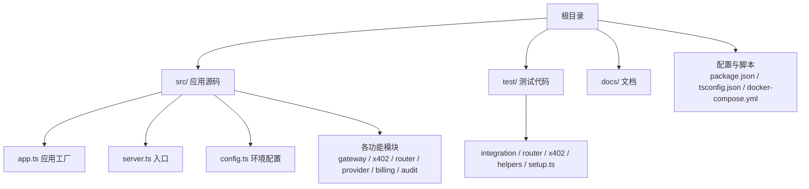
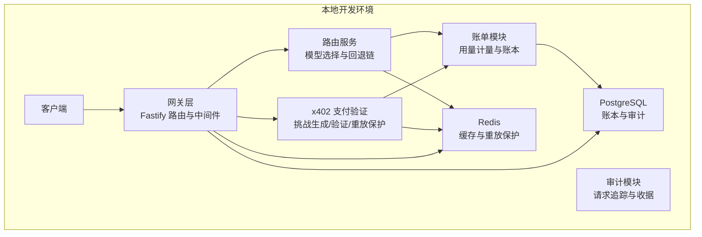
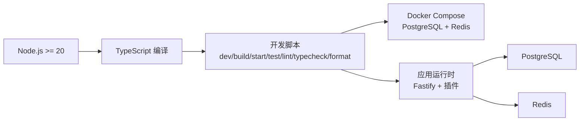

# 开发环境搭建

<cite>
**本文引用的文件**
- [package.json](file://package.json)
- [docker-compose.yml](file://docker-compose.yml)
- [tsconfig.json](file://tsconfig.json)
- [README.md](file://README.md)
- [src/config.ts](file://src/config.ts)
- [src/server.ts](file://src/server.ts)
- [src/app.ts](file://src/app.ts)
- [vitest.config.ts](file://vitest.config.ts)
- [.eslintrc.cjs](file://.eslintrc.cjs)
- [test/setup.ts](file://test/setup.ts)
</cite>

## 目录
1. [简介](#简介)
2. [项目结构](#项目结构)
3. [核心组件](#核心组件)
4. [架构总览](#架构总览)
5. [详细组件分析](#详细组件分析)
6. [依赖分析](#依赖分析)
7. [性能考虑](#性能考虑)
8. [故障排查指南](#故障排查指南)
9. [结论](#结论)
10. [附录](#附录)

## 简介
本指南面向 x402 Gateway 项目的开发者，提供从零搭建本地开发环境的完整步骤，涵盖 Node.js 运行时与包管理器、TypeScript 编译配置、Docker 与数据库/缓存服务、环境变量与配置加载、IDE 推荐与调试配置、以及开发工具链与版本兼容性要求。目标是帮助你在最短时间内完成环境准备并顺利运行项目。

## 项目结构
该仓库采用按功能模块划分的目录组织方式，核心入口位于 src/server.ts，应用工厂在 src/app.ts 中构建；数据库与缓存通过 Docker Compose 启动；TypeScript 编译与测试工具链由 package.json 脚本统一管理。

**图表来源**
- [README.md:79-106](file://README.md#L79-L106)
- [package.json:7-20](file://package.json#L7-L20)

**章节来源**
- [README.md:79-106](file://README.md#L79-L106)
- [package.json:7-20](file://package.json#L7-L20)

## 核心组件
- Node.js 与包管理器：要求 Node.js >= 20，使用 pnpm 作为包管理器；项目脚本定义了开发、构建、测试、格式化、类型检查、Lint 等常用命令。
- TypeScript 编译：编译目标 ES2022，模块解析 Node16，严格模式开启，生成声明与 SourceMap，便于调试与发布。
- Docker 与服务编排：通过 docker-compose.yml 提供 PostgreSQL 与 Redis 服务，含健康检查与持久化卷。
- 配置系统：基于 zod 的环境变量校验与默认值注入，支持数据库连接、Redis 连接、挑战密钥与商户地址等关键参数。
- 应用入口与工厂：入口文件负责监听端口与优雅关闭；应用工厂注册插件、中间件、错误处理与路由，并装配业务服务容器。

**章节来源**
- [package.json:48-50](file://package.json#L48-L50)
- [package.json:7-20](file://package.json#L7-L20)
- [tsconfig.json:1-24](file://tsconfig.json#L1-L24)
- [docker-compose.yml:1-31](file://docker-compose.yml#L1-L31)
- [src/config.ts:1-46](file://src/config.ts#L1-L46)
- [src/server.ts:1-33](file://src/server.ts#L1-L33)
- [src/app.ts:1-101](file://src/app.ts#L1-L101)

## 架构总览
下图展示了本地开发环境中的关键组件及其交互：客户端请求经由网关层进入，支付验证与路由决策贯穿 x402 挑战、账单计量与审计模块；数据持久化依赖 PostgreSQL，缓存与去重依赖 Redis。

**图表来源**
- [README.md:26-35](file://README.md#L26-L35)
- [src/app.ts:72-98](file://src/app.ts#L72-L98)
- [docker-compose.yml:1-31](file://docker-compose.yml#L1-L31)

## 详细组件分析

### Node.js 与包管理器
- 版本要求：引擎字段明确要求 Node.js >= 20。
- 包管理器：使用 pnpm 安装依赖；README 与脚本中均以 pnpm 命令为主。
- 开发脚本：包含 dev（热重载）、build（编译）、start（运行）、test、lint、typecheck、format、db:up/down（Docker）等。

建议
- 使用 nvm 或 fnm 管理 Node.js 版本，确保满足 >= 20 的要求。
- 若尚未安装 pnpm，可参考官方文档进行安装。

**章节来源**
- [package.json:48-50](file://package.json#L48-L50)
- [README.md:7-22](file://README.md#L7-L22)
- [package.json:7-20](file://package.json#L7-L20)

### TypeScript 编译配置
- 目标与模块：ES2022，Node16 模块与解析策略，适配 ESM。
- 严格性：启用严格模式、未使用局部变量/参数检查，避免索引访问不确定性。
- 输出：dist 目录，SourceMap 与声明文件生成，便于调试与分发。
- 包含范围：仅包含 src，排除 node_modules、dist、test。

建议
- 在 IDE 中启用“在外部编辑器打开”或使用内置终端执行 tsc --noEmit 进行类型检查。
- 如需增量编译，可在 IDE 设置中启用 tsconfig 的 include/exclude 规则。

**章节来源**
- [tsconfig.json:1-24](file://tsconfig.json#L1-L24)

### Docker 与数据库/缓存服务
- PostgreSQL
  - 镜像：postgres:16-alpine
  - 端口映射：5432
  - 环境变量：用户名、密码、数据库名
  - 健康检查：pg_isready
  - 数据卷：pgdata
- Redis
  - 镜像：redis:7-alpine
  - 端口映射：6379
  - 命令：限制最大内存与淘汰策略
  - 健康检查：redis-cli ping
- 启停命令：通过 package.json 的 db:up 与 db:down 脚本调用 docker compose。

建议
- 初次启动后，确认容器健康状态；如需清理数据，删除 pgdata 卷或执行 docker volume prune。
- 如需自定义数据库初始化，可在 docker-compose.yml 中添加 init 脚本或迁移流程。

**章节来源**
- [docker-compose.yml:1-31](file://docker-compose.yml#L1-L31)
- [package.json:18-19](file://package.json#L18-L19)

### 环境变量与配置加载
- 配置项
  - 服务：端口、主机、日志级别、运行环境
  - 存储：DATABASE_URL、REDIS_URL
  - x402：CHALLENGE_SECRET（最小长度）、CHALLENGE_TTL_SECONDS、商户地址（0x 前缀）、支付链与资产（默认 base/USDC）
  - 上游密钥：OPENAI_API_KEY、ANTHROPIC_API_KEY
  - 平台费用：PLATFORM_FEE_BPS（基点）
- 加载机制：dotenv 自动加载 .env；zod schema 校验并提供默认值；所有键均为必填或有合理默认。
- 测试环境：Vitest 全局 setup 文件加载 .env.example，确保测试时具备相同变量。

建议
- 复制 .env.example 为 .env 并按提示填写必要变量。
- 对于上游提供商密钥，仅在需要调用对应上游时配置；本地开发可留空以跳过相关路径。

**章节来源**
- [src/config.ts:1-46](file://src/config.ts#L1-L46)
- [README.md:16-18](file://README.md#L16-L18)
- [test/setup.ts:1-4](file://test/setup.ts#L1-L4)

### 应用入口与工厂
- 入口职责：加载配置、构建应用、监听端口、处理信号进行优雅关闭。
- 工厂职责：注册 CORS、Helmet、限流、sensible 插件；注入 traceId 钩子；全局错误处理；装配服务容器并注册路由。
- 服务容器：包含 Provider 注册表、挑战/验证/重放保护、路由、计量/成本/账本、追踪/收据等服务。

建议
- 在开发阶段，可通过修改日志级别与主机绑定快速定位问题。
- 如需扩展服务，遵循 ServiceContainer 接口约定注入到 app 工厂。

**章节来源**
- [src/server.ts:1-33](file://src/server.ts#L1-L33)
- [src/app.ts:1-101](file://src/app.ts#L1-L101)

### 测试与质量工具
- 测试框架：Vitest，全局环境为 node，包含覆盖率统计（排除 server.ts）。
- Lint：ESLint + TypeScript ESLint，规则包含未使用变量与控制台警告。
- 格式化：Prettier 统一风格。
- 类型检查：tsc --noEmit 用于 CI 或本地预检。

建议
- 在提交前执行 lint、typecheck、test、format，确保一致性。
- 如需调试测试，使用 vitest --inspect-brk 或 IDE 断点调试。

**章节来源**
- [vitest.config.ts:1-16](file://vitest.config.ts#L1-L16)
- [.eslintrc.cjs:1-22](file://.eslintrc.cjs#L1-L22)
- [package.json:11-17](file://package.json#L11-L17)

## 依赖分析
- 运行时依赖
  - Web 框架与安全：fastify、@fastify/cors、@fastify/helmet、@fastify/rate-limit、@fastify/sensible
  - 数据库与查询：pg、kysely
  - 缓存：ioredis
  - 校验与加密：zod、jose
  - 日志与工具：pino、dotenv、viem
- 开发依赖
  - TypeScript、tsx（开发热重载）、vitest、ESLint 及 TS 解析器、Prettier
- 引擎要求：node >= 20

**图表来源**
- [package.json:21-47](file://package.json#L21-L47)
- [package.json:48-50](file://package.json#L48-L50)
- [docker-compose.yml:1-31](file://docker-compose.yml#L1-L31)

**章节来源**
- [package.json:21-47](file://package.json#L21-L47)
- [package.json:48-50](file://package.json#L48-L50)

## 性能考虑
- 热重载：开发模式使用 tsx watch，变更文件后自动重启，提升迭代效率。
- 编译优化：启用严格模式与未使用检测，减少运行时开销与潜在错误。
- 数据库与缓存：生产环境建议使用连接池与合适的超时配置；本地开发可保持默认，但注意并发测试对数据库/缓存的影响。
- 日志：根据需要调整日志级别，避免在高频请求场景下产生过多 I/O。

[本节为通用指导，不直接分析具体文件]

## 故障排查指南
常见问题与解决思路
- 端口占用
  - 现象：启动失败，提示端口被占用。
  - 处理：修改配置中的端口或释放占用进程。
- 数据库连接失败
  - 现象：应用无法连接 PostgreSQL。
  - 处理：确认 DATABASE_URL、容器健康状态与网络连通；必要时重建容器。
- Redis 连接失败
  - 现象：应用无法连接 Redis。
  - 处理：确认 REDIS_URL、容器健康状态与网络连通；必要时重建容器。
- 环境变量缺失
  - 现象：配置校验失败或运行时报错。
  - 处理：复制 .env.example 并补齐 CHALLENGE_SECRET、MERCHANT_ADDRESS、上游密钥等。
- 热重载无效
  - 现象：修改代码后无变化。
  - 处理：确认 tsx watch 是否运行；检查文件是否在 include 范围内；清理缓存后重试。

**章节来源**
- [src/config.ts:1-46](file://src/config.ts#L1-L46)
- [src/server.ts:1-33](file://src/server.ts#L1-L33)
- [docker-compose.yml:1-31](file://docker-compose.yml#L1-L31)

## 结论
通过以上步骤，你可以在本地快速搭建 x402 Gateway 的开发环境：安装 Node.js 20+ 与 pnpm，拉取依赖，启动 PostgreSQL 与 Redis，配置环境变量，运行开发服务器并配合测试、Lint、格式化工具链。建议在开发过程中充分利用热重载与严格的类型检查，结合 Docker 服务保障数据与缓存的一致性。

[本节为总结性内容，不直接分析具体文件]

## 附录

### 环境变量清单与用途
- 服务类
  - PORT：HTTP 监听端口
  - HOST：监听主机
  - NODE_ENV：运行环境（development/test/production）
  - LOG_LEVEL：日志级别
- 存储类
  - DATABASE_URL：PostgreSQL 连接字符串
  - REDIS_URL：Redis 连接字符串
- x402 支付类
  - CHALLENGE_SECRET：挑战签名密钥（最小长度）
  - CHALLENGE_TTL_SECONDS：挑战有效期（秒）
  - MERCHANT_ADDRESS：商户钱包地址（0x 前缀）
  - PAYMENT_CHAIN：支付链（默认 base）
  - PAYMENT_ASSET：支付资产（默认 USDC）
- 上游密钥（可选）
  - OPENAI_API_KEY：OpenAI 密钥
  - ANTHROPIC_API_KEY：Anthropic 密钥
- 平台费用
  - PLATFORM_FEE_BPS：平台抽成（基点）

**章节来源**
- [src/config.ts:4-24](file://src/config.ts#L4-L24)

### 开发工具链与版本兼容性
- Node.js：>= 20（引擎要求）
- TypeScript：^5.8.3
- 包管理器：pnpm（项目脚本以 pnpm 为主）
- Docker：用于本地数据库与缓存服务
- 测试：Vitest（Node 环境，覆盖率 v8）
- Lint：ESLint + @typescript-eslint
- 格式化：Prettier

**章节来源**
- [package.json:37-47](file://package.json#L37-L47)
- [package.json:48-50](file://package.json#L48-L50)
- [vitest.config.ts:1-16](file://vitest.config.ts#L1-L16)
- [.eslintrc.cjs:1-22](file://.eslintrc.cjs#L1-L22)

### IDE 推荐设置与调试配置
- VS Code 扩展（建议）
  - ESLint：实时语法与风格检查
  - Prettier：统一代码风格
  - TypeScript Importer：自动导入
  - DotENV：.env 文件高亮与补全
  - Docker：容器与镜像管理
- 调试配置（建议）
  - 使用 Node 检查器附加到 tsx watch 进程
  - 在 IDE 中设置断点，逐步调试路由、挑战生成与账单写入等关键流程
- 热重载
  - 通过 package.json 的 dev 脚本启用 tsx watch，保存即触发重启

**章节来源**
- [package.json:7-8](file://package.json#L7-L8)
- [README.md:65-77](file://README.md#L65-L77)