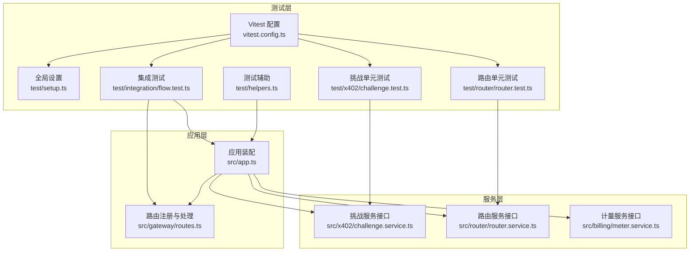
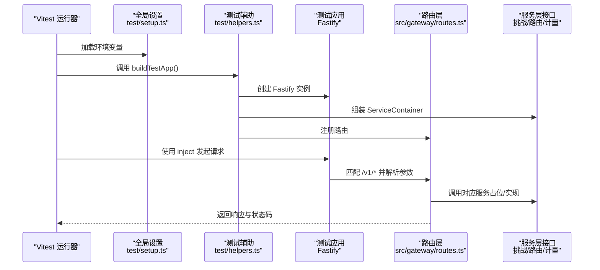
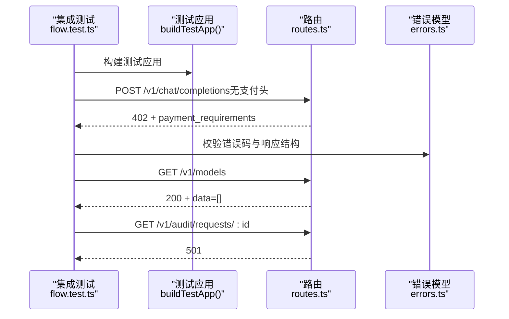
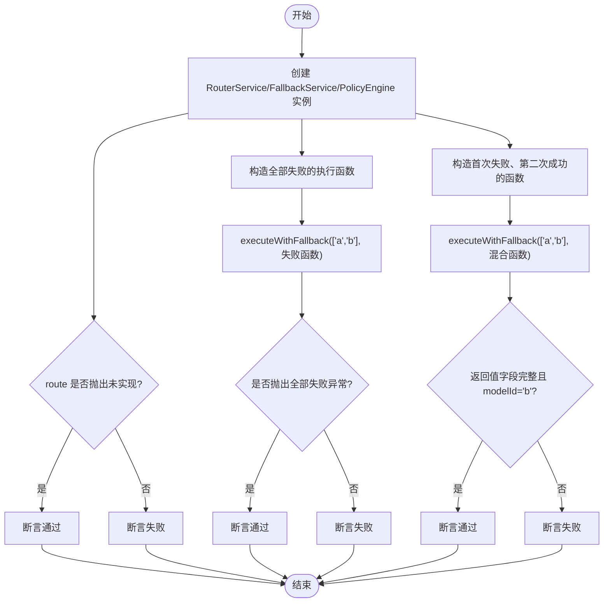
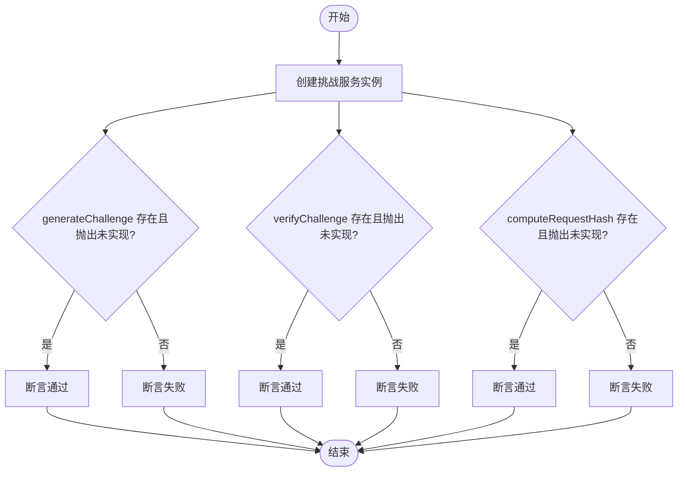
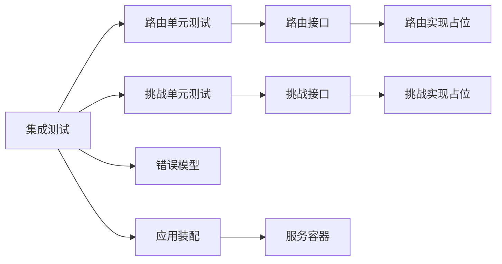

# 测试策略

<cite>
**本文引用的文件**
- [vitest.config.ts](file://vitest.config.ts)
- [package.json](file://package.json)
- [test/setup.ts](file://test/setup.ts)
- [test/helpers.ts](file://test/helpers.ts)
- [test/integration/flow.test.ts](file://test/integration/flow.test.ts)
- [test/router/router.test.ts](file://test/router/router.test.ts)
- [test/x402/challenge.test.ts](file://test/x402/challenge.test.ts)
- [src/app.ts](file://src/app.ts)
- [src/gateway/routes.ts](file://src/gateway/routes.ts)
- [src/x402/challenge.service.ts](file://src/x402/challenge.service.ts)
- [src/router/router.service.ts](file://src/router/router.service.ts)
- [src/billing/meter.service.ts](file://src/billing/meter.service.ts)
- [src/config.ts](file://src/config.ts)
- [src/types.ts](file://src/types.ts)
- [src/errors.ts](file://src/errors.ts)
</cite>

## 目录
1. [引言](#引言)
2. [项目结构](#项目结构)
3. [核心组件](#核心组件)
4. [架构总览](#架构总览)
5. [详细组件分析](#详细组件分析)
6. [依赖关系分析](#依赖关系分析)
7. [性能考虑](#性能考虑)
8. [故障排查指南](#故障排查指南)
9. [结论](#结论)
10. [附录](#附录)

## 引言
本测试策略文档面向 x402 Gateway 项目，围绕 Vitest 测试框架的配置与使用，系统阐述测试文件组织、测试生命周期管理、单元测试与集成测试设计原则，并给出端到端测试的可扩展路径。文档同时覆盖测试辅助函数、模拟对象与测试数据准备、覆盖率要求、性能测试方法、错误场景测试策略，以及测试环境配置、数据库隔离与并发测试注意事项。

## 项目结构
项目采用按功能域分层的目录组织方式：业务逻辑位于 src 下的审计、账单、网关、路由、x402 等子模块；测试用例位于 test 目录下，按领域进一步细分（如 integration、router、x402），并辅以通用的测试辅助与全局设置。

- 测试配置与脚本
  - Vitest 配置集中于 [vitest.config.ts](file://vitest.config.ts)，定义全局环境、测试扫描范围、覆盖率策略与初始化脚本。
  - 测试脚本在 [package.json](file://package.json) 中定义，包括运行、监听、覆盖率等命令。
  - 全局测试环境通过 [test/setup.ts](file://test/setup.ts) 加载示例环境变量，确保测试一致性。

- 测试组织
  - 集成测试：[test/integration/flow.test.ts](file://test/integration/flow.test.ts) 覆盖路由层行为与支付流程的端到端路径。
  - 单元测试：[test/router/router.test.ts](file://test/router/router.test.ts)、[test/x402/challenge.test.ts](file://test/x402/challenge.test.ts) 分别针对路由与挑战服务进行接口与边界条件验证。
  - 辅助工具：[test/helpers.ts](file://test/helpers.ts) 提供构建测试应用实例与服务容器的工厂方法，便于快速搭建隔离的测试环境。

- 关键源码映射
  - 应用装配与服务容器：[src/app.ts](file://src/app.ts) 定义服务接口与装配流程，是集成测试与路由单元测试的重要参考。
  - 路由注册与请求处理：[src/gateway/routes.ts](file://src/gateway/routes.ts) 描述 API 行为与状态码预期，是集成测试断言依据。
  - 服务接口与实现占位：[src/x402/challenge.service.ts](file://src/x402/challenge.service.ts)、[src/router/router.service.ts](file://src/router/router.service.ts)、[src/billing/meter.service.ts](file://src/billing/meter.service.ts) 明确接口契约，指导单元测试的桩与断言。
  - 类型与错误模型：[src/types.ts](file://src/types.ts)、[src/errors.ts](file://src/errors.ts) 为测试断言提供类型与错误码依据。

图表来源
- [vitest.config.ts:1-16](file://vitest.config.ts#L1-L16)
- [test/setup.ts:1-4](file://test/setup.ts#L1-L4)
- [test/helpers.ts:1-45](file://test/helpers.ts#L1-L45)
- [test/integration/flow.test.ts:1-51](file://test/integration/flow.test.ts#L1-L51)
- [test/router/router.test.ts:1-68](file://test/router/router.test.ts#L1-L68)
- [test/x402/challenge.test.ts:1-28](file://test/x402/challenge.test.ts#L1-L28)
- [src/app.ts:1-101](file://src/app.ts#L1-L101)
- [src/gateway/routes.ts:1-96](file://src/gateway/routes.ts#L1-L96)
- [src/x402/challenge.service.ts:1-71](file://src/x402/challenge.service.ts#L1-L71)
- [src/router/router.service.ts:1-50](file://src/router/router.service.ts#L1-L50)
- [src/billing/meter.service.ts:1-29](file://src/billing/meter.service.ts#L1-L29)

章节来源
- [vitest.config.ts:1-16](file://vitest.config.ts#L1-L16)
- [package.json:1-52](file://package.json#L1-L52)
- [test/setup.ts:1-4](file://test/setup.ts#L1-L4)
- [test/helpers.ts:1-45](file://test/helpers.ts#L1-L45)
- [test/integration/flow.test.ts:1-51](file://test/integration/flow.test.ts#L1-L51)
- [test/router/router.test.ts:1-68](file://test/router/router.test.ts#L1-L68)
- [test/x402/challenge.test.ts:1-28](file://test/x402/challenge.test.ts#L1-L28)
- [src/app.ts:1-101](file://src/app.ts#L1-L101)
- [src/gateway/routes.ts:1-96](file://src/gateway/routes.ts#L1-L96)
- [src/x402/challenge.service.ts:1-71](file://src/x402/challenge.service.ts#L1-L71)
- [src/router/router.service.ts:1-50](file://src/router/router.service.ts#L1-L50)
- [src/billing/meter.service.ts:1-29](file://src/billing/meter.service.ts#L1-L29)
- [src/config.ts:1-46](file://src/config.ts#L1-L46)
- [src/types.ts:1-119](file://src/types.ts#L1-L119)
- [src/errors.ts:1-106](file://src/errors.ts#L1-L106)

## 核心组件
- Vitest 配置与生命周期
  - 全局启用与 Node 环境：[vitest.config.ts](file://vitest.config.ts) 将 globals 与 environment 设为全局可用与 Node，满足 Fastify 注入式测试。
  - 测试扫描与初始化：include 指定扫描范围，setupFiles 指向 [test/setup.ts](file://test/setup.ts) 用于加载环境变量。
  - 覆盖率策略：provider 使用 v8，覆盖 src 下所有 TypeScript 文件，排除服务器入口文件，避免对启动流程产生干扰。

- 测试辅助与服务容器
  - [test/helpers.ts](file://test/helpers.ts) 的 buildTestApp 工厂负责：
    - 构建 Fastify 实例并禁用日志；
    - 组装 ServiceContainer，注入各服务的默认实现或占位实现；
    - 可通过 overrides 参数替换任意服务，便于单元测试时注入桩或替身；
    - 注册路由，返回可直接发起 HTTP 请求的测试应用实例。

- 集成测试骨架
  - [test/integration/flow.test.ts](file://test/integration/flow.test.ts) 展示了基于 Fastify inject 的端到端风格测试：对 /v1/models 与 /v1/chat/completions 进行请求与断言，覆盖 402 支付必需与审计接口占位返回 501 的行为。

章节来源
- [vitest.config.ts:1-16](file://vitest.config.ts#L1-L16)
- [test/setup.ts:1-4](file://test/setup.ts#L1-L4)
- [test/helpers.ts:1-45](file://test/helpers.ts#L1-L45)
- [test/integration/flow.test.ts:1-51](file://test/integration/flow.test.ts#L1-L51)

## 架构总览
下图展示了测试策略在系统中的位置与交互：Vitest 驱动测试执行，通过 setup 初始化环境，helpers 构建隔离的测试应用，集成测试通过 Fastify 注入器发起请求，断言路由层行为与错误码；单元测试则聚焦服务接口契约与边界条件。

图表来源
- [vitest.config.ts:1-16](file://vitest.config.ts#L1-L16)
- [test/setup.ts:1-4](file://test/setup.ts#L1-L4)
- [test/helpers.ts:1-45](file://test/helpers.ts#L1-L45)
- [src/gateway/routes.ts:1-96](file://src/gateway/routes.ts#L1-L96)

## 详细组件分析

### 集成测试：API 流程与支付要求
- 目标与范围
  - 验证路由层对未携带支付头的请求返回 402，并包含 payment_requirements；
  - 验证 /v1/models 返回空列表；
  - 验证审计接口暂未实现返回 501。
- 断言要点
  - 状态码与响应体字段存在性；
  - 402 场景下的错误码与支付要求字段。
- 执行方式
  - 使用 Fastify inject 发送请求，无需真实网络栈；
  - 基于 [src/gateway/routes.ts](file://src/gateway/routes.ts) 的路由行为与 [src/errors.ts](file://src/errors.ts) 的错误模型进行断言。

图表来源
- [test/integration/flow.test.ts:1-51](file://test/integration/flow.test.ts#L1-L51)
- [src/gateway/routes.ts:1-96](file://src/gateway/routes.ts#L1-L96)
- [src/errors.ts:1-106](file://src/errors.ts#L1-L106)

章节来源
- [test/integration/flow.test.ts:1-51](file://test/integration/flow.test.ts#L1-L51)
- [src/gateway/routes.ts:1-96](file://src/gateway/routes.ts#L1-L96)
- [src/errors.ts:1-106](file://src/errors.ts#L1-L106)

### 单元测试：路由与回退策略
- 目标与范围
  - 验证 RouterService 接口存在且 route 抛出“未实现”异常；
  - 验证 FallbackService 在全部失败时抛出“全部失败”异常；
  - 验证 FallbackService 在首次失败后成功返回正确结果；
  - 验证 PolicyEngine 接口与 selectBest 对空候选的处理。
- 断言要点
  - 函数存在性与异常消息；
  - 成功路径返回值的字段完整性（如 model_used、usage、latency_ms）。
- 执行方式
  - 直接调用服务工厂创建实例，不依赖外部依赖；
  - 通过自定义执行函数模拟上游失败与成功场景。

图表来源
- [test/router/router.test.ts:1-68](file://test/router/router.test.ts#L1-L68)
- [src/router/router.service.ts:1-50](file://src/router/router.service.ts#L1-L50)

章节来源
- [test/router/router.test.ts:1-68](file://test/router/router.test.ts#L1-L68)
- [src/router/router.service.ts:1-50](file://src/router/router.service.ts#L1-L50)

### 单元测试：挑战服务接口与占位实现
- 目标与范围
  - 验证挑战服务接口存在 generateChallenge、verifyChallenge、computeRequestHash；
  - 验证当前实现均抛出“未实现”异常，作为后续实现的契约保障。
- 断言要点
  - 函数存在性与异常消息；
  - 为未来实现埋点（接口契约明确）。
- 执行方式
  - 通过服务工厂创建实例，直接调用方法并断言异常。

图表来源
- [test/x402/challenge.test.ts:1-28](file://test/x402/challenge.test.ts#L1-L28)
- [src/x402/challenge.service.ts:1-71](file://src/x402/challenge.service.ts#L1-L71)

章节来源
- [test/x402/challenge.test.ts:1-28](file://test/x402/challenge.test.ts#L1-L28)
- [src/x402/challenge.service.ts:1-71](file://src/x402/challenge.service.ts#L1-L71)

### 测试辅助与模拟对象
- 测试应用工厂
  - [test/helpers.ts](file://test/helpers.ts) 的 buildTestApp 提供统一入口，支持：
    - 默认服务装配（挑战、验证、重放保护、路由、计量、账单、审计等）；
    - 通过 overrides 覆盖任意服务，便于注入桩或替身；
    - 注册路由，返回可直接发起请求的应用实例。
- 模拟与替身建议
  - 对于需要外部依赖的服务（如 Redis、PostgreSQL），可在 overrides 中注入内存态或桩实现；
  - 对上游模型调用，可通过自定义执行函数模拟不同延迟与错误，覆盖超时与不可用场景。

章节来源
- [test/helpers.ts:1-45](file://test/helpers.ts#L1-L45)

### 测试数据准备与类型支撑
- 类型与错误模型
  - [src/types.ts](file://src/types.ts) 定义了聊天补全、用量收据、模型信息与审计记录等核心类型，为测试断言提供结构化依据；
  - [src/errors.ts](file://src/errors.ts) 定义了各类 API 错误码与响应形状，确保测试对错误场景的一致性断言。
- 配置与环境
  - [src/config.ts](file://src/config.ts) 提供配置校验与默认值，测试中可通过环境变量或 overrides 控制挑战密钥、商户地址、链与资产等参数。

章节来源
- [src/types.ts:1-119](file://src/types.ts#L1-L119)
- [src/errors.ts:1-106](file://src/errors.ts#L1-L106)
- [src/config.ts:1-46](file://src/config.ts#L1-L46)

## 依赖关系分析
- 组件耦合与内聚
  - 集成测试主要依赖路由层与错误模型，耦合度低，便于维护；
  - 单元测试聚焦服务接口契约，内聚性强，利于并行执行；
  - 测试辅助通过工厂模式解耦具体实现细节，提升可替换性。
- 外部依赖与隔离
  - 通过 overrides 注入替身，隔离数据库、缓存与外部 API；
  - 路由层仅做薄处理，业务逻辑在服务层，降低测试复杂度。

图表来源
- [test/integration/flow.test.ts:1-51](file://test/integration/flow.test.ts#L1-L51)
- [test/router/router.test.ts:1-68](file://test/router/router.test.ts#L1-L68)
- [test/x402/challenge.test.ts:1-28](file://test/x402/challenge.test.ts#L1-L28)
- [src/errors.ts:1-106](file://src/errors.ts#L1-L106)
- [src/router/router.service.ts:1-50](file://src/router/router.service.ts#L1-L50)
- [src/x402/challenge.service.ts:1-71](file://src/x402/challenge.service.ts#L1-L71)
- [src/app.ts:1-101](file://src/app.ts#L1-L101)

章节来源
- [test/integration/flow.test.ts:1-51](file://test/integration/flow.test.ts#L1-L51)
- [test/router/router.test.ts:1-68](file://test/router/router.test.ts#L1-L68)
- [test/x402/challenge.test.ts:1-28](file://test/x402/challenge.test.ts#L1-L28)
- [src/errors.ts:1-106](file://src/errors.ts#L1-L106)
- [src/router/router.service.ts:1-50](file://src/router/router.service.ts#L1-L50)
- [src/x402/challenge.service.ts:1-71](file://src/x402/challenge.service.ts#L1-L71)
- [src/app.ts:1-101](file://src/app.ts#L1-L101)

## 性能考虑
- 测试执行效率
  - 使用 Vitest 的内置并发与快照能力，减少冷启动开销；
  - 将纯计算类逻辑（如哈希、签名）的单元测试独立执行，避免与 I/O 密集型测试混跑。
- 覆盖率与性能平衡
  - 覆盖率策略已启用，建议在 CI 中开启覆盖率阈值，防止过度关注覆盖率而牺牲执行速度。
- 端到端测试的性能
  - 集成测试通过 Fastify 注入器避免真实网络与外部依赖，保持快速反馈；
  - 对需要外部依赖的场景，优先使用替身或内存态存储，避免真实数据库/缓存带来的性能抖动。

## 故障排查指南
- 常见问题定位
  - 402 未触发：检查路由层对缺失支付头的分支是否被正确覆盖，参考 [src/gateway/routes.ts](file://src/gateway/routes.ts) 的处理逻辑。
  - 错误码不一致：核对 [src/errors.ts](file://src/errors.ts) 的错误类与响应形状，确保测试断言与之匹配。
  - 集成测试失败但单元测试通过：检查 [test/helpers.ts](file://test/helpers.ts) 中的 overrides 是否影响了路由层行为。
- 环境与配置
  - 确保 [test/setup.ts](file://test/setup.ts) 正常加载示例环境变量；
  - 若涉及配置项（如挑战密钥、商户地址），参考 [src/config.ts](file://src/config.ts) 的解析与默认值。

章节来源
- [src/gateway/routes.ts:1-96](file://src/gateway/routes.ts#L1-L96)
- [src/errors.ts:1-106](file://src/errors.ts#L1-L106)
- [test/helpers.ts:1-45](file://test/helpers.ts#L1-L45)
- [test/setup.ts:1-4](file://test/setup.ts#L1-L4)
- [src/config.ts:1-46](file://src/config.ts#L1-L46)

## 结论
本测试策略以 Vitest 为核心，结合测试辅助工厂与清晰的测试分层，实现了从路由行为到服务接口契约的多维度验证。通过占位实现与替身注入，测试既可覆盖当前未完全实现的功能，又能为后续演进提供稳定基线。建议在持续集成中引入覆盖率阈值与性能回归检查，确保质量与效率的双重保障。

## 附录
- 测试命令
  - 运行测试：参见 [package.json](file://package.json) 中的 scripts 字段。
- 覆盖率与扫描范围
  - 覆盖率提供者与扫描目录参见 [vitest.config.ts](file://vitest.config.ts)。
- 端到端测试扩展建议
  - 当支付流程与上游路由逐步完善后，可在集成测试中加入真实支付头与上游响应的模拟，形成完整的端到端闭环。

章节来源
- [package.json:1-52](file://package.json#L1-L52)
- [vitest.config.ts:1-16](file://vitest.config.ts#L1-L16)