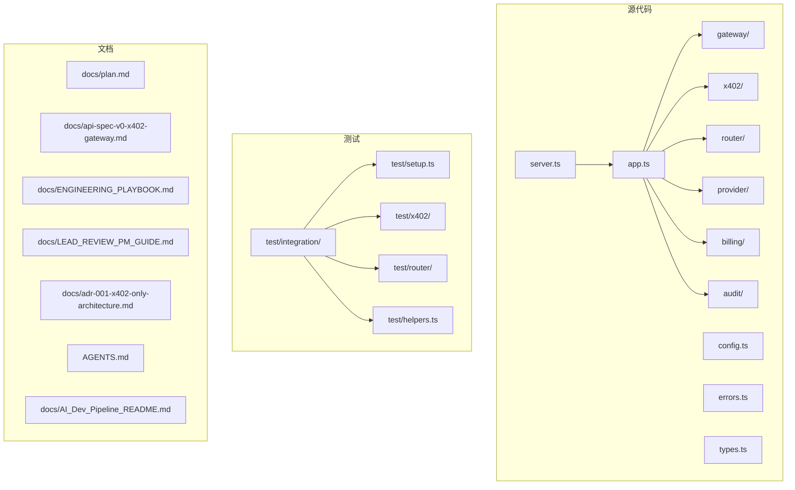
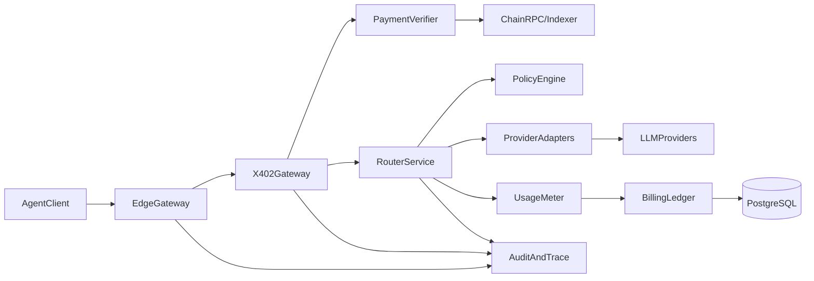
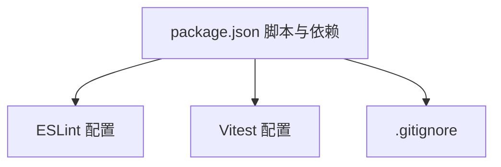

# 贡献流程

<cite>
**本文引用的文件**
- [README.md](file://README.md)
- [AGENTS.md](file://AGENTS.md)
- [docs/ENGINEERING_PLAYBOOK.md](file://docs/ENGINEERING_PLAYBOOK.md)
- [docs/LEAD_REVIEW_PM_GUIDE.md](file://docs/LEAD_REVIEW_PM_GUIDE.md)
- [docs/adr-001-x402-only-architecture.md](file://docs/adr-001-x402-only-architecture.md)
- [docs/api-spec-v0-x402-gateway.md](file://docs/api-spec-v0-x402-gateway.md)
- [docs/plan.md](file://docs/plan.md)
- [docs/AI_Dev_Pipeline_README.md](file://docs/AI_Dev_Pipeline_README.md)
- [package.json](file://package.json)
- [.eslintrc.cjs](file://.eslintrc.cjs)
- [vitest.config.ts](file://vitest.config.ts)
- [.gitignore](file://.gitignore)
</cite>

## 目录
1. [简介](#简介)
2. [项目结构](#项目结构)
3. [核心组件](#核心组件)
4. [架构总览](#架构总览)
5. [详细组件分析](#详细组件分析)
6. [依赖关系分析](#依赖关系分析)
7. [性能考虑](#性能考虑)
8. [故障排查指南](#故障排查指南)
9. [结论](#结论)
10. [附录](#附录)

## 简介
本文件面向贡献者，系统化阐述 x402 Gateway 项目的贡献流程，包括 Git 工作流、分支管理策略、合并请求规范；明确 ADR（架构决策记录）的编写与审批流程；给出代码审查标准、质量门禁与发布流程；提供问题报告模板、功能请求流程与社区参与指南；解释项目治理结构、决策机制与贡献者行为准则。内容以仓库现有文档为基础，结合工程实践形成可操作的贡献手册。

## 项目结构
项目采用模块化组织，核心模块围绕“边缘网关、x402 支付、路由、上游适配、计费、审计”展开，配合工程文档与测试配置，形成从开发到发布的闭环。

图表来源
- [README.md:79-106](file://README.md#L79-L106)
- [AGENTS.md:11-16](file://AGENTS.md#L11-L16)
- [docs/plan.md:14-36](file://docs/plan.md#L14-L36)

章节来源
- [README.md:79-106](file://README.md#L79-L106)
- [AGENTS.md:11-16](file://AGENTS.md#L11-L16)
- [docs/plan.md:14-36](file://docs/plan.md#L14-L36)

## 核心组件
- 边缘网关（gateway）：负责请求校验、速率限制、trace-id 注入、路由处理。
- x402 支付（x402）：挑战生成、支付证明验证、重放保护。
- 路由（router）：手动/自动模型选择、回退链、路由证据。
- 上游适配（provider）：统一模型适配器与错误映射。
- 计费（billing）：用量计量、成本拆解、只增不改账本。
- 审计（audit）：请求追踪持久化、回执查询。
- 工程文档：MVP 规划、API 规范、工程执行手册、评审与 PM 指南、ADR。

章节来源
- [README.md:37-46](file://README.md#L37-L46)
- [docs/ENGINEERING_PLAYBOOK.md:25-48](file://docs/ENGINEERING_PLAYBOOK.md#L25-L48)
- [docs/plan.md:58-82](file://docs/plan.md#L58-L82)

## 架构总览
x402 Gateway 的 MVP 架构强调“无账户、无 API Key、按请求付费”的最小可行路径，确保支付验证在上游执行前完成，并提供透明回执与审计能力。

图表来源
- [docs/plan.md:16-36](file://docs/plan.md#L16-L36)
- [docs/adr-001-x402-only-architecture.md:72-87](file://docs/adr-001-x402-only-architecture.md#L72-L87)

## 详细组件分析

### Git 工作流与分支管理策略
- 分支策略
  - ai-dev：AI 自动开发分支（OpenHands），用于受限生成与测试。
  - dev：集成分支，合并 ai-dev 与人工 PR 后进入 dev。
  - main：生产就绪分支，仅通过审查后的 PR 合并。
- 合并前置条件
  - 单元/集成测试通过。
  - 安全检查通过（重放保护、挑战签名/过期、请求哈希绑定、幂等键安全）。
  - 迁移安全与回滚方案已评估/文档化。
  - API 合同变更已在规范中同步。
- PR 规模与拆分
  - 目标：每 PR 变更行数小于 500 行，按模块拆分，便于审查。
- AI 辅助开发边界
  - 仅允许修改指定目录、禁止新增依赖、禁止接口重构、限制 PR 大小（≤3 文件、≤200 行）。

章节来源
- [AGENTS.md:33-37](file://AGENTS.md#L33-L37)
- [docs/ENGINEERING_PLAYBOOK.md:118-131](file://docs/ENGINEERING_PLAYBOOK.md#L118-L131)
- [docs/AI_Dev_Pipeline_README.md:42-55](file://docs/AI_Dev_Pipeline_README.md#L42-L55)

### 合并请求（PR）规范
- 必备要素
  - 范围说明（做了什么、为什么做）。
  - API 合同变更（如有）。
  - 测试证据（单元/集成）。
  - 风险说明与回滚预案。
- 质量门禁
  - 代码与测试通过。
  - 文档更新（API 变更时）。
  - 可观测性字段齐全。
  - 审计查询可复现路由与计费证据（声明模型=实际模型）。

章节来源
- [docs/ENGINEERING_PLAYBOOK.md:120-139](file://docs/ENGINEERING_PLAYBOOK.md#L120-L139)
- [docs/LEAD_REVIEW_PM_GUIDE.md:44-59](file://docs/LEAD_REVIEW_PM_GUIDE.md#L44-L59)

### ADR（架构决策记录）编写与审批流程
- 目的与范围
  - 记录关键架构决策及其背景、权衡与后果，确保可追溯与可复审。
- 结构要点
  - 决策标题、状态、日期、负责人。
  - 背景与动机、考虑选项、决策、驱动因素、后果。
  - 架构注记（核心服务、状态策略）、约束与后续 ADR。
- 审批与跟踪
  - 产品+工程共同拥有（owners），决策状态明确（如 accepted）。
  - 后续 ADR 明确演进方向（如 ADR-002 settlement policy）。

章节来源
- [docs/adr-001-x402-only-architecture.md:1-101](file://docs/adr-001-x402-only-architecture.md#L1-L101)

### 技术决策制定过程
- 依据
  - MVP 规划（plan.md）定义“必须/不得”实现项。
  - API 规范（api-spec-v0-x402-gateway.md）定义端到端契约与错误码。
  - 工程执行手册（ENGINEERING_PLAYBOOK）给出模块边界与优先级。
- 决策路径
  - 从规划出发，结合 API 合同与工程约束，形成具体实现方案。
  - 重大变更通过 ADR 记录，评审通过后纳入实施计划。

章节来源
- [docs/plan.md:8-24](file://docs/plan.md#L8-L24)
- [docs/api-spec-v0-x402-gateway.md:7-14](file://docs/api-spec-v0-x402-gateway.md#L7-L14)
- [docs/ENGINEERING_PLAYBOOK.md:8-24](file://docs/ENGINEERING_PLAYBOOK.md#L8-L24)

### 代码审查标准
- 安全
  - 重放保护、挑战签名与过期、请求哈希绑定、幂等键并发安全。
- 正确性
  - 支付金额/结算一致性、用量计量与成本计算可复现、回退链不重复收费、流中断有明确结算策略。
- 可靠性
  - 上游超时/重试策略有界、错误映射稳定且文档化、Redis/PostgreSQL 失败安全降级。
- 可观测性
  - request_id 全链路追踪、结构化日志包含付款人、使用模型、成本、路由模式、仪表盘与告警覆盖支付失败与成本异常。

章节来源
- [docs/LEAD_REVIEW_PM_GUIDE.md:16-43](file://docs/LEAD_REVIEW_PM_GUIDE.md#L16-L43)

### 质量门禁与测试要求
- 单元测试
  - 挑战令牌过期与签名验证、重放攻击拒绝、请求哈希不匹配拒绝、幂等重试行为、成本计算确定性。
- 集成测试
  - 402 挑战→支付→重试→成功、金额不足拒绝、上游失败→回退模型路径、审计接口返回完整回执。
- 负载基线
  - 20 RPS × 10 分钟、P95 满足目标、错误率 < 1%。
- 覆盖率与工具
  - ESLint TypeScript 规则、Prettier 格式化、Vitest 覆盖率（排除入口文件）。

章节来源
- [docs/ENGINEERING_PLAYBOOK.md:95-117](file://docs/ENGINEERING_PLAYBOOK.md#L95-L117)
- [.eslintrc.cjs:13-16](file://.eslintrc.cjs#L13-L16)
- [vitest.config.ts:9-14](file://vitest.config.ts#L9-L14)

### 发布流程说明
- 发布准备
  - 功能满足：x402 流程成功与失败路径、手动/自动路由可用、回执与审计一致。
  - 运营准备：SLA 仪表盘、错误预算策略、值班与事件流程。
  - 商业准备：透明定价声明、支持 FAQ（含支付与争议处理）。
- 发布节奏
  - 里程碑控制：每周设定交付目标，跟踪风险、阻塞、生产就绪度、成本趋势。
- 后发布优先级
  - 优化验证延迟、根据真实流量调整路由策略、决定账户/Stripe 扩展时机、起草 MCP 市场 ADR 与商业模式。

章节来源
- [docs/LEAD_REVIEW_PM_GUIDE.md:60-115](file://docs/LEAD_REVIEW_PM_GUIDE.md#L60-L115)

### 问题报告模板
- 问题类型
  - 支付安全：重放攻击、金额不足、伪造证明、RPC 故障。
  - 路由风险：误判模型、回退风暴、价格缓存过期。
  - 计费风险：流式中断结算、上游口径差异、幂等重复扣费。
  - 稳定性风险：突发并发导致延迟上升、上游限流。
  - 合规风险：地域限制、制裁名单、税务披露、滥用治理。
- 风险登记册
  - 每项风险需明确负责人、检测信号、缓解计划与回退计划。

章节来源
- [docs/plan.md:84-91](file://docs/plan.md#L84-L91)
- [docs/LEAD_REVIEW_PM_GUIDE.md:76-89](file://docs/LEAD_REVIEW_PM_GUIDE.md#L76-L89)

### 功能请求流程
- 来源与优先级
  - 以 MVP 规划（plan.md）为产品范围基线，工程执行手册（ENGINEERING_PLAYBOOK）定义模块与优先级。
- 提交流程
  - 在 ai-dev 分支进行受限生成与测试，提交 PR 至 dev，经 Qoder 审查后合并至 main。
- 边界控制
  - 仅允许修改指定目录、禁止新增依赖、禁止接口重构、限制 PR 大小。

章节来源
- [docs/plan.md:121-127](file://docs/plan.md#L121-L127)
- [docs/AI_Dev_Pipeline_README.md:72-79](file://docs/AI_Dev_Pipeline_README.md#L72-L79)
- [docs/AI_Dev_Pipeline_README.md:42-55](file://docs/AI_Dev_Pipeline_README.md#L42-L55)

### 社区参与指南
- 贡献方式
  - 通过 ai-dev → dev → main 的分支流程贡献代码；遵循 PR 规范与质量门禁。
- 行为准则
  - 保持安全与正确性优先，严格遵守非协商架构约束（MVP 仅 x402、不可隐藏模型替换、每次成功响应必须包含可验证回执、支付验证与重放保护必须在上游执行前完成、账本只增不改）。
- 治理与决策
  - 产品+工程共同拥有关键决策（owners），重大变更通过 ADR 记录并评审。

章节来源
- [docs/LEAD_REVIEW_PM_GUIDE.md:8-14](file://docs/LEAD_REVIEW_PM_GUIDE.md#L8-L14)
- [docs/adr-001-x402-only-architecture.md:3-5](file://docs/adr-001-x402-only-architecture.md#L3-L5)

## 依赖关系分析
- 工具链与脚本
  - 开发与构建：TypeScript、Fastify、ESLint、Prettier、Vitest。
  - 数据与链验证：PostgreSQL、Redis、viem。
  - 质量门禁：ESLint 规则、Vitest 覆盖率、格式化。
- 依赖与忽略
  - .gitignore 排除 node_modules、dist、.env、日志、覆盖率、系统文件与编译缓存。

图表来源
- [package.json:7-19](file://package.json#L7-L19)
- [.eslintrc.cjs:1-22](file://.eslintrc.cjs#L1-L22)
- [vitest.config.ts:1-16](file://vitest.config.ts#L1-L16)
- [.gitignore:1-8](file://.gitignore#L1-L8)

章节来源
- [package.json:7-19](file://package.json#L7-L19)
- [.eslintrc.cjs:1-22](file://.eslintrc.cjs#L1-L22)
- [vitest.config.ts:1-16](file://vitest.config.ts#L1-L16)
- [.gitignore:1-8](file://.gitignore#L1-L8)

## 性能考虑
- 负载基线
  - 20 RPS × 10 分钟、P95 满足目标、错误率 < 1%。
- 可观测性
  - request_id 全链路追踪、结构化日志包含关键指标、仪表盘与告警覆盖支付失败与成本异常。
- 可靠性
  - 上游超时/重试策略有界、错误映射稳定、Redis/PostgreSQL 失败安全降级。

章节来源
- [docs/ENGINEERING_PLAYBOOK.md:112-117](file://docs/ENGINEERING_PLAYBOOK.md#L112-L117)
- [docs/LEAD_REVIEW_PM_GUIDE.md:32-43](file://docs/LEAD_REVIEW_PM_GUIDE.md#L32-L43)

## 故障排查指南
- 常见问题定位
  - 支付路径：挑战过期、请求哈希不匹配、支付证明重复消费、金额/资产/收款方不匹配。
  - 路由与计费：回退链重复收费、流中断结算策略缺失、用量计量不一致。
  - 可观测性：缺少 request_id、日志字段不全、审计接口无法重建路由与计费证据。
- 处理步骤
  - 检查重放保护与幂等键逻辑。
  - 核对支付验证顺序与链上证明。
  - 确认路由决策与回退链一致性。
  - 更新审计与回执字段，确保可审计性。

章节来源
- [docs/api-spec-v0-x402-gateway.md:165-184](file://docs/api-spec-v0-x402-gateway.md#L165-L184)
- [docs/LEAD_REVIEW_PM_GUIDE.md:16-43](file://docs/LEAD_REVIEW_PM_GUIDE.md#L16-L43)

## 结论
本贡献流程以工程文档与规范为依据，结合 AI 辅助开发与人工审查的双轨机制，确保在 MVP 阶段快速交付、安全可控、可审计、可扩展。贡献者应严格遵循分支策略、PR 规范与质量门禁，重大技术决策通过 ADR 记录与评审，共同维护项目的长期健康与演进。

## 附录
- 快速参考
  - 开发命令：lint、typecheck、test、dev、build。
  - 分支：ai-dev（AI 自动开发）、dev（集成）、main（生产）。
  - PR 规模：目标 <500 行，按模块拆分。
  - 安全与正确性：挑战签名/过期、请求哈希绑定、重放保护、只增不改账本、审计可复现。

章节来源
- [AGENTS.md:5-24](file://AGENTS.md#L5-L24)
- [docs/ENGINEERING_PLAYBOOK.md:118-131](file://docs/ENGINEERING_PLAYBOOK.md#L118-L131)
- [docs/LEAD_REVIEW_PM_GUIDE.md:8-14](file://docs/LEAD_REVIEW_PM_GUIDE.md#L8-L14)