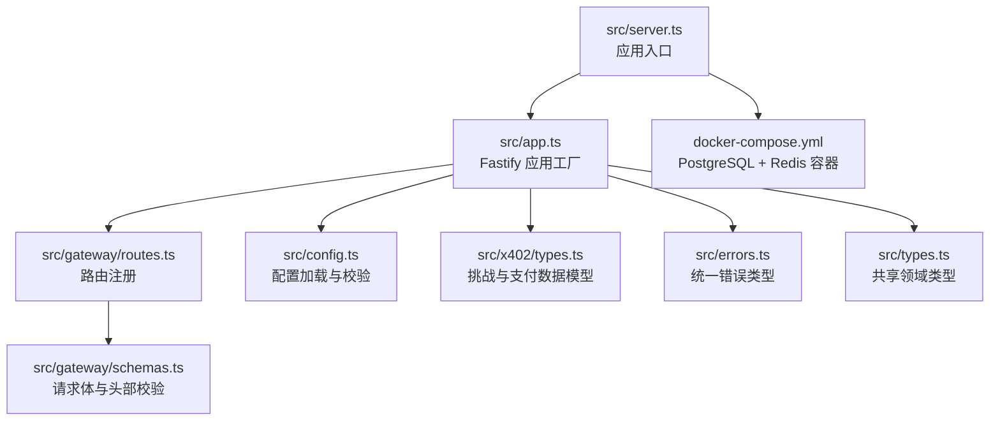
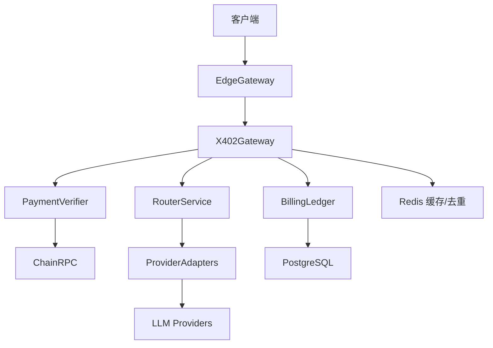
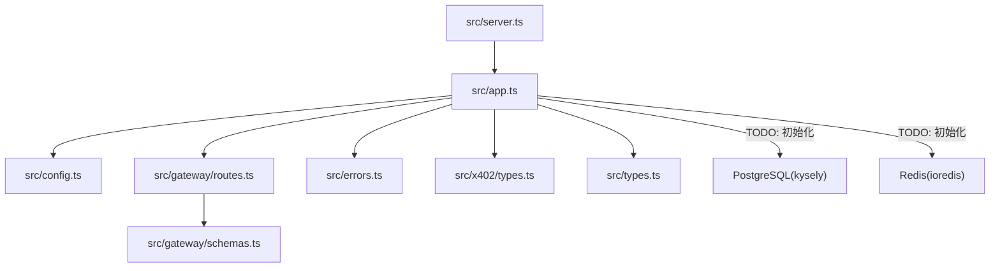

# 快速开始

<cite>
**本文引用的文件**
- [README.md](file://README.md)
- [package.json](file://package.json)
- [docker-compose.yml](file://docker-compose.yml)
- [src/config.ts](file://src/config.ts)
- [src/app.ts](file://src/app.ts)
- [src/server.ts](file://src/server.ts)
- [src/gateway/routes.ts](file://src/gateway/routes.ts)
- [src/gateway/schemas.ts](file://src/gateway/schemas.ts)
- [src/x402/types.ts](file://src/x402/types.ts)
- [src/errors.ts](file://src/errors.ts)
- [src/types.ts](file://src/types.ts)
- [test/helpers.ts](file://test/helpers.ts)
- [vitest.config.ts](file://vitest.config.ts)
</cite>

## 目录
1. [简介](#简介)
2. [项目结构](#项目结构)
3. [核心组件](#核心组件)
4. [架构总览](#架构总览)
5. [详细组件分析](#详细组件分析)
6. [依赖分析](#依赖分析)
7. [性能考虑](#性能考虑)
8. [故障排除指南](#故障排除指南)
9. [结论](#结论)
10. [附录](#附录)

## 简介
本指南面向首次接触 x402 Gateway 的开发者，目标是在最短时间内完成环境准备、依赖安装、数据库与缓存服务启动、环境变量配置，并成功启动本地开发服务器进行验证。你将学到：
- 如何安装 Node.js 20+、pnpm、Docker
- 如何使用 docker-compose 启动 PostgreSQL 与 Redis
- 如何配置 .env 中的关键参数（如 CHALLENGE_SECRET、MERCHANT_ADDRESS）
- 如何启动开发服务器并验证基本接口
- 常见安装问题的排查思路与解决建议

## 项目结构
该仓库采用按功能模块划分的目录结构，核心入口为 server.ts，应用工厂在 app.ts 中构建，配置加载在 config.ts 中完成，网关路由集中在 gateway/routes.ts。

图表来源
- [src/server.ts:1-33](file://src/server.ts#L1-L33)
- [src/app.ts:1-101](file://src/app.ts#L1-L101)
- [src/gateway/routes.ts:1-96](file://src/gateway/routes.ts#L1-L96)
- [src/config.ts:1-46](file://src/config.ts#L1-L46)
- [docker-compose.yml:1-31](file://docker-compose.yml#L1-L31)
- [src/gateway/schemas.ts:1-32](file://src/gateway/schemas.ts#L1-L32)
- [src/x402/types.ts:1-37](file://src/x402/types.ts#L1-L37)
- [src/errors.ts:1-106](file://src/errors.ts#L1-L106)
- [src/types.ts:1-119](file://src/types.ts#L1-L119)

章节来源
- [README.md:79-106](file://README.md#L79-L106)
- [src/server.ts:1-33](file://src/server.ts#L1-L33)
- [src/app.ts:1-101](file://src/app.ts#L1-L101)
- [src/gateway/routes.ts:1-96](file://src/gateway/routes.ts#L1-L96)
- [src/config.ts:1-46](file://src/config.ts#L1-L46)

## 核心组件
- 配置系统：通过 zod 对环境变量进行强类型校验，支持默认值与可选字段，确保运行时配置安全可靠。
- 应用工厂：集中注册插件（CORS、Helmet、限流、通用响应）、全局钩子与错误处理器，并装配各业务服务容器。
- 路由层：提供 OpenAI 兼容的聊天补全接口与模型列表查询；当前实现以占位返回为主，实际支付流程待完善。
- 数据模型：定义挑战载荷、支付证明、回单等关键类型，保证跨模块一致的数据契约。

章节来源
- [src/config.ts:1-46](file://src/config.ts#L1-L46)
- [src/app.ts:1-101](file://src/app.ts#L1-L101)
- [src/gateway/routes.ts:1-96](file://src/gateway/routes.ts#L1-L96)
- [src/x402/types.ts:1-37](file://src/x402/types.ts#L1-L37)
- [src/types.ts:1-119](file://src/types.ts#L1-L119)

## 架构总览
下图展示了从客户端到上游提供商的调用链路，以及 x402 支付流程的关键节点。

图表来源
- [README.md:26-35](file://README.md#L26-L35)

## 详细组件分析

### 环境准备与依赖安装
- 运行时要求：Node.js 版本需满足 engines 字段要求（>=20）。
- 包管理器：推荐使用 pnpm（仓库脚本中大量使用）。
- 容器编排：使用 Docker Compose 启动 PostgreSQL 与 Redis。

章节来源
- [package.json:48-50](file://package.json#L48-L50)
- [package.json:7-20](file://package.json#L7-L20)
- [docker-compose.yml:1-31](file://docker-compose.yml#L1-L31)

### 数据库与缓存服务
- PostgreSQL
  - 镜像版本：postgres:16-alpine
  - 默认端口映射：5432
  - 默认凭据：用户 x402，密码 x402local，数据库 x402_gateway
  - 健康检查：使用 pg_isready 检测
- Redis
  - 镜像版本：redis:7-alpine
  - 默认端口映射：6379
  - 最大内存策略：allkeys-lru
  - 健康检查：redis-cli ping

章节来源
- [docker-compose.yml:2-16](file://docker-compose.yml#L2-L16)
- [docker-compose.yml:18-27](file://docker-compose.yml#L18-L27)

### 环境变量与 .env 配置
- 关键参数（来自配置校验规则）：
  - DATABASE_URL：数据库连接字符串（必填）
  - REDIS_URL：Redis 连接字符串（必填）
  - CHALLENGE_SECRET：挑战密钥，最小长度 32（必填）
  - CHALLENGE_TTL_SECONDS：挑战过期时间（秒），默认 300
  - MERCHANT_ADDRESS：收款人地址，必须以 0x 开头（必填）
  - PAYMENT_CHAIN：支付链，默认 base
  - PAYMENT_ASSET：支付资产，默认 USDC
  - OPENAI_API_KEY、ANTHROPIC_API_KEY：上游提供商密钥（可选）
  - PLATFORM_FEE_BPS：平台费率（基点），默认 500
  - PORT、HOST、NODE_ENV、LOG_LEVEL：运行参数（可选，有默认值）

- 示例文件位置：README 中提供了复制示例环境文件的步骤。

章节来源
- [src/config.ts:4-24](file://src/config.ts#L4-L24)
- [src/config.ts:28-45](file://src/config.ts#L28-L45)
- [README.md:16](file://README.md#L16)

### 启动开发服务器
- 安装依赖：执行包管理器安装命令。
- 启动数据库与缓存：使用 docker-compose 启动 PostgreSQL 与 Redis。
- 复制并编辑 .env：根据上述参数填写必要项。
- 启动开发服务器：运行开发脚本，服务器默认监听 0.0.0.0:3000。

章节来源
- [README.md:9-24](file://README.md#L9-L24)
- [package.json:17-19](file://package.json#L17-L19)
- [src/server.ts:8-14](file://src/server.ts#L8-L14)

### 接口验证步骤
- 获取模型列表：访问 GET /v1/models，应返回可用模型与定价元数据。
- 发送无支付头的聊天请求：访问 POST /v1/chat/completions，应返回 402 并携带支付需求（当前为占位）。
- 注意：当前路由层对付费请求的完整处理逻辑尚未实现，仅返回未实现状态码。

章节来源
- [src/gateway/routes.ts:73-76](file://src/gateway/routes.ts#L73-L76)
- [src/gateway/routes.ts:23-67](file://src/gateway/routes.ts#L23-L67)
- [README.md:48-54](file://README.md#L48-L54)

### 类型与错误模型
- 挑战与支付数据模型：定义了挑战载荷、支付证明、回单等结构，用于前后端一致性。
- 错误类型：统一的 AppError 及其子类，覆盖 402、400、409、504、503、500 等场景，便于前端与监控系统识别。

章节来源
- [src/x402/types.ts:1-37](file://src/x402/types.ts#L1-L37)
- [src/errors.ts:6-105](file://src/errors.ts#L6-L105)

## 依赖分析
- 运行时框架：Fastify + 插件（CORS、Helmet、限流、通用响应）
- 数据访问：pg + kysely（注释中提示后续初始化连接池）
- 缓存与去重：ioredis（注释中提示后续注入服务容器）
- 验证与序列化：zod（配置与请求体）
- 加解密与签名：jose（用于挑战令牌）
- 区块链交互：viem（用于链上支付验证）
- 测试：Vitest + 测试工具集（含 setup 文件加载 .env.example）

图表来源
- [src/server.ts:1-33](file://src/server.ts#L1-L33)
- [src/app.ts:73-94](file://src/app.ts#L73-L94)
- [src/config.ts:1-46](file://src/config.ts#L1-L46)
- [src/gateway/routes.ts:1-96](file://src/gateway/routes.ts#L1-L96)
- [src/gateway/schemas.ts:1-32](file://src/gateway/schemas.ts#L1-L32)
- [src/errors.ts:1-106](file://src/errors.ts#L1-L106)
- [src/types.ts:1-119](file://src/types.ts#L1-L119)
- [src/x402/types.ts:1-37](file://src/x402/types.ts#L1-L37)

章节来源
- [package.json:21-36](file://package.json#L21-L36)
- [vitest.config.ts:1-15](file://vitest.config.ts#L1-L15)
- [test/helpers.ts:19-44](file://test/helpers.ts#L19-L44)

## 性能考虑
- 限流：已内置限流中间件，建议结合实际流量压测调整阈值。
- 缓存：Redis 已预留注入点，建议对热点查询与去重缓存进行优化。
- 数据库：Kysely 连接池尚未初始化，建议在生产环境启用连接池与慢查询日志。
- 日志级别：通过 LOG_LEVEL 控制，开发环境建议 info，生产建议 warn 或更高。

## 故障排除指南
- Node.js 版本不满足要求
  - 现象：安装或启动时报引擎版本不匹配
  - 处理：升级至 Node.js >= 20
  - 参考：[package.json:48-50](file://package.json#L48-L50)
- Docker 无法启动数据库/缓存
  - 现象：端口冲突或容器健康检查失败
  - 处理：确认 5432/6379 未被占用；查看容器日志；必要时清理卷与重建
  - 参考：[docker-compose.yml:4-16](file://docker-compose.yml#L4-L16), [docker-compose.yml:20-27](file://docker-compose.yml#L20-L27)
- 环境变量缺失导致启动失败
  - 现象：启动时报错提示缺少 DATABASE_URL、REDIS_URL、CHALLENGE_SECRET、MERCHANT_ADDRESS
  - 处理：复制 .env.example 并补齐所有必填项；确保格式正确
  - 参考：[src/config.ts:10-13](file://src/config.ts#L10-L13), [src/config.ts:16](file://src/config.ts#L16), [src/config.ts:34-38](file://src/config.ts#L34-L38)
- 开发服务器无法监听
  - 现象：端口被占用或权限不足
  - 处理：更换 PORT 或 HOST；确认防火墙；以管理员权限（如需要）运行
  - 参考：[src/server.ts:9-10](file://src/server.ts#L9-L10)
- 接口返回 501（未实现）
  - 现象：POST /v1/chat/completions 返回未实现
  - 说明：当前路由层仅占位返回，支付流程尚未实现
  - 参考：[src/gateway/routes.ts:64-66](file://src/gateway/routes.ts#L64-L66)
- 请求体校验失败
  - 现象：返回 400 validation_error
  - 处理：检查请求体字段是否符合 schemas 中的约束
  - 参考：[src/gateway/schemas.ts:4-15](file://src/gateway/schemas.ts#L4-L15), [src/app.ts:59-64](file://src/app.ts#L59-L64)
- 测试环境变量未加载
  - 现象：测试中找不到 .env 示例
  - 处理：确认 Vitest 配置已加载 setup 文件，setup 文件会加载 .env.example
  - 参考：[vitest.config.ts:8](file://vitest.config.ts#L8), [test/helpers.ts:19-44](file://test/helpers.ts#L19-L44)

## 结论
按照本指南完成环境准备与基础配置后，你可以快速启动 x402 Gateway 并验证基本接口。当前路由层对付费请求的完整处理尚在开发中，建议关注后续迭代以获得完整的 x402 支付体验。

## 附录

### 从零开始的完整安装流程
- 安装 Node.js 20+
- 安装 pnpm
- 安装 Docker
- 在项目根目录执行依赖安装
- 使用 docker-compose 启动数据库与缓存
- 复制并编辑 .env，补齐必填项
- 启动开发服务器
- 访问 http://localhost:3000 验证 /v1/models 与 /v1/chat/completions

章节来源
- [README.md:9-24](file://README.md#L9-L24)
- [package.json:17-19](file://package.json#L17-L19)
- [docker-compose.yml:1-31](file://docker-compose.yml#L1-L31)