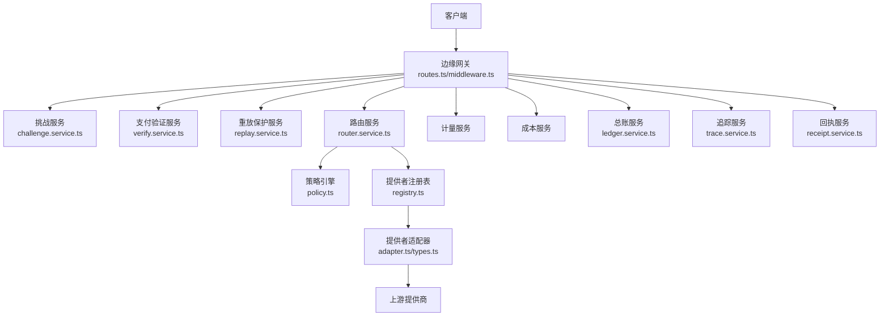
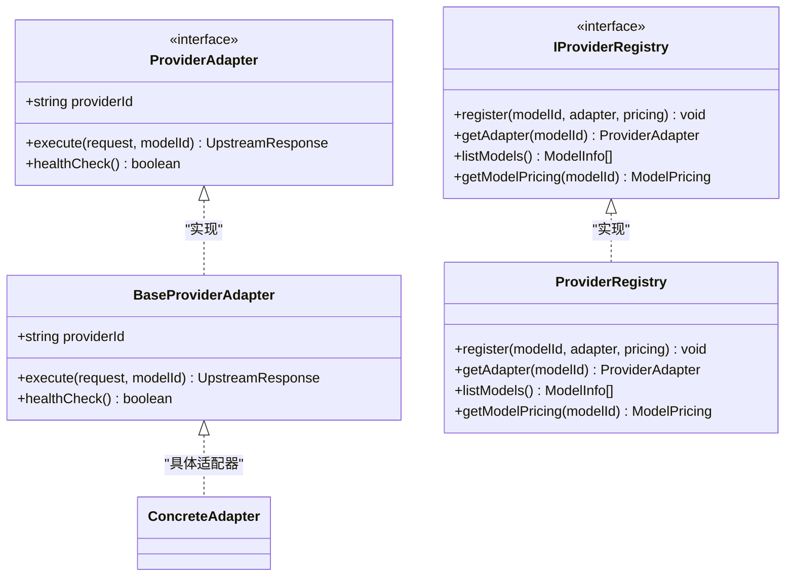
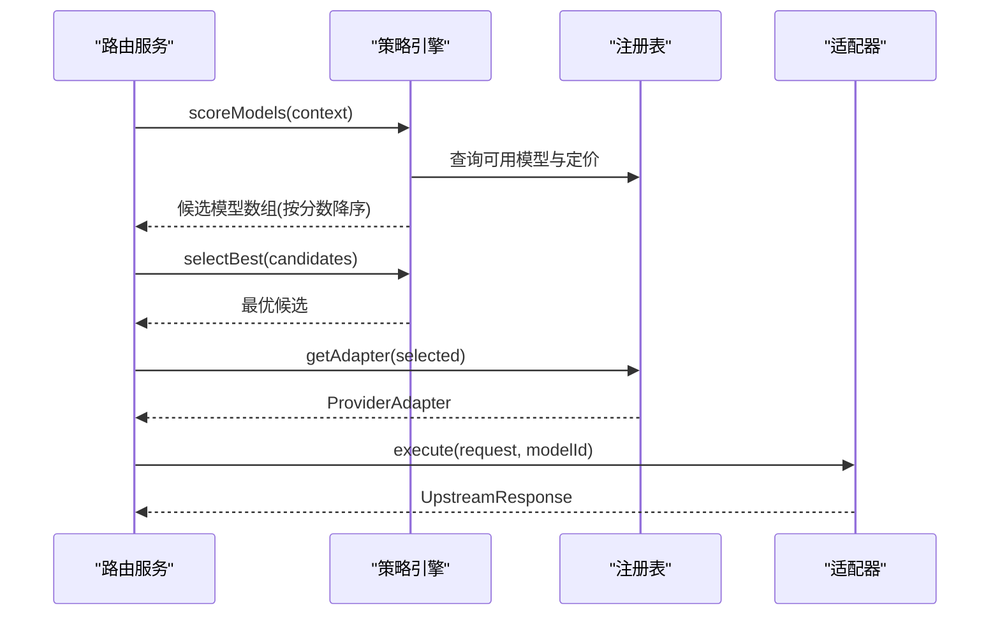
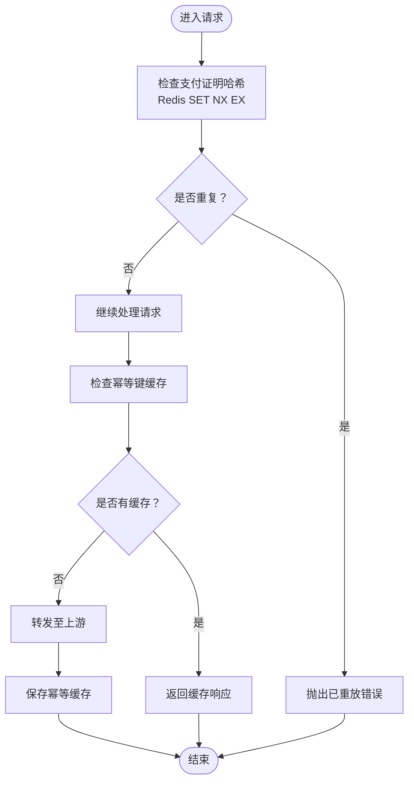
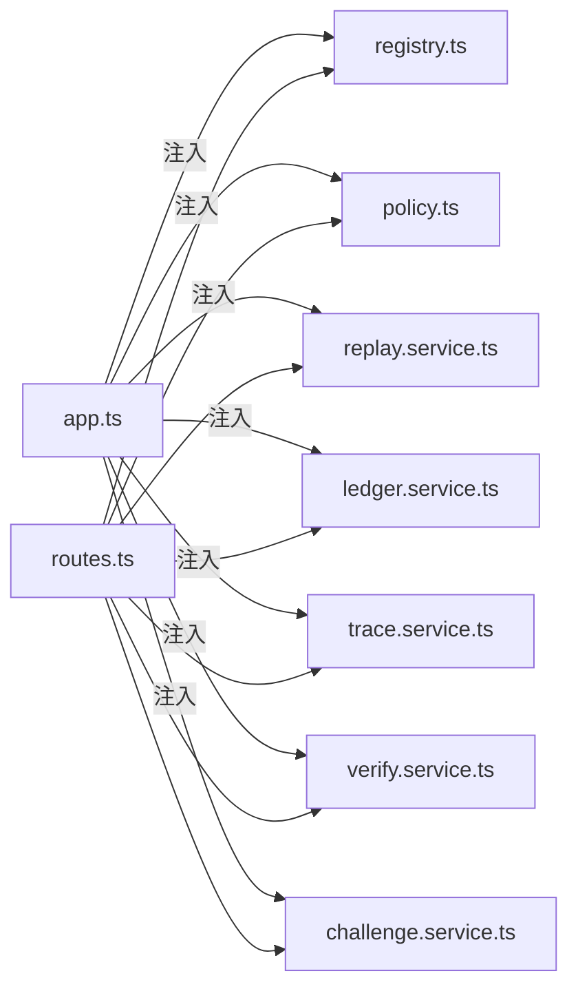

# 扩展与定制

<cite>
**本文引用的文件**
- [README.md](file://README.md)
- [app.ts](file://src/app.ts)
- [index.ts（网关入口）](file://src/gateway/index.ts)
- [index.ts（提供者模块）](file://src/provider/index.ts)
- [adapter.ts](file://src/provider/adapter.ts)
- [types.ts（提供者）](file://src/provider/types.ts)
- [registry.ts](file://src/provider/registry.ts)
- [index.ts（路由器模块）](file://src/router/index.ts)
- [types.ts（路由器）](file://src/router/types.ts)
- [policy.ts](file://src/router/policy.ts)
- [types.ts（x402）](file://src/x402/types.ts)
- [replay.service.ts](file://src/x402/replay.service.ts)
- [types.ts（账单）](file://src/billing/types.ts)
- [ledger.service.ts](file://src/billing/ledger.service.ts)
- [trace.service.ts](file://src/audit/trace.service.ts)
- [index.ts（审计模块）](file://src/audit/index.ts)
- [routes.ts](file://src/gateway/routes.ts)
- [middleware.ts](file://src/gateway/middleware.ts)
- [schemas.ts](file://src/gateway/schemas.ts)
- [errors.ts](file://src/errors.ts)
- [config.ts](file://src/config.ts)
- [types.ts（共享类型）](file://src/types.ts)
- [challenge.service.ts](file://src/x402/challenge.service.ts)
- [verify.service.ts](file://src/x402/verify.service.ts)
- [receipt.service.ts](file://src/audit/receipt.service.ts)
- [flow.test.ts](file://test/integration/flow.test.ts)
- [router.test.ts](file://test/router/router.test.ts)
- [challenge.test.ts](file://test/x402/challenge.test.ts)
</cite>

## 目录
1. [简介](#简介)
2. [项目结构](#项目结构)
3. [核心组件](#核心组件)
4. [架构总览](#架构总览)
5. [详细组件分析](#详细组件分析)
6. [依赖分析](#依赖分析)
7. [性能考虑](#性能考虑)
8. [故障排查指南](#故障排查指南)
9. [结论](#结论)
10. [附录](#附录)

## 简介
本指南面向希望在 x402 Gateway 上进行扩展与定制的开发者，覆盖以下主题：
- 插件式提供者适配器的开发与注册
- 自定义路由策略的实现与接入
- 重放保护服务的扩展与 Redis 集成
- 第三方链上支付验证与账单/审计模块的对接
- 完整的开发示例路径、接口规范与集成测试方法
- 扩展点设计原理、向后兼容性与版本管理策略
- 社区贡献与开源协作最佳实践

## 项目结构
x402 Gateway 采用模块化分层设计：应用工厂负责服务装配与路由注册；各功能模块通过清晰的接口暴露能力，便于替换与扩展。

```mermaid
graph TB
subgraph "应用层"
APP["app.ts<br/>应用工厂与服务容器"]
end
subgraph "边缘网关"
GW_IDX["gateway/index.ts"]
GW_MW["gateway/middleware.ts"]
GW_RT["gateway/routes.ts"]
GW_SC["gateway/schemas.ts"]
end
subgraph "提供者适配层"
PR_IDX["provider/index.ts"]
PR_ADT["provider/adapter.ts"]
PR_REG["provider/registry.ts"]
PR_TYP["provider/types.ts"]
PR_OPENAI["provider/openai.adapter.ts"]
end
subgraph "路由层"
RT_IDX["router/index.ts"]
RT_TYP["router/types.ts"]
RT_POL["router/policy.ts"]
end
subgraph "x402 支付与安全"
X402_CH["x402/challenge.service.ts"]
X402_V["x402/verify.service.ts"]
X402_RP["x402/replay.service.ts"]
X402_T["x402/types.ts"]
end
subgraph "账单与审计"
BILL_LDG["billing/ledger.service.ts"]
BILL_TYP["billing/types.ts"]
AUD_TRC["audit/trace.service.ts"]
AUD_RCPT["audit/receipt.service.ts"]
AUD_IDX["audit/index.ts"]
end
APP --> GW_RT
APP --> PR_REG
APP --> RT_POL
APP --> X402_CH
APP --> X402_V
APP --> X402_RP
APP --> BILL_LDG
APP --> AUD_TRC
APP --> AUD_RCPT
GW_RT --> PR_REG
GW_RT --> RT_POL
GW_RT --> X402_V
GW_RT --> X402_RP
GW_RT --> BILL_LDG
GW_RT --> AUD_TRC
GW_RT --> AUD_RCPT
```

图表来源
- [app.ts:35-100](file://src/app.ts#L35-L100)
- [routes.ts](file://src/gateway/routes.ts)
- [registry.ts:27-64](file://src/provider/registry.ts#L27-L64)
- [policy.ts:16-33](file://src/router/policy.ts#L16-L33)
- [replay.service.ts:23-51](file://src/x402/replay.service.ts#L23-L51)
- [ledger.service.ts:17-41](file://src/billing/ledger.service.ts#L17-L41)
- [trace.service.ts:38-67](file://src/audit/trace.service.ts#L38-L67)

章节来源
- [README.md:79-106](file://README.md#L79-L106)
- [app.ts:35-100](file://src/app.ts#L35-L100)

## 核心组件
- 应用工厂与服务容器：集中初始化并注入所有服务实例，统一错误处理与中间件钩子。
- 提供者适配器：抽象基类定义标准化执行与健康检查接口，注册表负责模型到适配器的映射。
- 路由策略：策略引擎负责评分与选择候选模型，支持手动/自动模式。
- x402 支付与安全：挑战生成、支付证明验证、重放保护与幂等缓存。
- 账单与审计：使用计量、成本计算、总账 ledger（只增不改）、请求追踪与回执查询。

章节来源
- [app.ts:21-33](file://src/app.ts#L21-L33)
- [adapter.ts:10-15](file://src/provider/adapter.ts#L10-L15)
- [registry.ts:4-16](file://src/provider/registry.ts#L4-L16)
- [policy.ts:3-14](file://src/router/policy.ts#L3-L14)
- [replay.service.ts:3-21](file://src/x402/replay.service.ts#L3-L21)
- [ledger.service.ts:3-15](file://src/billing/ledger.service.ts#L3-L15)
- [trace.service.ts:4-36](file://src/audit/trace.service.ts#L4-L36)

## 架构总览
下图展示从客户端到上游提供商的完整调用链路，以及 x402 支付与安全、路由、账单与审计模块的交互关系。

图表来源
- [routes.ts](file://src/gateway/routes.ts)
- [middleware.ts](file://src/gateway/middleware.ts)
- [challenge.service.ts](file://src/x402/challenge.service.ts)
- [verify.service.ts](file://src/x402/verify.service.ts)
- [replay.service.ts:23-51](file://src/x402/replay.service.ts#L23-L51)
- [policy.ts:16-33](file://src/router/policy.ts#L16-L33)
- [registry.ts:27-64](file://src/provider/registry.ts#L27-L64)
- [adapter.ts:10-15](file://src/provider/adapter.ts#L10-L15)
- [ledger.service.ts:17-41](file://src/billing/ledger.service.ts#L17-L41)
- [trace.service.ts:38-67](file://src/audit/trace.service.ts#L38-L67)
- [receipt.service.ts](file://src/audit/receipt.service.ts)

## 详细组件分析

### 提供者适配器扩展：开发与注册
- 设计要点
  - 继承抽象基类以实现标准化接口，确保 execute 与 healthCheck 语义一致。
  - 注册表负责模型 ID 到适配器与定价信息的映射，支持按需查询与列表输出。
- 开发步骤
  1) 新建适配器类，继承抽象基类并实现核心方法。
  2) 在应用启动时通过注册表将模型 ID 与适配器、定价信息绑定。
  3) 使用统一的请求体与响应体结构，便于路由与账单模块消费。
- 接口规范
  - 适配器接口与抽象基类定义见下方类图。
  - 注册表接口与实现见注册表文件。
- 示例路径
  - 参考现有适配器与注册表的实现位置，完成新适配器的开发与注册。

图表来源
- [adapter.ts:10-15](file://src/provider/adapter.ts#L10-L15)
- [types.ts（提供者）:26-35](file://src/provider/types.ts#L26-L35)
- [registry.ts:4-16](file://src/provider/registry.ts#L4-L16)
- [registry.ts:27-64](file://src/provider/registry.ts#L27-L64)

章节来源
- [adapter.ts:6-15](file://src/provider/adapter.ts#L6-L15)
- [types.ts（提供者）:26-35](file://src/provider/types.ts#L26-L35)
- [registry.ts:27-64](file://src/provider/registry.ts#L27-L64)

### 自定义路由策略：评分与选择
- 设计要点
  - 策略引擎接收路由上下文，返回候选模型及其评分，并选择最优者。
  - 支持手动/自动两种模式，自动模式可结合成本、能力匹配与可用性进行综合评分。
- 实现建议
  - 在策略引擎中实现评分逻辑，优先级：成本低者优先、能力匹配度高、可用性稳定。
  - 将评分结果排序并返回最高分候选，若无候选则抛出明确错误。
- 接口规范
  - 策略引擎接口与默认实现见下方序列图。
- 示例路径
  - 参考策略引擎文件，实现评分与选择逻辑。

图表来源
- [policy.ts:16-33](file://src/router/policy.ts#L16-L33)
- [registry.ts:44-50](file://src/provider/registry.ts#L44-L50)

章节来源
- [policy.ts:3-14](file://src/router/policy.ts#L3-L14)
- [types.ts（路由器）:16-21](file://src/router/types.ts#L16-L21)

### 重放保护服务：扩展与 Redis 集成
- 设计要点
  - 原子性检查支付证明哈希是否重复，使用 Redis SET NX EX 实现。
  - 幂等键缓存用于相同请求的快速响应，支持 TTL 控制。
- 扩展步骤
  1) 初始化 Redis 连接并传入服务工厂。
  2) 实现 checkAndMark：对支付证明哈希进行原子检查，命中则抛出“已重放”错误。
  3) 实现 checkIdempotency/saveIdempotency：基于幂等键读取/写入缓存。
- 接口规范
  - 服务接口与待实现方法见重放保护服务文件。
- 示例路径
  - 参考重放保护服务文件，完成 Redis 集成与错误处理。

图表来源
- [replay.service.ts:23-51](file://src/x402/replay.service.ts#L23-L51)

章节来源
- [replay.service.ts:3-21](file://src/x402/replay.service.ts#L3-L21)

### 第三方集成：支付验证与账单/审计对接
- 支付验证
  - 使用支付验证服务对接链上 RPC，校验交易哈希、金额与收款地址。
  - 结合挑战服务生成的挑战令牌与客户端支付证明共同完成验证。
- 账单与审计
  - 计量与成本服务产出使用记录与费用明细，提交至总账服务进行只增式持久化。
  - 追踪服务记录请求生命周期状态，失败/成功均更新追踪记录；回执服务提供查询接口。
- 示例路径
  - 参考账单与审计服务文件，完成数据库连接与数据落盘。

章节来源
- [types.ts（x402）:12-36](file://src/x402/types.ts#L12-L36)
- [types.ts（账单）:3-31](file://src/billing/types.ts#L3-L31)
- [ledger.service.ts:17-41](file://src/billing/ledger.service.ts#L17-L41)
- [trace.service.ts:38-67](file://src/audit/trace.service.ts#L38-L67)

### 边缘网关：路由与中间件
- 中间件
  - 注入 traceId 钩子，统一日志与追踪标识。
- 路由
  - 注册 OpenAI 兼容端点，校验请求体与 x402 头部，触发支付流程与路由决策。
- 示例路径
  - 参考路由与中间件文件，了解请求处理流程与校验逻辑。

章节来源
- [index.ts（网关入口）:1-8](file://src/gateway/index.ts#L1-L8)
- [middleware.ts](file://src/gateway/middleware.ts)
- [routes.ts](file://src/gateway/routes.ts)

## 依赖分析
- 模块内聚与耦合
  - 提供者适配器与注册表解耦，通过接口通信；路由策略独立于具体适配器。
  - x402 支付与安全模块与路由、账单、审计模块松耦合，通过服务容器注入。
- 外部依赖
  - Redis 用于重放保护与幂等缓存；PostgreSQL 用于账单与审计持久化。
- 循环依赖
  - 当前结构未发现循环依赖；服务通过接口与工厂函数装配，避免直接互相导入。

图表来源
- [app.ts:77-94](file://src/app.ts#L77-L94)
- [routes.ts](file://src/gateway/routes.ts)
- [registry.ts:27-64](file://src/provider/registry.ts#L27-L64)
- [policy.ts:16-33](file://src/router/policy.ts#L16-L33)
- [replay.service.ts:23-51](file://src/x402/replay.service.ts#L23-L51)
- [ledger.service.ts:17-41](file://src/billing/ledger.service.ts#L17-L41)
- [trace.service.ts:38-67](file://src/audit/trace.service.ts#L38-L67)

章节来源
- [app.ts:77-94](file://src/app.ts#L77-L94)

## 性能考虑
- 缓存与去重
  - 使用 Redis 缓存幂等响应，降低重复请求的上游压力与延迟。
  - 重放保护采用原子 SET NX EX，避免竞态条件与数据库压力。
- 路由评分优化
  - 评分逻辑应尽量本地化，减少外部调用；对昂贵操作进行缓存或异步预热。
- 数据持久化
  - 总账与审计采用只增写入，避免热点更新；批量写入与索引优化可进一步提升吞吐。
- 错误与超时
  - 为上游适配器设置合理超时与重试策略，防止级联阻塞。

## 故障排查指南
- 常见问题定位
  - 402 支付相关：检查挑战令牌生成与解析、支付证明格式与链上验证结果。
  - 重放保护：确认 Redis 连接与 TTL 设置，排查重复哈希导致的异常。
  - 路由选择：核对策略评分逻辑与模型可用性，确保注册表正确注册。
  - 账单与审计：检查数据库连接与事务一致性，确保只增写入。
- 错误处理
  - 应用全局错误处理器将业务错误与参数校验错误规范化返回。
- 测试参考
  - 集成测试覆盖端到端流程，路由测试验证策略行为，x402 测试验证挑战与验证逻辑。

章节来源
- [errors.ts](file://src/errors.ts)
- [flow.test.ts](file://test/integration/flow.test.ts)
- [router.test.ts](file://test/router/router.test.ts)
- [challenge.test.ts](file://test/x402/challenge.test.ts)

## 结论
通过模块化接口与工厂装配，x402 Gateway 提供了清晰的扩展点：新增提供者适配器、自定义路由策略、增强重放保护与第三方链上验证均可在不破坏核心的前提下完成。遵循本文的接口规范与实现路径，可快速构建稳定、可维护的定制能力。

## 附录

### 开发示例与接口规范速查
- 提供者适配器
  - 抽象基类与接口定义：[adapter.ts:10-15](file://src/provider/adapter.ts#L10-L15)，[types.ts（提供者）:26-35](file://src/provider/types.ts#L26-L35)
  - 注册表接口与实现：[registry.ts:4-16](file://src/provider/registry.ts#L4-L16)，[registry.ts:27-64](file://src/provider/registry.ts#L27-L64)
- 路由策略
  - 接口与默认实现：[policy.ts:3-14](file://src/router/policy.ts#L3-L14)，[policy.ts:16-33](file://src/router/policy.ts#L16-L33)
  - 类型定义：[types.ts（路由器）:16-21](file://src/router/types.ts#L16-L21)
- 重放保护
  - 接口与待实现方法：[replay.service.ts:3-21](file://src/x402/replay.service.ts#L3-L21)，[replay.service.ts:23-51](file://src/x402/replay.service.ts#L23-L51)
- 支付与安全
  - 类型定义：[types.ts（x402）:12-36](file://src/x402/types.ts#L12-L36)
- 账单与审计
  - 类型定义：[types.ts（账单）:3-31](file://src/billing/types.ts#L3-L31)
  - 服务接口与实现：[ledger.service.ts:3-15](file://src/billing/ledger.service.ts#L3-L15)，[ledger.service.ts:17-41](file://src/billing/ledger.service.ts#L17-L41)
  - 追踪接口与实现：[trace.service.ts:4-36](file://src/audit/trace.service.ts#L4-L36)，[trace.service.ts:38-67](file://src/audit/trace.service.ts#L38-L67)

### 集成测试方法
- 端到端流程测试：[flow.test.ts](file://test/integration/flow.test.ts)
- 路由策略测试：[router.test.ts](file://test/router/router.test.ts)
- x402 挑战与验证测试：[challenge.test.ts](file://test/x402/challenge.test.ts)

### 扩展点设计原理与版本管理
- 设计原则
  - 接口优先：通过清晰的接口定义隔离实现细节，便于替换与演进。
  - 工厂装配：应用工厂集中注入服务，降低模块间耦合。
  - 只增不改：账单与审计采用不可变记录，保证历史可追溯。
- 向后兼容性
  - 新增适配器与策略时，保持输入输出结构不变；对外暴露的路由与头部保持兼容。
- 版本管理策略
  - 采用语义化版本控制，重大变更通过新版本发布；在文档中标注变更影响范围。