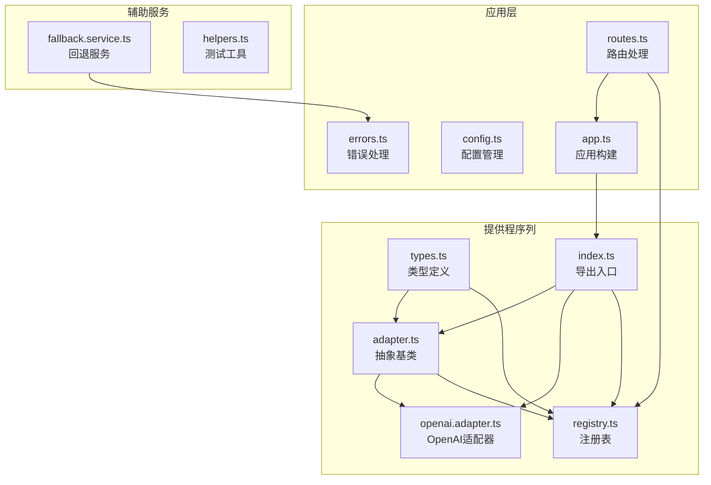
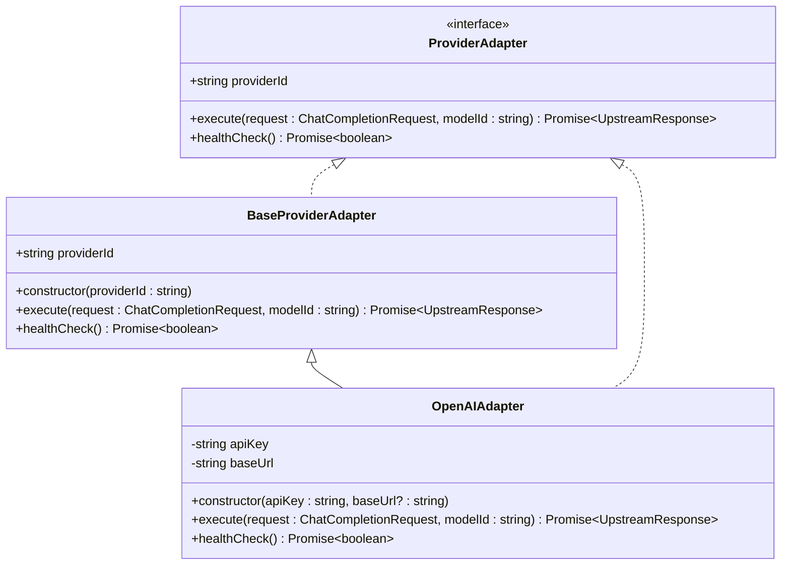
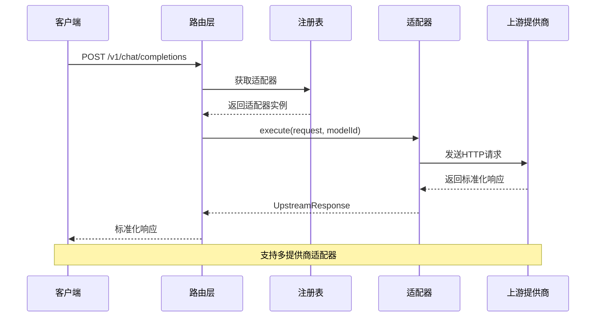
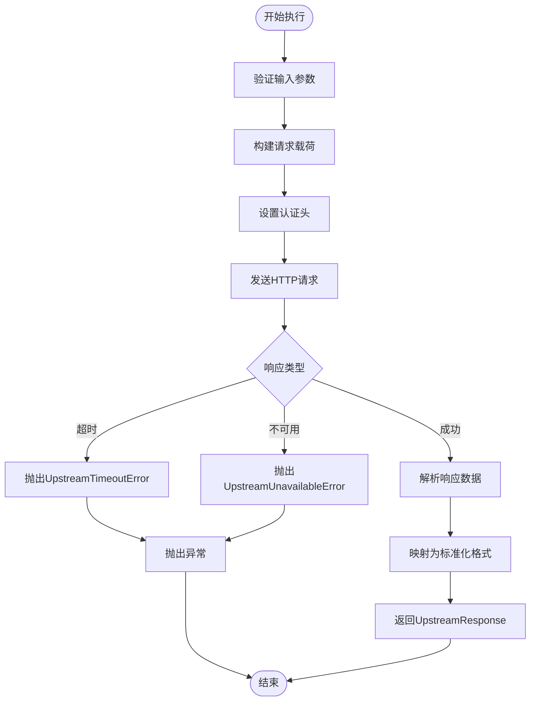
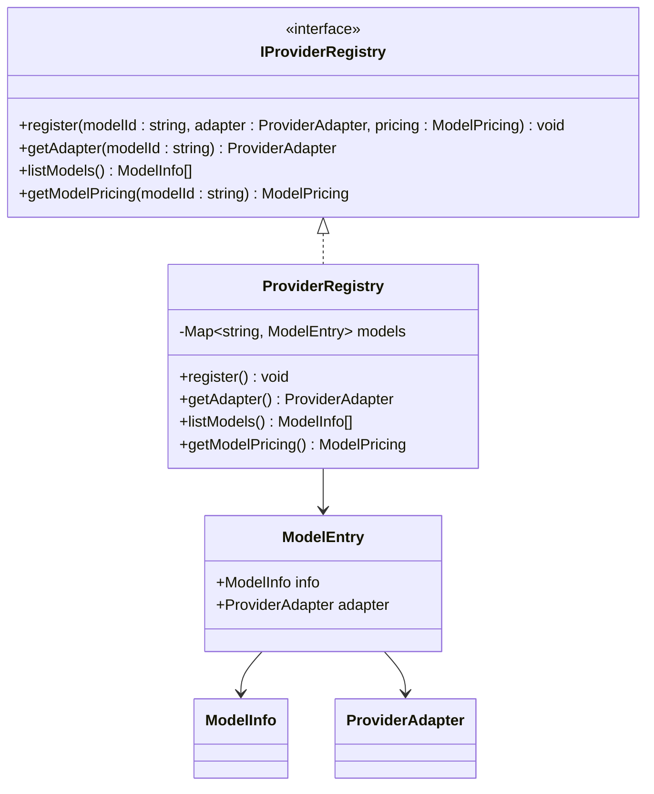
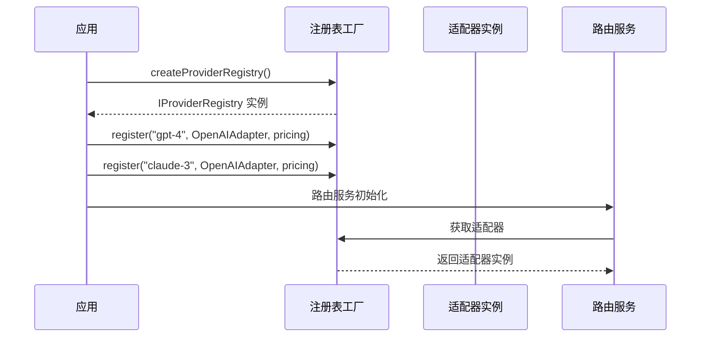
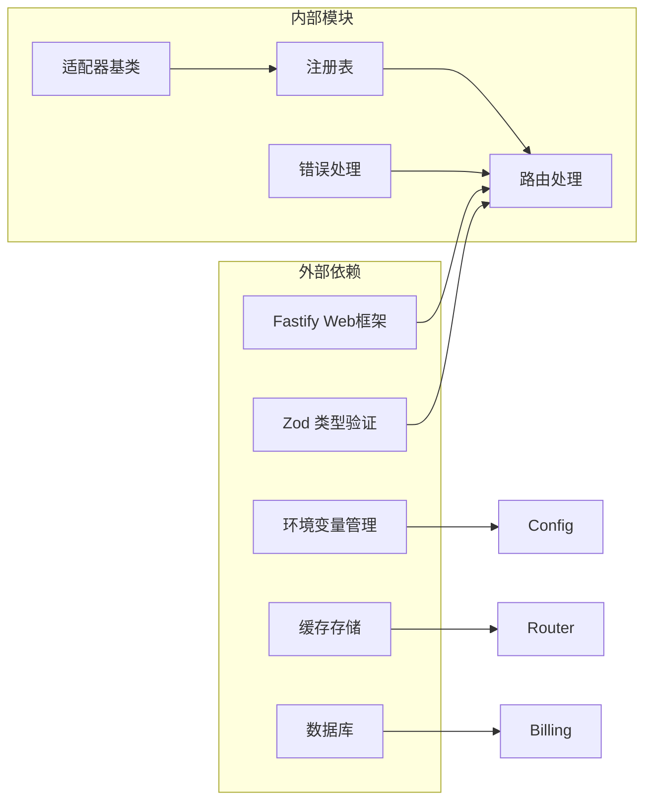
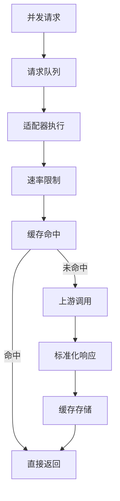
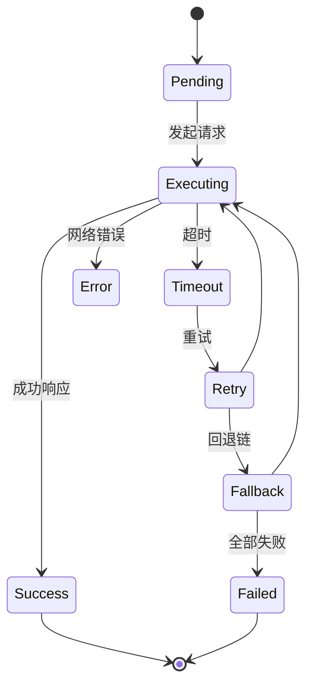
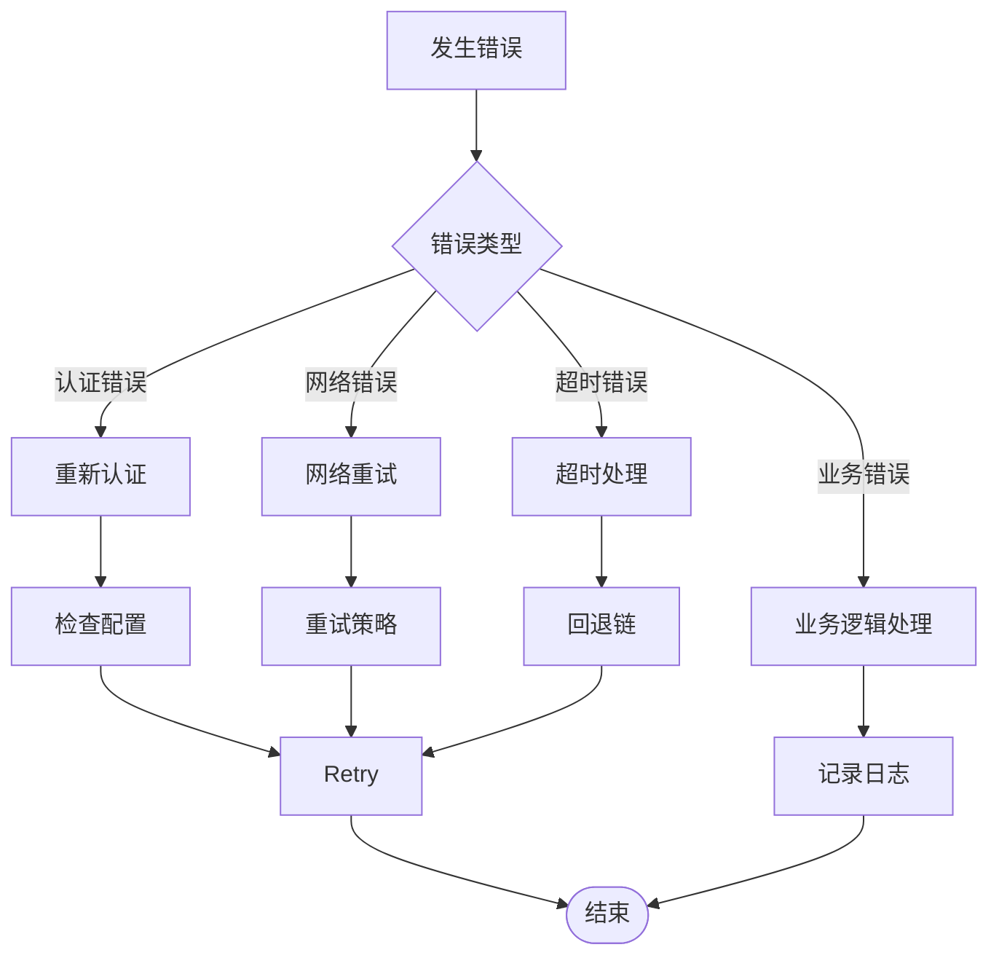

# 提供商适配器扩展

<cite>
**本文档引用的文件**
- [adapter.ts](file://src/provider/adapter.ts)
- [openai.adapter.ts](file://src/provider/openai.adapter.ts)
- [registry.ts](file://src/provider/registry.ts)
- [types.ts](file://src/provider/types.ts)
- [index.ts](file://src/provider/index.ts)
- [app.ts](file://src/app.ts)
- [routes.ts](file://src/gateway/routes.ts)
- [types.ts](file://src/types.ts)
- [config.ts](file://src/config.ts)
- [errors.ts](file://src/errors.ts)
- [fallback.service.ts](file://src/router/fallback.service.ts)
- [helpers.ts](file://test/helpers.ts)
</cite>

## 目录
1. [简介](#简介)
2. [项目结构](#项目结构)
3. [核心组件](#核心组件)
4. [架构概览](#架构概览)
5. [详细组件分析](#详细组件分析)
6. [依赖关系分析](#依赖关系分析)
7. [性能考虑](#性能考虑)
8. [故障排除指南](#故障排除指南)
9. [结论](#结论)
10. [附录](#附录)

## 简介

本文档为 x402 Gateway 的提供商适配器扩展指南，详细说明了 BaseProviderAdapter 抽象类的设计原理和接口规范，提供了完整的自定义适配器开发流程，包含 OpenAI 适配器的实现示例，并解释了适配器注册机制和动态加载过程。文档还涵盖了测试方法、错误处理策略和性能优化建议，以及如何处理不同提供商的 API 差异、认证方式和响应格式转换。

## 项目结构

x402 Gateway 的提供商适配器系统采用模块化设计，主要包含以下关键目录和文件：

**图表来源**
- [adapter.ts:1-16](file://src/provider/adapter.ts#L1-L16)
- [openai.adapter.ts:1-44](file://src/provider/openai.adapter.ts#L1-L44)
- [registry.ts:1-65](file://src/provider/registry.ts#L1-L65)
- [app.ts:1-101](file://src/app.ts#L1-L101)

**章节来源**
- [adapter.ts:1-16](file://src/provider/adapter.ts#L1-L16)
- [registry.ts:1-65](file://src/provider/registry.ts#L1-L65)
- [app.ts:1-101](file://src/app.ts#L1-L101)

## 核心组件

### BaseProviderAdapter 抽象类

BaseProviderAdapter 是所有提供商适配器的抽象基类，定义了统一的接口规范：

**图表来源**
- [adapter.ts:10-15](file://src/provider/adapter.ts#L10-L15)
- [types.ts:26-35](file://src/provider/types.ts#L26-L35)
- [openai.adapter.ts:10-43](file://src/provider/openai.adapter.ts#L10-L43)

### 接口规范详解

#### ProviderAdapter 接口
ProviderAdapter 定义了适配器必须实现的标准接口：

- `providerId`: 只读属性，标识提供商的唯一标识符
- `execute()`: 执行聊天补全请求的核心方法
- `healthCheck()`: 健康检查方法，验证上游提供商可达性

#### UpstreamResponse 标准化响应
所有适配器必须返回标准化的 UpstreamResponse 结构：

- `model_used`: 实际使用的模型标识
- `choices`: 包含消息和完成原因的数组
- `usage`: 令牌使用统计信息
- `latency_ms`: 请求延迟（毫秒）

**章节来源**
- [types.ts:3-17](file://src/provider/types.ts#L3-L17)
- [types.ts:26-35](file://src/provider/types.ts#L26-L35)

## 架构概览

x402 Gateway 的适配器架构采用分层设计，实现了清晰的职责分离：

**图表来源**
- [routes.ts:23-67](file://src/gateway/routes.ts#L23-L67)
- [registry.ts:44-49](file://src/provider/registry.ts#L44-L49)
- [adapter.ts:13-14](file://src/provider/adapter.ts#L13-L14)

## 详细组件分析

### OpenAI 适配器实现

OpenAIAdapter 是 BaseProviderAdapter 的具体实现，展示了适配器的标准开发模式：

#### 认证机制
- 使用 Bearer Token 认证
- 支持自定义基础 URL
- 配置驱动的 API 密钥管理

#### 请求处理流程
1. **参数验证**: 验证输入请求的有效性
2. **HTTP 调用**: 向上游 API 发送请求
3. **响应映射**: 将上游响应转换为标准化格式
4. **错误处理**: 将网络错误映射为特定异常类型

**图表来源**
- [openai.adapter.ts:25-42](file://src/provider/openai.adapter.ts#L25-L42)

**章节来源**
- [openai.adapter.ts:1-44](file://src/provider/openai.adapter.ts#L1-L44)

### 适配器注册机制

ProviderRegistry 实现了适配器的集中管理和动态访问：

#### 注册流程
1. **模型注册**: 将模型 ID、适配器实例和定价信息关联
2. **元数据管理**: 维护模型的提供商信息、上下文窗口和功能特性
3. **动态查询**: 提供按模型 ID 检索适配器的能力

#### 注册表结构

**图表来源**
- [registry.ts:4-16](file://src/provider/registry.ts#L4-L16)
- [registry.ts:18-21](file://src/provider/registry.ts#L18-L21)

**章节来源**
- [registry.ts:1-65](file://src/provider/registry.ts#L1-L65)

### 应用集成

在应用启动时，适配器通过 createProviderRegistry() 工厂函数进行初始化：

**图表来源**
- [app.ts:77-94](file://src/app.ts#L77-L94)
- [registry.ts:31-42](file://src/provider/registry.ts#L31-L42)

**章节来源**
- [app.ts:77-94](file://src/app.ts#L77-L94)

## 依赖关系分析

### 外部依赖

适配器系统依赖于以下外部库和服务：

**图表来源**
- [app.ts:1-101](file://src/app.ts#L1-L101)
- [config.ts:1-46](file://src/config.ts#L1-L46)

### 内部耦合关系

适配器系统遵循低耦合高内聚的设计原则：

- **适配器与注册表**: 通过接口解耦，支持动态替换
- **路由与适配器**: 通过标准化接口通信，无需关心具体实现
- **错误处理**: 统一的错误类型映射到 API 错误码

**章节来源**
- [types.ts:1-36](file://src/provider/types.ts#L1-L36)
- [errors.ts:1-106](file://src/errors.ts#L1-L106)

## 性能考虑

### 并发处理

### 缓存策略

- **响应缓存**: 对重复请求进行缓存，减少上游调用
- **模型元数据缓存**: 缓存模型信息和定价数据
- **健康检查缓存**: 缓存提供商可用性状态

### 超时和重试

**图表来源**
- [fallback.service.ts:18-40](file://src/router/fallback.service.ts#L18-L40)

**章节来源**
- [fallback.service.ts:1-40](file://src/router/fallback.service.ts#L1-L40)

## 故障排除指南

### 常见错误类型

#### 上游提供商错误
- **UpstreamTimeoutError**: 上游提供商超时
- **UpstreamUnavailableError**: 上游提供商不可用
- **ProviderError**: 通用提供商错误

#### 配置问题
- **模型未找到**: 注册表中不存在指定模型
- **认证失败**: API 密钥无效或过期
- **网络连接失败**: 无法连接到上游提供商

### 错误处理策略

**图表来源**
- [errors.ts:67-81](file://src/errors.ts#L67-L81)

**章节来源**
- [errors.ts:1-106](file://src/errors.ts#L1-L106)

### 调试技巧

1. **启用详细日志**: 设置 LOG_LEVEL 为 debug 或 trace
2. **检查环境变量**: 验证 OPENAI_API_KEY 和其他配置
3. **测试健康检查**: 使用 healthCheck() 方法验证连接
4. **监控指标**: 关注请求延迟和成功率

## 结论

x402 Gateway 的提供商适配器系统通过抽象基类和标准化接口，为多提供商支持提供了灵活的架构。BaseProviderAdapter 定义了清晰的契约，OpenAIAdapter 展示了标准实现模式，ProviderRegistry 实现了动态注册和管理。该系统支持：

- **可扩展性**: 易于添加新的提供商适配器
- **标准化**: 统一的响应格式和错误处理
- **可靠性**: 健康检查和回退机制
- **可观测性**: 详细的日志和监控支持

通过遵循本文档的指导，开发者可以快速实现新的提供商适配器，并将其无缝集成到现有的 x402 Gateway 生态系统中。

## 附录

### 开发步骤清单

1. **继承抽象类**: 创建新的适配器类继承 BaseProviderAdapter
2. **实现核心方法**: 
   - 实现 execute() 方法处理请求
   - 实现 healthCheck() 方法进行健康检查
3. **定义认证**: 配置 API 密钥和认证方式
4. **实现响应映射**: 将上游响应转换为标准化格式
5. **错误处理**: 实现适当的错误映射和处理
6. **注册适配器**: 在应用启动时注册适配器
7. **编写测试**: 创建单元测试和集成测试
8. **性能优化**: 实现缓存和重试机制

### 测试最佳实践

- **模拟外部依赖**: 使用测试替身模拟上游提供商
- **覆盖边界条件**: 测试超时、错误和异常情况
- **验证标准化**: 确保输出符合 UpstreamResponse 规范
- **性能基准**: 测量响应时间和吞吐量

### 部署注意事项

- **配置管理**: 使用环境变量管理敏感配置
- **监控告警**: 设置适当的监控和告警机制
- **容量规划**: 根据预期负载规划资源
- **安全考虑**: 实施适当的访问控制和数据保护