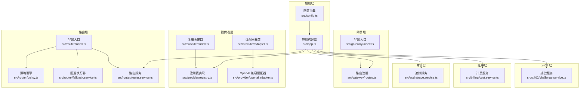
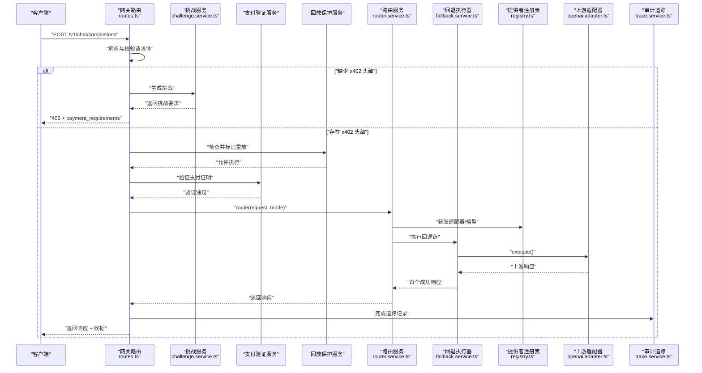
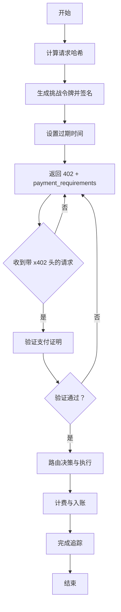
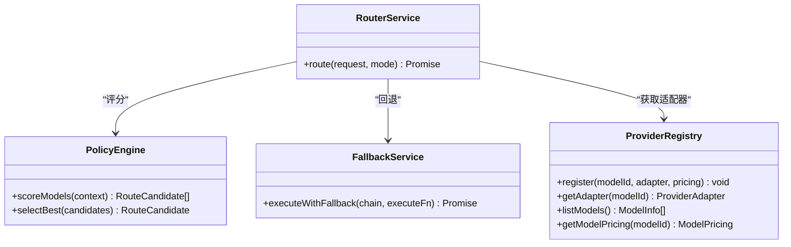
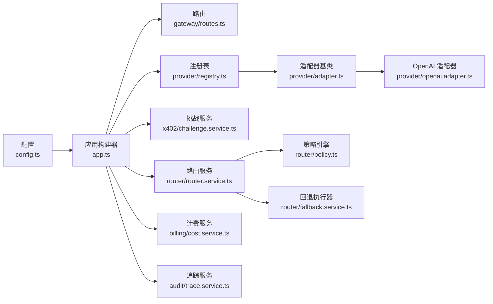

# 第三方集成

<cite>
**本文引用的文件**
- [src/app.ts](file://src/app.ts)
- [src/config.ts](file://src/config.ts)
- [src/gateway/index.ts](file://src/gateway/index.ts)
- [src/gateway/routes.ts](file://src/gateway/routes.ts)
- [src/provider/index.ts](file://src/provider/index.ts)
- [src/provider/adapter.ts](file://src/provider/adapter.ts)
- [src/provider/openai.adapter.ts](file://src/provider/openai.adapter.ts)
- [src/provider/registry.ts](file://src/provider/registry.ts)
- [src/router/index.ts](file://src/router/index.ts)
- [src/router/router.service.ts](file://src/router/router.service.ts)
- [src/router/policy.ts](file://src/router/policy.ts)
- [src/router/fallback.service.ts](file://src/router/fallback.service.ts)
- [src/x402/challenge.service.ts](file://src/x402/challenge.service.ts)
- [src/billing/cost.service.ts](file://src/billing/cost.service.ts)
- [src/audit/trace.service.ts](file://src/audit/trace.service.ts)
- [test/integration/flow.test.ts](file://test/integration/flow.test.ts)
- [docker-compose.yml](file://docker-compose.yml)
- [package.json](file://package.json)
</cite>

## 目录
1. [简介](#简介)
2. [项目结构](#项目结构)
3. [核心组件](#核心组件)
4. [架构总览](#架构总览)
5. [详细组件分析](#详细组件分析)
6. [依赖关系分析](#依赖关系分析)
7. [性能考虑](#性能考虑)
8. [故障排查指南](#故障排查指南)
9. [结论](#结论)
10. [附录](#附录)

## 简介
本指南面向需要在 x402 Gateway 中集成第三方服务与 API 的开发者，覆盖配置管理、依赖注入与服务注册、数据库与消息队列接入、监控与日志、环境变量、OAuth 与 API 密钥管理、安全令牌处理、集成测试策略、故障转移与性能优化，以及第三方服务的版本兼容与升级策略。文档以代码为依据，提供可操作的集成步骤与最佳实践。

## 项目结构
该应用采用模块化分层设计：入口与容器装配在应用层，网关路由与校验在网关层，上游适配器与注册表在提供者层，路由策略与回退在路由层，计费与账务在账单层，审计与追踪在审计层。各层通过接口解耦，便于替换与扩展。

图表来源
- [src/app.ts:35-100](file://src/app.ts#L35-L100)
- [src/gateway/routes.ts:9-96](file://src/gateway/routes.ts#L9-L96)
- [src/provider/registry.ts:27-64](file://src/provider/registry.ts#L27-L64)
- [src/provider/openai.adapter.ts:10-43](file://src/provider/openai.adapter.ts#L10-L43)
- [src/router/router.service.ts:20-49](file://src/router/router.service.ts#L20-L49)
- [src/x402/challenge.service.ts:34-70](file://src/x402/challenge.service.ts#L34-L70)
- [src/billing/cost.service.ts:16-31](file://src/billing/cost.service.ts#L16-L31)
- [src/audit/trace.service.ts:38-67](file://src/audit/trace.service.ts#L38-L67)

章节来源
- [src/app.ts:35-100](file://src/app.ts#L35-L100)
- [src/gateway/routes.ts:9-96](file://src/gateway/routes.ts#L9-L96)
- [src/provider/registry.ts:27-64](file://src/provider/registry.ts#L27-L64)
- [src/router/router.service.ts:20-49](file://src/router/router.service.ts#L20-L49)

## 核心组件
- 应用构建器与服务容器：负责插件注册、全局错误处理、服务实例化与注入。
- 配置系统：基于 Zod 的强类型配置加载，支持环境变量与默认值。
- 提供者注册表：模型到适配器与定价的映射，支持按模型检索与列表。
- 上游适配器：抽象基类定义统一执行与健康检查契约；OpenAI 兼容适配器为示例实现。
- 路由服务：根据手动或自动模式选择最佳模型、构建回退链并执行。
- 策略引擎：对可用模型进行评分与优选。
- 回退执行器：顺序尝试多个候选模型，确保不重复计费。
- x402 挑战服务：生成与验证挑战，绑定请求哈希与过期时间。
- 计费服务：基于用量与定价计算成本与平台费用。
- 审计追踪：记录请求生命周期、路由决策与结算证据。

章节来源
- [src/app.ts:21-33](file://src/app.ts#L21-L33)
- [src/config.ts:28-45](file://src/config.ts#L28-L45)
- [src/provider/registry.ts:4-16](file://src/provider/registry.ts#L4-L16)
- [src/provider/adapter.ts:10-15](file://src/provider/adapter.ts#L10-L15)
- [src/router/router.service.ts:5-18](file://src/router/router.service.ts#L5-L18)
- [src/router/policy.ts:3-14](file://src/router/policy.ts#L3-L14)
- [src/router/fallback.service.ts:4-16](file://src/router/fallback.service.ts#L4-L16)
- [src/x402/challenge.service.ts:4-26](file://src/x402/challenge.service.ts#L4-L26)
- [src/billing/cost.service.ts:4-14](file://src/billing/cost.service.ts#L4-L14)
- [src/audit/trace.service.ts:4-36](file://src/audit/trace.service.ts#L4-L36)

## 架构总览
下图展示从客户端请求到上游调用与回退的整体流程，以及 x402 支付挑战与验证的关键节点。

图表来源
- [src/gateway/routes.ts:23-67](file://src/gateway/routes.ts#L23-L67)
- [src/x402/challenge.service.ts:36-60](file://src/x402/challenge.service.ts#L36-L60)
- [src/router/router.service.ts:27-46](file://src/router/router.service.ts#L27-L46)
- [src/router/fallback.service.ts:20-38](file://src/router/fallback.service.ts#L20-L38)
- [src/provider/registry.ts:44-49](file://src/provider/registry.ts#L44-L49)
- [src/provider/openai.adapter.ts:25-34](file://src/provider/openai.adapter.ts#L25-L34)
- [src/audit/trace.service.ts:49-55](file://src/audit/trace.service.ts#L49-L55)

## 详细组件分析

### 配置管理与环境变量
- 强类型配置：使用 Zod 对所有运行时配置进行解析与校验，支持默认值与严格类型推断。
- 环境变量映射：通过 loadConfig 将进程环境变量映射到配置对象，涵盖端口、主机、日志级别、数据库与缓存连接、挑战密钥与参数、商户地址、支付链与资产、第三方 API Key（如 OpenAI、Anthropic）、平台费率等。
- 建议：新增第三方服务配置时，遵循现有模式添加字段与默认值，并在应用构建阶段集中校验。

章节来源
- [src/config.ts:4-24](file://src/config.ts#L4-L24)
- [src/config.ts:28-45](file://src/config.ts#L28-L45)

### 依赖注入与服务注册机制
- 服务容器：应用构建器集中创建并注入服务实例，形成 ServiceContainer，路由处理器仅依赖接口。
- 注册表模式：提供者注册表以内存 Map 存储模型到适配器与定价的映射，支持启动时注册与运行时查询。
- 适配器契约：BaseProviderAdapter 抽象了 execute 与 healthCheck，便于扩展新上游。
- 路由服务：通过策略引擎与回退执行器组合，实现自动/手动两种路由模式。

章节来源
- [src/app.ts:77-94](file://src/app.ts#L77-L94)
- [src/provider/registry.ts:27-64](file://src/provider/registry.ts#L27-L64)
- [src/provider/adapter.ts:10-15](file://src/provider/adapter.ts#L10-L15)
- [src/router/router.service.ts:20-49](file://src/router/router.service.ts#L20-L49)

### 数据库连接与消息队列集成
- 当前状态：应用构建器中预留了数据库与缓存连接的初始化占位，尚未实际建立连接。
- 接入建议：
  - 数据库：使用连接池（如 Kysely）创建连接，注入到需要持久化的服务（如审计追踪、账务流水）。
  - 缓存/队列：引入 Redis 客户端与消息队列客户端，用于会话存储、限流、幂等键与异步任务。
- 注意：确保在应用启动时初始化并在关闭钩子中释放资源。

章节来源
- [src/app.ts:73-75](file://src/app.ts#L73-L75)
- [src/app.ts:77-94](file://src/app.ts#L77-L94)

### 监控系统与日志服务
- 日志级别：通过配置控制 Fastify 日志级别，便于在不同环境调整可观测性粒度。
- 建议：结合结构化日志与追踪 ID，将关键事件（路由决策、计费、审计）写入日志或指标系统。
- 指标：可统计请求量、成功率、延迟、失败原因分布、上游调用耗时与回退次数。

章节来源
- [src/app.ts:36-41](file://src/app.ts#L36-L41)
- [src/config.ts:7-8](file://src/config.ts#L7-L8)

### OAuth 认证与 API 密钥管理
- API 密钥：配置中包含第三方服务的 API Key 字段（如 OpenAI、Anthropic），用于上游适配器鉴权。
- OAuth：当前未见内置 OAuth 实现。若需对接 OAuth，建议：
  - 在网关层增加认证中间件，解析与刷新访问令牌。
  - 将令牌注入到上游适配器或通过代理转发。
  - 使用安全存储与轮换策略管理密钥与令牌。
- 安全令牌处理：对敏感配置项（如 CHALLENGE_SECRET）设置最小长度与只读权限，避免泄露。

章节来源
- [src/config.ts:20-21](file://src/config.ts#L20-L21)
- [src/config.ts:13](file://src/config.ts#L13)
- [src/provider/openai.adapter.ts:10-18](file://src/provider/openai.adapter.ts#L10-L18)

### x402 挑战与支付流程
- 挑战生成：计算请求哈希、签名挑战令牌、设置过期时间，返回给客户端。
- 挑战验证：校验签名、过期时间与请求哈希一致性。
- 支付验证：在路由执行前进行支付证明验证，确保已付费。
- 回放保护：通过幂等键与重放检查服务防止重复消费。

图表来源
- [src/x402/challenge.service.ts:36-60](file://src/x402/challenge.service.ts#L36-L60)
- [src/gateway/routes.ts:23-67](file://src/gateway/routes.ts#L23-L67)

章节来源
- [src/x402/challenge.service.ts:4-26](file://src/x402/challenge.service.ts#L4-L26)
- [src/gateway/routes.ts:23-67](file://src/gateway/routes.ts#L23-L67)

### 路由策略与故障转移
- 自动模式：策略引擎根据成本、能力匹配与可用性对模型打分，选择最优候选并构建回退链。
- 手动模式：直接使用请求指定模型。
- 故障转移：回退执行器顺序尝试，首个成功即返回，失败则抛出统一错误，避免重复计费。

图表来源
- [src/router/policy.ts:16-33](file://src/router/policy.ts#L16-L33)
- [src/router/fallback.service.ts:18-40](file://src/router/fallback.service.ts#L18-L40)
- [src/router/router.service.ts:20-49](file://src/router/router.service.ts#L20-L49)
- [src/provider/registry.ts:27-64](file://src/provider/registry.ts#L27-L64)

章节来源
- [src/router/policy.ts:3-14](file://src/router/policy.ts#L3-L14)
- [src/router/fallback.service.ts:4-16](file://src/router/fallback.service.ts#L4-L16)
- [src/router/router.service.ts:5-18](file://src/router/router.service.ts#L5-L18)

### 审计与追踪
- 生命周期记录：从追踪开始、完成与失败，记录路由决策、用量、成本、支付信息与耗时。
- 查询接口：提供审计查询端点，后续可接入持久化存储。

章节来源
- [src/audit/trace.service.ts:4-36](file://src/audit/trace.service.ts#L4-L36)
- [src/gateway/routes.ts:82-94](file://src/gateway/routes.ts#L82-L94)

### 计费与账务
- 成本计算：基于输入输出单价与令牌用量，计算小计、平台费用与总计，保证可复现性。
- 账务入账：路由完成后提交到账务系统，配合审计与追踪。

章节来源
- [src/billing/cost.service.ts:4-14](file://src/billing/cost.service.ts#L4-L14)
- [src/billing/cost.service.ts:16-31](file://src/billing/cost.service.ts#L16-L31)

## 依赖关系分析
- 组件耦合：路由层依赖策略与回退；路由层与提供者层通过注册表解耦；网关层仅依赖服务接口。
- 外部依赖：Fastify 插件、Zod 校验、JWST/JWT 工具（用于挑战签名）、Redis/KV（用于回放保护与缓存）。
- 循环依赖：当前未见循环导入；建议保持接口与工厂函数模式，避免运行时耦合。

图表来源
- [src/app.ts:35-100](file://src/app.ts#L35-L100)
- [src/gateway/routes.ts:9-96](file://src/gateway/routes.ts#L9-L96)
- [src/provider/registry.ts:27-64](file://src/provider/registry.ts#L27-L64)
- [src/provider/adapter.ts:10-15](file://src/provider/adapter.ts#L10-L15)
- [src/provider/openai.adapter.ts:10-43](file://src/provider/openai.adapter.ts#L10-L43)
- [src/router/router.service.ts:20-49](file://src/router/router.service.ts#L20-L49)
- [src/router/policy.ts:16-33](file://src/router/policy.ts#L16-L33)
- [src/router/fallback.service.ts:18-40](file://src/router/fallback.service.ts#L18-L40)
- [src/x402/challenge.service.ts:34-70](file://src/x402/challenge.service.ts#L34-L70)
- [src/billing/cost.service.ts:16-31](file://src/billing/cost.service.ts#L16-L31)
- [src/audit/trace.service.ts:38-67](file://src/audit/trace.service.ts#L38-L67)

## 性能考虑
- 连接池与并发：为数据库与上游适配器配置合理的连接数与超时，避免阻塞。
- 缓存策略：对模型元数据、定价与热点响应进行缓存，降低重复计算与网络开销。
- 路由评分与回退：在策略引擎中加入可用性与延迟指标，缩短回退链长度。
- 日志与指标：采样关键路径日志，避免高吞吐场景下的 I/O 压力。
- 资源回收：在应用关闭时释放连接与定时器，防止资源泄漏。

## 故障排查指南
- 全局错误处理：应用层统一捕获业务错误与校验错误，返回标准化响应。
- 上游不可用：回退执行器在全部失败后抛出统一错误，便于定位与告警。
- 审计与追踪：通过追踪服务查询请求生命周期，辅助排障。
- 集成测试：利用集成测试覆盖完整支付流程，尽早发现端到端问题。

章节来源
- [src/app.ts:53-70](file://src/app.ts#L53-L70)
- [src/router/fallback.service.ts:35-37](file://src/router/fallback.service.ts#L35-L37)
- [src/audit/trace.service.ts:57-65](file://src/audit/trace.service.ts#L57-L65)
- [test/integration/flow.test.ts](file://test/integration/flow.test.ts)

## 结论
本指南提供了在 x402 Gateway 中集成第三方服务的系统化方法：以配置驱动、接口解耦的服务容器为核心，通过注册表与适配器扩展上游能力；借助策略与回退实现智能路由与高可用；以挑战与支付验证保障收益闭环；以审计与追踪完善可观测性。按照本文建议逐步落地数据库、消息队列、监控与日志，即可在保证安全与性能的前提下快速扩展生态。

## 附录

### 环境变量清单与用途
- 应用与运行：PORT、HOST、NODE_ENV、LOG_LEVEL
- 存储与缓存：DATABASE_URL、REDIS_URL
- x402 与支付：CHALLENGE_SECRET、CHALLENGE_TTL_SECONDS、MERCHANT_ADDRESS、PAYMENT_CHAIN、PAYMENT_ASSET
- 第三方 API Key：OPENAI_API_KEY、ANTHROPIC_API_KEY
- 平台费率：PLATFORM_FEE_BPS

章节来源
- [src/config.ts:4-24](file://src/config.ts#L4-L24)
- [src/config.ts:28-45](file://src/config.ts#L28-L45)

### 服务发现与负载均衡
- 服务发现：可通过容器编排或服务网格实现服务发现与健康检查。
- 负载均衡：在反向代理层启用轮询或最少连接策略，结合上游适配器健康检查减少故障节点流量。

### 版本兼容与升级策略
- 向后兼容：在提供者适配器层面隔离上游变更，通过注册表切换模型与适配器。
- 渐进式升级：先在测试环境验证，再灰度发布；对关键路径（路由、计费、追踪）进行回归测试。
- 配置迁移：通过配置版本字段与迁移脚本，平滑过渡新旧参数。

### 集成测试策略
- 单元测试：针对策略、回退、计费与追踪的边界条件。
- 集成测试：覆盖从网关到上游适配器的完整链路，模拟挑战、支付与回退。
- 性能测试：在不同并发与延迟条件下评估系统稳定性。

章节来源
- [test/integration/flow.test.ts](file://test/integration/flow.test.ts)