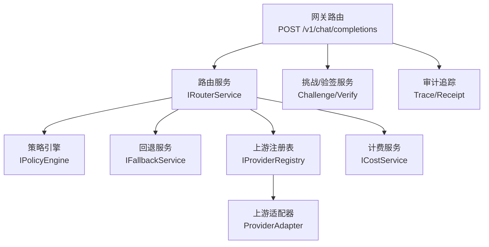
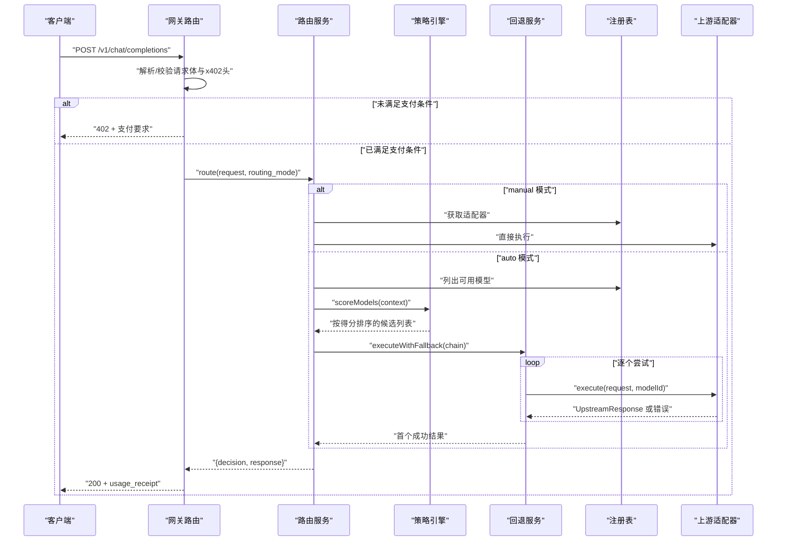
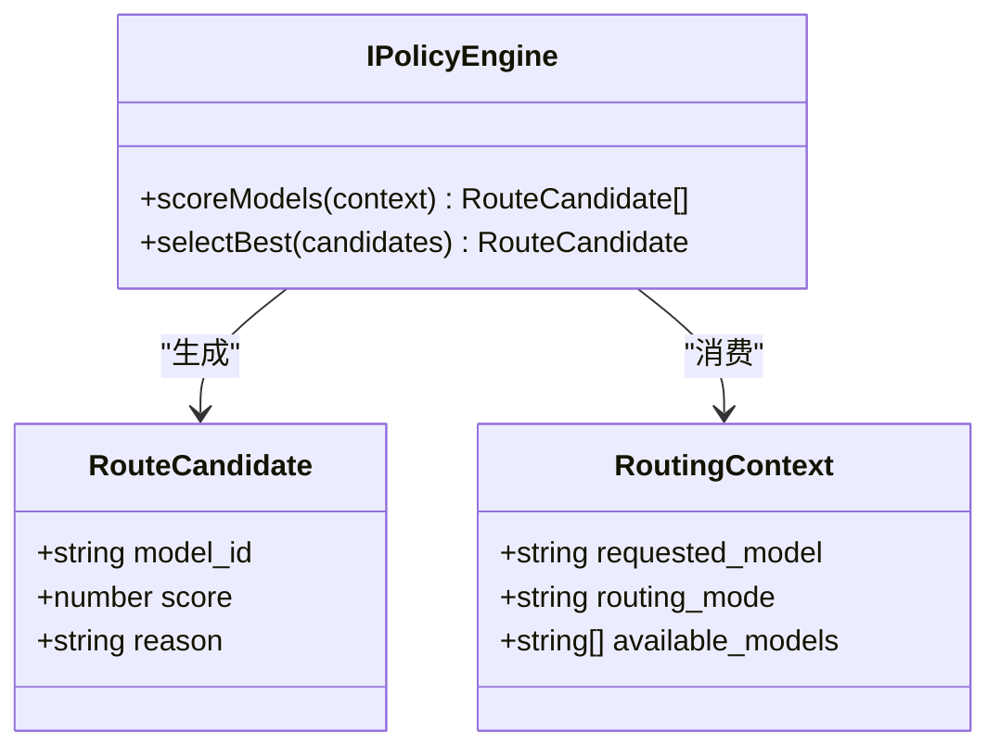
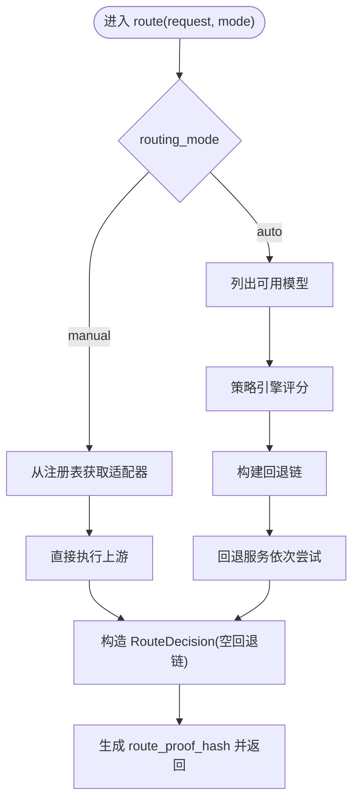
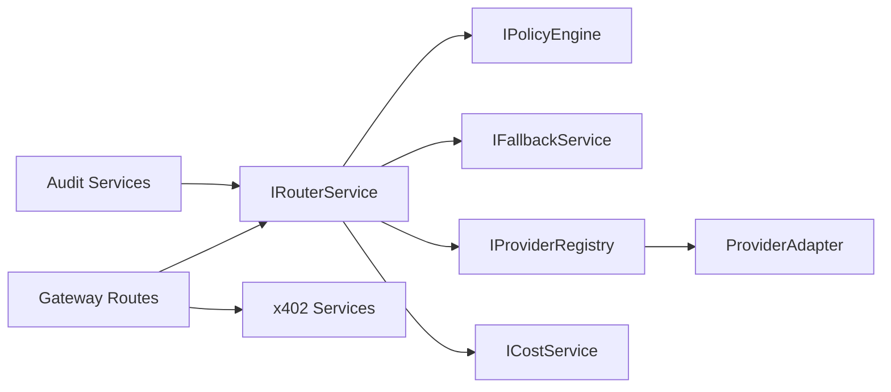

# 路由策略定制

<cite>
**本文引用的文件**
- [src/router/policy.ts](file://src/router/policy.ts)
- [src/router/types.ts](file://src/router/types.ts)
- [src/router/router.service.ts](file://src/router/router.service.ts)
- [src/router/fallback.service.ts](file://src/router/fallback.service.ts)
- [src/router/index.ts](file://src/router/index.ts)
- [src/gateway/routes.ts](file://src/gateway/routes.ts)
- [src/provider/registry.ts](file://src/provider/registry.ts)
- [src/provider/types.ts](file://src/provider/types.ts)
- [src/types.ts](file://src/types.ts)
- [src/billing/cost.service.ts](file://src/billing/cost.service.ts)
- [src/billing/types.ts](file://src/billing/types.ts)
- [src/x402/types.ts](file://src/x402/types.ts)
- [src/app.ts](file://src/app.ts)
- [test/router/router.test.ts](file://test/router/router.test.ts)
- [docs/api-spec-v0-x402-gateway.md](file://docs/api-spec-v0-x402-gateway.md)
</cite>

## 目录
1. [简介](#简介)
2. [项目结构](#项目结构)
3. [核心组件](#核心组件)
4. [架构总览](#架构总览)
5. [详细组件分析](#详细组件分析)
6. [依赖关系分析](#依赖关系分析)
7. [性能考量](#性能考量)
8. [故障排查指南](#故障排查指南)
9. [结论](#结论)
10. [附录](#附录)

## 简介
本指南面向需要在 x402 Gateway 中定制路由策略的开发者，围绕 IPolicyEngine 接口的设计与实现展开，覆盖策略评估逻辑、模型选择算法与成本计算规则；提供可扩展的自定义策略开发示例，解释策略配置参数、优先级与回退机制；并给出策略测试方法、A/B 测试支持思路与性能监控指标建议。同时说明如何集成外部策略服务与实现策略的实时更新机制。

## 项目结构
x402 Gateway 的路由子系统由“策略引擎（IPolicyEngine）+ 路由编排（IRouterService）+ 回退执行（IFallbackService）+ 上游适配（IProviderRegistry/ProviderAdapter）”构成，并通过网关层路由处理支付与请求转发。核心类型与接口位于 router、provider、billing、x402、gateway 等模块中，测试用例位于 test/router。

图表来源
- [src/gateway/routes.ts:1-96](file://src/gateway/routes.ts#L1-96)
- [src/router/router.service.ts:1-50](file://src/router/router.service.ts#L1-50)
- [src/router/policy.ts:1-34](file://src/router/policy.ts#L1-34)
- [src/router/fallback.service.ts:1-41](file://src/router/fallback.service.ts#L1-41)
- [src/provider/registry.ts:1-65](file://src/provider/registry.ts#L1-65)
- [src/billing/cost.service.ts:1-32](file://src/billing/cost.service.ts#L1-32)

章节来源
- [src/gateway/routes.ts:1-96](file://src/gateway/routes.ts#L1-96)
- [src/router/router.service.ts:1-50](file://src/router/router.service.ts#L1-50)
- [src/router/policy.ts:1-34](file://src/router/policy.ts#L1-34)
- [src/router/fallback.service.ts:1-41](file://src/router/fallback.service.ts#L1-41)
- [src/provider/registry.ts:1-65](file://src/provider/registry.ts#L1-65)
- [src/billing/cost.service.ts:1-32](file://src/billing/cost.service.ts#L1-32)

## 核心组件
- IPolicyEngine：负责对可用模型进行评分与排序，并选择最佳候选。接口包含 scoreModels 与 selectBest。
- IRouterService：编排完整路由流程，按手动/自动模式分别执行直连或策略评分+回退链。
- IFallbackService：按回退链顺序尝试上游调用，首个成功即返回，失败不重复计费。
- IProviderRegistry/ProviderAdapter：模型注册与上游适配，提供定价信息与执行能力。
- ICostService：基于 token 使用量与单价计算费用明细，确保可复现性。
- 类型与契约：RoutingContext、RouteCandidate、RouteDecision、ChatCompletionRequest 等。

章节来源
- [src/router/policy.ts:1-34](file://src/router/policy.ts#L1-34)
- [src/router/types.ts:1-22](file://src/router/types.ts#L1-22)
- [src/router/router.service.ts:1-50](file://src/router/router.service.ts#L1-50)
- [src/router/fallback.service.ts:1-41](file://src/router/fallback.service.ts#L1-41)
- [src/provider/registry.ts:1-65](file://src/provider/registry.ts#L1-65)
- [src/provider/types.ts:1-36](file://src/provider/types.ts#L1-36)
- [src/billing/cost.service.ts:1-32](file://src/billing/cost.service.ts#L1-32)
- [src/types.ts:1-119](file://src/types.ts#L1-119)

## 架构总览
下图展示了从网关到路由、策略、回退与上游适配的整体调用序列，以及与 x402 支付流程的衔接点。

图表来源
- [src/gateway/routes.ts:1-96](file://src/gateway/routes.ts#L1-96)
- [src/router/router.service.ts:1-50](file://src/router/router.service.ts#L1-50)
- [src/router/policy.ts:1-34](file://src/router/policy.ts#L1-34)
- [src/router/fallback.service.ts:1-41](file://src/router/fallback.service.ts#L1-41)
- [src/provider/registry.ts:1-65](file://src/provider/registry.ts#L1-65)
- [src/provider/types.ts:1-36](file://src/provider/types.ts#L1-36)

## 详细组件分析

### IPolicyEngine 设计与实现要点
- 职责边界
  - scoreModels：综合考虑成本、能力匹配度与可用性，对候选模型打分并降序排列。
  - selectBest：从评分后的候选中选取最高分者。
- 输入上下文
  - 请求指定模型名、路由模式、可用模型集合等，用于驱动评分。
- 输出契约
  - RouteCandidate 包含 model_id、score、reason；最终由 IRouterService 构建回退链。
- 成本计算与评分
  - 建议以单价（输入/输出）作为成本权重，结合可用性与能力匹配度进行归一化加权。
  - 可引入动态权重因子（如 cost_weight、availability_weight、capability_match_weight），并记录 reason 便于审计。
- 错误与边界
  - 当无候选时，selectBest 抛出明确错误，避免静默失败。

图表来源
- [src/router/policy.ts:1-34](file://src/router/policy.ts#L1-34)
- [src/router/types.ts:1-22](file://src/router/types.ts#L1-22)

章节来源
- [src/router/policy.ts:1-34](file://src/router/policy.ts#L1-34)
- [src/router/types.ts:1-22](file://src/router/types.ts#L1-22)

### IRouterService 路由编排
- 手动模式
  - 直接从注册表获取适配器并执行，不构建回退链。
- 自动模式
  - 列出可用模型，交由策略引擎评分，构建回退链，通过回退服务依次尝试，首个成功即返回。
- 审计证据
  - 生成 route_proof_hash 并写入 usage_receipt，便于审计与争议解决。
- 依赖注入
  - 通过 createRouterService 注入 policyEngine、fallbackService、providerRegistry。

图表来源
- [src/router/router.service.ts:1-50](file://src/router/router.service.ts#L1-50)
- [src/router/policy.ts:1-34](file://src/router/policy.ts#L1-34)
- [src/router/fallback.service.ts:1-41](file://src/router/fallback.service.ts#L1-41)
- [src/provider/registry.ts:1-65](file://src/provider/registry.ts#L1-65)

章节来源
- [src/router/router.service.ts:1-50](file://src/router/router.service.ts#L1-50)
- [src/router/index.ts:1-8](file://src/router/index.ts#L1-8)

### IFallbackService 回退机制
- 行为
  - 按顺序尝试每个 modelId，首个成功返回；全部失败抛出统一错误。
- 计费安全
  - 失败不重复计费，仅对成功执行的上游计费。
- 可靠性
  - 对异常进行收集与聚合，便于诊断。

章节来源
- [src/router/fallback.service.ts:1-41](file://src/router/fallback.service.ts#L1-41)

### 上游注册表与适配器
- IProviderRegistry
  - 提供模型注册、适配器获取、模型列表与定价查询。
- ProviderAdapter
  - 统一上游执行接口与健康检查能力，屏蔽不同提供商差异。
- 与路由协作
  - 路由服务在自动模式下使用注册表获取可用模型与适配器，执行实际请求。

章节来源
- [src/provider/registry.ts:1-65](file://src/provider/registry.ts#L1-65)
- [src/provider/types.ts:1-36](file://src/provider/types.ts#L1-36)

### 成本计算与账单
- ICostService
  - 基于 token 使用量与单价计算小计、平台费用与总计，返回字符串格式 USD 数值，保证可复现。
- 与路由配合
  - 路由完成后由计费服务产出成本明细，写入 usage_receipt 与审计记录。

章节来源
- [src/billing/cost.service.ts:1-32](file://src/billing/cost.service.ts#L1-32)
- [src/billing/types.ts:1-32](file://src/billing/types.ts#L1-32)
- [src/types.ts:1-119](file://src/types.ts#L1-119)

### 网关路由与 x402 集成
- POST /v1/chat/completions
  - 解析请求体与 x402 头部；若缺少则返回 402 并附带支付要求；已支付则执行路由与计费结算。
- GET /v1/models
  - 返回模型目录与定价元数据。
- GET /v1/audit/requests/:request_id
  - 返回路由与结算证据（待实现）。

章节来源
- [src/gateway/routes.ts:1-96](file://src/gateway/routes.ts#L1-96)
- [src/x402/types.ts:1-37](file://src/x402/types.ts#L1-37)
- [docs/api-spec-v0-x402-gateway.md:1-198](file://docs/api-spec-v0-x402-gateway.md#L1-198)

## 依赖关系分析
- 组件耦合
  - IRouterService 依赖 IPolicyEngine 与 IFallbackService，体现策略与执行解耦。
  - IRouterService 依赖 IProviderRegistry 获取适配器与定价。
  - ICostService 依赖 UsageRecord 与 ModelPricing 进行成本计算。
- 外部依赖
  - 网关层依赖 x402 服务完成挑战与验签；审计层提供追踪与收据服务。
- 循环依赖
  - 当前设计未见循环依赖迹象，接口边界清晰。

图表来源
- [src/router/router.service.ts:1-50](file://src/router/router.service.ts#L1-50)
- [src/router/policy.ts:1-34](file://src/router/policy.ts#L1-34)
- [src/router/fallback.service.ts:1-41](file://src/router/fallback.service.ts#L1-41)
- [src/provider/registry.ts:1-65](file://src/provider/registry.ts#L1-65)
- [src/billing/cost.service.ts:1-32](file://src/billing/cost.service.ts#L1-32)
- [src/gateway/routes.ts:1-96](file://src/gateway/routes.ts#L1-96)

章节来源
- [src/app.ts:1-101](file://src/app.ts#L1-101)

## 性能考量
- 评分复杂度
  - 建议将评分复杂度控制在 O(n log n)，n 为候选模型数；对单价与可用性查询采用缓存。
- 回退链长度
  - 控制回退链长度，优先放置高可用与低延迟模型，减少平均失败重试次数。
- 并发与超时
  - 上游执行应设置合理超时与并发上限，避免雪崩效应。
- 成本计算
  - 成本计算为纯函数，可缓存相同输入的计算结果，提升吞吐。
- 监控指标
  - 建议采集：路由耗时、评分耗时、回退次数、成功率、失败原因分布、成本计算耗时、上游延迟分布。

## 故障排查指南
- 常见问题
  - 无候选模型：selectBest 抛错；检查可用模型列表与注册表状态。
  - 全部回退失败：确认回退链顺序与上游健康状况；查看回退服务聚合的错误日志。
  - 成本计算异常：核对 token 使用量与单价字段；确保字符串格式 USD 与精度一致。
- 单元测试参考
  - 路由服务接口存在性与“未实现”抛错验证。
  - 回退服务对全失败与首段失败场景的断言。
  - 策略引擎接口存在性与空候选断言。

章节来源
- [test/router/router.test.ts:1-68](file://test/router/router.test.ts#L1-68)

## 结论
通过将策略评分与执行解耦，x402 Gateway 的路由体系具备良好的可扩展性与可观测性。开发者可在 IPolicyEngine 中灵活实现成本、能力与可用性的综合评估，并结合 IFallbackService 构建稳健的回退链。配合 ICostService 的可复现成本计算与审计追踪，可满足生产环境对透明度与合规性的要求。

## 附录

### 自定义路由策略开发示例（步骤说明）
- 步骤 1：实现 IPolicyEngine.scoreModels
  - 输入：RoutingContext（请求模型、路由模式、可用模型）。
  - 处理：遍历可用模型，查询单价与可用性，计算综合得分（例如加权求和），并按得分降序排序。
  - 输出：RouteCandidate[]。
- 步骤 2：实现 IPolicyEngine.selectBest
  - 输入：RouteCandidate[]。
  - 处理：取首项；若为空抛出错误。
- 步骤 3：在 IRouterService.auto 模式中接入策略
  - 调用 scoreModels 获取候选，构建回退链，交由 IFallbackService 执行。
- 步骤 4：成本计算与审计
  - 使用 ICostService 计算成本明细，写入 usage_receipt 与审计记录。

章节来源
- [src/router/policy.ts:1-34](file://src/router/policy.ts#L1-34)
- [src/router/router.service.ts:1-50](file://src/router/router.service.ts#L1-50)
- [src/router/fallback.service.ts:1-41](file://src/router/fallback.service.ts#L1-41)
- [src/billing/cost.service.ts:1-32](file://src/billing/cost.service.ts#L1-32)
- [src/types.ts:1-119](file://src/types.ts#L1-119)

### 策略配置参数、优先级与回退机制
- 配置参数
  - 成本权重、能力匹配权重、可用性权重、评分算法版本号等，可通过外部策略服务下发或配置中心热更新。
- 优先级
  - 评分后按得分降序；回退链按该顺序构建。
- 回退机制
  - 严格遵循“仅成功一次计费”的原则；失败异常需被聚合以便诊断。

章节来源
- [src/router/policy.ts:1-34](file://src/router/policy.ts#L1-34)
- [src/router/fallback.service.ts:1-41](file://src/router/fallback.service.ts#L1-41)

### A/B 测试支持与实时策略更新
- A/B 测试
  - 通过策略版本号或权重分配，将流量切分为不同策略组；记录 score_summary 与回退链，便于对比效果。
- 实时更新
  - 将策略引擎封装为可热加载组件，监听外部策略服务推送或配置中心变更事件，平滑切换策略实现。

章节来源
- [src/router/router.service.ts:1-50](file://src/router/router.service.ts#L1-50)
- [src/gateway/routes.ts:1-96](file://src/gateway/routes.ts#L1-96)