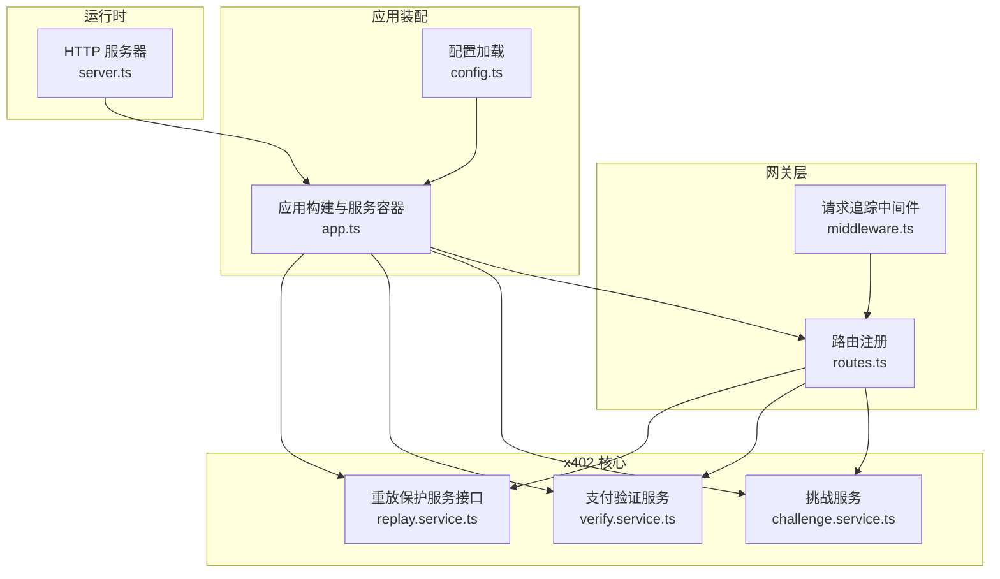
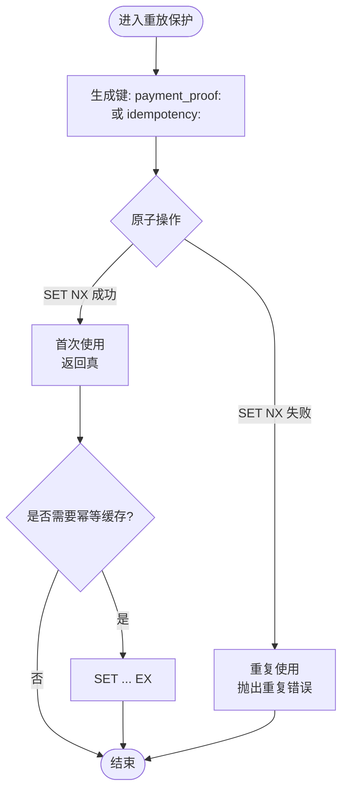
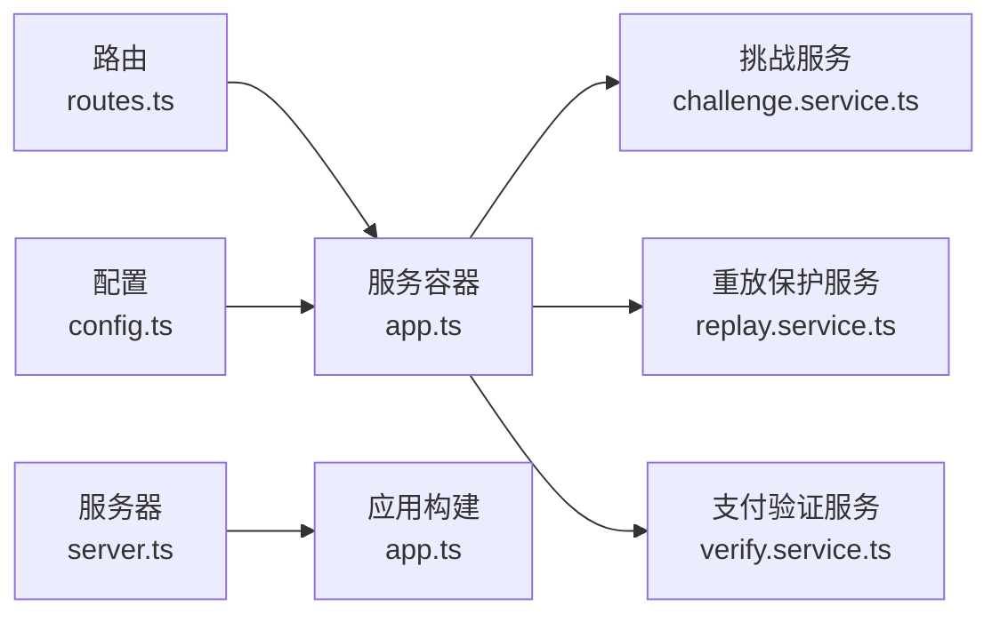

# 重放保护扩展

<cite>
**本文引用的文件**
- [replay.service.ts](file://src/x402/replay.service.ts)
- [types.ts](file://src/x402/types.ts)
- [challenge.service.ts](file://src/x402/challenge.service.ts)
- [verify.service.ts](file://src/x402/verify.service.ts)
- [app.ts](file://src/app.ts)
- [routes.ts](file://src/gateway/routes.ts)
- [middleware.ts](file://src/gateway/middleware.ts)
- [config.ts](file://src/config.ts)
- [errors.ts](file://src/errors.ts)
- [server.ts](file://src/server.ts)
- [types.ts](file://src/types.ts)
- [index.ts](file://src/gateway/index.ts)
- [challenge.test.ts](file://test/x402/challenge.test.ts)
</cite>

## 目录
1. [简介](#简介)
2. [项目结构](#项目结构)
3. [核心组件](#核心组件)
4. [架构总览](#架构总览)
5. [详细组件分析](#详细组件分析)
6. [依赖分析](#依赖分析)
7. [性能考虑](#性能考虑)
8. [故障排查指南](#故障排查指南)
9. [结论](#结论)
10. [附录](#附录)

## 简介
本指南面向需要为 x402 Gateway 扩展“重放保护”的开发者，目标是基于现有接口设计与实现约束，提供从接口实现到集成测试的完整流程，并讨论不同存储后端的选择、分布式部署下的注意事项、内存管理与清理策略、安全审计与异常处理机制。

## 项目结构
围绕重放保护的关键模块与文件如下：
- 接口与实现：IReplayProtectionService 定义于 replay.service.ts，当前实现占位，等待接入 Redis。
- 类型定义：PaymentProof、ChallengePayload、VerificationResult 等在 types.ts 中定义，用于重放保护与支付验证的数据模型。
- 路由与中间件：routes.ts 中定义了 /v1/chat/completions 的处理流程；middleware.ts 提供请求追踪 ID 注入。
- 应用装配：app.ts 将服务容器注入路由处理器；server.ts 启动服务。
- 配置与错误：config.ts 提供 Redis/数据库等外部依赖配置；errors.ts 定义了 PaymentReplayedError 等业务错误类型。

图表来源
- [routes.ts:1-96](file://src/gateway/routes.ts#L1-L96)
- [middleware.ts:1-13](file://src/gateway/middleware.ts#L1-L13)
- [challenge.service.ts:1-71](file://src/x402/challenge.service.ts#L1-L71)
- [verify.service.ts:1-34](file://src/x402/verify.service.ts#L1-L34)
- [replay.service.ts:1-52](file://src/x402/replay.service.ts#L1-L52)
- [app.ts:1-101](file://src/app.ts#L1-L101)
- [config.ts:1-46](file://src/config.ts#L1-L46)
- [server.ts:1-33](file://src/server.ts#L1-L33)

章节来源
- [routes.ts:1-96](file://src/gateway/routes.ts#L1-L96)
- [app.ts:1-101](file://src/app.ts#L1-L101)
- [config.ts:1-46](file://src/config.ts#L1-L46)
- [server.ts:1-33](file://src/server.ts#L1-L33)

## 核心组件
- IReplayProtectionService 接口
  - checkAndMark(paymentProofHash, ttlSeconds): 原子性检查并标记支付证明哈希是否重复使用，若重复则抛出 PaymentReplayedError。
  - checkIdempotency(idempotencyKey): 检索幂等性缓存响应。
  - saveIdempotency(idempotencyKey, response, ttlSeconds): 保存幂等性响应缓存。
- 类型与数据模型
  - PaymentProof：链上支付证明，包含 tx_hash、chain、payer_address。
  - ChallengePayload：挑战载荷，包含 quote_id、request_hash、amount、asset、chain、merchant_address、expires_at。
  - VerificationResult：支付验证结果，包含 verified、payer_address、amount。
- 错误类型
  - PaymentReplayedError：409 冲突，表示支付证明已被使用。

章节来源
- [replay.service.ts:3-21](file://src/x402/replay.service.ts#L3-L21)
- [types.ts:13-36](file://src/x402/types.ts#L13-L36)
- [errors.ts:52-57](file://src/errors.ts#L52-L57)

## 架构总览
重放保护在支付流程中的位置如下：
- 客户端首次访问：未携带 X-402-* 头部，返回 402 并附带挑战信息。
- 客户端二次访问：携带挑战令牌与支付证明，服务端先校验挑战，再通过重放保护检查支付证明是否已使用，最后执行支付验证与上游路由。

```mermaid
sequenceDiagram
participant C as "客户端"
participant G as "网关路由<br/>routes.ts"
participant CS as "挑战服务<br/>challenge.service.ts"
participant RP as "重放保护服务<br/>replay.service.ts"
participant VS as "支付验证服务<br/>verify.service.ts"
C->>G : "POST /v1/chat/completions"
alt "无 X-402 头部"
G->>CS : "生成挑战"
CS-->>G : "返回挑战载荷"
G-->>C : "402 + 支付要求"
else "有 X-402 头部"
G->>CS : "验证挑战令牌"
CS-->>G : "挑战载荷"
G->>RP : "checkAndMark(paymentProofHash)"
RP-->>G : "标记成功或抛出重复错误"
G->>VS : "verifyPayment(proof, challenge)"
VS-->>G : "验证结果"
G-->>C : "完成请求并返回响应"
end
```

图表来源
- [routes.ts:23-67](file://src/gateway/routes.ts#L23-L67)
- [challenge.service.ts:4-26](file://src/x402/challenge.service.ts#L4-L26)
- [replay.service.ts:23-51](file://src/x402/replay.service.ts#L23-L51)
- [verify.service.ts:3-16](file://src/x402/verify.service.ts#L3-L16)

## 详细组件分析

### IReplayProtectionService 接口设计原理
- 原子性检查与标记
  - 使用原子操作（如 Redis SET NX EX）对 payment_proof:<hash> 进行“存在即失败”的写入，从而避免竞态条件导致的重复消费。
  - 若 SET 成功，表示首次使用，返回“新鲜”标记；若失败，表示已存在，抛出 PaymentReplayedError。
- 幂等性缓存
  - 使用 idempotency:<key> 作为键，存储幂等性响应，支持 TTL 控制过期。
  - checkIdempotency 返回已缓存的响应或空值；saveIdempotency 写入 JSON 响应并设置 TTL。
- 设计要点
  - 键空间隔离：payment_proof:<hash> 与 idempotency:<key> 分离，避免相互影响。
  - TTL 策略：根据挑战有效期与业务需求设定合理的过期时间，平衡安全性与可用性。
  - 异常语义：重复使用必须明确报错，便于客户端区分“未支付”与“已支付但被拒绝”。

章节来源
- [replay.service.ts:3-21](file://src/x402/replay.service.ts#L3-L21)

### 请求哈希生成与绑定
- request_hash 的生成
  - 对请求体进行规范化 JSON 序列化（键排序），再计算 SHA-256，最终以特定前缀标识，确保挑战与具体请求体绑定。
- 挑战令牌与过期控制
  - 挑战令牌包含 quote_id、request_hash、amount、asset、chain、merchant_address、expires_at，并使用密钥签名。
  - verifyChallenge 校验签名、过期时间以及 request_hash 一致性，不一致时抛出相应错误。

章节来源
- [challenge.service.ts:4-26](file://src/x402/challenge.service.ts#L4-L26)
- [challenge.service.ts:28-70](file://src/x402/challenge.service.ts#L28-L70)
- [types.ts:1-10](file://src/x402/types.ts#L1-L10)

### 存储机制与检测算法
- Redis 实现建议
  - 哈希去重：SET payment_proof:<hash> NX EX <ttl>，成功返回真，失败抛出重复错误。
  - 幂等缓存：SET idempotency:<key> <JSON> EX <ttl>，GET 获取缓存响应。
- 数据库实现建议
  - 使用唯一索引约束 payment_proof.hash，INSERT ... ON CONFLICT DO NOTHING 实现原子插入。
  - 幂等记录表包含 idempotency_key、response、expire_at，查询时按当前时间过滤过期。
- 检测算法流程
  - 输入：paymentProofHash、idempotencyKey、TTL。
  - 步骤：原子插入/更新哈希记录；若失败则抛出重复错误；同时可选读取/写入幂等缓存。
  - 输出：布尔值（是否首次使用）与可选缓存响应。

图表来源
- [replay.service.ts:23-51](file://src/x402/replay.service.ts#L23-L51)

### 自定义重放保护服务开发流程
- 第一步：实现接口
  - 在 createReplayProtectionService 中完成 checkAndMark、checkIdempotency、saveIdempotency 的具体逻辑。
  - 参考接口注释与错误类型，确保行为与预期一致。
- 第二步：接入依赖
  - 在 app.ts 中实例化 Redis 或数据库连接，并将其注入到 replayService。
  - 更新服务容器，确保路由处理器能访问到新的实现。
- 第三步：集成测试
  - 编写单元测试：模拟重复提交、过期场景、幂等缓存命中/未命中。
  - 编写集成测试：通过 HTTP 调用触发完整流程，验证 402、409、正常响应的组合行为。
- 第四步：性能与稳定性验证
  - 压测不同并发下的延迟与错误率，评估 TTL 设置与键空间规模。
  - 观察资源占用与 GC 行为，必要时引入连接池与批量清理策略。

章节来源
- [replay.service.ts:23-51](file://src/x402/replay.service.ts#L23-L51)
- [app.ts:72-94](file://src/app.ts#L72-L94)
- [challenge.test.ts:1-28](file://test/x402/challenge.test.ts#L1-L28)

### 分布式环境下的重放保护
- 统一存储后端
  - Redis：天然支持原子操作与 TTL，适合高并发场景；注意主从同步与持久化策略。
  - 数据库：强一致性强，适合审计与回溯；需关注写入冲突与索引性能。
- 内存管理与清理策略
  - TTL：为 payment_proof 与 idempotency 记录设置合理过期时间，避免无限增长。
  - 清理任务：定期扫描过期键并删除；或利用 Redis 自带的过期淘汰策略。
  - 连接池：限制最大连接数，避免内存泄漏；在优雅停机时关闭连接。
- 一致性与容错
  - 幂等缓存：在多副本环境下，确保同一 idempotencyKey 的读写在同一节点或具备最终一致的缓存层。
  - 故障恢复：当存储后端不可用时，应快速失败并返回统一错误，避免脏状态。

章节来源
- [config.ts:10-11](file://src/config.ts#L10-L11)
- [app.ts:72-94](file://src/app.ts#L72-L94)
- [server.ts:16-25](file://src/server.ts#L16-L25)

### 安全审计与异常处理
- 安全审计
  - 记录关键事件：挑战生成、挑战验证、支付证明核验、重放检测、幂等缓存命中/未命中。
  - 关联追踪：结合请求追踪 ID，串联从网关到上游的完整链路。
  - 日志分级：区分 info/warn/error/fatal，避免敏感信息泄露。
- 异常处理
  - 明确错误码：PaymentReplayedError 对应 409，确保客户端正确处理。
  - 全局错误处理器：在 app.ts 中统一转换 AppError 为 API 响应格式。
  - 上游错误映射：将超时/不可用等上游错误映射为 504/503，便于客户端退避重试。

章节来源
- [errors.ts:52-57](file://src/errors.ts#L52-L57)
- [errors.ts:92-105](file://src/errors.ts#L92-L105)
- [app.ts:52-70](file://src/app.ts#L52-L70)

## 依赖分析
- 组件耦合
  - 路由层仅负责参数解析与调用服务，保持薄处理逻辑，降低复杂度。
  - 服务容器集中管理各领域服务，便于替换与测试。
- 外部依赖
  - Redis/数据库：重放保护与幂等缓存的持久化后端。
  - 配置系统：集中管理端口、日志级别、挑战密钥与 TTL 等参数。
- 潜在循环依赖
  - 当前结构清晰，无直接循环导入；通过服务容器解耦。

图表来源
- [routes.ts:1-96](file://src/gateway/routes.ts#L1-L96)
- [app.ts:21-33](file://src/app.ts#L21-L33)
- [challenge.service.ts:1-71](file://src/x402/challenge.service.ts#L1-L71)
- [replay.service.ts:1-52](file://src/x402/replay.service.ts#L1-L52)
- [verify.service.ts:1-34](file://src/x402/verify.service.ts#L1-L34)
- [config.ts:1-46](file://src/config.ts#L1-L46)
- [server.ts:1-33](file://src/server.ts#L1-L33)

章节来源
- [routes.ts:1-96](file://src/gateway/routes.ts#L1-L96)
- [app.ts:21-33](file://src/app.ts#L21-L33)
- [config.ts:1-46](file://src/config.ts#L1-L46)

## 性能考虑
- Redis 优势
  - 原子操作与 TTL，低延迟；适合高频重放检测与幂等缓存。
  - 注意热点键与过期风暴，可通过分片键名或随机 TTL 偏移缓解。
- 数据库优势
  - 更强的一致性与审计能力；适合长期保留与合规需求。
  - 需要优化唯一索引与查询计划，避免写放大。
- 缓存策略
  - LRU/LFU：结合业务特征选择合适淘汰策略。
  - 预热：对热点 idempotencyKey 预先写入缓存，降低冷启动延迟。
- 并发与锁
  - 避免在应用层做分布式锁；优先使用存储层原子操作。
  - 合理设置超时与重试，防止级联阻塞。

## 故障排查指南
- 常见问题
  - 409 重复使用：确认 payment_proof:<hash> 是否已存在；检查 TTL 是否过短。
  - 幂等缓存未命中：确认 idempotency:<key> 是否正确生成与过期；检查序列化/反序列化。
  - 挑战过期：检查 challengeTtlSeconds 与系统时间；确认签名密钥一致。
- 排查步骤
  - 查看全局错误处理器输出，定位具体错误类型。
  - 结合请求追踪 ID，串联审计日志，复盘从网关到上游的调用链。
  - 在测试环境中构造相同输入，复现问题并验证修复。
- 监控指标
  - 重放检测命中率、缓存命中率、存储写入延迟、错误分布。
  - 延迟分位数与 P99，识别异常波动。

章节来源
- [errors.ts:52-57](file://src/errors.ts#L52-L57)
- [app.ts:52-70](file://src/app.ts#L52-L70)
- [config.ts:13-14](file://src/config.ts#L13-L14)

## 结论
通过 IReplayProtectionService 的原子性检查与幂等缓存能力，x402 Gateway 能够在保证安全性的同时提升用户体验。推荐优先采用 Redis 作为默认存储后端，并结合合理的 TTL 与清理策略；在需要强一致与审计的场景下，可选用数据库方案。完善的异常处理与审计日志体系，是保障系统安全与可靠性的关键。

## 附录
- 开发清单
  - 实现 checkAndMark/checkIdempotency/saveIdempotency。
  - 在 app.ts 中注入 Redis/数据库连接。
  - 编写单元与集成测试覆盖重复使用、过期、幂等缓存等场景。
  - 配置 TTL、监控指标与告警规则。
- 参考路径
  - [接口定义与实现模板:3-51](file://src/x402/replay.service.ts#L3-L51)
  - [挑战与验证服务接口:4-70](file://src/x402/challenge.service.ts#L4-L70)
  - [支付验证服务接口:3-33](file://src/x402/verify.service.ts#L3-L33)
  - [应用装配与服务容器:72-94](file://src/app.ts#L72-L94)
  - [路由与支付流程:23-67](file://src/gateway/routes.ts#L23-L67)
  - [配置与环境变量:10-14](file://src/config.ts#L10-L14)
  - [错误类型与全局处理:52-105](file://src/errors.ts#L52-L105)
  - [请求追踪中间件:9-12](file://src/gateway/middleware.ts#L9-L12)
  - [服务器启动与优雅停机:16-25](file://src/server.ts#L16-L25)