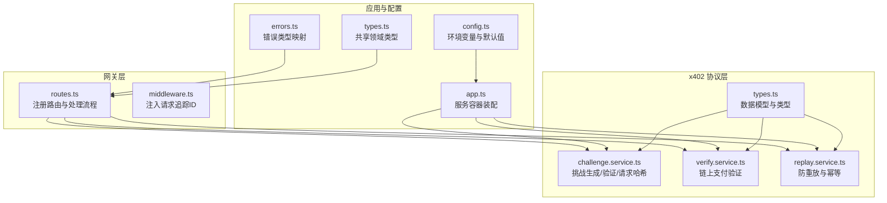
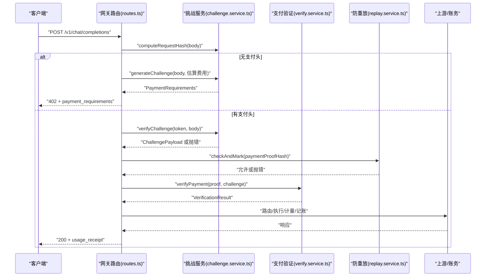
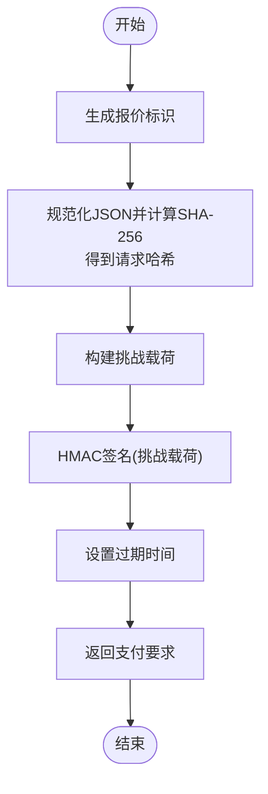
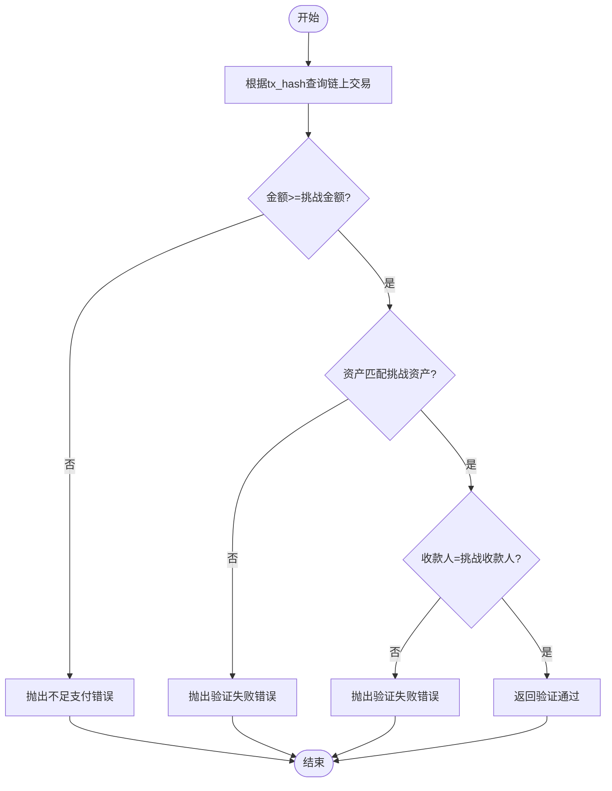
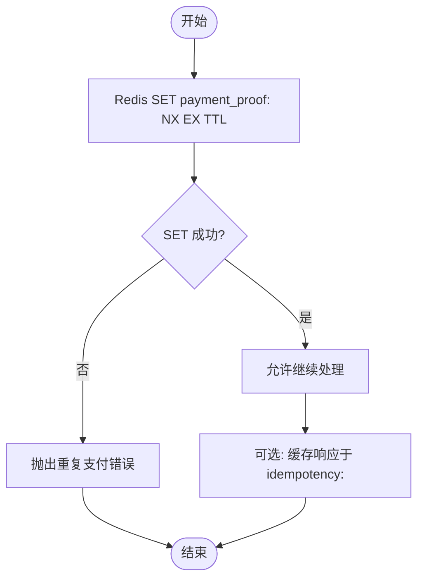
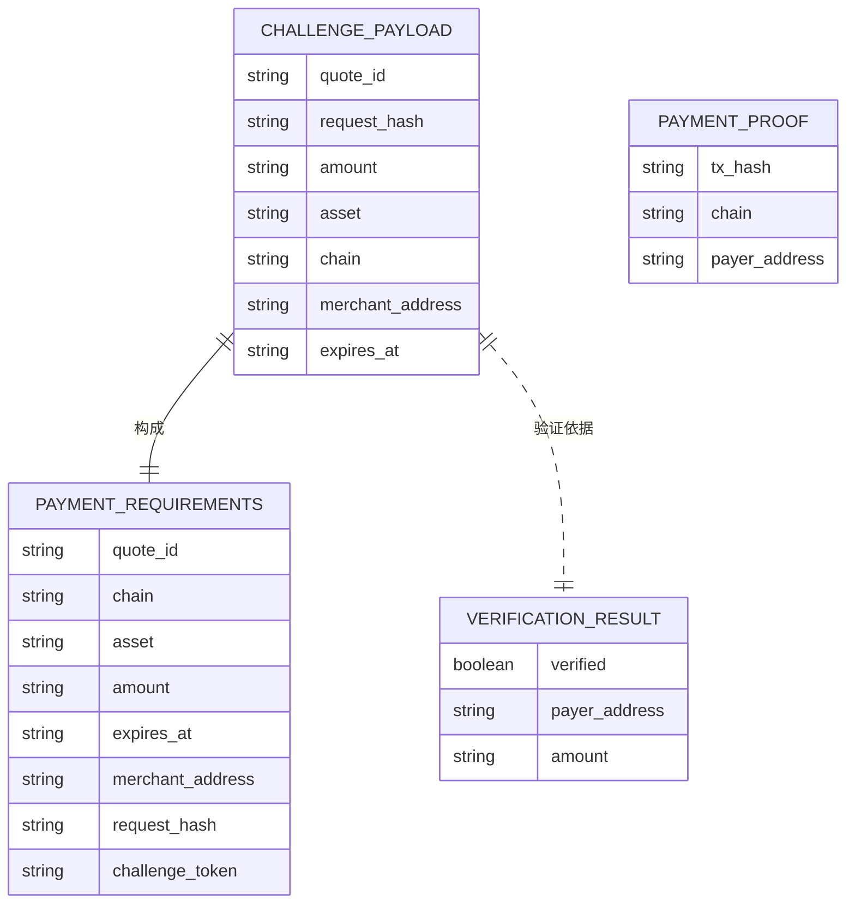
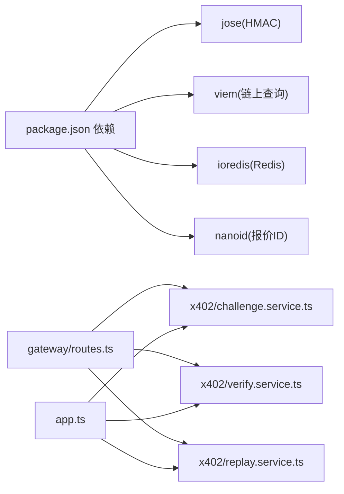

# x402 支付协议

<cite>
**本文引用的文件**
- [src/x402/challenge.service.ts](file://src/x402/challenge.service.ts)
- [src/x402/verify.service.ts](file://src/x402/verify.service.ts)
- [src/x402/replay.service.ts](file://src/x402/replay.service.ts)
- [src/x402/types.ts](file://src/x402/types.ts)
- [src/gateway/routes.ts](file://src/gateway/routes.ts)
- [src/app.ts](file://src/app.ts)
- [src/config.ts](file://src/config.ts)
- [src/errors.ts](file://src/errors.ts)
- [src/types.ts](file://src/types.ts)
- [docs/api-spec-v0-x402-gateway.md](file://docs/api-spec-v0-x402-gateway.md)
- [test/x402/challenge.test.ts](file://test/x402/challenge.test.ts)
- [test/integration/flow.test.ts](file://test/integration/flow.test.ts)
- [package.json](file://package.json)
</cite>

## 目录
1. [简介](#简介)
2. [项目结构](#项目结构)
3. [核心组件](#核心组件)
4. [架构总览](#架构总览)
5. [详细组件分析](#详细组件分析)
6. [依赖关系分析](#依赖关系分析)
7. [性能考量](#性能考量)
8. [故障排查指南](#故障排查指南)
9. [结论](#结论)
10. [附录](#附录)

## 简介
本文件为 x402 支付协议的安全与实现文档，聚焦于 402 状态码的“挑战-响应”授权机制，覆盖以下关键点：
- 挑战生成：报价标识、请求哈希绑定、HMAC 签名、过期时间 TTL 控制
- 验证流程：签名校验、过期检查、请求哈希一致性校验
- 请求哈希计算：确定性 JSON 规范化与哈希绑定，防止重放与篡改
- 支付证明验证：链上交易查询、金额/资产/收款人匹配
- 防重放保护：基于 Redis 的幂等键缓存与支付证明去重
- 协议安全分析、威胁模型与攻击向量防护
- 具体实现示例路径（以源码路径标注代替代码片段）

该协议遵循 OpenAI 兼容的聊天补全接口，通过额外头部与 402 响应实现按请求付费，不涉及传统 API Key 认证。

## 项目结构
x402 协议相关模块位于 src/x402 下，配合网关路由、服务容器与配置加载，形成从请求到支付验证再到上游路由与账务结算的闭环。

**图表来源**
- [src/gateway/routes.ts:1-96](file://src/gateway/routes.ts#L1-L96)
- [src/x402/challenge.service.ts:1-71](file://src/x402/challenge.service.ts#L1-L71)
- [src/x402/verify.service.ts:1-34](file://src/x402/verify.service.ts#L1-L34)
- [src/x402/replay.service.ts:1-52](file://src/x402/replay.service.ts#L1-L52)
- [src/x402/types.ts:1-37](file://src/x402/types.ts#L1-L37)
- [src/app.ts:35-101](file://src/app.ts#L35-L101)
- [src/config.ts:28-46](file://src/config.ts#L28-L46)
- [src/errors.ts:1-106](file://src/errors.ts#L1-L106)
- [src/types.ts:1-119](file://src/types.ts#L1-L119)

**章节来源**
- [src/gateway/routes.ts:1-96](file://src/gateway/routes.ts#L1-L96)
- [src/app.ts:35-101](file://src/app.ts#L35-L101)
- [src/config.ts:28-46](file://src/config.ts#L28-L46)

## 核心组件
- 挑战服务：负责生成挑战（含报价、请求哈希、签名、过期时间）与验证挑战（签名、过期、请求哈希一致性）
- 支付验证服务：基于链上交易哈希查询并校验金额、资产与收款人
- 防重放服务：使用 Redis 对支付证明进行原子去重与幂等键缓存
- 类型定义：挑战载荷、支付证明、支付要求、验证结果等
- 错误体系：统一映射到 API 规范中的错误码与状态码

**章节来源**
- [src/x402/challenge.service.ts:4-26](file://src/x402/challenge.service.ts#L4-L26)
- [src/x402/verify.service.ts:3-16](file://src/x402/verify.service.ts#L3-L16)
- [src/x402/replay.service.ts:3-21](file://src/x402/replay.service.ts#L3-L21)
- [src/x402/types.ts:1-37](file://src/x402/types.ts#L1-L37)
- [src/errors.ts:6-106](file://src/errors.ts#L6-L106)

## 架构总览
下图展示了从客户端发起请求到完成支付验证与上游路由的端到端流程，以及各组件间的交互关系。

**图表来源**
- [src/gateway/routes.ts:23-67](file://src/gateway/routes.ts#L23-L67)
- [src/x402/challenge.service.ts:12-25](file://src/x402/challenge.service.ts#L12-L25)
- [src/x402/verify.service.ts:15-16](file://src/x402/verify.service.ts#L15-L16)
- [src/x402/replay.service.ts:9-21](file://src/x402/replay.service.ts#L9-L21)

## 详细组件分析

### 挑战生成与验证（HMAC 签名、过期控制、请求哈希绑定）
- 挑战生成职责
  - 生成报价标识
  - 基于请求体计算确定性请求哈希（规范化 JSON + 哈希）
  - 使用密钥对挑战载荷进行 HMAC 签名（jose 库）
  - 设置过期时间（TTL 秒）
  - 返回支付要求对象（含链、资产、金额、收款人、请求哈希、挑战令牌）
- 挑战验证职责
  - 验证签名有效性
  - 检查未过期
  - 重新计算请求哈希并与挑战载荷中的请求哈希比对
  - 任一失败抛出对应错误（过期、请求哈希不匹配）
- 请求哈希计算
  - 使用规范化的 JSON 序列化（键排序）
  - 计算 SHA-256 并返回带前缀的十六进制字符串
- 安全要点
  - 挑战令牌短命且由强密钥签名，防止泄露后滥用
  - 请求哈希绑定确保挑战与具体请求体一一对应，阻止重放与篡改
  - 过期时间避免长期有效的挑战令牌被截获利用

**图表来源**
- [src/x402/challenge.service.ts:36-47](file://src/x402/challenge.service.ts#L36-L47)
- [src/x402/challenge.service.ts:62-68](file://src/x402/challenge.service.ts#L62-L68)

**章节来源**
- [src/x402/challenge.service.ts:4-26](file://src/x402/challenge.service.ts#L4-L26)
- [src/x402/types.ts:1-37](file://src/x402/types.ts#L1-L37)
- [src/config.ts:13-18](file://src/config.ts#L13-L18)

### 支付证明链上验证
- 输入：支付证明（链哈希、链、付款人地址）、挑战载荷
- 校验项
  - 金额大于等于挑战金额
  - 资产匹配挑战资产
  - 收款人匹配挑战收款人
- 输出：验证结果（是否通过、付款人、金额）
- 实现依赖：viem 进行链上查询

**图表来源**
- [src/x402/verify.service.ts:20-31](file://src/x402/verify.service.ts#L20-L31)
- [src/x402/types.ts:12-17](file://src/x402/types.ts#L12-L17)

**章节来源**
- [src/x402/verify.service.ts:3-16](file://src/x402/verify.service.ts#L3-L16)
- [src/x402/types.ts:12-17](file://src/x402/types.ts#L12-L17)

### 防重放与幂等性
- 去重检查
  - 使用 Redis SET key NX EX 原子检查并标记支付证明哈希
  - 若已存在则抛出重复支付错误
- 幂等性
  - 使用幂等键在 Redis 中缓存响应，避免重复执行带来的副作用

**图表来源**
- [src/x402/replay.service.ts:25-33](file://src/x402/replay.service.ts#L25-L33)
- [src/x402/replay.service.ts:36-49](file://src/x402/replay.service.ts#L36-L49)

**章节来源**
- [src/x402/replay.service.ts:3-21](file://src/x402/replay.service.ts#L3-L21)

### 数据模型与类型
- 挑战载荷：包含报价、请求哈希、金额、资产、链、收款人、过期时间
- 支付证明：链哈希、链、付款人地址
- 支付要求：与挑战载荷一致，外加挑战令牌
- 验证结果：是否通过、付款人、金额

**图表来源**
- [src/x402/types.ts:1-37](file://src/x402/types.ts#L1-L37)

**章节来源**
- [src/x402/types.ts:1-37](file://src/x402/types.ts#L1-L37)

### 协议安全性分析、威胁模型与防护
- 威胁模型
  - 挑战令牌泄露：通过短 TTL 与强密钥签名降低风险
  - 请求体篡改：请求哈希绑定使篡改无法通过验证
  - 重放攻击：支付证明去重与幂等键共同防护
  - 不足支付：链上严格校验金额、资产与收款人
- 攻击向量与防护
  - 中间人窃听挑战令牌：HMAC 签名与过期控制缓解
  - 回放挑战：请求哈希绑定与 Redis 去重
  - 伪造支付证明：viem 查询链上交易并严格匹配
  - 幂等性破坏：幂等键缓存与原子标记

**章节来源**
- [docs/api-spec-v0-x402-gateway.md:177-184](file://docs/api-spec-v0-x402-gateway.md#L177-L184)
- [src/x402/challenge.service.ts:4-26](file://src/x402/challenge.service.ts#L4-L26)
- [src/x402/replay.service.ts:3-21](file://src/x402/replay.service.ts#L3-L21)
- [src/x402/verify.service.ts:3-16](file://src/x402/verify.service.ts#L3-L16)

### 具体实现示例（代码路径）
- 挑战生成接口与实现占位
  - 接口定义：[src/x402/challenge.service.ts:12-12](file://src/x402/challenge.service.ts#L12-L12)
  - 实现占位与步骤注释：[src/x402/challenge.service.ts:36-47](file://src/x402/challenge.service.ts#L36-L47)
- 挑战验证接口与实现占位
  - 接口定义：[src/x402/challenge.service.ts:19-19](file://src/x402/challenge.service.ts#L19-L19)
  - 实现占位与步骤注释：[src/x402/challenge.service.ts:49-60](file://src/x402/challenge.service.ts#L49-L60)
- 请求哈希计算接口与实现占位
  - 接口定义：[src/x402/challenge.service.ts:25-25](file://src/x402/challenge.service.ts#L25-L25)
  - 实现占位与步骤注释：[src/x402/challenge.service.ts:62-68](file://src/x402/challenge.service.ts#L62-L68)
- 支付验证接口与实现占位
  - 接口定义：[src/x402/verify.service.ts:15-15](file://src/x402/verify.service.ts#L15-L15)
  - 实现占位与步骤注释：[src/x402/verify.service.ts:20-31](file://src/x402/verify.service.ts#L20-L31)
- 防重放接口与实现占位
  - 接口定义：[src/x402/replay.service.ts:9-9](file://src/x402/replay.service.ts#L9-L9)
  - 实现占位与步骤注释：[src/x402/replay.service.ts:25-33](file://src/x402/replay.service.ts#L25-L33)
- 网关路由中的挑战-支付流程
  - 402 挑战返回与支付头处理：[src/gateway/routes.ts:23-67](file://src/gateway/routes.ts#L23-L67)
- 服务容器装配与依赖注入
  - 挑战服务、验证服务、防重放服务装配：[src/app.ts:77-94](file://src/app.ts#L77-L94)
- 配置加载与密钥要求
  - 挑战密钥最小长度与 TTL 默认值：[src/config.ts:13-18](file://src/config.ts#L13-L18)
- 错误类型映射
  - 402/400/409/500 等错误类与状态码映射：[src/errors.ts:17-106](file://src/errors.ts#L17-L106)

**章节来源**
- [src/x402/challenge.service.ts:12-68](file://src/x402/challenge.service.ts#L12-L68)
- [src/x402/verify.service.ts:15-31](file://src/x402/verify.service.ts#L15-L31)
- [src/x402/replay.service.ts:9-33](file://src/x402/replay.service.ts#L9-L33)
- [src/gateway/routes.ts:23-67](file://src/gateway/routes.ts#L23-L67)
- [src/app.ts:77-94](file://src/app.ts#L77-L94)
- [src/config.ts:13-18](file://src/config.ts#L13-L18)
- [src/errors.ts:17-106](file://src/errors.ts#L17-L106)

## 依赖关系分析
- 外部依赖
  - jose：HMAC 签名与验证
  - viem：链上交易查询
  - ioredis：Redis 原子操作与缓存
  - nanoid：生成报价标识
- 内部依赖
  - 网关路由依赖挑战/验证/防重放服务
  - 服务容器集中装配各服务实例
  - 错误类型统一映射到 API 响应

**图表来源**
- [package.json:21-36](file://package.json#L21-L36)
- [src/gateway/routes.ts:1-96](file://src/gateway/routes.ts#L1-L96)
- [src/app.ts:77-94](file://src/app.ts#L77-L94)

**章节来源**
- [package.json:21-36](file://package.json#L21-L36)
- [src/gateway/routes.ts:1-96](file://src/gateway/routes.ts#L1-L96)
- [src/app.ts:77-94](file://src/app.ts#L77-L94)

## 性能考量
- 挑战生成与验证
  - 请求哈希计算为 CPU 密集型（JSON 规范化 + 哈希），建议在高并发场景下缓存热点请求的哈希
- 链上查询
  - viem 查询可能受网络延迟影响，建议增加超时与重试策略
- Redis 去重
  - 原子 SET NX EX 操作具备良好性能；合理设置 TTL 与键空间命名避免冲突
- 路由与记账
  - 将上游调用与账务写入拆分为异步任务，减少主流程阻塞

## 故障排查指南
- 常见错误与定位
  - 402 支付必需：确认首次请求未携带支付头
  - 挑战过期：检查挑战过期时间与服务器时间同步
  - 请求哈希不匹配：核对请求体是否被修改或序列化差异
  - 支付验证失败：检查链哈希、金额、资产、收款人是否与挑战一致
  - 重复支付：确认 Redis 去重键是否正确设置
- 测试用例参考
  - 挑战服务接口存在性与占位行为：[test/x402/challenge.test.ts:13-26](file://test/x402/challenge.test.ts#L13-L26)
  - 集成测试：402 响应与模型列表接口：[test/integration/flow.test.ts:20-37](file://test/integration/flow.test.ts#L20-L37)

**章节来源**
- [src/errors.ts:17-106](file://src/errors.ts#L17-L106)
- [test/x402/challenge.test.ts:13-26](file://test/x402/challenge.test.ts#L13-L26)
- [test/integration/flow.test.ts:20-37](file://test/integration/flow.test.ts#L20-L37)

## 结论
x402 协议通过“挑战-响应”机制与链上支付验证，实现了对每次请求的即时计费与透明结算。其核心安全基石在于：
- 挑战令牌的 HMAC 签名与 TTL 控制
- 请求哈希绑定，确保挑战与请求体不可分割
- 链上严格校验与 Redis 原子去重，抵御重放与不足支付
- 统一错误映射与幂等键保障一致性与可恢复性

随着实现逐步完善（挑战生成/验证、链上查询、Redis 初始化），系统将具备生产级的安全性与可靠性。

## 附录
- API 规范概览与安全规则：[docs/api-spec-v0-x402-gateway.md:1-198](file://docs/api-spec-v0-x402-gateway.md#L1-L198)
- 网关路由与处理流程：[src/gateway/routes.ts:1-96](file://src/gateway/routes.ts#L1-L96)
- 服务容器装配与依赖注入：[src/app.ts:77-94](file://src/app.ts#L77-L94)
- 配置加载与密钥要求：[src/config.ts:13-18](file://src/config.ts#L13-L18)
- 错误类型与状态码映射：[src/errors.ts:17-106](file://src/errors.ts#L17-L106)