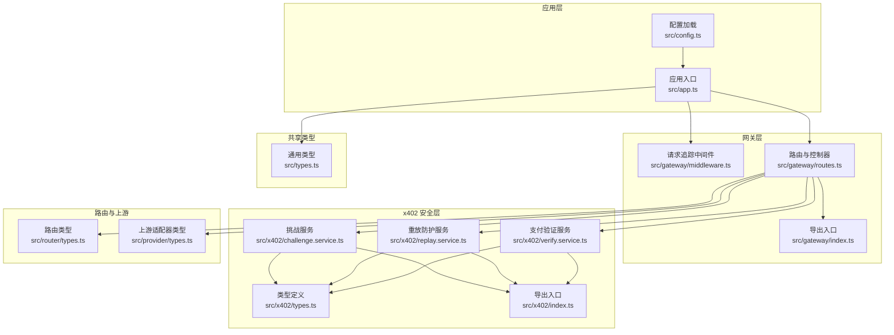
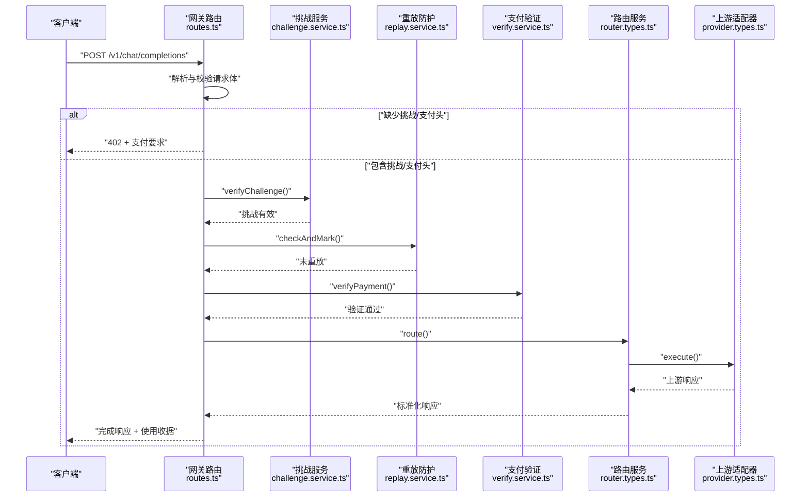
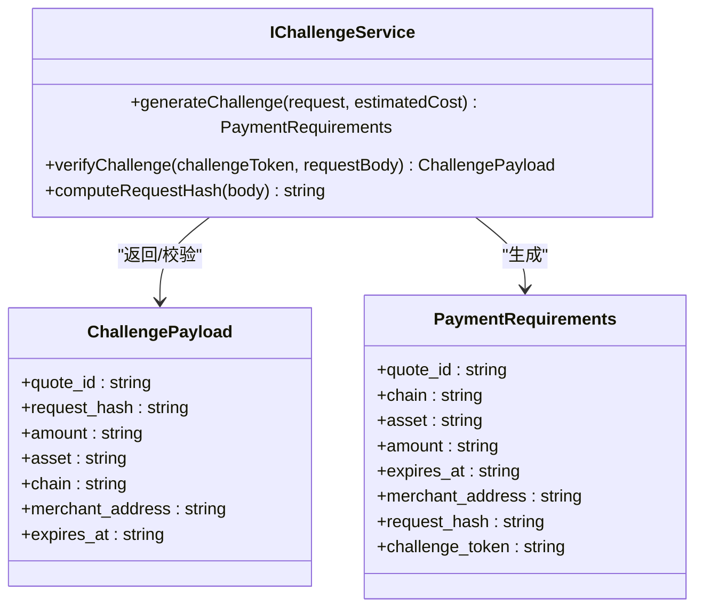
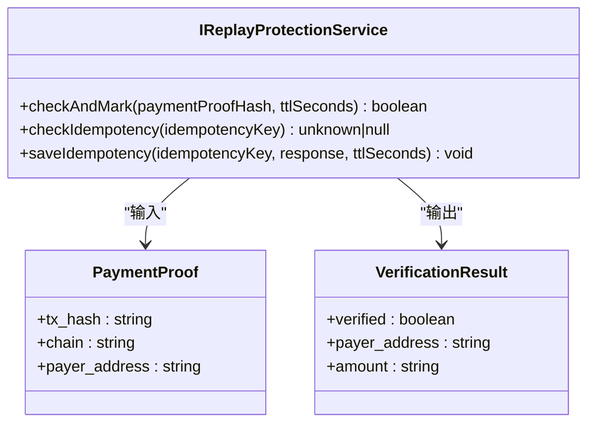
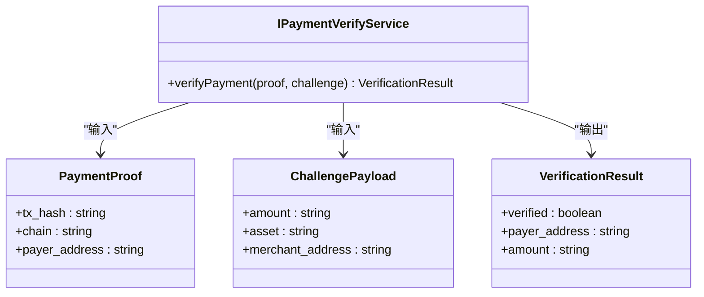
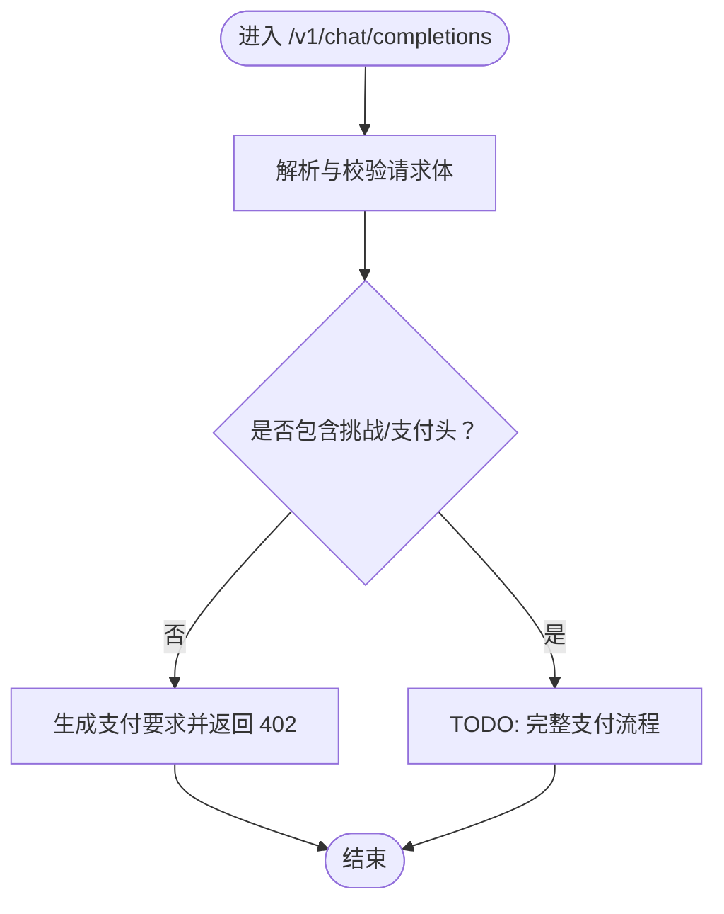
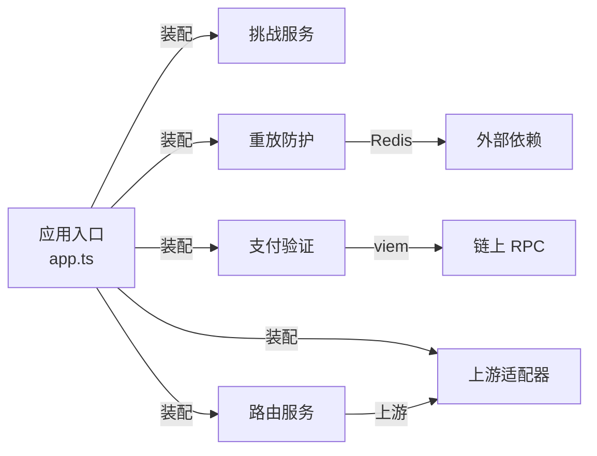

# 威胁建模与风险评估

<cite>
**本文引用的文件**
- [src/app.ts](file://src/app.ts)
- [src/config.ts](file://src/config.ts)
- [src/gateway/index.ts](file://src/gateway/index.ts)
- [src/gateway/middleware.ts](file://src/gateway/middleware.ts)
- [src/gateway/routes.ts](file://src/gateway/routes.ts)
- [src/x402/index.ts](file://src/x402/index.ts)
- [src/x402/challenge.service.ts](file://src/x402/challenge.service.ts)
- [src/x402/replay.service.ts](file://src/x402/replay.service.ts)
- [src/x402/verify.service.ts](file://src/x402/verify.service.ts)
- [src/x402/types.ts](file://src/x402/types.ts)
- [src/router/types.ts](file://src/router/types.ts)
- [src/provider/types.ts](file://src/provider/types.ts)
- [src/types.ts](file://src/types.ts)
</cite>

## 目录
1. [简介](#简介)
2. [项目结构](#项目结构)
3. [核心组件](#核心组件)
4. [架构总览](#架构总览)
5. [详细组件分析](#详细组件分析)
6. [依赖分析](#依赖分析)
7. [性能考虑](#性能考虑)
8. [故障排查指南](#故障排查指南)
9. [结论](#结论)
10. [附录](#附录)

## 简介
本文件针对 x402 Gateway 进行系统性威胁建模与风险评估，聚焦以下攻击向量：重放攻击、拒绝服务攻击（DDoS/速率限制绕过）、输入注入（请求体与头部解析）、以及链上交互风险（支付验证）。通过对代码结构、路由与中间件、挑战生成与校验、重放防护、支付验证等模块的深入分析，识别攻击路径、影响程度与现有缓解措施，并给出威胁缓解矩阵、安全边界与信任假设、依赖项风险、风险优先级排序与持续监控建议。

## 项目结构
x402 Gateway 采用分层设计：应用入口负责插件注册与全局错误处理；网关层提供 OpenAI 兼容接口与审计查询；x402 层实现挑战生成/校验、重放防护与支付验证；路由与上游适配器负责模型选择与调用；计费与审计模块记录使用与结算证据。

图表来源
- [src/app.ts:35-100](file://src/app.ts#L35-L100)
- [src/gateway/routes.ts:9-96](file://src/gateway/routes.ts#L9-L96)
- [src/gateway/middleware.ts:9-12](file://src/gateway/middleware.ts#L9-L12)
- [src/x402/challenge.service.ts:34-70](file://src/x402/challenge.service.ts#L34-L70)
- [src/x402/replay.service.ts:23-51](file://src/x402/replay.service.ts#L23-L51)
- [src/x402/verify.service.ts:18-33](file://src/x402/verify.service.ts#L18-L33)
- [src/x402/types.ts:1-37](file://src/x402/types.ts#L1-L37)
- [src/router/types.ts:1-22](file://src/router/types.ts#L1-L22)
- [src/provider/types.ts:26-35](file://src/provider/types.ts#L26-L35)
- [src/types.ts:6-119](file://src/types.ts#L6-L119)

章节来源
- [src/app.ts:35-100](file://src/app.ts#L35-L100)
- [src/gateway/routes.ts:9-96](file://src/gateway/routes.ts#L9-L96)
- [src/gateway/middleware.ts:9-12](file://src/gateway/middleware.ts#L9-L12)
- [src/x402/challenge.service.ts:34-70](file://src/x402/challenge.service.ts#L34-L70)
- [src/x402/replay.service.ts:23-51](file://src/x402/replay.service.ts#L23-L51)
- [src/x402/verify.service.ts:18-33](file://src/x402/verify.service.ts#L18-L33)
- [src/x402/types.ts:1-37](file://src/x402/types.ts#L1-L37)
- [src/router/types.ts:1-22](file://src/router/types.ts#L1-L22)
- [src/provider/types.ts:26-35](file://src/provider/types.ts#L26-L35)
- [src/types.ts:6-119](file://src/types.ts#L6-L119)

## 核心组件
- 应用入口与插件：注册 CORS、安全头、速率限制、通用响应工具，并设置全局错误处理与请求追踪钩子。
- 网关路由：提供 /v1/chat/completions 的 OpenAI 兼容接口与 /v1/models、/v1/audit/requests/:request_id 查询端点；当前支付流程处于 TODO 实现阶段。
- x402 挑战服务：生成与校验挑战令牌，绑定请求哈希与过期时间，使用密钥签名。
- x402 重放防护服务：基于 Redis 的幂等键缓存与支付证明去重。
- x402 支付验证服务：通过链上 RPC 校验付款金额、资产与收款人。
- 路由与上游：抽象上游适配器接口与路由决策类型，支持手动/自动路由模式。
- 共享类型：统一请求/响应、审计、定价与路由元数据结构。

章节来源
- [src/app.ts:35-100](file://src/app.ts#L35-L100)
- [src/gateway/routes.ts:23-67](file://src/gateway/routes.ts#L23-L67)
- [src/x402/challenge.service.ts:4-26](file://src/x402/challenge.service.ts#L4-L26)
- [src/x402/replay.service.ts:3-21](file://src/x402/replay.service.ts#L3-L21)
- [src/x402/verify.service.ts:3-16](file://src/x402/verify.service.ts#L3-L16)
- [src/router/types.ts:1-22](file://src/router/types.ts#L1-L22)
- [src/provider/types.ts:26-35](file://src/provider/types.ts#L26-L35)
- [src/types.ts:6-119](file://src/types.ts#L6-L119)

## 架构总览
下图展示从客户端到上游模型的完整链路，以及 x402 支付流程的关键节点。

图表来源
- [src/gateway/routes.ts:23-67](file://src/gateway/routes.ts#L23-L67)
- [src/x402/challenge.service.ts:49-60](file://src/x402/challenge.service.ts#L49-L60)
- [src/x402/replay.service.ts:25-33](file://src/x402/replay.service.ts#L25-L33)
- [src/x402/verify.service.ts:20-31](file://src/x402/verify.service.ts#L20-L31)
- [src/router/types.ts:1-22](file://src/router/types.ts#L1-L22)
- [src/provider/types.ts:26-35](file://src/provider/types.ts#L26-L35)

## 详细组件分析

### 组件 A：挑战服务（IChallengeService）
- 职责：生成挑战（含报价单、请求哈希、签名、过期时间）与校验挑战（签名、过期、请求哈希一致性）。
- 关键数据结构：ChallengePayload、PaymentRequirements。
- 风险与缓解：
  - 请求哈希计算需确定性（键排序、规范化 JSON），避免哈希碰撞或篡改。
  - 挑战签名使用强密钥与 HMAC，防止伪造。
  - 过期时间控制在合理窗口内，防止长期有效挑战被滥用。
  - 当前实现为 TODO，尚未落地，存在签名/哈希逻辑缺失的风险。

图表来源
- [src/x402/challenge.service.ts:4-26](file://src/x402/challenge.service.ts#L4-L26)
- [src/x402/types.ts:1-37](file://src/x402/types.ts#L1-L37)

章节来源
- [src/x402/challenge.service.ts:4-26](file://src/x402/challenge.service.ts#L4-L26)
- [src/x402/types.ts:1-37](file://src/x402/types.ts#L1-L37)

### 组件 B：重放防护服务（IReplayProtectionService）
- 职责：原子性检查与标记支付证明哈希，幂等键缓存与读取。
- 关键数据结构：PaymentProof、VerificationResult。
- 风险与缓解：
  - 使用 Redis SET NX EX 原子操作确保并发安全，防止重复消费。
  - 幂等键 TTL 控制与缓存命中可降低重复请求带来的压力。
  - 当前实现为 TODO，Redis 依赖未注入，存在功能缺失与并发问题风险。

图表来源
- [src/x402/replay.service.ts:3-21](file://src/x402/replay.service.ts#L3-L21)
- [src/x402/types.ts:12-37](file://src/x402/types.ts#L12-L37)

章节来源
- [src/x402/replay.service.ts:3-21](file://src/x402/replay.service.ts#L3-L21)
- [src/x402/types.ts:12-37](file://src/x402/types.ts#L12-L37)

### 组件 C：支付验证服务（IPaymentVerifyService）
- 职责：对链上交易进行验证，核对金额、资产与收款人。
- 风险与缓解：
  - 依赖 viem 进行 EVM RPC 查询，需关注网络延迟与可用性。
  - 对金额阈值、资产匹配与收款地址进行严格校验，防止绕过。
  - 当前实现为 TODO，存在链上交互逻辑缺失与异常处理不完善的风险。

图表来源
- [src/x402/verify.service.ts:3-16](file://src/x402/verify.service.ts#L3-L16)
- [src/x402/types.ts:12-37](file://src/x402/types.ts#L12-L37)

章节来源
- [src/x402/verify.service.ts:3-16](file://src/x402/verify.service.ts#L3-L16)
- [src/x402/types.ts:12-37](file://src/x402/types.ts#L12-L37)

### 组件 D：网关路由与中间件
- 中间件：注入唯一请求追踪 ID，便于审计与排障。
- 路由：/v1/chat/completions 当前仅实现 402 返回与 TODO 流程；/v1/models 返回模型目录；/v1/audit/requests/:request_id 为审计查询预留端点。
- 风险与缓解：
  - 请求体与参数使用 Zod 校验，减少解析错误与注入风险。
  - 速率限制与安全头插件已启用，有助于缓解常见 Web 攻击。
  - 路由层保持薄逻辑，业务逻辑下沉至服务层，降低注入面。

图表来源
- [src/gateway/routes.ts:23-67](file://src/gateway/routes.ts#L23-L67)
- [src/gateway/middleware.ts:9-12](file://src/gateway/middleware.ts#L9-L12)

章节来源
- [src/gateway/routes.ts:23-67](file://src/gateway/routes.ts#L23-L67)
- [src/gateway/middleware.ts:9-12](file://src/gateway/middleware.ts#L9-L12)

## 依赖分析
- 外部依赖与集成点：
  - Redis：用于重放防护与幂等缓存（当前未注入，功能缺失）。
  - 数据库：配置中声明数据库连接（当前未初始化）。
  - 上游 LLM 适配器：抽象接口，支持多提供商扩展。
  - 链上 RPC：viem 用于 EVM 交易验证。
- 内部耦合：
  - 应用入口集中装配服务容器，路由层仅依赖服务接口，符合依赖倒置原则。
  - x402 服务之间无直接耦合，职责清晰。

图表来源
- [src/app.ts:77-94](file://src/app.ts#L77-L94)
- [src/x402/replay.service.ts:23-51](file://src/x402/replay.service.ts#L23-L51)
- [src/x402/verify.service.ts:18-33](file://src/x402/verify.service.ts#L18-L33)

章节来源
- [src/app.ts:77-94](file://src/app.ts#L77-L94)
- [src/x402/replay.service.ts:23-51](file://src/x402/replay.service.ts#L23-L51)
- [src/x402/verify.service.ts:18-33](file://src/x402/verify.service.ts#L18-L33)

## 性能考虑
- 速率限制：默认每分钟最多 100 次请求，可按环境变量调整以平衡安全与吞吐。
- 缓存与幂等：Redis 幂等缓存可显著降低重复请求开销，但需注意 TTL 与内存占用。
- 链上查询：RPC 调用可能成为瓶颈，建议引入本地缓存与批量查询策略。
- 日志与追踪：请求 ID 注入便于定位慢请求与异常，建议结合采样日志与指标监控。

## 故障排查指南
- 全局错误处理：区分业务错误与验证错误，统一响应格式，便于前端与监控系统处理。
- 审计与回溯：使用请求 ID 串联链路，结合审计记录定位问题。
- 依赖健康检查：对 Redis、数据库与上游适配器增加健康检查，快速发现依赖异常。

章节来源
- [src/app.ts:53-70](file://src/app.ts#L53-L70)
- [src/gateway/middleware.ts:9-12](file://src/gateway/middleware.ts#L9-L12)

## 结论
x402 Gateway 在架构上具备清晰的分层与职责分离，安全控制点集中在挑战、重放与支付验证环节。当前支付流程仍处于开发阶段，存在若干 TODO 实现与外部依赖未注入的问题。建议优先补齐挑战/验证逻辑与 Redis/数据库初始化，完善链上交互的超时与重试策略，并强化监控与告警体系。

## 附录

### 威胁建模与风险评估

- 威胁类别与攻击路径
  - 重放攻击
    - 攻击路径：攻击者截获有效的挑战令牌与支付证明，重复提交以免费获得服务。
    - 影响：直接导致收入损失与资源滥用。
    - 现有缓解：重放防护服务计划使用 Redis 原子 SET NX EX 去重；当前实现未落地。
  - 拒绝服务攻击（DDoS/速率限制绕过）
    - 攻击路径：大量请求压垮服务器，或通过代理/匿名网络绕过速率限制。
    - 影响：服务不可用，影响正常用户。
    - 现有缓解：启用速率限制与安全头插件；建议结合 WAF 与 IP 黑名单。
  - 输入注入与解析错误
    - 攻击路径：构造恶意请求体或头部，触发解析异常或越界访问。
    - 影响：可能导致崩溃、信息泄露或业务逻辑异常。
    - 现有缓解：Zod 校验与全局错误处理；建议增加输入长度与字符集限制。
  - 链上交互风险
    - 攻击路径：链上 RPC 不稳定、节点被限流或被攻击，导致验证失败或误判。
    - 影响：服务降级或错误计费。
    - 现有缓解：依赖 viem；建议引入超时、重试与熔断策略。

- 威胁缓解矩阵
  - 技术控制
    - Redis 原子去重与幂等缓存（待实现）
    - 速率限制与安全头（已启用）
    - Zod 参数校验与全局错误处理（已启用）
    - 链上 RPC 超时与重试（建议实现）
  - 管理控制
    - 配置最小权限与密钥轮换（挑战密钥）
    - 依赖健康检查与 SLA 约束
    - 审计与日志保留策略
  - 运营控制
    - 监控与告警（QPS、错误率、链上延迟）
    - 应急预案与回滚机制
    - 定期渗透测试与安全评审

- 安全边界、信任假设与依赖项风险
  - 安全边界
    - 客户端与网关：HTTP 接口，402 挑战与支付头为边界条件。
    - 网关与上游：通过标准化适配器接口通信，路由决策在网关侧完成。
    - 网关与链上：仅在支付验证阶段进行链上交互。
  - 信任假设
    - 挑战令牌由受信密钥签发且带过期时间。
    - Redis 与数据库可用性与安全性可控。
    - 上游适配器返回结果可被标准化处理。
  - 依赖项风险
    - Redis 未注入，重放与幂等功能缺失。
    - 数据库连接未初始化，账务与审计持久化不可用。
    - 链上 RPC 可用性与费用波动。

- 风险优先级排序（高-中-低）
  - 高：重放攻击（当前未实现去重）、链上交互不稳定。
  - 中：速率限制绕过、输入注入（需加强校验与限流）。
  - 低：审计查询未实现、部分 TODO 功能。

- 持续监控建议
  - 指标：QPS、错误率、链上 RPC 延迟与成功率、Redis 命中率。
  - 告警：异常错误率上升、链上节点不可用、Redis 连接失败。
  - 日志：请求 ID、挑战/支付头摘要、链上交易哈希、路由决策摘要。