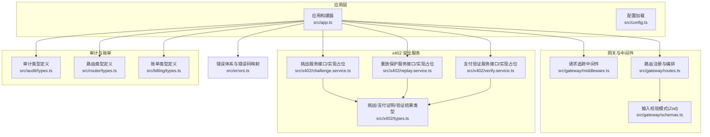
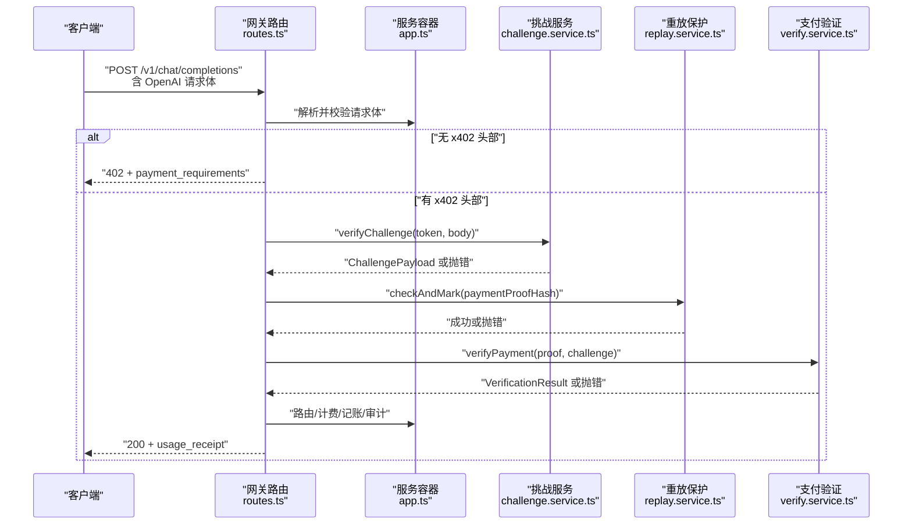
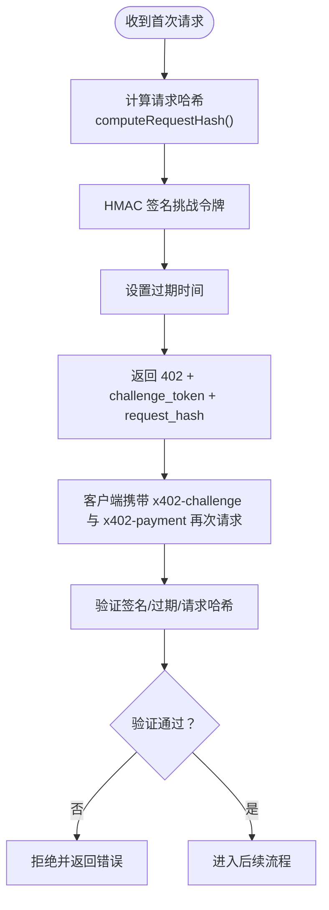
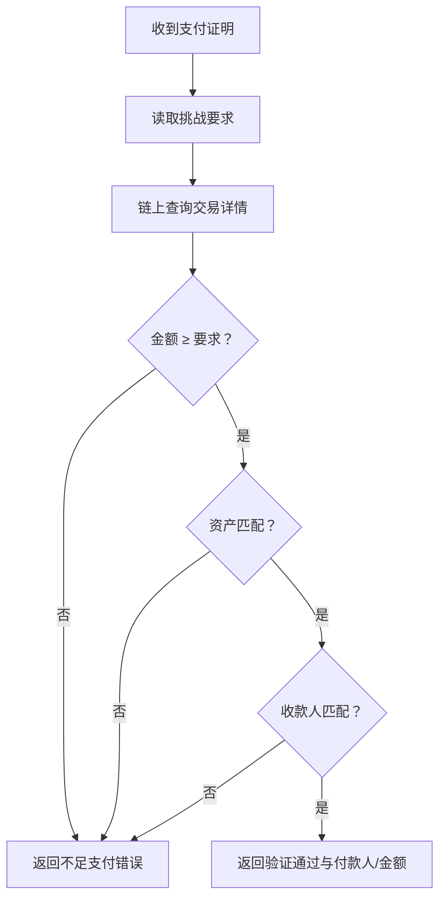
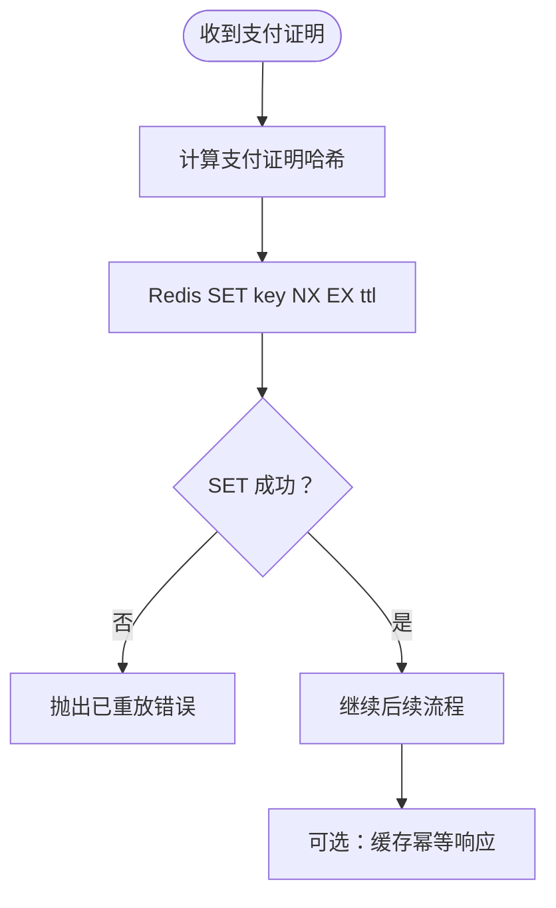
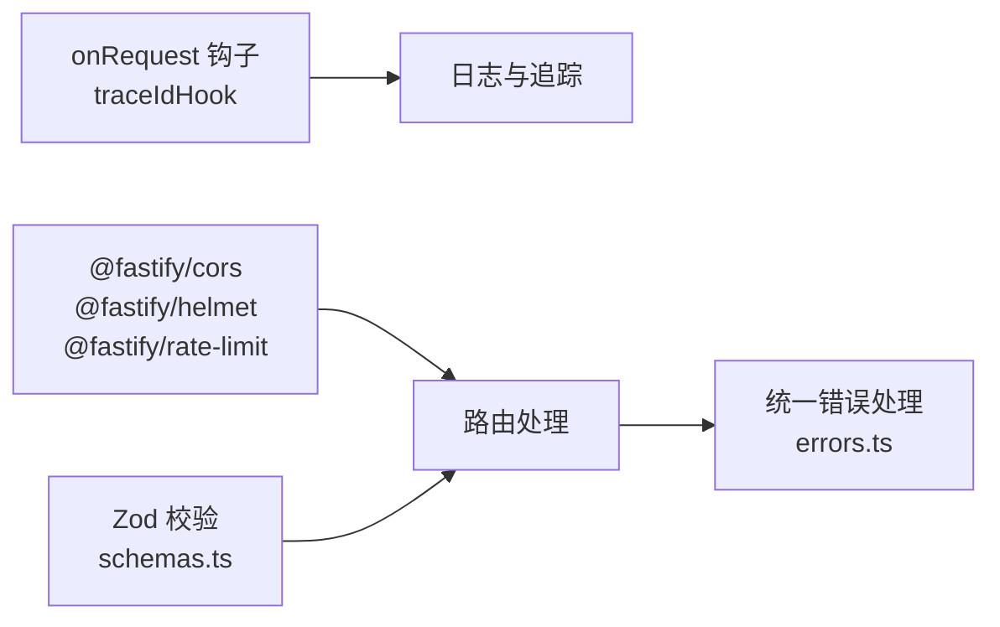
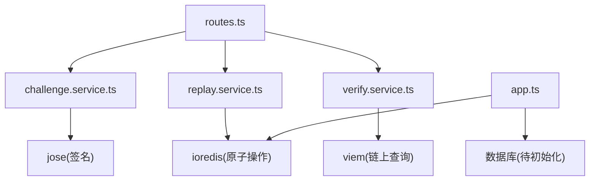

# 安全架构

<cite>
**本文引用的文件**
- [src/app.ts](file://src/app.ts)
- [src/config.ts](file://src/config.ts)
- [src/gateway/middleware.ts](file://src/gateway/middleware.ts)
- [src/gateway/routes.ts](file://src/gateway/routes.ts)
- [src/gateway/schemas.ts](file://src/gateway/schemas.ts)
- [src/x402/challenge.service.ts](file://src/x402/challenge.service.ts)
- [src/x402/replay.service.ts](file://src/x402/replay.service.ts)
- [src/x402/verify.service.ts](file://src/x402/verify.service.ts)
- [src/x402/types.ts](file://src/x402/types.ts)
- [src/errors.ts](file://src/errors.ts)
- [src/audit/types.ts](file://src/audit/types.ts)
- [src/router/types.ts](file://src/router/types.ts)
- [src/billing/types.ts](file://src/billing/types.ts)
- [docs/api-spec-v0-x402-gateway.md](file://docs/api-spec-v0-x402-gateway.md)
- [package.json](file://package.json)
- [test/x402/challenge.test.ts](file://test/x402/challenge.test.ts)
</cite>

## 目录
1. [引言](#引言)
2. [项目结构](#项目结构)
3. [核心组件](#核心组件)
4. [架构总览](#架构总览)
5. [详细组件分析](#详细组件分析)
6. [依赖关系分析](#依赖关系分析)
7. [性能考量](#性能考量)
8. [故障排查指南](#故障排查指南)
9. [结论](#结论)
10. [附录](#附录)

## 引言
本文件为 x402 Gateway 的安全架构文档，聚焦于支付协议的安全机制、挑战-响应模式、链上支付验证与安全保证，以及重放攻击防护、请求哈希绑定与支付与请求的强关联机制。同时覆盖中间件安全层（CORS、安全头部、速率限制）、输入验证策略、威胁模型、安全边界与风险缓解措施，并提供安全架构图与威胁缓解矩阵。

## 项目结构
从安全视角看，系统围绕“网关路由层”“挑战服务”“重放保护服务”“支付验证服务”“审计与账单类型”等模块构建，采用分层设计：路由层负责输入校验与流程编排；挑战/重放/验证服务负责安全决策；审计与账单类型确保可追溯与不可篡改性证据的生成与持久化。

图表来源
- [src/app.ts:35-100](file://src/app.ts#L35-L100)
- [src/gateway/routes.ts:9-96](file://src/gateway/routes.ts#L9-L96)
- [src/gateway/schemas.ts:1-32](file://src/gateway/schemas.ts#L1-L32)
- [src/x402/challenge.service.ts:28-71](file://src/x402/challenge.service.ts#L28-L71)
- [src/x402/replay.service.ts:23-52](file://src/x402/replay.service.ts#L23-L52)
- [src/x402/verify.service.ts:18-34](file://src/x402/verify.service.ts#L18-L34)
- [src/x402/types.ts:1-37](file://src/x402/types.ts#L1-L37)
- [src/errors.ts:6-106](file://src/errors.ts#L6-L106)

章节来源
- [src/app.ts:35-100](file://src/app.ts#L35-L100)
- [src/gateway/routes.ts:9-96](file://src/gateway/routes.ts#L9-L96)
- [src/gateway/schemas.ts:1-32](file://src/gateway/schemas.ts#L1-L32)
- [src/x402/challenge.service.ts:28-71](file://src/x402/challenge.service.ts#L28-L71)
- [src/x402/replay.service.ts:23-52](file://src/x402/replay.service.ts#L23-L52)
- [src/x402/verify.service.ts:18-34](file://src/x402/verify.service.ts#L18-L34)
- [src/x402/types.ts:1-37](file://src/x402/types.ts#L1-L37)
- [src/errors.ts:6-106](file://src/errors.ts#L6-L106)

## 核心组件
- 网关路由与输入校验：对 OpenAI 兼容请求体进行严格校验，统一处理 x402 头部与幂等键，编排后续挑战/支付/路由/计费/记账/审计流程。
- 挑战服务：生成短期有效的挑战令牌，绑定请求哈希，防止请求内容被篡改或复用。
- 重放保护服务：基于 Redis 原子写入与缓存，防止同一笔支付证明被重复消费。
- 支付验证服务：通过链上查询核验金额、资产与收款人是否满足挑战要求。
- 错误体系：统一映射业务错误到标准 API 错误码，便于客户端与审计系统识别。
- 审计与账单类型：定义完整的审计轨迹、路由决策与账单条目，确保不可篡改证据链。

章节来源
- [src/gateway/routes.ts:23-67](file://src/gateway/routes.ts#L23-L67)
- [src/gateway/schemas.ts:3-31](file://src/gateway/schemas.ts#L3-L31)
- [src/x402/challenge.service.ts:4-26](file://src/x402/challenge.service.ts#L4-L26)
- [src/x402/replay.service.ts:3-21](file://src/x402/replay.service.ts#L3-L21)
- [src/x402/verify.service.ts:3-16](file://src/x402/verify.service.ts#L3-L16)
- [src/errors.ts:17-65](file://src/errors.ts#L17-L65)
- [src/audit/types.ts:3-38](file://src/audit/types.ts#L3-L38)
- [src/router/types.ts:1-22](file://src/router/types.ts#L1-L22)
- [src/billing/types.ts:1-32](file://src/billing/types.ts#L1-L32)

## 架构总览
下图展示 x402 支付流程在安全层面的关键交互：请求进入后先进行输入校验与追踪标识注入；若缺少支付头则返回 402 并附带挑战；客户端携带挑战与支付头再次请求时，服务端执行挑战验证、重放检查、链上验证、路由与计费、记账与审计。

图表来源
- [src/gateway/routes.ts:23-67](file://src/gateway/routes.ts#L23-L67)
- [src/app.ts:77-94](file://src/app.ts#L77-L94)
- [src/x402/challenge.service.ts:12-19](file://src/x402/challenge.service.ts#L12-L19)
- [src/x402/replay.service.ts:9-9](file://src/x402/replay.service.ts#L9-L9)
- [src/x402/verify.service.ts:15-15](file://src/x402/verify.service.ts#L15-L15)

## 详细组件分析

### 挑战-响应与请求哈希绑定
- 挑战生成：计算请求的确定性哈希，签名挑战令牌，设置过期时间，作为后续重试的凭据。
- 挑战验证：校验签名、过期时间与请求哈希一致性，拒绝篡改或过期挑战。
- 请求哈希：对请求体进行规范化序列化后取摘要，确保挑战与具体请求强绑定，防止跨请求复用。

图表来源
- [src/x402/challenge.service.ts:12-25](file://src/x402/challenge.service.ts#L12-L25)
- [src/x402/challenge.service.ts:49-60](file://src/x402/challenge.service.ts#L49-L60)
- [docs/api-spec-v0-x402-gateway.md:46-67](file://docs/api-spec-v0-x402-gateway.md#L46-L67)

章节来源
- [src/x402/challenge.service.ts:4-26](file://src/x402/challenge.service.ts#L4-L26)
- [src/x402/challenge.service.ts:49-68](file://src/x402/challenge.service.ts#L49-L68)
- [docs/api-spec-v0-x402-gateway.md:46-67](file://docs/api-spec-v0-x402-gateway.md#L46-L67)

### 链上支付验证与强关联
- 验证维度：金额≥要求金额、资产匹配、收款人匹配挑战中的商户地址。
- 验证入口：使用链上库查询交易，完成三要素核验。
- 结果封装：返回验证状态、付款人地址与实际金额，供后续计费与记账使用。

图表来源
- [src/x402/verify.service.ts:15-31](file://src/x402/verify.service.ts#L15-L31)
- [src/x402/types.ts:12-17](file://src/x402/types.ts#L12-L17)
- [src/x402/types.ts:32-36](file://src/x402/types.ts#L32-L36)

章节来源
- [src/x402/verify.service.ts:3-16](file://src/x402/verify.service.ts#L3-L16)
- [src/x402/verify.service.ts:20-31](file://src/x402/verify.service.ts#L20-L31)
- [src/x402/types.ts:12-36](file://src/x402/types.ts#L12-L36)

### 重放攻击防护与幂等性
- 原子检查：使用 Redis 原子 SET NX EX 对支付证明哈希进行“检查并标记”，避免重复消费。
- 幂等缓存：基于幂等键在 Redis 中缓存响应，支持重试不重复执行。
- 错误语义：重复支付证明触发特定错误码，便于客户端识别并避免二次提交。

图表来源
- [src/x402/replay.service.ts:9-20](file://src/x402/replay.service.ts#L9-L20)
- [src/x402/replay.service.ts:25-33](file://src/x402/replay.service.ts#L25-L33)

章节来源
- [src/x402/replay.service.ts:3-21](file://src/x402/replay.service.ts#L3-L21)
- [src/x402/replay.service.ts:23-52](file://src/x402/replay.service.ts#L23-L52)

### 中间件安全层与输入验证
- 请求追踪：在 onRequest 钩子注入唯一请求 ID，贯穿日志与审计。
- CORS/Helmet/速率限制：全局启用 CORS、安全头部与速率限制插件，降低常见 Web 攻击面。
- 输入验证：使用 Zod 对请求体、x402 头部与审计参数进行严格校验，统一错误处理。

图表来源
- [src/gateway/middleware.ts:9-12](file://src/gateway/middleware.ts#L9-L12)
- [src/app.ts:44-70](file://src/app.ts#L44-L70)
- [src/gateway/schemas.ts:3-31](file://src/gateway/schemas.ts#L3-L31)
- [src/errors.ts:53-70](file://src/errors.ts#L53-L70)

章节来源
- [src/gateway/middleware.ts:5-12](file://src/gateway/middleware.ts#L5-L12)
- [src/app.ts:43-70](file://src/app.ts#L43-L70)
- [src/gateway/schemas.ts:3-31](file://src/gateway/schemas.ts#L3-L31)
- [src/errors.ts:52-70](file://src/errors.ts#L52-L70)

### 路由与审计证据
- 路由决策：记录选择的模型、回退链与评分摘要，形成路由证据。
- 审计查询：提供按请求 ID 查询完整审计的能力，包含路由、用量、成本与支付验证状态。
- 账单与凭证：生成不可篡改的账单条目与使用收据，支撑结算与合规。

章节来源
- [src/router/types.ts:1-22](file://src/router/types.ts#L1-L22)
- [src/audit/types.ts:14-38](file://src/audit/types.ts#L14-L38)
- [src/billing/types.ts:21-32](file://src/billing/types.ts#L21-L32)

## 依赖关系分析
- 组件耦合：路由层仅承担编排职责，挑战/重放/验证服务通过服务容器注入，保持高内聚低耦合。
- 外部依赖：Redis 用于原子检查与幂等缓存；viem 用于链上查询；jose 用于挑战令牌签名；Zod 用于输入校验。
- 配置驱动：挑战密钥、过期时间、商户地址、链与资产等通过配置管理，便于环境隔离与安全轮换。

图表来源
- [src/gateway/routes.ts:54-62](file://src/gateway/routes.ts#L54-L62)
- [src/x402/challenge.service.ts:44-44](file://src/x402/challenge.service.ts#L44-L44)
- [src/x402/replay.service.ts:30-30](file://src/x402/replay.service.ts#L30-L30)
- [src/x402/verify.service.ts:25-25](file://src/x402/verify.service.ts#L25-L25)
- [src/app.ts:77-94](file://src/app.ts#L77-L94)
- [package.json:21-35](file://package.json#L21-L35)

章节来源
- [src/gateway/routes.ts:54-62](file://src/gateway/routes.ts#L54-L62)
- [src/app.ts:77-94](file://src/app.ts#L77-L94)
- [package.json:21-35](file://package.json#L21-L35)

## 性能考量
- 速率限制：默认每分钟最多 100 次请求，可根据部署规模调整，避免滥用与资源枯竭。
- 缓存与幂等：Redis 原子操作与幂等缓存减少重复工作，提升吞吐。
- 链上查询：合理设置超时与重试策略，避免阻塞主流程；对高频场景可引入本地缓存与批量校验。
- 日志与追踪：请求 ID 便于定位问题，建议结合采样与脱敏策略控制日志体积。

## 故障排查指南
- 常见错误码与定位
  - payment_required：首次请求未携带 x402 头部，需重新发起并携带挑战与支付头。
  - challenge_expired：挑战过期，需重新申请挑战。
  - request_hash_mismatch：请求体与挑战不一致，需确保请求内容不变。
  - payment_verification_failed：链上验证失败，检查交易哈希、金额、资产与收款人。
  - payment_replayed：支付证明已被使用，避免重复提交。
  - insufficient_payment：支付金额不足，需补齐差额。
- 排查步骤
  - 检查请求体与 x402 头部是否符合规范。
  - 核对挑战签名、过期时间与请求哈希。
  - 在 Redis 中确认支付证明哈希是否已存在。
  - 使用链上工具核验交易详情与金额。
  - 查看审计查询结果与账单条目，定位异常环节。

章节来源
- [src/errors.ts:17-65](file://src/errors.ts#L17-L65)
- [src/gateway/schemas.ts:17-22](file://src/gateway/schemas.ts#L17-L22)
- [src/x402/replay.service.ts:25-33](file://src/x402/replay.service.ts#L25-L33)
- [src/x402/verify.service.ts:20-31](file://src/x402/verify.service.ts#L20-L31)

## 结论
x402 Gateway 通过挑战-响应、请求哈希绑定、链上验证与重放防护，构建了面向 per-request 的细粒度支付授权与安全保证。配合中间件安全层与严格的输入验证，系统在 MVP 阶段即具备清晰的安全边界与可观测性。后续实现中应优先完善挑战/重放/验证服务的具体逻辑，并强化配置与密钥管理、链上查询超时与重试策略、以及审计与账单的持久化与访问控制。

## 附录

### 威胁模型与缓解矩阵
- 威胁
  - 挑战伪造/篡改：通过签名与过期控制缓解。
  - 请求内容篡改：通过请求哈希绑定挑战，任何变更导致验证失败。
  - 重放攻击：通过支付证明哈希原子检查与幂等缓存缓解。
  - 链上数据错误：通过三要素核验与链上查询校验缓解。
  - 滥用与资源耗尽：通过速率限制与输入验证缓解。
- 缓解措施
  - 挑战签名与过期：挑战服务负责签名与 TTL 控制。
  - 请求哈希绑定：挑战服务负责哈希计算与校验。
  - Redis 原子写入：重放服务负责去重与幂等缓存。
  - 链上核验：验证服务负责金额、资产与收款人核验。
  - CORS/安全头部/速率限制：应用层插件统一启用。
  - 输入验证：Zod 校验请求体与头部参数。

章节来源
- [src/x402/challenge.service.ts:12-25](file://src/x402/challenge.service.ts#L12-L25)
- [src/x402/replay.service.ts:9-20](file://src/x402/replay.service.ts#L9-L20)
- [src/x402/verify.service.ts:15-31](file://src/x402/verify.service.ts#L15-L31)
- [src/app.ts:44-47](file://src/app.ts#L44-L47)
- [src/gateway/schemas.ts:3-31](file://src/gateway/schemas.ts#L3-L31)