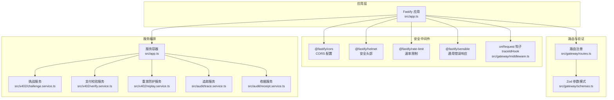
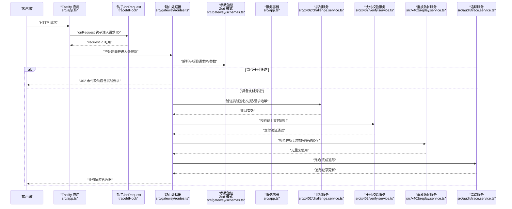
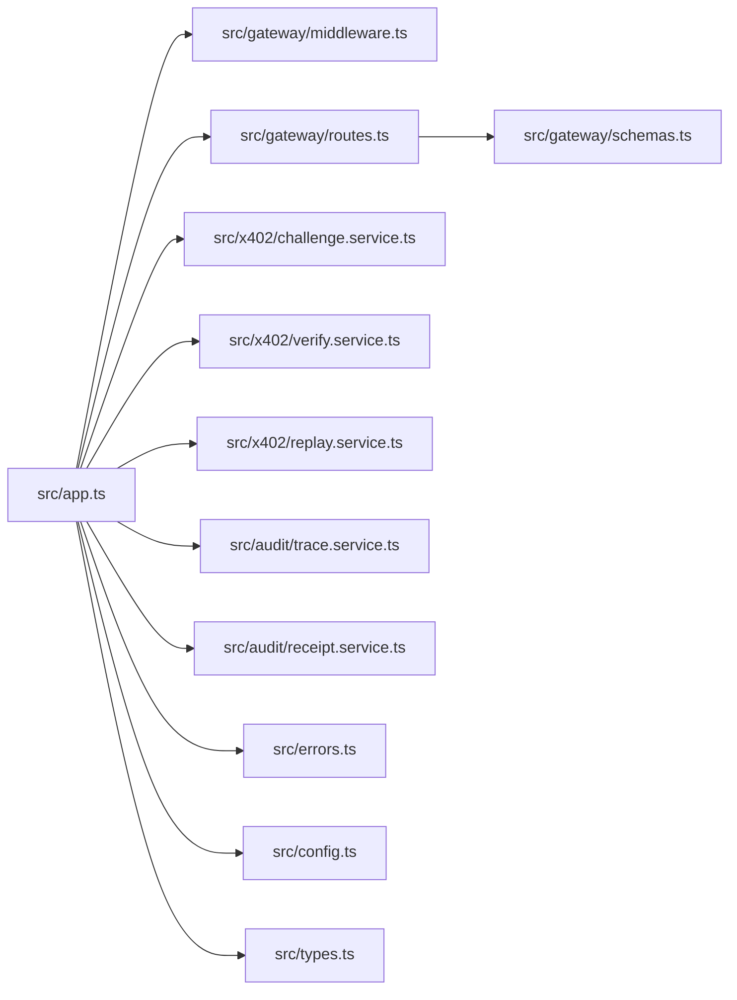

# 网关安全中间件

<cite>
**本文引用的文件**
- [src/app.ts](file://src/app.ts)
- [src/gateway/middleware.ts](file://src/gateway/middleware.ts)
- [src/gateway/routes.ts](file://src/gateway/routes.ts)
- [src/gateway/schemas.ts](file://src/gateway/schemas.ts)
- [src/config.ts](file://src/config.ts)
- [src/errors.ts](file://src/errors.ts)
- [src/types.ts](file://src/types.ts)
- [src/x402/challenge.service.ts](file://src/x402/challenge.service.ts)
- [src/x402/verify.service.ts](file://src/x402/verify.service.ts)
- [src/x402/replay.service.ts](file://src/x402/replay.service.ts)
- [src/audit/trace.service.ts](file://src/audit/trace.service.ts)
- [src/audit/receipt.service.ts](file://src/audit/receipt.service.ts)
</cite>

## 目录
1. [简介](#简介)
2. [项目结构](#项目结构)
3. [核心组件](#核心组件)
4. [架构总览](#架构总览)
5. [详细组件分析](#详细组件分析)
6. [依赖关系分析](#依赖关系分析)
7. [性能考量](#性能考量)
8. [故障排查指南](#故障排查指南)
9. [结论](#结论)
10. [附录](#附录)

## 简介
本文件系统性梳理“网关安全中间件”的设计与实现，覆盖 CORS 配置、请求验证、速率限制、输入净化、执行顺序、安全过滤规则、异常处理机制、配置驱动的安全策略、动态参数验证与自适应防护思路，并结合审计与监控建议，提供可操作的配置示例与最佳实践。

## 项目结构
网关安全中间件位于 src/gateway 子目录，围绕 Fastify 应用注册插件、钩子与全局错误处理器，形成统一的安全与治理边界；同时通过服务容器注入挑战生成、支付校验、重放防护、路由与计费等能力，确保请求在进入业务逻辑前完成必要的安全检查与数据净化。

图表来源
- [src/app.ts:35-100](file://src/app.ts#L35-L100)
- [src/gateway/middleware.ts:9-12](file://src/gateway/middleware.ts#L9-L12)
- [src/gateway/routes.ts:9-96](file://src/gateway/routes.ts#L9-L96)
- [src/gateway/schemas.ts:1-32](file://src/gateway/schemas.ts#L1-L32)
- [src/x402/challenge.service.ts:28-71](file://src/x402/challenge.service.ts#L28-L71)
- [src/x402/verify.service.ts:18-34](file://src/x402/verify.service.ts#L18-L34)
- [src/x402/replay.service.ts:23-52](file://src/x402/replay.service.ts#L23-L52)
- [src/audit/trace.service.ts:38-68](file://src/audit/trace.service.ts#L38-L68)
- [src/audit/receipt.service.ts:14-26](file://src/audit/receipt.service.ts#L14-L26)

章节来源
- [src/app.ts:35-100](file://src/app.ts#L35-L100)
- [src/gateway/middleware.ts:9-12](file://src/gateway/middleware.ts#L9-L12)
- [src/gateway/routes.ts:9-96](file://src/gateway/routes.ts#L9-L96)
- [src/gateway/schemas.ts:1-32](file://src/gateway/schemas.ts#L1-L32)

## 核心组件
- 请求追踪与唯一标识：在 onRequest 钩子中注入唯一请求 ID，便于跨服务链路追踪与审计。
- CORS 与安全头部：通过 @fastify/cors 与 @fastify/helmet 提供跨域与安全响应头保护。
- 速率限制：基于 @fastify/rate-limit 实施全局限流，防止滥用与放大攻击。
- 输入验证与净化：使用 Zod 模式对请求体与路径参数进行严格解析与默认值处理，避免脏数据进入后续流程。
- 全局错误处理：统一捕获应用错误与 Zod 校验错误，输出标准化错误响应。
- 支付挑战与重放防护：通过挑战服务生成一次性挑战，结合支付校验与重放防护服务保障支付有效性与幂等性。
- 审计与收据：追踪请求生命周期，支持按请求 ID 查询完整审计证据。

章节来源
- [src/gateway/middleware.ts:9-12](file://src/gateway/middleware.ts#L9-L12)
- [src/app.ts:44-70](file://src/app.ts#L44-L70)
- [src/gateway/schemas.ts:3-31](file://src/gateway/schemas.ts#L3-L31)
- [src/errors.ts:6-105](file://src/errors.ts#L6-L105)
- [src/x402/challenge.service.ts:4-26](file://src/x402/challenge.service.ts#L4-L26)
- [src/x402/verify.service.ts:3-16](file://src/x402/verify.service.ts#L3-L16)
- [src/x402/replay.service.ts:3-21](file://src/x402/replay.service.ts#L3-L21)
- [src/audit/trace.service.ts:4-36](file://src/audit/trace.service.ts#L4-L36)
- [src/audit/receipt.service.ts:4-12](file://src/audit/receipt.service.ts#L4-L12)

## 架构总览
下图展示从客户端到服务编排的整体调用序列，突出安全中间件在请求生命周期中的关键位置与职责。

图表来源
- [src/app.ts:49-70](file://src/app.ts#L49-L70)
- [src/gateway/routes.ts:23-67](file://src/gateway/routes.ts#L23-L67)
- [src/gateway/schemas.ts:4-27](file://src/gateway/schemas.ts#L4-L27)
- [src/x402/challenge.service.ts:35-69](file://src/x402/challenge.service.ts#L35-L69)
- [src/x402/verify.service.ts:19-32](file://src/x402/verify.service.ts#L19-L32)
- [src/x402/replay.service.ts:24-50](file://src/x402/replay.service.ts#L24-L50)
- [src/audit/trace.service.ts:39-66](file://src/audit/trace.service.ts#L39-L66)

## 详细组件分析

### 执行顺序与安全过滤规则
- 插件注册顺序：CORS → Helmet → Rate Limit → Sensible，确保在路由处理前完成跨域、安全头与限流设置。
- 钩子顺序：onRequest 钩子在路由处理前注入唯一请求 ID，保证后续审计与追踪一致可用。
- 路由处理顺序：
  1) 解析并校验请求体与路径参数；
  2) 若缺少挑战或支付凭证，返回 402 并附带支付要求；
  3) 若存在凭证，依次执行挑战验证、支付验证、重放检查与幂等缓存；
  4) 记录追踪并返回业务响应。
- 过滤规则：
  - 必填字段缺失或格式不符时，Zod 抛出校验错误，统一转为 400 响应；
  - 402 场景下返回标准化支付要求对象；
  - 501 场景提示功能尚未实现，便于逐步演进。

章节来源
- [src/app.ts:44-50](file://src/app.ts#L44-L50)
- [src/gateway/routes.ts:23-67](file://src/gateway/routes.ts#L23-L67)
- [src/gateway/schemas.ts:4-27](file://src/gateway/schemas.ts#L4-L27)
- [src/errors.ts:92-105](file://src/errors.ts#L92-L105)

### 中间件职责与实现要点
- CORS 配置：通过 @fastify/cors 插件启用跨域策略，默认行为遵循插件配置；建议结合白名单域名与允许方法细化策略。
- 请求验证：使用 Zod 对聊天补全请求体、审计参数与 x402 头部进行强类型校验，自动填充默认值，减少脏数据风险。
- 速率限制：@fastify/rate-limit 在应用级实施限流，建议结合上游限流与 IP 维度策略，避免被绕过。
- 输入净化：Zod 的解析过程即为净化，自动去除未知字段并进行类型转换与约束检查。
- 异常处理：全局错误处理器区分应用错误与 Zod 校验错误，输出标准化错误码与消息；其他异常记录日志并返回通用 500。

章节来源
- [src/app.ts:44-70](file://src/app.ts#L44-L70)
- [src/gateway/schemas.ts:4-27](file://src/gateway/schemas.ts#L4-L27)
- [src/errors.ts:6-105](file://src/errors.ts#L6-L105)

### 配置驱动的安全策略
- 配置项来源：通过环境变量加载，涵盖数据库、Redis、挑战密钥、商户地址、支付链与资产、平台费率等。
- 安全相关配置：
  - 挑战密钥长度与有效期：用于挑战令牌签名与过期控制；
  - 商户地址、支付链与资产：决定支付验证目标；
  - 日志级别：影响审计与监控粒度。
- 建议：将敏感配置置于受控环境，定期轮换挑战密钥，限制支付金额与资产白名单。

章节来源
- [src/config.ts:4-24](file://src/config.ts#L4-L24)
- [src/config.ts:28-45](file://src/config.ts#L28-L45)

### 动态参数验证与自适应防护
- 动态验证：路由处理器在进入业务前对请求体与路径参数进行解析与校验，确保数据一致性与完整性。
- 自适应防护（建议实现方向）：
  - 基于请求特征（模型、温度、消息数量）调整挑战阈值与超时；
  - 结合上游负载与 SLA 动态调整重放 TTL 与幂等缓存策略；
  - 将速率限制与上游配额联动，避免突发流量冲击。

章节来源
- [src/gateway/routes.ts:23-67](file://src/gateway/routes.ts#L23-L67)
- [src/gateway/schemas.ts:4-15](file://src/gateway/schemas.ts#L4-L15)

### 常见安全威胁与防护措施
- CORS 误配：仅允许必要域名与方法，避免通配符暴露；
- 请求体注入：依赖 Zod 解析与默认值，拒绝未知字段；
- 速率滥用：结合应用级与网关级限流，配合 IP 与用户维度；
- 重放攻击：使用挑战令牌绑定请求哈希与过期时间，结合 Redis 原子标记；
- 支付欺诈：链上验证金额、资产与收款人，拒绝不足支付与重复使用；
- 审计缺失：通过追踪服务记录请求生命周期，支持回溯与取证。

章节来源
- [src/app.ts:44-47](file://src/app.ts#L44-L47)
- [src/gateway/schemas.ts:4-27](file://src/gateway/schemas.ts#L4-L27)
- [src/x402/challenge.service.ts:35-69](file://src/x402/challenge.service.ts#L35-L69)
- [src/x402/replay.service.ts:24-50](file://src/x402/replay.service.ts#L24-L50)
- [src/x402/verify.service.ts:19-32](file://src/x402/verify.service.ts#L19-L32)
- [src/audit/trace.service.ts:39-66](file://src/audit/trace.service.ts#L39-L66)

### 日志记录与监控集成
- 日志：应用级日志记录错误堆栈，便于问题定位；建议在追踪服务中补充结构化字段以支持查询。
- 监控：结合追踪服务统计延迟、成功率与失败原因，路由决策与成本指标可用于告警阈值设定。
- 建议：将请求 ID 作为跨系统关联键，统一接入日志与指标平台。

章节来源
- [src/app.ts:53-70](file://src/app.ts#L53-L70)
- [src/audit/trace.service.ts:4-36](file://src/audit/trace.service.ts#L4-L36)

## 依赖关系分析
下图展示安全中间件与各模块之间的依赖关系，强调耦合与内聚特性。

图表来源
- [src/app.ts:35-100](file://src/app.ts#L35-L100)
- [src/gateway/middleware.ts:9-12](file://src/gateway/middleware.ts#L9-L12)
- [src/gateway/routes.ts:9-96](file://src/gateway/routes.ts#L9-L96)
- [src/gateway/schemas.ts:1-32](file://src/gateway/schemas.ts#L1-L32)
- [src/x402/challenge.service.ts:28-71](file://src/x402/challenge.service.ts#L28-L71)
- [src/x402/verify.service.ts:18-34](file://src/x402/verify.service.ts#L18-L34)
- [src/x402/replay.service.ts:23-52](file://src/x402/replay.service.ts#L23-L52)
- [src/audit/trace.service.ts:38-68](file://src/audit/trace.service.ts#L38-L68)
- [src/audit/receipt.service.ts:14-26](file://src/audit/receipt.service.ts#L14-L26)
- [src/errors.ts:6-105](file://src/errors.ts#L6-L105)
- [src/config.ts:4-24](file://src/config.ts#L4-L24)
- [src/types.ts:1-119](file://src/types.ts#L1-L119)

章节来源
- [src/app.ts:35-100](file://src/app.ts#L35-L100)

## 性能考量
- 速率限制：合理设置窗口与上限，避免对正常流量造成误伤；结合上游限流与分布式限流。
- 缓存与幂等：利用 Redis 原子操作与 TTL 控制，降低重复计算与网络抖动影响。
- 日志与追踪：控制日志级别与字段大小，避免 IO 瓶颈；追踪记录按需落库，异步化写入。
- 上游依赖：对链上查询与外部服务增加超时与熔断策略，提升整体稳定性。

## 故障排查指南
- 400 校验错误：检查请求体是否符合 Zod 模式，确认必填字段与取值范围。
- 402 未付款：确认客户端正确携带挑战与支付凭证，检查挑战是否过期。
- 409 重放：确认支付证明哈希是否已存在，检查幂等键缓存 TTL。
- 500 内部错误：查看应用日志堆栈，定位具体服务实现（挑战/校验/重放/追踪）。
- 501 未实现：当前支付流程处于开发阶段，逐步补齐服务实现。

章节来源
- [src/errors.ts:17-89](file://src/errors.ts#L17-L89)
- [src/app.ts:53-70](file://src/app.ts#L53-L70)
- [src/gateway/routes.ts:30-66](file://src/gateway/routes.ts#L30-L66)

## 结论
该网关安全中间件通过插件化安全层、严格的参数验证、速率限制与统一错误处理，构建了清晰的请求治理边界。结合挑战-支付-重放-追踪的闭环，既能满足合规与风控需求，又为未来扩展（如自适应防护、更细粒度的限流与审计）预留空间。建议在生产环境中进一步完善挑战与支付服务的具体实现，并强化日志与监控体系。

## 附录

### 配置示例（环境变量）
- 数据库与缓存：DATABASE_URL、REDIS_URL
- 挑战与支付：CHALLENGE_SECRET（≥32 字符）、CHALLENGE_TTL_SECONDS、MERCHANT_ADDRESS（0x 开头）、PAYMENT_CHAIN、PAYMENT_ASSET
- 平台费率：PLATFORM_FEE_BPS
- 日志与运行：PORT、HOST、NODE_ENV、LOG_LEVEL

章节来源
- [src/config.ts:4-24](file://src/config.ts#L4-L24)
- [src/config.ts:28-45](file://src/config.ts#L28-L45)

### 最佳实践指南
- CORS：仅允许受信域名与必要方法；避免通配符与高权限头。
- 速率限制：分层限流（IP/用户/模型），结合滑动窗口与突发控制。
- 参数验证：始终使用 Zod 解析，保留默认值与类型转换；对外暴露的模式保持向后兼容。
- 支付安全：挑战令牌必须绑定请求哈希与过期时间；链上验证严格比对金额、资产与收款人。
- 重放防护：使用原子 SET NX EX 标记；幂等键缓存设置合理 TTL。
- 审计与监控：统一请求 ID，结构化日志；追踪记录包含关键指标；建立告警与回溯机制。