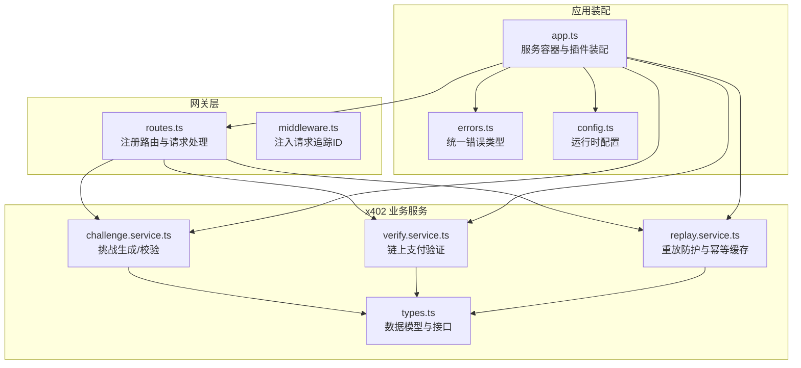
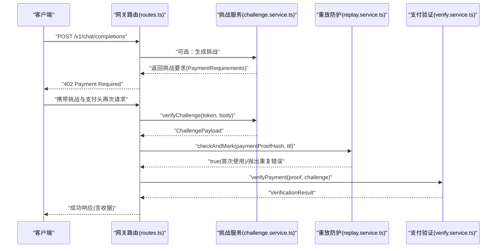
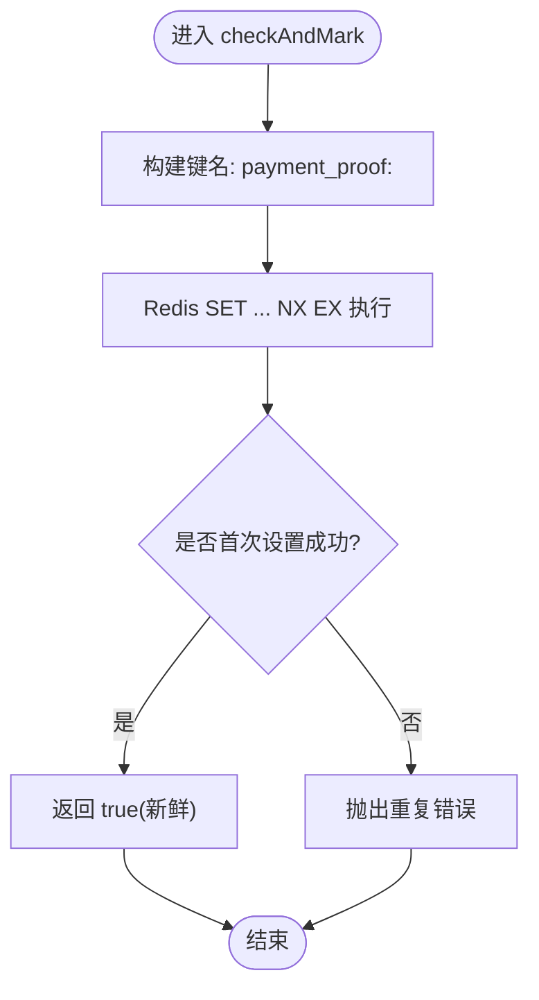
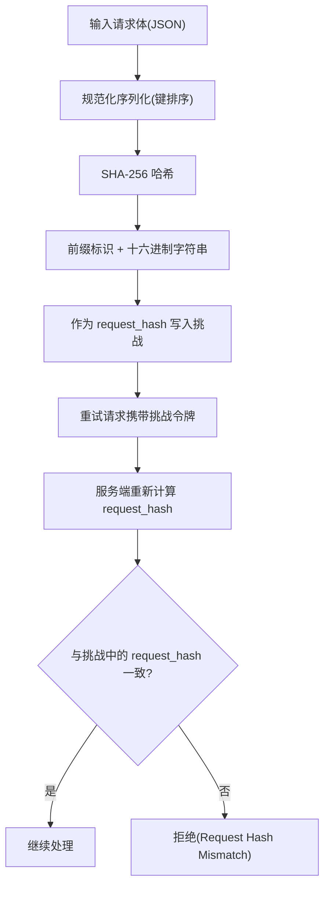
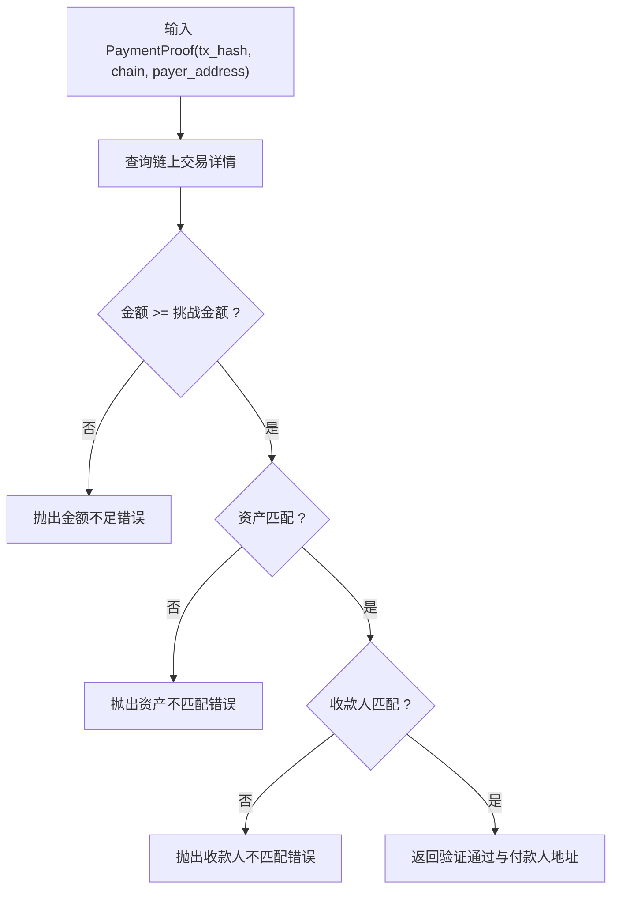
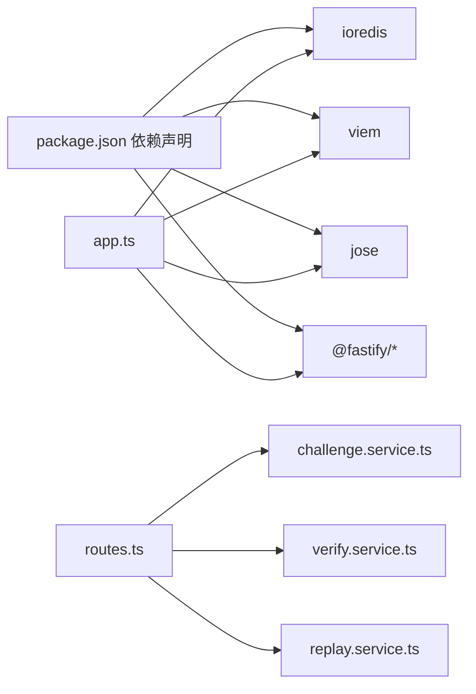

# 重放攻击防护

<cite>
**本文引用的文件**
- [src/x402/replay.service.ts](file://src/x402/replay.service.ts)
- [src/x402/challenge.service.ts](file://src/x402/challenge.service.ts)
- [src/x402/verify.service.ts](file://src/x402/verify.service.ts)
- [src/x402/types.ts](file://src/x402/types.ts)
- [src/x402/index.ts](file://src/x402/index.ts)
- [src/gateway/routes.ts](file://src/gateway/routes.ts)
- [src/gateway/middleware.ts](file://src/gateway/middleware.ts)
- [src/app.ts](file://src/app.ts)
- [src/errors.ts](file://src/errors.ts)
- [src/config.ts](file://src/config.ts)
- [src/types.ts](file://src/types.ts)
- [package.json](file://package.json)
- [test/x402/challenge.test.ts](file://test/x402/challenge.test.ts)
</cite>

## 目录
1. [引言](#引言)
2. [项目结构](#项目结构)
3. [核心组件](#核心组件)
4. [架构总览](#架构总览)
5. [详细组件分析](#详细组件分析)
6. [依赖关系分析](#依赖关系分析)
7. [性能考虑](#性能考虑)
8. [故障排查指南](#故障排查指南)
9. [结论](#结论)
10. [附录](#附录)

## 引言
本文件面向“重放攻击防护”主题，聚焦于基于链上支付证明（X-402）的请求处理流水线中的防重放与幂等保障。系统通过挑战-响应与链上验证相结合的方式，确保同一笔支付证明不会被重复使用，并在分布式环境下利用 Redis 实现一致性的去重与缓存。本文从威胁模型、防护策略、实现原理、Redis 缓存策略、一致性与性能优化等方面进行系统化阐述。

## 项目结构
该代码库采用按功能域分层的组织方式：网关层负责路由与中间件，业务服务层包含挑战生成/校验、支付验证与重放防护等模块，类型定义与错误体系贯穿全栈，配置与依赖管理清晰分离。

图示来源
- [src/gateway/routes.ts:1-96](file://src/gateway/routes.ts#L1-L96)
- [src/gateway/middleware.ts:1-13](file://src/gateway/middleware.ts#L1-L13)
- [src/x402/challenge.service.ts:1-71](file://src/x402/challenge.service.ts#L1-L71)
- [src/x402/verify.service.ts:1-34](file://src/x402/verify.service.ts#L1-L34)
- [src/x402/replay.service.ts:1-52](file://src/x402/replay.service.ts#L1-L52)
- [src/x402/types.ts:1-37](file://src/x402/types.ts#L1-L37)
- [src/app.ts:1-101](file://src/app.ts#L1-L101)
- [src/errors.ts:1-106](file://src/errors.ts#L1-L106)
- [src/config.ts:1-46](file://src/config.ts#L1-L46)

章节来源
- [src/gateway/routes.ts:1-96](file://src/gateway/routes.ts#L1-L96)
- [src/app.ts:1-101](file://src/app.ts#L1-L101)

## 核心组件
- 挑战服务：生成挑战令牌并校验重试请求的完整性与时效性，绑定请求体哈希以防止篡改。
- 支付验证服务：基于链上交易哈希查询并核验金额、资产与收款人等关键字段。
- 重放防护服务：原子性检查并标记支付证明，避免重复消费；同时提供幂等键的响应缓存能力。
- 错误体系：统一映射到 API 规范的错误码与状态码，便于客户端与审计系统识别。
- 配置与类型：集中管理运行参数与共享数据结构，确保跨模块一致性。

章节来源
- [src/x402/challenge.service.ts:1-71](file://src/x402/challenge.service.ts#L1-L71)
- [src/x402/verify.service.ts:1-34](file://src/x402/verify.service.ts#L1-L34)
- [src/x402/replay.service.ts:1-52](file://src/x402/replay.service.ts#L1-L52)
- [src/x402/types.ts:1-37](file://src/x402/types.ts#L1-L37)
- [src/errors.ts:1-106](file://src/errors.ts#L1-L106)
- [src/config.ts:1-46](file://src/config.ts#L1-L46)

## 架构总览
下图展示了从客户端发起请求到完成链上验证与重放防护的关键交互路径，以及各组件之间的依赖关系。

图示来源
- [src/gateway/routes.ts:23-67](file://src/gateway/routes.ts#L23-L67)
- [src/x402/challenge.service.ts:12-19](file://src/x402/challenge.service.ts#L12-L19)
- [src/x402/replay.service.ts:3-21](file://src/x402/replay.service.ts#L3-L21)
- [src/x402/verify.service.ts:3-16](file://src/x402/verify.service.ts#L3-L16)

## 详细组件分析

### 重放攻击威胁模型与防护策略
- 威胁来源
  - 网络重放：对手截获合法请求与响应，重复发送以消耗资源或绕过付费。
  - 请求篡改：修改请求体后重试，若未绑定请求指纹则可能绕过校验。
  - 幂等性破坏：同一请求多次执行导致副作用（如重复计费、重复路由）。
- 防护策略
  - 唯一性保证：以“支付证明哈希”作为全局唯一键，结合原子写入确保并发安全。
  - 去重机制：Redis SET NX EX 原子操作，首次写入成功即视为“新鲜”，失败则判定重复。
  - 状态跟踪：通过 TTL 控制记忆窗口，避免无限膨胀；同时提供幂等键缓存以加速相同请求的响应返回。
  - 完整性绑定：挑战中嵌入“请求哈希”，重试请求必须与原始请求体完全一致，否则拒绝。

章节来源
- [src/x402/replay.service.ts:3-21](file://src/x402/replay.service.ts#L3-L21)
- [src/x402/challenge.service.ts:4-26](file://src/x402/challenge.service.ts#L4-L26)
- [src/x402/types.ts:1-37](file://src/x402/types.ts#L1-L37)

### 重放保护服务实现原理
- 接口职责
  - checkAndMark：原子检查并标记支付证明，成功返回真，失败抛出重复错误。
  - checkIdempotency/saveIdempotency：基于幂等键读取/写入缓存响应，支持 TTL。
- 关键算法
  - 原子性：使用 Redis SET key NX EX 原理，首次写入成功表示首次使用；失败表示重复。
  - 唯一性：以“payment_proof:<hash>”为键，避免不同链/资产混淆。
  - 幂等缓存：以“idempotency:<key>”为键，缓存响应对象，提升重复请求吞吐。
- 复杂度与可靠性
  - 单键操作为 O(1)，适合高并发场景。
  - 依赖 Redis 的原子性与持久化策略，需结合主从/哨兵/集群与合理的过期策略。

图示来源
- [src/x402/replay.service.ts:23-51](file://src/x402/replay.service.ts#L23-L51)

章节来源
- [src/x402/replay.service.ts:1-52](file://src/x402/replay.service.ts#L1-L52)

### 支付令牌唯一性与请求哈希绑定
- 唯一性来源
  - 支付证明哈希：由链上交易哈希派生，确保不同交易不可复用。
  - 请求哈希：对请求体进行规范化序列化与哈希，绑定具体请求内容。
- 绑定策略
  - 挑战令牌包含请求哈希与金额、资产、收款地址等上下文，重试时必须严格匹配。
  - 任何字段差异（包括顺序、空格、数值精度）都会导致哈希不一致，从而拒绝。

图示来源
- [src/x402/challenge.service.ts:62-68](file://src/x402/challenge.service.ts#L62-L68)
- [src/x402/types.ts:1-37](file://src/x402/types.ts#L1-L37)

章节来源
- [src/x402/challenge.service.ts:1-71](file://src/x402/challenge.service.ts#L1-L71)
- [src/x402/types.ts:1-37](file://src/x402/types.ts#L1-L37)

### 链上支付验证与金额/资产/收款人核验
- 核验维度
  - 金额：不低于挑战金额。
  - 资产：与挑战资产一致（如 USDC）。
  - 收款人：与挑战收款地址一致。
- 技术要点
  - 使用链上客户端库查询交易详情，确保不可篡改证据存在。
  - 返回验证结果与付款人地址，用于后续账务与审计。

图示来源
- [src/x402/verify.service.ts:18-33](file://src/x402/verify.service.ts#L18-L33)
- [src/x402/types.ts:13-17](file://src/x402/types.ts#L13-L17)

章节来源
- [src/x402/verify.service.ts:1-34](file://src/x402/verify.service.ts#L1-L34)
- [src/x402/types.ts:1-37](file://src/x402/types.ts#L1-L37)

### 分布式部署下的重放防护一致性
- 一致性保障
  - 全局唯一键：以支付证明哈希为键，天然具备跨节点一致性。
  - 原子操作：Redis SET NX EX 在单实例/集群模式下均提供原子性，避免竞态。
  - TTL 策略：统一过期时间，控制内存占用与清理成本。
- 内存优化
  - 合理设置 TTL，避免长期驻留造成内存压力。
  - 对高频幂等请求使用短 TTL 的响应缓存，降低下游压力。
- 可观测性
  - 结合请求追踪 ID 与审计日志，记录挑战、验证与重放检查的全流程事件，便于回溯。

章节来源
- [src/gateway/middleware.ts:1-13](file://src/gateway/middleware.ts#L1-L13)
- [src/app.ts:77-94](file://src/app.ts#L77-L94)

### 路由与流程集成点
- 路由层负责解析请求、提取头部、调用服务层并组装响应。
- 当缺少挑战或支付头时，返回 402 并附带挑战要求；当具备有效凭证时，依次执行挑战校验、重放检查、链上验证与上游路由。

章节来源
- [src/gateway/routes.ts:23-67](file://src/gateway/routes.ts#L23-L67)
- [src/app.ts:77-94](file://src/app.ts#L77-L94)

## 依赖关系分析
- 运行时依赖
  - Redis：提供原子键值存储与 TTL 管理，支撑重放检查与幂等缓存。
  - viem：链上查询与交易核验。
  - jose：挑战令牌签名与验签。
  - fastify 生态：插件化安全与限流。
- 模块耦合
  - 路由层仅做薄处理，依赖挑战/验证/重放服务解耦业务逻辑。
  - 类型与错误体系在多模块间共享，减少歧义与重复实现。

图示来源
- [package.json:21-36](file://package.json#L21-L36)
- [src/app.ts:1-101](file://src/app.ts#L1-L101)
- [src/gateway/routes.ts:1-96](file://src/gateway/routes.ts#L1-L96)

章节来源
- [package.json:1-52](file://package.json#L1-L52)
- [src/app.ts:1-101](file://src/app.ts#L1-L101)

## 性能考虑
- Redis 优化
  - 使用原子 SET NX EX，避免锁与轮询，降低延迟与竞争。
  - 合理设置 TTL，平衡命中率与内存占用；对幂等缓存使用更短 TTL。
  - 在集群模式下，确保键分布均匀，避免热点。
- 并发与吞吐
  - 将重放检查前置到链上验证之前，尽早失败以节省链上查询成本。
  - 对幂等请求直接命中缓存，减少序列化与下游调用。
- 安全与稳定性
  - 限制挑战有效期，防止长期悬挂；对过期挑战统一报错。
  - 对重复使用支付证明快速失败，避免链上反复查询。

## 故障排查指南
- 常见错误与定位
  - 挑战过期：检查挑战时间戳与服务器时间同步，确认挑战 TTL 设置。
  - 请求哈希不匹配：核对请求体规范化序列化规则与字段一致性。
  - 支付重复：确认支付证明哈希是否正确生成与传递；检查 Redis 键是否存在。
  - 验证失败：核对链上查询参数（链、资产、收款地址）与交易详情。
- 日志与追踪
  - 利用请求追踪 ID 关联审计日志，定位问题发生阶段。
  - 记录关键决策点（挑战生成、重放检查、验证结果），便于回溯。

章节来源
- [src/errors.ts:17-65](file://src/errors.ts#L17-L65)
- [src/gateway/middleware.ts:1-13](file://src/gateway/middleware.ts#L1-L13)

## 结论
本系统通过“挑战-响应 + 链上验证 + 原子重放检查 + 幂等缓存”的组合，在保证安全性的同时兼顾性能与可扩展性。在分布式部署下，Redis 原子键与 TTL 策略提供了可靠的去重与一致性保障；配合严格的请求哈希绑定与错误体系，能够有效抵御重放攻击并提升用户体验。

## 附录

### 配置选项与建议
- 挑战相关
  - 挑战密钥：长度不少于 32 字节，定期轮换。
  - 挑战有效期：根据业务风险设定，建议分钟级。
- Redis 相关
  - 连接与超时：合理设置连接池大小与命令超时。
  - 过期策略：统一 TTL，避免长期驻留；对幂等缓存使用更短 TTL。
- 安全与合规
  - 传输加密：启用 TLS；限制暴露面。
  - 审计与日志：记录关键事件，保留足够时间窗口。

章节来源
- [src/config.ts:13-18](file://src/config.ts#L13-L18)
- [src/app.ts:73-76](file://src/app.ts#L73-L76)

### 测试与验证
- 单元测试覆盖接口契约与行为边界，当前挑战服务处于占位实现，测试用于验证接口存在性与异常路径。
- 建议逐步补齐各服务的实现与测试，确保端到端流程可用。

章节来源
- [test/x402/challenge.test.ts:1-28](file://test/x402/challenge.test.ts#L1-L28)