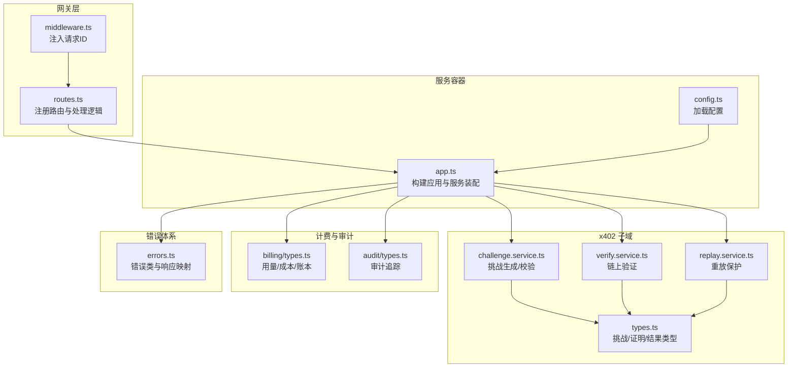
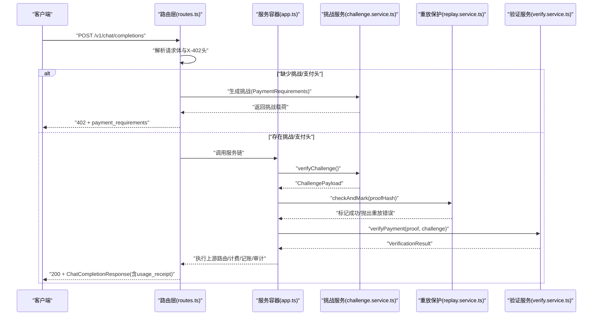
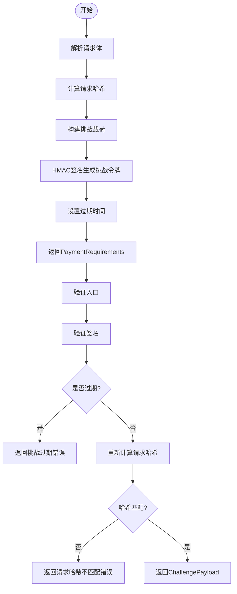
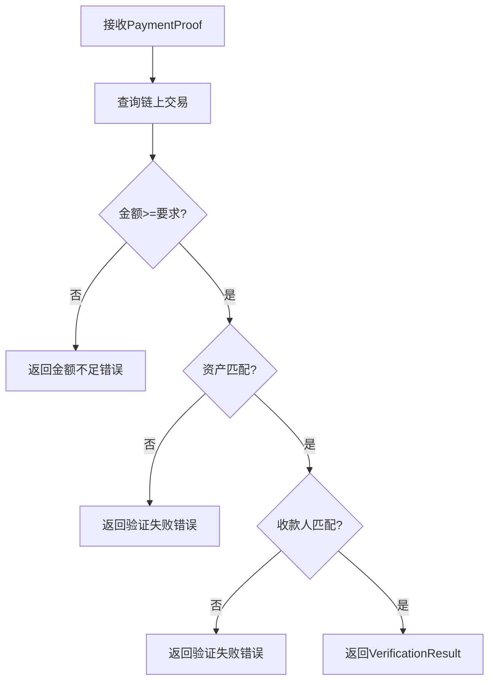
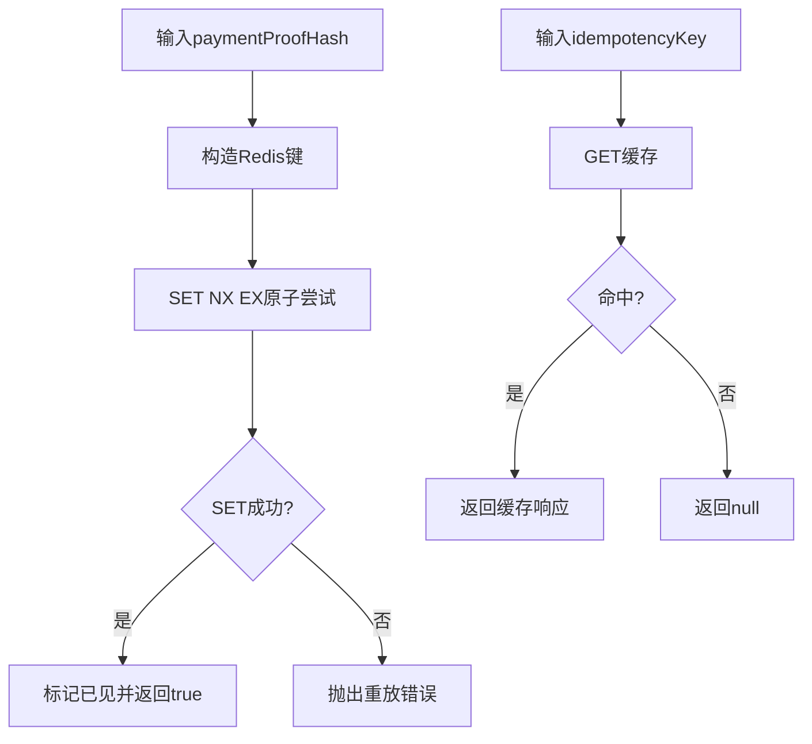
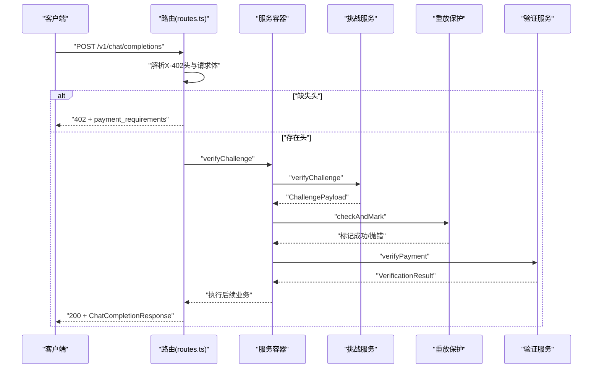
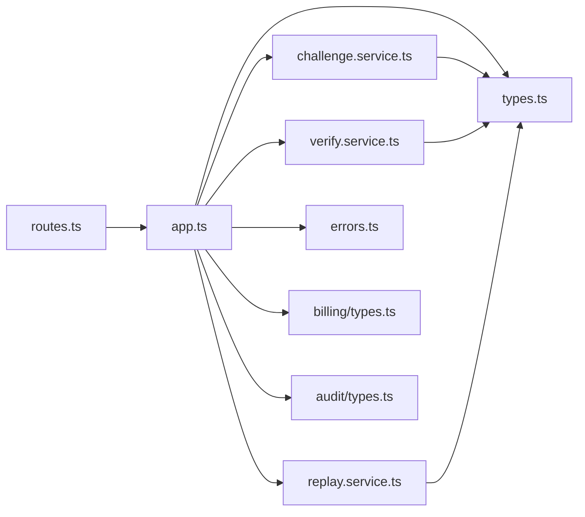
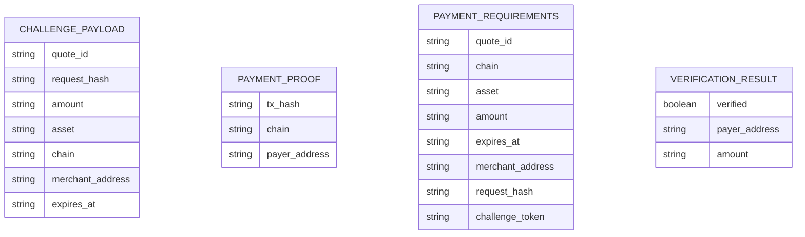

# 支付流程数据流

<cite>
**本文档引用的文件**
- [src/x402/index.ts](file://src/x402/index.ts)
- [src/x402/types.ts](file://src/x402/types.ts)
- [src/x402/challenge.service.ts](file://src/x402/challenge.service.ts)
- [src/x402/verify.service.ts](file://src/x402/verify.service.ts)
- [src/x402/replay.service.ts](file://src/x402/replay.service.ts)
- [src/gateway/routes.ts](file://src/gateway/routes.ts)
- [src/gateway/middleware.ts](file://src/gateway/middleware.ts)
- [src/app.ts](file://src/app.ts)
- [src/config.ts](file://src/config.ts)
- [src/errors.ts](file://src/errors.ts)
- [src/types.ts](file://src/types.ts)
- [src/billing/types.ts](file://src/billing/types.ts)
- [src/audit/types.ts](file://src/audit/types.ts)
- [test/integration/flow.test.ts](file://test/integration/flow.test.ts)
- [test/x402/challenge.test.ts](file://test/x402/challenge.test.ts)
</cite>

## 目录
1. [简介](#简介)
2. [项目结构](#项目结构)
3. [核心组件](#核心组件)
4. [架构总览](#架构总览)
5. [详细组件分析](#详细组件分析)
6. [依赖关系分析](#依赖关系分析)
7. [性能考量](#性能考量)
8. [故障排查指南](#故障排查指南)
9. [结论](#结论)
10. [附录](#附录)

## 简介
本文件面向 x402 支付流程，系统性梳理从客户端发起请求到完成支付验证的完整数据流：挑战生成（challenge generation）、链上支付验证（payment verification）、重放保护（replay protection）与支付证明处理。文档重点说明以下方面：
- 请求头解析与路由决策
- 挑战载荷生成与校验
- 支付证明验证与错误处理
- 状态更新与审计证据
- 异步支付确认与超时处理的数据传播模式

当前实现处于开发阶段，核心服务接口已定义但尚未完全实现，本文在不泄露具体实现细节的前提下，基于现有接口与测试用例，提供可落地的流程设计与数据流图。

## 项目结构
围绕 x402 支付流程的关键模块如下：
- 路由层：负责请求解析、头部读取与流程分发
- 服务容器：装配挑战、验证、重放保护等服务
- x402 子域：挑战生成、链上验证、重放保护与类型定义
- 错误体系：统一映射到 API 规范的错误码与 HTTP 状态
- 计费与审计：用量记录、成本计算、账本提交与审计追踪

**图表来源**
- [src/gateway/routes.ts:1-96](file://src/gateway/routes.ts#L1-L96)
- [src/gateway/middleware.ts:1-13](file://src/gateway/middleware.ts#L1-L13)
- [src/app.ts:1-101](file://src/app.ts#L1-L101)
- [src/config.ts:1-46](file://src/config.ts#L1-L46)
- [src/x402/challenge.service.ts:1-71](file://src/x402/challenge.service.ts#L1-L71)
- [src/x402/verify.service.ts:1-34](file://src/x402/verify.service.ts#L1-L34)
- [src/x402/replay.service.ts:1-52](file://src/x402/replay.service.ts#L1-L52)
- [src/x402/types.ts:1-37](file://src/x402/types.ts#L1-L37)
- [src/billing/types.ts:1-32](file://src/billing/types.ts#L1-L32)
- [src/audit/types.ts:1-38](file://src/audit/types.ts#L1-L38)
- [src/errors.ts:1-106](file://src/errors.ts#L1-L106)

**章节来源**
- [src/gateway/routes.ts:1-96](file://src/gateway/routes.ts#L1-L96)
- [src/app.ts:1-101](file://src/app.ts#L1-L101)
- [src/config.ts:1-46](file://src/config.ts#L1-L46)

## 核心组件
- 挑战服务（IChallengeService）
  - 生成挑战：产出 PaymentRequirements（含 quote_id、request_hash、amount、asset、chain、merchant_address、expires_at、challenge_token）
  - 验证挑战：校验签名、过期时间、请求体哈希一致性
  - 计算请求哈希：对请求体进行规范化 JSON 序列化后做哈希
- 验证服务（IPaymentVerifyService）
  - 对比链上交易：金额≥要求金额、资产匹配、收款人匹配
  - 返回 VerificationResult（verified、payer_address、amount）
- 重放保护服务（IReplayProtectionService）
  - 原子检查与标记：使用 Redis SET NX EX 检测重复支付证明
  - 幂等性：按 idempotency_key 缓存响应
- 类型与错误
  - ChallengePayload、PaymentProof、PaymentRequirements、VerificationResult
  - PaymentRequiredError、ChallengeExpiredError、RequestHashMismatchError、PaymentVerificationFailedError、PaymentReplayedError、InsufficientPaymentError、UpstreamTimeoutError、UpstreamUnavailableError、InternalError

**章节来源**
- [src/x402/challenge.service.ts:1-71](file://src/x402/challenge.service.ts#L1-L71)
- [src/x402/verify.service.ts:1-34](file://src/x402/verify.service.ts#L1-L34)
- [src/x402/replay.service.ts:1-52](file://src/x402/replay.service.ts#L1-L52)
- [src/x402/types.ts:1-37](file://src/x402/types.ts#L1-L37)
- [src/errors.ts:1-106](file://src/errors.ts#L1-L106)

## 架构总览
x402 支付流程在路由层根据请求头决定是否返回挑战或执行支付验证。服务容器负责装配各子域服务，并通过全局错误处理器统一响应。

**图表来源**
- [src/gateway/routes.ts:23-67](file://src/gateway/routes.ts#L23-L67)
- [src/app.ts:77-94](file://src/app.ts#L77-L94)
- [src/x402/challenge.service.ts:12-19](file://src/x402/challenge.service.ts#L12-L19)
- [src/x402/replay.service.ts:9-21](file://src/x402/replay.service.ts#L9-L21)
- [src/x402/verify.service.ts:15-16](file://src/x402/verify.service.ts#L15-L16)

## 详细组件分析

### 组件A：挑战生成与校验（Challenge Generation & Verification）
- 数据格式转换
  - 请求体规范化：对 ChatCompletionRequest 进行键排序的 JSON 序列化
  - 哈希生成：对规范化字符串进行哈希，前缀标识 request_hash
  - 挑战令牌：使用密钥对挑战载荷进行签名（HMAC），作为挑战令牌
- 验证规则
  - 时间有效性：比较 expires_at 与当前时间
  - 请求体一致性：重新计算 request_hash 并与挑战载荷对比
  - 签名有效性：使用相同密钥验证挑战令牌
- 错误处理
  - 过期挑战：返回挑战过期错误
  - 请求哈希不匹配：返回请求哈希不一致错误
- 复杂度
  - 哈希计算与签名验证均为 O(n)（n 为请求体大小）

**图表来源**
- [src/x402/challenge.service.ts:12-26](file://src/x402/challenge.service.ts#L12-L26)
- [src/x402/types.ts:2-10](file://src/x402/types.ts#L2-L10)
- [src/errors.ts:18-41](file://src/errors.ts#L18-L41)

**章节来源**
- [src/x402/challenge.service.ts:1-71](file://src/x402/challenge.service.ts#L1-L71)
- [src/x402/types.ts:1-37](file://src/x402/types.ts#L1-L37)
- [src/errors.ts:1-106](file://src/errors.ts#L1-L106)

### 组件B：链上支付验证（On-Chain Payment Verification）
- 数据格式转换
  - PaymentProof → VerificationResult：提取链上交易信息并映射为验证结果
- 验证规则
  - 金额阈值：链上金额必须大于等于挑战金额
  - 资产匹配：链上资产与挑战资产一致
  - 收款人匹配：链上收款地址与挑战商户地址一致
- 错误处理
  - 验证失败：返回支付验证失败错误
  - 金额不足：返回金额不足错误
- 复杂度
  - 依赖外部链上查询，整体复杂度受网络延迟影响

**图表来源**
- [src/x402/verify.service.ts:3-16](file://src/x402/verify.service.ts#L3-L16)
- [src/x402/types.ts:13-17](file://src/x402/types.ts#L13-L17)
- [src/x402/types.ts:32-36](file://src/x402/types.ts#L32-L36)
- [src/errors.ts:44-65](file://src/errors.ts#L44-L65)

**章节来源**
- [src/x402/verify.service.ts:1-34](file://src/x402/verify.service.ts#L1-L34)
- [src/x402/types.ts:1-37](file://src/x402/types.ts#L1-L37)
- [src/errors.ts:1-106](file://src/errors.ts#L1-L106)

### 组件C：重放保护与幂等性（Replay Protection & Idempotency）
- 数据格式转换
  - 使用支付证明的哈希作为 Redis 键前缀
  - 幂等响应以 JSON 形式缓存
- 保护机制
  - 原子检查：Redis SET NX EX 原子性保证首次出现才接受
  - 重复检测：若 SET 失败则判定为重复，抛出重放错误
  - 幂等查询：按 idempotency-key 读取缓存响应
- 错误处理
  - 重复支付证明：返回支付重放错误
- 复杂度
  - Redis 操作为 O(1)，整体开销极低

**图表来源**
- [src/x402/replay.service.ts:9-21](file://src/x402/replay.service.ts#L9-L21)
- [src/errors.ts:52-57](file://src/errors.ts#L52-L57)

**章节来源**
- [src/x402/replay.service.ts:1-52](file://src/x402/replay.service.ts#L1-L52)
- [src/errors.ts:1-106](file://src/errors.ts#L1-L106)

### 组件D：路由与支付流程（Route & Payment Flow）
- 请求头解析
  - 读取 X-402-challenge 与 X-402-payment 头部
  - 可选 idempotency-key 用于幂等控制
- 流程分支
  - 无支付头：生成挑战并返回 402
  - 有支付头：依次执行挑战校验、重放保护、链上验证、上游路由、计费与记账、审计追踪
- 错误处理
  - 全局错误处理器将 AppError 映射为标准响应
  - 验证失败、重放、过期等均返回对应错误码

**图表来源**
- [src/gateway/routes.ts:23-67](file://src/gateway/routes.ts#L23-L67)
- [src/app.ts:77-94](file://src/app.ts#L77-L94)
- [src/errors.ts:92-105](file://src/errors.ts#L92-L105)

**章节来源**
- [src/gateway/routes.ts:1-96](file://src/gateway/routes.ts#L1-L96)
- [src/gateway/middleware.ts:1-13](file://src/gateway/middleware.ts#L1-L13)
- [src/app.ts:1-101](file://src/app.ts#L1-L101)
- [src/errors.ts:1-106](file://src/errors.ts#L1-L106)

## 依赖关系分析
- 组件耦合
  - 路由层仅负责参数解析与流程分发，业务逻辑通过服务容器注入
  - 挑战/验证/重放服务彼此独立，便于替换与扩展
- 外部依赖
  - Redis：重放保护与幂等缓存
  - viem：链上交易查询（接口预留）
  - jose：挑战令牌签名（接口预留）
- 循环依赖
  - 未发现循环依赖；服务通过接口解耦

**图表来源**
- [src/gateway/routes.ts:1-96](file://src/gateway/routes.ts#L1-L96)
- [src/app.ts:77-94](file://src/app.ts#L77-L94)
- [src/x402/challenge.service.ts:1-71](file://src/x402/challenge.service.ts#L1-L71)
- [src/x402/verify.service.ts:1-34](file://src/x402/verify.service.ts#L1-L34)
- [src/x402/replay.service.ts:1-52](file://src/x402/replay.service.ts#L1-L52)
- [src/x402/types.ts:1-37](file://src/x402/types.ts#L1-L37)
- [src/billing/types.ts:1-32](file://src/billing/types.ts#L1-L32)
- [src/audit/types.ts:1-38](file://src/audit/types.ts#L1-L38)
- [src/errors.ts:1-106](file://src/errors.ts#L1-L106)

**章节来源**
- [src/gateway/routes.ts:1-96](file://src/gateway/routes.ts#L1-L96)
- [src/app.ts:1-101](file://src/app.ts#L1-L101)

## 性能考量
- 哈希与签名
  - 请求体哈希与挑战签名在内存中完成，复杂度与请求体大小线性相关
- Redis 原子操作
  - 重放保护使用原子 SET NX EX，单次 RTT，延迟主要取决于网络
- 链上查询
  - 验证服务依赖外部 RPC，建议引入超时与重试策略
- 幂等缓存
  - 幂等响应缓存可显著降低重复请求的处理开销

## 故障排查指南
- 常见错误与定位
  - 402 且 code=payment_required：检查客户端是否正确发送 X-402-challenge 与 X-402-payment
  - 402 且 code=challenge_expired：检查挑战过期时间与服务器时间同步
  - 400 且 code=request_hash_mismatch：检查请求体是否与挑战绑定一致
  - 402 且 code=payment_verification_failed：检查链上交易金额、资产与收款人
  - 409 且 code=payment_replayed：检查支付证明是否已被消费
  - 5xx：查看全局错误处理器日志，定位上游超时或内部错误
- 单元与集成测试参考
  - 集成测试覆盖了 402 返回与审计接口占位行为
  - 挑战服务接口存在性与未实现异常的测试

**章节来源**
- [src/errors.ts:1-106](file://src/errors.ts#L1-L106)
- [test/integration/flow.test.ts:20-37](file://test/integration/flow.test.ts#L20-L37)
- [test/x402/challenge.test.ts:13-27](file://test/x402/challenge.test.ts#L13-L27)

## 结论
x402 支付流程通过“挑战-支付-重放-验证”的闭环实现可控的支付体验。当前代码以接口定义为主，建议优先完成挑战生成/校验、链上验证与重放保护的核心实现，并配套完善的超时与重试策略。同时，确保错误码与响应结构严格遵循 API 规范，保障可观测性与可调试性。

## 附录

### 数据模型图（类型定义）

**图表来源**
- [src/x402/types.ts:2-10](file://src/x402/types.ts#L2-L10)
- [src/x402/types.ts:13-17](file://src/x402/types.ts#L13-L17)
- [src/x402/types.ts:20-29](file://src/x402/types.ts#L20-L29)
- [src/x402/types.ts:32-36](file://src/x402/types.ts#L32-L36)