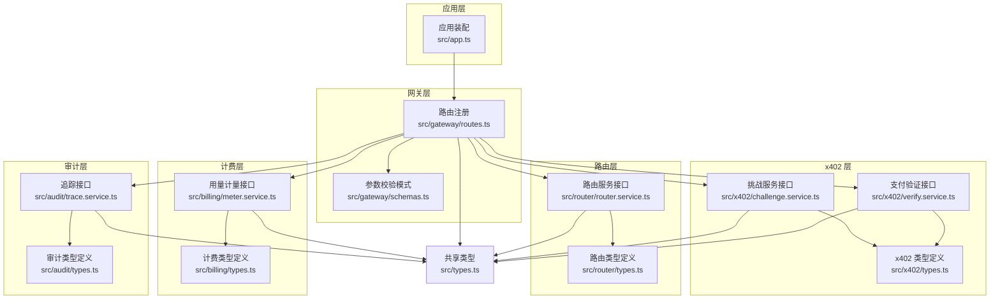
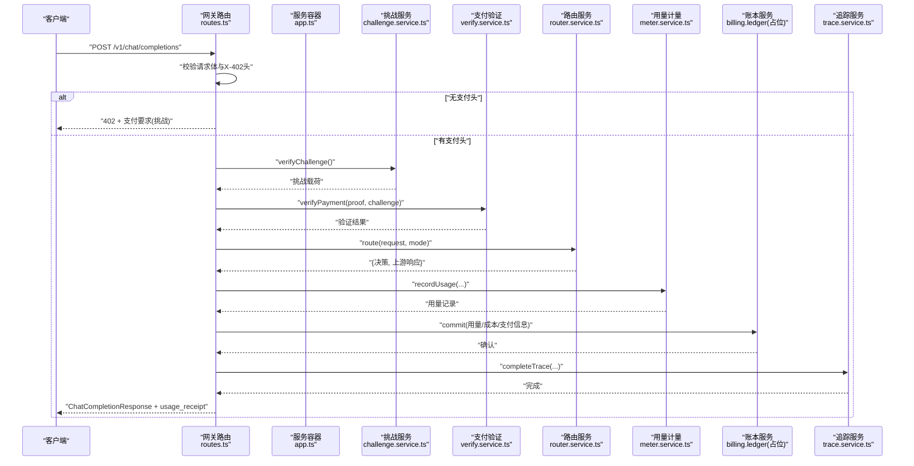
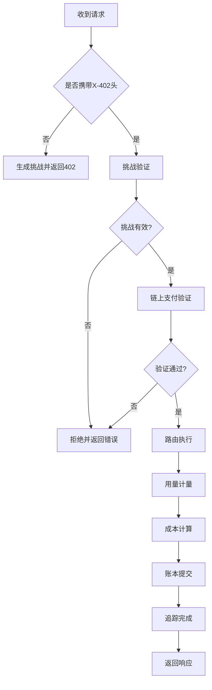
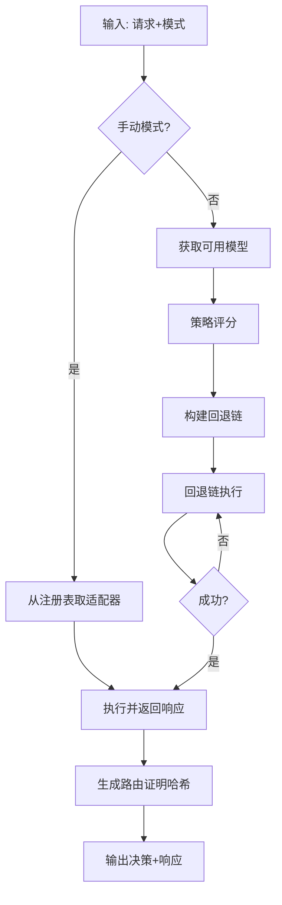
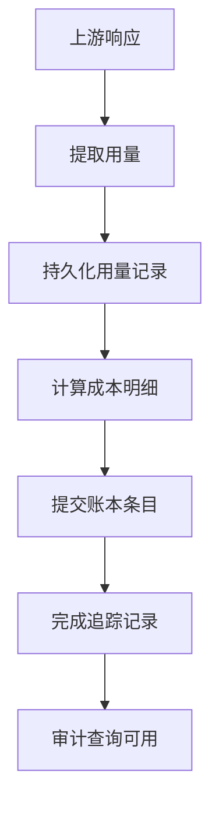
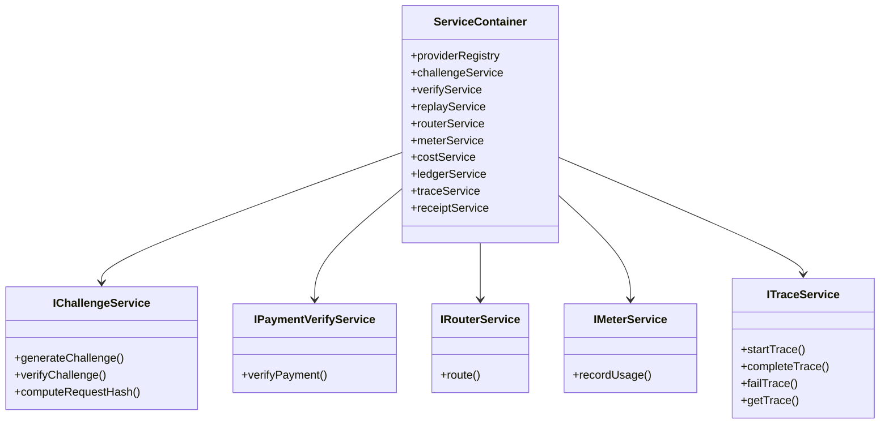
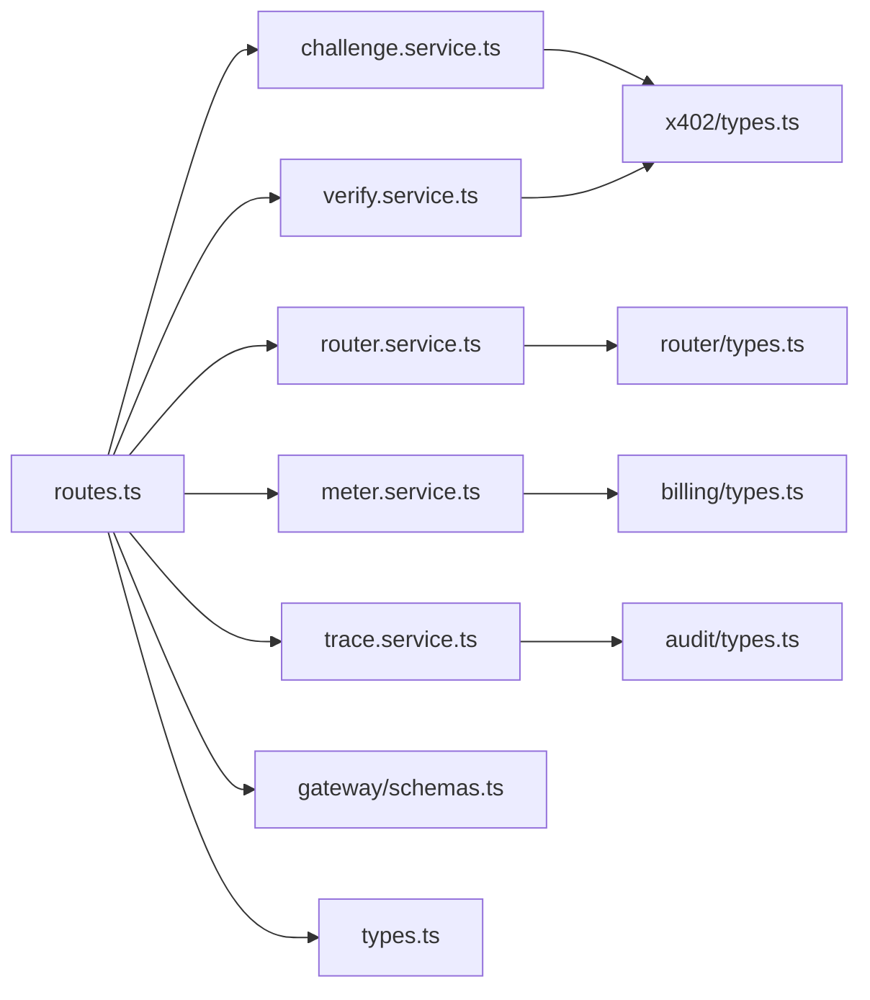

# 数据流设计

<cite>
**本文引用的文件**
- [src/app.ts](file://src/app.ts)
- [src/gateway/routes.ts](file://src/gateway/routes.ts)
- [src/gateway/schemas.ts](file://src/gateway/schemas.ts)
- [src/x402/challenge.service.ts](file://src/x402/challenge.service.ts)
- [src/x402/verify.service.ts](file://src/x402/verify.service.ts)
- [src/x402/types.ts](file://src/x402/types.ts)
- [src/router/router.service.ts](file://src/router/router.service.ts)
- [src/router/types.ts](file://src/router/types.ts)
- [src/billing/meter.service.ts](file://src/billing/meter.service.ts)
- [src/billing/types.ts](file://src/billing/types.ts)
- [src/audit/trace.service.ts](file://src/audit/trace.service.ts)
- [src/audit/types.ts](file://src/audit/types.ts)
- [src/types.ts](file://src/types.ts)
</cite>

## 目录
1. [简介](#简介)
2. [项目结构](#项目结构)
3. [核心组件](#核心组件)
4. [架构总览](#架构总览)
5. [详细组件分析](#详细组件分析)
6. [依赖关系分析](#依赖关系分析)
7. [性能考量](#性能考量)
8. [故障排查指南](#故障排查指南)
9. [结论](#结论)
10. [附录](#附录)

## 简介
本文件为 x402 Gateway 的数据流设计文档，聚焦以下三类关键数据流：
- 支付流程数据流：挑战生成 → 链上支付 → 验证 → 执行
- 路由决策数据流：请求解析 → 策略评分与候选构建 → 回退链执行 → 决策记录
- 计费审计数据流：用量计量 → 成本计算 → 账本提交 → 审计追踪

文档阐述请求在系统中的完整流转过程、关键数据转换节点与状态变化，解释数据在各组件间的传递方式、格式转换与验证机制，并给出异步处理模式、错误传播与回滚策略建议，辅以数据流图与关键路径分析。

## 项目结构
系统采用分层与功能域划分：
- 应用层：Fastify 应用装配与全局中间件/错误处理
- 网关层：路由注册、参数校验、HTTP 协议适配
- x402 层：挑战生成/校验、支付证明验证、重放防护接口占位
- 路由层：手动/自动路由决策、回退执行、决策元数据
- 计费层：用量计量、成本计算、账本持久化
- 审计层：请求追踪、收据查询、审计结果模型
- 共享类型：统一的领域模型与 API 响应结构

图表来源
- [src/app.ts:35-100](file://src/app.ts#L35-L100)
- [src/gateway/routes.ts:9-96](file://src/gateway/routes.ts#L9-L96)
- [src/gateway/schemas.ts:1-32](file://src/gateway/schemas.ts#L1-L32)
- [src/x402/challenge.service.ts:4-71](file://src/x402/challenge.service.ts#L4-L71)
- [src/x402/verify.service.ts:3-34](file://src/x402/verify.service.ts#L3-L34)
- [src/x402/types.ts:1-37](file://src/x402/types.ts#L1-L37)
- [src/router/router.service.ts:5-50](file://src/router/router.service.ts#L5-L50)
- [src/router/types.ts:1-22](file://src/router/types.ts#L1-L22)
- [src/billing/meter.service.ts:5-29](file://src/billing/meter.service.ts#L5-L29)
- [src/billing/types.ts:1-32](file://src/billing/types.ts#L1-L32)
- [src/audit/trace.service.ts:4-68](file://src/audit/trace.service.ts#L4-L68)
- [src/audit/types.ts:1-38](file://src/audit/types.ts#L1-L38)
- [src/types.ts:1-119](file://src/types.ts#L1-L119)

章节来源
- [src/app.ts:35-100](file://src/app.ts#L35-L100)
- [src/gateway/routes.ts:9-96](file://src/gateway/routes.ts#L9-L96)
- [src/gateway/schemas.ts:1-32](file://src/gateway/schemas.ts#L1-L32)
- [src/types.ts:1-119](file://src/types.ts#L1-L119)

## 核心组件
- 应用装配与服务容器：负责插件注册、钩子注入、全局错误处理以及服务实例化与注入
- 网关路由与参数校验：对 /v1/chat/completions 进行请求体与头部校验，按是否具备支付凭据决定挑战或支付流程
- x402 挑战与验证：挑战生成/校验、支付证明链上验证、重放保护接口占位
- 路由服务：根据手动/自动模式选择上游模型，构建回退链并执行，产出路由决策
- 计费服务：从上游响应提取用量并持久化，计算成本
- 审计服务：创建/完成/失败追踪，支持审计查询

章节来源
- [src/app.ts:21-33](file://src/app.ts#L21-L33)
- [src/gateway/routes.ts:23-67](file://src/gateway/routes.ts#L23-L67)
- [src/x402/challenge.service.ts:4-26](file://src/x402/challenge.service.ts#L4-L26)
- [src/x402/verify.service.ts:3-16](file://src/x402/verify.service.ts#L3-L16)
- [src/router/router.service.ts:5-18](file://src/router/router.service.ts#L5-L18)
- [src/billing/meter.service.ts:5-11](file://src/billing/meter.service.ts#L5-L11)
- [src/audit/trace.service.ts:4-36](file://src/audit/trace.service.ts#L4-L36)

## 架构总览
下图展示一次完整的支付驱动的聊天补全请求在系统内的数据流与组件交互。

图表来源
- [src/gateway/routes.ts:23-67](file://src/gateway/routes.ts#L23-L67)
- [src/x402/challenge.service.ts:19](file://src/x402/challenge.service.ts#L19)
- [src/x402/verify.service.ts:15](file://src/x402/verify.service.ts#L15)
- [src/router/router.service.ts:14-17](file://src/router/router.service.ts#L14-L17)
- [src/billing/meter.service.ts:10](file://src/billing/meter.service.ts#L10)
- [src/audit/trace.service.ts:15-29](file://src/audit/trace.service.ts#L15-L29)

## 详细组件分析

### 支付流程数据流（挑战生成 → 链上支付 → 验证 → 执行）
- 请求到达网关后，若缺少挑战/支付头则返回 402 并附带支付要求；否则进入支付验证阶段
- 挑战验证：校验签名、过期时间与请求哈希一致性
- 支付验证：通过链上 RPC 校验金额、资产与收款人
- 执行：路由到上游模型，计量用量，计算成本，提交账本，完成追踪

图表来源
- [src/gateway/routes.ts:29-67](file://src/gateway/routes.ts#L29-L67)
- [src/x402/challenge.service.ts:19](file://src/x402/challenge.service.ts#L19)
- [src/x402/verify.service.ts:15](file://src/x402/verify.service.ts#L15)
- [src/router/router.service.ts:14-17](file://src/router/router.service.ts#L14-L17)
- [src/billing/meter.service.ts:10](file://src/billing/meter.service.ts#L10)
- [src/audit/trace.service.ts:15-29](file://src/audit/trace.service.ts#L15-L29)

章节来源
- [src/gateway/routes.ts:23-67](file://src/gateway/routes.ts#L23-L67)
- [src/x402/challenge.service.ts:12-26](file://src/x402/challenge.service.ts#L12-L26)
- [src/x402/verify.service.ts:3-16](file://src/x402/verify.service.ts#L3-L16)

### 路由决策数据流
- 手动模式：直接从注册表获取适配器并执行
- 自动模式：评分候选模型，构建回退链，逐个尝试直至成功
- 输出：路由决策元数据（含回退链、评分摘要、路由证明哈希）

图表来源
- [src/router/router.service.ts:14-47](file://src/router/router.service.ts#L14-L47)
- [src/router/types.ts:1-22](file://src/router/types.ts#L1-L22)

章节来源
- [src/router/router.service.ts:5-18](file://src/router/router.service.ts#L5-L18)
- [src/router/types.ts:1-22](file://src/router/types.ts#L1-L22)

### 计费审计数据流
- 用量计量：从上游响应提取 token 数量并持久化
- 成本计算：基于单价与用量生成成本明细
- 账本提交：写入不可变账本条目
- 审计追踪：记录请求状态、路由决策、用量、成本与支付信息

图表来源
- [src/billing/meter.service.ts:10](file://src/billing/meter.service.ts#L10)
- [src/billing/types.ts:3-32](file://src/billing/types.ts#L3-L32)
- [src/audit/trace.service.ts:15-29](file://src/audit/trace.service.ts#L15-L29)
- [src/audit/types.ts:14-38](file://src/audit/types.ts#L14-L38)

章节来源
- [src/billing/meter.service.ts:5-11](file://src/billing/meter.service.ts#L5-L11)
- [src/billing/types.ts:1-32](file://src/billing/types.ts#L1-L32)
- [src/audit/trace.service.ts:4-36](file://src/audit/trace.service.ts#L4-L36)
- [src/audit/types.ts:1-38](file://src/audit/types.ts#L1-L38)

### 组件类图（接口与职责）

图表来源
- [src/app.ts:22-33](file://src/app.ts#L22-L33)
- [src/x402/challenge.service.ts:4](file://src/x402/challenge.service.ts#L4)
- [src/x402/verify.service.ts:3](file://src/x402/verify.service.ts#L3)
- [src/router/router.service.ts:5](file://src/router/router.service.ts#L5)
- [src/billing/meter.service.ts:5](file://src/billing/meter.service.ts#L5)
- [src/audit/trace.service.ts:4](file://src/audit/trace.service.ts#L4)

## 依赖关系分析
- 组件耦合：网关路由仅作为薄层处理器，依赖服务容器中的具体服务；服务间通过接口解耦
- 外部依赖：挑战签名使用 HMAC、支付验证使用链上 RPC、追踪与账本需数据库持久化
- 可能的循环依赖：当前未见直接循环导入；建议保持接口定义与实现分离，避免运行时循环

图表来源
- [src/gateway/routes.ts:1-96](file://src/gateway/routes.ts#L1-L96)
- [src/x402/challenge.service.ts:1-71](file://src/x402/challenge.service.ts#L1-L71)
- [src/x402/verify.service.ts:1-34](file://src/x402/verify.service.ts#L1-L34)
- [src/router/router.service.ts:1-50](file://src/router/router.service.ts#L1-L50)
- [src/billing/meter.service.ts:1-29](file://src/billing/meter.service.ts#L1-L29)
- [src/audit/trace.service.ts:1-68](file://src/audit/trace.service.ts#L1-L68)
- [src/gateway/schemas.ts:1-32](file://src/gateway/schemas.ts#L1-L32)
- [src/types.ts:1-119](file://src/types.ts#L1-L119)
- [src/x402/types.ts:1-37](file://src/x402/types.ts#L1-L37)
- [src/router/types.ts:1-22](file://src/router/types.ts#L1-L22)
- [src/billing/types.ts:1-32](file://src/billing/types.ts#L1-L32)
- [src/audit/types.ts:1-38](file://src/audit/types.ts#L1-L38)

章节来源
- [src/gateway/routes.ts:1-96](file://src/gateway/routes.ts#L1-L96)
- [src/app.ts:72-94](file://src/app.ts#L72-L94)

## 性能考量
- 异步与并发：路由执行与链上验证建议异步化，结合回退链减少单点阻塞
- 缓存与去重：重放保护可引入缓存层；幂等键用于请求去重
- 限流与熔断：全局速率限制已启用，建议在上游适配器层增加熔断与超时控制
- 序列化与哈希：请求哈希与路由证明哈希计算应避免重复开销，必要时进行缓存

## 故障排查指南
- 参数校验失败：Zod 错误映射为 400，检查请求体与头部字段
- 未实现路径：当前支付流程与审计查询处于占位状态，需按 TODO 注释逐步实现
- 错误传播：全局错误处理器将 AppError 映射为对应状态码，其他异常返回 500
- 追踪与审计：追踪状态包含 pending/completed/failed，便于定位问题阶段

章节来源
- [src/app.ts:53-70](file://src/app.ts#L53-L70)
- [src/gateway/routes.ts:31-67](file://src/gateway/routes.ts#L31-L67)
- [src/audit/trace.service.ts:31-36](file://src/audit/trace.service.ts#L31-L36)

## 结论
本文档梳理了 x402 Gateway 的三类核心数据流：支付流程、路由决策与计费审计。通过接口化设计与薄路由层，系统实现了高内聚低耦合的服务编排。建议优先补齐支付与审计相关 TODO 实现，并完善数据库与缓存基础设施，以支撑生产级的异步处理、错误传播与回滚策略。

## 附录
- 关键类型与响应结构参考：
  - x402 类型：挑战载荷、支付证明、支付要求、验证结果
  - 路由类型：路由决策、候选模型、路由上下文
  - 计费类型：用量记录、成本明细、账本条目
  - 审计类型：请求追踪、审计查询结果
- API 规范与示例可参考项目文档目录下的规范文件

章节来源
- [src/x402/types.ts:1-37](file://src/x402/types.ts#L1-L37)
- [src/router/types.ts:1-22](file://src/router/types.ts#L1-L22)
- [src/billing/types.ts:1-32](file://src/billing/types.ts#L1-L32)
- [src/audit/types.ts:1-38](file://src/audit/types.ts#L1-L38)
- [src/types.ts:42-62](file://src/types.ts#L42-L62)