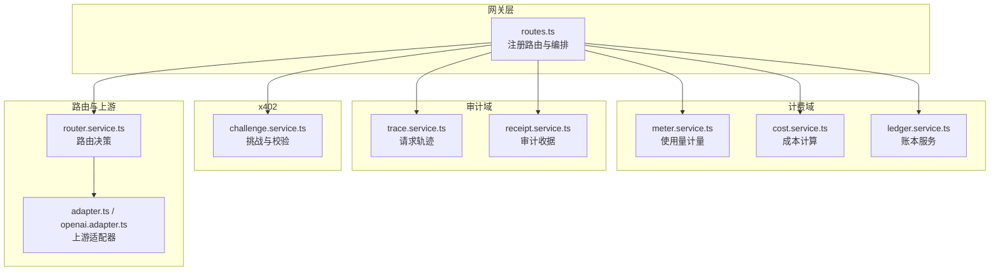
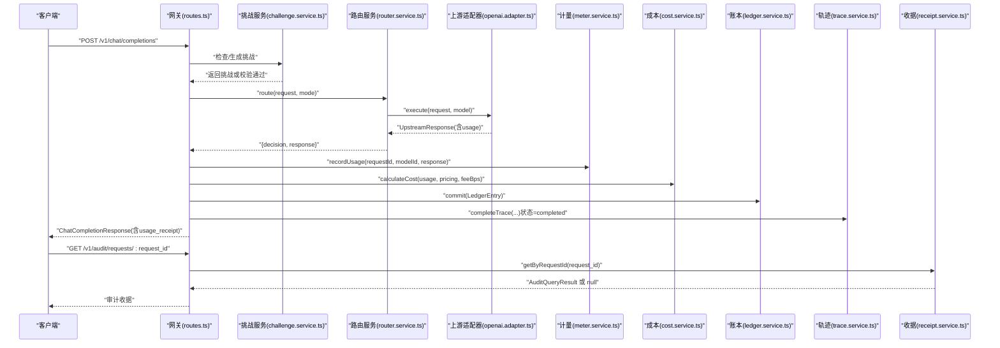
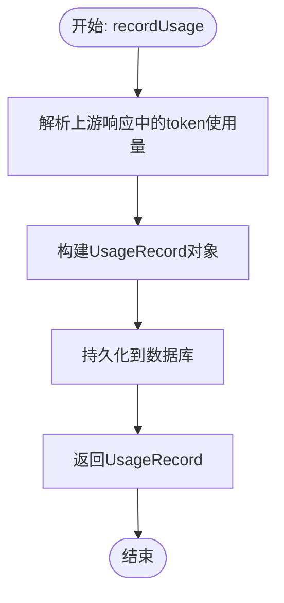
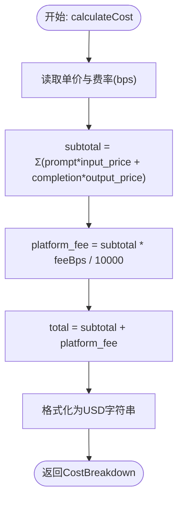
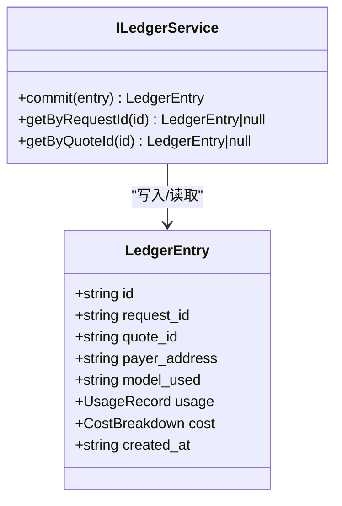
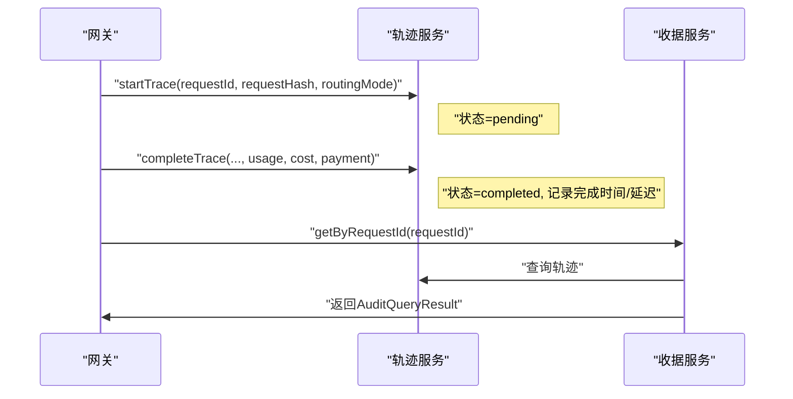
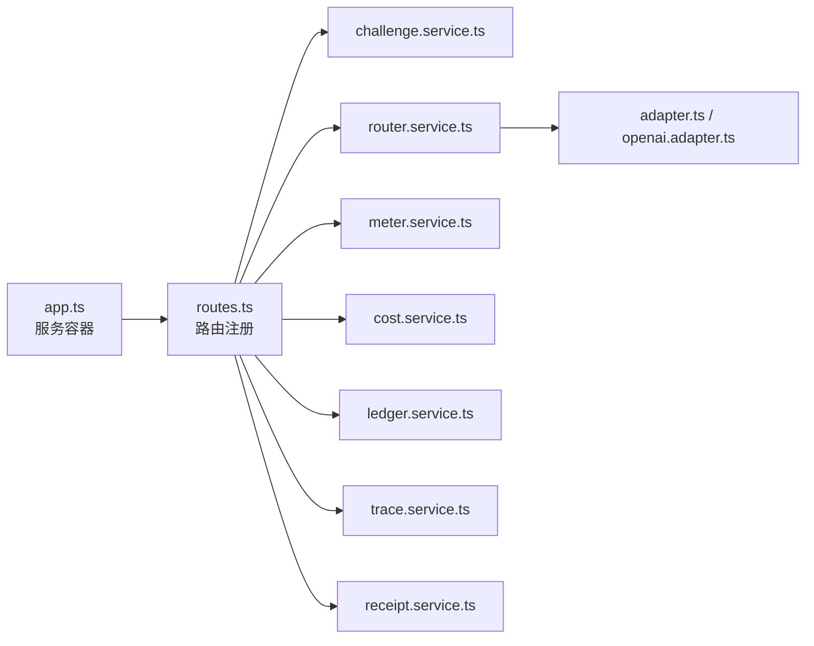
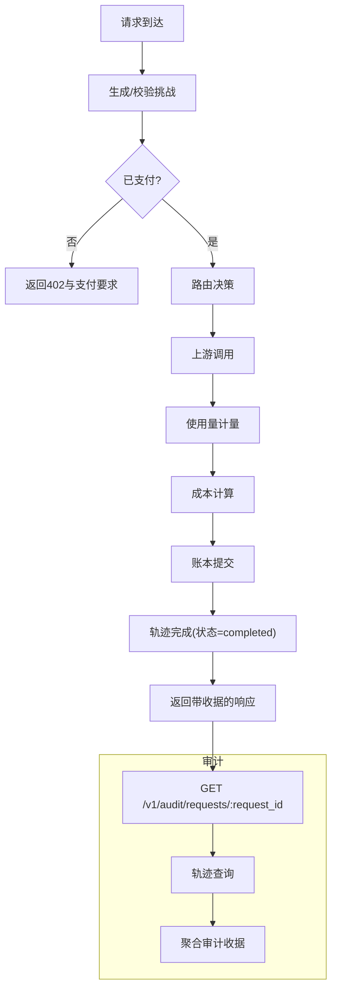

# 计费审计数据流

<cite>
**本文档引用的文件**
- [src/billing/index.ts](file://src/billing/index.ts)
- [src/billing/types.ts](file://src/billing/types.ts)
- [src/billing/meter.service.ts](file://src/billing/meter.service.ts)
- [src/billing/cost.service.ts](file://src/billing/cost.service.ts)
- [src/billing/ledger.service.ts](file://src/billing/ledger.service.ts)
- [src/audit/index.ts](file://src/audit/index.ts)
- [src/audit/types.ts](file://src/audit/types.ts)
- [src/audit/receipt.service.ts](file://src/audit/receipt.service.ts)
- [src/audit/trace.service.ts](file://src/audit/trace.service.ts)
- [src/gateway/routes.ts](file://src/gateway/routes.ts)
- [src/app.ts](file://src/app.ts)
- [src/types.ts](file://src/types.ts)
- [src/x402/challenge.service.ts](file://src/x402/challenge.service.ts)
- [src/router/router.service.ts](file://src/router/router.service.ts)
- [src/provider/adapter.ts](file://src/provider/adapter.ts)
- [src/provider/openai.adapter.ts](file://src/provider/openai.adapter.ts)
- [test/integration/flow.test.ts](file://test/integration/flow.test.ts)
</cite>

## 目录
1. [引言](#引言)
2. [项目结构](#项目结构)
3. [核心组件](#核心组件)
4. [架构总览](#架构总览)
5. [详细组件分析](#详细组件分析)
6. [依赖关系分析](#依赖关系分析)
7. [性能考虑](#性能考虑)
8. [故障排除指南](#故障排除指南)
9. [结论](#结论)
10. [附录](#附录)

## 引言
本文件面向计费与审计流程，系统性梳理从“使用量计量”到“成本计算”、“账本记录”再到“审计证据生成”的完整数据流。重点覆盖以下方面：
- 使用量计量（usage metering）：从上游响应中提取 token 数并持久化
- 实时成本计算（cost calculation）：基于模型定价与费率计算确定性费用
- 账本条目生成（ledger entry creation）：不可变账本的追加式写入与查询
- 审计证据生成（audit evidence）：请求轨迹、路由决策、用量、成本与支付信息的聚合
- 时间戳同步、精度控制与一致性保证策略
- 收据生成的数据结构、审计查询的数据访问模式与结算报告的数据聚合思路
- 计费生命周期与审计轨迹的数据流图

## 项目结构
该系统采用分层与按功能域划分的组织方式：
- 网关层（gateway）：注册路由、参数校验、编排服务调用
- 计费域（billing）：计量、成本计算、账本服务
- 审计域（audit）：请求轨迹、收据服务
- x402 支付与重放保护（x402）
- 路由与上游适配（router、provider）

图表来源
- [src/gateway/routes.ts:9-96](file://src/gateway/routes.ts#L9-L96)
- [src/billing/meter.service.ts:13-28](file://src/billing/meter.service.ts#L13-L28)
- [src/billing/cost.service.ts:16-31](file://src/billing/cost.service.ts#L16-L31)
- [src/billing/ledger.service.ts:17-41](file://src/billing/ledger.service.ts#L17-L41)
- [src/audit/trace.service.ts:38-67](file://src/audit/trace.service.ts#L38-L67)
- [src/audit/receipt.service.ts:14-25](file://src/audit/receipt.service.ts#L14-L25)
- [src/x402/challenge.service.ts:28-70](file://src/x402/challenge.service.ts#L28-L70)
- [src/router/router.service.ts:20-49](file://src/router/router.service.ts#L20-L49)
- [src/provider/adapter.ts:10-15](file://src/provider/adapter.ts#L10-L15)
- [src/provider/openai.adapter.ts:10-43](file://src/provider/openai.adapter.ts#L10-L43)

章节来源
- [src/gateway/routes.ts:9-96](file://src/gateway/routes.ts#L9-L96)
- [src/app.ts:35-100](file://src/app.ts#L35-L100)

## 核心组件
- 计费类型与接口
  - 使用量记录（UsageRecord）：包含请求 ID、模型 ID、prompt/completion/total tokens
  - 成本明细（CostBreakdown）：子合计、平台费用、总计，以及输入/输出单价
  - 账本条目（LedgerEntry）：不可变追加写入，包含请求 ID、报价 ID、付款人地址、模型、用量、成本与时间戳
- 审计类型与接口
  - 请求轨迹（RequestTrace）：请求哈希、路由模式、状态、完成时间、延迟等
  - 审计查询结果（AuditQueryResult）：路由决策、用量、成本、支付信息的聚合结构
- 服务接口
  - 计费：IMeterService、ICostService、ILedgerService
  - 审计：ITraceService、IReceiptService
  - x402：IChallengeService
  - 路由：IRouterService
  - 上游适配：ProviderAdapter 抽象类

章节来源
- [src/billing/types.ts:3-31](file://src/billing/types.ts#L3-L31)
- [src/audit/types.ts:3-37](file://src/audit/types.ts#L3-L37)
- [src/billing/meter.service.ts:5-11](file://src/billing/meter.service.ts#L5-L11)
- [src/billing/cost.service.ts:4-14](file://src/billing/cost.service.ts#L4-L14)
- [src/billing/ledger.service.ts:3-15](file://src/billing/ledger.service.ts#L3-L15)
- [src/audit/trace.service.ts:4-36](file://src/audit/trace.service.ts#L4-L36)
- [src/audit/receipt.service.ts:4-12](file://src/audit/receipt.service.ts#L4-L12)
- [src/x402/challenge.service.ts:4-26](file://src/x402/challenge.service.ts#L4-L26)
- [src/router/router.service.ts:5-17](file://src/router/router.service.ts#L5-L17)
- [src/provider/adapter.ts:10-15](file://src/provider/adapter.ts#L10-L15)

## 架构总览
下图展示一次完整的计费审计数据流：从网关接收请求、x402 挑战与验证、路由决策、上游调用、使用量计量、成本计算、账本提交、轨迹完成，最终返回带收据的响应，并支持审计查询。

图表来源
- [src/gateway/routes.ts:23-67](file://src/gateway/routes.ts#L23-L67)
- [src/x402/challenge.service.ts:36-68](file://src/x402/challenge.service.ts#L36-L68)
- [src/router/router.service.ts:27-46](file://src/router/router.service.ts#L27-L46)
- [src/provider/openai.adapter.ts:25-33](file://src/provider/openai.adapter.ts#L25-L33)
- [src/billing/meter.service.ts:15-25](file://src/billing/meter.service.ts#L15-L25)
- [src/billing/cost.service.ts:18-28](file://src/billing/cost.service.ts#L18-L28)
- [src/billing/ledger.service.ts:19-28](file://src/billing/ledger.service.ts#L19-L28)
- [src/audit/trace.service.ts:49-54](file://src/audit/trace.service.ts#L49-L54)
- [src/audit/receipt.service.ts:16-22](file://src/audit/receipt.service.ts#L16-L22)

## 详细组件分析

### 使用量计量（Usage Metering）
- 输入：请求 ID、模型 ID、上游响应（包含 token usage）
- 处理：解析 prompt/completion/total tokens，构建 UsageRecord
- 输出：持久化后的 UsageRecord
- 关键点：实现应确保幂等与可追溯；数据库写入后返回完整记录用于后续成本计算

图表来源
- [src/billing/meter.service.ts:15-25](file://src/billing/meter.service.ts#L15-L25)

章节来源
- [src/billing/meter.service.ts:5-11](file://src/billing/meter.service.ts#L5-L11)
- [src/billing/types.ts:3-10](file://src/billing/types.ts#L3-L10)

### 实时成本计算（Cost Calculation）
- 输入：UsageRecord、模型定价（含输入/输出单价）、平台费率（bps）
- 处理：确定性计算子合计、平台费用与总计；所有数值以字符串形式表示美元
- 输出：CostBreakdown
- 关键点：必须可复现，相同输入始终产生相同输出；字符串格式便于避免浮点误差

图表来源
- [src/billing/cost.service.ts:18-28](file://src/billing/cost.service.ts#L18-L28)
- [src/billing/types.ts:12-19](file://src/billing/types.ts#L12-L19)

章节来源
- [src/billing/cost.service.ts:4-14](file://src/billing/cost.service.ts#L4-L14)
- [src/types.ts:68-72](file://src/types.ts#L68-L72)

### 账本条目生成（Ledger Entry Creation）
- 写入策略：仅追加写入，永不更新或删除；任何补偿通过新增条目实现
- 字段要求：自动生成唯一 ID，设置创建时间戳，包含请求 ID、报价 ID、付款人地址、模型、用量、成本
- 查询接口：按 request_id 或 quote_id 查询单条记录
- 关键点：不可变性保障审计一致性；时间戳用于排序与对账

图表来源
- [src/billing/types.ts:21-31](file://src/billing/types.ts#L21-L31)
- [src/billing/ledger.service.ts:3-15](file://src/billing/ledger.service.ts#L3-L15)

章节来源
- [src/billing/ledger.service.ts:3-15](file://src/billing/ledger.service.ts#L3-L15)
- [src/billing/types.ts:21-31](file://src/billing/types.ts#L21-L31)

### 审计证据生成（Audit Evidence）
- 请求轨迹（Trace）：初始状态 pending，完成后填充路由决策、用量、成本、支付信息并标记完成；失败时记录原因
- 审计收据（Receipt）：按 request_id 聚合轨迹、路由决策、用量、成本与支付信息，返回标准化结构
- 关键点：轨迹与收据解耦，轨迹负责运行时状态，收据负责审计查询时的只读聚合

图表来源
- [src/audit/trace.service.ts:38-66](file://src/audit/trace.service.ts#L38-L66)
- [src/audit/receipt.service.ts:14-25](file://src/audit/receipt.service.ts#L14-L25)
- [src/audit/types.ts:14-37](file://src/audit/types.ts#L14-L37)

章节来源
- [src/audit/trace.service.ts:4-36](file://src/audit/trace.service.ts#L4-L36)
- [src/audit/receipt.service.ts:4-12](file://src/audit/receipt.service.ts#L4-L12)
- [src/audit/types.ts:3-37](file://src/audit/types.ts#L3-L37)

### 收据生成的数据结构
- AuditQueryResult 字段包括：请求 ID、请求哈希、路由模式、路由决策（选型模型、回退链、评分摘要）、用量、成本（子合计、平台费用、总计）、支付（报价 ID、链、资产、付款人地址、验证状态）
- 该结构直接映射到 API 规范第 5 节的审计查询响应形态

章节来源
- [src/audit/types.ts:14-37](file://src/audit/types.ts#L14-L37)
- [src/types.ts:110-118](file://src/types.ts#L110-L118)

### 审计查询的数据访问模式
- 单请求查询：按 request_id 聚合轨迹、路由决策、用量、成本与支付信息
- 返回空值：当 request_id 不存在时返回 null
- 适用场景：合规审计、争议处理、用户对账

章节来源
- [src/audit/receipt.service.ts:11-12](file://src/audit/receipt.service.ts#L11-L12)
- [src/gateway/routes.ts:82-94](file://src/gateway/routes.ts#L82-L94)

### 结算报告的数据聚合
- 建议维度：按模型、按报价 ID、按付款人地址、按日期范围
- 聚合指标：总用量（prompt/completion/total）、总子合计、平台费用、总计
- 一致性保证：基于账本条目的不可变性与时间戳排序，确保跨周期对账稳定

章节来源
- [src/billing/ledger.service.ts:10-14](file://src/billing/ledger.service.ts#L10-L14)
- [src/billing/types.ts:21-31](file://src/billing/types.ts#L21-L31)

## 依赖关系分析
- 组件耦合
  - 网关层通过服务容器注入各领域服务，保持路由处理器的薄逻辑
  - 计费域内部顺序依赖：计量 → 成本 → 账本
  - 审计域在计费完成后参与，不改变计费数据，仅补充证据
- 外部依赖
  - 数据库：账本与轨迹持久化（待实现）
  - 缓存：重放保护（Redis，待实现）
  - 上游适配器：OpenAI 兼容接口

图表来源
- [src/app.ts:77-94](file://src/app.ts#L77-L94)
- [src/gateway/routes.ts:9-96](file://src/gateway/routes.ts#L9-L96)

章节来源
- [src/app.ts:21-33](file://src/app.ts#L21-L33)
- [src/gateway/routes.ts:9-96](file://src/gateway/routes.ts#L9-L96)

## 性能考虑
- 计算性能
  - 成本计算为纯内存运算，复杂度低；建议批量处理时注意并发与限流
- 存储性能
  - 账本与轨迹采用追加写入，具备良好写入吞吐；查询需在 request_id 与 quote_id 上建立索引
- 网络性能
  - 上游适配器执行外部 HTTP 请求，建议启用连接池、超时与重试策略
- 一致性与延迟
  - 账本写入与轨迹完成应在同一批事务中或通过强一致存储保障；审计查询走只读副本降低写入压力

## 故障排除指南
- 常见错误与定位
  - 402 未支付：检查挑战生成与校验流程，确认请求哈希与过期时间
  - 501 未实现：当前路由中存在 TODO，需按注释逐步实现支付、计量、成本、账本与轨迹流程
  - 审计查询 404：确认 request_id 是否存在于轨迹表；若不存在返回 null
- 日志与追踪
  - 使用全局错误处理器与请求追踪钩子，确保异常与请求上下文可被记录

章节来源
- [src/gateway/routes.ts:30-66](file://src/gateway/routes.ts#L30-L66)
- [src/gateway/routes.ts:82-94](file://src/gateway/routes.ts#L82-L94)
- [src/app.ts:52-70](file://src/app.ts#L52-L70)
- [test/integration/flow.test.ts:20-36](file://test/integration/flow.test.ts#L20-L36)

## 结论
本文档系统化描述了从使用量计量到成本计算、账本记录与审计证据生成的完整数据流。通过明确的类型定义、服务接口与数据结构，结合可复现的成本计算与不可变账本，为合规审计与对账提供了坚实基础。后续实现应优先补齐各 TODO 模块，并完善数据库与缓存的基础设施配置。

## 附录

### 计费生命周期与审计轨迹数据流图

图表来源
- [src/gateway/routes.ts:14-22](file://src/gateway/routes.ts#L14-L22)
- [src/x402/challenge.service.ts:36-59](file://src/x402/challenge.service.ts#L36-L59)
- [src/router/router.service.ts:27-46](file://src/router/router.service.ts#L27-L46)
- [src/provider/openai.adapter.ts:25-33](file://src/provider/openai.adapter.ts#L25-L33)
- [src/billing/meter.service.ts:15-25](file://src/billing/meter.service.ts#L15-L25)
- [src/billing/cost.service.ts:18-28](file://src/billing/cost.service.ts#L18-L28)
- [src/billing/ledger.service.ts:19-28](file://src/billing/ledger.service.ts#L19-L28)
- [src/audit/trace.service.ts:49-54](file://src/audit/trace.service.ts#L49-L54)
- [src/audit/receipt.service.ts:16-22](file://src/audit/receipt.service.ts#L16-L22)