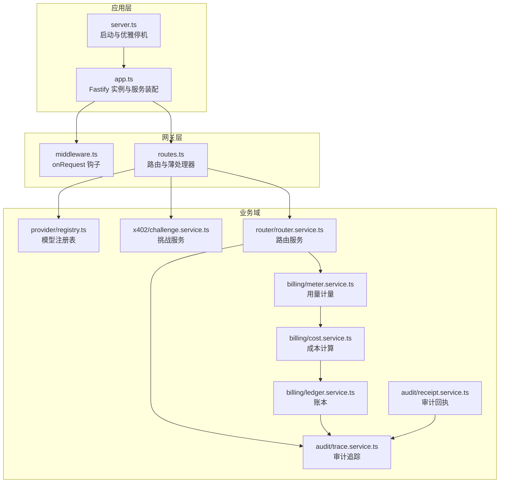
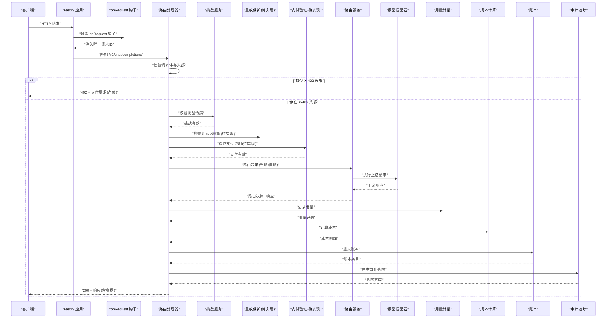
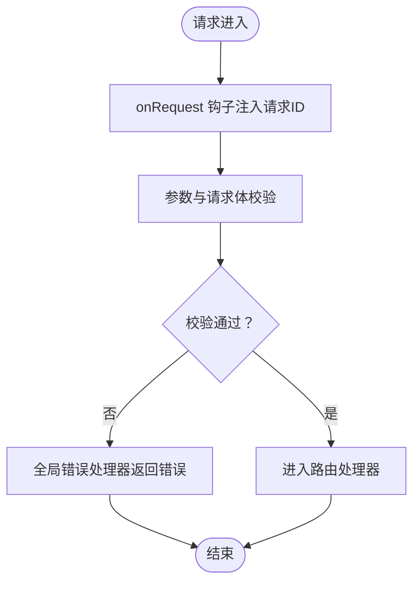
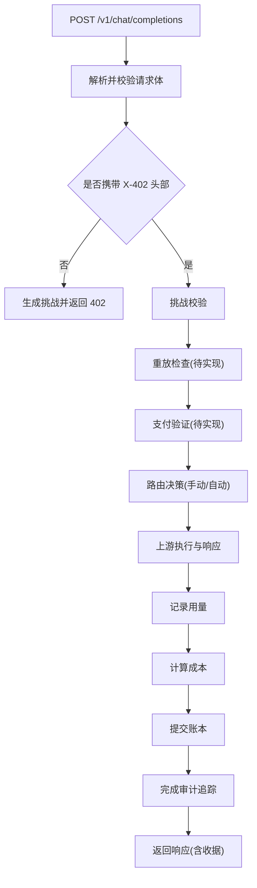
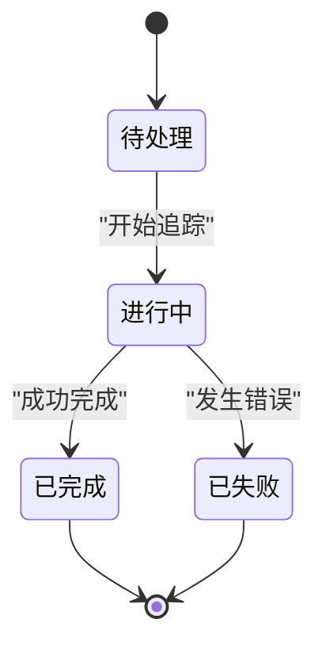
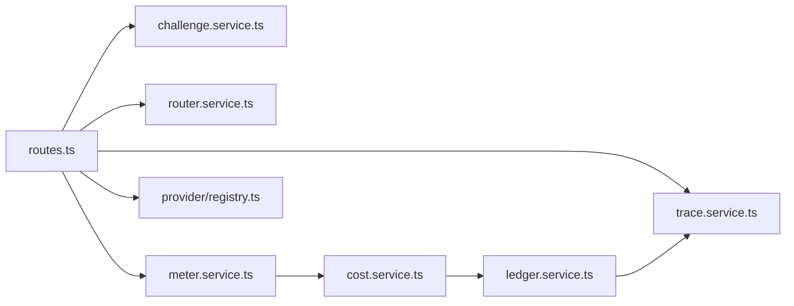

# 请求生命周期数据流

<cite>
**本文档引用的文件**
- [src/app.ts](file://src/app.ts)
- [src/server.ts](file://src/server.ts)
- [src/gateway/middleware.ts](file://src/gateway/middleware.ts)
- [src/gateway/routes.ts](file://src/gateway/routes.ts)
- [src/errors.ts](file://src/errors.ts)
- [src/types.ts](file://src/types.ts)
- [src/config.ts](file://src/config.ts)
- [src/x402/challenge.service.ts](file://src/x402/challenge.service.ts)
- [src/router/router.service.ts](file://src/router/router.service.ts)
- [src/billing/meter.service.ts](file://src/billing/meter.service.ts)
- [src/billing/cost.service.ts](file://src/billing/cost.service.ts)
- [src/billing/ledger.service.ts](file://src/billing/ledger.service.ts)
- [src/audit/trace.service.ts](file://src/audit/trace.service.ts)
- [src/audit/receipt.service.ts](file://src/audit/receipt.service.ts)
- [src/provider/registry.ts](file://src/provider/registry.ts)
</cite>

## 目录
1. [简介](#简介)
2. [项目结构](#项目结构)
3. [核心组件](#核心组件)
4. [架构总览](#架构总览)
5. [详细组件分析](#详细组件分析)
6. [依赖关系分析](#依赖关系分析)
7. [性能考量](#性能考量)
8. [故障排查指南](#故障排查指南)
9. [结论](#结论)
10. [附录](#附录)

## 简介
本文件围绕请求在系统中的完整生命周期，系统性梳理从请求进入、中间件处理链、业务执行到响应返回的全过程数据流。重点覆盖：
- 请求上下文创建与传递（唯一请求ID、路由参数解析、头部校验）
- 中间件与全局错误处理机制
- 业务流程（挑战生成与校验、支付验证、路由决策、用量计量、计费与账本、审计追踪）
- 并发隔离、资源清理与优雅停机
- 请求状态机与关键时间点的数据快照

## 项目结构
系统采用分层与功能域划分：
- 应用入口与服务装配：应用实例构建、插件注册、钩子注入、全局错误处理、服务容器装配
- 网关层：路由定义、参数与请求体校验、X-402 支付流程入口
- 业务域：挑战服务、路由服务、计费与账本、用量计量、审计追踪与回执
- 基础设施：配置加载、类型定义、错误体系

图表来源
- [src/server.ts:1-33](file://src/server.ts#L1-L33)
- [src/app.ts:35-100](file://src/app.ts#L35-L100)
- [src/gateway/middleware.ts:1-13](file://src/gateway/middleware.ts#L1-L13)
- [src/gateway/routes.ts:1-96](file://src/gateway/routes.ts#L1-L96)
- [src/provider/registry.ts:1-65](file://src/provider/registry.ts#L1-L65)
- [src/x402/challenge.service.ts:1-71](file://src/x402/challenge.service.ts#L1-L71)
- [src/router/router.service.ts:1-50](file://src/router/router.service.ts#L1-L50)
- [src/billing/meter.service.ts:1-29](file://src/billing/meter.service.ts#L1-L29)
- [src/billing/cost.service.ts:1-32](file://src/billing/cost.service.ts#L1-L32)
- [src/billing/ledger.service.ts:1-42](file://src/billing/ledger.service.ts#L1-L42)
- [src/audit/trace.service.ts:1-68](file://src/audit/trace.service.ts#L1-L68)
- [src/audit/receipt.service.ts:1-26](file://src/audit/receipt.service.ts#L1-L26)

章节来源
- [src/server.ts:1-33](file://src/server.ts#L1-L33)
- [src/app.ts:35-100](file://src/app.ts#L35-L100)

## 核心组件
- 应用实例与服务容器
  - 构建 Fastify 实例，注册 CORS、安全头、限流、通用工具等插件
  - 注入 onRequest 钩子生成唯一请求ID
  - 全局错误处理器统一转换 AppError 与 Zod 错误为标准响应
  - 组装服务容器（挑战、支付验证、重放保护、路由、计量、计费、账本、审计追踪、回执）
- 路由与薄处理器
  - 定义 /v1/chat/completions、/v1/models、/v1/audit/requests/:request_id 等端点
  - 对请求体与路径参数进行模式校验
  - X-402 流程入口：无支付头则返回 402 挑战；有支付头则进入验证与执行流程
- 业务服务
  - 挑战服务：生成与校验挑战令牌、计算请求哈希
  - 路由服务：手动/自动模式下的模型选择与降级链路
  - 计量服务：从上游响应提取 token 数并持久化
  - 成本服务：基于用量与定价的确定性计费
  - 账本服务：追加式写入、按 request_id/quote_id 查询
  - 审计追踪：记录请求生命周期状态、耗时与最终结果
  - 回执服务：按 request_id 汇总审计证据

章节来源
- [src/app.ts:21-100](file://src/app.ts#L21-L100)
- [src/gateway/routes.ts:1-96](file://src/gateway/routes.ts#L1-L96)
- [src/x402/challenge.service.ts:1-71](file://src/x402/challenge.service.ts#L1-L71)
- [src/router/router.service.ts:1-50](file://src/router/router.service.ts#L1-L50)
- [src/billing/meter.service.ts:1-29](file://src/billing/meter.service.ts#L1-L29)
- [src/billing/cost.service.ts:1-32](file://src/billing/cost.service.ts#L1-L32)
- [src/billing/ledger.service.ts:1-42](file://src/billing/ledger.service.ts#L1-L42)
- [src/audit/trace.service.ts:1-68](file://src/audit/trace.service.ts#L1-L68)
- [src/audit/receipt.service.ts:1-26](file://src/audit/receipt.service.ts#L1-L26)

## 架构总览
下图展示一次典型聊天补全请求的端到端数据流，包括请求进入、中间件、路由处理、业务服务调用、响应返回与审计追踪。

图表来源
- [src/gateway/middleware.ts:9-12](file://src/gateway/middleware.ts#L9-L12)
- [src/gateway/routes.ts:23-67](file://src/gateway/routes.ts#L23-L67)
- [src/x402/challenge.service.ts:35-69](file://src/x402/challenge.service.ts#L35-L69)
- [src/router/router.service.ts:26-48](file://src/router/router.service.ts#L26-L48)
- [src/billing/meter.service.ts:14-27](file://src/billing/meter.service.ts#L14-L27)
- [src/billing/cost.service.ts:16-31](file://src/billing/cost.service.ts#L16-L31)
- [src/billing/ledger.service.ts:17-41](file://src/billing/ledger.service.ts#L17-L41)
- [src/audit/trace.service.ts:38-67](file://src/audit/trace.service.ts#L38-L67)

## 详细组件分析

### 请求接收与初始化
- 请求进入：Fastify 实例监听配置端口与主机地址
- 初始化钩子：onRequest 钩子为每个请求注入唯一请求ID，便于跨服务追踪
- 全局错误处理：捕获 AppError 与 Zod 校验错误，转换为标准响应；其他异常记录日志后返回通用内部错误

图表来源
- [src/server.ts:8-15](file://src/server.ts#L8-L15)
- [src/gateway/middleware.ts:9-12](file://src/gateway/middleware.ts#L9-L12)
- [src/app.ts:53-70](file://src/app.ts#L53-L70)

章节来源
- [src/server.ts:1-33](file://src/server.ts#L1-L33)
- [src/gateway/middleware.ts:1-13](file://src/gateway/middleware.ts#L1-L13)
- [src/app.ts:52-70](file://src/app.ts#L52-L70)

### 中间件处理链
- 插件注册：CORS、安全头、限流、通用工具
- 钩子：onRequest 注入请求ID，确保后续服务可读取 request.id
- 全局错误：统一错误映射与响应格式，支持扩展字段（如 402 的支付要求）

章节来源
- [src/app.ts:43-70](file://src/app.ts#L43-L70)

### 业务逻辑执行与响应生成
- /v1/chat/completions
  - 无 X-402 头部：返回 402，并附带支付要求（占位信息）
  - 有 X-402 头部：按 TODO 注释顺序调用挑战校验、重放检查、支付验证、路由、计量、计费、账本、审计追踪，最终返回包含 usage_receipt 的响应
- /v1/models：查询可用模型目录
- /v1/audit/requests/:request_id：按 request_id 汇总审计证据（占位）

图表来源
- [src/gateway/routes.ts:23-67](file://src/gateway/routes.ts#L23-L67)

章节来源
- [src/gateway/routes.ts:1-96](file://src/gateway/routes.ts#L1-L96)

### 请求上下文与数据传递
- 请求ID：由 onRequest 钩子生成并挂载到 request.id，贯穿所有下游服务
- 类型与模式：共享类型定义与 Zod 模式用于请求体与路径参数校验，保证输入一致性
- 服务容器：将挑战、路由、计量、计费、账本、审计等服务注入到路由处理器，避免全局状态

章节来源
- [src/gateway/middleware.ts:9-12](file://src/gateway/middleware.ts#L9-L12)
- [src/types.ts:1-119](file://src/types.ts#L1-L119)
- [src/app.ts:77-94](file://src/app.ts#L77-L94)

### 异常处理与错误传播
- AppError 分类：涵盖 402（缺少支付、过期、金额不足、重放）、400（请求哈希不匹配）、503/504（上游不可用/超时）、500（内部错误）
- 错误到响应：errorToResponse 将 AppError 映射为 API 响应结构，402 场景可附加支付要求
- 全局错误处理器：捕获 AppError 与 ZodError，其余异常记录日志并返回通用 500

章节来源
- [src/errors.ts:6-105](file://src/errors.ts#L6-L105)
- [src/app.ts:53-70](file://src/app.ts#L53-L70)

### 资源清理与连接管理
- 优雅停机：监听 SIGINT/SIGTERM，关闭应用实例；数据库与缓存连接预留关闭位置（待实现）
- 连接管理：应用启动时预留 Redis 与 PostgreSQL 初始化位置（待实现）

章节来源
- [src/server.ts:16-26](file://src/server.ts#L16-L26)
- [src/app.ts:73-75](file://src/app.ts#L73-L75)

### 并发请求处理与数据隔离
- 请求隔离：每个请求拥有独立的请求ID与上下文，服务之间通过显式参数传递，避免共享可变状态
- 并发安全：路由与账本采用追加式写入策略，避免并发更新冲突
- 重放保护：预留重放保护服务接口，防止同一支付证明被重复消费

章节来源
- [src/gateway/middleware.ts:9-12](file://src/gateway/middleware.ts#L9-L12)
- [src/billing/ledger.service.ts:17-41](file://src/billing/ledger.service.ts#L17-L41)
- [src/router/router.service.ts:26-48](file://src/router/router.service.ts#L26-L48)

### 请求超时管理与内存使用监控
- 超时策略：当前未见显式超时配置；建议在上游适配器与外部调用处设置超时与重试
- 内存监控：建议结合 Node.js 监控指标与日志记录，对峰值内存与 GC 行为进行观测

章节来源
- [src/app.ts:44-47](file://src/app.ts#L44-L47)

### 请求状态机与关键时间点快照
- 状态：pending → completed 或 failed
- 关键时间点：
  - pending：请求到达，开始追踪
  - completed：路由决策、用量、成本、支付信息、账本提交完成
  - failed：任一环节失败，记录失败原因
- 快照内容：请求哈希、路由模式、所选模型、降级链、token 数、成本明细、支付信息、账本标识等

图表来源
- [src/audit/trace.service.ts:38-67](file://src/audit/trace.service.ts#L38-L67)

章节来源
- [src/audit/trace.service.ts:4-36](file://src/audit/trace.service.ts#L4-L36)

## 依赖关系分析
- 组件耦合
  - 路由处理器依赖服务容器中的各业务服务
  - 路由服务依赖模型注册表与上游适配器
  - 计费与账本依赖用量计量与定价信息
  - 审计追踪贯穿全流程，作为只增写入的证据存储
- 外部依赖
  - Fastify 作为运行时框架
  - Zod 用于输入校验
  - 环境变量与 dotenv 提供配置加载

图表来源
- [src/gateway/routes.ts:1-96](file://src/gateway/routes.ts#L1-L96)
- [src/x402/challenge.service.ts:1-71](file://src/x402/challenge.service.ts#L1-L71)
- [src/router/router.service.ts:1-50](file://src/router/router.service.ts#L1-L50)
- [src/billing/meter.service.ts:1-29](file://src/billing/meter.service.ts#L1-L29)
- [src/billing/cost.service.ts:1-32](file://src/billing/cost.service.ts#L1-L32)
- [src/billing/ledger.service.ts:1-42](file://src/billing/ledger.service.ts#L1-L42)
- [src/audit/trace.service.ts:1-68](file://src/audit/trace.service.ts#L1-L68)
- [src/provider/registry.ts:1-65](file://src/provider/registry.ts#L1-L65)

章节来源
- [src/app.ts:77-94](file://src/app.ts#L77-L94)

## 性能考量
- 并发与吞吐：启用限流插件，合理设置窗口与上限以平衡安全与性能
- 路由与上游：在路由服务中引入超时与重试策略，避免单点阻塞
- 数据持久化：账本与审计追踪采用追加写入，减少锁竞争；批量写入与索引优化可进一步提升
- 内存与 GC：对大响应体与长会话进行及时释放，避免闭包持有导致的内存泄漏

## 故障排查指南
- 402 支付相关
  - 缺少支付头：确认客户端正确发送 X-402 头部
  - 挑战过期或请求哈希不匹配：检查挑战签名与请求体一致性
- 上游问题
  - 503/504：检查上游可用性与网络连通性，必要时增加重试与熔断
- 内部错误
  - 500：查看日志定位具体异常，优先修复 AppError 分支
- 审计与回执
  - 无法查询审计记录：确认审计追踪与账本写入是否成功

章节来源
- [src/errors.ts:17-89](file://src/errors.ts#L17-L89)
- [src/app.ts:53-70](file://src/app.ts#L53-L70)

## 结论
该系统以清晰的分层与接口设计实现了请求生命周期的完整闭环：从请求进入、上下文初始化、中间件处理、路由与业务执行，到响应生成与审计追踪。通过 AppError 体系与全局错误处理，系统具备良好的可维护性与可观测性。后续可在支付验证、重放保护、上游超时与连接池管理等方面补齐实现细节，以满足生产环境的可靠性与性能要求。

## 附录
- 配置项概览：端口、主机、日志级别、数据库与缓存连接、挑战密钥与有效期、商户地址与支付资产、平台费率等
- 类型与模式：请求/响应结构、路由模式、审计记录与回执结构

章节来源
- [src/config.ts:28-45](file://src/config.ts#L28-L45)
- [src/types.ts:17-119](file://src/types.ts#L17-L119)