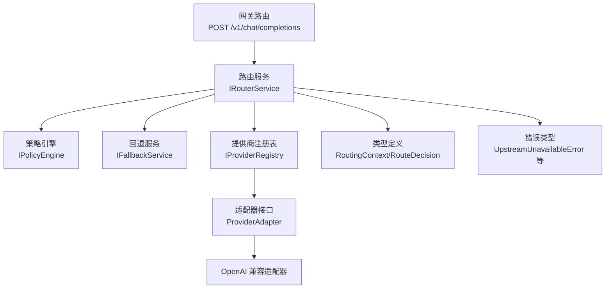
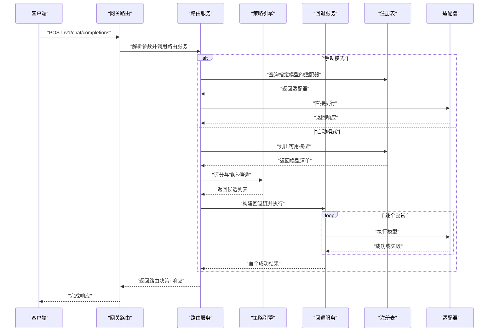
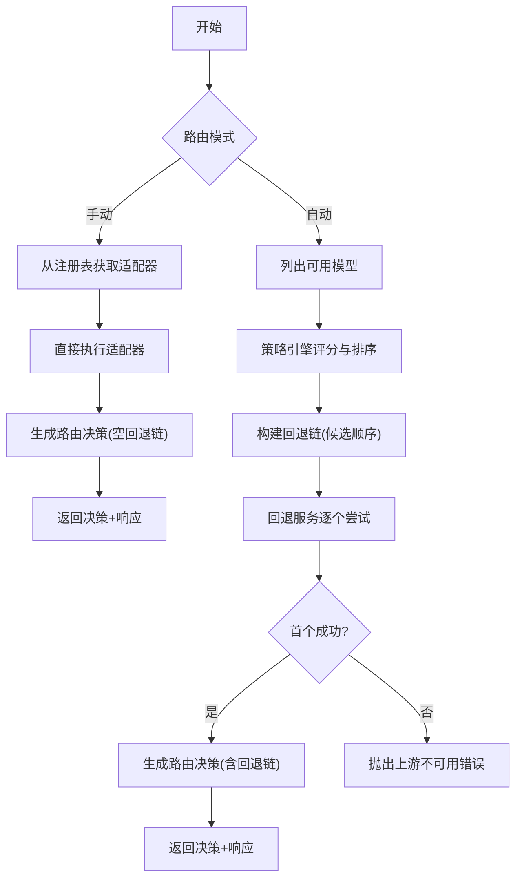
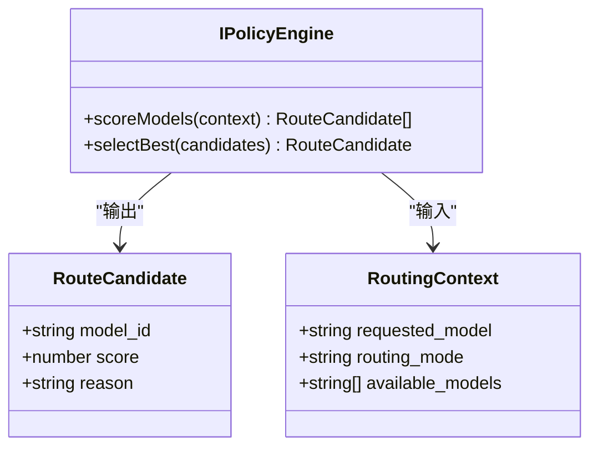
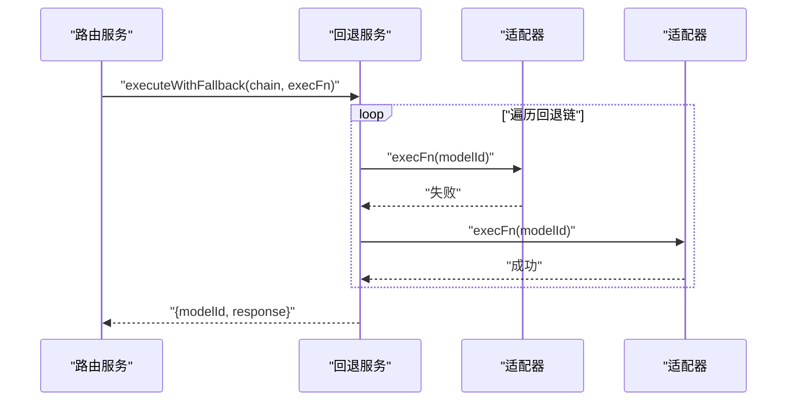
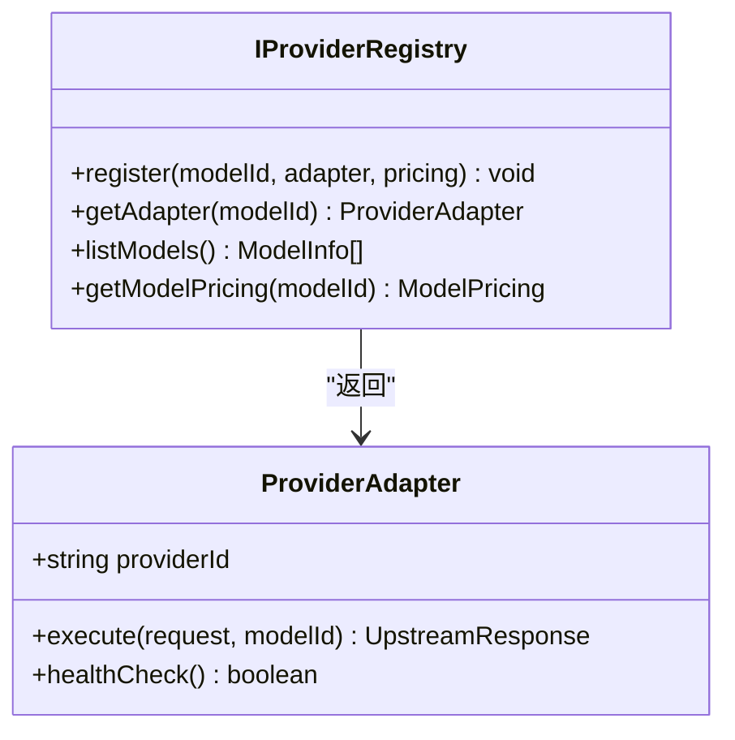
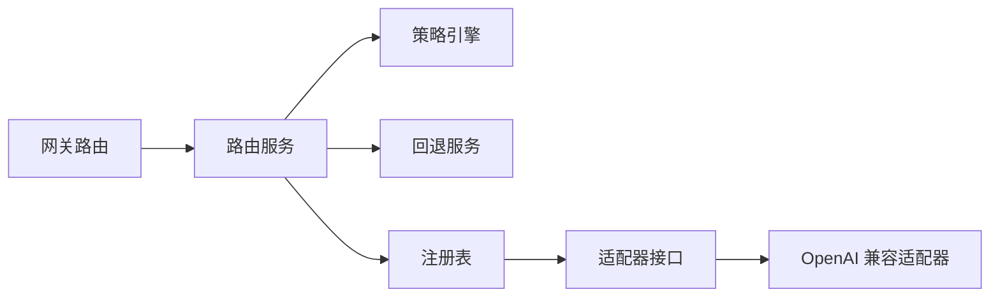

# 路由流程数据流

<cite>
**本文引用的文件**
- [src/router/index.ts](file://src/router/index.ts)
- [src/router/router.service.ts](file://src/router/router.service.ts)
- [src/router/policy.ts](file://src/router/policy.ts)
- [src/router/fallback.service.ts](file://src/router/fallback.service.ts)
- [src/router/types.ts](file://src/router/types.ts)
- [src/provider/registry.ts](file://src/provider/registry.ts)
- [src/provider/types.ts](file://src/provider/types.ts)
- [src/provider/adapter.ts](file://src/provider/adapter.ts)
- [src/provider/openai.adapter.ts](file://src/provider/openai.adapter.ts)
- [src/gateway/routes.ts](file://src/gateway/routes.ts)
- [src/app.ts](file://src/app.ts)
- [src/types.ts](file://src/types.ts)
- [src/errors.ts](file://src/errors.ts)
- [test/router/router.test.ts](file://test/router/router.test.ts)
</cite>

## 目录
1. [引言](#引言)
2. [项目结构](#项目结构)
3. [核心组件](#核心组件)
4. [架构总览](#架构总览)
5. [详细组件分析](#详细组件分析)
6. [依赖关系分析](#依赖关系分析)
7. [性能考量](#性能考量)
8. [故障排查指南](#故障排查指南)
9. [结论](#结论)
10. [附录](#附录)

## 引言
本文件聚焦“模型路由流程”的数据流，系统性阐述从请求进入网关到上游模型执行与回退的完整路径。重点覆盖以下方面：
- 模型选择策略（基于策略引擎的评分与优选）
- 提供商注册表查询与可用模型发现
- 回退机制（按候选顺序尝试，确保不重复计费）
- 路由决策记录（决策元数据与路由证明哈希）
- 手动路由与自动路由的数据处理差异
- 路由失败的回退策略与错误传播
- 性能监控数据采集要点（延迟、耗时等）

## 项目结构
路由子系统位于 src/router 下，围绕策略引擎、回退服务与路由服务三大构件协作；上游适配器与注册表在 src/provider 下，负责模型注册、适配与查询；网关层在 src/gateway 下，负责请求接入与调用路由服务。

图表来源
- [src/gateway/routes.ts:23-67](file://src/gateway/routes.ts#L23-L67)
- [src/router/router.service.ts:14-18](file://src/router/router.service.ts#L14-L18)
- [src/router/policy.ts:3-14](file://src/router/policy.ts#L3-L14)
- [src/router/fallback.service.ts:4-16](file://src/router/fallback.service.ts#L4-L16)
- [src/provider/registry.ts:4-16](file://src/provider/registry.ts#L4-L16)
- [src/provider/types.ts:26-35](file://src/provider/types.ts#L26-L35)
- [src/provider/openai.adapter.ts:10-18](file://src/provider/openai.adapter.ts#L10-L18)
- [src/router/types.ts:1-22](file://src/router/types.ts#L1-L22)
- [src/errors.ts:75-81](file://src/errors.ts#L75-L81)

章节来源
- [src/gateway/routes.ts:1-96](file://src/gateway/routes.ts#L1-L96)
- [src/app.ts:77-94](file://src/app.ts#L77-L94)
- [src/router/index.ts:1-8](file://src/router/index.ts#L1-L8)

## 核心组件
- 路由服务（IRouterService）：编排完整路由流程，支持手动与自动两种模式；负责生成路由决策、执行回退链、产出路由证明哈希。
- 策略引擎（IPolicyEngine）：对可用模型进行评分与排序，选取最优候选。
- 回退服务（IFallbackService）：按顺序尝试候选模型，首个成功即返回，全部失败抛出上游不可用错误。
- 提供商注册表（IProviderRegistry）：维护模型到适配器与定价的映射，提供查询与列表能力。
- 适配器接口（ProviderAdapter）：抽象上游执行与健康检查。
- 类型与错误：统一的路由上下文、候选模型、路由决策、响应与错误类型。

章节来源
- [src/router/router.service.ts:5-18](file://src/router/router.service.ts#L5-L18)
- [src/router/policy.ts:3-14](file://src/router/policy.ts#L3-L14)
- [src/router/fallback.service.ts:4-16](file://src/router/fallback.service.ts#L4-L16)
- [src/provider/registry.ts:4-16](file://src/provider/registry.ts#L4-L16)
- [src/provider/types.ts:26-35](file://src/provider/types.ts#L26-L35)
- [src/router/types.ts:1-22](file://src/router/types.ts#L1-L22)
- [src/errors.ts:75-81](file://src/errors.ts#L75-L81)

## 架构总览
下图展示从网关到路由、策略、回退与适配器的端到端数据流：

图表来源
- [src/gateway/routes.ts:23-67](file://src/gateway/routes.ts#L23-L67)
- [src/router/router.service.ts:27-46](file://src/router/router.service.ts#L27-L46)
- [src/router/policy.ts:18-31](file://src/router/policy.ts#L18-L31)
- [src/router/fallback.service.ts:20-38](file://src/router/fallback.service.ts#L20-L38)
- [src/provider/registry.ts:52-54](file://src/provider/registry.ts#L52-L54)

## 详细组件分析

### 路由服务（IRouterService）
职责与流程
- 接收请求与路由模式（手动/自动），返回路由决策与上游响应。
- 手动模式：直接从注册表获取适配器并执行，生成空回退链的路由决策。
- 自动模式：从注册表获取可用模型，交由策略引擎评分与优选，构建回退链后通过回退服务执行，最终生成路由证明哈希。

关键点
- 决策元数据包含选中模型、回退链、评分摘要与路由证明哈希。
- 回退服务保证仅对首个成功执行的模型计费，失败尝试不重复收费。

章节来源
- [src/router/router.service.ts:5-18](file://src/router/router.service.ts#L5-L18)
- [src/router/router.service.ts:27-46](file://src/router/router.service.ts#L27-L46)
- [src/router/types.ts:2-7](file://src/router/types.ts#L2-L7)

#### 路由决策树（流程图）

图表来源
- [src/router/router.service.ts:27-46](file://src/router/router.service.ts#L27-L46)
- [src/router/policy.ts:18-31](file://src/router/policy.ts#L18-L31)
- [src/router/fallback.service.ts:20-38](file://src/router/fallback.service.ts#L20-L38)

### 策略引擎（IPolicyEngine）
职责与流程
- 输入：路由上下文（请求模型、路由模式、可用模型集合）。
- 输出：按评分降序排列的候选模型数组；若无候选则抛错。
- 评分维度（待实现）：成本（越低越好）、能力匹配度、可用性。

复杂度与优化
- 评分与排序的时间复杂度取决于候选数量与评分函数复杂度；建议缓存定价与能力信息以降低重复计算。

章节来源
- [src/router/policy.ts:3-14](file://src/router/policy.ts#L3-L14)
- [src/router/policy.ts:18-31](file://src/router/policy.ts#L18-L31)
- [src/router/types.ts:17-21](file://src/router/types.ts#L17-L21)

#### 策略评分与优选（类图）

图表来源
- [src/router/policy.ts:3-14](file://src/router/policy.ts#L3-L14)
- [src/router/types.ts:9-21](file://src/router/types.ts#L9-L21)

### 回退服务（IFallbackService）
职责与流程
- 输入：回退链（模型ID序列）与执行函数（接收模型ID，返回上游响应）。
- 行为：依次尝试，首个成功即返回；全部失败抛出“上游不可用”错误。
- 计费保障：仅首个成功执行的模型计费，失败尝试不重复收费。

章节来源
- [src/router/fallback.service.ts:4-16](file://src/router/fallback.service.ts#L4-L16)
- [src/router/fallback.service.ts:20-38](file://src/router/fallback.service.ts#L20-L38)
- [src/errors.ts:75-81](file://src/errors.ts#L75-L81)

#### 回退执行序列图

图表来源
- [src/router/fallback.service.ts:20-38](file://src/router/fallback.service.ts#L20-L38)

### 提供商注册表（IProviderRegistry）
职责与流程
- 注册：将模型ID绑定到适配器与定价信息。
- 查询：按模型ID获取适配器与定价；列出所有可用模型用于模型目录。

章节来源
- [src/provider/registry.ts:4-16](file://src/provider/registry.ts#L4-L16)
- [src/provider/registry.ts:31-62](file://src/provider/registry.ts#L31-L62)

#### 注册表交互（类图）

图表来源
- [src/provider/registry.ts:4-16](file://src/provider/registry.ts#L4-L16)
- [src/provider/types.ts:26-35](file://src/provider/types.ts#L26-L35)

### 适配器与 OpenAI 兼容适配器
- 抽象基类提供统一接口：执行请求与健康检查。
- OpenAI 兼容适配器实现具体网络调用与响应归一化。

章节来源
- [src/provider/adapter.ts:10-15](file://src/provider/adapter.ts#L10-L15)
- [src/provider/openai.adapter.ts:10-43](file://src/provider/openai.adapter.ts#L10-L43)

### 类型与错误
- 路由上下文、候选模型、路由决策等类型定义清晰，便于审计与追踪。
- 错误类型覆盖支付、上游超时/不可用、内部错误等，便于统一处理与上报。

章节来源
- [src/router/types.ts:1-22](file://src/router/types.ts#L1-L22)
- [src/types.ts:10-28](file://src/types.ts#L10-L28)
- [src/types.ts:90-118](file://src/types.ts#L90-L118)
- [src/errors.ts:17-81](file://src/errors.ts#L17-L81)

## 依赖关系分析
- 路由服务依赖策略引擎、回退服务与注册表，形成“策略评分—回退执行—适配器调用”的闭环。
- 网关层仅做薄薄的参数解析与调用转发，业务逻辑集中在服务层。
- 适配器通过注册表被路由服务间接使用，解耦了具体上游实现。

图表来源
- [src/gateway/routes.ts:23-67](file://src/gateway/routes.ts#L23-L67)
- [src/router/router.service.ts:20-25](file://src/router/router.service.ts#L20-L25)
- [src/provider/registry.ts:31-42](file://src/provider/registry.ts#L31-L42)
- [src/provider/openai.adapter.ts:10-18](file://src/provider/openai.adapter.ts#L10-L18)

章节来源
- [src/app.ts:77-94](file://src/app.ts#L77-L94)
- [src/gateway/routes.ts:9-96](file://src/gateway/routes.ts#L9-L96)

## 性能考量
- 候选评分与排序：建议缓存模型定价与能力信息，避免重复查询；对评分函数进行向量化或预计算可提升吞吐。
- 回退链长度：合理控制候选数量，缩短回退链可减少重试开销。
- 上游适配器并发：在回退链内采用串行逐个尝试的设计已明确“不重复计费”，如需并行可引入“一次性尝试”语义与幂等控制。
- 监控指标：建议采集每个阶段的延迟（策略评分、适配器执行、回退等待）、成功率、失败原因分布，用于定位瓶颈与评估策略效果。

## 故障排查指南
常见问题与定位
- “上游不可用”错误：回退链全部失败触发，检查各候选模型的健康状态与网络连通性。
- “无候选可用”：策略引擎返回空列表，检查可用模型清单与注册表是否正确初始化。
- 支付相关错误：网关层在缺少支付凭证时会返回 402，确认挑战与支付流程是否正确执行。
- 路由未实现：当前路由服务与策略引擎、适配器仍处于占位实现，需按接口补充完整逻辑。

章节来源
- [src/router/fallback.service.ts:35-37](file://src/router/fallback.service.ts#L35-L37)
- [src/router/policy.ts:27-29](file://src/router/policy.ts#L27-L29)
- [src/gateway/routes.ts:29-46](file://src/gateway/routes.ts#L29-L46)
- [test/router/router.test.ts:14-21](file://test/router/router.test.ts#L14-L21)

## 结论
该路由系统通过“策略评分—回退执行—适配器调用”的分层设计，实现了灵活且可审计的模型路由能力。当前核心逻辑仍处于占位实现阶段，后续应重点补齐策略评分、适配器执行与支付流程，并完善监控与回退链优化，以满足生产环境的可靠性与性能要求。

## 附录
- 数据转换示例（概念性说明）
  - 请求体到路由上下文：提取请求模型、路由模式与消息内容，注入可用模型集合。
  - 候选模型到回退链：将策略引擎输出的候选顺序作为回退链。
  - 上游响应到标准化响应：抽取 choices、usage、latency 并归一化字段。
  - 路由决策到审计记录：记录选中模型、回退链、评分摘要与路由证明哈希，便于审计与对账。