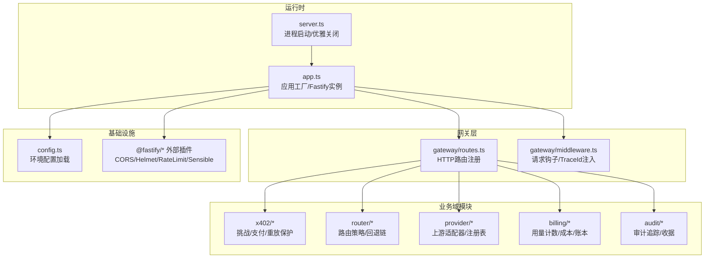
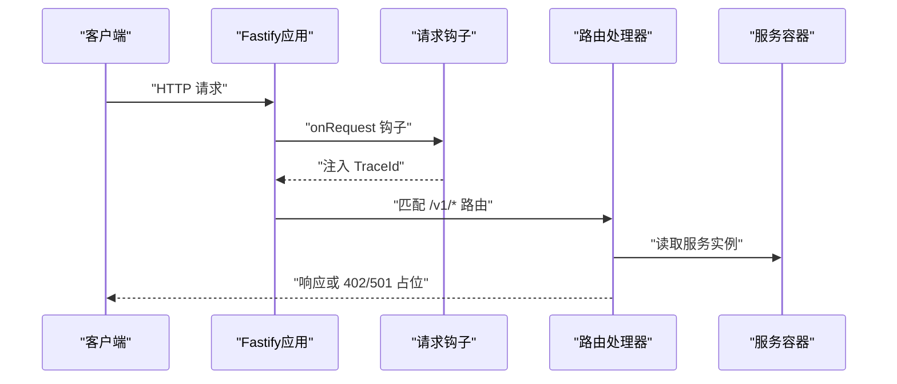
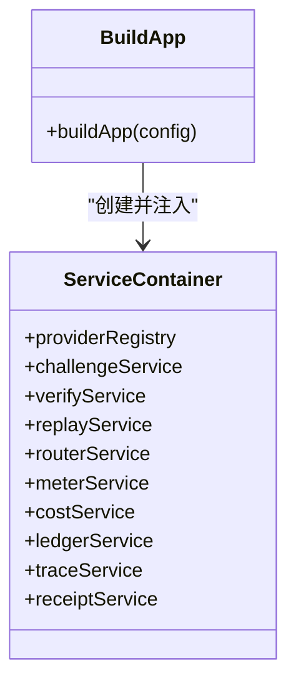
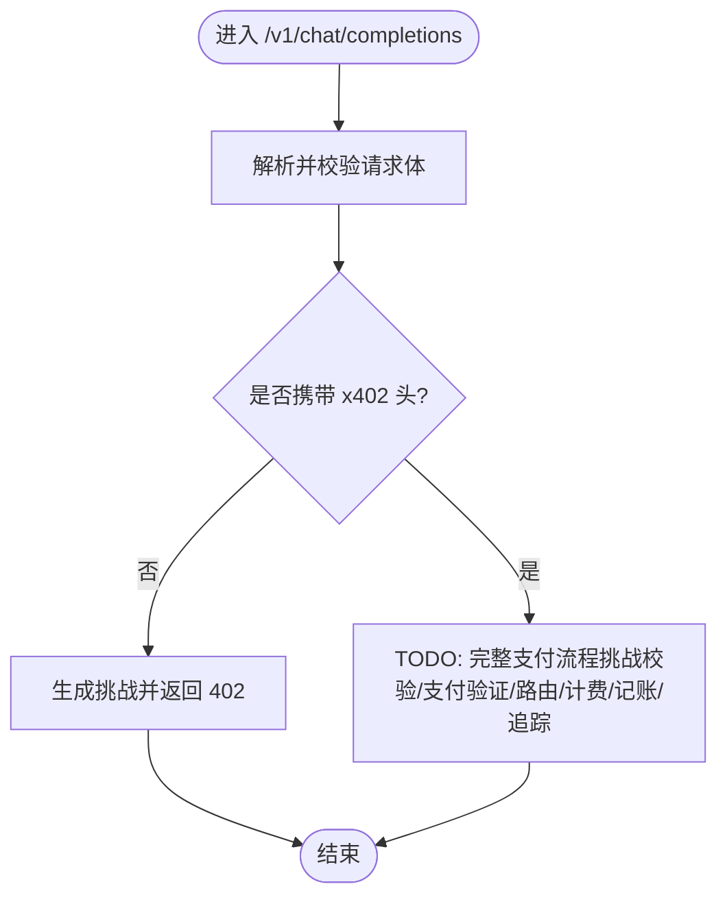
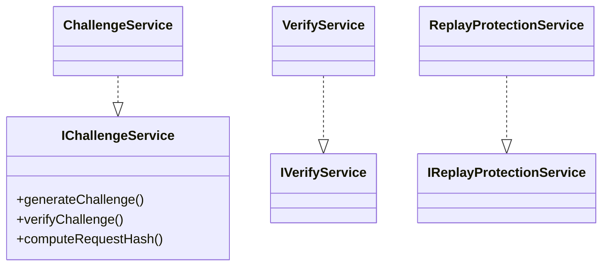
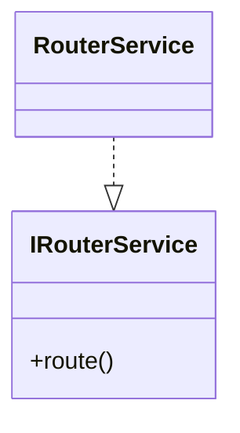
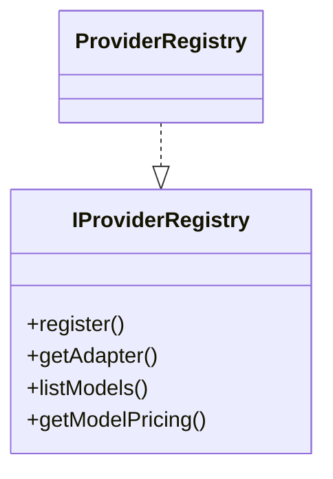
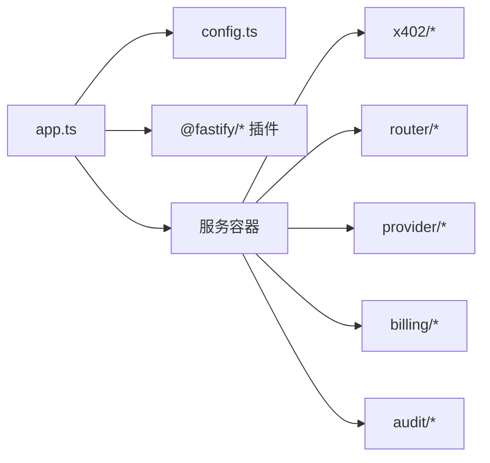

# 整体架构概览

<cite>
**本文引用的文件**
- [src/app.ts](file://src/app.ts)
- [src/server.ts](file://src/server.ts)
- [src/config.ts](file://src/config.ts)
- [src/gateway/index.ts](file://src/gateway/index.ts)
- [src/gateway/middleware.ts](file://src/gateway/middleware.ts)
- [src/gateway/routes.ts](file://src/gateway/routes.ts)
- [src/x402/index.ts](file://src/x402/index.ts)
- [src/x402/challenge.service.ts](file://src/x402/challenge.service.ts)
- [src/router/index.ts](file://src/router/index.ts)
- [src/router/router.service.ts](file://src/router/router.service.ts)
- [src/provider/index.ts](file://src/provider/index.ts)
- [src/provider/registry.ts](file://src/provider/registry.ts)
- [src/billing/index.ts](file://src/billing/index.ts)
- [src/audit/index.ts](file://src/audit/index.ts)
- [package.json](file://package.json)
- [README.md](file://README.md)
</cite>

## 目录
1. [简介](#简介)
2. [项目结构](#项目结构)
3. [核心组件](#核心组件)
4. [架构总览](#架构总览)
5. [详细组件分析](#详细组件分析)
6. [依赖分析](#依赖分析)
7. [性能考量](#性能考量)
8. [故障排查指南](#故障排查指南)
9. [结论](#结论)
10. [附录](#附录)

## 简介
本文件为 x402 Gateway 的整体架构概览文档，面向开发者与技术评审人员，系统阐述系统的高层设计理念、核心架构模式与整体设计原则。重点覆盖以下方面：
- Fastify 应用工厂模式的实现与控制流
- 依赖注入架构的设计思路与服务容器组织
- 模块化组织原则：按职责分层与边界划分
- 各层之间的职责分离与交互方式
- 系统边界、外部依赖与集成点
- 架构决策的技术背景与权衡考虑
- 可扩展性设计与性能考量

## 项目结构
项目采用“按功能域分层 + 轻量模块化”的组织方式，入口文件负责装配应用与启动服务；核心业务能力通过独立模块提供，路由层仅承担薄处理职责，业务逻辑下沉到服务层。

图表来源
- [src/server.ts:1-33](file://src/server.ts#L1-L33)
- [src/app.ts:35-100](file://src/app.ts#L35-L100)
- [src/gateway/routes.ts:9-96](file://src/gateway/routes.ts#L9-L96)
- [src/gateway/middleware.ts:9-12](file://src/gateway/middleware.ts#L9-L12)
- [src/config.ts:28-45](file://src/config.ts#L28-L45)

章节来源
- [README.md:79-106](file://README.md#L79-L106)
- [src/server.ts:1-33](file://src/server.ts#L1-L33)
- [src/app.ts:35-100](file://src/app.ts#L35-L100)

## 核心组件
- 应用工厂与服务容器
  - 应用工厂函数负责创建 Fastify 实例、注册插件、设置钩子与全局错误处理器，并通过服务容器集中注入各领域服务。
  - 服务容器聚合了提供者注册表、挑战服务、支付验证服务、重放保护服务、路由服务、计量/成本/账本服务以及审计追踪/收据服务。
- 配置加载
  - 使用 Zod 对环境变量进行强类型校验与默认值设定，确保运行时配置的一致性与安全性。
- 进程生命周期
  - 启动阶段完成配置加载与应用构建，监听端口；支持 SIGINT/SIGTERM 信号进行优雅关闭。

章节来源
- [src/app.ts:21-33](file://src/app.ts#L21-L33)
- [src/app.ts:77-94](file://src/app.ts#L77-L94)
- [src/config.ts:28-45](file://src/config.ts#L28-L45)
- [src/server.ts:4-26](file://src/server.ts#L4-L26)

## 架构总览
系统采用“应用工厂 + 服务容器 + 分层模块”的架构模式，强调：
- 控制反转与依赖注入：由应用工厂统一创建与组装服务实例，路由层仅消费服务接口。
- 职责分离：路由层只做参数解析与转发，业务逻辑在服务层实现；跨域、安全、限流等横切关注点通过 Fastify 插件解决。
- 可演进性：当前为内存模型与占位实现，后续通过注入 Redis/PostgreSQL 等持久化组件增强。

图表来源
- [src/app.ts:49-50](file://src/app.ts#L49-L50)
- [src/gateway/middleware.ts:9-12](file://src/gateway/middleware.ts#L9-L12)
- [src/gateway/routes.ts:23-67](file://src/gateway/routes.ts#L23-L67)

## 详细组件分析

### 应用工厂与依赖注入
- 应用工厂
  - 创建 Fastify 实例并配置日志级别与请求 ID 生成策略。
  - 注册 CORS、Helmet、RateLimit、Sensible 等插件，统一处理安全与通用行为。
  - 注入全局错误处理器，区分业务错误、参数校验错误与内部异常。
  - 通过服务容器聚合各领域服务实例，供路由层使用。
- 服务容器
  - 聚合 ProviderRegistry、ChallengeService、VerifyService、ReplayProtectionService、RouterService、Meter/Cost/Ledger、Trace/Receipt 等。
  - 当前占位实现中，部分服务依赖（如 Redis/数据库连接）尚未注入，留待后续完善。

图表来源
- [src/app.ts:21-33](file://src/app.ts#L21-L33)
- [src/app.ts:77-94](file://src/app.ts#L77-L94)

章节来源
- [src/app.ts:35-100](file://src/app.ts#L35-L100)

### 网关层：路由与中间件
- 中间件
  - onRequest 钩子负责注入唯一 TraceId，便于全链路追踪。
- 路由
  - /v1/chat/completions：OpenAI 兼容聊天补全，当前返回占位的 402/501 响应，完整流程在 TODO 中规划。
  - /v1/models：返回可用模型列表，委托 ProviderRegistry。
  - /v1/audit/requests/:request_id：占位未实现，预留审计查询接口。

图表来源
- [src/gateway/routes.ts:23-67](file://src/gateway/routes.ts#L23-L67)

章节来源
- [src/gateway/middleware.ts:9-12](file://src/gateway/middleware.ts#L9-L12)
- [src/gateway/routes.ts:9-96](file://src/gateway/routes.ts#L9-L96)

### x402 支付域
- 挑战服务
  - 负责生成挑战（含 quote_id、request_hash、签名、过期时间等），并校验挑战令牌与请求哈希一致性。
- 支付验证服务
  - 验证链上支付证明，与挑战绑定。
- 重放保护服务
  - 通过外部存储（Redis）实现幂等与防重放。

图表来源
- [src/x402/challenge.service.ts:4-26](file://src/x402/challenge.service.ts#L4-L26)
- [src/x402/index.ts:1-13](file://src/x402/index.ts#L1-L13)

章节来源
- [src/x402/challenge.service.ts:28-71](file://src/x402/challenge.service.ts#L28-L71)
- [src/x402/index.ts:7-13](file://src/x402/index.ts#L7-L13)

### 路由域
- 路由服务
  - 统一编排手动/自动路由：自动模式下结合策略引擎评分与回退链，最终产出路由决策与上游响应。
- 策略与回退
  - 策略引擎与回退服务作为可注入依赖，当前占位实现中未注入具体实现，留待后续完善。

图表来源
- [src/router/router.service.ts:5-18](file://src/router/router.service.ts#L5-L18)
- [src/router/index.ts:6-8](file://src/router/index.ts#L6-L8)

章节来源
- [src/router/router.service.ts:20-50](file://src/router/router.service.ts#L20-L50)
- [src/router/index.ts:1-8](file://src/router/index.ts#L1-L8)

### 提供者域
- 提供者注册表
  - 内存模型，注册模型信息、适配器与定价；对外暴露查询与列表能力。
- 适配器
  - 抽象上游适配器接口，当前包含 OpenAI 适配器示例。

图表来源
- [src/provider/registry.ts:4-16](file://src/provider/registry.ts#L4-L16)
- [src/provider/index.ts:4-6](file://src/provider/index.ts#L4-L6)

章节来源
- [src/provider/registry.ts:27-65](file://src/provider/registry.ts#L27-L65)
- [src/provider/index.ts:1-6](file://src/provider/index.ts#L1-L6)

### 计费与审计域
- 计费域
  - 计量服务、成本计算服务、账本服务分别负责用量记录、成本拆分与不可篡改账本写入。
- 审计域
  - 追踪服务与收据服务负责请求轨迹持久化与查询。

章节来源
- [src/billing/index.ts:1-8](file://src/billing/index.ts#L1-L8)
- [src/audit/index.ts:1-4](file://src/audit/index.ts#L1-L4)

## 依赖分析
- 内部模块耦合
  - 路由层对各服务接口存在直接依赖，但通过服务容器解耦具体实现；服务之间保持弱耦合，避免循环依赖。
- 外部依赖
  - Fastify 生态插件：CORS、Helmet、RateLimit、Sensible。
  - 数据与缓存：ioredis、pg、kysely（当前在应用工厂中预留注入点，尚未启用）。
  - 加密与链上验证：jose（JWT/JWS）、viem（EVM RPC）。
- 配置依赖
  - 所有外部依赖均通过配置对象注入，保证可测试性与可替换性。

图表来源
- [src/app.ts:44-47](file://src/app.ts#L44-L47)
- [src/config.ts:28-45](file://src/config.ts#L28-L45)
- [src/app.ts:77-94](file://src/app.ts#L77-L94)

章节来源
- [package.json:21-36](file://package.json#L21-L36)
- [src/app.ts:44-47](file://src/app.ts#L44-L47)

## 性能考量
- 快速启动与低延迟
  - Fastify 插件化与事件钩子机制降低额外开销；路由层保持薄处理，减少 CPU 绑定操作。
- 并发与限流
  - RateLimit 插件限制请求速率，避免突发流量冲击后端。
- 缓存与去重
  - 重放保护服务计划使用 Redis，有助于降低重复请求的处理成本。
- I/O 优化
  - 计费与审计写入建议采用批量/异步提交策略，配合数据库连接池提升吞吐。
- 可观测性
  - TraceId 注入与结构化日志，便于定位热点路径与慢调用。

## 故障排查指南
- 错误处理
  - 全局错误处理器区分业务错误与参数校验错误，非业务异常统一记录并返回内部错误。
- 常见问题定位
  - 402 流程未实现：确认路由层 TODO 是否已实现挑战生成与支付验证。
  - 501 未实现：确认各服务占位实现是否替换为真实逻辑。
  - 配置缺失：检查环境变量与默认值，确保数据库/Redis 地址、挑战密钥、商户地址等正确。
- 优雅关闭
  - 监听 SIGINT/SIGTERM，确保在关闭前释放资源（当前预留 Redis/数据库连接关闭点）。

章节来源
- [src/app.ts:53-70](file://src/app.ts#L53-L70)
- [src/server.ts:17-25](file://src/server.ts#L17-L25)

## 结论
本架构以应用工厂与服务容器为核心，通过清晰的分层与模块化设计，实现了职责分离与可演进性。当前版本以占位实现为主，后续可在以下方向增强：
- 注入 Redis 与数据库连接，完善重放保护与账本持久化
- 实现 x402 支付全流程与路由策略
- 引入指标采集与告警，完善可观测性
- 通过配置驱动与插件化扩展更多上游提供商

## 附录
- 系统边界与集成点
  - 边界：Edge Gateway（HTTP 入口）与上游 LLM 提供商；内部通过 Provider Registry 解耦。
  - 集成点：链上支付验证（viem）、缓存/去重（Redis）、账本存储（PostgreSQL）。
- 架构决策与权衡
  - 选择 Fastify 作为运行时：性能优先、生态成熟、易于插件化。
  - 采用应用工厂 + 服务容器：集中装配、便于测试与替换。
  - 当前内存模型：快速迭代与原型验证，后续以可插拔存储替换。

章节来源
- [README.md:26-47](file://README.md#L26-L47)
- [src/app.ts:77-94](file://src/app.ts#L77-L94)