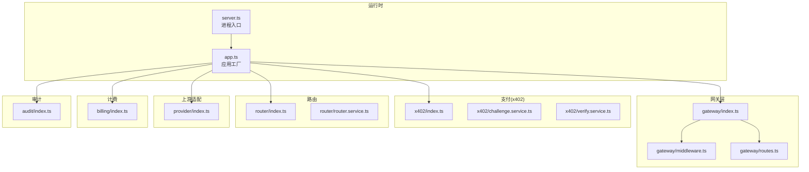
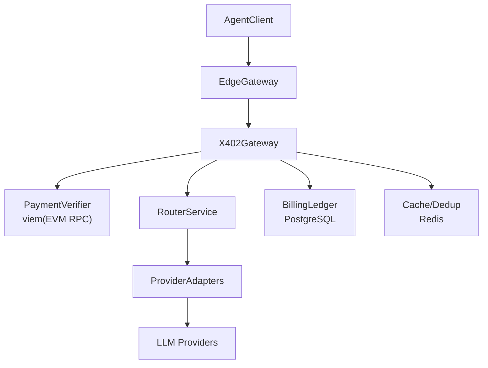
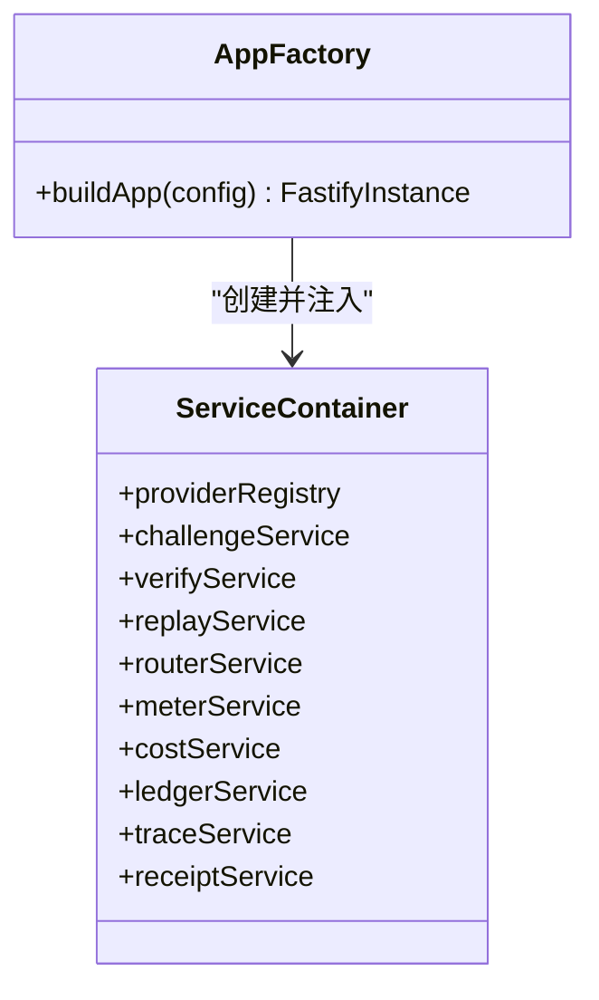
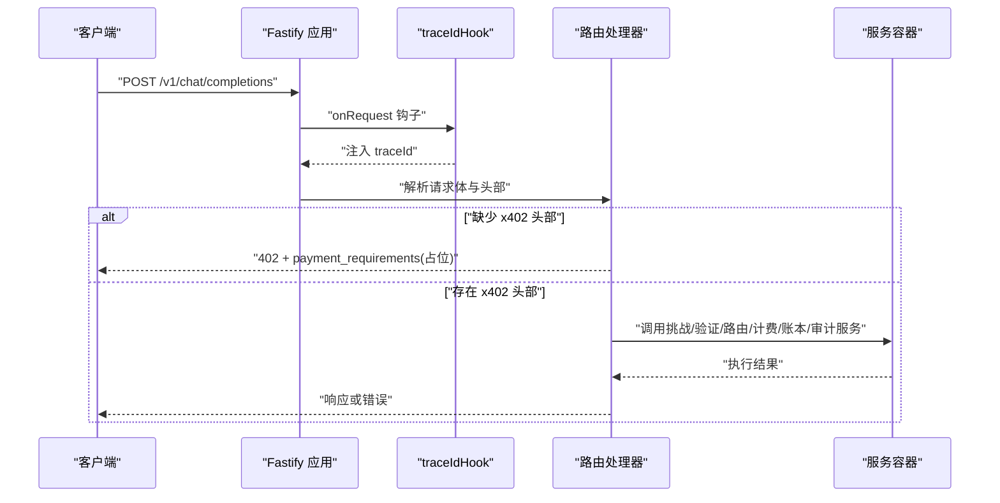
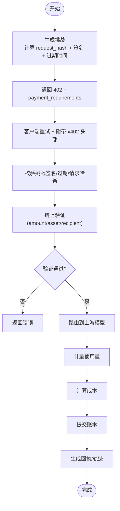
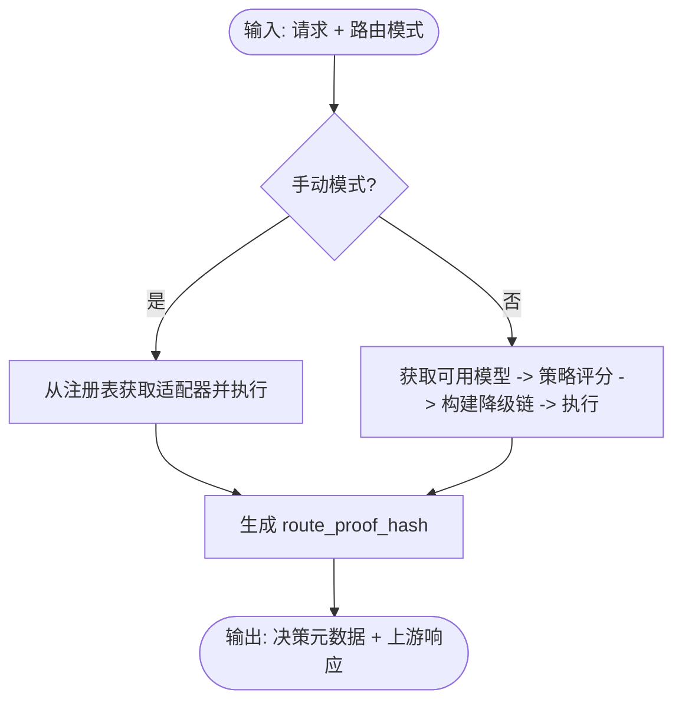
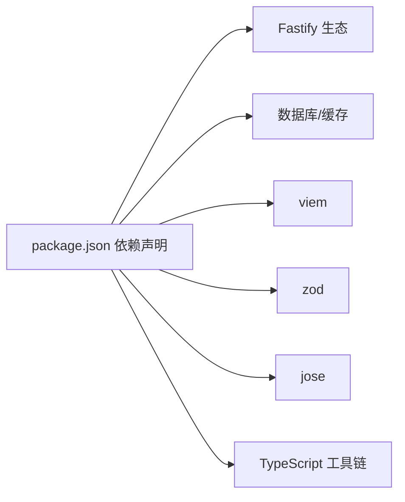

# 架构设计

<cite>
**本文引用的文件**
- [README.md](file://README.md)
- [package.json](file://package.json)
- [src/app.ts](file://src/app.ts)
- [src/server.ts](file://src/server.ts)
- [src/config.ts](file://src/config.ts)
- [src/gateway/index.ts](file://src/gateway/index.ts)
- [src/gateway/middleware.ts](file://src/gateway/middleware.ts)
- [src/gateway/routes.ts](file://src/gateway/routes.ts)
- [src/x402/index.ts](file://src/x402/index.ts)
- [src/x402/challenge.service.ts](file://src/x402/challenge.service.ts)
- [src/x402/verify.service.ts](file://src/x402/verify.service.ts)
- [src/router/index.ts](file://src/router/index.ts)
- [src/router/router.service.ts](file://src/router/router.service.ts)
- [src/provider/index.ts](file://src/provider/index.ts)
- [src/billing/index.ts](file://src/billing/index.ts)
- [src/audit/index.ts](file://src/audit/index.ts)
</cite>

## 目录
1. [引言](#引言)
2. [项目结构](#项目结构)
3. [核心组件](#核心组件)
4. [架构总览](#架构总览)
5. [详细组件分析](#详细组件分析)
6. [依赖关系分析](#依赖关系分析)
7. [性能考量](#性能考量)
8. [故障排查指南](#故障排查指南)
9. [结论](#结论)
10. [附录](#附录)

## 引言
本架构文档面向 x402 Gateway 的设计与实现，目标是为“代理到代理（Agent-to-Agent）计算中继”提供清晰的系统视图：从请求进入网关、挑战与支付验证、路由决策、上游适配器调用、计费与账本、审计与回执，到安全、可观测性与灾难恢复等横切关注点。文档同时阐述应用工厂模式、依赖注入架构与模块化设计原则，并给出部署拓扑与基础设施需求。

## 项目结构
项目采用按功能域划分的模块化组织方式，核心入口通过应用工厂函数构建 Fastify 实例，路由注册在独立模块内，各业务域（x402、Router、Provider、Billing、Audit）以服务工厂与类型接口解耦。

图表来源
- [src/server.ts:1-33](file://src/server.ts#L1-L33)
- [src/app.ts:35-100](file://src/app.ts#L35-L100)
- [src/gateway/index.ts:1-9](file://src/gateway/index.ts#L1-L9)
- [src/gateway/middleware.ts:1-13](file://src/gateway/middleware.ts#L1-L13)
- [src/gateway/routes.ts:1-96](file://src/gateway/routes.ts#L1-L96)
- [src/x402/index.ts:1-13](file://src/x402/index.ts#L1-L13)
- [src/x402/challenge.service.ts:1-71](file://src/x402/challenge.service.ts#L1-L71)
- [src/x402/verify.service.ts:1-34](file://src/x402/verify.service.ts#L1-L34)
- [src/router/index.ts:1-8](file://src/router/index.ts#L1-L8)
- [src/router/router.service.ts:1-50](file://src/router/router.service.ts#L1-L50)
- [src/provider/index.ts:1-6](file://src/provider/index.ts#L1-L6)
- [src/billing/index.ts:1-8](file://src/billing/index.ts#L1-L8)
- [src/audit/index.ts:1-6](file://src/audit/index.ts#L1-L6)

章节来源
- [README.md:79-106](file://README.md#L79-L106)
- [src/app.ts:35-100](file://src/app.ts#L35-L100)
- [src/server.ts:1-33](file://src/server.ts#L1-L33)

## 核心组件
- 应用工厂与依赖注入
  - 应用工厂负责插件注册、钩子与全局错误处理，并通过服务容器聚合各域服务实例，供路由处理器使用。
  - 服务容器定义了统一的服务契约集合，便于替换与测试。
- 网关层
  - 中间件：在请求进入时注入唯一 trace/request ID。
  - 路由：注册 OpenAI 兼容端点与审计查询端点；当前实现保留占位逻辑，核心支付流程待完善。
- 支付域（x402）
  - 挑战服务：生成/校验挑战，绑定请求哈希与过期时间。
  - 验证服务：基于链上交易证明进行金额、资产与收款人校验。
- 路由服务
  - 提供手动与自动两种路由模式，支持策略评分与降级链路执行。
- 上游适配器
  - 统一适配器接口与注册表，屏蔽不同提供商差异。
- 计费与账本
  - 使用量计量、成本计算与追加式账本持久化。
- 审计与回执
  - 请求轨迹持久化与回执查询能力。

章节来源
- [src/app.ts:21-33](file://src/app.ts#L21-L33)
- [src/app.ts:77-94](file://src/app.ts#L77-L94)
- [src/gateway/middleware.ts:1-13](file://src/gateway/middleware.ts#L1-L13)
- [src/gateway/routes.ts:9-96](file://src/gateway/routes.ts#L9-L96)
- [src/x402/challenge.service.ts:4-26](file://src/x402/challenge.service.ts#L4-L26)
- [src/x402/verify.service.ts:3-16](file://src/x402/verify.service.ts#L3-L16)
- [src/router/router.service.ts:5-18](file://src/router/router.service.ts#L5-L18)
- [src/provider/index.ts:1-6](file://src/provider/index.ts#L1-L6)
- [src/billing/index.ts:1-8](file://src/billing/index.ts#L1-L8)
- [src/audit/index.ts:1-6](file://src/audit/index.ts#L1-L6)

## 架构总览
系统边界与外部依赖：
- 外部系统：LLM 提供商（通过适配器）、区块链 RPC（viem）、PostgreSQL（账本/审计）、Redis（重放保护/去重）。
- 内部系统：Fastify 应用、各业务域服务。

图表来源
- [README.md:26-35](file://README.md#L26-L35)
- [src/app.ts:77-94](file://src/app.ts#L77-L94)
- [src/x402/verify.service.ts:18-33](file://src/x402/verify.service.ts#L18-L33)
- [src/router/router.service.ts:20-49](file://src/router/router.service.ts#L20-L49)

## 详细组件分析

### 应用工厂与依赖注入
- 设计要点
  - 应用工厂集中初始化 Fastify 插件（CORS、Helmet、限流、sensible），设置请求钩子与全局错误处理。
  - 通过服务容器聚合所有域服务，路由处理器仅依赖接口，降低耦合。
- 关键路径
  - 应用工厂：[src/app.ts:35-100](file://src/app.ts#L35-L100)
  - 服务容器定义：[src/app.ts:21-33](file://src/app.ts#L21-L33)
  - 服务装配与路由注册：[src/app.ts:77-98](file://src/app.ts#L77-L98)

图表来源
- [src/app.ts:21-33](file://src/app.ts#L21-L33)
- [src/app.ts:77-98](file://src/app.ts#L77-L98)

章节来源
- [src/app.ts:35-100](file://src/app.ts#L35-L100)

### 网关层：中间件与路由
- 中间件
  - onRequest 钩子注入唯一 trace/request ID，便于全链路追踪。
- 路由
  - /v1/chat/completions：OpenAI 兼容聊天补全，当前返回 402 并携带占位挑战信息；完整支付流程待实现。
  - /v1/models：返回模型目录与定价元数据。
  - /v1/audit/requests/:request_id：占位未实现。

图表来源
- [src/gateway/middleware.ts:9-12](file://src/gateway/middleware.ts#L9-L12)
- [src/gateway/routes.ts:23-67](file://src/gateway/routes.ts#L23-L67)

章节来源
- [src/gateway/middleware.ts:1-13](file://src/gateway/middleware.ts#L1-L13)
- [src/gateway/routes.ts:9-96](file://src/gateway/routes.ts#L9-L96)

### x402 支付域
- 挑战服务
  - 生成挑战：产出 quote_id、request_hash、签名后的挑战令牌与过期时间。
  - 校验挑战：验证签名、过期与请求哈希一致性。
- 验证服务
  - 基于 viem 查询链上交易，核对金额、资产与收款人，返回验证结果。

图表来源
- [src/x402/challenge.service.ts:12-26](file://src/x402/challenge.service.ts#L12-L26)
- [src/x402/verify.service.ts:15-16](file://src/x402/verify.service.ts#L15-L16)

章节来源
- [src/x402/challenge.service.ts:1-71](file://src/x402/challenge.service.ts#L1-L71)
- [src/x402/verify.service.ts:1-34](file://src/x402/verify.service.ts#L1-L34)

### 路由服务
- 手动模式：直接根据请求指定模型选择适配器执行。
- 自动模式：基于策略引擎评分候选模型，构建降级链并执行，最终生成路由证明哈希。

图表来源
- [src/router/router.service.ts:14-18](file://src/router/router.service.ts#L14-L18)
- [src/router/router.service.ts:27-47](file://src/router/router.service.ts#L27-L47)

章节来源
- [src/router/router.service.ts:1-50](file://src/router/router.service.ts#L1-L50)

### 上游适配器与注册表
- 统一适配器接口与注册表，屏蔽不同提供商差异，便于扩展与替换。

章节来源
- [src/provider/index.ts:1-6](file://src/provider/index.ts#L1-L6)

### 计费与账本
- 使用量计量、成本计算与追加式账本持久化，支撑结算与审计。

章节来源
- [src/billing/index.ts:1-8](file://src/billing/index.ts#L1-L8)

### 审计与回执
- 请求轨迹持久化与回执查询，提供路由与结算证据。

章节来源
- [src/audit/index.ts:1-6](file://src/audit/index.ts#L1-L6)

## 依赖关系分析
- 技术栈与第三方依赖
  - 运行时：TypeScript + Fastify
  - 数据库：PostgreSQL（账本/审计）+ Redis（重放保护/缓存）
  - 链上验证：viem（EVM RPC）
  - 校验：zod
  - JWT/JWS：jose
- 版本与环境
  - Node.js >= 20
  - 包管理：pnpm
  - 开发工具：TypeScript、ESLint、Prettier、Vitest

图表来源
- [package.json:21-36](file://package.json#L21-L36)
- [package.json:37-47](file://package.json#L37-L47)
- [package.json:48-50](file://package.json#L48-L50)

章节来源
- [package.json:1-52](file://package.json#L1-L52)
- [README.md:108-114](file://README.md#L108-L114)

## 性能考量
- 连接池与资源管理
  - 当前应用工厂与服务器预留 Redis 与 PostgreSQL 初始化位置，建议在装配阶段建立连接池并在优雅关闭时释放。
- 缓存与去重
  - 利用 Redis 缓存热点数据与去重请求，减少重复计算与上游压力。
- 路由与降级
  - 自动路由结合策略评分与降级链，提升成功率与稳定性。
- 限流与安全
  - 已启用限流与 Helmet，建议结合速率限制策略细化规则并开启 CORS 白名单。

[本节为通用指导，不直接分析具体文件]

## 故障排查指南
- 错误处理
  - 应用工厂已注册全局错误处理器，区分业务错误与 Zod 校验错误，统一返回标准化错误响应。
- 日志与追踪
  - traceIdHook 注入请求 ID，便于跨服务串联日志。
- 常见问题定位
  - 支付流程未实现：/v1/chat/completions 返回 501，需完善挑战/验证/路由/账本链路。
  - 审计查询未实现：/v1/audit/requests/:request_id 返回 501，需接入回执服务。

章节来源
- [src/app.ts:53-70](file://src/app.ts#L53-L70)
- [src/gateway/middleware.ts:9-12](file://src/gateway/middleware.ts#L9-L12)
- [src/gateway/routes.ts:64-66](file://src/gateway/routes.ts#L64-L66)
- [src/gateway/routes.ts:90-93](file://src/gateway/routes.ts#L90-L93)

## 结论
该架构以应用工厂与依赖注入为核心，围绕网关层、x402 支付域、路由、适配器、计费与审计六大域构建模块化系统。通过清晰的接口与服务容器，系统具备良好的可替换性与可测试性。当前核心支付与审计链路仍处于占位实现，后续应优先完善挑战/验证/路由/账本与回执服务，并补齐数据库与缓存连接管理与优雅关闭流程。

[本节为总结性内容，不直接分析具体文件]

## 附录

### 系统上下文图与组件分解图
- 系统上下文图已在“架构总览”中给出。
- 组件分解图已在“项目结构”与“核心组件”中给出。

[本节为概念性内容，不直接分析具体文件]

### 部署拓扑与基础设施需求
- 基础设施
  - PostgreSQL：账本与审计数据存储。
  - Redis：重放保护、缓存与去重。
  - 区块链 RPC：viem 连接 EVM 链。
- 部署建议
  - 使用容器编排（如 docker-compose）启动数据库与缓存。
  - 应用以无状态形式部署，结合负载均衡与健康检查。
  - 通过环境变量配置数据库与缓存连接、挑战密钥、商户地址与链上资产。

章节来源
- [README.md:13-18](file://README.md#L13-L18)
- [src/config.ts:4-24](file://src/config.ts#L4-L24)

### 安全、监控与灾难恢复
- 安全
  - 启用 Helmet、CORS 与限流；挑战令牌使用强密钥与过期控制；严格校验链上收款人与资产。
- 监控
  - 结合日志级别与 traceId 进行链路追踪；对关键服务（路由、验证、账本）埋点指标。
- 灾难恢复
  - 账本与审计采用追加式写入，确保可回溯；缓存与数据库均需备份策略与异地容灾。

[本节为通用指导，不直接分析具体文件]