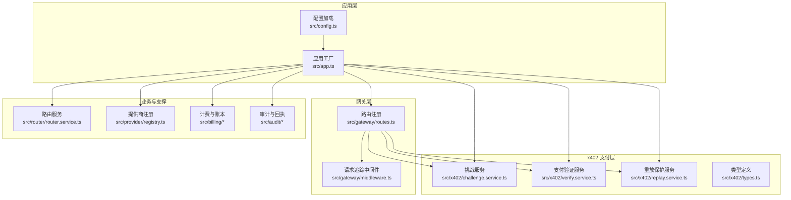
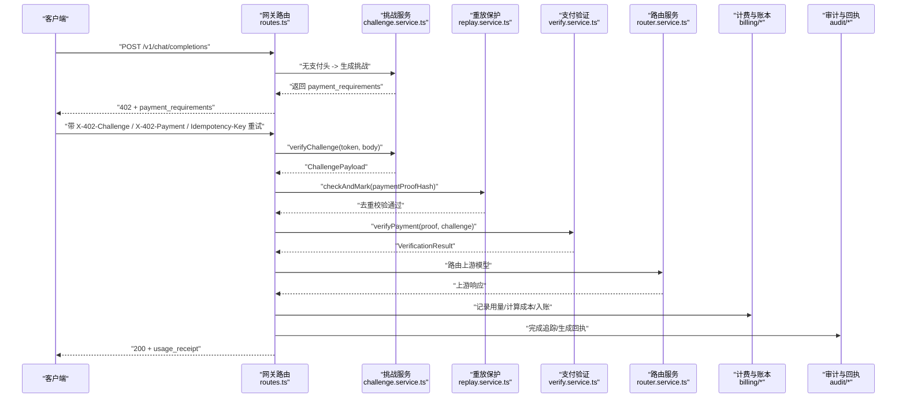
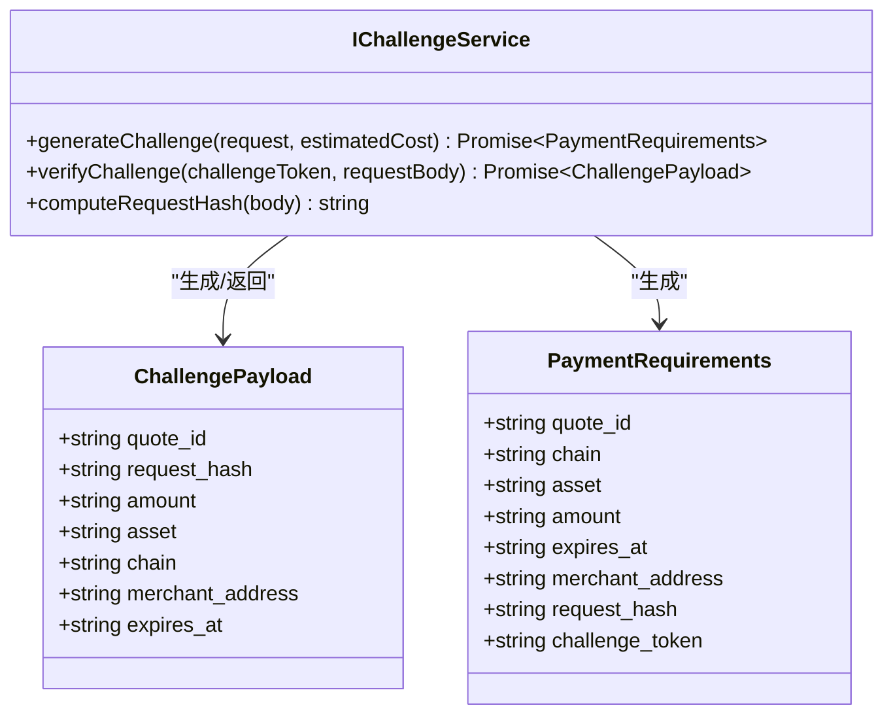
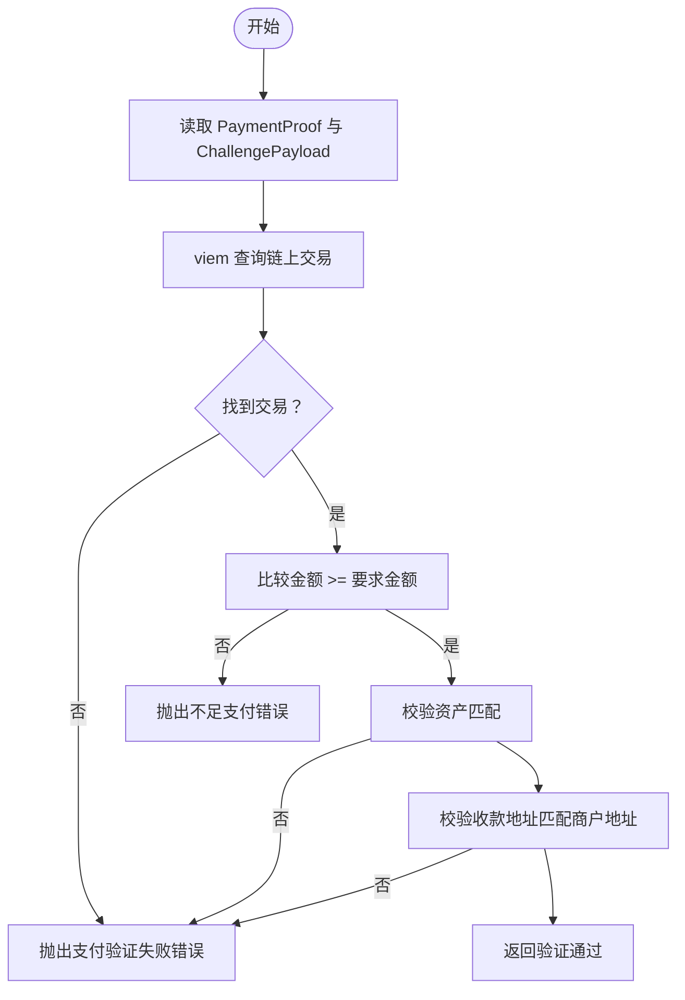
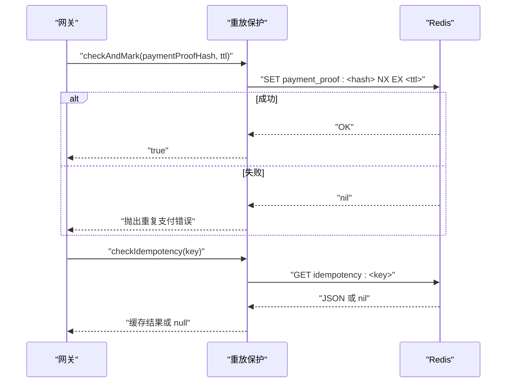
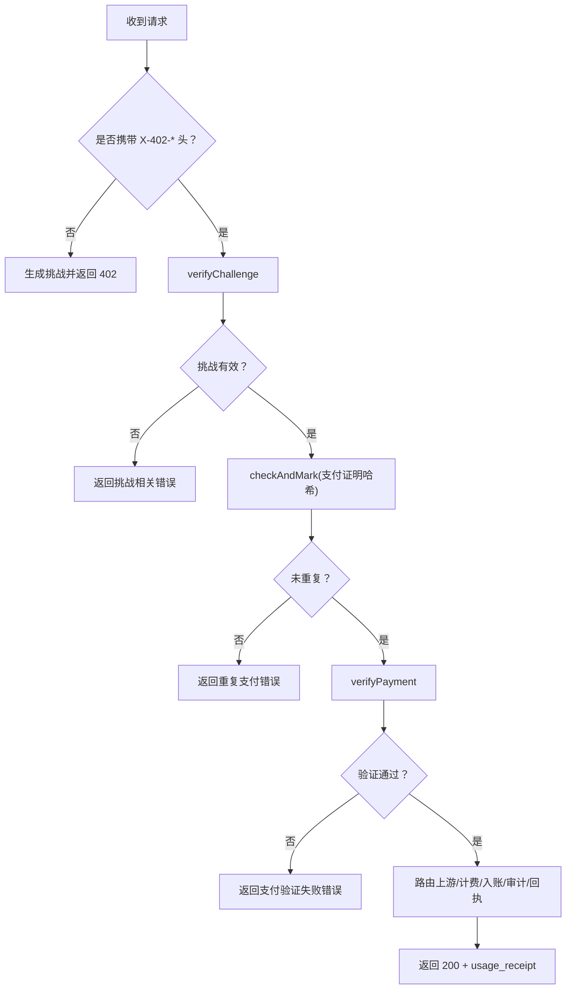
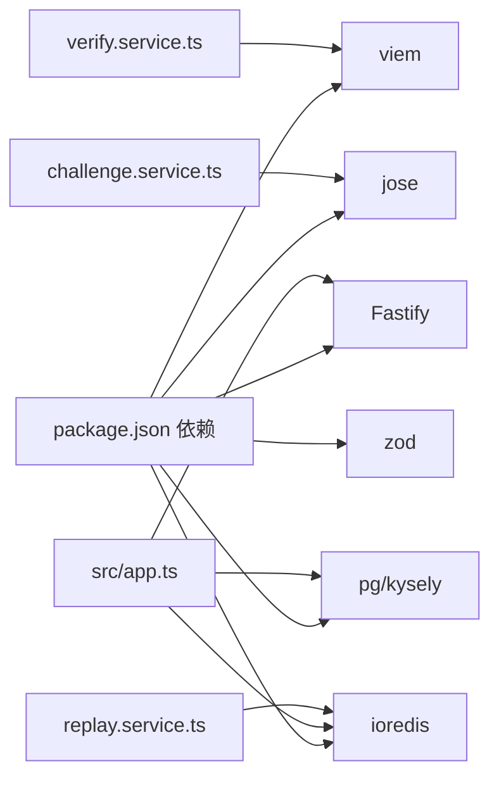

# x402 支付系统

<cite>
**本文引用的文件**
- [src/x402/index.ts](file://src/x402/index.ts)
- [src/x402/challenge.service.ts](file://src/x402/challenge.service.ts)
- [src/x402/verify.service.ts](file://src/x402/verify.service.ts)
- [src/x402/replay.service.ts](file://src/x402/replay.service.ts)
- [src/x402/types.ts](file://src/x402/types.ts)
- [src/gateway/routes.ts](file://src/gateway/routes.ts)
- [src/gateway/middleware.ts](file://src/gateway/middleware.ts)
- [src/app.ts](file://src/app.ts)
- [src/config.ts](file://src/config.ts)
- [src/types.ts](file://src/types.ts)
- [src/errors.ts](file://src/errors.ts)
- [docs/api-spec-v0-x402-gateway.md](file://docs/api-spec-v0-x402-gateway.md)
- [README.md](file://README.md)
- [package.json](file://package.json)
- [test/x402/challenge.test.ts](file://test/x402/challenge.test.ts)
- [test/integration/flow.test.ts](file://test/integration/flow.test.ts)
</cite>

## 目录
1. [简介](#简介)
2. [项目结构](#项目结构)
3. [核心组件](#核心组件)
4. [架构总览](#架构总览)
5. [详细组件分析](#详细组件分析)
6. [依赖关系分析](#依赖关系分析)
7. [性能考量](#性能考量)
8. [故障排查指南](#故障排查指南)
9. [结论](#结论)
10. [附录](#附录)

## 简介
本文件为 x402 支付系统的深入技术文档，聚焦于协议工作原理、挑战-响应机制与链上支付验证流程。系统通过 OpenAI 兼容接口提供推理服务，并以每请求的加密货币支付作为授权手段。核心模块包括挑战服务（生成与校验挑战）、支付验证服务（链上交易核验）与重放保护服务（Redis 去重与幂等缓存）。本文档还给出支付证明格式规范、请求哈希绑定策略、区块链交互实现要点、完整支付流程示例、错误处理方案与安全最佳实践。

## 项目结构
系统采用按功能域分层的组织方式：网关负责路由与中间件；x402 模块封装挑战与验证；路由与提供商适配器负责上游模型选择；计费与审计模块负责用量计量、账单与回执查询。核心入口在应用工厂中装配各服务容器并通过 Fastify 注册路由。

图表来源
- [src/app.ts:35-100](file://src/app.ts#L35-L100)
- [src/gateway/routes.ts:9-96](file://src/gateway/routes.ts#L9-L96)
- [src/x402/challenge.service.ts:28-71](file://src/x402/challenge.service.ts#L28-L71)
- [src/x402/verify.service.ts:18-34](file://src/x402/verify.service.ts#L18-L34)
- [src/x402/replay.service.ts:23-52](file://src/x402/replay.service.ts#L23-L52)

章节来源
- [README.md:26-47](file://README.md#L26-L47)
- [src/app.ts:21-100](file://src/app.ts#L21-L100)
- [src/gateway/routes.ts:9-96](file://src/gateway/routes.ts#L9-L96)

## 核心组件
- 挑战服务：生成短期有效的挑战令牌，绑定请求哈希与金额信息；支持挑战令牌校验与请求哈希计算。
- 支付验证服务：基于 viem 对链上交易进行核验，确保金额、资产与收款人匹配挑战要求。
- 重放保护服务：使用 Redis 去重支付证明哈希，同时提供幂等键缓存能力。
- 类型体系：统一定义挑战载荷、支付证明、支付要求与验证结果的数据结构。
- 错误体系：映射到 API 规范中的错误码，便于一致化的错误响应。

章节来源
- [src/x402/challenge.service.ts:4-26](file://src/x402/challenge.service.ts#L4-L26)
- [src/x402/verify.service.ts:3-16](file://src/x402/verify.service.ts#L3-L16)
- [src/x402/replay.service.ts:3-21](file://src/x402/replay.service.ts#L3-L21)
- [src/x402/types.ts:1-37](file://src/x402/types.ts#L1-L37)
- [src/errors.ts:6-105](file://src/errors.ts#L6-L105)

## 架构总览
下图展示从客户端到链上验证的整体调用路径与模块协作关系。

图表来源
- [src/gateway/routes.ts:23-67](file://src/gateway/routes.ts#L23-L67)
- [src/x402/challenge.service.ts:36-68](file://src/x402/challenge.service.ts#L36-L68)
- [src/x402/replay.service.ts:25-49](file://src/x402/replay.service.ts#L25-L49)
- [src/x402/verify.service.ts:20-31](file://src/x402/verify.service.ts#L20-L31)

## 详细组件分析

### 挑战服务（Challenge Service）
职责与流程
- 生成挑战：创建报价编号、计算请求哈希、签名挑战令牌、设置过期时间。
- 验证挑战：校验签名、过期时间、请求哈希一致性。
- 请求哈希：对请求体进行规范化序列化后计算哈希，用于绑定挑战与请求。

数据结构与复杂度
- 请求哈希计算：规范化 JSON 字符串化（键排序）+ 哈希，时间复杂度 O(n)，n 为序列化后的字符数。
- 挑战令牌签名与验证：HMAC-SHA256，常数时间复杂度。

安全要点
- 挑战令牌必须短命且由受保护密钥签名。
- 请求哈希绑定防止挑战被用于不同请求体的重放。

图表来源
- [src/x402/challenge.service.ts:4-26](file://src/x402/challenge.service.ts#L4-L26)
- [src/x402/types.ts:2-29](file://src/x402/types.ts#L2-L29)

章节来源
- [src/x402/challenge.service.ts:28-71](file://src/x402/challenge.service.ts#L28-L71)
- [src/x402/types.ts:1-37](file://src/x402/types.ts#L1-L37)
- [docs/api-spec-v0-x402-gateway.md:46-67](file://docs/api-spec-v0-x402-gateway.md#L46-L67)

### 支付验证服务（Payment Verify Service）
职责与流程
- 使用 viem 查询链上交易，核验金额不低于挑战金额、资产类型匹配、收款地址匹配商户地址。
- 返回验证结果，包含是否通过、付款人地址与实际金额。

安全要点
- 严格比对资产与收款人，避免跨资产或错误收款。
- 金额阈值为“大于等于”，确保不因精度问题导致误判。

图表来源
- [src/x402/verify.service.ts:18-34](file://src/x402/verify.service.ts#L18-L34)
- [src/x402/types.ts:12-17](file://src/x402/types.ts#L12-L17)

章节来源
- [src/x402/verify.service.ts:18-34](file://src/x402/verify.service.ts#L18-L34)
- [src/x402/types.ts:12-36](file://src/x402/types.ts#L12-L36)

### 重放保护服务（Replay Protection Service）
职责与流程
- 原子性检查支付证明哈希是否已存在，若重复则拒绝。
- 提供幂等键的缓存读写，支持对同一幂等请求的快速响应。

实现要点
- 使用 Redis SET key NX EX 进行原子检查与过期设置。
- 幂等键缓存使用 JSON 序列化存储响应体。

图表来源
- [src/x402/replay.service.ts:23-52](file://src/x402/replay.service.ts#L23-L52)

章节来源
- [src/x402/replay.service.ts:23-52](file://src/x402/replay.service.ts#L23-L52)

### 网关路由与支付流程
- 未携带支付头时，返回 402 并附带支付要求（报价号、金额、链、资产、过期时间、商户地址、请求哈希、挑战令牌）。
- 携带支付头时，依次执行挑战校验、重放保护、链上支付验证、路由上游、计费与入账、审计追踪与回执生成。

图表来源
- [src/gateway/routes.ts:23-67](file://src/gateway/routes.ts#L23-L67)
- [src/errors.ts:17-81](file://src/errors.ts#L17-L81)

章节来源
- [src/gateway/routes.ts:9-96](file://src/gateway/routes.ts#L9-L96)
- [docs/api-spec-v0-x402-gateway.md:56-103](file://docs/api-spec-v0-x402-gateway.md#L56-L103)

## 依赖关系分析
- 运行时与库：Fastify、@fastify/* 插件、viem、jose、ioredis、pg/kysely、zod、nanoid、dotenv。
- 模块耦合：网关层仅做薄处理，将业务委托给服务容器；x402 模块彼此独立，通过共享类型与错误体系解耦。
- 外部集成：Redis 用于重放保护与幂等缓存；PostgreSQL 用于账本与审计持久化（待初始化）；EVM RPC 用于链上验证。

图表来源
- [package.json:21-36](file://package.json#L21-L36)
- [src/app.ts:35-100](file://src/app.ts#L35-L100)

章节来源
- [package.json:21-36](file://package.json#L21-L36)
- [src/app.ts:72-98](file://src/app.ts#L72-L98)

## 性能考量
- 挑战生成与验证：HMAC 与哈希计算为轻量操作，瓶颈主要在网络往返与上游模型调用。
- 链上验证：viem 查询交易需考虑 RPC 延迟与限流，建议在网关层增加超时与重试策略。
- 重放保护：Redis SET NX EX 为原子操作，延迟极低；建议合理设置 TTL 与过期清理策略。
- 序列化与哈希：请求体规范化 JSON 的键排序与哈希计算应避免不必要的重复，可结合缓存策略优化。

## 故障排查指南
常见错误与定位
- 支付必需（402）：首次请求未携带支付头时触发，属正常流程。
- 挑战过期（402）：挑战令牌超过有效期，需重新发起挑战。
- 请求哈希不匹配（400）：重试请求体与挑战绑定的哈希不一致，检查请求体是否被修改。
- 支付验证失败（402）：链上交易不存在或不符合挑战条件，检查交易哈希、金额、资产与收款人。
- 重复支付（409）：同一支付证明已被消费，检查幂等键与去重逻辑。
- 不足支付（402）：实付金额小于要求金额。
- 内部错误（500）：服务异常，查看日志与依赖状态。

章节来源
- [src/errors.ts:17-81](file://src/errors.ts#L17-L81)
- [docs/api-spec-v0-x402-gateway.md:165-176](file://docs/api-spec-v0-x402-gateway.md#L165-L176)
- [test/integration/flow.test.ts:20-37](file://test/integration/flow.test.ts#L20-L37)

## 结论
x402 支付系统通过挑战-响应与链上验证实现了无需账户与密钥的每请求付费模式。挑战服务确保请求与金额绑定，支付验证服务保障链上真实性，重放保护服务提供去重与幂等保障。配合完善的错误体系与审计回执，系统在安全性与可运维性方面具备良好基础。后续实现中应优先补齐挑战生成、验证与重放保护的具体逻辑，并完善数据库与 Redis 的连接初始化。

## 附录

### 支付证明格式规范
- 字段说明
  - tx_hash：链上交易哈希
  - chain：链标识
  - payer_address：付款人地址

章节来源
- [src/x402/types.ts:12-17](file://src/x402/types.ts#L12-L17)

### 请求哈希绑定与安全策略
- 请求哈希：对请求体进行规范化 JSON 序列化（键排序）后计算哈希，前缀为特定标识，确保挑战与请求一一对应。
- 挑战令牌：使用受保护密钥与 HMAC-SHA256 签名，附带过期时间，防止重放与篡改。
- 幂等键：客户端在重试时提供，用于缓存响应，避免重复处理。

章节来源
- [src/x402/challenge.service.ts:62-68](file://src/x402/challenge.service.ts#L62-L68)
- [docs/api-spec-v0-x402-gateway.md:25-31](file://docs/api-spec-v0-x402-gateway.md#L25-L31)

### 区块链交互技术实现
- 使用 viem 查询链上交易，校验金额、资产与收款人三要素。
- 建议：为链上查询设置超时与重试；对链上错误进行分类处理；记录链上交易证据以便审计。

章节来源
- [src/x402/verify.service.ts:20-31](file://src/x402/verify.service.ts#L20-L31)
- [docs/api-spec-v0-x402-gateway.md:177-183](file://docs/api-spec-v0-x402-gateway.md#L177-L183)

### 完整支付流程示例
- 步骤
  1) 客户端发送不含支付头的请求，服务端返回 402 与支付要求。
  2) 客户端完成链上支付，携带 X-402-Challenge、X-402-Payment、Idempotency-Key 重试。
  3) 服务端依次校验挑战、去重、链上验证，成功后路由上游并返回含 usage_receipt 的 200 响应。

章节来源
- [README.md:56-64](file://README.md#L56-L64)
- [docs/api-spec-v0-x402-gateway.md:56-103](file://docs/api-spec-v0-x402-gateway.md#L56-L103)

### 测试与验证
- 单元测试：挑战服务接口存在性与占位实现验证。
- 集成测试：402 返回与端点可用性验证。

章节来源
- [test/x402/challenge.test.ts:1-28](file://test/x402/challenge.test.ts#L1-L28)
- [test/integration/flow.test.ts:20-37](file://test/integration/flow.test.ts#L20-L37)