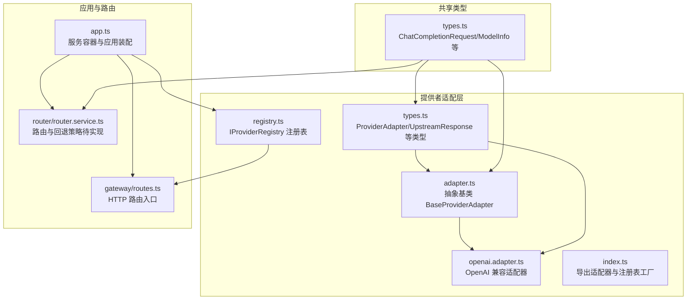
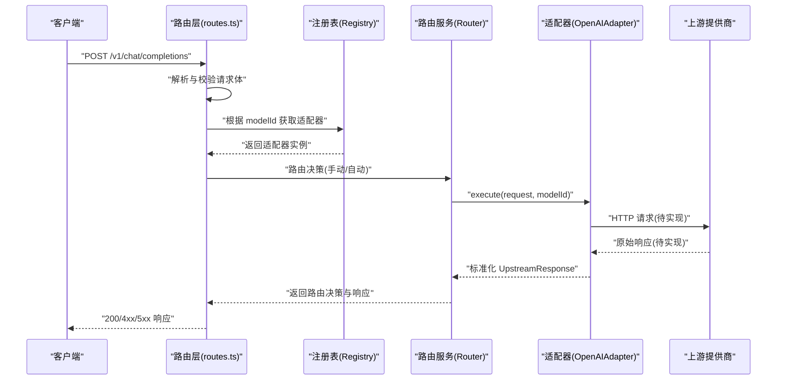
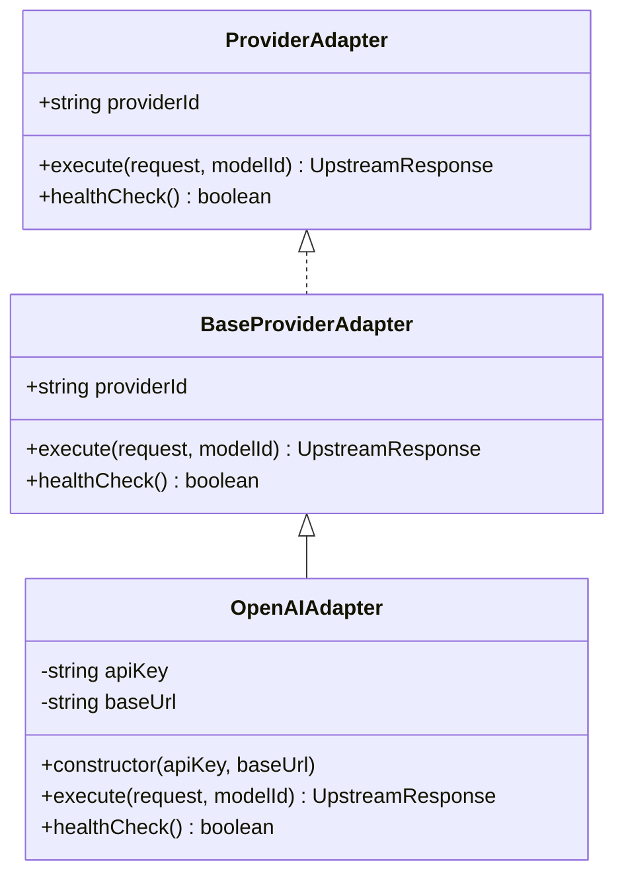
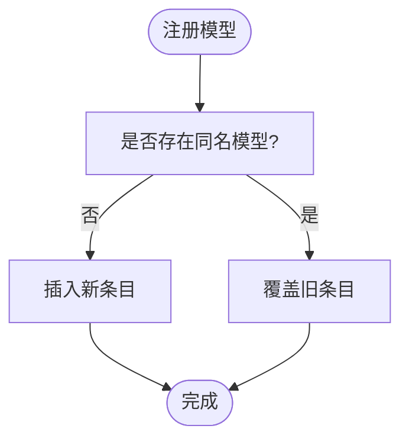
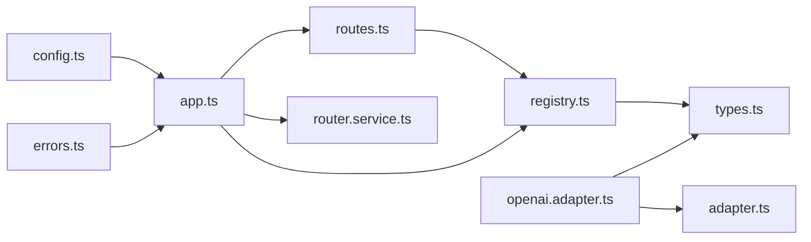

# 提供商适配器

<cite>
**本文引用的文件**
- [src/provider/adapter.ts](file://src/provider/adapter.ts)
- [src/provider/openai.adapter.ts](file://src/provider/openai.adapter.ts)
- [src/provider/registry.ts](file://src/provider/registry.ts)
- [src/provider/types.ts](file://src/provider/types.ts)
- [src/provider/index.ts](file://src/provider/index.ts)
- [src/types.ts](file://src/types.ts)
- [src/app.ts](file://src/app.ts)
- [src/gateway/routes.ts](file://src/gateway/routes.ts)
- [src/router/router.service.ts](file://src/router/router.service.ts)
- [src/config.ts](file://src/config.ts)
- [src/errors.ts](file://src/errors.ts)
- [test/helpers.ts](file://test/helpers.ts)
- [test/integration/flow.test.ts](file://test/integration/flow.test.ts)
- [package.json](file://package.json)
</cite>

## 目录
1. [简介](#简介)
2. [项目结构](#项目结构)
3. [核心组件](#核心组件)
4. [架构总览](#架构总览)
5. [组件详解](#组件详解)
6. [依赖关系分析](#依赖关系分析)
7. [性能考量](#性能考量)
8. [故障排查指南](#故障排查指南)
9. [结论](#结论)
10. [附录：新提供商集成与最佳实践](#附录新提供商集成与最佳实践)

## 简介
本文件面向“提供商适配器系统”的扩展与维护，目标是帮助开发者快速理解并正确扩展新的上游模型提供商（如 OpenAI、Anthropic 等）。文档覆盖以下主题：
- 适配器接口的设计理念与标准化抽象
- 统一调用模式与响应归一化
- OpenAI 适配器的实现要点与待完成项
- 适配器注册表的管理机制与动态加载策略
- 新提供商集成的标准流程、接口规范与兼容性要求
- 测试策略、性能监控与错误处理方案
- 完整的适配器开发指南与最佳实践

## 项目结构
提供商适配器相关代码集中在 src/provider 目录，并与路由、应用装配、类型定义等模块协同工作。

图表来源
- [src/provider/adapter.ts:1-16](file://src/provider/adapter.ts#L1-L16)
- [src/provider/openai.adapter.ts:1-44](file://src/provider/openai.adapter.ts#L1-L44)
- [src/provider/registry.ts:1-65](file://src/provider/registry.ts#L1-L65)
- [src/provider/types.ts:1-36](file://src/provider/types.ts#L1-L36)
- [src/provider/index.ts:1-6](file://src/provider/index.ts#L1-L6)
- [src/app.ts:1-101](file://src/app.ts#L1-L101)
- [src/gateway/routes.ts:1-96](file://src/gateway/routes.ts#L1-L96)
- [src/router/router.service.ts:1-50](file://src/router/router.service.ts#L1-L50)
- [src/types.ts:1-119](file://src/types.ts#L1-L119)

章节来源
- [src/provider/adapter.ts:1-16](file://src/provider/adapter.ts#L1-L16)
- [src/provider/openai.adapter.ts:1-44](file://src/provider/openai.adapter.ts#L1-L44)
- [src/provider/registry.ts:1-65](file://src/provider/registry.ts#L1-L65)
- [src/provider/types.ts:1-36](file://src/provider/types.ts#L1-L36)
- [src/provider/index.ts:1-6](file://src/provider/index.ts#L1-L6)
- [src/app.ts:1-101](file://src/app.ts#L1-L101)
- [src/gateway/routes.ts:1-96](file://src/gateway/routes.ts#L1-L96)
- [src/router/router.service.ts:1-50](file://src/router/router.service.ts#L1-L50)
- [src/types.ts:1-119](file://src/types.ts#L1-L119)

## 核心组件
- 抽象适配器基类：定义统一的 providerId、execute 与 healthCheck 接口契约，确保所有具体适配器遵循一致的调用模式。
- 上游响应归一化：统一的 UpstreamResponse 结构，屏蔽不同提供商的差异，便于上层路由与计费模块消费。
- 注册表：以内存 Map 存储模型到适配器与定价信息的映射，支持按模型 ID 获取适配器与定价，以及列出全部模型。
- OpenAI 兼容适配器：当前已实现的示例适配器，负责将请求转发至 OpenAI 兼容端点并返回标准化响应；目前为占位实现，待完善 HTTP 调用与错误映射。
- 应用装配与路由：应用启动时创建注册表与各服务实例，路由层通过注册表选择适配器执行请求。

章节来源
- [src/provider/adapter.ts:10-15](file://src/provider/adapter.ts#L10-L15)
- [src/provider/types.ts:3-17](file://src/provider/types.ts#L3-L17)
- [src/provider/registry.ts:27-64](file://src/provider/registry.ts#L27-L64)
- [src/provider/openai.adapter.ts:10-43](file://src/provider/openai.adapter.ts#L10-L43)
- [src/app.ts:77-94](file://src/app.ts#L77-L94)
- [src/gateway/routes.ts:69-76](file://src/gateway/routes.ts#L69-L76)

## 架构总览
下图展示了从 HTTP 请求到上游适配器执行的整体调用链路，以及注册表在其中的关键作用。

图表来源
- [src/gateway/routes.ts:23-67](file://src/gateway/routes.ts#L23-L67)
- [src/provider/registry.ts:44-49](file://src/provider/registry.ts#L44-L49)
- [src/router/router.service.ts:27-46](file://src/router/router.service.ts#L27-L46)
- [src/provider/openai.adapter.ts:25-34](file://src/provider/openai.adapter.ts#L25-L34)

## 组件详解

### 抽象适配器与接口契约
- 设计理念
  - 通过抽象基类 BaseProviderAdapter 将“适配器职责”与“具体实现”解耦，确保新增提供商只需实现 execute 与 healthCheck。
  - providerId 字段用于标识提供商，便于注册表与审计日志追踪。
- 统一调用模式
  - execute(request, modelId) 返回标准化 UpstreamResponse，屏蔽上游差异。
  - healthCheck() 用于健康检查，便于注册表与运维监控。
- 类关系示意

图表来源
- [src/provider/types.ts:26-35](file://src/provider/types.ts#L26-L35)
- [src/provider/adapter.ts:10-15](file://src/provider/adapter.ts#L10-L15)
- [src/provider/openai.adapter.ts:10-43](file://src/provider/openai.adapter.ts#L10-L43)

章节来源
- [src/provider/adapter.ts:6-15](file://src/provider/adapter.ts#L6-L15)
- [src/provider/types.ts:26-35](file://src/provider/types.ts#L26-L35)

### OpenAI 兼容适配器
- 实现要点
  - 构造函数接收 apiKey 与可选 baseUrl，默认指向 OpenAI 兼容端点。
  - execute 占位实现，注释中给出 HTTP 调用步骤：构建负载、发起 POST、解析响应、返回标准化 UpstreamResponse，并将网络/超时错误映射为 UpstreamTimeoutError/UpstreamUnavailableError。
  - healthCheck 占位实现，建议发起轻量请求（例如列举模型）进行可达性检查。
- 待完善清单
  - 发起 HTTP 请求并处理上游响应。
  - 错误映射与重试/熔断策略。
  - 健康检查的具体实现。
  - 可观测性指标（延迟、成功率等）。

章节来源
- [src/provider/openai.adapter.ts:10-43](file://src/provider/openai.adapter.ts#L10-L43)

### 适配器注册表
- 职责
  - 在应用启动时注册模型、适配器与定价信息。
  - 对外提供按模型 ID 获取适配器、列出模型、查询定价的能力。
- 数据结构
  - 内存 Map 存储 ModelEntry，包含 ModelInfo 与适配器实例。
  - ModelInfo 中固定 provider 字段为适配器 providerId，context_window 与 capabilities 作为示例字段。
- 关键方法
  - register(modelId, adapter, pricing)：写入注册表。
  - getAdapter(modelId)：按模型 ID 获取适配器，未找到抛错。
  - listModels()：返回全部模型元数据。
  - getModelPricing(modelId)：按模型 ID 获取定价，未找到抛错。

图表来源
- [src/provider/registry.ts:31-42](file://src/provider/registry.ts#L31-L42)

章节来源
- [src/provider/registry.ts:27-64](file://src/provider/registry.ts#L27-L64)

### 路由与回退策略（待实现）
- 当前状态
  - IRouterService 已定义路由接口，createRouterService 返回占位实现。
  - 手动模式：直接从注册表取适配器执行。
  - 自动模式：计划通过策略引擎评分、构建回退链并执行。
- 与注册表的交互
  - 手动模式：直接调用 registry.getAdapter(modelId)。
  - 自动模式：需要访问 registry.listModels() 与 registry.getModelPricing(modelId)。

章节来源
- [src/router/router.service.ts:5-18](file://src/router/router.service.ts#L5-L18)
- [src/router/router.service.ts:20-49](file://src/router/router.service.ts#L20-L49)
- [src/provider/registry.ts:44-62](file://src/provider/registry.ts#L44-L62)

### 应用装配与路由入口
- 应用装配
  - buildApp 创建 Fastify 实例，注册插件与全局错误处理器。
  - 通过 ServiceContainer 注入 providerRegistry、挑战服务、支付验证、回放保护、路由、计量、计费、账本、审计等服务。
- 路由入口
  - /v1/models：通过 providerRegistry.listModels() 返回模型列表。
  - /v1/chat/completions：当前仅处理无支付头场景（返回 402），完整支付流程待实现。

章节来源
- [src/app.ts:35-100](file://src/app.ts#L35-L100)
- [src/gateway/routes.ts:69-76](file://src/gateway/routes.ts#L69-L76)
- [src/gateway/routes.ts:23-67](file://src/gateway/routes.ts#L23-L67)

## 依赖关系分析
- 模块耦合
  - 路由层依赖注册表；注册表依赖 ProviderAdapter 接口；适配器实现依赖共享类型。
  - 应用装配层集中注入服务，降低路由层与底层实现的耦合度。
- 外部依赖
  - Fastify 作为 Web 框架；Zod 用于请求体校验；dotenv 用于环境变量加载。
- 可能的循环依赖
  - 当前模块间为单向依赖（路由 → 注册表 → 适配器），未见循环依赖迹象。

图表来源
- [src/gateway/routes.ts:1-96](file://src/gateway/routes.ts#L1-L96)
- [src/provider/registry.ts:1-65](file://src/provider/registry.ts#L1-L65)
- [src/provider/types.ts:1-36](file://src/provider/types.ts#L1-L36)
- [src/provider/openai.adapter.ts:1-44](file://src/provider/openai.adapter.ts#L1-L44)
- [src/provider/adapter.ts:1-16](file://src/provider/adapter.ts#L1-L16)
- [src/app.ts:1-101](file://src/app.ts#L1-L101)
- [src/router/router.service.ts:1-50](file://src/router/router.service.ts#L1-L50)
- [src/config.ts:1-46](file://src/config.ts#L1-L46)
- [src/errors.ts:1-106](file://src/errors.ts#L1-L106)

章节来源
- [src/gateway/routes.ts:1-96](file://src/gateway/routes.ts#L1-L96)
- [src/provider/registry.ts:1-65](file://src/provider/registry.ts#L1-L65)
- [src/provider/types.ts:1-36](file://src/provider/types.ts#L1-L36)
- [src/provider/openai.adapter.ts:1-44](file://src/provider/openai.adapter.ts#L1-L44)
- [src/provider/adapter.ts:1-16](file://src/provider/adapter.ts#L1-L16)
- [src/app.ts:1-101](file://src/app.ts#L1-L101)
- [src/router/router.service.ts:1-50](file://src/router/router.service.ts#L1-L50)
- [src/config.ts:1-46](file://src/config.ts#L1-L46)
- [src/errors.ts:1-106](file://src/errors.ts#L1-L106)

## 性能考量
- 延迟与吞吐
  - 适配器应记录 latency_ms 并在标准化响应中返回，便于路由与监控。
  - 健康检查应采用轻量请求，避免影响主流量。
- 错误映射
  - 将上游网络/超时错误映射为 UpstreamTimeoutError/UpstreamUnavailableError，有助于快速定位问题与降级策略。
- 可观测性
  - 建议在适配器层埋点：请求耗时、错误码分布、成功率、重试次数等。
  - 在路由层记录路由决策与回退链，辅助排障与策略优化。

## 故障排查指南
- 常见错误与处理
  - 402 无支付证明：检查 x-402-challenge 与 x-402-payment 头是否齐全。
  - 400 请求哈希不匹配：核对请求体与挑战中的 request_hash 是否一致。
  - 503/504 上游不可用/超时：检查上游健康检查与网络连通性。
  - 500 内部错误：查看应用日志与错误栈。
- 错误类型与映射
  - PaymentRequiredError、ChallengeExpiredError、RequestHashMismatchError、PaymentVerificationFailedError、PaymentReplayedError、InsufficientPaymentError、UpstreamTimeoutError、UpstreamUnavailableError、InternalError。
  - errorToResponse 将 AppError 映射为 API 响应格式，必要时附加 payment_requirements。

章节来源
- [src/errors.ts:6-105](file://src/errors.ts#L6-L105)
- [src/gateway/routes.ts:23-67](file://src/gateway/routes.ts#L23-L67)

## 结论
提供商适配器系统通过抽象接口与注册表实现了对多上游提供商的统一接入与管理。当前 OpenAI 兼容适配器处于占位实现阶段，后续需完善 HTTP 调用、错误映射与健康检查。注册表提供了简洁的模型-适配器-定价映射能力，配合路由服务可支撑手动与自动两种路由模式。建议在实现过程中严格遵循接口契约、保持响应归一化、完善可观测性与错误处理，以确保系统的稳定性与可扩展性。

## 附录：新提供商集成与最佳实践

### 集成流程
- 步骤
  - 定义适配器类：继承 BaseProviderAdapter，实现 execute 与 healthCheck。
  - 规范化响应：将上游响应映射为 UpstreamResponse，确保包含 model_used、choices、usage、latency_ms。
  - 注册模型：在应用启动时调用 registry.register(modelId, adapter, pricing) 完成注册。
  - 路由对接：在路由层或策略引擎中按需使用 registry.getAdapter(modelId) 或 listModels()。
- 接口规范
  - ProviderAdapter.execute(request, modelId) 必须返回标准化 UpstreamResponse。
  - healthCheck() 返回布尔值，表示上游可达性。
  - 错误映射：将网络/超时错误映射为 UpstreamTimeoutError/UpstreamUnavailableError。
- 兼容性要求
  - 保持 providerId 与 ModelInfo.provider 一致，便于审计与统计。
  - 使用共享类型 ChatCompletionRequest 与 ModelInfo，确保跨模块一致性。

章节来源
- [src/provider/adapter.ts:10-15](file://src/provider/adapter.ts#L10-L15)
- [src/provider/types.ts:3-17](file://src/provider/types.ts#L3-L17)
- [src/provider/registry.ts:31-42](file://src/provider/registry.ts#L31-L42)
- [src/types.ts:22-40](file://src/types.ts#L22-L40)
- [src/types.ts:74-80](file://src/types.ts#L74-L80)

### 开发指南与最佳实践
- 适配器开发
  - 严格遵循 ProviderAdapter 接口契约，避免在适配器内引入业务逻辑。
  - 在 execute 中实现幂等与可重试策略，结合指数退避与熔断控制。
  - 记录关键指标（延迟、错误码、重试次数），便于监控与告警。
- 注册表管理
  - 启动时集中注册，避免运行时并发修改。
  - 对于动态模型目录，考虑持久化存储与缓存更新策略。
- 路由与回退
  - 手动模式直接执行；自动模式基于评分与回退链构建弹性执行路径。
  - 记录路由决策与回退链，形成可审计的路由证据。
- 测试策略
  - 单元测试：针对适配器的 execute 与 healthCheck 进行行为测试。
  - 集成测试：通过 buildTestApp 构建最小化服务，验证路由与注册表协作。
  - 性能测试：模拟高并发请求，评估延迟与错误率。
- 配置与环境
  - 通过 dotenv 与 config.loadConfig 加载 OPENAI_API_KEY 等敏感配置。
  - 不在代码中硬编码密钥，确保生产安全。

章节来源
- [src/provider/openai.adapter.ts:25-42](file://src/provider/openai.adapter.ts#L25-L42)
- [src/app.ts:77-94](file://src/app.ts#L77-L94)
- [test/helpers.ts:19-44](file://test/helpers.ts#L19-L44)
- [test/integration/flow.test.ts:1-51](file://test/integration/flow.test.ts#L1-L51)
- [src/config.ts:28-45](file://src/config.ts#L28-L45)