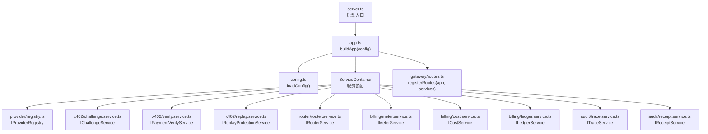
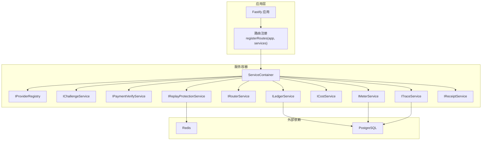
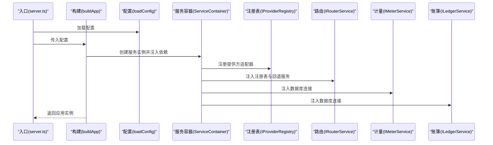
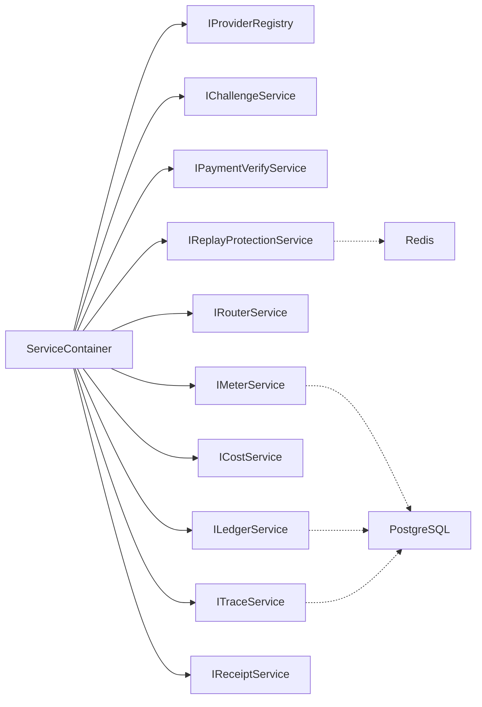

# 服务容器与依赖注入

<cite>
**本文引用的文件**
- [src/app.ts](file://src/app.ts)
- [src/config.ts](file://src/config.ts)
- [src/server.ts](file://src/server.ts)
- [src/types.ts](file://src/types.ts)
- [src/provider/index.ts](file://src/provider/index.ts)
- [src/provider/registry.ts](file://src/provider/registry.ts)
- [src/x402/challenge.service.ts](file://src/x402/challenge.service.ts)
- [src/x402/verify.service.ts](file://src/x402/verify.service.ts)
- [src/x402/replay.service.ts](file://src/x402/replay.service.ts)
- [src/router/router.service.ts](file://src/router/router.service.ts)
- [src/router/fallback.service.ts](file://src/router/fallback.service.ts)
- [src/billing/meter.service.ts](file://src/billing/meter.service.ts)
- [src/billing/cost.service.ts](file://src/billing/cost.service.ts)
- [src/billing/ledger.service.ts](file://src/billing/ledger.service.ts)
- [src/audit/trace.service.ts](file://src/audit/trace.service.ts)
- [src/audit/receipt.service.ts](file://src/audit/receipt.service.ts)
</cite>

## 目录
1. [简介](#简介)
2. [项目结构](#项目结构)
3. [核心组件](#核心组件)
4. [架构总览](#架构总览)
5. [详细组件分析](#详细组件分析)
6. [依赖分析](#依赖分析)
7. [性能考虑](#性能考虑)
8. [故障排查指南](#故障排查指南)
9. [结论](#结论)
10. [附录](#附录)

## 简介
本文件系统性阐述 x402 Gateway 的服务容器与依赖注入机制。重点围绕 ServiceContainer 接口的设计理念、服务实例化流程、依赖注入模式的实现展开；并详细说明服务组件的初始化顺序、配置参数传递与生命周期管理。文档还解释了服务容器如何协调各模块间的协作关系，以实现松耦合的服务架构，并给出服务注册、解析与销毁的完整流程及实际代码示例路径，帮助读者快速理解并扩展该体系。

## 项目结构
从入口到应用构建，再到服务装配与路由注册，整体流程如下：

图表来源
- [src/server.ts:1-33](file://src/server.ts#L1-L33)
- [src/app.ts:35-100](file://src/app.ts#L35-L100)
- [src/config.ts:28-45](file://src/config.ts#L28-L45)
- [src/provider/registry.ts:27-64](file://src/provider/registry.ts#L27-L64)
- [src/x402/challenge.service.ts:28-70](file://src/x402/challenge.service.ts#L28-L70)
- [src/x402/verify.service.ts:18-32](file://src/x402/verify.service.ts#L18-L32)
- [src/x402/replay.service.ts:23-50](file://src/x402/replay.service.ts#L23-L50)
- [src/router/router.service.ts:20-48](file://src/router/router.service.ts#L20-L48)
- [src/billing/meter.service.ts:13-27](file://src/billing/meter.service.ts#L13-L27)
- [src/billing/cost.service.ts:16-29](file://src/billing/cost.service.ts#L16-L29)
- [src/billing/ledger.service.ts:17-39](file://src/billing/ledger.service.ts#L17-L39)
- [src/audit/trace.service.ts:38-65](file://src/audit/trace.service.ts#L38-L65)
- [src/audit/receipt.service.ts:14-23](file://src/audit/receipt.service.ts#L14-L23)

章节来源
- [src/server.ts:1-33](file://src/server.ts#L1-L33)
- [src/app.ts:35-100](file://src/app.ts#L35-L100)
- [src/config.ts:28-45](file://src/config.ts#L28-L45)

## 核心组件
本节聚焦 ServiceContainer 接口与服务装配策略，阐明依赖注入的实现方式与协作关系。

- ServiceContainer 接口设计
  - 作用：集中声明所有业务服务实例，作为路由处理器的统一依赖注入载体。
  - 设计要点：通过接口聚合服务契约，避免在路由层直接依赖具体实现，实现解耦与可替换性。
  - 关键字段：包括提供方适配器注册表、挑战生成与校验、支付验证、重放防护、路由编排、计量、计费、账簿、审计追踪与回执等。

- 服务实例化与装配
  - 装配位置：在应用构建函数中集中创建并组装服务实例，形成 ServiceContainer 对象。
  - 参数来源：配置对象（来自环境变量）作为依赖注入的外部参数，传入各服务构造器。
  - 注册方式：通过“工厂函数 + 依赖对象”的模式，将外部依赖（如数据库、缓存）与内部服务解耦。

- 生命周期管理
  - 启动阶段：加载配置、注册插件、装配服务、注册路由。
  - 运行阶段：请求到达时，由路由处理器从 ServiceContainer 中解析所需服务执行业务逻辑。
  - 关闭阶段：优雅关闭 HTTP 服务器；预留 Redis 与数据库连接关闭点位。

章节来源
- [src/app.ts:22-33](file://src/app.ts#L22-L33)
- [src/app.ts:77-94](file://src/app.ts#L77-L94)
- [src/server.ts:4-26](file://src/server.ts#L4-L26)
- [src/config.ts:28-45](file://src/config.ts#L28-L45)

## 架构总览
下图展示了服务容器如何协调各模块协作，以及依赖注入的流向与职责边界。

图表来源
- [src/app.ts:77-94](file://src/app.ts#L77-L94)
- [src/x402/replay.service.ts:23-50](file://src/x402/replay.service.ts#L23-L50)
- [src/billing/ledger.service.ts:17-39](file://src/billing/ledger.service.ts#L17-L39)
- [src/billing/meter.service.ts:13-27](file://src/billing/meter.service.ts#L13-L27)
- [src/audit/trace.service.ts:38-65](file://src/audit/trace.service.ts#L38-L65)

## 详细组件分析

### ServiceContainer 接口与装配流程
- 设计理念
  - 将所有服务以接口形式暴露，便于替换与测试；同时通过单一对象承载，简化路由层依赖解析。
  - 采用“工厂函数 + 依赖对象”的注入模式，使服务内部不直接感知外部依赖来源，仅依赖显式传入的依赖对象。

- 实例化流程
  - 加载配置：从环境变量解析并校验配置项。
  - 创建服务：按顺序调用各服务工厂函数，传入必要的配置参数或外部依赖。
  - 组装容器：将服务实例放入 ServiceContainer 对象。
  - 注册路由：将容器传入路由注册函数，供处理器使用。

- 初始化顺序与配置参数传递
  - 顺序：先注册插件与钩子，再装配服务，最后注册路由。
  - 配置参数：挑战密钥、挑战过期时间、商户地址、支付链与资产等均来自配置对象，逐项传入对应服务工厂。

- 生命周期管理
  - 启动：监听端口，记录日志。
  - 关闭：优雅关闭 HTTP 服务器；预留 Redis 与数据库连接关闭点位。

章节来源
- [src/app.ts:35-100](file://src/app.ts#L35-L100)
- [src/config.ts:28-45](file://src/config.ts#L28-L45)
- [src/server.ts:4-26](file://src/server.ts#L4-L26)

### 提供方注册表（Provider Registry）
- 角色与职责
  - 维护模型到适配器的映射，提供注册、查询与定价信息读取能力。
  - 为路由服务提供上游适配器选择的基础数据源。

- 依赖注入
  - 无外部依赖，通过内存 Map 存储模型条目。
  - 作为 ServiceContainer 的一部分被注入到路由服务等模块。

- 初始化与使用
  - 在应用启动时创建并注册若干模型与适配器。
  - 路由服务根据请求中的模型 ID 查询适配器并执行。

章节来源
- [src/provider/registry.ts:27-64](file://src/provider/registry.ts#L27-L64)
- [src/app.ts:77-78](file://src/app.ts#L77-L78)

### 挑战服务（Challenge Service）
- 角色与职责
  - 生成 402 挑战，计算请求哈希，校验挑战令牌与请求体一致性。
  - 与支付验证服务配合，完成未支付请求的挑战与重试保护。

- 依赖注入
  - 依赖挑战密钥、挑战过期时间、商户地址、支付链与资产等配置参数。
  - 作为 ServiceContainer 的一部分被注入到路由与支付流程。

- 初始化顺序
  - 在应用启动时创建，参数来自配置对象。

章节来源
- [src/x402/challenge.service.ts:28-70](file://src/x402/challenge.service.ts#L28-L70)
- [src/app.ts:79-85](file://src/app.ts#L79-L85)

### 支付验证服务（Payment Verify Service）
- 角色与职责
  - 基于链上交易证明验证付款金额、资产与收款人是否满足挑战要求。
  - 与挑战服务配合，确保支付合规。

- 依赖注入
  - 无外部依赖，作为独立服务注入到路由与审计流程。

章节来源
- [src/x402/verify.service.ts:18-32](file://src/x402/verify.service.ts#L18-L32)
- [src/app.ts:86](file://src/app.ts#L86)

### 重放防护服务（Replay Protection Service）
- 角色与职责
  - 使用 Redis 原子操作检查并标记重复的支付证明哈希，防止重放。
  - 提供幂等性缓存能力，支持基于键的响应缓存。

- 依赖注入
  - 依赖 Redis 客户端实例；当前装配时传入占位值，后续应替换为真实连接。
  - 作为 ServiceContainer 的一部分被注入到支付与审计流程。

- 初始化顺序
  - 在应用启动时创建，预留 Redis 连接初始化点位。

章节来源
- [src/x402/replay.service.ts:23-50](file://src/x402/replay.service.ts#L23-L50)
- [src/app.ts:87](file://src/app.ts#L87)

### 路由服务（Router Service）
- 角色与职责
  - 协调路由决策：手动模式直接执行指定模型；自动模式通过策略引擎评分与回退链执行。
  - 产出路由决策元数据与上游响应，并生成路由证明哈希。

- 依赖注入
  - 计划依赖策略引擎、回退服务与提供方注册表；当前工厂函数注释中预留依赖签名。
  - 作为 ServiceContainer 的一部分被注入到路由处理流程。

- 初始化顺序
  - 在应用启动时创建，依赖注册表与回退服务。

章节来源
- [src/router/router.service.ts:20-48](file://src/router/router.service.ts#L20-L48)
- [src/app.ts:88](file://src/app.ts#L88)

### 回退服务（Fallback Service）
- 角色与职责
  - 按顺序尝试多个模型，返回首个成功结果；若全部失败则抛出上游不可用错误。
  - 保证不重复计费，仅对成功执行的模型计费。

- 依赖注入
  - 无外部依赖，作为工具型服务注入到路由服务。

章节来源
- [src/router/fallback.service.ts:18-39](file://src/router/fallback.service.ts#L18-L39)
- [src/app.ts:88](file://src/app.ts#L88)

### 计量服务（Meter Service）
- 角色与职责
  - 从上游响应中提取令牌用量并持久化为用量记录。
  - 作为账簿与计费的输入数据源。

- 依赖注入
  - 无外部依赖，作为独立服务注入到路由与审计流程。

- 初始化顺序
  - 在应用启动时创建。

章节来源
- [src/billing/meter.service.ts:13-27](file://src/billing/meter.service.ts#L13-L27)
- [src/app.ts:89](file://src/app.ts#L89)

### 计费服务（Cost Service）
- 角色与职责
  - 基于用量记录与模型定价计算费用明细，支持平台费率与确定性输出。
  - 为账簿与审计提供成本数据。

- 依赖注入
  - 无外部依赖，作为独立服务注入到审计流程。

章节来源
- [src/billing/cost.service.ts:16-29](file://src/billing/cost.service.ts#L16-L29)
- [src/app.ts:90](file://src/app.ts#L90)

### 账簿服务（Ledger Service）
- 角色与职责
  - 以追加写的方式提交账簿条目，支持按请求 ID 与报价 ID 查询。
  - 保证账簿只追加不修改，补偿通过新增条目实现。

- 依赖注入
  - 依赖 PostgreSQL 数据库连接；当前装配时预留连接初始化点位。
  - 作为 ServiceContainer 的一部分被注入到计费与审计流程。

章节来源
- [src/billing/ledger.service.ts:17-39](file://src/billing/ledger.service.ts#L17-L39)
- [src/app.ts:91](file://src/app.ts#L91)

### 审计追踪服务（Trace Service）
- 角色与职责
  - 记录请求生命周期内的状态变化，支持开始、完成与失败三种状态。
  - 提供按请求 ID 查询追踪记录的能力。

- 依赖注入
  - 依赖 PostgreSQL 数据库连接；当前装配时预留连接初始化点位。
  - 作为 ServiceContainer 的一部分被注入到路由与审计流程。

章节来源
- [src/audit/trace.service.ts:38-65](file://src/audit/trace.service.ts#L38-L65)
- [src/app.ts:92](file://src/app.ts#L92)

### 审计回执服务（Receipt Service）
- 角色与职责
  - 通过联结追踪、路由决策、用量、成本与支付数据，重建完整的审计回执。
  - 用于对外提供审计查询接口。

- 依赖注入
  - 无外部依赖，作为独立服务注入到审计流程。

章节来源
- [src/audit/receipt.service.ts:14-23](file://src/audit/receipt.service.ts#L14-L23)
- [src/app.ts:93](file://src/app.ts#L93)

### 服务注册、解析与销毁流程
- 服务注册
  - 在应用启动时，通过工厂函数创建各服务实例，并将依赖参数（如配置、Redis、数据库连接）注入。
  - 将服务实例汇总到 ServiceContainer，供路由层统一解析。

- 服务解析
  - 路由处理器从 ServiceContainer 中按需解析所需服务，避免在处理器内部直接创建或查找依赖。
  - 通过接口抽象屏蔽具体实现差异，提升可替换性与可测试性。

- 服务销毁
  - 应用优雅关闭时，先关闭 HTTP 服务器；随后预留 Redis 与数据库连接关闭点位，确保资源释放。

图表来源
- [src/server.ts:4-26](file://src/server.ts#L4-L26)
- [src/app.ts:35-100](file://src/app.ts#L35-L100)
- [src/config.ts:28-45](file://src/config.ts#L28-L45)
- [src/provider/registry.ts:27-64](file://src/provider/registry.ts#L27-L64)
- [src/router/router.service.ts:20-48](file://src/router/router.service.ts#L20-L48)
- [src/billing/meter.service.ts:13-27](file://src/billing/meter.service.ts#L13-L27)
- [src/billing/ledger.service.ts:17-39](file://src/billing/ledger.service.ts#L17-L39)

## 依赖分析
- 内聚与耦合
  - 服务内聚：每个服务专注于单一职责，接口清晰，便于替换与测试。
  - 服务间耦合：通过 ServiceContainer 解耦，路由层仅依赖接口；外部依赖（Redis、数据库）通过工厂函数注入，降低全局耦合。

- 外部依赖
  - Redis：用于重放防护与幂等性缓存。
  - PostgreSQL：用于账簿、计量与审计追踪的数据持久化。

- 循环依赖
  - 当前实现未见循环依赖迹象；服务通过接口与工厂函数解耦，避免相互直接引用。

图表来源
- [src/app.ts:77-94](file://src/app.ts#L77-L94)
- [src/x402/replay.service.ts:23-50](file://src/x402/replay.service.ts#L23-L50)
- [src/billing/ledger.service.ts:17-39](file://src/billing/ledger.service.ts#L17-L39)
- [src/billing/meter.service.ts:13-27](file://src/billing/meter.service.ts#L13-L27)
- [src/audit/trace.service.ts:38-65](file://src/audit/trace.service.ts#L38-L65)

## 性能考虑
- 依赖注入的性能影响
  - 工厂函数与接口抽象带来的开销极低，主要成本在于外部依赖（Redis、数据库）的网络往返。
  - 通过 ServiceContainer 集中管理服务实例，减少重复创建与查找成本。

- 缓存与幂等性
  - 利用 Redis 缓存重放标记与幂等响应，显著降低重复请求的处理时间与外部调用次数。

- 数据库访问
  - 将计量、账簿与审计追踪的写入操作合并为最小必要事务，避免频繁小事务带来的开销。

- 路由与回退
  - 自动模式下的评分与回退链应尽量缩短候选集，减少不必要的上游调用。

## 故障排查指南
- 配置加载失败
  - 现象：启动时报错，提示配置项缺失或类型不匹配。
  - 排查：检查环境变量是否正确设置，确认配置 Schema 是否覆盖所有必需项。

- 服务工厂未实现
  - 现象：调用服务方法时抛出“未实现”异常。
  - 排查：确认相应服务的工厂函数已实现业务逻辑；关注各服务文件中的 TODO 注释。

- Redis 连接问题
  - 现象：重放防护相关功能异常。
  - 排查：确认 Redis 连接已正确初始化并注入到服务容器；检查连接字符串与权限。

- 数据库连接问题
  - 现象：账簿、计量与审计追踪相关功能异常。
  - 排查：确认数据库连接已正确初始化并注入到服务容器；检查连接字符串与权限。

- 路由失败
  - 现象：自动模式下无法选择模型或回退链执行失败。
  - 排查：确认提供方注册表已正确注册模型与适配器；检查回退链顺序与可用性。

章节来源
- [src/config.ts:28-45](file://src/config.ts#L28-L45)
- [src/x402/replay.service.ts:23-50](file://src/x402/replay.service.ts#L23-L50)
- [src/billing/ledger.service.ts:17-39](file://src/billing/ledger.service.ts#L17-L39)
- [src/billing/meter.service.ts:13-27](file://src/billing/meter.service.ts#L13-L27)
- [src/audit/trace.service.ts:38-65](file://src/audit/trace.service.ts#L38-L65)

## 结论
本文件系统性梳理了 x402 Gateway 的服务容器与依赖注入机制。通过接口抽象与工厂函数注入，实现了服务的松耦合与高内聚；通过 ServiceContainer 统一装配与解析，简化了路由层的依赖管理。未来可在以下方面持续演进：完善外部依赖（Redis、数据库）的初始化与关闭流程；补齐各服务的业务实现；引入更细粒度的监控与可观测性指标，以支撑生产环境的稳定运行。

## 附录
- 关键类型与接口定义参考
  - 共享领域类型：聊天补全请求/响应、模型目录、审计记录等。
  - 服务接口：提供方注册表、挑战服务、支付验证、重放防护、路由服务、计量、计费、账簿、审计追踪与回执等。

章节来源
- [src/types.ts:17-62](file://src/types.ts#L17-L62)
- [src/types.ts:74-84](file://src/types.ts#L74-L84)
- [src/types.ts:110-118](file://src/types.ts#L110-L118)