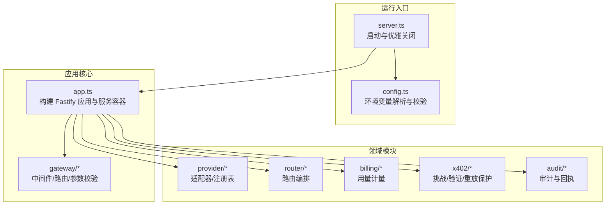
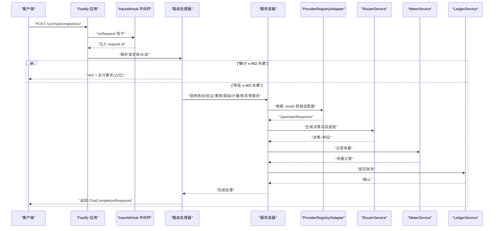
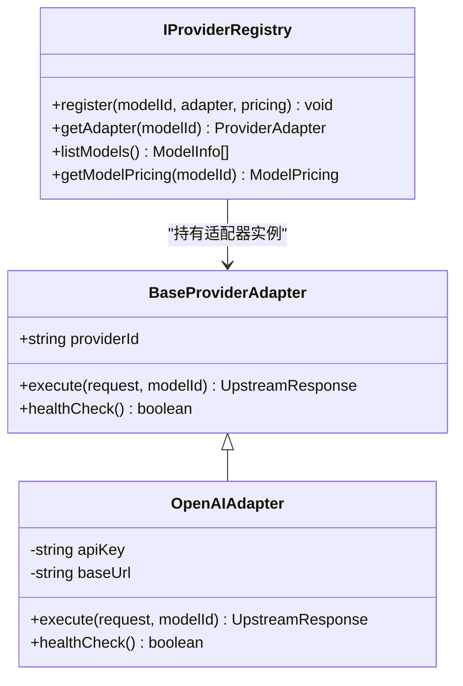
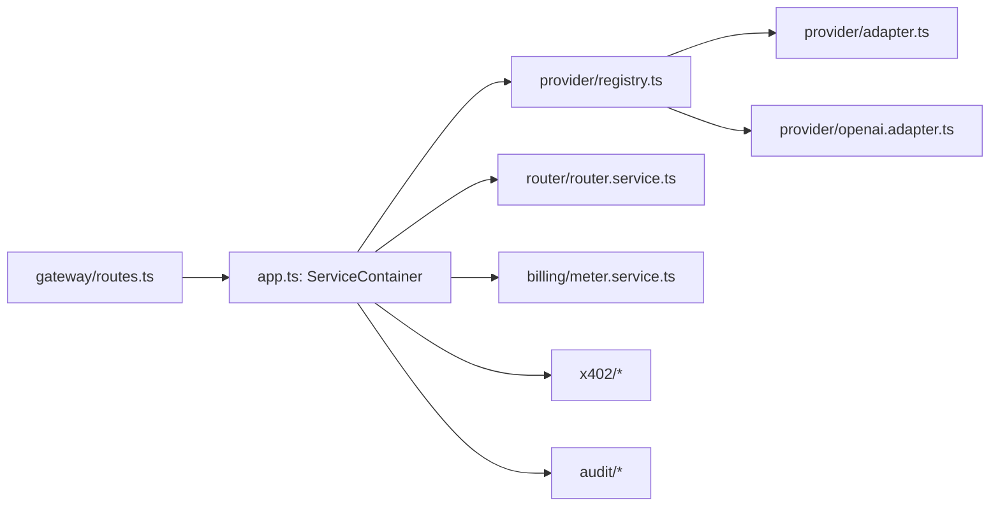

# 模块化设计

<cite>
**本文引用的文件**
- [src/app.ts](file://src/app.ts)
- [src/server.ts](file://src/server.ts)
- [src/config.ts](file://src/config.ts)
- [src/types.ts](file://src/types.ts)
- [src/gateway/index.ts](file://src/gateway/index.ts)
- [src/gateway/middleware.ts](file://src/gateway/middleware.ts)
- [src/gateway/routes.ts](file://src/gateway/routes.ts)
- [src/provider/index.ts](file://src/provider/index.ts)
- [src/provider/adapter.ts](file://src/provider/adapter.ts)
- [src/provider/openai.adapter.ts](file://src/provider/openai.adapter.ts)
- [src/provider/registry.ts](file://src/provider/registry.ts)
- [src/router/router.service.ts](file://src/router/router.service.ts)
- [src/billing/meter.service.ts](file://src/billing/meter.service.ts)
- [src/x402/index.ts](file://src/x402/index.ts)
</cite>

## 目录
1. [引言](#引言)
2. [项目结构](#项目结构)
3. [核心组件](#核心组件)
4. [架构总览](#架构总览)
5. [详细组件分析](#详细组件分析)
6. [依赖分析](#依赖分析)
7. [性能考虑](#性能考虑)
8. [故障排查指南](#故障排查指南)
9. [结论](#结论)
10. [附录](#附录)

## 引言
本设计文档围绕 x402 Gateway 的模块化架构展开，目标是清晰划分功能模块、定义模块边界与通信机制，解释服务容器模式与依赖注入的应用方式，并梳理模块初始化流程。文档同时给出模块解耦策略、可替换性设计与扩展点识别，辅以模块依赖关系图与交互时序图，帮助开发者快速理解系统结构并在不破坏契约的前提下进行演进。

## 项目结构
项目采用按“领域/能力”分层的模块组织方式：核心入口在 server 与 app；网关层负责路由与中间件；各子域（Provider、Router、Billing、X402、Audit）通过统一的服务容器注入到路由处理中；共享类型定义位于 types 中；配置加载位于 config。

图表来源
- [src/server.ts:1-33](file://src/server.ts#L1-L33)
- [src/app.ts:35-100](file://src/app.ts#L35-L100)
- [src/gateway/index.ts:1-9](file://src/gateway/index.ts#L1-L9)

章节来源
- [src/server.ts:1-33](file://src/server.ts#L1-L33)
- [src/app.ts:35-100](file://src/app.ts#L35-L100)
- [src/config.ts:28-45](file://src/config.ts#L28-L45)

## 核心组件
- 服务容器（ServiceContainer）
  - 职责：集中声明并实例化所有业务服务，供路由处理器使用。
  - 关键字段：提供方注册表、挑战服务、支付验证服务、重放保护服务、路由服务、用量计量服务、计费服务、账本服务、审计追踪服务、回执服务。
  - 初始化：在应用构建阶段创建并注入到路由注册函数。
- 应用构建器（buildApp）
  - 职责：装配插件、钩子、全局错误处理器，构造服务容器，注册路由。
  - 配置来源：从环境变量加载配置并通过工厂函数创建服务实例。
- 运行入口（server）
  - 职责：加载配置、构建应用、监听端口、处理优雅关闭信号。

章节来源
- [src/app.ts:22-33](file://src/app.ts#L22-L33)
- [src/app.ts:77-94](file://src/app.ts#L77-L94)
- [src/server.ts:4-26](file://src/server.ts#L4-L26)

## 架构总览
下图展示从请求进入网关到调用上游模型的典型链路，以及支付相关流程的占位与后续实现点。

图表来源
- [src/gateway/routes.ts:23-67](file://src/gateway/routes.ts#L23-L67)
- [src/gateway/middleware.ts:9-12](file://src/gateway/middleware.ts#L9-L12)
- [src/app.ts:77-94](file://src/app.ts#L77-L94)
- [src/provider/registry.ts:27-64](file://src/provider/registry.ts#L27-L64)
- [src/router/router.service.ts:20-49](file://src/router/router.service.ts#L20-L49)
- [src/billing/meter.service.ts:13-28](file://src/billing/meter.service.ts#L13-L28)

## 详细组件分析

### 网关层（Gateway）
- 职责
  - 提供 OpenAI 兼容的聊天补全接口与模型列表查询。
  - 通过中间件注入唯一请求 ID，便于跨服务追踪。
  - 对请求体与审计参数进行结构化校验。
- 接口与实现要点
  - 中间件：在 onRequest 阶段生成并挂载 request.id。
  - 路由：
    - POST /v1/chat/completions：当前实现返回 402 并输出占位的支付要求；完整流程将在后续实现挑战校验、支付验证、重放检查、路由选择、用量计量、成本计算与账本提交。
    - GET /v1/models：委托 ProviderRegistry 返回可用模型清单。
    - GET /v1/audit/requests/:request_id：占位返回未实现提示。
- 可替换性与扩展点
  - 新增路由：在现有路由注册处追加新端点。
  - 参数校验：通过 schemas 定义与路由内复用，便于扩展审计参数或请求体字段。

章节来源
- [src/gateway/middleware.ts:9-12](file://src/gateway/middleware.ts#L9-L12)
- [src/gateway/routes.ts:9-96](file://src/gateway/routes.ts#L9-L96)
- [src/gateway/index.ts:1-9](file://src/gateway/index.ts#L1-L9)

### 提供方适配层（Provider）
- 职责
  - 统一上游模型访问抽象，屏蔽不同提供商的差异。
  - 通过注册表集中管理模型与适配器映射。
- 接口与实现要点
  - 抽象基类：BaseProviderAdapter 定义 execute 与 healthCheck 合约。
  - OpenAI 兼容适配器：OpenAIAdapter 实现具体执行逻辑与健康检查（当前为占位）。
  - 注册表：IProviderRegistry 提供注册、查询、定价与模型列表能力。
- 可替换性与扩展点
  - 新增提供商：新增适配器类并实现 execute/healthCheck，随后在启动时注册到注册表。
  - 动态模型目录：当前内存注册表，后续可替换为数据库持久化。

图表来源
- [src/provider/adapter.ts:10-15](file://src/provider/adapter.ts#L10-L15)
- [src/provider/openai.adapter.ts:10-43](file://src/provider/openai.adapter.ts#L10-L43)
- [src/provider/registry.ts:4-64](file://src/provider/registry.ts#L4-L64)

章节来源
- [src/provider/adapter.ts:10-15](file://src/provider/adapter.ts#L10-L15)
- [src/provider/openai.adapter.ts:10-43](file://src/provider/openai.adapter.ts#L10-L43)
- [src/provider/registry.ts:27-64](file://src/provider/registry.ts#L27-L64)
- [src/provider/index.ts:1-6](file://src/provider/index.ts#L1-L6)

### 路由编排层（Router）
- 职责
  - 根据请求的路由模式（手动/自动）选择最佳模型与回退链。
  - 产出路由决策与上游响应，并生成路由证明哈希。
- 接口与实现要点
  - IRouterService 定义 route 合约，返回决策与响应。
  - 当前实现为占位，后续需集成策略引擎、回退服务与注册表。
- 可替换性与扩展点
  - 策略引擎：可注入评分与选择算法。
  - 回退服务：可注入多级回退执行器。
  - 注册表：用于获取可用模型集合与元数据。

章节来源
- [src/router/router.service.ts:5-49](file://src/router/router.service.ts#L5-L49)

### 计量与账单层（Billing）
- 职责
  - 从上游响应提取 token 使用量，构建用量记录并持久化。
  - 为后续成本计算与账本提交提供数据基础。
- 接口与实现要点
  - IMeterService 定义 recordUsage 合约。
  - 当前实现为占位，后续需对接数据库与计费服务。
- 可替换性与扩展点
  - 存储后端：可替换为其他存储（如时序库、对象存储）。
  - 计费策略：可注入成本计算服务以支持动态费率。

章节来源
- [src/billing/meter.service.ts:5-28](file://src/billing/meter.service.ts#L5-L28)

### x402 支付与安全层（X402）
- 职责
  - 生成挑战、校验挑战、验证支付证明、防止重放攻击。
- 接口与实现要点
  - 挑战服务：根据配置生成挑战令牌与过期时间。
  - 支付验证服务：校验支付证明与挑战一致性。
  - 重放保护服务：基于外部缓存（如 Redis）标记已消费的支付证明。
- 可替换性与扩展点
  - 缓存后端：可替换为其他缓存系统。
  - 加密库：可替换为更通用的 JWK/JWE 解析器。

章节来源
- [src/x402/index.ts:1-13](file://src/x402/index.ts#L1-L13)
- [src/app.ts:79-87](file://src/app.ts#L79-L87)

### 审计与回执层（Audit）
- 职责
  - 记录请求轨迹、路由决策、成本与支付证据，提供回执查询能力。
- 接口与实现要点
  - 审计追踪服务：记录请求哈希、路由决策、用量、成本与支付状态。
  - 回执服务：按请求 ID 查询审计回执（当前占位）。
- 可替换性与扩展点
  - 存储后端：可替换为分布式日志系统或审计数据库。

章节来源
- [src/app.ts:92-93](file://src/app.ts#L92-L93)
- [src/gateway/routes.ts:82-94](file://src/gateway/routes.ts#L82-L94)

## 依赖分析
- 模块内聚与耦合
  - 网关层仅负责薄薄的参数解析与路由转发，业务逻辑下沉至服务层，保持高内聚低耦合。
  - 服务容器作为依赖注入中心，避免路由层直接依赖具体实现。
- 外部依赖
  - Fastify 生态插件（CORS、Helmet、限流、Sensible）提升安全性与稳定性。
  - Redis、PostgreSQL 作为可插拔的外部存储（当前在应用构建处预留初始化位置）。
- 依赖方向
  - 路由依赖服务容器；服务容器依赖各领域服务；领域服务之间通过接口协作，避免循环依赖。

图表来源
- [src/gateway/routes.ts:9-96](file://src/gateway/routes.ts#L9-L96)
- [src/app.ts:77-94](file://src/app.ts#L77-L94)
- [src/provider/registry.ts:27-64](file://src/provider/registry.ts#L27-L64)
- [src/router/router.service.ts:20-49](file://src/router/router.service.ts#L20-L49)
- [src/billing/meter.service.ts:13-28](file://src/billing/meter.service.ts#L13-L28)
- [src/x402/index.ts:1-13](file://src/x402/index.ts#L1-L13)

章节来源
- [src/gateway/routes.ts:9-96](file://src/gateway/routes.ts#L9-L96)
- [src/app.ts:77-94](file://src/app.ts#L77-L94)

## 性能考虑
- 请求追踪与可观测性
  - 中间件注入唯一请求 ID，便于跨服务链路追踪与日志聚合。
- 路由与回退
  - 自动模式下的评分与回退链构建应尽量减少外部调用次数，必要时引入本地缓存。
- 计量与账本
  - 用量记录与账本提交建议异步化，避免阻塞主请求路径。
- 缓存与限流
  - 利用限流中间件控制突发流量；重放保护与挑战缓存使用高性能缓存（如 Redis）降低延迟。
- 数据库与连接池
  - 数据库连接池与超时设置应在应用构建阶段统一配置，避免长事务与连接泄漏。

## 故障排查指南
- 常见错误类型
  - 参数校验失败：返回 400 并携带结构化错误信息。
  - 业务异常：统一转换为 AppError 并输出标准化响应。
  - 内部错误：记录错误日志并返回 500。
- 排查步骤
  - 检查环境变量与配置加载是否正确。
  - 确认服务容器中各服务实例已成功创建并注入。
  - 在路由层打印请求 ID，结合上游适配器与审计服务定位问题。
  - 对照支付流程的各阶段（挑战、验证、重放、路由、计量、账本）逐项验证。

章节来源
- [src/app.ts:53-70](file://src/app.ts#L53-L70)
- [src/config.ts:28-45](file://src/config.ts#L28-L45)

## 结论
该模块化设计以“服务容器 + 依赖注入”的方式将路由层与业务层解耦，通过接口契约约束各领域模块，既保证了可替换性与扩展性，又为后续完善支付流程与审计回执提供了清晰的演进路径。建议在应用构建阶段补齐外部存储初始化，并逐步实现各服务的完整流程。

## 附录
- 配置项概览
  - 环境与日志：host、port、nodeEnv、logLevel
  - 存储：databaseUrl、redisUrl
  - x402：challengeSecret、challengeTtlSeconds、merchantAddress、paymentChain、paymentAsset
  - 上游密钥：openaiApiKey、anthropicApiKey
  - 平台费用：platformFeeBps

章节来源
- [src/config.ts:4-24](file://src/config.ts#L4-L24)