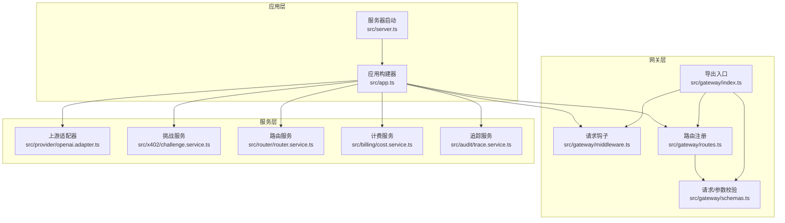
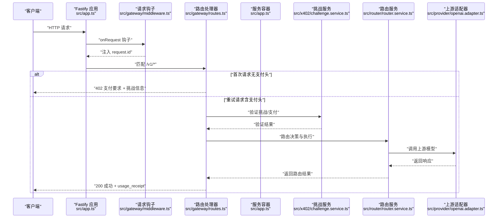
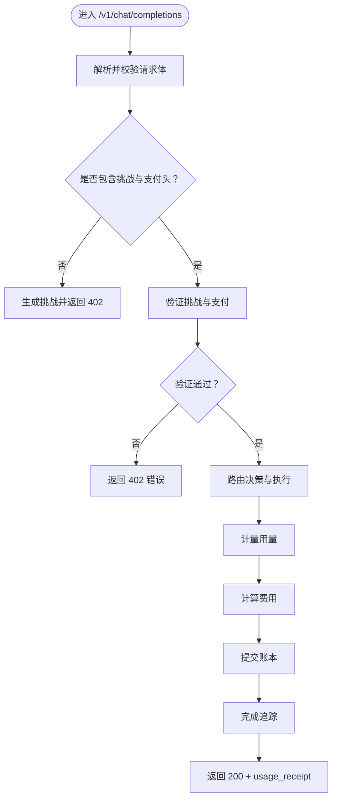
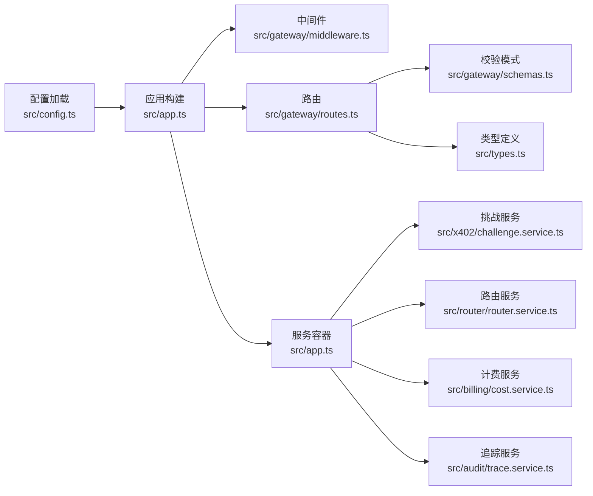

# 网关模块

<cite>
**本文引用的文件**
- [src/gateway/index.ts](file://src/gateway/index.ts)
- [src/gateway/middleware.ts](file://src/gateway/middleware.ts)
- [src/gateway/routes.ts](file://src/gateway/routes.ts)
- [src/gateway/schemas.ts](file://src/gateway/schemas.ts)
- [src/app.ts](file://src/app.ts)
- [src/config.ts](file://src/config.ts)
- [src/types.ts](file://src/types.ts)
- [src/errors.ts](file://src/errors.ts)
- [src/provider/openai.adapter.ts](file://src/provider/openai.adapter.ts)
- [src/x402/challenge.service.ts](file://src/x402/challenge.service.ts)
- [src/router/router.service.ts](file://src/router/router.service.ts)
- [src/billing/cost.service.ts](file://src/billing/cost.service.ts)
- [src/audit/trace.service.ts](file://src/audit/trace.service.ts)
- [docs/api-spec-v0-x402-gateway.md](file://docs/api-spec-v0-x402-gateway.md)
- [src/server.ts](file://src/server.ts)
</cite>

## 目录
1. [简介](#简介)
2. [项目结构](#项目结构)
3. [核心组件](#核心组件)
4. [架构总览](#架构总览)
5. [详细组件分析](#详细组件分析)
6. [依赖关系分析](#依赖关系分析)
7. [性能考量](#性能考量)
8. [故障排查指南](#故障排查指南)
9. [结论](#结论)
10. [附录](#附录)

## 简介
本文件为 x402 Gateway 的网关模块技术文档，聚焦于网关层的架构设计、路由注册机制与中间件体系，解释请求处理流水线、数据验证流程与错误处理策略，并文档化 OpenAI 兼容 API 的实现细节（请求/响应模式、认证与支付流程）。同时提供路由配置、中间件优先级与钩子函数的使用方法，并给出扩展网关功能与自定义中间件的实践建议。

## 项目结构
网关模块位于 src/gateway 目录，围绕路由、中间件与校验模式组织；应用入口在 src/app.ts 中装配插件、钩子与服务容器，并通过 registerRoutes 注册路由；OpenAI 兼容适配器位于 src/provider；支付与审计相关服务位于 src/x402 与 src/audit；计费服务位于 src/billing；类型定义集中在 src/types.ts；错误模型与统一错误处理位于 src/errors.ts；API 规范见 docs/api-spec-v0-x402-gateway.md。

图表来源
- [src/server.ts:1-33](file://src/server.ts#L1-L33)
- [src/app.ts:35-100](file://src/app.ts#L35-L100)
- [src/gateway/middleware.ts:1-13](file://src/gateway/middleware.ts#L1-L13)
- [src/gateway/routes.ts:1-96](file://src/gateway/routes.ts#L1-L96)
- [src/gateway/schemas.ts:1-32](file://src/gateway/schemas.ts#L1-L32)
- [src/gateway/index.ts:1-9](file://src/gateway/index.ts#L1-L9)
- [src/provider/openai.adapter.ts:1-44](file://src/provider/openai.adapter.ts#L1-L44)
- [src/x402/challenge.service.ts:1-71](file://src/x402/challenge.service.ts#L1-L71)
- [src/router/router.service.ts:1-50](file://src/router/router.service.ts#L1-L50)
- [src/billing/cost.service.ts:1-32](file://src/billing/cost.service.ts#L1-L32)
- [src/audit/trace.service.ts:1-68](file://src/audit/trace.service.ts#L1-L68)

章节来源
- [src/gateway/index.ts:1-9](file://src/gateway/index.ts#L1-L9)
- [src/gateway/middleware.ts:1-13](file://src/gateway/middleware.ts#L1-L13)
- [src/gateway/routes.ts:1-96](file://src/gateway/routes.ts#L1-L96)
- [src/gateway/schemas.ts:1-32](file://src/gateway/schemas.ts#L1-L32)
- [src/app.ts:35-100](file://src/app.ts#L35-L100)
- [src/server.ts:1-33](file://src/server.ts#L1-L33)

## 核心组件
- 请求钩子与中间件：在 onRequest 钩子注入唯一请求 ID，便于全链路追踪与日志关联。
- 路由注册：集中注册 OpenAI 兼容聊天补全、模型列表查询与审计查询等端点。
- 数据校验：使用 Zod 对请求体、审计参数进行强类型校验，确保输入一致性。
- 错误处理：统一错误映射到 API 规范中的错误码，支持 402 挑战、400 校验、5xx 内部错误等。
- 服务容器：在应用构建时装配各领域服务（挑战、路由、计费、账本、追踪、回放保护等），供路由处理器调用。

章节来源
- [src/gateway/middleware.ts:9-12](file://src/gateway/middleware.ts#L9-L12)
- [src/gateway/routes.ts:9-96](file://src/gateway/routes.ts#L9-L96)
- [src/gateway/schemas.ts:3-31](file://src/gateway/schemas.ts#L3-L31)
- [src/app.ts:52-70](file://src/app.ts#L52-L70)
- [src/errors.ts:6-105](file://src/errors.ts#L6-L105)

## 架构总览
下图展示了从客户端请求进入，经由中间件、路由、服务层，再到上游适配器与外部支付/审计系统的整体处理路径。

图表来源
- [src/app.ts:35-100](file://src/app.ts#L35-L100)
- [src/gateway/middleware.ts:9-12](file://src/gateway/middleware.ts#L9-L12)
- [src/gateway/routes.ts:23-67](file://src/gateway/routes.ts#L23-L67)
- [src/x402/challenge.service.ts:12-19](file://src/x402/challenge.service.ts#L12-L19)
- [src/router/router.service.ts:14-17](file://src/router/router.service.ts#L14-L17)
- [src/provider/openai.adapter.ts:25-34](file://src/provider/openai.adapter.ts#L25-L34)

## 详细组件分析

### 请求钩子与中间件体系
- onRequest 钩子负责生成唯一请求 ID 并挂载到 request.id，便于下游服务与日志追踪。
- 钩子优先级：onRequest 在路由处理器之前执行，确保所有后续逻辑都能读取到 request.id。
- 扩展建议：可在 onRequest 中加入限流、WAF、请求头清洗等通用逻辑；在 onResponse/onSend 钩子中记录耗时与状态码。

章节来源
- [src/gateway/middleware.ts:9-12](file://src/gateway/middleware.ts#L9-L12)
- [src/app.ts:49-50](file://src/app.ts#L49-L50)

### 路由注册机制
- POST /v1/chat/completions：OpenAI 兼容聊天补全，支持手动/自动路由模式；首次请求返回 402 挑战，重试时携带挑战与支付证明。
- GET /v1/models：返回可用模型与定价元数据。
- GET /v1/audit/requests/:request_id：返回已完成请求的路由与结算证据（当前为占位）。
- 路由处理器职责：仅做参数解析与委托，不包含业务逻辑，保证薄处理层。

章节来源
- [src/gateway/routes.ts:9-96](file://src/gateway/routes.ts#L9-L96)
- [docs/api-spec-v0-x402-gateway.md:17-198](file://docs/api-spec-v0-x402-gateway.md#L17-L198)

### 数据验证流程
- 使用 Zod 对请求体、审计参数进行强类型校验，失败时统一返回 400 与错误码。
- 校验范围：
  - chatCompletionBodySchema：模型名、消息数组、温度、流式、路由模式等。
  - x402HeadersSchema：挑战头、支付头、幂等键等。
  - auditParamsSchema：审计路径参数。
- 建议：在路由处理器内直接使用 parse 进行解构与校验，确保类型安全与错误早发现。

章节来源
- [src/gateway/schemas.ts:3-31](file://src/gateway/schemas.ts#L3-L31)
- [src/gateway/routes.ts:23-27](file://src/gateway/routes.ts#L23-L27)
- [src/app.ts:59-64](file://src/app.ts#L59-L64)

### 错误处理策略
- 统一错误映射：AppError 子类映射到规范中的错误码与 HTTP 状态码；402 场景可附加 payment_requirements。
- 全局错误处理器：区分 AppError、Zod 校验错误与未知异常，分别返回对应响应。
- 建议：新增错误类型时，同步更新 errorToResponse 以保证对外一致的错误结构。

章节来源
- [src/errors.ts:6-105](file://src/errors.ts#L6-L105)
- [src/app.ts:52-70](file://src/app.ts#L52-L70)

### OpenAI 兼容 API 实现细节
- 请求/响应模式：请求体与响应体遵循 OpenAI 兼容格式，额外在成功响应中附带 usage_receipt。
- 认证机制：MVP 不需要传统 API Key；通过 X-402-* 头完成挑战-支付授权。
- 流式输出：当 stream=true 时，需在首 token 前完成支付验证（规范要求）。

章节来源
- [docs/api-spec-v0-x402-gateway.md:21-103](file://docs/api-spec-v0-x402-gateway.md#L21-L103)
- [src/gateway/schemas.ts:4-15](file://src/gateway/schemas.ts#L4-L15)
- [src/types.ts:17-62](file://src/types.ts#L17-L62)

### 请求处理流水线（POST /v1/chat/completions）
- 解析与校验：使用 chatCompletionBodySchema 校验请求体；读取 X-402-* 与幂等键。
- 无支付头：生成挑战并返回 402，包含 quote_id、request_hash、challenge_token 等。
- 有支付头：执行挑战验证、支付验证、路由决策、计费、账本记账、追踪完成与回执生成，最终返回 200 与 usage_receipt。
- 占位实现：当前路由处理器对付费路径为 TODO 占位，实际应调用服务容器中的各服务。

图表来源
- [src/gateway/routes.ts:23-67](file://src/gateway/routes.ts#L23-L67)
- [src/gateway/schemas.ts:4-15](file://src/gateway/schemas.ts#L4-L15)
- [src/app.ts:77-94](file://src/app.ts#L77-L94)

章节来源
- [src/gateway/routes.ts:23-67](file://src/gateway/routes.ts#L23-L67)
- [src/app.ts:77-94](file://src/app.ts#L77-L94)

### 上游适配器与路由服务
- OpenAI 兼容适配器：封装上游调用、健康检查与错误映射（超时/不可达映射为 UpstreamTimeoutError/UpstreamUnavailableError）。
- 路由服务：根据 routing_mode（manual/auto）选择模型或基于策略引擎与回退链执行，产出路由决策与上游响应。

章节来源
- [src/provider/openai.adapter.ts:10-43](file://src/provider/openai.adapter.ts#L10-L43)
- [src/router/router.service.ts:5-18](file://src/router/router.service.ts#L5-L18)

### 计费与追踪服务
- 计费服务：按 token 数量与单价计算小计、平台费用与总计，返回字符串化 USD 值，确保可复现性。
- 追踪服务：记录请求生命周期内的状态、路由决策、用量、成本与支付信息，支持完成与失败标记。

章节来源
- [src/billing/cost.service.ts:4-14](file://src/billing/cost.service.ts#L4-L14)
- [src/audit/trace.service.ts:4-36](file://src/audit/trace.service.ts#L4-L36)

### 类型与接口
- 类型定义：ChatCompletionRequest/Response、TokenUsage、UsageReceipt、ModelInfo/ModelListResponse、AuditRecord 等。
- 接口契约：IChallengeService、IRouterService、ITraceService 等，明确方法签名与职责边界。

章节来源
- [src/types.ts:17-119](file://src/types.ts#L17-L119)
- [src/x402/challenge.service.ts:4-26](file://src/x402/challenge.service.ts#L4-L26)
- [src/router/router.service.ts:5-18](file://src/router/router.service.ts#L5-L18)
- [src/audit/trace.service.ts:4-36](file://src/audit/trace.service.ts#L4-L36)

## 依赖关系分析
- 应用层依赖：Fastify 插件（CORS、Helmet、RateLimit、Sensible）、全局钩子与错误处理器。
- 网关层依赖：路由注册依赖服务容器与校验模式；中间件依赖 nanoid 生成请求 ID。
- 服务层依赖：挑战服务、路由服务、计费服务、追踪服务、上游适配器等。
- 配置依赖：环境变量加载与校验，确保挑战密钥、商户地址、链与资产等关键配置有效。

图表来源
- [src/config.ts:28-45](file://src/config.ts#L28-L45)
- [src/app.ts:35-100](file://src/app.ts#L35-L100)
- [src/gateway/middleware.ts:9-12](file://src/gateway/middleware.ts#L9-L12)
- [src/gateway/routes.ts:9-96](file://src/gateway/routes.ts#L9-L96)
- [src/gateway/schemas.ts:3-31](file://src/gateway/schemas.ts#L3-L31)
- [src/types.ts:17-119](file://src/types.ts#L17-L119)
- [src/x402/challenge.service.ts:28-71](file://src/x402/challenge.service.ts#L28-L71)
- [src/router/router.service.ts:20-50](file://src/router/router.service.ts#L20-L50)
- [src/billing/cost.service.ts:16-32](file://src/billing/cost.service.ts#L16-L32)
- [src/audit/trace.service.ts:38-68](file://src/audit/trace.service.ts#L38-L68)

章节来源
- [src/config.ts:28-45](file://src/config.ts#L28-L45)
- [src/app.ts:35-100](file://src/app.ts#L35-L100)

## 性能考量
- 限流与防护：已注册 @fastify/rate-limit 插件，建议结合 IP 或用户维度进一步细化策略。
- 日志与追踪：onRequest 注入 request.id，建议在上游调用与数据库操作中复用该 ID 提升排障效率。
- 超时控制：上游适配器应设置合理超时，避免阻塞请求管线；对超时与不可达进行快速失败与错误映射。
- 缓存与预热：模型列表与定价元数据可缓存，减少每次请求的计算与查询开销。

## 故障排查指南
- 402 支付要求：确认客户端正确接收并返回挑战与支付头；检查挑战签名与过期时间。
- 400 校验错误：检查请求体字段类型与枚举值；关注 messages 数组长度与 role 取值。
- 500 内部错误：查看全局错误处理器输出；定位具体服务实现（挑战/路由/计费/追踪）的 TODO 占位。
- 审计查询：当前为占位实现，需按规范接入回执服务并返回完整审计记录。

章节来源
- [src/app.ts:52-70](file://src/app.ts#L52-L70)
- [src/gateway/routes.ts:82-94](file://src/gateway/routes.ts#L82-L94)
- [src/errors.ts:17-81](file://src/errors.ts#L17-L81)

## 结论
x402 Gateway 采用薄路由、厚服务的设计，借助中间件注入请求 ID、Zod 强类型校验与统一错误处理，形成清晰的请求处理流水线。OpenAI 兼容 API 通过 X-402 头实现挑战-支付授权，配合路由、计费与追踪服务，提供透明的用量与结算证据。当前多数服务仍为占位实现，后续应按 TODO 注释逐步完善挑战签发与验证、支付核验、路由策略、计费与账本记账、追踪完成与审计查询等功能。

## 附录

### 路由配置与中间件优先级
- 路由注册：在应用构建完成后调用 registerRoutes(app, services) 完成端点绑定。
- 中间件优先级：onRequest 钩子先于路由处理器执行，确保 request.id 可用。
- 钩子函数：可按需扩展 preValidation、preHandler 等阶段钩子，实现鉴权、限流、参数转换等。

章节来源
- [src/app.ts:97-97](file://src/app.ts#L97-L97)
- [src/gateway/middleware.ts:9-12](file://src/gateway/middleware.ts#L9-L12)

### 钩子函数与中间件扩展示例（步骤说明）
- 在 onRequest 中增加 WAF/请求头清洗逻辑，确保安全与合规。
- 在 preValidation 中进行更细粒度的参数转换与默认值填充。
- 在 preHandler 中实现基于用户/IP 的限流策略。
- 在 onResponse/onSend 中记录耗时、状态码与响应大小，用于监控与告警。

章节来源
- [src/gateway/middleware.ts:9-12](file://src/gateway/middleware.ts#L9-L12)
- [src/app.ts:49-50](file://src/app.ts#L49-L50)

### 自定义中间件与服务集成要点
- 中间件：保持纯函数式与无副作用，避免阻塞请求管线。
- 服务：严格遵循接口契约，确保可测试性与可替换性；对 TODO 占位实现补充完整逻辑。
- 配置：通过环境变量加载与 Zod 校验，确保关键参数（挑战密钥、商户地址、链与资产）合法。

章节来源
- [src/config.ts:28-45](file://src/config.ts#L28-L45)
- [src/app.ts:77-94](file://src/app.ts#L77-L94)