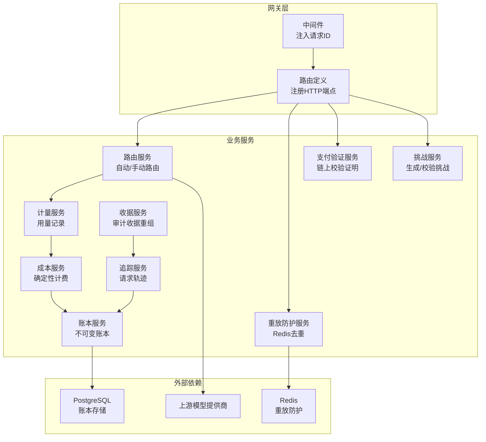
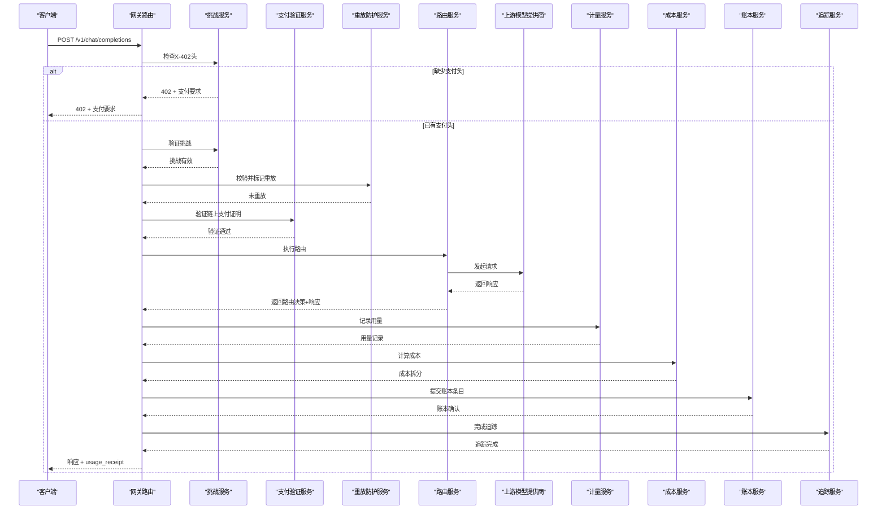
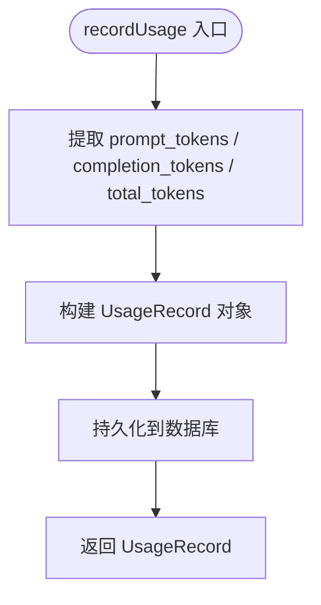
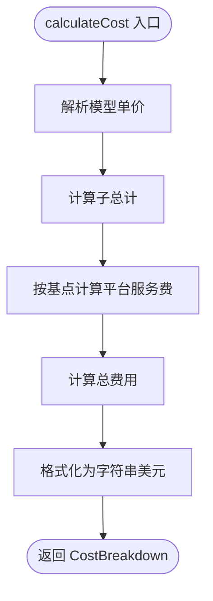
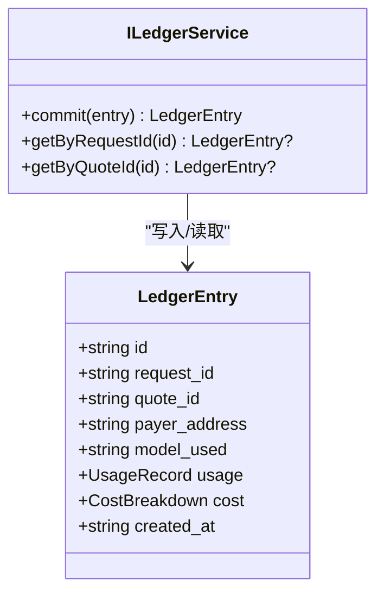
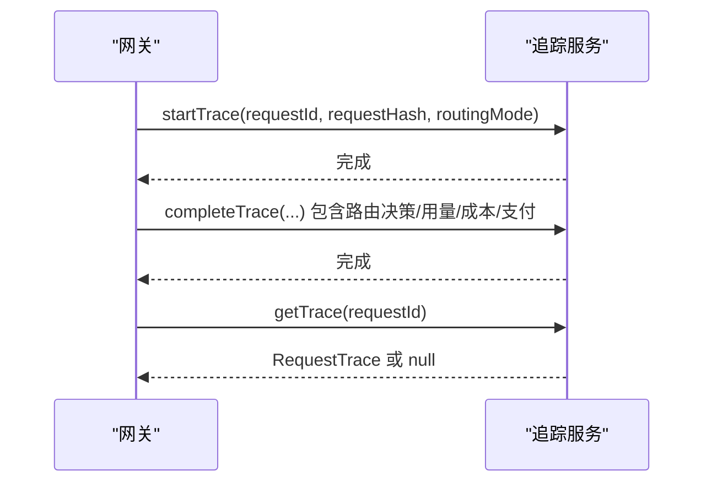
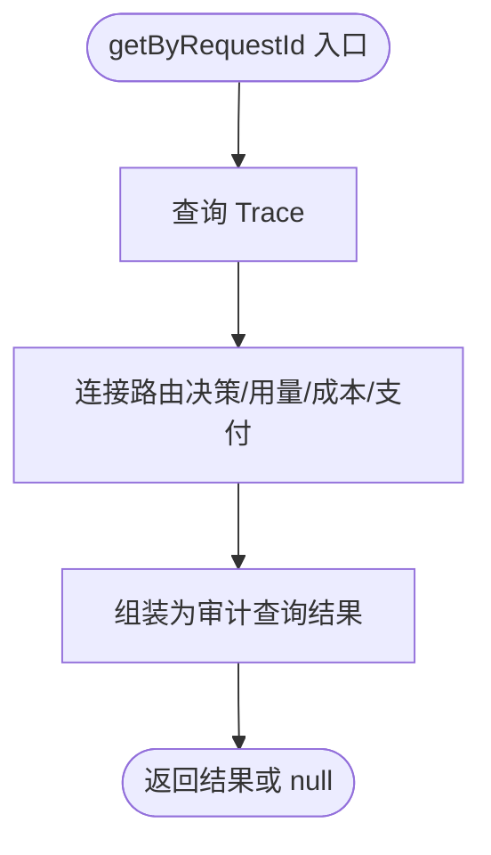
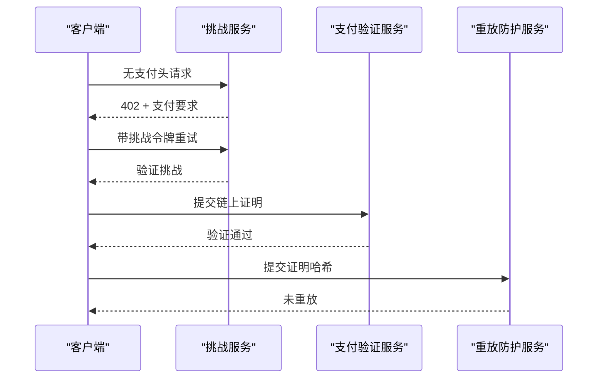
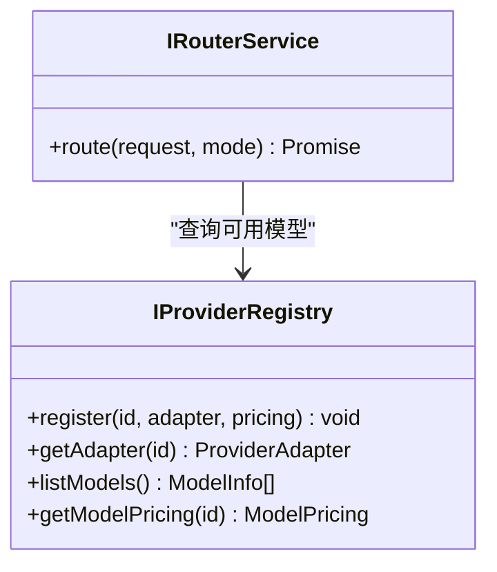
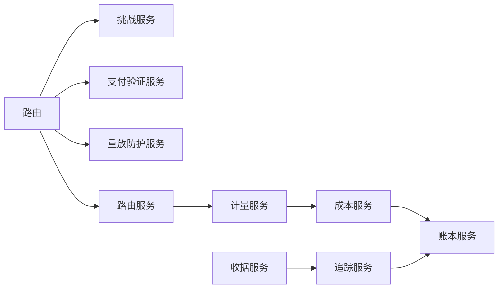

# 计费与审计系统

<cite>
**本文引用的文件**
- [src/app.ts](file://src/app.ts)
- [src/config.ts](file://src/config.ts)
- [src/types.ts](file://src/types.ts)
- [src/errors.ts](file://src/errors.ts)
- [src/gateway/middleware.ts](file://src/gateway/middleware.ts)
- [src/gateway/routes.ts](file://src/gateway/routes.ts)
- [src/billing/index.ts](file://src/billing/index.ts)
- [src/billing/types.ts](file://src/billing/types.ts)
- [src/billing/meter.service.ts](file://src/billing/meter.service.ts)
- [src/billing/cost.service.ts](file://src/billing/cost.service.ts)
- [src/billing/ledger.service.ts](file://src/billing/ledger.service.ts)
- [src/audit/index.ts](file://src/audit/index.ts)
- [src/audit/types.ts](file://src/audit/types.ts)
- [src/audit/trace.service.ts](file://src/audit/trace.service.ts)
- [src/audit/receipt.service.ts](file://src/audit/receipt.service.ts)
- [src/x402/challenge.service.ts](file://src/x402/challenge.service.ts)
- [src/x402/verify.service.ts](file://src/x402/verify.service.ts)
- [src/router/router.service.ts](file://src/router/router.service.ts)
- [src/provider/registry.ts](file://src/provider/registry.ts)
</cite>

## 目录
1. [简介](#简介)
2. [项目结构](#项目结构)
3. [核心组件](#核心组件)
4. [架构总览](#架构总览)
5. [详细组件分析](#详细组件分析)
6. [依赖关系分析](#依赖关系分析)
7. [性能考量](#性能考量)
8. [故障排查指南](#故障排查指南)
9. [结论](#结论)
10. [附录](#附录)

## 简介
本文件为计费与审计系统的综合技术文档，面向开发者与运维人员，系统性阐述以下内容：
- 使用量计量机制：如何从上游响应中提取令牌用量并持久化为使用记录
- 成本计算算法：确定性的费用拆分（子总计、平台服务费、总费用）与精度控制
- 账本记录系统：不可变账本的写入策略、查询接口与补偿机制
- 审计追踪：请求全生命周期轨迹、收据重组与合规性要求
- 结算流程：挑战生成、支付验证、重放防护与路由决策证据
- 数据导出与报表：基于审计查询结果的导出与报表生成思路
- 最佳实践：计费规则配置、审计日志分析、异常处理与错误码映射

## 项目结构
系统采用模块化分层设计，围绕“网关路由”“计费服务”“审计服务”“x402支付”“路由编排”“提供商注册表”等模块协同工作。

图表来源
- [src/app.ts:35-100](file://src/app.ts#L35-L100)
- [src/gateway/routes.ts:9-96](file://src/gateway/routes.ts#L9-L96)
- [src/billing/meter.service.ts:13-28](file://src/billing/meter.service.ts#L13-L28)
- [src/billing/cost.service.ts:16-31](file://src/billing/cost.service.ts#L16-L31)
- [src/billing/ledger.service.ts:17-41](file://src/billing/ledger.service.ts#L17-L41)
- [src/audit/trace.service.ts:38-67](file://src/audit/trace.service.ts#L38-L67)
- [src/audit/receipt.service.ts:14-25](file://src/audit/receipt.service.ts#L14-L25)
- [src/x402/challenge.service.ts:28-70](file://src/x402/challenge.service.ts#L28-L70)
- [src/x402/verify.service.ts:18-33](file://src/x402/verify.service.ts#L18-L33)
- [src/router/router.service.ts:20-49](file://src/router/router.service.ts#L20-L49)

章节来源
- [src/app.ts:35-100](file://src/app.ts#L35-L100)
- [src/gateway/routes.ts:9-96](file://src/gateway/routes.ts#L9-L96)

## 核心组件
- 请求ID注入与全局错误处理：通过中间件注入唯一请求ID；统一错误处理器将应用级错误映射为标准响应。
- 服务容器装配：在应用启动时实例化各服务并注入到路由处理器。
- 类型与配置：共享类型定义（请求ID、路由模式、用量、定价、审计结构等），以及运行时配置加载与校验。

章节来源
- [src/gateway/middleware.ts:9-12](file://src/gateway/middleware.ts#L9-L12)
- [src/app.ts:53-70](file://src/app.ts#L53-L70)
- [src/app.ts:77-94](file://src/app.ts#L77-L94)
- [src/types.ts:6-119](file://src/types.ts#L6-L119)
- [src/config.ts:28-45](file://src/config.ts#L28-L45)

## 架构总览
下图展示一次完整付费请求的端到端流程：从路由到计量、计费、账本、追踪与收据生成。

图表来源
- [src/gateway/routes.ts:23-67](file://src/gateway/routes.ts#L23-L67)
- [src/x402/challenge.service.ts:36-46](file://src/x402/challenge.service.ts#L36-L46)
- [src/x402/verify.service.ts:20-30](file://src/x402/verify.service.ts#L20-L30)
- [src/router/router.service.ts:27-46](file://src/router/router.service.ts#L27-L46)
- [src/billing/meter.service.ts:15-25](file://src/billing/meter.service.ts#L15-L25)
- [src/billing/cost.service.ts:18-28](file://src/billing/cost.service.ts#L18-L28)
- [src/billing/ledger.service.ts:19-28](file://src/billing/ledger.service.ts#L19-L28)
- [src/audit/trace.service.ts:49-55](file://src/audit/trace.service.ts#L49-L55)

## 详细组件分析

### 计量服务（Usage Meter）
职责
- 从上游响应中提取提示词、补全与总令牌数，构建使用记录
- 将使用记录持久化至数据库
- 返回标准化的使用记录

关键点
- 输入来自上游适配器的响应结构
- 输出为标准化的使用记录对象
- 持久化策略需保证幂等与一致性

图表来源
- [src/billing/meter.service.ts:10-11](file://src/billing/meter.service.ts#L10-L11)
- [src/billing/meter.service.ts:15-25](file://src/billing/meter.service.ts#L15-L25)

章节来源
- [src/billing/meter.service.ts:5-28](file://src/billing/meter.service.ts#L5-L28)
- [src/billing/types.ts:3-10](file://src/billing/types.ts#L3-L10)

### 成本服务（Cost Calculator）
职责
- 基于用量与模型定价进行确定性成本计算
- 计算子总计、平台服务费与总费用
- 返回字符串格式的美元金额，确保可复现性

算法要点
- 子总计 = 提示词令牌数 × 输入单价 + 补全令牌数 × 输出单价
- 平台服务费 = 子总计 × 平台费率（基点）
- 总费用 = 子总计 + 平台服务费
- 单价与费用均以字符串形式保存，避免浮点误差

图表来源
- [src/billing/cost.service.ts:13-13](file://src/billing/cost.service.ts#L13-L13)
- [src/billing/cost.service.ts:18-28](file://src/billing/cost.service.ts#L18-L28)
- [src/billing/types.ts:12-19](file://src/billing/types.ts#L12-L19)

章节来源
- [src/billing/cost.service.ts:4-31](file://src/billing/cost.service.ts#L4-L31)
- [src/types.ts:68-72](file://src/types.ts#L68-L72)

### 账本服务（Ledger）
职责
- 写入：仅允许追加，禁止更新或删除
- 查询：按请求ID或报价ID检索账本条目
- 不可变性：通过新条目进行补偿而非修改

图表来源
- [src/billing/types.ts:21-31](file://src/billing/types.ts#L21-L31)
- [src/billing/ledger.service.ts:3-15](file://src/billing/ledger.service.ts#L3-L15)

章节来源
- [src/billing/ledger.service.ts:3-41](file://src/billing/ledger.service.ts#L3-L41)
- [src/billing/types.ts:21-31](file://src/billing/types.ts#L21-L31)

### 审计追踪服务（Trace）
职责
- 初始化追踪：记录请求哈希、路由模式、状态为“待处理”
- 完成追踪：填充路由决策、用量、成本、支付信息，并记录延迟
- 失败追踪：记录失败原因
- 查询追踪：按请求ID检索

图表来源
- [src/audit/trace.service.ts:9-35](file://src/audit/trace.service.ts#L9-L35)
- [src/audit/trace.service.ts:40-65](file://src/audit/trace.service.ts#L40-L65)
- [src/audit/types.ts:3-12](file://src/audit/types.ts#L3-L12)

章节来源
- [src/audit/trace.service.ts:4-67](file://src/audit/trace.service.ts#L4-L67)
- [src/audit/types.ts:3-12](file://src/audit/types.ts#L3-L12)

### 审计收据服务（Receipt）
职责
- 依据请求ID重组完整审计记录
- 聚合追踪、路由决策、用量、成本与支付信息
- 返回符合规范的审计查询结果

图表来源
- [src/audit/receipt.service.ts:11-22](file://src/audit/receipt.service.ts#L11-L22)
- [src/audit/types.ts:14-37](file://src/audit/types.ts#L14-L37)

章节来源
- [src/audit/receipt.service.ts:4-25](file://src/audit/receipt.service.ts#L4-L25)
- [src/audit/types.ts:14-37](file://src/audit/types.ts#L14-L37)

### x402 支付与安全
- 挑战服务：生成挑战（含报价ID、请求哈希、签名、过期时间），并校验重试请求的挑战令牌
- 支付验证服务：对链上支付证明进行校验（金额、资产、收款人）
- 重放防护：基于Redis对支付证明哈希进行去重

图表来源
- [src/x402/challenge.service.ts:12-26](file://src/x402/challenge.service.ts#L12-L26)
- [src/x402/challenge.service.ts:36-67](file://src/x402/challenge.service.ts#L36-L67)
- [src/x402/verify.service.ts:15-30](file://src/x402/verify.service.ts#L15-L30)

章节来源
- [src/x402/challenge.service.ts:4-70](file://src/x402/challenge.service.ts#L4-L70)
- [src/x402/verify.service.ts:3-33](file://src/x402/verify.service.ts#L3-L33)

### 路由与提供商注册
- 路由服务：支持手动与自动两种模式，自动生成路由决策证据（路由证明哈希）
- 提供商注册表：在内存中维护模型目录与适配器映射，支持按模型ID获取适配器与定价

图表来源
- [src/router/router.service.ts:5-17](file://src/router/router.service.ts#L5-L17)
- [src/provider/registry.ts:4-16](file://src/provider/registry.ts#L4-L16)

章节来源
- [src/router/router.service.ts:5-49](file://src/router/router.service.ts#L5-L49)
- [src/provider/registry.ts:27-64](file://src/provider/registry.ts#L27-L64)

## 依赖关系分析
- 组件耦合
  - 网关路由依赖所有服务容器中的服务
  - 计费链路（计量 → 成本 → 账本）强关联
  - 审计链路（追踪 → 收据）独立但与计费链路衔接
  - x402链路（挑战 → 验证 → 重放）贯穿付费路径
- 外部依赖
  - PostgreSQL：账本持久化
  - Redis：重放防护
  - 上游模型提供商：执行推理请求
- 循环依赖
  - 当前结构清晰，未见循环依赖迹象

图表来源
- [src/gateway/routes.ts:23-67](file://src/gateway/routes.ts#L23-L67)
- [src/app.ts:77-94](file://src/app.ts#L77-L94)

章节来源
- [src/app.ts:77-94](file://src/app.ts#L77-L94)
- [src/gateway/routes.ts:9-96](file://src/gateway/routes.ts#L9-L96)

## 性能考量
- 计量与成本计算
  - 采用字符串格式的货币值，避免浮点运算误差，提升可复现性
  - 成本计算为纯函数式，便于缓存与并发调用
- 账本写入
  - 仅追加写入，减少锁竞争；建议批量提交与索引优化（按 request_id、quote_id）
- 审计追踪
  - 追踪写入与查询分离，建议对 request_id 建立索引
- x402 验证
  - 链上查询应使用批量化与缓存；挑战签名与哈希计算尽量本地化
- 路由与上游
  - 自动路由评分与回退链构建应限制并发与超时；对上游超时/不可用进行快速失败

## 故障排查指南
- 错误分类与映射
  - 402：缺少支付头、挑战过期、请求哈希不匹配、支付验证失败、金额不足、重放使用
  - 400：请求体校验失败（Zod）
  - 5xx：上游超时/不可用、内部错误
- 建议排查步骤
  - 确认请求ID是否正确注入与传递
  - 检查挑战生成/验证流程与过期时间
  - 核对支付证明金额、资产与收款地址
  - 排查账本写入是否幂等与顺序一致
  - 审计查询为空时，检查追踪是否完成且字段齐全

章节来源
- [src/errors.ts:6-105](file://src/errors.ts#L6-L105)
- [src/app.ts:53-70](file://src/app.ts#L53-L70)

## 结论
本系统通过“确定性计费 + 不可变账本 + 完整审计追踪”的设计，实现了高透明度与合规性的计费与审计能力。当前代码处于骨架阶段，核心流程已在路由与服务接口中明确，后续重点在于完善数据库与外部依赖的接入、错误处理与监控埋点，以及扩展报表与导出功能。

## 附录

### 计费精度与历史管理
- 精度控制
  - 使用字符串表示美元金额，避免浮点误差
  - 平台费率以基点（BPS）表达，保持整数运算
- 历史数据管理
  - 账本为不可变追加，历史变更通过新增条目补偿
  - 建议对账本表建立分区与归档策略

章节来源
- [src/billing/cost.service.ts:18-28](file://src/billing/cost.service.ts#L18-L28)
- [src/billing/ledger.service.ts:5-8](file://src/billing/ledger.service.ts#L5-L8)

### 结算流程与合规要求
- 结算流程
  - 生成挑战 → 验证挑战 → 防重放检查 → 链上支付验证 → 路由执行 → 计量 → 成本 → 账本 → 追踪 → 收据
- 合规要求
  - 审计查询结果需包含路由决策、用量、成本与支付证据
  - 账本条目不可篡改，具备法律证据效力

章节来源
- [src/gateway/routes.ts:14-22](file://src/gateway/routes.ts#L14-L22)
- [src/audit/types.ts:14-37](file://src/audit/types.ts#L14-L37)
- [src/billing/types.ts:21-31](file://src/billing/types.ts#L21-L31)

### 审计查询接口与数据导出
- 审计查询接口
  - GET /v1/audit/requests/:request_id → 返回审计查询结果
- 数据导出与报表
  - 可基于审计查询结果进行 CSV/JSON 导出
  - 报表维度建议：按模型、按用户、按日期、按链路成本分布

章节来源
- [src/gateway/routes.ts:78-94](file://src/gateway/routes.ts#L78-L94)
- [src/audit/receipt.service.ts:11-22](file://src/audit/receipt.service.ts#L11-L22)

### 计费规则配置与最佳实践
- 配置项
  - 平台费率（BPS）、挑战密钥、挑战有效期、商户地址、支付链与资产
- 最佳实践
  - 在路由前估算成本并生成挑战，减少无效调用
  - 对上游超时与不可用设置合理重试与熔断
  - 对账本写入进行幂等与事务封装
  - 审计日志分级存储，保留关键字段用于合规审计

章节来源
- [src/config.ts:13-24](file://src/config.ts#L13-L24)
- [src/x402/challenge.service.ts:36-46](file://src/x402/challenge.service.ts#L36-L46)
- [src/router/router.service.ts:27-46](file://src/router/router.service.ts#L27-L46)
- [src/billing/ledger.service.ts:19-28](file://src/billing/ledger.service.ts#L19-L28)