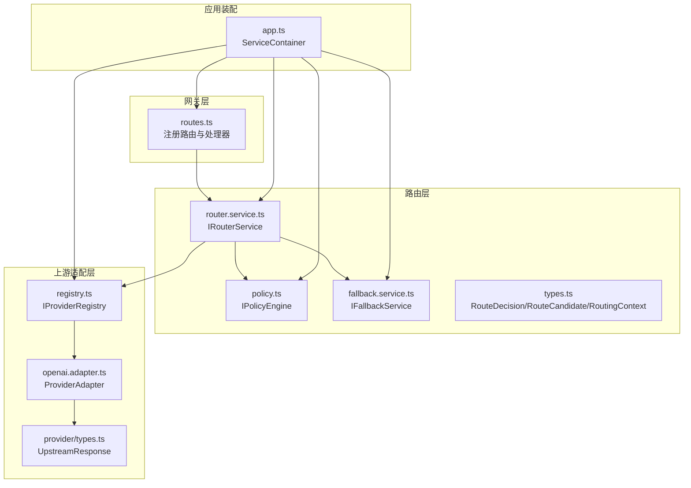
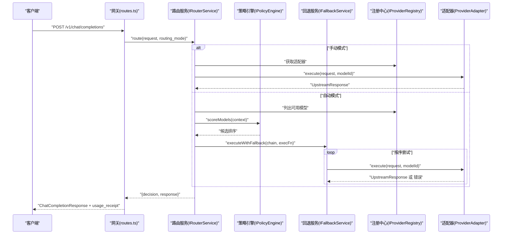
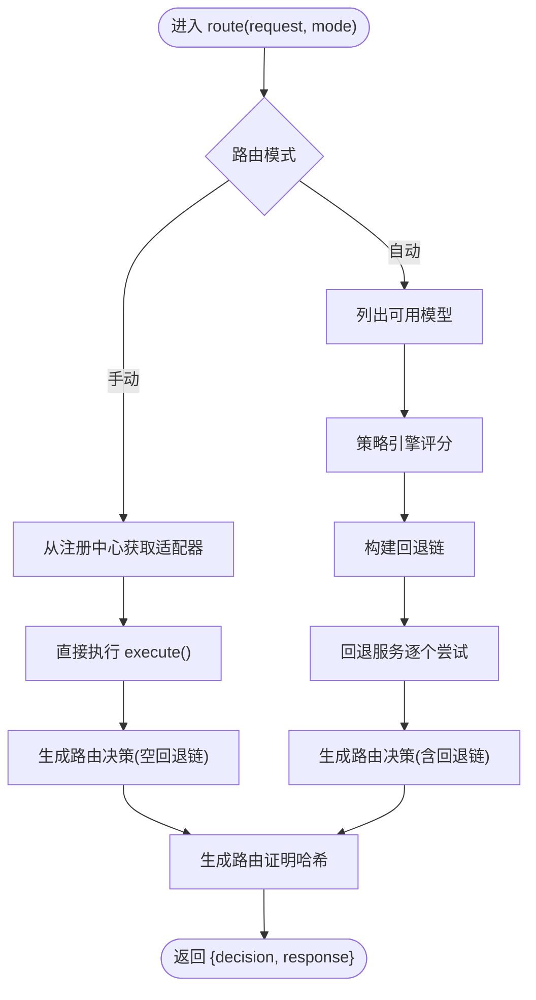
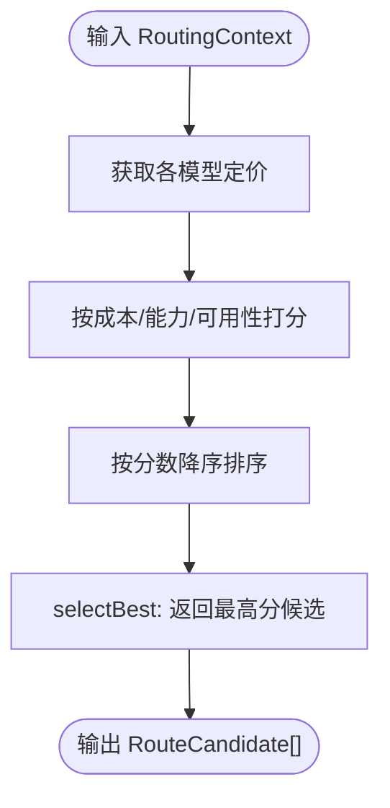
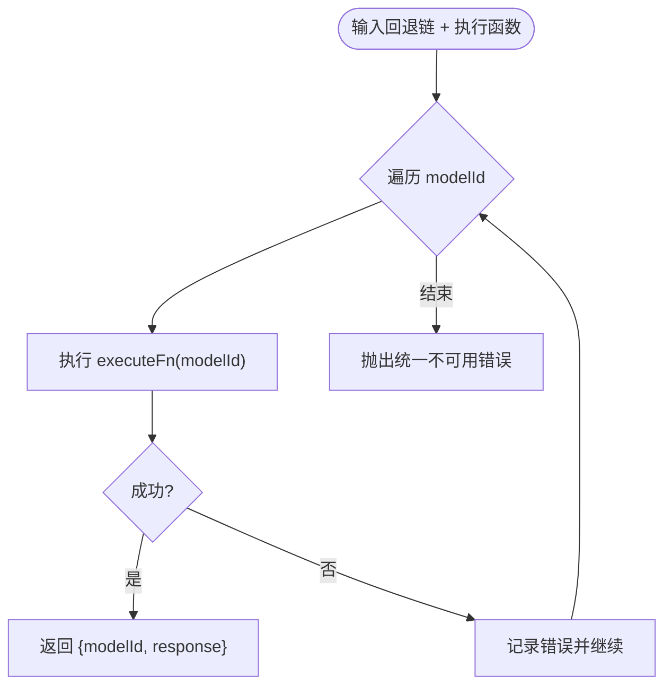
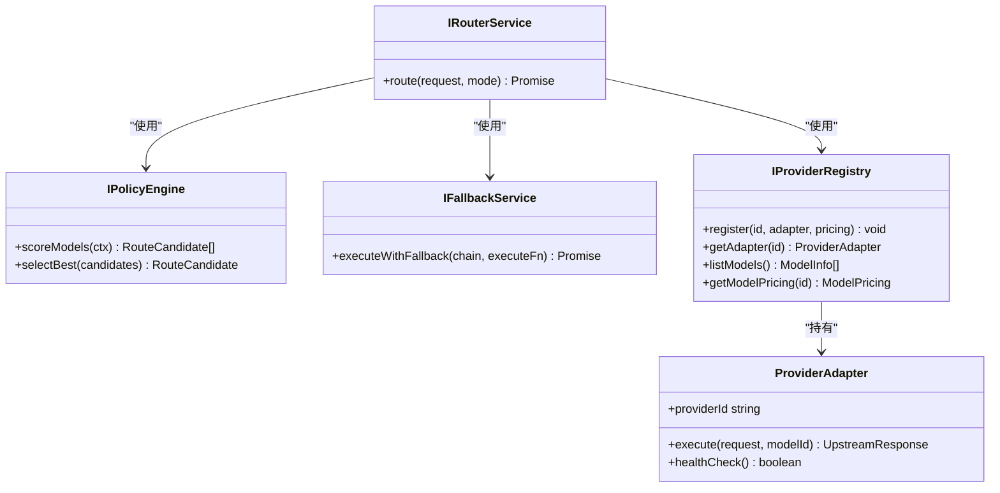

# 路由系统

<cite>
**本文引用的文件**
- [src/router/index.ts](file://src/router/index.ts)
- [src/router/router.service.ts](file://src/router/router.service.ts)
- [src/router/policy.ts](file://src/router/policy.ts)
- [src/router/fallback.service.ts](file://src/router/fallback.service.ts)
- [src/router/types.ts](file://src/router/types.ts)
- [src/gateway/routes.ts](file://src/gateway/routes.ts)
- [src/app.ts](file://src/app.ts)
- [src/provider/registry.ts](file://src/provider/registry.ts)
- [src/provider/types.ts](file://src/provider/types.ts)
- [src/provider/openai.adapter.ts](file://src/provider/openai.adapter.ts)
- [src/types.ts](file://src/types.ts)
- [src/errors.ts](file://src/errors.ts)
- [test/router/router.test.ts](file://test/router/router.test.ts)
- [README.md](file://README.md)
</cite>

## 目录
1. [简介](#简介)
2. [项目结构](#项目结构)
3. [核心组件](#核心组件)
4. [架构总览](#架构总览)
5. [详细组件分析](#详细组件分析)
6. [依赖关系分析](#依赖关系分析)
7. [性能考虑](#性能考虑)
8. [故障排查指南](#故障排查指南)
9. [结论](#结论)
10. [附录](#附录)

## 简介
本文件为“路由系统”的架构与实现文档，聚焦以下目标：
- 智能路由决策算法：评分与候选选择策略
- 模型选择策略与回退机制设计原理
- 路由策略引擎实现、手动/自动路由模式
- 性能优化策略、路由决策记录、负载均衡与故障转移
- 路由配置示例、策略定制方法与监控指标建议
- 扩展新路由规则与集成第三方路由策略的方法

当前代码库处于开发初期，路由服务与策略引擎接口已定义但尚未完全实现；回退服务与类型定义已就绪，可作为后续实现的基础。

## 项目结构
路由系统位于 src/router 目录，围绕三个核心模块协作：
- 路由服务：编排手动/自动路由流程，生成路由决策与回退链
- 策略引擎：对可用模型进行评分与最佳候选选择
- 回退服务：按序尝试上游模型，首个成功即返回，全部失败抛出统一错误

网关层通过 Fastify 路由将请求交由路由服务执行，并与账单、审计等模块协同完成端到端流程。

图表来源
- [src/gateway/routes.ts:1-96](file://src/gateway/routes.ts#L1-L96)
- [src/router/router.service.ts:1-50](file://src/router/router.service.ts#L1-L50)
- [src/router/policy.ts:1-34](file://src/router/policy.ts#L1-L34)
- [src/router/fallback.service.ts:1-41](file://src/router/fallback.service.ts#L1-L41)
- [src/router/types.ts:1-22](file://src/router/types.ts#L1-L22)
- [src/provider/registry.ts:1-65](file://src/provider/registry.ts#L1-L65)
- [src/provider/openai.adapter.ts:1-44](file://src/provider/openai.adapter.ts#L1-L44)
- [src/provider/types.ts:1-36](file://src/provider/types.ts#L1-L36)
- [src/app.ts:1-101](file://src/app.ts#L1-L101)

章节来源
- [README.md:26-47](file://README.md#L26-L47)
- [src/app.ts:35-101](file://src/app.ts#L35-L101)
- [src/gateway/routes.ts:1-96](file://src/gateway/routes.ts#L1-L96)

## 核心组件
- 路由服务（IRouterService）
  - 负责编排完整路由流程：手动模式直接执行；自动模式调用策略引擎评分、构建回退链、通过回退服务执行
  - 输出包含路由决策元数据与上游响应
- 策略引擎（IPolicyEngine）
  - 输入：RoutingContext（请求模型、路由模式、可用模型列表）
  - 输出：按分数排序的 RouteCandidate 列表；选择最高分者
- 回退服务（IFallbackService）
  - 按顺序尝试回退链中的模型，首个成功返回；全部失败抛出统一错误
  - 保证不重复计费：仅成功执行的模型计费
- 类型与契约
  - RouteDecision：选中模型、回退链、评分摘要、路由证明哈希
  - RouteCandidate：模型ID、分数、原因
  - RoutingContext：请求模型、路由模式、可用模型列表

章节来源
- [src/router/router.service.ts:5-18](file://src/router/router.service.ts#L5-L18)
- [src/router/policy.ts:3-14](file://src/router/policy.ts#L3-L14)
- [src/router/fallback.service.ts:4-16](file://src/router/fallback.service.ts#L4-L16)
- [src/router/types.ts:1-22](file://src/router/types.ts#L1-L22)

## 架构总览
路由系统采用“策略 + 回退”的双引擎架构：
- 策略引擎负责在可用模型中进行成本、能力匹配与可用性综合评分，输出候选排序
- 回退服务负责在候选链上按序尝试，确保高成功率与低延迟
- 路由服务统一编排上述流程，并生成路由决策记录与路由证明哈希，用于审计与结算证据

图表来源
- [src/gateway/routes.ts:23-67](file://src/gateway/routes.ts#L23-L67)
- [src/router/router.service.ts:14-18](file://src/router/router.service.ts#L14-L18)
- [src/router/policy.ts:8-13](file://src/router/policy.ts#L8-L13)
- [src/router/fallback.service.ts:12-15](file://src/router/fallback.service.ts#L12-L15)
- [src/provider/registry.ts:8-15](file://src/provider/registry.ts#L8-L15)
- [src/provider/types.ts:26-35](file://src/provider/types.ts#L26-L35)

## 详细组件分析

### 路由服务（IRouterService）
职责与流程
- 手动模式：从注册中心获取指定模型的适配器，直接执行，生成空回退链的路由决策
- 自动模式：从注册中心获取可用模型 → 策略引擎评分 → 构建回退链 → 回退服务执行 → 生成路由证明哈希
- 返回值：路由决策元数据与上游响应

图表来源
- [src/router/router.service.ts:20-49](file://src/router/router.service.ts#L20-L49)
- [src/router/types.ts:2-7](file://src/router/types.ts#L2-L7)
- [src/provider/registry.ts:11-12](file://src/provider/registry.ts#L11-L12)

章节来源
- [src/router/router.service.ts:5-18](file://src/router/router.service.ts#L5-L18)
- [src/router/router.service.ts:20-49](file://src/router/router.service.ts#L20-L49)

### 策略引擎（IPolicyEngine）
职责与流程
- 输入：RoutingContext（请求模型、路由模式、可用模型列表）
- 评分维度（待实现）：成本（单价）、能力匹配度、可用性
- 输出：按分数降序排列的 RouteCandidate 列表；若无候选则抛错

图表来源
- [src/router/policy.ts:16-33](file://src/router/policy.ts#L16-L33)
- [src/router/types.ts:16-21](file://src/router/types.ts#L16-L21)

章节来源
- [src/router/policy.ts:3-14](file://src/router/policy.ts#L3-L14)
- [src/router/policy.ts:16-33](file://src/router/policy.ts#L16-L33)

### 回退服务（IFallbackService）
职责与流程
- 对回退链中的模型逐一尝试执行
- 首个成功返回该模型与响应
- 全部失败抛出统一错误（不可用）

图表来源
- [src/router/fallback.service.ts:18-40](file://src/router/fallback.service.ts#L18-L40)
- [src/errors.ts:75-81](file://src/errors.ts#L75-L81)

章节来源
- [src/router/fallback.service.ts:4-16](file://src/router/fallback.service.ts#L4-L16)
- [src/router/fallback.service.ts:18-40](file://src/router/fallback.service.ts#L18-L40)
- [src/errors.ts:75-81](file://src/errors.ts#L75-L81)

### 类型与契约（路由决策与上下文）
- RouteDecision：选中模型、回退链、评分摘要、路由证明哈希
- RouteCandidate：模型ID、分数、原因
- RoutingContext：请求模型、路由模式、可用模型列表

章节来源
- [src/router/types.ts:1-22](file://src/router/types.ts#L1-L22)

### 上游适配与注册中心
- 注册中心：注册模型、提供适配器、列出模型、查询定价
- 适配器：抽象上游执行与健康检查，映射标准化响应

章节来源
- [src/provider/registry.ts:4-16](file://src/provider/registry.ts#L4-L16)
- [src/provider/registry.ts:27-65](file://src/provider/registry.ts#L27-L65)
- [src/provider/types.ts:26-35](file://src/provider/types.ts#L26-L35)
- [src/provider/openai.adapter.ts:10-44](file://src/provider/openai.adapter.ts#L10-L44)

### 网关与应用装配
- 网关：注册路由、参数校验、x402 流程占位、调用路由服务
- 应用装配：构建 ServiceContainer，注入路由服务、注册中心、账单与审计等服务

章节来源
- [src/gateway/routes.ts:9-96](file://src/gateway/routes.ts#L9-L96)
- [src/app.ts:21-101](file://src/app.ts#L21-L101)

## 依赖关系分析
- 组件耦合
  - 路由服务依赖策略引擎、回退服务与注册中心
  - 策略引擎与回退服务彼此独立，便于替换与扩展
  - 注册中心为适配器提供统一入口
- 外部依赖
  - 上游适配器通过标准化响应对接不同提供商
  - 统一错误类型用于对外一致的错误语义

图表来源
- [src/router/router.service.ts:5-18](file://src/router/router.service.ts#L5-L18)
- [src/router/policy.ts:3-14](file://src/router/policy.ts#L3-L14)
- [src/router/fallback.service.ts:4-16](file://src/router/fallback.service.ts#L4-L16)
- [src/provider/registry.ts:4-16](file://src/provider/registry.ts#L4-L16)
- [src/provider/types.ts:26-35](file://src/provider/types.ts#L26-L35)

章节来源
- [src/router/index.ts:1-8](file://src/router/index.ts#L1-L8)
- [src/app.ts:77-94](file://src/app.ts#L77-L94)

## 性能考虑
- 候选剪枝
  - 在策略引擎评分前，基于能力匹配与可用性进行快速过滤，减少评分开销
- 并发与超时
  - 回退链尝试应设置合理的超时与并发上限，避免级联阻塞
- 缓存与预热
  - 定价与健康状态缓存，定期刷新；启动时预热常用模型
- 负载均衡
  - 可在策略引擎中引入权重或动态权重，结合上游健康状态与延迟统计
- 计费隔离
  - 回退服务严格保证仅对首个成功模型计费，避免重复扣费

## 故障排查指南
- 常见错误
  - 上游不可用：统一映射为不可用错误，便于客户端识别与重试
  - 无候选可用：策略引擎在空候选时抛错，需检查可用模型列表与能力匹配
  - 回退链全部失败：确认上游健康状态与网络连通性
- 排查步骤
  - 检查路由模式与请求模型是否匹配
  - 查看路由决策记录中的回退链与评分摘要
  - 核对注册中心模型列表与定价信息
  - 观察回退服务的错误日志与最终失败模型

章节来源
- [src/router/fallback.service.ts:35-37](file://src/router/fallback.service.ts#L35-L37)
- [src/router/policy.ts:26-31](file://src/router/policy.ts#L26-L31)
- [src/errors.ts:75-81](file://src/errors.ts#L75-L81)

## 结论
路由系统以“策略评分 + 回退链”为核心设计，兼顾灵活性与可靠性。当前接口完备、测试覆盖基础行为，后续可在策略引擎中实现成本、能力与可用性评分，在回退服务中加入超时与并发控制，并完善网关与账单、审计模块的集成，以达成高性能、可观测、可扩展的智能路由体系。

## 附录

### 路由配置示例（概念性）
- 手动模式
  - 请求体中指定 model 与 routing_mode=manual
  - 路由服务直接使用该模型的适配器执行
- 自动模式
  - 路由服务从注册中心获取可用模型，调用策略引擎评分，按分数构建回退链，再通过回退服务执行

章节来源
- [src/types.ts:10-11](file://src/types.ts#L10-L11)
- [src/types.ts:22-28](file://src/types.ts#L22-L28)
- [src/gateway/routes.ts:23-67](file://src/gateway/routes.ts#L23-L67)

### 策略定制方法
- 实现策略引擎评分逻辑
  - 成本：比较单价与有效时间
  - 能力：匹配消息格式、上下文窗口、功能特性
  - 可用性：健康检查、SLA、历史成功率
- 回退链构建
  - 将评分前 N 名作为候选，按分数降序排列
- 扩展评分维度
  - 引入实时延迟、错误率、价格波动等指标

章节来源
- [src/router/policy.ts:16-33](file://src/router/policy.ts#L16-L33)
- [src/router/types.ts:9-14](file://src/router/types.ts#L9-L14)

### 监控指标建议
- 路由决策
  - 选中模型、回退链长度、评分摘要
- 执行性能
  - 首次成功耗时、平均耗时、成功率、超时率
- 计费与成本
  - 单次请求计费模型、单价、总费用
- 可用性
  - 上游健康状态、不可用次数、恢复时间

章节来源
- [src/router/types.ts:1-7](file://src/router/types.ts#L1-L7)
- [src/provider/types.ts:3-17](file://src/provider/types.ts#L3-L17)

### 扩展新路由规则与集成第三方策略
- 新增策略
  - 在策略引擎中新增评分维度或权重，保持 scoreModels 与 selectBest 的契约不变
- 集成第三方路由策略
  - 通过适配器抽象第三方评分服务，将结果转换为 RouteCandidate 列表
- 新增回退策略
  - 在回退服务中支持指数退避、优先级队列等策略，同时保持“仅首次成功计费”的约束

章节来源
- [src/router/policy.ts:3-14](file://src/router/policy.ts#L3-L14)
- [src/router/fallback.service.ts:4-16](file://src/router/fallback.service.ts#L4-L16)
- [src/provider/types.ts:26-35](file://src/provider/types.ts#L26-L35)

### 测试与验证
- 路由服务接口存在性与未实现提示
- 回退服务在全部失败时抛出统一错误
- 策略引擎在空候选时抛错

章节来源
- [test/router/router.test.ts:6-21](file://test/router/router.test.ts#L6-L21)
- [test/router/router.test.ts:23-53](file://test/router/router.test.ts#L23-L53)
- [test/router/router.test.ts:55-67](file://test/router/router.test.ts#L55-L67)