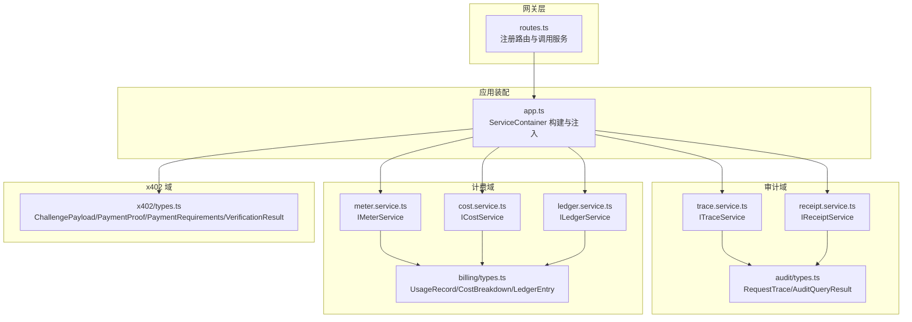
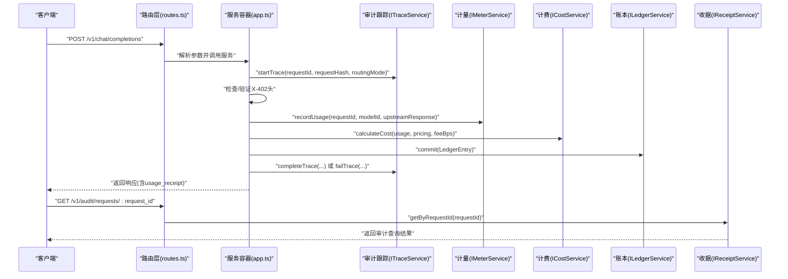
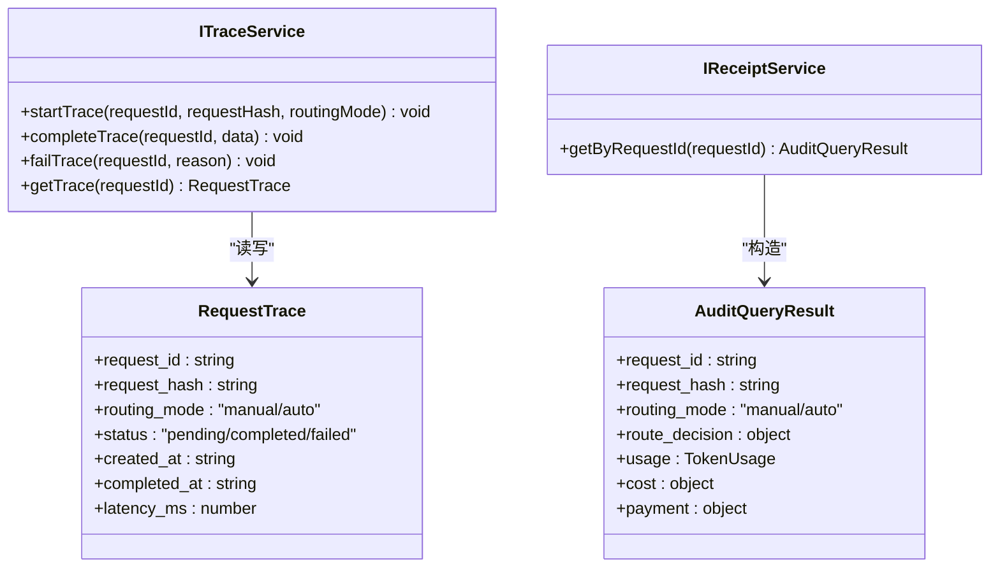
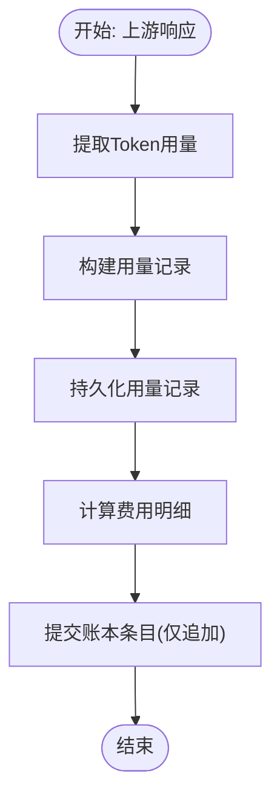
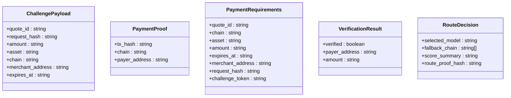
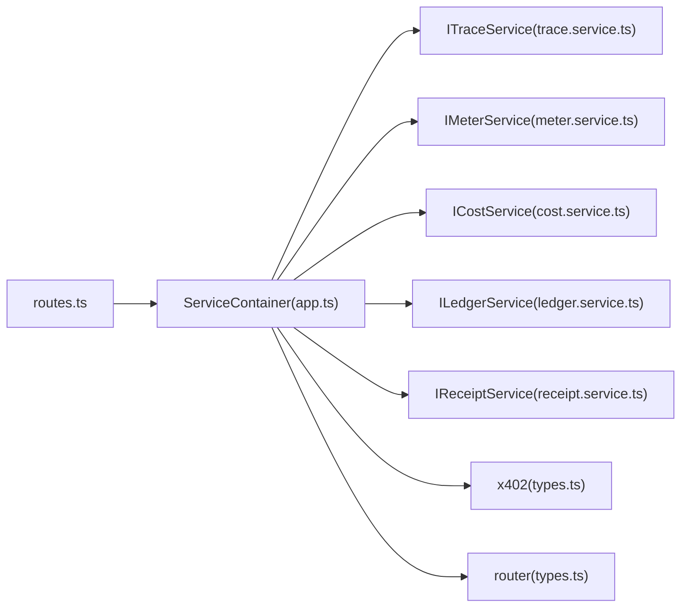

# 事件驱动架构

<cite>
**本文引用的文件**
- [src/app.ts](file://src/app.ts)
- [src/gateway/routes.ts](file://src/gateway/routes.ts)
- [src/audit/index.ts](file://src/audit/index.ts)
- [src/audit/types.ts](file://src/audit/types.ts)
- [src/audit/trace.service.ts](file://src/audit/trace.service.ts)
- [src/audit/receipt.service.ts](file://src/audit/receipt.service.ts)
- [src/billing/index.ts](file://src/billing/index.ts)
- [src/billing/types.ts](file://src/billing/types.ts)
- [src/billing/meter.service.ts](file://src/billing/meter.service.ts)
- [src/billing/cost.service.ts](file://src/billing/cost.service.ts)
- [src/billing/ledger.service.ts](file://src/billing/ledger.service.ts)
- [src/x402/index.ts](file://src/x402/index.ts)
- [src/x402/types.ts](file://src/x402/types.ts)
- [src/router/types.ts](file://src/router/types.ts)
- [src/types.ts](file://src/types.ts)
</cite>

## 目录
1. [引言](#引言)
2. [项目结构](#项目结构)
3. [核心组件](#核心组件)
4. [架构总览](#架构总览)
5. [详细组件分析](#详细组件分析)
6. [依赖关系分析](#依赖关系分析)
7. [性能考量](#性能考量)
8. [故障排查指南](#故障排查指南)
9. [结论](#结论)
10. [附录](#附录)

## 引言
本文件面向 x402 Gateway 的事件驱动架构，系统性梳理事件类型定义、发布订阅机制与事件处理器实现，覆盖审计事件、计费事件与安全事件的处理流程；解释事件的异步处理与持久化策略；提供事件监听器的开发指南（事件过滤、批量处理与错误恢复）；并阐述事件溯源与审计追踪的实现原理。当前代码库处于功能扩展阶段：路由层已定义支付流程步骤与审计接口占位，但事件驱动的发布订阅与持久化尚未落地实现。本文在不暴露具体代码的前提下，基于现有接口与注释，给出可执行的架构蓝图与实施建议。

## 项目结构
项目采用按领域分层的模块化组织方式，核心领域包括：
- 网关层：路由注册、请求参数校验与调用服务容器中的业务服务
- 审计域：请求跟踪、收据生成与审计查询结果模型
- 计费域：用量计量、费用计算与账本（只允许追加）
- x402 域：挑战、支付验证与重放防护
- 路由域：路由决策元数据，用于审计与溯源

图表来源
- [src/gateway/routes.ts:1-96](file://src/gateway/routes.ts#L1-L96)
- [src/app.ts:35-100](file://src/app.ts#L35-L100)
- [src/audit/trace.service.ts:1-68](file://src/audit/trace.service.ts#L1-L68)
- [src/audit/receipt.service.ts:1-26](file://src/audit/receipt.service.ts#L1-L26)
- [src/audit/types.ts:1-38](file://src/audit/types.ts#L1-L38)
- [src/billing/meter.service.ts:1-29](file://src/billing/meter.service.ts#L1-L29)
- [src/billing/cost.service.ts:1-32](file://src/billing/cost.service.ts#L1-L32)
- [src/billing/ledger.service.ts:1-42](file://src/billing/ledger.service.ts#L1-L42)
- [src/billing/types.ts:1-32](file://src/billing/types.ts#L1-L32)
- [src/x402/types.ts:1-37](file://src/x402/types.ts#L1-L37)

章节来源
- [src/app.ts:35-100](file://src/app.ts#L35-L100)
- [src/gateway/routes.ts:1-96](file://src/gateway/routes.ts#L1-L96)

## 核心组件
- 服务容器与装配
  - 应用启动时构建服务容器，注入 Provider 注册表、挑战服务、支付验证服务、重放防护服务、路由服务、计量服务、计费服务、账本服务、审计跟踪与收据服务
  - 通过路由层以依赖注入的方式调用各服务，保持处理器薄逻辑
- 事件类型与模型
  - 审计：请求跟踪记录、审计查询结果
  - 计费：用量记录、费用明细、账本条目
  - x402：挑战载荷、支付证明、支付要求、验证结果
  - 路由：路由决策元数据
- 事件处理器接口
  - 审计跟踪：开始、完成、失败、查询
  - 收据生成：按请求 ID 汇总审计全貌
  - 计量：从上游响应提取用量并持久化
  - 计费：确定性费用计算
  - 账本：只允许追加写入

章节来源
- [src/app.ts:21-33](file://src/app.ts#L21-L33)
- [src/audit/index.ts:1-6](file://src/audit/index.ts#L1-L6)
- [src/billing/index.ts:1-8](file://src/billing/index.ts#L1-L8)
- [src/x402/index.ts:1-13](file://src/x402/index.ts#L1-L13)
- [src/types.ts:86-119](file://src/types.ts#L86-L119)
- [src/router/types.ts:1-22](file://src/router/types.ts#L1-L22)

## 架构总览
x402 Gateway 的事件驱动架构以“请求生命周期”为主线，围绕审计、计费与安全三类事件展开：
- 审计事件：贯穿请求生命周期，记录状态、路由决策、用量、成本与支付信息
- 计费事件：基于用量与定价模型，生成费用明细并写入账本
- 安全事件：挑战签发与校验、支付证明验证、重放防护

图表来源
- [src/gateway/routes.ts:23-67](file://src/gateway/routes.ts#L23-L67)
- [src/app.ts:77-94](file://src/app.ts#L77-L94)
- [src/audit/trace.service.ts:9-32](file://src/audit/trace.service.ts#L9-L32)
- [src/billing/meter.service.ts:10-10](file://src/billing/meter.service.ts#L10-L10)
- [src/billing/cost.service.ts:13-13](file://src/billing/cost.service.ts#L13-L13)
- [src/billing/ledger.service.ts:8-8](file://src/billing/ledger.service.ts#L8-L8)
- [src/audit/receipt.service.ts:11-11](file://src/audit/receipt.service.ts#L11-L11)

## 详细组件分析

### 审计事件与审计跟踪
- 请求跟踪模型
  - 包含请求标识、哈希、路由模式、状态（待定/完成/失败）、时间戳与延迟等字段
  - 作为审计主干，贯穿请求生命周期
- 审计查询结果
  - 结构化输出审计证据：路由决策、用量、成本、支付信息
- 审计跟踪服务
  - 提供开始、完成、失败与查询能力
  - 当前实现为占位，需对接数据库进行持久化
- 收据服务
  - 依据请求 ID 聚合审计跟踪、路由决策、用量、费用与支付数据，输出标准格式

图表来源
- [src/audit/trace.service.ts:4-36](file://src/audit/trace.service.ts#L4-L36)
- [src/audit/receipt.service.ts:4-12](file://src/audit/receipt.service.ts#L4-L12)
- [src/audit/types.ts:3-37](file://src/audit/types.ts#L3-L37)

章节来源
- [src/audit/types.ts:3-37](file://src/audit/types.ts#L3-L37)
- [src/audit/trace.service.ts:4-36](file://src/audit/trace.service.ts#L4-L36)
- [src/audit/receipt.service.ts:4-12](file://src/audit/receipt.service.ts#L4-L12)

### 计费事件与账本
- 用量计量
  - 从上游响应中提取提示词、补全与总计 Token 数，封装为用量记录并持久化
- 费用计算
  - 基于输入/输出单价与 Token 数计算小计、平台费用与总计，确保可复现
- 账本
  - 追加式写入，禁止更新或删除；支持按请求 ID 与报价单 ID 查询

图表来源
- [src/billing/meter.service.ts:10-10](file://src/billing/meter.service.ts#L10-L10)
- [src/billing/cost.service.ts:13-13](file://src/billing/cost.service.ts#L13-L13)
- [src/billing/ledger.service.ts:8-8](file://src/billing/ledger.service.ts#L8-L8)

章节来源
- [src/billing/types.ts:3-31](file://src/billing/types.ts#L3-L31)
- [src/billing/meter.service.ts:10-28](file://src/billing/meter.service.ts#L10-L28)
- [src/billing/cost.service.ts:13-30](file://src/billing/cost.service.ts#L13-L30)
- [src/billing/ledger.service.ts:8-40](file://src/billing/ledger.service.ts#L8-L40)

### 安全事件与 x402 支付流
- 挑战与支付
  - 挑战载荷包含报价单、请求哈希、金额、资产、链、商户地址与过期时间
  - 支付证明包含交易哈希、链与付款人地址
  - 支付要求包含金额、过期时间、商户地址、请求哈希与挑战令牌
  - 验证结果包含验证状态、付款人地址与金额
- 路由与重放防护
  - 路由决策包含选型模型、回退链与评分摘要
  - 重放防护通过外部存储标记已消费的支付证明哈希，避免重复使用

图表来源
- [src/x402/types.ts:1-37](file://src/x402/types.ts#L1-L37)
- [src/router/types.ts:1-7](file://src/router/types.ts#L1-L7)

章节来源
- [src/x402/types.ts:1-37](file://src/x402/types.ts#L1-L37)
- [src/router/types.ts:1-7](file://src/router/types.ts#L1-L7)

### 路由与审计证据
- 路由上下文与候选模型
  - 路由上下文包含请求模型、路由模式与可用模型列表
  - 候选模型包含模型 ID、评分与原因
- 审计证据
  - 路由决策元数据作为审计证据的一部分，用于审计查询结果

章节来源
- [src/router/types.ts:9-22](file://src/router/types.ts#L9-L22)
- [src/types.ts:86-119](file://src/types.ts#L86-L119)

## 依赖关系分析
- 组件耦合
  - 路由层仅负责参数解析与调用服务，降低业务耦合
  - 服务容器集中装配与注入，便于替换与测试
- 外部依赖
  - 数据持久化：审计跟踪、用量、账本均需数据库实现
  - 缓存/队列：事件异步处理与批量处理可借助外部中间件
  - 重放防护：依赖外部存储（如 Redis）维护已消费证明哈希
- 可能的循环依赖
  - 当前未见直接循环导入；若引入事件总线，应避免服务间相互引用

图表来源
- [src/gateway/routes.ts:1-96](file://src/gateway/routes.ts#L1-L96)
- [src/app.ts:77-94](file://src/app.ts#L77-L94)
- [src/audit/trace.service.ts:1-68](file://src/audit/trace.service.ts#L1-L68)
- [src/billing/meter.service.ts:1-29](file://src/billing/meter.service.ts#L1-L29)
- [src/billing/cost.service.ts:1-32](file://src/billing/cost.service.ts#L1-L32)
- [src/billing/ledger.service.ts:1-42](file://src/billing/ledger.service.ts#L1-L42)
- [src/audit/receipt.service.ts:1-26](file://src/audit/receipt.service.ts#L1-L26)
- [src/x402/types.ts:1-37](file://src/x402/types.ts#L1-L37)
- [src/router/types.ts:1-22](file://src/router/types.ts#L1-L22)

章节来源
- [src/app.ts:77-94](file://src/app.ts#L77-L94)
- [src/gateway/routes.ts:1-96](file://src/gateway/routes.ts#L1-L96)

## 性能考量
- 异步与批量
  - 将审计完成、用量持久化、费用计算与账本提交放入异步任务队列，减少请求路径阻塞
  - 批量写入数据库，降低事务开销
- 缓存与索引
  - 对请求 ID、报价单 ID 建立索引，加速审计查询
  - 缓存常用模型定价与路由候选，缩短决策路径
- 资源隔离
  - 将重放防护与审计/账本分别接入不同存储实例，避免热点竞争

## 故障排查指南
- 审计跟踪失败
  - 检查跟踪服务实现是否正确设置状态与延迟；确认数据库连接与事务边界
- 用量记录缺失
  - 核对上游响应结构与用量提取逻辑；确认持久化成功与异常捕获
- 费用计算不一致
  - 对照单价与 Token 数，确保字符串格式化与精度处理一致
- 账本重复写入
  - 确保仅追加写入；对重复请求 ID 或报价单 ID 的幂等性进行测试
- 收据查询为空
  - 核对请求 ID 是否匹配；检查各子表是否成功写入
- 重放防护误判
  - 检查外部存储键空间与过期策略；核对支付证明哈希生成一致性

章节来源
- [src/audit/trace.service.ts:49-65](file://src/audit/trace.service.ts#L49-L65)
- [src/billing/meter.service.ts:14-26](file://src/billing/meter.service.ts#L14-L26)
- [src/billing/cost.service.ts:18-29](file://src/billing/cost.service.ts#L18-L29)
- [src/billing/ledger.service.ts:19-39](file://src/billing/ledger.service.ts#L19-L39)
- [src/audit/receipt.service.ts:14-24](file://src/audit/receipt.service.ts#L14-L24)

## 结论
x402 Gateway 的事件驱动架构以清晰的领域边界与接口抽象为基础，围绕审计、计费与安全三大事件域构建了可扩展的处理流水线。当前代码库已完成路由与服务装配的骨架，事件的异步处理与持久化尚需落地。建议优先实现审计跟踪与账本的数据库持久化，随后引入消息队列与批处理机制，最终完善事件过滤、批量处理与错误恢复，形成完整的事件驱动闭环。

## 附录

### 事件监听器开发指南
- 事件过滤
  - 基于请求 ID、路由模式、状态等维度进行过滤，避免无关事件进入处理链
- 批量处理
  - 将同一窗口内的事件合并，统一提交数据库或外部系统，提升吞吐
- 错误恢复
  - 对失败事件进行重试与死信队列管理；对幂等事件进行去重处理
- 事件溯源与审计追踪
  - 审计跟踪作为单一事实源，记录请求全生命周期；收据服务通过聚合多源事件生成审计报告
  - 账本作为不可变追加日志，支持补偿分录与对账

[本节为概念性内容，无需列出来源]