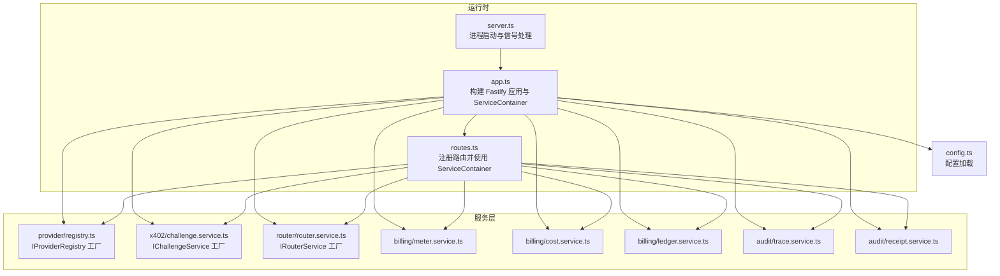
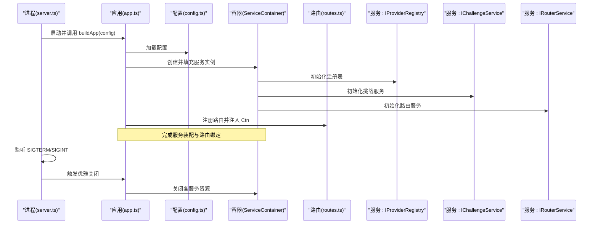
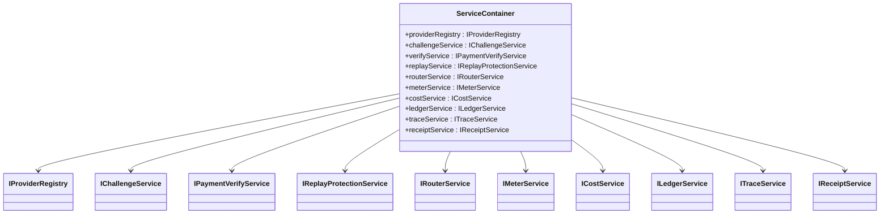

# 依赖注入模式

<cite>
**本文引用的文件**
- [src/app.ts](file://src/app.ts)
- [src/server.ts](file://src/server.ts)
- [src/config.ts](file://src/config.ts)
- [src/gateway/routes.ts](file://src/gateway/routes.ts)
- [src/provider/registry.ts](file://src/provider/registry.ts)
- [src/x402/challenge.service.ts](file://src/x402/challenge.service.ts)
- [src/router/router.service.ts](file://src/router/router.service.ts)
- [src/billing/meter.service.ts](file://src/billing/meter.service.ts)
- [src/billing/cost.service.ts](file://src/billing/cost.service.ts)
- [src/billing/ledger.service.ts](file://src/billing/ledger.service.ts)
- [src/audit/trace.service.ts](file://src/audit/trace.service.ts)
- [src/audit/receipt.service.ts](file://src/audit/receipt.service.ts)
- [src/errors.ts](file://src/errors.ts)
- [test/helpers.ts](file://test/helpers.ts)
- [src/types.ts](file://src/types.ts)
</cite>

## 目录
1. [引言](#引言)
2. [项目结构](#项目结构)
3. [核心组件](#核心组件)
4. [架构总览](#架构总览)
5. [详细组件分析](#详细组件分析)
6. [依赖关系分析](#依赖关系分析)
7. [性能考虑](#性能考虑)
8. [故障排查指南](#故障排查指南)
9. [结论](#结论)
10. [附录](#附录)

## 引言
本文件系统性阐述 x402 Gateway 中的依赖注入模式与 ServiceContainer 设计。当前实现采用“构造器注入 + 手动装配”的轻量依赖注入风格：在应用启动阶段集中创建所有服务实例，并通过 ServiceContainer 将其统一注入到路由处理器中。该模式具备以下特点：
- 明确的服务契约：每个服务以工厂函数 + 接口的形式暴露，便于替换与测试。
- 松耦合的路由层：路由处理器仅依赖接口，不直接依赖具体实现或外部资源。
- 可观测的生命周期：服务在构建时完成初始化（如数据库、缓存连接），在关闭钩子中统一释放。
- 清晰的错误边界：通过 AppError 类型体系与全局错误处理器，确保错误一致化响应。

## 项目结构
围绕依赖注入的关键目录与文件如下：
- 应用入口与装配：src/server.ts、src/app.ts
- 配置加载：src/config.ts
- 路由与控制器：src/gateway/routes.ts
- 服务接口与工厂：src/provider/registry.ts、src/x402/challenge.service.ts、src/router/router.service.ts、src/billing/*、src/audit/*
- 错误类型与转换：src/errors.ts
- 测试辅助：test/helpers.ts
- 共享类型：src/types.ts

图表来源
- [src/server.ts:1-33](file://src/server.ts#L1-L33)
- [src/app.ts:35-100](file://src/app.ts#L35-L100)
- [src/gateway/routes.ts:9-96](file://src/gateway/routes.ts#L9-L96)
- [src/config.ts:28-45](file://src/config.ts#L28-L45)

章节来源
- [src/server.ts:1-33](file://src/server.ts#L1-L33)
- [src/app.ts:35-100](file://src/app.ts#L35-L100)
- [src/gateway/routes.ts:9-96](file://src/gateway/routes.ts#L9-L96)
- [src/config.ts:28-45](file://src/config.ts#L28-L45)

## 核心组件
- ServiceContainer：集中声明并持有所有服务实例，作为路由处理器的依赖注入载体。它定义了应用内所有可注入服务的契约集合，确保路由层只依赖接口，不感知具体实现。
- 构建流程：buildApp 在启动时创建并组装 ServiceContainer，随后将容器传递给路由注册函数；路由处理器通过容器访问所需服务。
- 生命周期管理：应用启动时初始化服务，关闭钩子中统一释放资源（如数据库、缓存等）。
- 错误处理：全局错误处理器将 AppError 与 Zod 校验错误映射为标准响应格式，其他异常记录日志后返回通用错误。

章节来源
- [src/app.ts:21-33](file://src/app.ts#L21-L33)
- [src/app.ts:77-94](file://src/app.ts#L77-L94)
- [src/gateway/routes.ts:9-96](file://src/gateway/routes.ts#L9-L96)
- [src/errors.ts:6-105](file://src/errors.ts#L6-L105)

## 架构总览
下图展示了从进程启动到请求处理的依赖注入与调用链路：

图表来源
- [src/server.ts:4-26](file://src/server.ts#L4-L26)
- [src/app.ts:35-100](file://src/app.ts#L35-L100)
- [src/gateway/routes.ts:9-96](file://src/gateway/routes.ts#L9-L96)

## 详细组件分析

### ServiceContainer 设计与实现
- 设计理念
  - 以接口聚合的方式声明所有服务契约，避免路由层直接依赖具体实现。
  - 通过工厂函数创建服务实例，便于注入配置参数与外部依赖（如数据库、缓存）。
  - 将服务装配集中在单点，降低跨模块耦合度。
- 实现方式
  - 在 app.ts 中定义 ServiceContainer 接口，包含 providerRegistry、challengeService、verifyService、replayService、routerService、meterService、costService、ledgerService、traceService、receiptService 等字段。
  - 在 buildApp 中按顺序创建各服务实例，并将其赋值到容器对象，最后传入 registerRoutes。
- 松耦合效果
  - 路由处理器仅依赖 ServiceContainer 接口，无需关心具体实现细节。
  - 单元测试可通过覆盖容器中的部分服务实现替身，隔离验证业务逻辑。

章节来源
- [src/app.ts:21-33](file://src/app.ts#L21-L33)
- [src/app.ts:77-94](file://src/app.ts#L77-L94)
- [src/gateway/routes.ts:3-3](file://src/gateway/routes.ts#L3-L3)

### 服务注册与生命周期管理
- 服务注册
  - providerRegistry：模型注册表，用于在启动时注册可用模型及其适配器与定价信息。
  - challengeService：挑战生成与校验服务，依赖配置中的密钥、过期时间、商户地址、支付链与资产。
  - routerService：路由编排服务，负责根据手动或自动模式选择上游模型并执行回退链。
  - billing 服务：meterService、costService、ledgerService 分别负责用量记录、成本计算与账簿记账。
  - audit 服务：traceService、receiptService 提供审计追踪与收据查询能力。
- 生命周期
  - 启动：在 buildApp 中创建服务实例；TODO 处理 Redis 与数据库连接初始化。
  - 运行：路由处理器通过容器访问服务；服务内部可持有持久化连接。
  - 关闭：server.ts 中监听信号，调用 app.close 并在 TODO 处关闭外部连接。

章节来源
- [src/app.ts:77-94](file://src/app.ts#L77-L94)
- [src/server.ts:17-22](file://src/server.ts#L17-L22)
- [src/provider/registry.ts:27-64](file://src/provider/registry.ts#L27-L64)
- [src/x402/challenge.service.ts:28-70](file://src/x402/challenge.service.ts#L28-L70)
- [src/router/router.service.ts:20-49](file://src/router/router.service.ts#L20-L49)

### 依赖解析机制与错误处理策略
- 依赖解析
  - 构造器注入：服务工厂函数接收配置对象作为参数，形成显式依赖列表。
  - 运行时解析：路由处理器通过 ServiceContainer 获取所需服务接口，无需自行实例化。
- 错误处理
  - 全局错误处理器：区分 AppError 与 Zod 校验错误，统一输出标准响应；其他异常记录日志并返回通用错误。
  - 服务内错误：各服务抛出领域特定错误（如挑战过期、请求哈希不匹配、支付重复等），由全局处理器转换为 API 响应。

章节来源
- [src/app.ts:52-70](file://src/app.ts#L52-L70)
- [src/errors.ts:6-105](file://src/errors.ts#L6-L105)

### 循环依赖处理
- 当前实现未发现直接循环依赖。ServiceContainer 采用“自上而下”装配，路由层仅依赖接口，避免了典型循环依赖场景。
- 若未来引入服务间相互依赖，建议：
  - 使用惰性注入（延迟初始化）或服务定位器（在需要时再解析）。
  - 重构共享状态为独立的配置或上下文对象，减少双向依赖。
  - 通过接口分层拆分职责，避免服务间强耦合。

章节来源
- [src/app.ts:77-94](file://src/app.ts#L77-L94)
- [src/gateway/routes.ts:9-96](file://src/gateway/routes.ts#L9-L96)

### 代码示例路径（不展示具体代码）
- 构建应用与装配容器
  - [src/app.ts:35-100](file://src/app.ts#L35-L100)
- 注册路由并注入服务
  - [src/gateway/routes.ts:9-96](file://src/gateway/routes.ts#L9-L96)
- 测试中构建测试应用容器
  - [test/helpers.ts:19-44](file://test/helpers.ts#L19-L44)
- 服务接口与工厂
  - [src/provider/registry.ts:4-64](file://src/provider/registry.ts#L4-L64)
  - [src/x402/challenge.service.ts:4-70](file://src/x402/challenge.service.ts#L4-L70)
  - [src/router/router.service.ts:5-49](file://src/router/router.service.ts#L5-L49)
  - [src/billing/meter.service.ts](file://src/billing/meter.service.ts)
  - [src/billing/cost.service.ts](file://src/billing/cost.service.ts)
  - [src/billing/ledger.service.ts](file://src/billing/ledger.service.ts)
  - [src/audit/trace.service.ts](file://src/audit/trace.service.ts)
  - [src/audit/receipt.service.ts](file://src/audit/receipt.service.ts)

## 依赖关系分析
- 组件耦合
  - 路由层仅依赖 ServiceContainer 接口，耦合度低。
  - 服务层之间通过接口交互，未见直接互相依赖。
- 外部依赖
  - 数据库与缓存连接目前在 TODO 中，尚未注入到服务工厂；建议在工厂函数中显式接收连接实例，保持依赖可见。
- 潜在风险
  - 服务初始化顺序与外部资源可用性相关，需在构建阶段进行健壮性检查。
  - 错误处理集中在全局处理器，服务内部错误需严格继承 AppError 体系。

图表来源
- [src/app.ts:21-33](file://src/app.ts#L21-L33)
- [src/provider/registry.ts:4-16](file://src/provider/registry.ts#L4-L16)
- [src/x402/challenge.service.ts:4-26](file://src/x402/challenge.service.ts#L4-L26)
- [src/router/router.service.ts:5-18](file://src/router/router.service.ts#L5-L18)
- [src/billing/meter.service.ts](file://src/billing/meter.service.ts)
- [src/billing/cost.service.ts](file://src/billing/cost.service.ts)
- [src/billing/ledger.service.ts](file://src/billing/ledger.service.ts)
- [src/audit/trace.service.ts](file://src/audit/trace.service.ts)
- [src/audit/receipt.service.ts](file://src/audit/receipt.service.ts)

## 性能考虑
- 服务实例复用：容器内的服务实例在应用生命周期内复用，避免频繁创建销毁带来的开销。
- 外部连接：数据库与缓存连接建议在工厂中注入并复用，减少握手与认证成本。
- 路由编排：routerService 的自动模式评分与回退链构建应尽量避免重复计算，必要时引入缓存或预计算。
- 日志与监控：在服务工厂中集成指标埋点，便于定位性能瓶颈。

## 故障排查指南
- 启动失败
  - 检查配置项是否完整（如数据库 URL、Redis URL、挑战密钥等）。
  - 查看进程日志，确认 app.close 是否被调用以及外部连接是否正确释放。
- 请求处理异常
  - 区分 AppError 与 Zod 校验错误，前者由全局处理器转换为标准响应，后者返回 400。
  - 对于 402 场景，确认挑战头与支付头是否齐全，以及挑战签名与过期时间是否有效。
- 服务不可用
  - 检查服务工厂是否成功创建实例，以及外部依赖（数据库、缓存）是否可达。
  - 在测试中使用 test/helpers 构建最小化容器，逐步替换服务以定位问题。

章节来源
- [src/config.ts:28-45](file://src/config.ts#L28-L45)
- [src/server.ts:17-22](file://src/server.ts#L17-L22)
- [src/app.ts:52-70](file://src/app.ts#L52-L70)
- [test/helpers.ts:19-44](file://test/helpers.ts#L19-L44)

## 结论
本项目采用“构造器注入 + 手动装配”的轻量依赖注入模式，通过 ServiceContainer 将服务统一暴露给路由层，实现了松耦合与高可测试性。当前实现清晰地分离了路由、服务与基础设施层，错误处理与生命周期管理也已具备基础框架。后续可在以下方面持续演进：
- 明确注入外部连接（数据库、缓存），完善服务工厂参数。
- 引入循环依赖检测与处理策略，保障扩展稳定性。
- 增强可观测性与性能监控，提升运维效率。

## 附录
- 最佳实践
  - 服务工厂显式声明依赖，避免隐式全局状态。
  - 路由处理器仅依赖接口，不直接操作外部资源。
  - 错误类型统一继承 AppError，保证响应一致性。
- 常见问题
  - 依赖缺失：检查 ServiceContainer 中对应服务是否创建。
  - 配置错误：核对 config.ts 中环境变量与默认值。
  - 资源泄漏：确保在关闭钩子中释放外部连接。