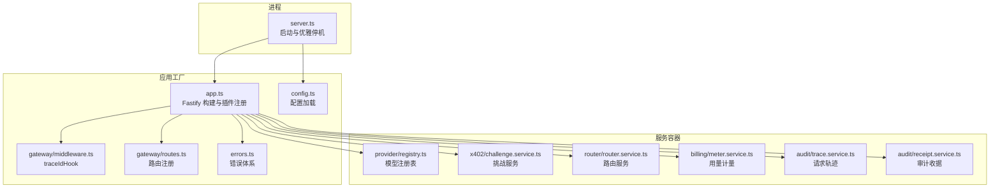
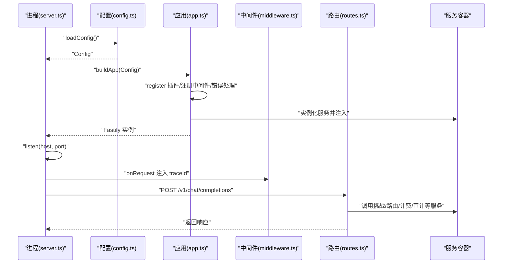
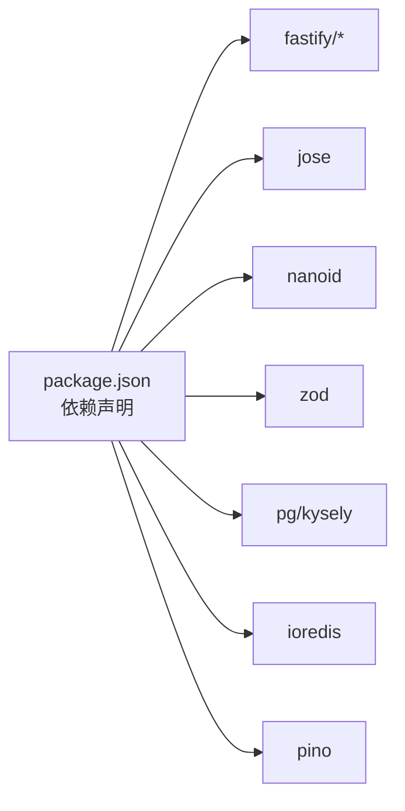
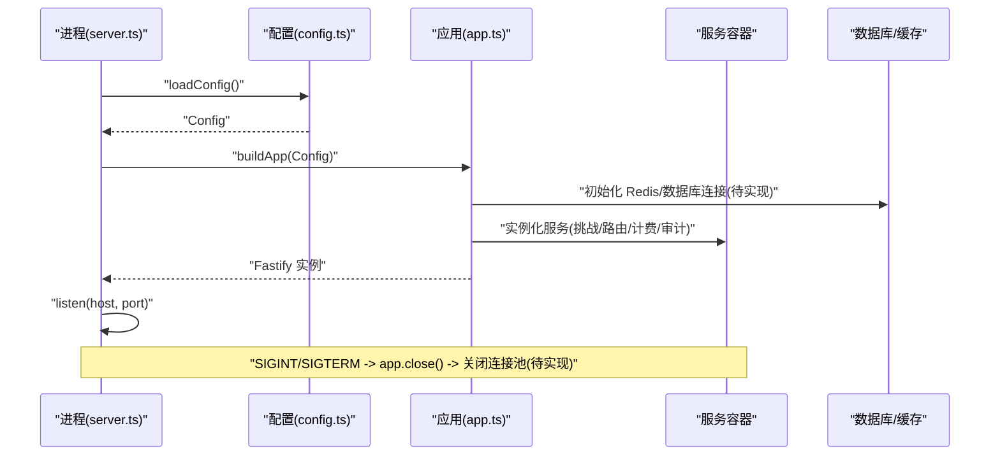

# 服务生命周期管理

<cite>
**本文引用的文件**
- [src/server.ts](file://src/server.ts)
- [src/app.ts](file://src/app.ts)
- [src/config.ts](file://src/config.ts)
- [src/errors.ts](file://src/errors.ts)
- [src/gateway/middleware.ts](file://src/gateway/middleware.ts)
- [src/gateway/routes.ts](file://src/gateway/routes.ts)
- [src/x402/challenge.service.ts](file://src/x402/challenge.service.ts)
- [src/router/router.service.ts](file://src/router/router.service.ts)
- [src/provider/registry.ts](file://src/provider/registry.ts)
- [src/billing/meter.service.ts](file://src/billing/meter.service.ts)
- [src/audit/trace.service.ts](file://src/audit/trace.service.ts)
- [src/audit/receipt.service.ts](file://src/audit/receipt.service.ts)
- [package.json](file://package.json)
- [README.md](file://README.md)
</cite>

## 目录
1. [简介](#简介)
2. [项目结构](#项目结构)
3. [核心组件](#核心组件)
4. [架构总览](#架构总览)
5. [详细组件分析](#详细组件分析)
6. [依赖分析](#依赖分析)
7. [性能考虑](#性能考虑)
8. [故障排查指南](#故障排查指南)
9. [结论](#结论)
10. [附录](#附录)

## 简介
本文件系统性阐述 x402 Gateway 的服务生命周期管理，覆盖应用启动流程中的服务初始化顺序与依赖关系、启动/运行/关闭阶段的行为、配置加载机制、错误传播与日志记录、以及健康检查与优雅停机策略。同时给出监控、故障恢复（超时、重试、降级）与日志记录的实现建议，并对当前未完成的功能点进行说明以便后续迭代。

## 项目结构
- 入口与生命周期
  - 启动入口：server.ts 负责加载配置、构建应用并监听端口，同时注册信号处理器以实现优雅停机。
  - 应用工厂：app.ts 负责注册插件、中间件、全局错误处理、实例化各业务服务并注入到路由层。
- 配置与类型
  - 配置加载：config.ts 使用 zod 校验环境变量，统一输出强类型配置对象。
  - 错误体系：errors.ts 定义了与 API 规范一致的错误类型与响应转换。
- 网关与路由
  - 中间件：gateway/middleware.ts 注入请求追踪 ID。
  - 路由：gateway/routes.ts 定义 API 并委托给服务层执行。
- 业务服务
  - x402 挑战与校验：x402/challenge.service.ts 提供挑战生成/验证与请求哈希计算接口。
  - 路由编排：router/router.service.ts 提供手动/自动路由与回退链路编排。
  - 上游适配：provider/registry.ts 维护模型注册表。
  - 计费与账簿：billing/meter.service.ts 提供用量计量。
  - 审计与收据：audit/trace.service.ts 与 audit/receipt.service.ts 提供请求轨迹与审计查询能力。

图表来源
- [src/server.ts:1-33](file://src/server.ts#L1-L33)
- [src/app.ts:35-100](file://src/app.ts#L35-L100)
- [src/gateway/middleware.ts:1-13](file://src/gateway/middleware.ts#L1-L13)
- [src/gateway/routes.ts:1-96](file://src/gateway/routes.ts#L1-L96)
- [src/config.ts:28-45](file://src/config.ts#L28-L45)
- [src/errors.ts:1-106](file://src/errors.ts#L1-L106)
- [src/provider/registry.ts:27-64](file://src/provider/registry.ts#L27-L64)
- [src/x402/challenge.service.ts:28-70](file://src/x402/challenge.service.ts#L28-L70)
- [src/router/router.service.ts:20-49](file://src/router/router.service.ts#L20-L49)
- [src/billing/meter.service.ts:13-28](file://src/billing/meter.service.ts#L13-L28)
- [src/audit/trace.service.ts:38-67](file://src/audit/trace.service.ts#L38-L67)
- [src/audit/receipt.service.ts:14-25](file://src/audit/receipt.service.ts#L14-L25)

章节来源
- [src/server.ts:1-33](file://src/server.ts#L1-L33)
- [src/app.ts:35-100](file://src/app.ts#L35-L100)
- [src/config.ts:28-45](file://src/config.ts#L28-L45)
- [README.md:79-106](file://README.md#L79-L106)

## 核心组件
- 配置加载与校验
  - 使用 zod 对环境变量进行解析与默认值填充，确保运行期配置的强类型约束。
- 应用工厂与插件注册
  - 注册 CORS、Helmet、限流、sensible 等插件；注册全局错误处理；注入 traceIdHook。
- 服务容器与依赖注入
  - 在应用工厂中实例化各业务服务并通过 ServiceContainer 注入路由层。
- 路由与中间件
  - 中间件负责注入唯一请求 ID；路由层负责参数解析与调用服务层。
- 错误体系
  - 统一的 AppError 及其子类映射到 API 规范中的错误码与状态码，支持错误到响应体的转换。

章节来源
- [src/config.ts:28-45](file://src/config.ts#L28-L45)
- [src/app.ts:35-100](file://src/app.ts#L35-L100)
- [src/gateway/middleware.ts:9-12](file://src/gateway/middleware.ts#L9-L12)
- [src/gateway/routes.ts:9-96](file://src/gateway/routes.ts#L9-L96)
- [src/errors.ts:6-105](file://src/errors.ts#L6-L105)

## 架构总览
下图展示了从进程启动到请求处理的关键交互路径，包括配置加载、应用构建、服务注入与路由处理。

图表来源
- [src/server.ts:4-26](file://src/server.ts#L4-L26)
- [src/config.ts:28-45](file://src/config.ts#L28-L45)
- [src/app.ts:35-100](file://src/app.ts#L35-L100)
- [src/gateway/middleware.ts:9-12](file://src/gateway/middleware.ts#L9-L12)
- [src/gateway/routes.ts:23-67](file://src/gateway/routes.ts#L23-L67)

## 详细组件分析

### 启动与生命周期（server.ts）
- 启动流程
  - 加载配置后构建应用实例。
  - 监听指定 host/port，启动成功后记录日志。
- 优雅停机
  - 注册 SIGINT/SIGTERM 处理器，收到信号后调用 app.close() 并退出进程。
- 未实现的资源清理
  - 当前注释提示需在优雅停机时关闭 Redis 与数据库连接，建议补充连接池/客户端的 close 调用。

章节来源
- [src/server.ts:4-26](file://src/server.ts#L4-L26)

### 应用工厂与服务装配（app.ts）
- 插件注册
  - CORS、Helmet、限流、sensible 插件按序注册，确保安全与稳定性。
- 中间件与错误处理
  - onRequest 钩子注入 traceId；全局错误处理器区分 AppError、ZodError 与未知错误。
- 服务容器
  - 实例化 ProviderRegistry、ChallengeService、VerifyService、ReplayProtectionService、RouterService、MeterService、CostService、LedgerService、TraceService、ReceiptService，并注入路由层。
- 未实现的外部依赖
  - 当前注释提示需初始化 Redis 与数据库连接，建议在应用工厂中创建连接并在优雅停机时关闭。

章节来源
- [src/app.ts:35-100](file://src/app.ts#L35-L100)

### 配置加载机制（config.ts）
- 环境变量映射
  - 将环境变量映射到强类型配置对象，包含网络、日志级别、数据库与缓存地址、挑战密钥与过期时间、商户地址与支付链/资产、上游提供商密钥、平台费率等。
- 校验与默认值
  - 使用 zod 进行严格校验与默认值填充，避免运行期因配置缺失导致异常。

章节来源
- [src/config.ts:4-26](file://src/config.ts#L4-L26)
- [src/config.ts:28-45](file://src/config.ts#L28-L45)

### 中间件与请求追踪（gateway/middleware.ts）
- 功能
  - 在 onRequest 阶段生成唯一请求 ID 并挂载到 request.id，便于全链路追踪。
- 作用域
  - 该 ID 由应用工厂设置的 genReqId 占位，最终由中间件实际赋值。

章节来源
- [src/gateway/middleware.ts:9-12](file://src/gateway/middleware.ts#L9-L12)
- [src/app.ts:36-41](file://src/app.ts#L36-L41)

### 路由与请求处理（gateway/routes.ts）
- 路由职责
  - 参数解析与校验（如聊天补全请求体、审计查询参数）。
  - 无支付头时返回 402 并携带 payment_requirements；有支付头时预留完整支付流程的调用点。
- 当前状态
  - 支付流程与审计查询仍为占位实现，后续需接入挑战校验、重放保护、支付验证、路由编排、用量计量、账簿记账与轨迹完成等服务。

章节来源
- [src/gateway/routes.ts:9-96](file://src/gateway/routes.ts#L9-L96)

### 错误体系与传播（errors.ts）
- 错误分类
  - 包含 402/400/409/504/503/500 等错误类型，与 API 规范一一对应。
- 响应转换
  - errorToResponse 将 AppError 转换为统一响应结构，部分错误类型附加特定字段（如 payment_requirements）。

章节来源
- [src/errors.ts:6-105](file://src/errors.ts#L6-L105)

### 业务服务概览
- 模型注册表（provider/registry.ts）
  - 提供模型注册、适配器获取、模型列表与定价查询能力。
- 挑战服务（x402/challenge.service.ts）
  - 接口定义挑战生成、挑战验证与请求哈希计算；当前实现为占位抛错，后续需完善签名、过期与哈希一致性校验。
- 路由服务（router/router.service.ts）
  - 接口定义手动/自动路由与回退链路编排；当前实现为占位抛错，后续需接入策略引擎与回退服务。
- 用量计量（billing/meter.service.ts）
  - 接口定义用量记录与持久化；当前实现为占位抛错，后续需提取 token 数并写入数据库。
- 审计轨迹（audit/trace.service.ts）
  - 接口定义轨迹开始、完成、失败与查询；当前实现为占位抛错，后续需对接数据库。
- 审计收据（audit/receipt.service.ts）
  - 接口定义按请求 ID 查询审计结果；当前实现为占位抛错，后续需多表联结组装。

章节来源
- [src/provider/registry.ts:4-64](file://src/provider/registry.ts#L4-L64)
- [src/x402/challenge.service.ts:4-70](file://src/x402/challenge.service.ts#L4-L70)
- [src/router/router.service.ts:5-49](file://src/router/router.service.ts#L5-L49)
- [src/billing/meter.service.ts:5-28](file://src/billing/meter.service.ts#L5-L28)
- [src/audit/trace.service.ts:4-67](file://src/audit/trace.service.ts#L4-L67)
- [src/audit/receipt.service.ts:4-25](file://src/audit/receipt.service.ts#L4-L25)

## 依赖分析
- 运行时依赖
  - Fastify 生态（@fastify/cors、@fastify/helmet、@fastify/rate-limit、@fastify/sensible）、日志（pino）、数据访问（pg、kysely）、缓存（ioredis）、加密与 JWT（jose）、哈希与 ID（nanoid）、环境变量（dotenv）、类型校验（zod）。
- 代码耦合
  - app.ts 作为装配中心，集中管理服务实例与路由绑定，保持路由层薄逻辑。
  - 服务之间通过接口解耦，便于替换与测试。

图表来源
- [package.json:21-36](file://package.json#L21-L36)

章节来源
- [package.json:21-36](file://package.json#L21-L36)

## 性能考虑
- 启动阶段
  - 插件注册顺序影响性能与安全性，建议保持现有顺序（CORS/Helmet/限流/sensible）。
  - 服务实例化尽量惰性或并发初始化，避免阻塞主进程启动。
- 运行阶段
  - 限流与速率限制可结合上游可用性动态调整。
  - Redis 与数据库连接池大小需根据 QPS 与延迟目标调优。
- 关闭阶段
  - 优雅停机期间拒绝新连接，等待在途请求完成后再关闭连接池，减少丢包与中断。

## 故障排查指南
- 启动失败
  - 若监听失败，检查 host/port 是否被占用或权限问题；查看致命日志并确认配置是否正确。
- 请求错误
  - AppError 将直接映射为 API 错误响应；Zod 校验错误返回 400；其他异常记录错误日志并返回 500。
- 日志定位
  - 使用中间件注入的请求 ID 在日志中快速关联一次完整的请求链路。
- 未实现功能
  - 支付流程、审计查询、用量计量、轨迹持久化等功能均处于占位实现，需优先补齐以保障端到端可用性。

章节来源
- [src/server.ts:8-14](file://src/server.ts#L8-L14)
- [src/app.ts:53-70](file://src/app.ts#L53-L70)
- [src/gateway/middleware.ts:9-12](file://src/gateway/middleware.ts#L9-L12)
- [src/gateway/routes.ts:30-66](file://src/gateway/routes.ts#L30-L66)

## 结论
x402 Gateway 的生命周期管理遵循“配置加载 → 应用构建 → 服务装配 → 路由注册 → 监听与优雅停机”的清晰流程。当前路由与审计、计费等核心链路仍处于占位实现，建议优先完成挑战校验、支付验证、路由编排、用量计量与轨迹持久化，以达成端到端的 x402 支付与请求处理闭环。同时完善外部依赖（Redis/数据库）的连接与优雅停机关闭逻辑，提升系统稳定性与可观测性。

## 附录

### 启动序列图（含未实现扩展）

图表来源
- [src/server.ts:4-26](file://src/server.ts#L4-L26)
- [src/app.ts:72-94](file://src/app.ts#L72-L94)