# 策略模式

<cite>
**本文档引用的文件**
- [policy.ts](file://src/router/policy.ts)
- [types.ts](file://src/router/types.ts)
- [router.service.ts](file://src/router/router.service.ts)
- [fallback.service.ts](file://src/router/fallback.service.ts)
- [index.ts](file://src/router/index.ts)
- [router.test.ts](file://test/router/router.test.ts)
- [types.ts](file://src/types.ts)
- [provider/types.ts](file://src/provider/types.ts)
- [config.ts](file://src/config.ts)
</cite>

## 目录
1. [简介](#简介)
2. [项目结构](#项目结构)
3. [核心组件](#核心组件)
4. [架构概览](#架构概览)
5. [详细组件分析](#详细组件分析)
6. [策略模式设计](#策略模式设计)
7. [内置策略实现](#内置策略实现)
8. [自定义策略开发指南](#自定义策略开发指南)
9. [策略缓存与动态更新](#策略缓存与动态更新)
10. [性能考量](#性能考量)
11. [故障排除指南](#故障排除指南)
12. [结论](#结论)

## 简介

x402 Gateway 的策略模式是该系统的核心架构组件，负责在自动路由模式下为请求选择最优的上游模型。该模式实现了灵活的路由决策机制，支持手动选择和自动路由两种模式，并通过可插拔的策略引擎实现高度可扩展的路由逻辑。

策略模式的核心价值在于：
- **灵活性**：支持多种路由策略的动态切换
- **可扩展性**：易于添加新的路由算法
- **透明性**：完整的决策过程记录和审计
- **可靠性**：内置回退机制确保服务可用性

## 项目结构

策略模式相关的代码主要位于 `src/router` 目录中，采用模块化设计：

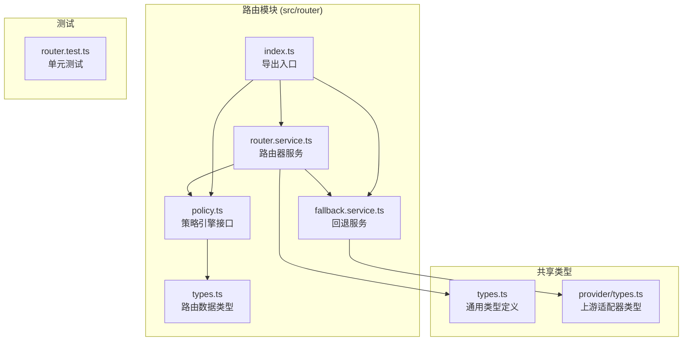

**图表来源**
- [policy.ts:1-34](file://src/router/policy.ts#L1-L34)
- [router.service.ts:1-50](file://src/router/router.service.ts#L1-L50)
- [fallback.service.ts:1-41](file://src/router/fallback.service.ts#L1-L41)

**章节来源**
- [policy.ts:1-34](file://src/router/policy.ts#L1-L34)
- [router.service.ts:1-50](file://src/router/router.service.ts#L1-L50)
- [fallback.service.ts:1-41](file://src/router/fallback.service.ts#L1-L41)
- [index.ts:1-8](file://src/router/index.ts#L1-L8)

## 核心组件

### IPolicyEngine 接口

IPolicyEngine 是策略模式的核心接口，定义了路由决策的两个关键方法：

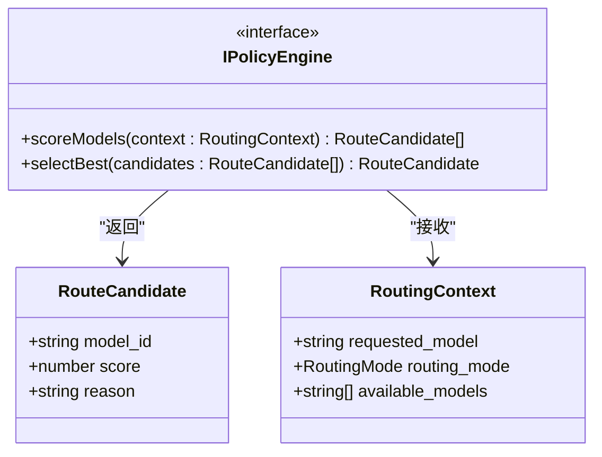

**图表来源**
- [policy.ts:3-14](file://src/router/policy.ts#L3-L14)
- [types.ts:9-21](file://src/router/types.ts#L9-L21)

### 路由决策数据结构

策略模式依赖于以下核心数据结构：

| 结构 | 字段 | 类型 | 描述 |
|------|------|------|------|
| RouteDecision | selected_model | string | 最终选择的模型ID |
| RouteDecision | fallback_chain | string[] | 回退链路顺序 |
| RouteDecision | score_summary | string | 评分摘要信息 |
| RouteDecision | route_proof_hash | string | 路由证明哈希 |
| RouteCandidate | model_id | string | 模型标识符 |
| RouteCandidate | score | number | 综合评分 |
| RouteCandidate | reason | string | 评分原因 |
| RoutingContext | requested_model | string | 请求的模型ID |
| RoutingContext | routing_mode | 'manual' \| 'auto' | 路由模式 |
| RoutingContext | available_models | string[] | 可用模型列表 |

**章节来源**
- [types.ts:1-22](file://src/router/types.ts#L1-L22)

## 架构概览

策略模式在整个系统中的位置和交互关系如下：

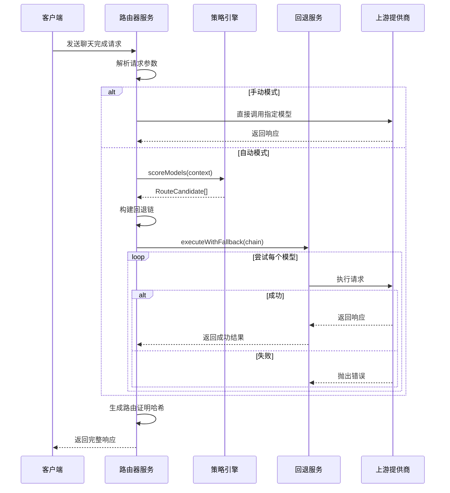

**图表来源**
- [router.service.ts:5-18](file://src/router/router.service.ts#L5-L18)
- [policy.ts:3-14](file://src/router/policy.ts#L3-L14)
- [fallback.service.ts:4-16](file://src/router/fallback.service.ts#L4-L16)

## 详细组件分析

### 策略引擎实现

当前的策略引擎是一个基础框架，需要进一步完善评分逻辑：

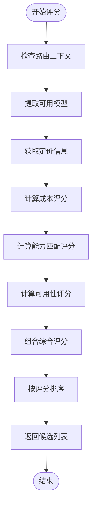

**图表来源**
- [policy.ts:16-33](file://src/router/policy.ts#L16-L33)

### 路由器服务集成

路由器服务协调整个路由流程：

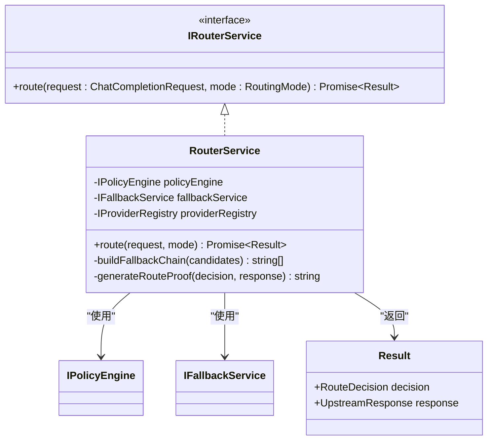

**图表来源**
- [router.service.ts:5-18](file://src/router/router.service.ts#L5-L18)
- [types.ts:54-62](file://src/types.ts#L54-L62)

**章节来源**
- [router.service.ts:20-49](file://src/router/router.service.ts#L20-L49)

### 回退服务机制

回退服务确保即使部分模型失败也能获得响应：

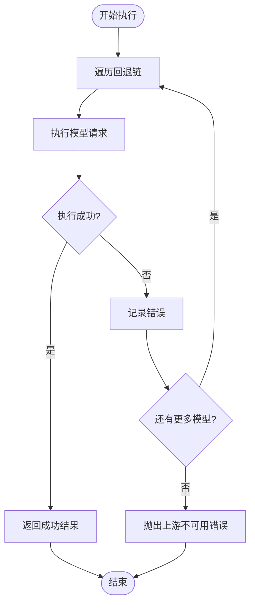

**图表来源**
- [fallback.service.ts:18-40](file://src/router/fallback.service.ts#L18-L40)

**章节来源**
- [fallback.service.ts:1-41](file://src/router/fallback.service.ts#L1-41)

## 策略模式设计

### 设计原则

策略模式在 x402 Gateway 中遵循以下设计原则：

1. **单一职责原则**：每个策略专注于特定的路由决策逻辑
2. **开闭原则**：对扩展开放，对修改关闭
3. **依赖倒置原则**：高层模块不依赖低层模块的具体实现
4. **接口隔离原则**：IPolicyEngine 接口定义明确的方法契约

### 接口契约

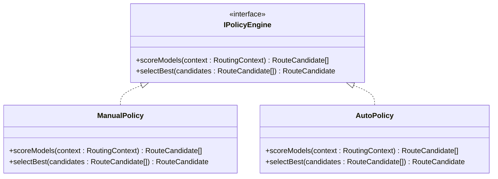

**图表来源**
- [policy.ts:3-14](file://src/router/policy.ts#L3-L14)

### 策略选择机制

策略选择基于请求的路由模式：

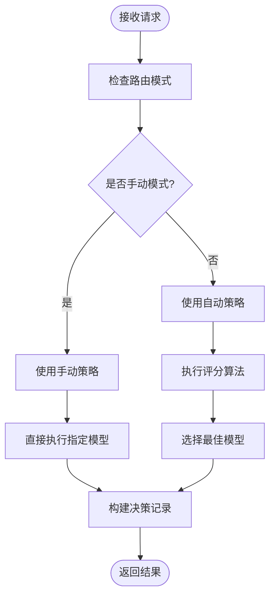

**图表来源**
- [router.service.ts:7-17](file://src/router/router.service.ts#L7-L17)

**章节来源**
- [router.service.ts:1-50](file://src/router/router.service.ts#L1-L50)

## 内置策略实现

### 手动选择策略

手动选择策略是最简单的实现，直接使用客户端指定的模型：

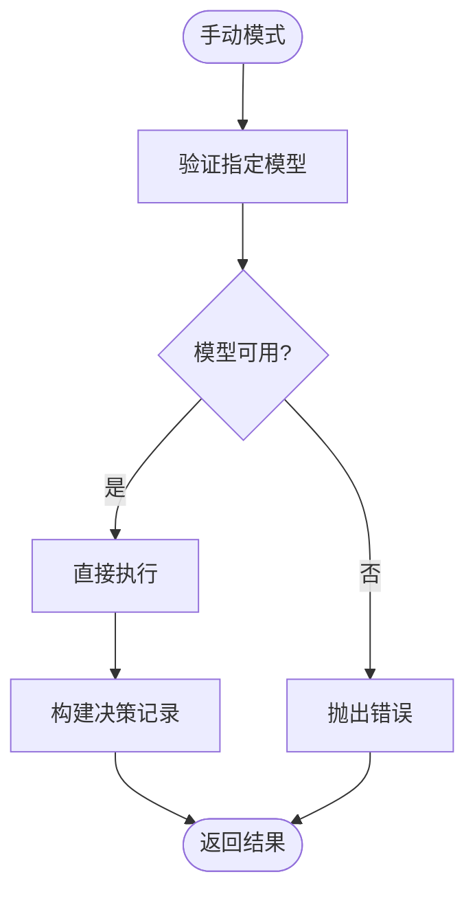

**图表来源**
- [router.service.ts:32-35](file://src/router/router.service.ts#L32-L35)

### 自动路由策略

自动路由策略需要实现复杂的评分算法：

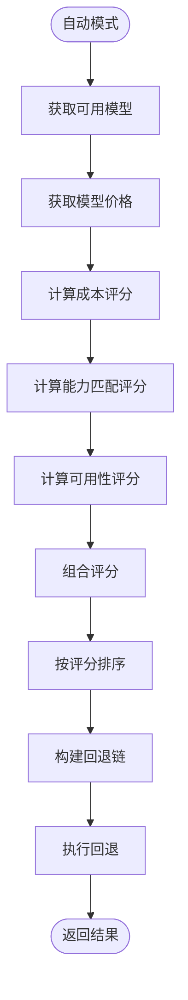

**图表来源**
- [router.service.ts:37-42](file://src/router/router.service.ts#L37-L42)

**章节来源**
- [policy.ts:16-33](file://src/router/policy.ts#L16-L33)

## 自定义策略开发指南

### 策略接口规范

要开发自定义策略，需要实现 IPolicyEngine 接口：

```typescript
// 策略接口定义参考
interface IPolicyEngine {
  scoreModels(context: RoutingContext): RouteCandidate[];
  selectBest(candidates: RouteCandidate[]): RouteCandidate;
}
```

**接口方法说明**：

1. **scoreModels 方法**
   - 输入：RoutingContext 对象
   - 输出：RouteCandidate 数组（按评分降序排列）
   - 职责：根据成本、能力匹配度、可用性等因素为所有候选模型打分

2. **selectBest 方法**
   - 输入：RouteCandidate 数组
   - 输出：RouteCandidate 对象
   - 职责：从候选模型中选择最佳模型

### 评估算法设计

推荐的评分算法包含以下维度：

| 评分维度 | 计算方法 | 权重 | 说明 |
|----------|----------|------|------|
| 成本效率 | 1/价格 | 40% | 价格越低评分越高 |
| 能力匹配 | 匹配度百分比 | 35% | 功能特性匹配程度 |
| 可用性 | 可用性百分比 | 20% | 响应时间、成功率等 |
| 优先级 | 固定值 | 5% | 预设的模型优先级 |

### 性能考量

1. **评分缓存**
   - 缓存模型价格信息
   - 缓存健康检查结果
   - 使用 LRU 缓存策略

2. **并发控制**
   - 控制同时执行的模型数量
   - 实现超时机制
   - 避免阻塞操作

3. **内存管理**
   - 及时清理临时数据
   - 使用流式处理大响应
   - 监控内存使用情况

### 开发步骤

1. **实现基础接口**
```typescript
export function createCustomPolicy(): IPolicyEngine {
  return {
    scoreModels(context: RoutingContext): RouteCandidate[] {
      // 实现评分逻辑
    },
    selectBest(candidates: RouteCandidate[]): RouteCandidate {
      // 实现选择逻辑
    }
  };
}
```

2. **集成到路由器服务**
```typescript
const routerService = createRouterService({
  policyEngine: createCustomPolicy(),
  fallbackService: createFallbackService(),
  providerRegistry: createProviderRegistry()
});
```

3. **测试验证**
```typescript
// 单元测试示例
describe('CustomPolicy', () => {
  const policy = createCustomPolicy();
  
  it('should score models correctly', () => {
    const context = createTestContext();
    const candidates = policy.scoreModels(context);
    expect(candidates).toHaveLength(3);
  });
});
```

**章节来源**
- [policy.ts:3-14](file://src/router/policy.ts#L3-L14)
- [router.test.ts:55-67](file://test/router/router.test.ts#L55-L67)

## 策略缓存与动态更新

### 缓存策略

为了提高性能，建议实现多层缓存机制：

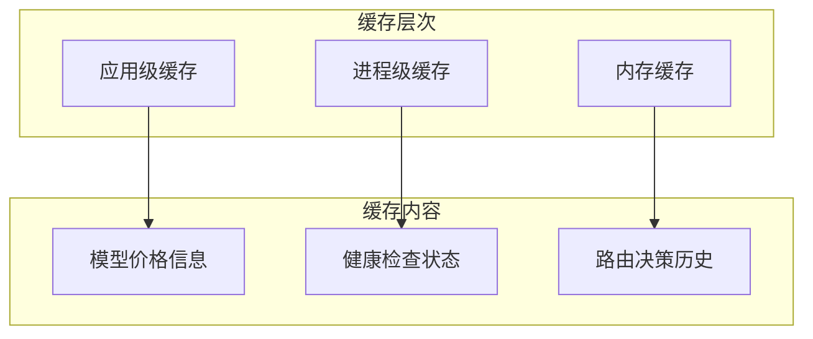

### 动态更新机制

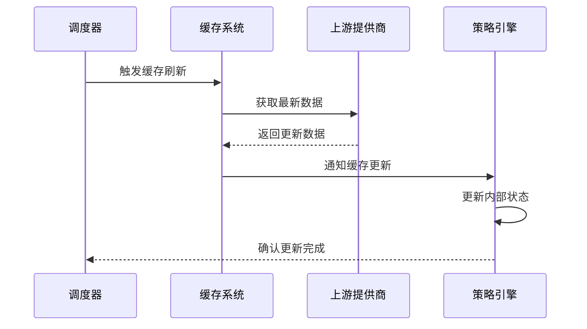

### 缓存配置

| 缓存类型 | 过期时间 | 缓存大小 | 适用场景 |
|----------|----------|----------|----------|
| 模型价格 | 5分钟 | 1000项 | 成本评分 |
| 健康状态 | 1分钟 | 100项 | 可用性评分 |
| 路由历史 | 1小时 | 10000项 | 性能优化 |

**章节来源**
- [config.ts:1-46](file://src/config.ts#L1-L46)

## 性能考量

### 时间复杂度分析

1. **评分算法复杂度**
   - 基础版本：O(n) - n 为可用模型数量
   - 优化版本：O(n log n) - 主要来自排序操作

2. **内存使用**
   - 每个请求：RouteCandidate 数组占用 ~100 bytes × 模型数量
   - 缓存：根据配置限制，通常 < 1MB

### 优化建议

1. **异步处理**
   - 并行获取模型价格
   - 异步健康检查
   - 流式响应处理

2. **资源管理**
   - 连接池复用
   - 超时控制
   - 错误重试机制

3. **监控指标**
   - 评分耗时分布
   - 缓存命中率
   - 错误率统计

## 故障排除指南

### 常见问题及解决方案

| 问题类型 | 症状 | 可能原因 | 解决方案 |
|----------|------|----------|----------|
| 无候选模型 | selectBest 抛出错误 | 所有模型都不可用 | 检查上游提供商状态 |
| 评分异常 | 评分结果不合理 | 评分权重配置错误 | 验证评分算法实现 |
| 性能问题 | 响应时间过长 | 缓存未生效 | 检查缓存配置和实现 |
| 内存泄漏 | 内存持续增长 | 未清理临时数据 | 检查资源释放逻辑 |

### 调试工具

1. **日志记录**
```typescript
// 启用详细日志
const logger = createLogger({ level: 'debug' });
```

2. **性能监控**
```typescript
// 性能指标收集
const metrics = {
  scoreTime: 0,
  selectTime: 0,
  cacheHits: 0,
  cacheMisses: 0
};
```

3. **错误追踪**
```typescript
// 错误分类和统计
const errorStats = {
  networkErrors: 0,
  timeoutErrors: 0,
  validationErrors: 0
};
```

**章节来源**
- [router.test.ts:23-53](file://test/router/router.test.ts#L23-L53)

## 结论

x402 Gateway 的策略模式为灵活的路由决策提供了强大的架构基础。通过 IPolicyEngine 接口，系统能够轻松实现手动选择和自动路由两种模式，并为未来的策略扩展预留了充足的空间。

关键优势包括：
- **模块化设计**：清晰的接口分离和职责划分
- **可扩展性**：支持多种策略的并行存在和动态切换
- **可靠性**：完善的回退机制确保服务可用性
- **可观测性**：完整的决策记录便于审计和调试

随着系统的演进，建议重点关注：
1. 完善自动路由策略的评分算法
2. 优化缓存机制和性能表现
3. 增强监控和告警能力
4. 扩展策略的配置化支持

这个策略模式为 x402 Gateway 提供了一个坚实的技术基础，能够支持未来更多的路由需求和业务场景。