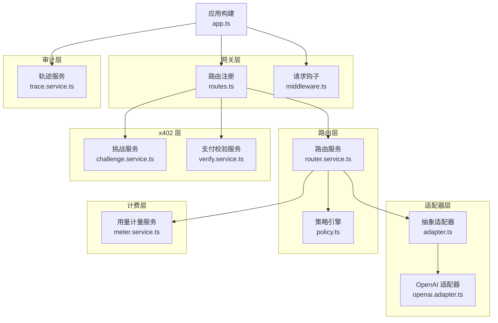
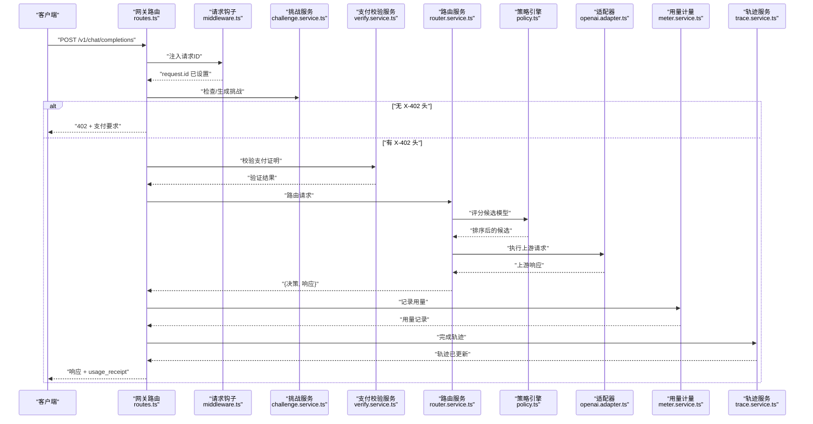
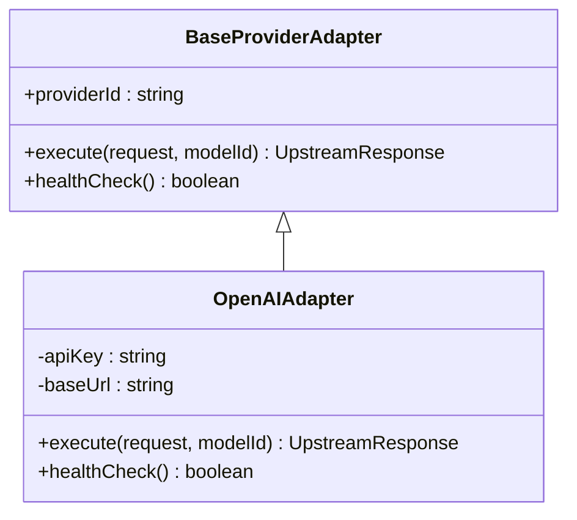
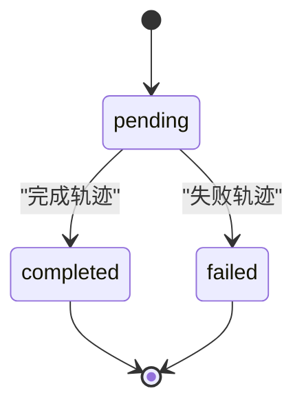
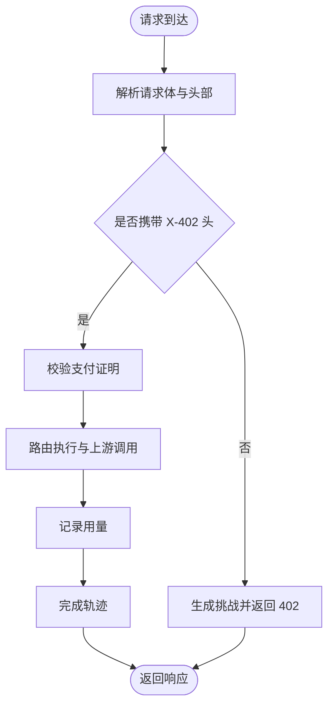
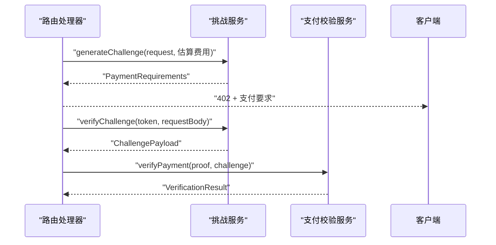
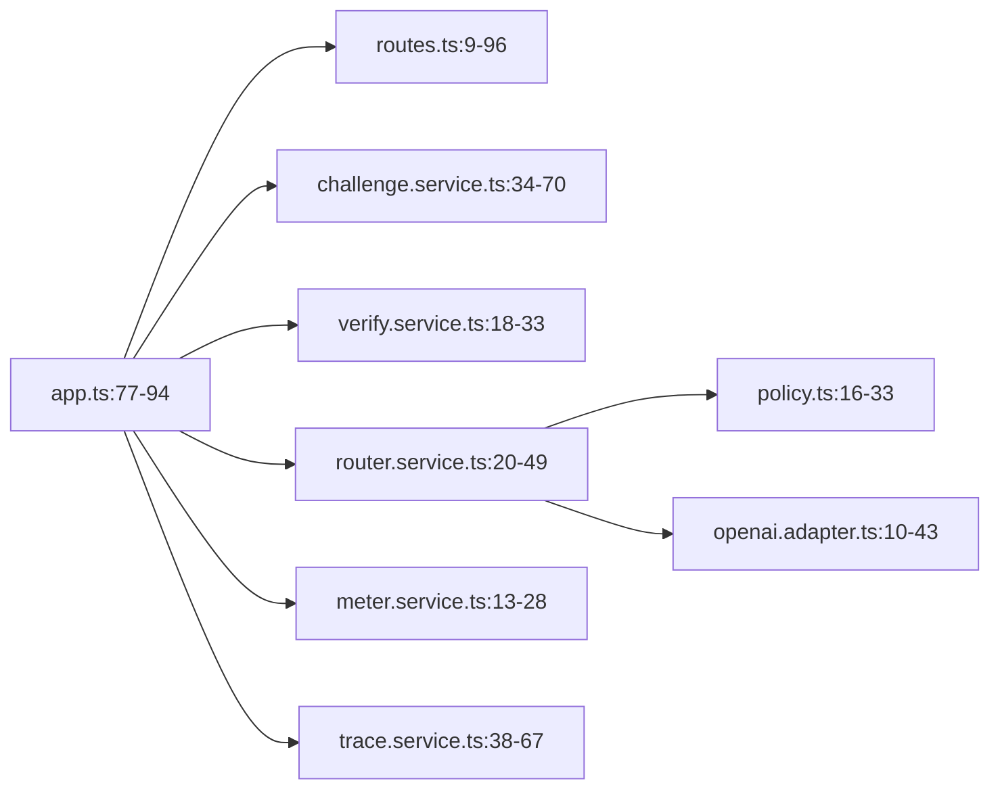

# 组件交互模式

<cite>
**本文引用的文件**
- [src/app.ts](file://src/app.ts)
- [src/server.ts](file://src/server.ts)
- [src/gateway/index.ts](file://src/gateway/index.ts)
- [src/gateway/routes.ts](file://src/gateway/routes.ts)
- [src/gateway/middleware.ts](file://src/gateway/middleware.ts)
- [src/provider/index.ts](file://src/provider/index.ts)
- [src/provider/adapter.ts](file://src/provider/adapter.ts)
- [src/provider/openai.adapter.ts](file://src/provider/openai.adapter.ts)
- [src/router/index.ts](file://src/router/index.ts)
- [src/router/router.service.ts](file://src/router/router.service.ts)
- [src/router/policy.ts](file://src/router/policy.ts)
- [src/x402/challenge.service.ts](file://src/x402/challenge.service.ts)
- [src/x402/verify.service.ts](file://src/x402/verify.service.ts)
- [src/billing/meter.service.ts](file://src/billing/meter.service.ts)
- [src/audit/trace.service.ts](file://src/audit/trace.service.ts)
</cite>

## 目录
1. [简介](#简介)
2. [项目结构](#项目结构)
3. [核心组件](#核心组件)
4. [架构总览](#架构总览)
5. [详细组件分析](#详细组件分析)
6. [依赖关系分析](#依赖关系分析)
7. [性能考量](#性能考量)
8. [故障排查指南](#故障排查指南)
9. [结论](#结论)
10. [附录](#附录)

## 简介
本文件面向 x402 Gateway 的组件交互模式，系统性阐述组件间通信协议、接口契约与协作方式，重点覆盖以下设计模式与运行机制：
- 适配器模式：通过统一的上游适配器接口对接多家模型供应商（如 OpenAI 兼容端点）。
- 策略模式：路由策略引擎对可用模型进行评分与选择，支持手动/自动两种路由模式。
- 观察者式审计追踪：请求生命周期内以“开始/完成/失败”三态推进审计轨迹。
- 事件驱动与回调：基于 Fastify 钩子注入请求标识；路由服务在执行链路中回调决策与响应。
- 异步通信：支付校验、计费、账本与审计等模块均采用异步调用与持久化。
- 生命周期与资源清理：应用启动、优雅关闭、错误处理与日志级别配置。

## 项目结构
后端采用分层与功能域划分：
- 网关层：Fastify 路由注册、参数校验、X-402 支付流程入口。
- 适配器层：抽象上游适配器与具体实现（OpenAI 兼容）。
- 路由层：策略引擎 + 回退服务 + 路由编排。
- x402 层：挑战生成/验证、支付证明校验、重放防护占位。
- 计费层：用量计量、成本计算、账本提交占位。
- 审计层：请求轨迹记录与查询。



图表来源
- [src/app.ts:35-100](file://src/app.ts#L35-L100)
- [src/gateway/routes.ts:9-96](file://src/gateway/routes.ts#L9-L96)
- [src/gateway/middleware.ts:9-12](file://src/gateway/middleware.ts#L9-L12)
- [src/provider/adapter.ts:10-15](file://src/provider/adapter.ts#L10-L15)
- [src/provider/openai.adapter.ts:10-43](file://src/provider/openai.adapter.ts#L10-L43)
- [src/router/router.service.ts:5-49](file://src/router/router.service.ts#L5-L49)
- [src/router/policy.ts:3-33](file://src/router/policy.ts#L3-L33)
- [src/x402/challenge.service.ts:4-70](file://src/x402/challenge.service.ts#L4-L70)
- [src/x402/verify.service.ts:3-33](file://src/x402/verify.service.ts#L3-L33)
- [src/billing/meter.service.ts:5-28](file://src/billing/meter.service.ts#L5-L28)
- [src/audit/trace.service.ts:4-67](file://src/audit/trace.service.ts#L4-L67)

章节来源
- [src/app.ts:35-100](file://src/app.ts#L35-L100)
- [src/gateway/index.ts:1-9](file://src/gateway/index.ts#L1-L9)
- [src/gateway/routes.ts:9-96](file://src/gateway/routes.ts#L9-L96)
- [src/gateway/middleware.ts:9-12](file://src/gateway/middleware.ts#L9-L12)
- [src/provider/index.ts:1-6](file://src/provider/index.ts#L1-L6)
- [src/provider/adapter.ts:10-15](file://src/provider/adapter.ts#L10-L15)
- [src/provider/openai.adapter.ts:10-43](file://src/provider/openai.adapter.ts#L10-L43)
- [src/router/index.ts:1-8](file://src/router/index.ts#L1-L8)
- [src/router/router.service.ts:5-49](file://src/router/router.service.ts#L5-L49)
- [src/router/policy.ts:3-33](file://src/router/policy.ts#L3-L33)
- [src/x402/challenge.service.ts:4-70](file://src/x402/challenge.service.ts#L4-L70)
- [src/x402/verify.service.ts:3-33](file://src/x402/verify.service.ts#L3-L33)
- [src/billing/meter.service.ts:5-28](file://src/billing/meter.service.ts#L5-L28)
- [src/audit/trace.service.ts:4-67](file://src/audit/trace.service.ts#L4-L67)

## 核心组件
- 应用容器与服务装配：集中初始化并注入所有服务实例，供路由处理器使用。
- 请求钩子：在 onRequest 阶段注入唯一请求标识，贯穿审计与日志。
- 路由服务：编排手动/自动路由，结合策略引擎与回退链路，产出路由决策与上游响应。
- 上游适配器：抽象统一接口，具体适配器负责与第三方兼容端点通信。
- x402 挑战与支付校验：生成挑战、校验挑战与支付证明，绑定请求体哈希与过期控制。
- 计量与审计：从上游响应提取用量并持久化，同时维护请求轨迹的生命周期状态。

章节来源
- [src/app.ts:21-33](file://src/app.ts#L21-L33)
- [src/app.ts:77-94](file://src/app.ts#L77-L94)
- [src/gateway/middleware.ts:9-12](file://src/gateway/middleware.ts#L9-L12)
- [src/router/router.service.ts:5-18](file://src/router/router.service.ts#L5-L18)
- [src/provider/adapter.ts:10-15](file://src/provider/adapter.ts#L10-L15)
- [src/x402/challenge.service.ts:4-26](file://src/x402/challenge.service.ts#L4-L26)
- [src/x402/verify.service.ts:3-16](file://src/x402/verify.service.ts#L3-L16)
- [src/billing/meter.service.ts:5-11](file://src/billing/meter.service.ts#L5-L11)
- [src/audit/trace.service.ts:4-36](file://src/audit/trace.service.ts#L4-L36)

## 架构总览
下图展示一次典型请求的端到端交互：客户端经网关路由进入，依据是否携带 X-402 头决定挑战或支付校验流程，随后进入路由编排，最终返回带用量收据的响应。



图表来源
- [src/gateway/routes.ts:23-67](file://src/gateway/routes.ts#L23-L67)
- [src/gateway/middleware.ts:9-12](file://src/gateway/middleware.ts#L9-L12)
- [src/x402/challenge.service.ts:12-26](file://src/x402/challenge.service.ts#L12-L26)
- [src/x402/verify.service.ts:15-33](file://src/x402/verify.service.ts#L15-L33)
- [src/router/router.service.ts:14-18](file://src/router/router.service.ts#L14-L18)
- [src/router/policy.ts:8-14](file://src/router/policy.ts#L8-L14)
- [src/provider/openai.adapter.ts:25-43](file://src/provider/openai.adapter.ts#L25-L43)
- [src/billing/meter.service.ts:10-28](file://src/billing/meter.service.ts#L10-L28)
- [src/audit/trace.service.ts:15-36](file://src/audit/trace.service.ts#L15-L36)

## 详细组件分析

### 适配器模式：上游适配器与 OpenAI 兼容适配器
- 抽象基类定义统一接口：execute 与 healthCheck，确保不同上游具备一致行为契约。
- 具体实现负责网络调用与响应归一化，便于路由层与上层业务解耦。
- 设计优势：新增上游仅需实现抽象接口，不侵入路由与网关逻辑。



图表来源
- [src/provider/adapter.ts:10-15](file://src/provider/adapter.ts#L10-L15)
- [src/provider/openai.adapter.ts:10-43](file://src/provider/openai.adapter.ts#L10-L43)

章节来源
- [src/provider/adapter.ts:10-15](file://src/provider/adapter.ts#L10-L15)
- [src/provider/openai.adapter.ts:10-43](file://src/provider/openai.adapter.ts#L10-L43)

### 策略模式：路由策略引擎与路由服务
- 策略引擎负责评分候选模型（成本、能力匹配、可用性），并选择最佳候选。
- 路由服务根据路由模式（手动/自动）组织执行链路，产出路由决策与上游响应。
- 两者配合实现“策略可插拔、执行可组合”的解耦架构。

```mermaid
classDiagram
class IPolicyEngine {
+scoreModels(context) RouteCandidate[]
+selectBest(candidates) RouteCandidate
}
class IRouterService {
+route(request, mode) {decision, response}
}
class PolicyEngine {
+scoreModels(context) RouteCandidate[]
+selectBest(candidates) RouteCandidate
}
class RouterService {
+route(request, mode) {decision, response}
}
IPolicyEngine <|.. PolicyEngine
IRouterService <|.. RouterService
RouterService --> IPolicyEngine : "使用"
```

图表来源
- [src/router/policy.ts:3-33](file://src/router/policy.ts#L3-L33)
- [src/router/router.service.ts:5-49](file://src/router/router.service.ts#L5-L49)

章节来源
- [src/router/policy.ts:3-33](file://src/router/policy.ts#L3-L33)
- [src/router/router.service.ts:5-49](file://src/router/router.service.ts#L5-L49)

### 观察者式审计追踪：轨迹服务的状态机
- 初始状态 pending，完成时填充路由、用量、费用与支付信息，失败时记录原因。
- 提供按请求 ID 查询轨迹的能力，支撑审计与排障。



图表来源
- [src/audit/trace.service.ts:15-36](file://src/audit/trace.service.ts#L15-L36)

章节来源
- [src/audit/trace.service.ts:4-67](file://src/audit/trace.service.ts#L4-L67)

### 网关路由与支付流程：事件驱动与回调
- onRequest 钩子注入请求 ID，贯穿后续审计与日志。
- 路由处理器解析请求体与 X-402 头，无头则生成挑战，有头则校验并执行。
- 执行链路中回调路由服务产出的决策与响应，并进行用量记录与轨迹完成。



图表来源
- [src/gateway/middleware.ts:9-12](file://src/gateway/middleware.ts#L9-L12)
- [src/gateway/routes.ts:23-67](file://src/gateway/routes.ts#L23-L67)
- [src/billing/meter.service.ts:10-28](file://src/billing/meter.service.ts#L10-L28)
- [src/audit/trace.service.ts:15-36](file://src/audit/trace.service.ts#L15-L36)

章节来源
- [src/gateway/routes.ts:9-96](file://src/gateway/routes.ts#L9-L96)
- [src/gateway/middleware.ts:9-12](file://src/gateway/middleware.ts#L9-L12)

### x402 挑战与支付校验：接口契约与数据绑定
- 挑战服务：生成挑战（含报价、请求哈希、签名、过期时间），并校验挑战令牌与请求哈希一致性。
- 支付校验服务：基于链上交易证明核验金额、资产与收款人等条件。



图表来源
- [src/x402/challenge.service.ts:12-26](file://src/x402/challenge.service.ts#L12-L26)
- [src/x402/verify.service.ts:15-33](file://src/x402/verify.service.ts#L15-L33)

章节来源
- [src/x402/challenge.service.ts:4-70](file://src/x402/challenge.service.ts#L4-L70)
- [src/x402/verify.service.ts:3-33](file://src/x402/verify.service.ts#L3-L33)

### 计费与账本：用量计量与轨迹联动
- 用量计量服务从上游响应抽取 token 数并持久化。
- 轨迹服务在完成阶段写入用量、费用与支付信息，形成闭环审计。

章节来源
- [src/billing/meter.service.ts:5-28](file://src/billing/meter.service.ts#L5-L28)
- [src/audit/trace.service.ts:15-36](file://src/audit/trace.service.ts#L15-L36)

## 依赖关系分析
- 应用层通过 ServiceContainer 将各服务实例注入路由处理器，避免全局状态与循环依赖。
- 路由服务依赖策略引擎与适配器注册表，形成“策略 + 执行”的解耦。
- 网关层仅承担薄薄的参数解析与流程编排职责，核心逻辑下沉至各领域服务。



图表来源
- [src/app.ts:77-94](file://src/app.ts#L77-L94)
- [src/gateway/routes.ts:9-96](file://src/gateway/routes.ts#L9-L96)
- [src/x402/challenge.service.ts:34-70](file://src/x402/challenge.service.ts#L34-L70)
- [src/x402/verify.service.ts:18-33](file://src/x402/verify.service.ts#L18-L33)
- [src/router/router.service.ts:20-49](file://src/router/router.service.ts#L20-L49)
- [src/router/policy.ts:16-33](file://src/router/policy.ts#L16-L33)
- [src/provider/openai.adapter.ts:10-43](file://src/provider/openai.adapter.ts#L10-L43)
- [src/billing/meter.service.ts:13-28](file://src/billing/meter.service.ts#L13-L28)
- [src/audit/trace.service.ts:38-67](file://src/audit/trace.service.ts#L38-L67)

章节来源
- [src/app.ts:77-94](file://src/app.ts#L77-L94)
- [src/gateway/routes.ts:9-96](file://src/gateway/routes.ts#L9-L96)

## 性能考量
- 异步与并发：路由与适配器调用均为异步，建议在路由层引入超时与重试策略，避免阻塞。
- 缓存与降级：策略引擎可缓存近期评分结果；健康检查失败时启用回退链路。
- 日志与监控：利用请求 ID 进行全链路追踪，结合轨迹服务统计延迟与成功率。
- 数据库与外部依赖：连接池与超时配置应在应用启动阶段集中初始化，避免重复创建。

## 故障排查指南
- 错误处理：应用层统一拦截业务错误与参数校验错误，返回标准化响应；未知错误记录日志并返回通用内部错误。
- 优雅关闭：监听 SIGTERM/SIGINT，先停止接受新请求，再关闭服务与外部连接，确保资源释放。
- 审计定位：通过轨迹服务按请求 ID 查询状态与失败原因，辅助快速定位问题根因。

章节来源
- [src/app.ts:53-70](file://src/app.ts#L53-L70)
- [src/server.ts:17-25](file://src/server.ts#L17-L25)
- [src/audit/trace.service.ts:31-36](file://src/audit/trace.service.ts#L31-L36)

## 结论
该系统通过清晰的分层与模式化设计，实现了支付驱动的请求编排、可扩展的上游适配、可插拔的路由策略以及可观测的审计轨迹。当前多数服务仍处于占位实现，建议优先落地支付流程与路由编排，随后完善策略评分与回退链路，最终补齐数据库与外部依赖的连接管理与资源清理。

## 附录
- 启动与关闭流程：应用加载配置后构建服务容器并注册路由，监听端口；收到信号后优雅关闭。
- 未来扩展点：Redis 与数据库连接初始化、重放保护、账本提交与收据查询。

章节来源
- [src/server.ts:4-26](file://src/server.ts#L4-L26)
- [src/app.ts:77-94](file://src/app.ts#L77-L94)