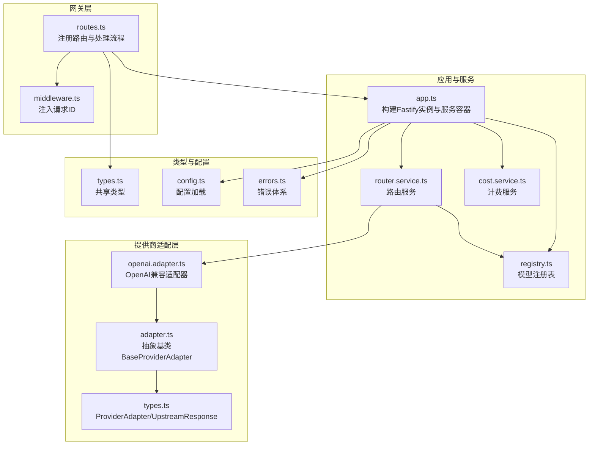
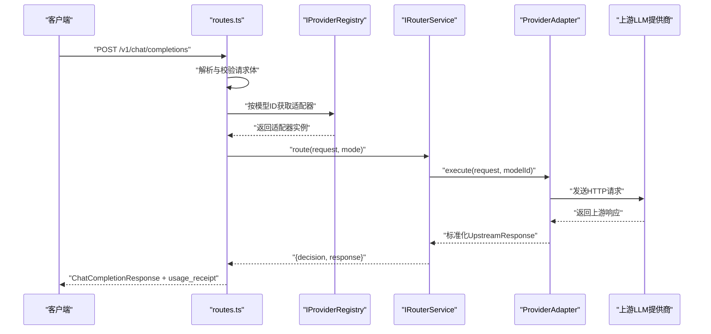
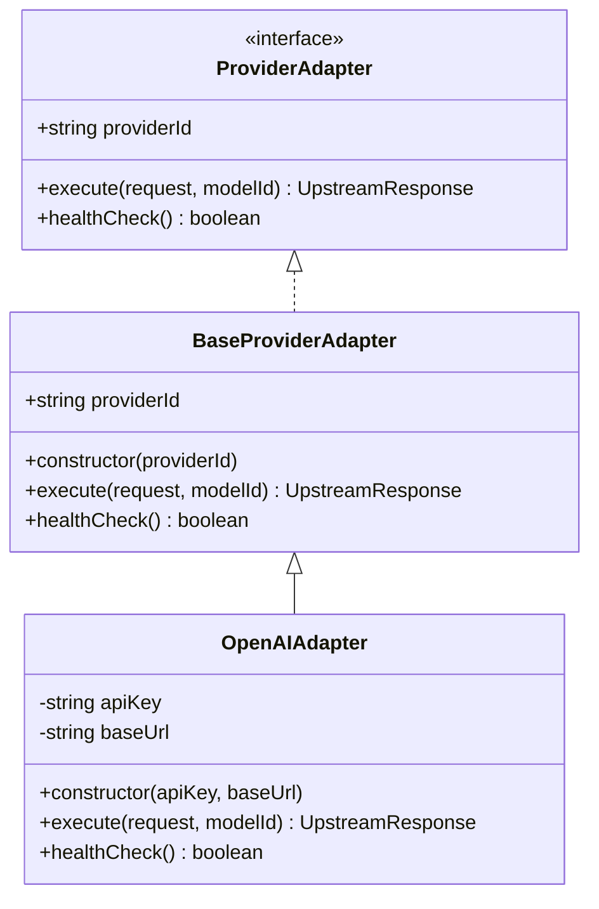
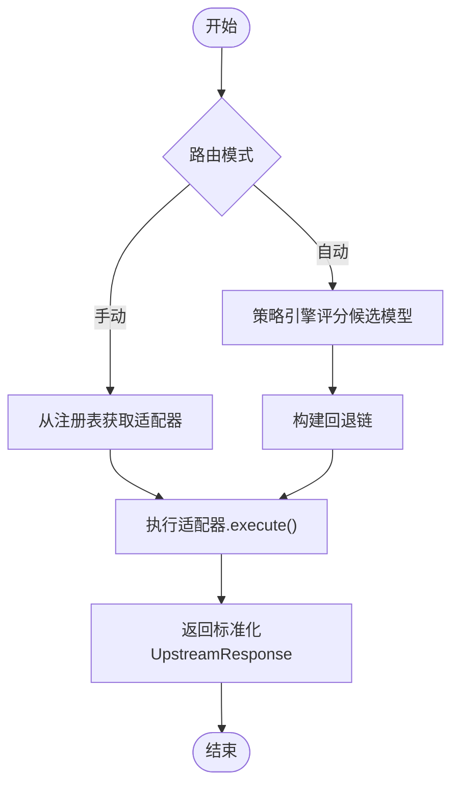
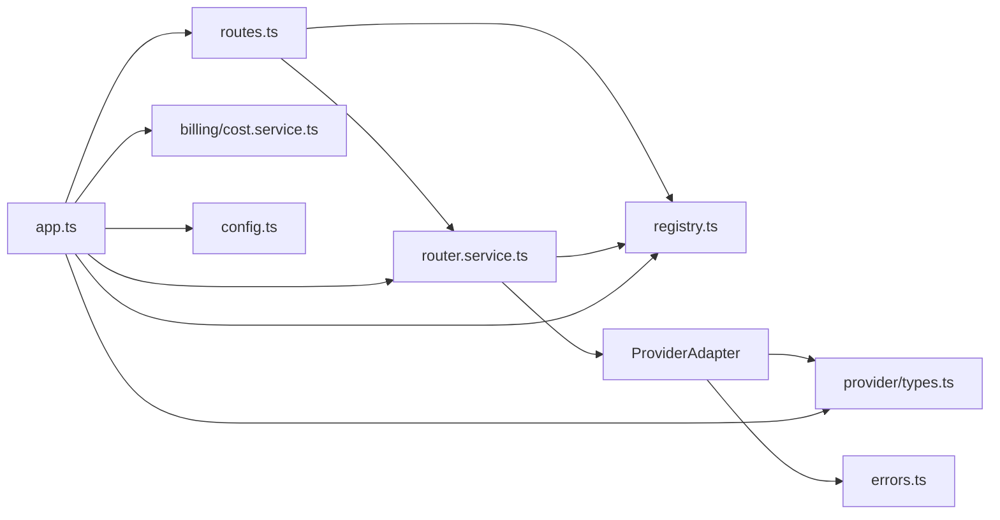

# 适配器模式

<cite>
**本文引用的文件**
- [src/provider/adapter.ts](file://src/provider/adapter.ts)
- [src/provider/openai.adapter.ts](file://src/provider/openai.adapter.ts)
- [src/provider/types.ts](file://src/provider/types.ts)
- [src/provider/registry.ts](file://src/provider/registry.ts)
- [src/gateway/routes.ts](file://src/gateway/routes.ts)
- [src/app.ts](file://src/app.ts)
- [src/router/router.service.ts](file://src/router/router.service.ts)
- [src/billing/cost.service.ts](file://src/billing/cost.service.ts)
- [src/types.ts](file://src/types.ts)
- [src/config.ts](file://src/config.ts)
- [src/errors.ts](file://src/errors.ts)
- [src/gateway/middleware.ts](file://src/gateway/middleware.ts)
- [src/router/types.ts](file://src/router/types.ts)
- [src/billing/types.ts](file://src/billing/types.ts)
- [src/x402/types.ts](file://src/x402/types.ts)
- [test/helpers.ts](file://test/helpers.ts)
</cite>

## 目录
1. [引言](#引言)
2. [项目结构](#项目结构)
3. [核心组件](#核心组件)
4. [架构总览](#架构总览)
5. [详细组件分析](#详细组件分析)
6. [依赖关系分析](#依赖关系分析)
7. [性能考量](#性能考量)
8. [故障排查指南](#故障排查指南)
9. [结论](#结论)
10. [附录](#附录)

## 引言
本文件系统性阐述 x402 Gateway 中的“适配器模式”，重点围绕 IProviderAdapter 接口设计与实现规范，解释如何通过适配器统一不同上游提供商（如 OpenAI、Anthropic 等）的接口差异；文档化 OpenAI 适配器的请求转换、响应处理与错误映射；给出新增提供商适配器的开发指南（接口契约、配置项、测试策略）；并说明适配器注册机制与路由层的动态选择策略。

## 项目结构
- 提供商适配层位于 provider 子模块，包含抽象基类、类型定义、具体适配器与注册表。
- 网关路由位于 gateway 子模块，负责解析请求、校验支付头、调用服务层并返回标准化响应。
- 路由与计费等服务位于 router、billing 等子模块，负责模型选择、成本计算与账务记录。
- 应用入口在 app.ts，装配服务容器并通过 Fastify 注册路由。
- 类型定义集中在 types.ts，涵盖聊天补全、模型目录、审计与账单等数据结构。
- 配置与错误处理分别在 config.ts 与 errors.ts，前者定义环境变量与默认值，后者定义统一错误体系与响应映射。

图表来源
- [src/gateway/routes.ts:1-96](file://src/gateway/routes.ts#L1-L96)
- [src/app.ts:35-101](file://src/app.ts#L35-L101)
- [src/provider/registry.ts:27-65](file://src/provider/registry.ts#L27-L65)
- [src/router/router.service.ts:20-50](file://src/router/router.service.ts#L20-L50)
- [src/billing/cost.service.ts:16-32](file://src/billing/cost.service.ts#L16-L32)
- [src/provider/adapter.ts:10-16](file://src/provider/adapter.ts#L10-L16)
- [src/provider/openai.adapter.ts:10-44](file://src/provider/openai.adapter.ts#L10-L44)
- [src/provider/types.ts:26-36](file://src/provider/types.ts#L26-L36)
- [src/types.ts:17-84](file://src/types.ts#L17-L84)
- [src/config.ts:28-46](file://src/config.ts#L28-L46)
- [src/errors.ts:6-106](file://src/errors.ts#L6-L106)

章节来源
- [src/gateway/routes.ts:1-96](file://src/gateway/routes.ts#L1-L96)
- [src/app.ts:35-101](file://src/app.ts#L35-L101)
- [src/provider/registry.ts:27-65](file://src/provider/registry.ts#L27-L65)
- [src/router/router.service.ts:20-50](file://src/router/router.service.ts#L20-L50)
- [src/billing/cost.service.ts:16-32](file://src/billing/cost.service.ts#L16-L32)
- [src/provider/adapter.ts:10-16](file://src/provider/adapter.ts#L10-L16)
- [src/provider/openai.adapter.ts:10-44](file://src/provider/openai.adapter.ts#L10-L44)
- [src/provider/types.ts:26-36](file://src/provider/types.ts#L26-L36)
- [src/types.ts:17-84](file://src/types.ts#L17-L84)
- [src/config.ts:28-46](file://src/config.ts#L28-L46)
- [src/errors.ts:6-106](file://src/errors.ts#L6-L106)

## 核心组件
- IProviderAdapter 抽象接口：定义 providerId、execute 与 healthCheck 三个核心契约，确保所有上游适配器具备一致的执行与健康检查能力。
- BaseProviderAdapter 抽象基类：封装 providerId 并声明抽象方法，便于具体适配器复用通用逻辑。
- UpstreamResponse 规范：统一上游响应结构，包含使用的模型、候选输出、用量统计与延迟毫秒数，便于路由与计费层消费。
- ProviderError 规范：统一上游错误结构，包含提供商标识、状态码与消息，便于错误映射与上报。
- IProviderRegistry 注册表：以模型ID为键，存储模型信息、适配器实例与定价，提供查询与列表能力。
- OpenAI 兼容适配器：示例实现，展示如何构造请求、调用上游、解析响应与进行错误映射（当前为占位实现，留待完善）。

章节来源
- [src/provider/types.ts:3-36](file://src/provider/types.ts#L3-L36)
- [src/provider/adapter.ts:10-16](file://src/provider/adapter.ts#L10-L16)
- [src/provider/registry.ts:4-65](file://src/provider/registry.ts#L4-L65)
- [src/provider/openai.adapter.ts:10-44](file://src/provider/openai.adapter.ts#L10-L44)

## 架构总览
适配器模式在 x402 Gateway 中的作用是“屏蔽上游差异，暴露统一接口”。路由层仅依赖 ProviderAdapter 接口，不关心具体提供商细节；注册表负责将模型与适配器绑定；路由服务根据路由模式（手动/自动）选择适配器并执行；计费服务基于用量与定价计算成本；最终通过统一的响应结构返回给客户端。

图表来源
- [src/gateway/routes.ts:23-67](file://src/gateway/routes.ts#L23-L67)
- [src/provider/registry.ts:44-50](file://src/provider/registry.ts#L44-L50)
- [src/router/router.service.ts:14-18](file://src/router/router.service.ts#L14-L18)
- [src/provider/types.ts:3-17](file://src/provider/types.ts#L3-L17)
- [src/types.ts:54-62](file://src/types.ts#L54-L62)

## 详细组件分析

### IProviderAdapter 接口与 BaseProviderAdapter 基类
- 设计原则
  - 统一性：所有适配器必须实现 providerId、execute 与 healthCheck。
  - 可扩展性：通过抽象基类减少重复代码，具体适配器只需关注协议差异。
  - 易替换：路由层只依赖接口，更换或新增适配器无需修改上层逻辑。
- 实现要点
  - execute 必须将输入请求转换为上游期望格式，并将上游响应规范化为 UpstreamResponse。
  - healthCheck 应实现轻量可达性探测，避免影响主请求延迟。
  - 错误映射：网络超时/不可达应映射到 UpstreamTimeoutError/UpstreamUnavailableError，以便上层统一处理。

图表来源
- [src/provider/types.ts:26-36](file://src/provider/types.ts#L26-L36)
- [src/provider/adapter.ts:10-16](file://src/provider/adapter.ts#L10-L16)
- [src/provider/openai.adapter.ts:10-44](file://src/provider/openai.adapter.ts#L10-L44)

章节来源
- [src/provider/types.ts:26-36](file://src/provider/types.ts#L26-L36)
- [src/provider/adapter.ts:10-16](file://src/provider/adapter.ts#L10-L16)
- [src/provider/openai.adapter.ts:10-44](file://src/provider/openai.adapter.ts#L10-L44)

### OpenAI 适配器实现要点
- 请求转换
  - 将 ChatCompletionRequest 转换为上游期望的请求体（模型名、消息数组、温度等）。
  - 使用配置的 baseUrl 与 apiKey 发起请求。
- 响应处理
  - 解析上游响应，提取 choices 与 usage，并填充 latency_ms。
  - 返回标准化 UpstreamResponse。
- 错误映射
  - 网络/超时错误映射为 UpstreamTimeoutError。
  - 连接失败/不可达映射为 UpstreamUnavailableError。
- 当前状态
  - 占位实现，尚未完成 HTTP 调用与错误映射，需在后续迭代中补齐。

章节来源
- [src/provider/openai.adapter.ts:25-42](file://src/provider/openai.adapter.ts#L25-L42)
- [src/errors.ts:67-81](file://src/errors.ts#L67-L81)

### 适配器注册机制与动态切换
- 注册表职责
  - register：以模型ID为键，保存模型元信息（含 provider）、适配器实例与定价。
  - getAdapter：按模型ID返回适配器，未找到时抛出异常。
  - listModels/getModelPricing：提供模型清单与定价查询，供路由与审计使用。
- 动态切换策略
  - 手动模式：直接从注册表取指定模型的适配器执行。
  - 自动模式：结合策略引擎评分与回退链，动态选择最佳适配器并执行。
- 与路由层协作
  - 路由服务在 route 中根据模式调用适配器 execute，并生成路由证明。

图表来源
- [src/provider/registry.ts:30-50](file://src/provider/registry.ts#L30-L50)
- [src/router/router.service.ts:27-47](file://src/router/router.service.ts#L27-L47)

章节来源
- [src/provider/registry.ts:27-65](file://src/provider/registry.ts#L27-L65)
- [src/router/router.service.ts:14-49](file://src/router/router.service.ts#L14-L49)

### 支付与审计流程中的适配器集成
- 路由层在支付流程中扮演关键角色：当请求携带 X-402 头部时，路由服务负责选择适配器并执行；否则返回 402 并附带支付要求。
- 审计与账单：路由决策与实际执行结果用于生成路由证明；用量与成本由计费服务计算并写入账本。

章节来源
- [src/gateway/routes.ts:23-67](file://src/gateway/routes.ts#L23-L67)
- [src/router/types.ts:1-22](file://src/router/types.ts#L1-L22)
- [src/billing/types.ts:3-32](file://src/billing/types.ts#L3-L32)

## 依赖关系分析
- 组件耦合
  - 路由层仅依赖 ProviderAdapter 接口与注册表，耦合度低，便于扩展新提供商。
  - 计费层依赖用量与定价，与适配器解耦，仅消费标准化的 usage 字段。
- 外部依赖
  - 配置层提供 OPENAI_API_KEY 等敏感参数，适配器在初始化时读取。
  - 错误层提供统一错误码与响应结构，便于上层统一处理。
- 潜在循环
  - 当前结构无明显循环依赖；若未来引入更复杂的策略引擎，需注意避免双向依赖。

图表来源
- [src/gateway/routes.ts:1-96](file://src/gateway/routes.ts#L1-L96)
- [src/app.ts:77-98](file://src/app.ts#L77-L98)
- [src/provider/registry.ts:27-65](file://src/provider/registry.ts#L27-L65)
- [src/router/router.service.ts:20-50](file://src/router/router.service.ts#L20-L50)
- [src/billing/cost.service.ts:16-32](file://src/billing/cost.service.ts#L16-L32)
- [src/provider/types.ts:26-36](file://src/provider/types.ts#L26-L36)
- [src/errors.ts:6-106](file://src/errors.ts#L6-L106)
- [src/config.ts:28-46](file://src/config.ts#L28-L46)
- [src/types.ts:17-84](file://src/types.ts#L17-L84)

章节来源
- [src/gateway/routes.ts:1-96](file://src/gateway/routes.ts#L1-L96)
- [src/app.ts:77-98](file://src/app.ts#L77-L98)
- [src/provider/registry.ts:27-65](file://src/provider/registry.ts#L27-L65)
- [src/router/router.service.ts:20-50](file://src/router/router.service.ts#L20-L50)
- [src/billing/cost.service.ts:16-32](file://src/billing/cost.service.ts#L16-L32)
- [src/provider/types.ts:26-36](file://src/provider/types.ts#L26-L36)
- [src/errors.ts:6-106](file://src/errors.ts#L6-L106)
- [src/config.ts:28-46](file://src/config.ts#L28-L46)
- [src/types.ts:17-84](file://src/types.ts#L17-L84)

## 性能考量
- 健康检查
  - 健康检查应采用轻量请求（如列举模型），避免阻塞主请求路径。
- 超时与重试
  - 上游调用应设置合理超时；对可重试的网络错误进行指数退避重试。
- 缓存与预热
  - 对常用模型的健康状态与基础信息进行缓存，降低注册表查询开销。
- 延迟观测
  - 在 UpstreamResponse 中记录 latency_ms，便于路由策略优化与监控告警。

## 故障排查指南
- 常见错误与映射
  - UpstreamTimeoutError：上游超时，检查网络连通性与上游配额。
  - UpstreamUnavailableError：上游不可用，检查健康检查与服务可用性。
  - PaymentRequiredError：首次请求缺少支付头，确认客户端正确生成挑战并返回支付头。
  - PaymentVerificationFailedError：链上验证失败，核对签名与金额。
  - InsufficientPaymentError：支付金额不足，核对报价与资产精度。
- 日志与追踪
  - 使用 onRequest 钩子注入唯一请求ID，便于端到端追踪。
- 测试辅助
  - 使用测试工具函数构建带服务容器的 Fastify 实例，便于隔离测试与桩替。

章节来源
- [src/errors.ts:17-81](file://src/errors.ts#L17-L81)
- [src/gateway/middleware.ts:9-12](file://src/gateway/middleware.ts#L9-L12)
- [test/helpers.ts:19-44](file://test/helpers.ts#L19-L44)

## 结论
通过适配器模式，x402 Gateway 将“路由与支付”与“上游提供商差异”有效解耦。IProviderAdapter 抽象了执行与健康检查，OpenAI 适配器展示了请求转换与错误映射的实践方向；注册表与路由服务共同实现了模型的动态选择与回退。建议在后续迭代中完善 OpenAI 适配器的 HTTP 调用与错误映射，并扩展更多提供商适配器，持续提升系统的可扩展性与稳定性。

## 附录

### 新提供商适配器开发指南
- 接口契约
  - 实现 ProviderAdapter 接口，提供 providerId、execute 与 healthCheck。
  - execute 输入为 ChatCompletionRequest，输出为标准化 UpstreamResponse。
- 配置选项
  - 通过配置加载器读取提供商密钥与基础地址等参数。
  - 在适配器构造函数中注入必要配置。
- 请求转换与响应处理
  - 将输入消息序列转换为上游期望的消息结构。
  - 解析上游响应，提取 choices 与 usage，并填充 latency_ms。
- 错误映射
  - 将网络/超时错误映射为 UpstreamTimeoutError。
  - 将连接失败映射为 UpstreamUnavailableError。
- 注册与测试
  - 在启动时通过注册表将模型ID与适配器绑定。
  - 使用测试工具函数构建最小化服务容器进行集成测试。

章节来源
- [src/provider/types.ts:26-36](file://src/provider/types.ts#L26-L36)
- [src/config.ts:28-46](file://src/config.ts#L28-L46)
- [src/provider/openai.adapter.ts:14-18](file://src/provider/openai.adapter.ts#L14-L18)
- [src/errors.ts:67-81](file://src/errors.ts#L67-L81)
- [test/helpers.ts:19-44](file://test/helpers.ts#L19-L44)