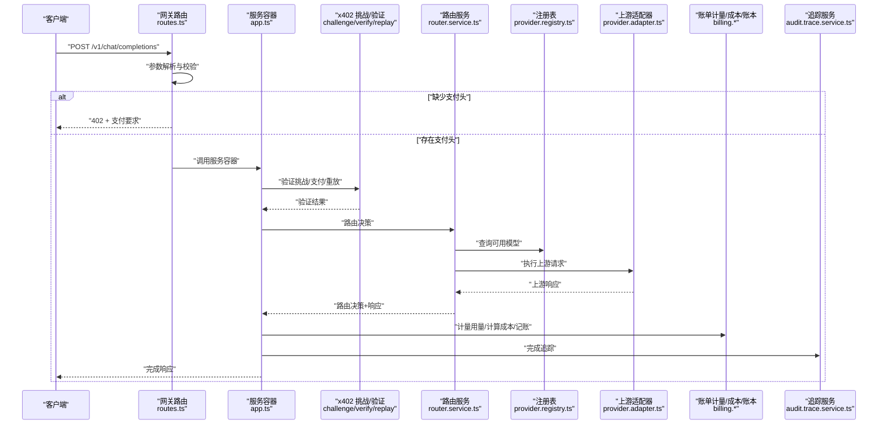
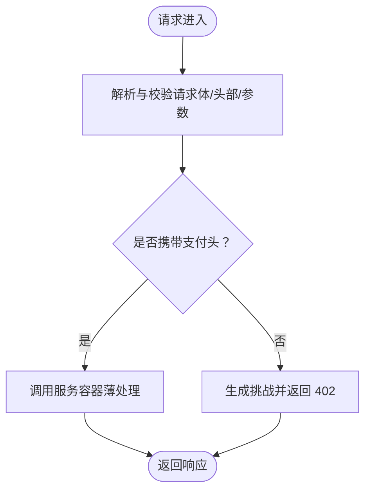
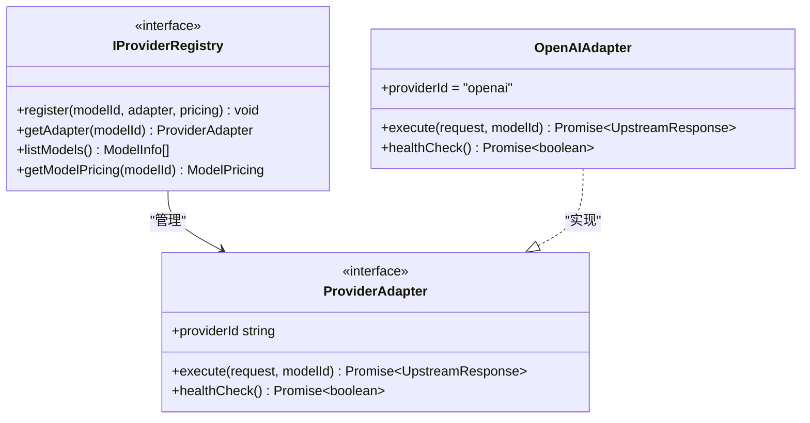
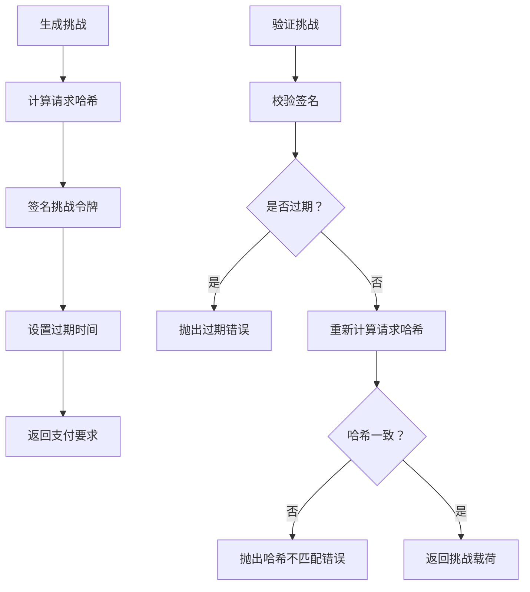
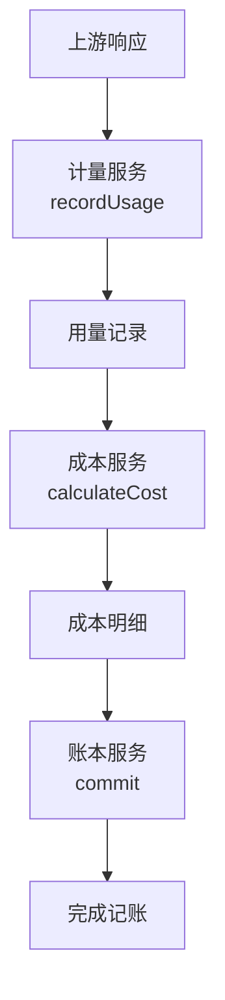
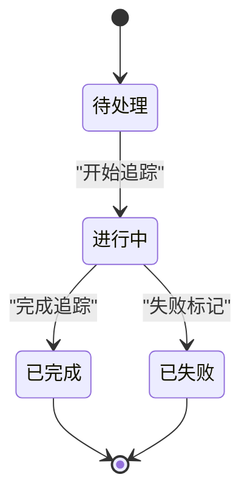
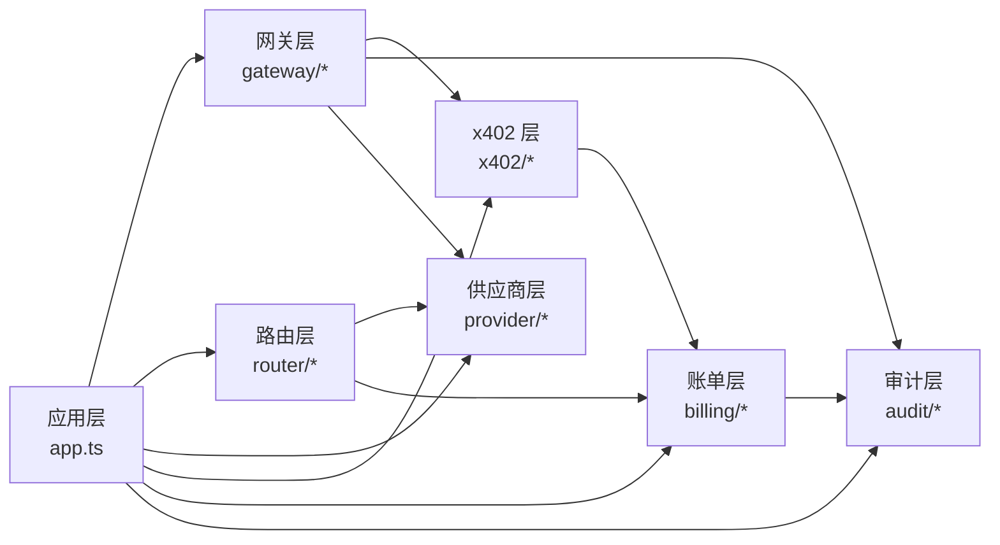

# 核心模块

<cite>
**本文引用的文件**
- [src/app.ts](file://src/app.ts)
- [src/config.ts](file://src/config.ts)
- [src/gateway/index.ts](file://src/gateway/index.ts)
- [src/gateway/middleware.ts](file://src/gateway/middleware.ts)
- [src/gateway/routes.ts](file://src/gateway/routes.ts)
- [src/gateway/schemas.ts](file://src/gateway/schemas.ts)
- [src/provider/index.ts](file://src/provider/index.ts)
- [src/provider/adapter.ts](file://src/provider/adapter.ts)
- [src/provider/openai.adapter.ts](file://src/provider/openai.adapter.ts)
- [src/provider/registry.ts](file://src/provider/registry.ts)
- [src/provider/types.ts](file://src/provider/types.ts)
- [src/router/index.ts](file://src/router/index.ts)
- [src/router/policy.ts](file://src/router/policy.ts)
- [src/router/fallback.service.ts](file://src/router/fallback.service.ts)
- [src/router/router.service.ts](file://src/router/router.service.ts)
- [src/router/types.ts](file://src/router/types.ts)
- [src/x402/index.ts](file://src/x402/index.ts)
- [src/x402/challenge.service.ts](file://src/x402/challenge.service.ts)
- [src/x402/replay.service.ts](file://src/x402/replay.service.ts)
- [src/x402/verify.service.ts](file://src/x402/verify.service.ts)
- [src/x402/types.ts](file://src/x402/types.ts)
- [src/billing/index.ts](file://src/billing/index.ts)
- [src/billing/meter.service.ts](file://src/billing/meter.service.ts)
- [src/billing/cost.service.ts](file://src/billing/cost.service.ts)
- [src/billing/ledger.service.ts](file://src/billing/ledger.service.ts)
- [src/billing/types.ts](file://src/billing/types.ts)
- [src/audit/index.ts](file://src/audit/index.ts)
- [src/audit/trace.service.ts](file://src/audit/trace.service.ts)
- [src/audit/receipt.service.ts](file://src/audit/receipt.service.ts)
- [src/audit/types.ts](file://src/audit/types.ts)
- [src/types.ts](file://src/types.ts)
</cite>

## 目录
1. [简介](#简介)
2. [项目结构](#项目结构)
3. [核心组件](#核心组件)
4. [架构总览](#架构总览)
5. [详细组件分析](#详细组件分析)
6. [依赖分析](#依赖分析)
7. [性能考虑](#性能考虑)
8. [故障排查指南](#故障排查指南)
9. [结论](#结论)
10. [附录](#附录)

## 简介
本文件面向 x402 Gateway 的六大核心模块，系统性梳理其职责边界、接口设计与实现要点，阐明模块间依赖关系、数据传递与协作模式，并给出初始化流程、配置项、扩展点、最佳实践、常见问题与测试策略。目标是帮助开发者快速理解并正确集成与扩展各模块。

## 项目结构
项目采用按功能域划分的目录组织方式，六大模块分别位于独立子目录中，入口通过各模块的 index 文件统一导出公共 API；应用启动时在应用层装配服务容器并注册路由。

```mermaid
graph TB
subgraph "应用层"
APP["应用构建器<br/>src/app.ts"]
CFG["配置加载<br/>src/config.ts"]
end
subgraph "网关层"
GW_IDX["导出入口<br/>src/gateway/index.ts"]
MW["请求追踪中间件<br/>src/gateway/middleware.ts"]
ROUTES["路由注册与薄处理<br/>src/gateway/routes.ts"]
SCHEMAS["请求/响应校验模式<br/>src/gateway/schemas.ts"]
end
subgraph "路由层"
R_IDX["导出入口<br/>src/router/index.ts"]
POL["策略引擎<br/>src/router/policy.ts"]
FB["降级执行器<br/>src/router/fallback.service.ts"]
RSVC["路由服务<br/>src/router/router.service.ts"]
RTYPES["类型定义<br/>src/router/types.ts"]
end
subgraph "供应商适配层"
P_IDX["导出入口<br/>src/provider/index.ts"]
ADAPTER["抽象适配器<br/>src/provider/adapter.ts"]
OPENAI["OpenAI 适配器<br/>src/provider/openai.adapter.ts"]
REG["模型注册表<br/>src/provider/registry.ts"]
PTYPES["类型定义<br/>src/provider/types.ts"]
end
subgraph "x402 支付验证层"
X_IDX["导出入口<br/>src/x402/index.ts"]
CHAL["挑战服务<br/>src/x402/challenge.service.ts"]
REPLAY["重放防护<br/>src/x402/replay.service.ts"]
VERIFY["支付验证<br/>src/x402/verify.service.ts"]
XTYPES["类型定义<br/>src/x402/types.ts"]
end
subgraph "账单与结算层"
B_IDX["导出入口<br/>src/billing/index.ts"]
METER["用量计量<br/>src/billing/meter.service.ts"]
COST["成本计算<br/>src/billing/cost.service.ts"]
LEDGER["账本记账<br/>src/billing/ledger.service.ts"]
BTYPES["类型定义<br/>src/billing/types.ts"]
end
subgraph "审计与回执层"
A_IDX["导出入口<br/>src/audit/index.ts"]
TRACE["追踪服务<br/>src/audit/trace.service.ts"]
RECEIPT["回执服务<br/>src/audit/receipt.service.ts"]
ATYPES["类型定义<br/>src/audit/types.ts"]
end
CFG --> APP
APP --> GW_IDX
APP --> R_IDX
APP --> P_IDX
APP --> X_IDX
APP --> B_IDX
APP --> A_IDX
GW_IDX --> MW
GW_IDX --> ROUTES
GW_IDX --> SCHEMAS
R_IDX --> POL
R_IDX --> FB
R_IDX --> RSVC
R_IDX --> RTYPES
P_IDX --> ADAPTER
P_IDX --> OPENAI
P_IDX --> REG
P_IDX --> PTYPES
X_IDX --> CHAL
X_IDX --> REPLAY
X_IDX --> VERIFY
X_IDX --> XTYPES
B_IDX --> METER
B_IDX --> COST
B_IDX --> LEDGER
B_IDX --> BTYPES
A_IDX --> TRACE
A_IDX --> RECEIPT
A_IDX --> ATYPES
```



图表来源
- [src/app.ts:35-100](file://src/app.ts#L35-L100)
- [src/gateway/index.ts:1-9](file://src/gateway/index.ts#L1-L9)
- [src/router/index.ts:1-8](file://src/router/index.ts#L1-L8)
- [src/provider/index.ts:1-6](file://src/provider/index.ts#L1-L6)
- [src/x402/index.ts:1-13](file://src/x402/index.ts#L1-L13)
- [src/billing/index.ts:1-8](file://src/billing/index.ts#L1-L8)
- [src/audit/index.ts:1-6](file://src/audit/index.ts#L1-L6)

章节来源
- [src/app.ts:35-100](file://src/app.ts#L35-L100)
- [src/config.ts:28-45](file://src/config.ts#L28-L45)

## 核心组件
本节概述六大模块的职责与对外接口，便于快速定位与集成。

- 网关层（Gateway）
  - 职责：注册 OpenAI 兼容路由、注入请求追踪 ID、对入站请求进行参数解析与校验、协调支付挑战与回执查询。
  - 关键接口：registerRoutes、traceIdHook、chatCompletionBodySchema、x402HeadersSchema、auditParamsSchema。
  - 实现要点：路由薄处理，业务逻辑下沉至服务层；使用 Zod 模式进行输入校验；通过服务容器访问下游能力。

- 路由层（Router）
  - 职责：根据请求与策略选择上游模型，支持手动与自动两种路由模式；在自动模式下生成评分与回退链；产出路由决策与执行结果。
  - 关键接口：createRouterService、IPolicyEngine、IFallbackService、IRouterService。
  - 实现要点：路由决策元数据纳入审计；支持回退链生成与执行；返回决策与上游响应。

- 供应商适配层（Provider）
  - 职责：统一上游模型调用抽象，提供注册表管理模型与定价，内置适配器示例（如 OpenAI）。
  - 关键接口：ProviderAdapter、createProviderRegistry、IProviderRegistry。
  - 实现要点：标准化上游响应结构；健康检查；模型目录查询。

- x402 支付验证层（x402）
  - 职责：生成与验证挑战、校验支付证明、防止重放攻击；提供挑战令牌签名与过期控制。
  - 关键接口：createChallengeService、createPaymentVerifyService、createReplayProtectionService。
  - 实现要点：挑战令牌签名与校验；请求哈希绑定；严格错误类型区分。

- 账单与结算层（Billing）
  - 职责：计量 token 使用量、计算成本、写入账本；支撑审计与回执。
  - 关键接口：IMeterService、ICostService、ILedgerService。
  - 实现要点：用量记录持久化；成本拆分与汇总；账本事务性提交。

- 审计与回执层（Audit）
  - 职责：全链路追踪、失败标记、完成归档；提供审计查询与回执生成。
  - 关键接口：ITraceService、IReceiptService。
  - 实现要点：追踪状态机；完成时填充路由、用量、成本、支付等证据；支持按请求 ID 查询。

章节来源
- [src/gateway/index.ts:1-9](file://src/gateway/index.ts#L1-L9)
- [src/router/index.ts:1-8](file://src/router/index.ts#L1-L8)
- [src/provider/index.ts:1-6](file://src/provider/index.ts#L1-L6)
- [src/x402/index.ts:1-13](file://src/x402/index.ts#L1-L13)
- [src/billing/index.ts:1-8](file://src/billing/index.ts#L1-L8)
- [src/audit/index.ts:1-6](file://src/audit/index.ts#L1-L6)

## 架构总览
下图展示从请求进入网关到完成响应的关键流程，以及各模块之间的协作关系。



图表来源
- [src/gateway/routes.ts:9-96](file://src/gateway/routes.ts#L9-L96)
- [src/app.ts:77-94](file://src/app.ts#L77-L94)
- [src/x402/challenge.service.ts:28-71](file://src/x402/challenge.service.ts#L28-L71)
- [src/router/router.service.ts:20-50](file://src/router/router.service.ts#L20-L50)
- [src/provider/registry.ts:27-65](file://src/provider/registry.ts#L27-L65)
- [src/billing/meter.service.ts:13-29](file://src/billing/meter.service.ts#L13-L29)
- [src/audit/trace.service.ts:38-68](file://src/audit/trace.service.ts#L38-L68)

## 详细组件分析

### 网关层（Gateway）
- 职责
  - 注册 OpenAI 兼容聊天补全端点，处理模型列表查询与审计查询。
  - 在请求进入时注入唯一追踪 ID，便于跨模块关联。
  - 对请求体与路径参数进行严格校验，确保后续流程安全可靠。
- 接口与实现
  - 中间件：在 onRequest 钩子中生成并附加请求 ID。
  - 路由：POST /v1/chat/completions 作为主入口；GET /v1/models 返回模型目录；GET /v1/audit/requests/:request_id 提供审计查询占位。
  - 模式：使用 Zod 模式定义请求体、x402 头部与审计参数。
- 初始化与配置
  - 应用启动时注册插件与全局错误处理器，随后实例化服务容器并注册路由。
- 扩展点
  - 可在路由薄处理中接入新的上游模型或业务规则。
  - 可替换或增强追踪中间件以满足可观测性需求。
- 最佳实践
  - 将业务逻辑保持在服务层，路由仅做参数解析与编排。
  - 对外部输入始终使用模式校验，避免未授权字段进入核心流程。
- 常见问题
  - 缺少支付头导致 402 返回：需正确设置 x-402-challenge 与 x-402-payment。
  - 审计查询未实现：当前返回 501，需按回执服务对接。
- 测试策略
  - 单元测试覆盖路由薄处理与模式校验。
  - 集成测试覆盖完整支付流程与错误分支。



图表来源
- [src/gateway/routes.ts:23-67](file://src/gateway/routes.ts#L23-L67)
- [src/gateway/middleware.ts:9-12](file://src/gateway/middleware.ts#L9-L12)
- [src/gateway/schemas.ts:3-31](file://src/gateway/schemas.ts#L3-L31)

章节来源
- [src/gateway/middleware.ts:9-12](file://src/gateway/middleware.ts#L9-L12)
- [src/gateway/routes.ts:9-96](file://src/gateway/routes.ts#L9-L96)
- [src/gateway/schemas.ts:3-31](file://src/gateway/schemas.ts#L3-L31)
- [src/app.ts:49-70](file://src/app.ts#L49-L70)

### 路由层（Router）
- 职责
  - 统一编排路由决策：手动模式直接执行；自动模式基于策略评分与回退链执行。
  - 产出路由决策元数据（含回退链与路由证明哈希），用于审计与回执。
- 接口与实现
  - IRouterService：route(request, mode) → { decision, response }。
  - 依赖注入：策略引擎、降级执行器、注册表。
  - 自动模式流程：获取可用模型 → 策略评分 → 构建回退链 → 降级执行 → 生成路由证明哈希。
- 初始化与配置
  - 通过工厂函数注入依赖；当前实现为占位，待完善。
- 扩展点
  - 可自定义策略评分算法与回退策略。
  - 可扩展为多候选排序与动态权重。
- 最佳实践
  - 决策元数据必须稳定可复现，路由证明哈希应基于决定与实际执行。
  - 回退链顺序应体现可用性与成本权衡。
- 常见问题
  - 依赖未注入导致运行时错误：确保在应用层正确装配依赖。
  - 自动模式评分缺失：需实现策略引擎与候选筛选。
- 测试策略
  - 单元测试覆盖手动/自动两种模式的决策路径。
  - 集成测试覆盖回退链执行与路由证明生成。

```mermaid
classDiagram
class IRouterService {
+route(request, mode) Promise~{decision, response}~
}
class IPolicyEngine {
+scoreModels(candidates, context) Promise~RouteCandidate[]~
}
class IFallbackService {
+executeWithFallback(adapter, request) Promise~UpstreamResponse~
}
class IProviderRegistry {
+listModels() ModelInfo[]
+getAdapter(modelId) ProviderAdapter
}
IRouterService --> IPolicyEngine : "自动模式评分"
IRouterService --> IFallbackService : "执行与回退"
IRouterService --> IProviderRegistry : "查询模型"
```

图表来源
- [src/router/router.service.ts:5-18](file://src/router/router.service.ts#L5-L18)
- [src/router/router.service.ts:20-50](file://src/router/router.service.ts#L20-L50)
- [src/router/index.ts:2-7](file://src/router/index.ts#L2-L7)

章节来源
- [src/router/router.service.ts:5-50](file://src/router/router.service.ts#L5-L50)
- [src/router/index.ts:1-8](file://src/router/index.ts#L1-L8)
- [src/router/types.ts:1-22](file://src/router/types.ts#L1-L22)

### 供应商适配层（Provider）
- 职责
  - 抽象上游模型调用，屏蔽不同提供商差异；维护模型目录与定价信息。
- 接口与实现
  - ProviderAdapter：统一执行与健康检查接口。
  - IProviderRegistry：注册模型、查询适配器、列出模型、查询定价。
  - 示例：OpenAI 适配器继承抽象适配器，实现具体执行逻辑。
- 初始化与配置
  - 应用启动时创建注册表并注册模型；可通过环境变量注入密钥。
- 扩展点
  - 新增适配器：实现 ProviderAdapter 并注册到注册表。
  - 新增模型：提供模型 ID、适配器与定价信息。
- 最佳实践
  - 上游响应结构标准化，便于计量与审计。
  - 健康检查应覆盖网络连通与鉴权有效性。
- 常见问题
  - 模型未注册：查询适配器会抛出“模型不存在”错误。
  - 适配器未实现：执行时将触发未实现异常。
- 测试策略
  - 单元测试覆盖适配器执行与健康检查。
  - 集成测试覆盖注册表查询与模型列表。



图表来源
- [src/provider/types.ts:26-36](file://src/provider/types.ts#L26-L36)
- [src/provider/registry.ts:4-16](file://src/provider/registry.ts#L4-L16)
- [src/provider/registry.ts:27-65](file://src/provider/registry.ts#L27-L65)
- [src/provider/openai.adapter.ts](file://src/provider/openai.adapter.ts)
- [src/provider/adapter.ts](file://src/provider/adapter.ts)

章节来源
- [src/provider/registry.ts:4-65](file://src/provider/registry.ts#L4-L65)
- [src/provider/types.ts:1-36](file://src/provider/types.ts#L1-L36)
- [src/provider/index.ts:1-6](file://src/provider/index.ts#L1-L6)

### x402 支付验证层（x402）
- 职责
  - 生成挑战（含报价、过期时间、商户地址、请求哈希与签名）、验证挑战与支付证明、防止重放攻击。
- 接口与实现
  - IChallengeService：generateChallenge、verifyChallenge、computeRequestHash。
  - IPaymentVerifyService：验证支付证明（占位）。
  - IReplayProtectionService：重放防护（占位）。
- 初始化与配置
  - 通过工厂函数注入挑战密钥、过期秒数、商户地址、支付链与资产。
- 扩展点
  - 可更换签名算法与存储介质；可扩展支付证明格式。
- 最佳实践
  - 请求哈希必须基于规范化的请求体，确保挑战与请求强绑定。
  - 过期时间应结合业务场景合理设置。
- 常见问题
  - 挑战过期：验证阶段抛出过期错误。
  - 请求哈希不匹配：验证阶段抛出哈希不匹配错误。
- 测试策略
  - 单元测试覆盖挑战生成、验证与哈希计算。
  - 集成测试覆盖支付验证与重放防护。



图表来源
- [src/x402/challenge.service.ts:28-71](file://src/x402/challenge.service.ts#L28-L71)
- [src/x402/index.ts:7-12](file://src/x402/index.ts#L7-L12)

章节来源
- [src/x402/challenge.service.ts:4-71](file://src/x402/challenge.service.ts#L4-L71)
- [src/x402/index.ts:1-13](file://src/x402/index.ts#L1-L13)
- [src/config.ts:13-18](file://src/config.ts#L13-L18)

### 账单与结算层（Billing）
- 职责
  - 记录 token 使用量、计算成本、写入账本，支撑审计与回执。
- 接口与实现
  - IMeterService：recordUsage → 用量记录。
  - ICostService：calculateCost → 成本计算。
  - ILedgerService：commit → 账本记账。
- 初始化与配置
  - 当前实现为占位；数据库连接与事务在应用层预留扩展点。
- 扩展点
  - 可扩展成本计算规则（如平台费、税费）。
  - 可引入缓存与批量写入优化。
- 最佳实践
  - 用量记录应与上游响应严格对应；成本计算需幂等。
  - 账本提交应具备事务性与幂等性。
- 常见问题
  - 数据库未连接：持久化操作会抛出未实现错误。
  - 用量字段缺失：上游响应结构不规范导致计量失败。
- 测试策略
  - 单元测试覆盖用量提取与成本计算。
  - 集成测试覆盖账本提交与一致性校验。



图表来源
- [src/billing/meter.service.ts:13-29](file://src/billing/meter.service.ts#L13-L29)
- [src/billing/cost.service.ts](file://src/billing/cost.service.ts)
- [src/billing/ledger.service.ts](file://src/billing/ledger.service.ts)
- [src/billing/index.ts:2-8](file://src/billing/index.ts#L2-L8)

章节来源
- [src/billing/meter.service.ts:5-29](file://src/billing/meter.service.ts#L5-L29)
- [src/billing/index.ts:1-8](file://src/billing/index.ts#L1-L8)

### 审计与回执层（Audit）
- 职责
  - 创建与完成追踪记录，失败时标记；提供按请求 ID 查询审计证据。
- 接口与实现
  - ITraceService：startTrace、completeTrace、failTrace、getTrace。
  - IReceiptService：回执生成（占位）。
- 初始化与配置
  - 当前实现为占位；数据库连接在应用层预留扩展点。
- 扩展点
  - 可扩展审计字段与查询维度。
  - 可引入异步落盘与索引优化。
- 最佳实践
  - 追踪状态机应覆盖成功与失败路径；完成时填充路由、用量、成本、支付证据。
  - 查询接口需支持高并发与长尾延迟优化。
- 常见问题
  - 数据库未连接：追踪与查询会抛出未实现错误。
  - 请求 ID 不匹配：追踪与回执无法关联。
- 测试策略
  - 单元测试覆盖追踪生命周期与失败标记。
  - 集成测试覆盖审计查询与回执生成。



图表来源
- [src/audit/trace.service.ts:38-68](file://src/audit/trace.service.ts#L38-L68)
- [src/audit/index.ts:2-6](file://src/audit/index.ts#L2-L6)

章节来源
- [src/audit/trace.service.ts:4-68](file://src/audit/trace.service.ts#L4-L68)
- [src/audit/index.ts:1-6](file://src/audit/index.ts#L1-L6)

## 依赖分析
六大模块通过应用层的服务容器进行装配与编排，形成清晰的依赖关系与调用链。



图表来源
- [src/app.ts:77-94](file://src/app.ts#L77-L94)
- [src/gateway/routes.ts:9-96](file://src/gateway/routes.ts#L9-L96)

章节来源
- [src/app.ts:77-94](file://src/app.ts#L77-L94)

## 性能考虑
- 路由与回退
  - 自动模式下的评分与回退链构建应尽量轻量化，避免阻塞主链路；可引入缓存与预热。
- 供应商适配
  - 并发执行与超时控制；健康检查周期化，避免频繁探测。
- x402 验证
  - 挑战签名与哈希计算应尽量使用高效实现；过期时间与重试策略平衡用户体验与安全。
- 账单与审计
  - 用量计量与账本提交建议批量写入与异步化；追踪记录应采用低延迟存储。
- 网关中间件
  - 追踪 ID 生成应避免竞争与碰撞；日志级别按环境调整。

## 故障排查指南
- 402 未触发或重复触发
  - 检查网关路由是否正确解析与校验 x402 头部；确认挑战服务配置与签名密钥。
- 路由失败或回退链未生效
  - 核对路由服务依赖注入与策略评分；检查注册表是否正确注册模型。
- 用量计量失败
  - 确认上游响应结构与字段完整性；检查账单服务实现与数据库连接。
- 审计查询无结果
  - 确认追踪服务实现与数据库连接；核对请求 ID 与审计记录映射。
- 全局错误处理
  - 应用层已注册统一错误处理器，优先返回业务错误与参数校验错误；其他异常记录日志并返回通用错误。

章节来源
- [src/app.ts:53-70](file://src/app.ts#L53-L70)
- [src/gateway/routes.ts:9-96](file://src/gateway/routes.ts#L9-L96)

## 结论
六大模块围绕“请求薄处理 + 服务深实现”的架构理念，实现了从路由、适配、支付验证到账单与审计的完整闭环。通过服务容器装配与清晰的接口契约，系统具备良好的可扩展性与可维护性。建议在后续版本中完善各模块占位实现，补齐数据库与缓存连接，并加强监控与告警体系。

## 附录
- 初始化与配置
  - 应用启动时加载配置并通过工厂函数创建各服务实例，随后注册路由与中间件。
- 类型与模式
  - 共享类型与模式定义集中于 types.ts 与 gateway/schemas.ts，确保 API 一致性与强约束。
- 集成指南
  - 在应用层装配新适配器与模型，注册到注册表；在路由层扩展策略与回退逻辑；在 x402 层完善挑战与验证；在账单与审计层接入持久化与查询。

章节来源
- [src/app.ts:35-100](file://src/app.ts#L35-L100)
- [src/config.ts:28-45](file://src/config.ts#L28-L45)
- [src/types.ts:1-119](file://src/types.ts#L1-L119)
- [src/gateway/schemas.ts:3-31](file://src/gateway/schemas.ts#L3-L31)