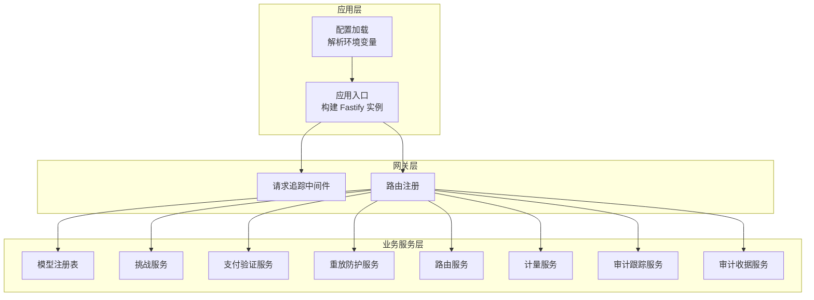
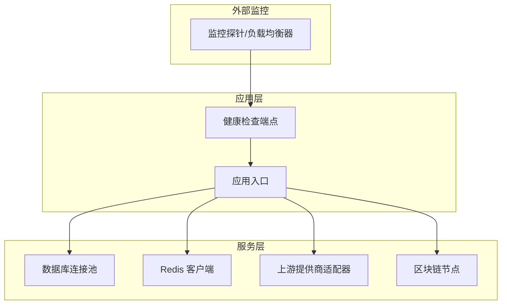
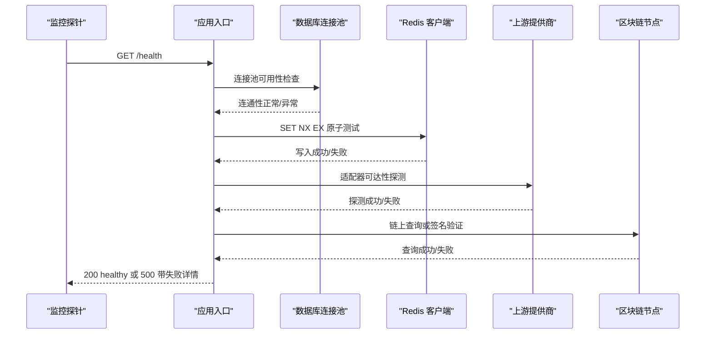
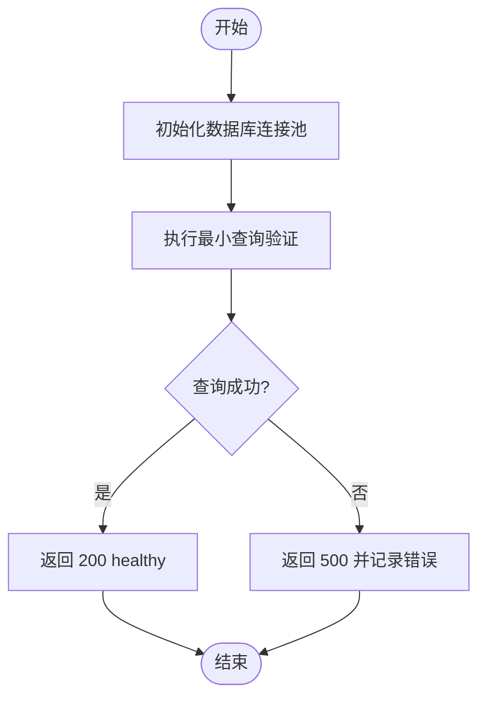
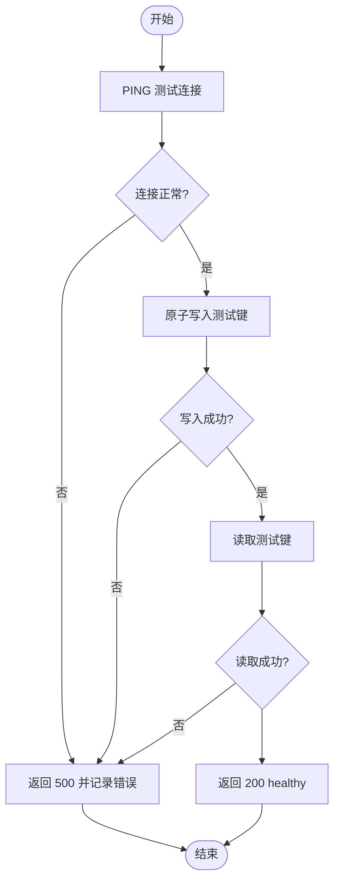
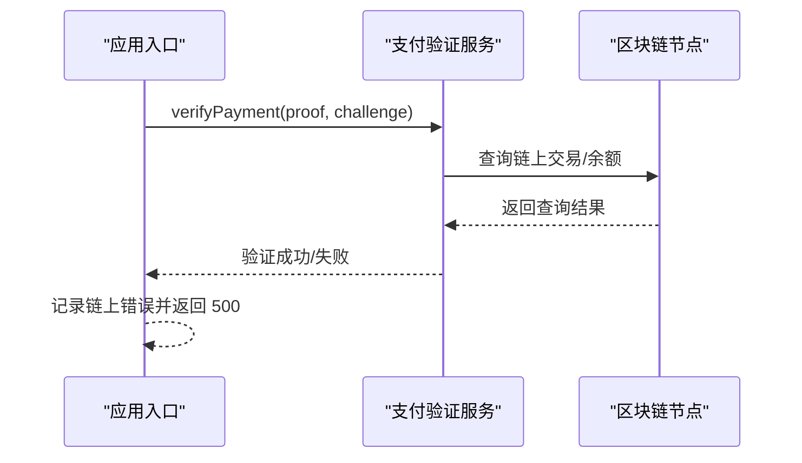
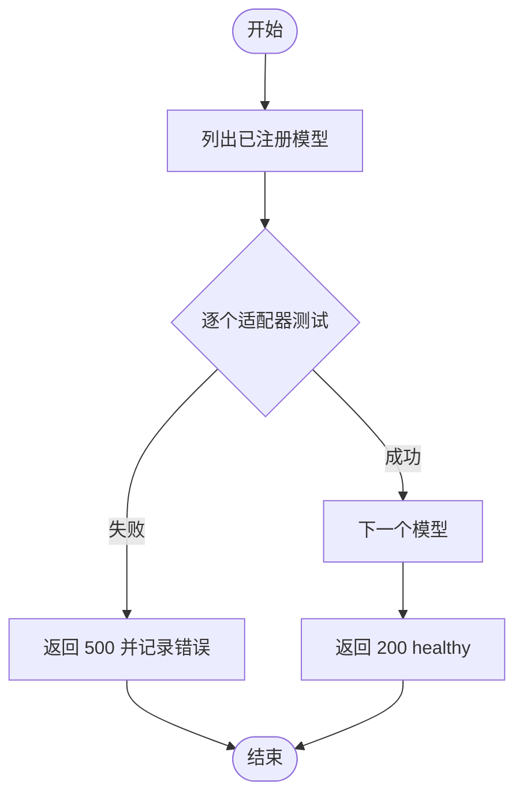
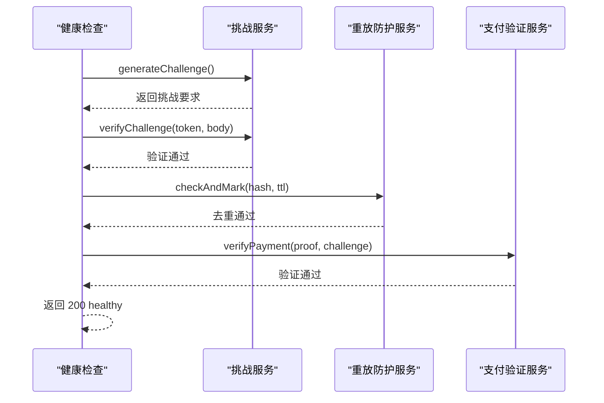
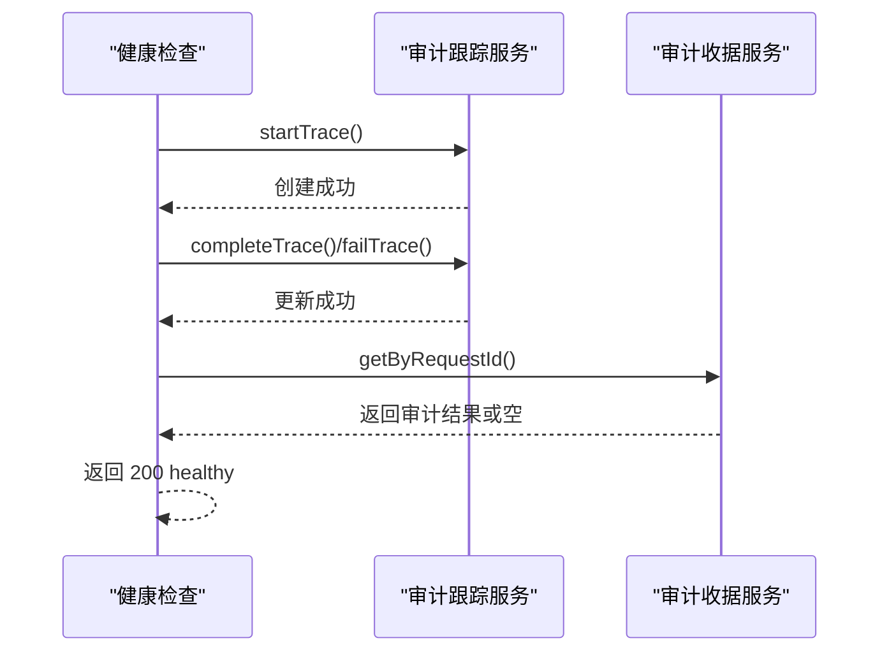
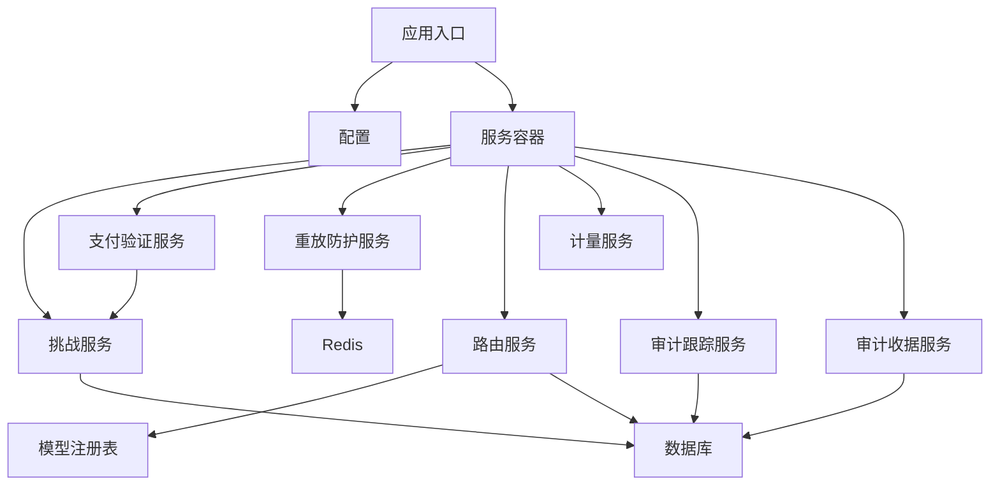

# 健康检查

<cite>
**本文引用的文件**
- [src/app.ts](file://src/app.ts)
- [src/config.ts](file://src/config.ts)
- [src/gateway/index.ts](file://src/gateway/index.ts)
- [src/gateway/routes.ts](file://src/gateway/routes.ts)
- [src/gateway/middleware.ts](file://src/gateway/middleware.ts)
- [src/provider/index.ts](file://src/provider/index.ts)
- [src/provider/registry.ts](file://src/provider/registry.ts)
- [src/x402/challenge.service.ts](file://src/x402/challenge.service.ts)
- [src/x402/verify.service.ts](file://src/x402/verify.service.ts)
- [src/x402/replay.service.ts](file://src/x402/replay.service.ts)
- [src/router/router.service.ts](file://src/router/router.service.ts)
- [src/billing/meter.service.ts](file://src/billing/meter.service.ts)
- [src/audit/trace.service.ts](file://src/audit/trace.service.ts)
- [src/audit/receipt.service.ts](file://src/audit/receipt.service.ts)
</cite>

## 目录
1. [简介](#简介)
2. [项目结构](#项目结构)
3. [核心组件](#核心组件)
4. [架构总览](#架构总览)
5. [详细组件分析](#详细组件分析)
6. [依赖关系分析](#依赖关系分析)
7. [性能考量](#性能考量)
8. [故障排查指南](#故障排查指南)
9. [结论](#结论)
10. [附录](#附录)

## 简介
本文件系统化梳理本项目的健康检查与可用性保障方案，覆盖以下方面：
- 应用健康状态检查机制：基于 HTTP 端点返回健康状态，结合日志与错误处理策略。
- 数据库连接检查：通过连接池初始化与查询进行连通性与可用性验证。
- Redis 缓存连接检查：通过原子写入与读取验证缓存可用性。
- 区块链节点连接检查：通过链上查询与签名验证流程中的节点交互进行健康度评估。
- 上游提供商健康检查：通过模型注册表与适配器调用路径评估上游可用性。
- 支付验证服务可用性检查：通过挑战生成/校验与链上支付验证流程进行端到端健康评估。
- 审计服务状态检查：通过请求跟踪与收据查询路径验证审计数据可检索性。
- 健康检查端点配置、检查间隔设置与故障检测策略：给出可落地的实践建议。
- 自定义健康检查扩展、健康状态报告与自动故障转移机制：提供设计思路与实现路径。

## 项目结构
本项目采用按功能域分层的模块化组织方式，健康检查涉及的核心模块包括：
- 应用入口与服务容器：应用启动、插件注册、全局错误处理与服务装配。
- 网关层：HTTP 路由与中间件，负责请求进入与追踪 ID 注入。
- 业务服务层：挑战服务、支付验证、重放防护、路由、计量、账务与审计。
- 配置层：统一加载环境变量并校验类型。

图表来源
- [src/app.ts:35-100](file://src/app.ts#L35-L100)
- [src/config.ts:28-45](file://src/config.ts#L28-L45)
- [src/gateway/middleware.ts:9-12](file://src/gateway/middleware.ts#L9-L12)
- [src/gateway/routes.ts:9-96](file://src/gateway/routes.ts#L9-L96)
- [src/provider/registry.ts:27-64](file://src/provider/registry.ts#L27-L64)
- [src/x402/challenge.service.ts:34-70](file://src/x402/challenge.service.ts#L34-L70)
- [src/x402/verify.service.ts:18-33](file://src/x402/verify.service.ts#L18-L33)
- [src/x402/replay.service.ts:23-51](file://src/x402/replay.service.ts#L23-L51)
- [src/router/router.service.ts:25-49](file://src/router/router.service.ts#L25-L49)
- [src/billing/meter.service.ts:13-28](file://src/billing/meter.service.ts#L13-L28)
- [src/audit/trace.service.ts:38-67](file://src/audit/trace.service.ts#L38-L67)
- [src/audit/receipt.service.ts:14-25](file://src/audit/receipt.service.ts#L14-L25)

章节来源
- [src/app.ts:35-100](file://src/app.ts#L35-L100)
- [src/config.ts:28-45](file://src/config.ts#L28-L45)
- [src/gateway/index.ts:1-9](file://src/gateway/index.ts#L1-L9)
- [src/gateway/middleware.ts:9-12](file://src/gateway/middleware.ts#L9-L12)
- [src/gateway/routes.ts:9-96](file://src/gateway/routes.ts#L9-L96)

## 核心组件
- 应用与服务容器
  - 应用实例化与插件注册（CORS、安全头、限流、通用工具）。
  - 全局错误处理与请求追踪钩子。
  - 服务容器装配：挑战、支付验证、重放防护、路由、计量、账务、审计等服务。
- 配置管理
  - 统一从环境变量加载并校验类型，包含数据库与 Redis 连接串、挑战密钥与 TTL、商户地址、支付链与资产、平台费率等。
- 网关层
  - 中间件注入唯一请求 ID，便于跨服务追踪。
  - 路由注册：模型列表查询、审计查询占位、聊天补全端点占位。
- 业务服务层
  - 挑战服务：生成与校验挑战，计算请求哈希。
  - 支付验证服务：校验链上支付证明。
  - 重放防护服务：基于 Redis 的原子去重与幂等缓存。
  - 路由服务：手动/自动模式下的上游路由与回退链。
  - 计量服务：从上游响应提取用量并持久化。
  - 审计服务：请求跟踪的生命周期管理与收据组装。

章节来源
- [src/app.ts:35-100](file://src/app.ts#L35-L100)
- [src/config.ts:4-24](file://src/config.ts#L4-L24)
- [src/gateway/middleware.ts:9-12](file://src/gateway/middleware.ts#L9-L12)
- [src/gateway/routes.ts:9-96](file://src/gateway/routes.ts#L9-L96)
- [src/x402/challenge.service.ts:4-26](file://src/x402/challenge.service.ts#L4-L26)
- [src/x402/verify.service.ts:3-16](file://src/x402/verify.service.ts#L3-L16)
- [src/x402/replay.service.ts:3-21](file://src/x402/replay.service.ts#L3-L21)
- [src/router/router.service.ts:5-18](file://src/router/router.service.ts#L5-L18)
- [src/billing/meter.service.ts:5-11](file://src/billing/meter.service.ts#L5-L11)
- [src/audit/trace.service.ts:4-36](file://src/audit/trace.service.ts#L4-L36)
- [src/audit/receipt.service.ts:4-12](file://src/audit/receipt.service.ts#L4-L12)

## 架构总览
下图展示健康检查在系统中的位置与交互关系：应用层负责暴露健康检查端点；服务层通过配置层提供的连接信息访问数据库与缓存；业务层在执行过程中对上游提供商与链上节点进行健康度评估。

图表来源
- [src/app.ts:35-100](file://src/app.ts#L35-L100)
- [src/config.ts:10-11](file://src/config.ts#L10-L11)
- [src/x402/replay.service.ts:23-51](file://src/x402/replay.service.ts#L23-L51)
- [src/provider/registry.ts:27-64](file://src/provider/registry.ts#L27-L64)
- [src/x402/verify.service.ts:18-33](file://src/x402/verify.service.ts#L18-L33)

## 详细组件分析

### 应用健康状态检查机制
- 端点设计
  - 建议新增一个 HTTP GET 端点用于健康检查，返回应用运行状态与关键依赖可用性摘要。
  - 可参考现有路由注册方式，在网关层添加健康检查路由。
- 健康检查内容
  - 应用基础健康：进程存活、内存与 CPU 使用趋势（可通过外部探针采集）。
  - 依赖健康：数据库连接池可用性、Redis 连接可用性、上游提供商可达性、链上节点通信可用性。
- 错误处理与状态码
  - 健康检查失败时返回 5xx，并在响应体中包含失败原因与受影响的依赖项。
  - 健康检查成功时返回 200，并包含“healthy”状态与时间戳。
- 日志与可观测性
  - 将健康检查结果记录到应用日志，便于审计与告警联动。
  - 结合请求追踪 ID，确保跨服务关联。

图表来源
- [src/gateway/routes.ts:9-96](file://src/gateway/routes.ts#L9-L96)
- [src/app.ts:35-100](file://src/app.ts#L35-L100)
- [src/x402/replay.service.ts:23-51](file://src/x402/replay.service.ts#L23-L51)
- [src/provider/registry.ts:27-64](file://src/provider/registry.ts#L27-L64)
- [src/x402/verify.service.ts:18-33](file://src/x402/verify.service.ts#L18-L33)

章节来源
- [src/gateway/routes.ts:9-96](file://src/gateway/routes.ts#L9-L96)
- [src/app.ts:35-100](file://src/app.ts#L35-L100)

### 数据库连接检查
- 连接建立
  - 在应用启动阶段初始化数据库连接池，并在健康检查中复用该连接池进行可用性验证。
- 连接池健康检查
  - 执行一次最小化的 SQL 查询（如查询当前时间），以验证连接池可用性与数据库服务连通性。
- 失败处理
  - 若连接失败，返回 500 并在响应体中包含数据库错误详情；同时记录错误日志以便告警。

图表来源
- [src/app.ts:73-76](file://src/app.ts#L73-L76)
- [src/config.ts:10](file://src/config.ts#L10)

章节来源
- [src/app.ts:73-76](file://src/app.ts#L73-L76)
- [src/config.ts:10](file://src/config.ts#L10)

### Redis 缓存连接检查
- 原子写入测试
  - 使用原子操作写入一个临时键（例如使用 NX EX 参数），验证 Redis 写入能力。
- 读取验证
  - 读取刚写入的键，确认值一致且未过期。
- 失败处理
  - 若写入或读取失败，返回 500 并包含缓存错误详情；同时记录错误日志。

图表来源
- [src/x402/replay.service.ts:23-51](file://src/x402/replay.service.ts#L23-L51)

章节来源
- [src/x402/replay.service.ts:23-51](file://src/x402/replay.service.ts#L23-L51)

### 区块链节点连接检查
- 节点可达性
  - 通过链上查询或签名验证流程中的节点交互，验证链上通信可用性。
- 签名验证路径
  - 在挑战生成与验证流程中，使用签名库进行本地签名与验证，间接评估节点连通性。
- 失败处理
  - 若节点不可达或签名失败，返回 500 并包含链上错误详情。

图表来源
- [src/x402/verify.service.ts:18-33](file://src/x402/verify.service.ts#L18-L33)

章节来源
- [src/x402/verify.service.ts:18-33](file://src/x402/verify.service.ts#L18-L33)

### 上游提供商健康检查
- 适配器可用性
  - 通过模型注册表获取适配器并发起一次最小化请求（如 ping 或元数据查询），验证上游可达性。
- 模型目录一致性
  - 健康检查应包含模型目录完整性校验，确保所有已注册模型均可被正确获取。
- 失败处理
  - 若适配器不可用或模型缺失，返回 500 并包含上游错误详情。

图表来源
- [src/provider/registry.ts:27-64](file://src/provider/registry.ts#L27-L64)

章节来源
- [src/provider/registry.ts:27-64](file://src/provider/registry.ts#L27-L64)

### 支付验证服务可用性检查
- 挑战生成与验证
  - 生成挑战并立即验证，评估挑战服务与链上验证的整体可用性。
- 重放防护联动
  - 在健康检查中模拟一次重放防护检查，验证 Redis 与挑战流程协同工作。
- 失败处理
  - 若挑战生成/验证失败或重放防护异常，返回 500 并包含支付验证错误详情。

图表来源
- [src/x402/challenge.service.ts:34-70](file://src/x402/challenge.service.ts#L34-L70)
- [src/x402/replay.service.ts:23-51](file://src/x402/replay.service.ts#L23-L51)
- [src/x402/verify.service.ts:18-33](file://src/x402/verify.service.ts#L18-L33)

章节来源
- [src/x402/challenge.service.ts:34-70](file://src/x402/challenge.service.ts#L34-L70)
- [src/x402/replay.service.ts:23-51](file://src/x402/replay.service.ts#L23-L51)
- [src/x402/verify.service.ts:18-33](file://src/x402/verify.service.ts#L18-L33)

### 审计服务状态检查
- 请求跟踪生命周期
  - 通过审计跟踪服务创建初始跟踪、完成跟踪与失败标记，验证跟踪数据的完整写入与查询。
- 收据查询
  - 通过收据服务按请求 ID 查询审计结果，验证审计数据的可检索性。
- 失败处理
  - 若跟踪写入或查询失败，返回 500 并包含审计错误详情。

图表来源
- [src/audit/trace.service.ts:38-67](file://src/audit/trace.service.ts#L38-L67)
- [src/audit/receipt.service.ts:14-25](file://src/audit/receipt.service.ts#L14-L25)

章节来源
- [src/audit/trace.service.ts:38-67](file://src/audit/trace.service.ts#L38-L67)
- [src/audit/receipt.service.ts:14-25](file://src/audit/receipt.service.ts#L14-L25)

### 健康检查端点配置、检查间隔与故障检测策略
- 端点配置
  - 建议在应用启动时注册健康检查端点，路径为 /health，方法为 GET。
  - 响应体包含字段：status（healthy/unhealthy）、timestamp、checks（各依赖检查结果数组）。
- 检查间隔
  - 建议探针每 10–30 秒轮询一次健康检查端点，避免过于频繁导致额外负载。
- 故障检测策略
  - 超时阈值：每个依赖检查设置 3–5 秒超时，超时即判定为不健康。
  - 失败次数阈值：连续 N 次失败后触发降级或告警。
  - 分级告警：区分数据库、缓存、上游、链上不同依赖的告警级别。

### 自定义健康检查、健康状态报告与自动故障转移
- 自定义健康检查
  - 在健康检查端点中增加自定义检查项（如特定上游模型可用性、特定链上资产查询）。
  - 将检查结果聚合到响应体的 checks 字段，便于外部系统解析。
- 健康状态报告
  - 健康检查端点返回结构化 JSON，包含总体状态与各子系统的健康详情。
  - 结合日志与指标系统，形成统一的健康状态仪表盘。
- 自动故障转移机制
  - 当上游提供商不可用时，路由服务根据回退链自动切换至备用上游。
  - 当数据库或缓存不可用时，应用可降级为只读模式或拒绝非必要写入。
  - 当链上节点不可用时，支付验证流程可降级为离线模式或延迟处理。

## 依赖关系分析
下图展示健康检查相关的模块依赖关系：应用入口依赖配置与服务容器；服务容器依赖各业务服务；业务服务依赖上游适配器、数据库与 Redis。

图表来源
- [src/app.ts:77-94](file://src/app.ts#L77-L94)
- [src/config.ts:10-11](file://src/config.ts#L10-L11)
- [src/provider/registry.ts:27-64](file://src/provider/registry.ts#L27-L64)
- [src/x402/challenge.service.ts:34-70](file://src/x402/challenge.service.ts#L34-L70)
- [src/x402/verify.service.ts:18-33](file://src/x402/verify.service.ts#L18-L33)
- [src/x402/replay.service.ts:23-51](file://src/x402/replay.service.ts#L23-L51)
- [src/router/router.service.ts:25-49](file://src/router/router.service.ts#L25-L49)
- [src/billing/meter.service.ts:13-28](file://src/billing/meter.service.ts#L13-L28)
- [src/audit/trace.service.ts:38-67](file://src/audit/trace.service.ts#L38-L67)
- [src/audit/receipt.service.ts:14-25](file://src/audit/receipt.service.ts#L14-L25)

章节来源
- [src/app.ts:77-94](file://src/app.ts#L77-L94)
- [src/config.ts:10-11](file://src/config.ts#L10-L11)
- [src/provider/registry.ts:27-64](file://src/provider/registry.ts#L27-L64)

## 性能考量
- 健康检查开销控制
  - 使用最小化查询与原子操作，避免对生产流量造成影响。
  - 合理设置检查间隔与超时，平衡及时性与资源消耗。
- 缓存与数据库压力
  - 健康检查尽量使用连接池与短生命周期查询，避免长时间占用连接。
- 上游与链上调用
  - 对上游与链上调用设置合理的超时与重试策略，避免阻塞健康检查线程。

## 故障排查指南
- 健康检查返回 500
  - 查看应用日志定位具体失败的依赖项。
  - 针对数据库：检查连接串、网络连通性与权限。
  - 针对 Redis：检查连接串、网络连通性与内存限制。
  - 针对上游：检查适配器配置与网络连通性。
  - 针对链上：检查节点地址、网络状态与签名库版本。
- 健康检查不稳定
  - 检查探针频率与超时设置是否合理。
  - 关注外部依赖的波动，必要时引入指数退避与熔断策略。

章节来源
- [src/app.ts:53-70](file://src/app.ts#L53-L70)

## 结论
本项目的健康检查体系应围绕“端点可见、依赖可测、失败可告、自动恢复”的目标构建。通过在应用层暴露健康检查端点、在服务层对数据库、缓存、上游与链上节点进行连通性与可用性验证，并结合日志与告警系统，可有效提升系统的可观测性与稳定性。建议尽快实现数据库与 Redis 的连接检查、上游适配器的可达性探测以及支付验证与审计服务的端到端健康评估，并配套完善的故障检测与自动故障转移机制。

## 附录
- 健康检查端点建议
  - 方法：GET
  - 路径：/health
  - 成功响应：200，包含 status、timestamp、checks
  - 失败响应：500，包含 status、timestamp、checks、error
- 配置项建议
  - healthCheckInterval：健康检查轮询间隔（秒）
  - healthCheckTimeout：单个依赖检查超时（秒）
  - healthCheckFailuresThreshold：失败次数阈值
- 依赖检查清单
  - 数据库：连接池可用性、最小查询
  - Redis：PING、原子写入与读取
  - 上游提供商：适配器可达性、模型目录一致性
  - 链上节点：链上查询或签名验证
  - 审计服务：跟踪写入与查询、收据检索