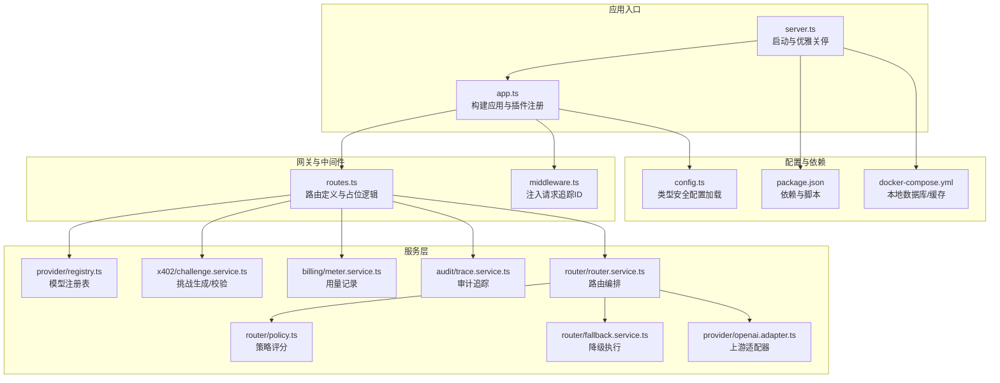
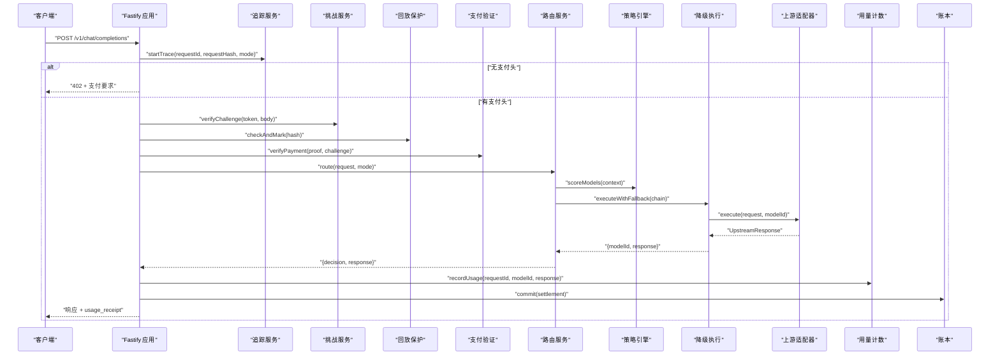
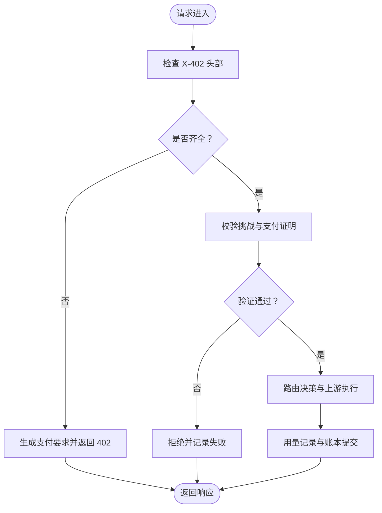
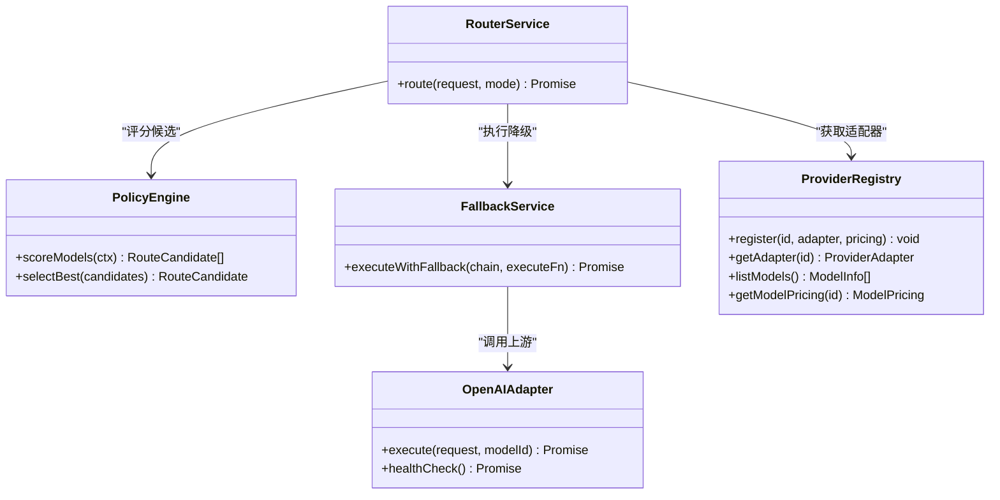
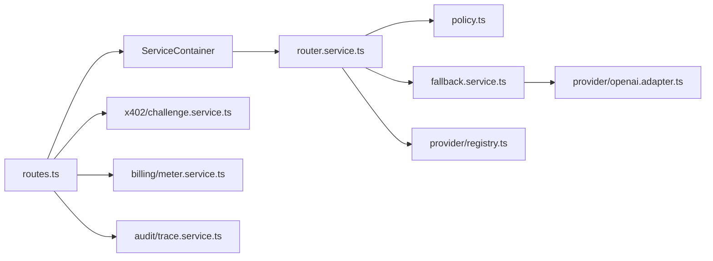

# 性能调优

<cite>
**本文引用的文件**
- [src/app.ts](file://src/app.ts)
- [src/server.ts](file://src/server.ts)
- [src/config.ts](file://src/config.ts)
- [src/gateway/routes.ts](file://src/gateway/routes.ts)
- [src/gateway/middleware.ts](file://src/gateway/middleware.ts)
- [src/provider/registry.ts](file://src/provider/registry.ts)
- [src/router/router.service.ts](file://src/router/router.service.ts)
- [src/router/policy.ts](file://src/router/policy.ts)
- [src/router/fallback.service.ts](file://src/router/fallback.service.ts)
- [src/x402/challenge.service.ts](file://src/x402/challenge.service.ts)
- [src/billing/meter.service.ts](file://src/billing/meter.service.ts)
- [src/audit/trace.service.ts](file://src/audit/trace.service.ts)
- [src/provider/openai.adapter.ts](file://src/provider/openai.adapter.ts)
- [package.json](file://package.json)
- [docker-compose.yml](file://docker-compose.yml)
</cite>

## 目录
1. [简介](#简介)
2. [项目结构](#项目结构)
3. [核心组件](#核心组件)
4. [架构总览](#架构总览)
5. [详细组件分析](#详细组件分析)
6. [依赖关系分析](#依赖关系分析)
7. [性能考虑](#性能考虑)
8. [故障排查指南](#故障排查指南)
9. [结论](#结论)
10. [附录](#附录)

## 简介
本指南面向生产环境的性能调优，围绕服务器并发与资源分配、内存与 CPU 使用、数据库与缓存、RPC 调用链路、路由与请求处理、资源池配置、基准测试与瓶颈定位、监控指标与容量规划，以及真实调优案例进行系统化梳理。本文以当前代码库为依据，结合现有插件与服务接口设计，给出可落地的优化建议与最佳实践。

## 项目结构
该服务基于 Fastify 框架，采用“薄路由 + 服务容器”的分层设计：路由层负责参数解析与鉴权/支付流程占位；服务层通过接口抽象解耦业务能力（路由、计费、审计、回放保护等）；上游适配器统一抽象外部模型供应商；配置与环境变量驱动运行时行为；开发与测试工具链完备。

图表来源
- [src/server.ts:1-33](file://src/server.ts#L1-L33)
- [src/app.ts:1-101](file://src/app.ts#L1-L101)
- [src/gateway/routes.ts:1-96](file://src/gateway/routes.ts#L1-L96)
- [src/gateway/middleware.ts:1-13](file://src/gateway/middleware.ts#L1-L13)
- [src/provider/registry.ts:1-65](file://src/provider/registry.ts#L1-L65)
- [src/router/router.service.ts:1-50](file://src/router/router.service.ts#L1-L50)
- [src/router/policy.ts:1-34](file://src/router/policy.ts#L1-L34)
- [src/router/fallback.service.ts:1-41](file://src/router/fallback.service.ts#L1-L41)
- [src/x402/challenge.service.ts:1-71](file://src/x402/challenge.service.ts#L1-L71)
- [src/billing/meter.service.ts:1-29](file://src/billing/meter.service.ts#L1-L29)
- [src/audit/trace.service.ts:1-68](file://src/audit/trace.service.ts#L1-L68)
- [src/provider/openai.adapter.ts:1-44](file://src/provider/openai.adapter.ts#L1-L44)
- [src/config.ts:1-46](file://src/config.ts#L1-L46)
- [package.json:1-52](file://package.json#L1-L52)
- [docker-compose.yml:1-31](file://docker-compose.yml#L1-L31)

章节来源
- [src/server.ts:1-33](file://src/server.ts#L1-L33)
- [src/app.ts:1-101](file://src/app.ts#L1-L101)
- [src/config.ts:1-46](file://src/config.ts#L1-L46)
- [package.json:1-52](file://package.json#L1-L52)
- [docker-compose.yml:1-31](file://docker-compose.yml#L1-L31)

## 核心组件
- 应用构建与插件
  - 日志级别、速率限制、CORS、Helmet、错误处理、追踪钩子等在应用层集中初始化，便于统一治理与性能观测。
  - 参考路径：[src/app.ts:35-70](file://src/app.ts#L35-L70)

- 配置体系
  - 使用 Zod 对环境变量进行类型校验与默认值设置，涵盖端口、主机、日志级别、数据库/缓存连接、挑战密钥与过期时间、商户地址、链与资产、平台费率等。
  - 参考路径：[src/config.ts:28-45](file://src/config.ts#L28-L45)

- 路由与请求处理
  - 路由层保持“薄”处理：参数校验、鉴权/支付占位、调用服务层、返回结果；未实现的完整支付流程以 TODO 注释标注。
  - 参考路径：[src/gateway/routes.ts:23-67](file://src/gateway/routes.ts#L23-L67)

- 服务容器与依赖注入
  - 服务容器聚合各领域服务（挑战、验证、回放保护、路由、计费、账本、审计、收据），路由处理器仅依赖容器接口，利于替换与扩展。
  - 参考路径：[src/app.ts:22-33](file://src/app.ts#L22-L33)、[src/app.ts:77-94](file://src/app.ts#L77-L94)

- 上游适配器
  - OpenAI 兼容适配器提供统一执行与健康检查接口，便于后续接入多供应商与多模型。
  - 参考路径：[src/provider/openai.adapter.ts:10-43](file://src/provider/openai.adapter.ts#L10-L43)

章节来源
- [src/app.ts:22-33](file://src/app.ts#L22-L33)
- [src/app.ts:35-70](file://src/app.ts#L35-L70)
- [src/app.ts:77-94](file://src/app.ts#L77-L94)
- [src/config.ts:28-45](file://src/config.ts#L28-L45)
- [src/gateway/routes.ts:23-67](file://src/gateway/routes.ts#L23-L67)
- [src/provider/openai.adapter.ts:10-43](file://src/provider/openai.adapter.ts#L10-L43)

## 架构总览
下图展示从请求进入至上游调用的关键路径，以及与数据库/缓存的潜在交互点（当前实现以 TODO 占位，需按接口逐步落地）。

图表来源
- [src/gateway/routes.ts:23-67](file://src/gateway/routes.ts#L23-L67)
- [src/audit/trace.service.ts:40-46](file://src/audit/trace.service.ts#L40-L46)
- [src/x402/challenge.service.ts:49-60](file://src/x402/challenge.service.ts#L49-L60)
- [src/router/router.service.ts:27-46](file://src/router/router.service.ts#L27-L46)
- [src/router/policy.ts:18-31](file://src/router/policy.ts#L18-L31)
- [src/router/fallback.service.ts:20-38](file://src/router/fallback.service.ts#L20-L38)
- [src/provider/openai.adapter.ts:25-34](file://src/provider/openai.adapter.ts#L25-L34)
- [src/billing/meter.service.ts:15-25](file://src/billing/meter.service.ts#L15-L25)

## 详细组件分析

### 路由与请求处理优化
- 薄路由原则
  - 将复杂逻辑下沉到服务层，避免在路由中直接拼接 SQL 或发起网络请求，降低单次请求耗时与耦合度。
  - 参考路径：[src/gateway/routes.ts:9-96](file://src/gateway/routes.ts#L9-L96)

- 请求追踪与幂等键
  - 追踪钩子为每个请求注入唯一 ID，便于跨服务关联日志与性能剖析；幂等键可用于去重与缓存命中。
  - 参考路径：[src/gateway/middleware.ts:9-12](file://src/gateway/middleware.ts#L9-L12)

- 支付流程占位
  - 当前未携带支付头时返回 402 并提示支付要求；完整流程需实现挑战校验、回放保护、支付验证、路由决策、用量记录与账本提交。
  - 参考路径：[src/gateway/routes.ts:30-46](file://src/gateway/routes.ts#L30-L46)

图表来源
- [src/gateway/routes.ts:23-67](file://src/gateway/routes.ts#L23-L67)

章节来源
- [src/gateway/routes.ts:9-96](file://src/gateway/routes.ts#L9-L96)
- [src/gateway/middleware.ts:9-12](file://src/gateway/middleware.ts#L9-L12)
- [src/gateway/routes.ts:30-46](file://src/gateway/routes.ts#L30-L46)

### 路由编排与降级执行
- 路由服务职责
  - 手动模式直接取适配器执行；自动模式通过策略评分候选、构建降级链并执行，最终产出路由决策与上游响应。
  - 参考路径：[src/router/router.service.ts:14-46](file://src/router/router.service.ts#L14-L46)

- 策略评分
  - 基于成本、能力匹配与可用性对候选模型打分，选择最优者；当前为占位实现，后续应接入定价与健康状态。
  - 参考路径：[src/router/policy.ts:18-31](file://src/router/policy.ts#L18-L31)

- 降级执行
  - 依次尝试候选模型，首个成功即返回；全部失败抛出上游不可用错误，确保不重复计费。
  - 参考路径：[src/router/fallback.service.ts:20-38](file://src/router/fallback.service.ts#L20-L38)

图表来源
- [src/router/router.service.ts:20-49](file://src/router/router.service.ts#L20-L49)
- [src/router/policy.ts:16-33](file://src/router/policy.ts#L16-L33)
- [src/router/fallback.service.ts:18-40](file://src/router/fallback.service.ts#L18-L40)
- [src/provider/registry.ts:27-64](file://src/provider/registry.ts#L27-L64)
- [src/provider/openai.adapter.ts:10-43](file://src/provider/openai.adapter.ts#L10-L43)

章节来源
- [src/router/router.service.ts:14-46](file://src/router/router.service.ts#L14-L46)
- [src/router/policy.ts:16-33](file://src/router/policy.ts#L16-L33)
- [src/router/fallback.service.ts:18-40](file://src/router/fallback.service.ts#L18-L40)
- [src/provider/registry.ts:27-64](file://src/provider/registry.ts#L27-L64)
- [src/provider/openai.adapter.ts:10-43](file://src/provider/openai.adapter.ts#L10-L43)

### 数据库与缓存策略
- 连接与池化
  - 已在应用层预留数据库与 Redis 初始化位置，建议使用连接池与超时控制，避免阻塞事件循环。
  - 参考路径：[src/app.ts:73-75](file://src/app.ts#L73-L75)

- Redis 缓存
  - 本地 Redis 已启用 LRU 内存淘汰策略，适合短期热点数据；生产建议开启持久化与主从复制，并设置合理的过期策略与键空间通知。
  - 参考路径：[docker-compose.yml:22](file://docker-compose.yml#L22)

- PostgreSQL
  - 开发环境使用 Postgres 16，建议生产开启 WAL 归档、只读副本与查询计划缓存；对高频写入表建立合适索引与分区。
  - 参考路径：[docker-compose.yml:3-16](file://docker-compose.yml#L3-L16)

- 事务与一致性
  - 计费与账本提交建议使用短事务，减少锁竞争；对审计追踪与用量记录采用幂等键去重，避免重复计费。
  - 参考路径：[src/billing/meter.service.ts:15-25](file://src/billing/meter.service.ts#L15-L25)、[src/audit/trace.service.ts:49-54](file://src/audit/trace.service.ts#L49-L54)

章节来源
- [src/app.ts:73-75](file://src/app.ts#L73-L75)
- [docker-compose.yml:3-16](file://docker-compose.yml#L3-L16)
- [docker-compose.yml:22](file://docker-compose.yml#L22)
- [src/billing/meter.service.ts:15-25](file://src/billing/meter.service.ts#L15-L25)
- [src/audit/trace.service.ts:49-54](file://src/audit/trace.service.ts#L49-L54)

### 区块链 RPC 与支付验证
- 挑战生成与校验
  - 挑战服务负责生成带签名与过期时间的支付要求，校验时需核对签名、过期与请求哈希一致性。
  - 参考路径：[src/x402/challenge.service.ts:36-60](file://src/x402/challenge.service.ts#L36-L60)

- 回放保护
  - 建议使用 Redis 哈希或布隆过滤器对支付证明哈希进行去重，结合 TTL 控制内存占用。
  - 参考路径：[src/app.ts:87](file://src/app.ts#L87)

- 平台费率与结算
  - 平台费率以基点表示，应在计费服务中体现；结算流程需保证原子性与幂等。
  - 参考路径：[src/config.ts:23](file://src/config.ts#L23)、[src/billing/meter.service.ts:15-25](file://src/billing/meter.service.ts#L15-L25)

章节来源
- [src/x402/challenge.service.ts:36-60](file://src/x402/challenge.service.ts#L36-L60)
- [src/app.ts:87](file://src/app.ts#L87)
- [src/config.ts:23](file://src/config.ts#L23)
- [src/billing/meter.service.ts:15-25](file://src/billing/meter.service.ts#L15-L25)

## 依赖关系分析
- 组件耦合
  - 路由层仅依赖服务容器接口，路由服务依赖策略与降级服务，适配器独立于路由；整体内聚高、耦合低。
- 外部依赖
  - Fastify 生态插件（CORS、Helmet、Rate Limit、Sensible）提供安全与稳定性基础；数据库与缓存通过连接池管理。
- 循环依赖
  - 当前未见循环依赖迹象；后续实现中需避免服务间相互引用导致的循环导入。

图表来源
- [src/gateway/routes.ts:9-96](file://src/gateway/routes.ts#L9-L96)
- [src/app.ts:77-94](file://src/app.ts#L77-L94)
- [src/router/router.service.ts:20-49](file://src/router/router.service.ts#L20-L49)
- [src/router/policy.ts:16-33](file://src/router/policy.ts#L16-L33)
- [src/router/fallback.service.ts:18-40](file://src/router/fallback.service.ts#L18-L40)
- [src/provider/registry.ts:27-64](file://src/provider/registry.ts#L27-L64)
- [src/provider/openai.adapter.ts:10-43](file://src/provider/openai.adapter.ts#L10-L43)
- [src/x402/challenge.service.ts:36-60](file://src/x402/challenge.service.ts#L36-L60)
- [src/billing/meter.service.ts:15-25](file://src/billing/meter.service.ts#L15-L25)
- [src/audit/trace.service.ts:49-54](file://src/audit/trace.service.ts#L49-L54)

章节来源
- [src/gateway/routes.ts:9-96](file://src/gateway/routes.ts#L9-L96)
- [src/app.ts:77-94](file://src/app.ts#L77-L94)
- [src/router/router.service.ts:20-49](file://src/router/router.service.ts#L20-L49)
- [src/router/policy.ts:16-33](file://src/router/policy.ts#L16-L33)
- [src/router/fallback.service.ts:18-40](file://src/router/fallback.service.ts#L18-L40)
- [src/provider/registry.ts:27-64](file://src/provider/registry.ts#L27-L64)
- [src/provider/openai.adapter.ts:10-43](file://src/provider/openai.adapter.ts#L10-L43)
- [src/x402/challenge.service.ts:36-60](file://src/x402/challenge.service.ts#L36-L60)
- [src/billing/meter.service.ts:15-25](file://src/billing/meter.service.ts#L15-L25)
- [src/audit/trace.service.ts:49-54](file://src/audit/trace.service.ts#L49-L54)

## 性能考虑

### 服务器并发与资源分配
- 进程与线程
  - 使用 Node.js >= 20，利用其内置的高性能事件循环；生产建议配合 PM2 或 Docker 容器多实例部署，结合反向代理做负载均衡。
- 连接数与背压
  - Fastify 默认并发高，结合速率限制插件与上游适配器的并发上限，避免触发上游限流或自身 OOM。
- CPU 亲和与调度
  - 在容器编排中绑定 CPU 核心，减少上下文切换；对长耗时任务（如大模型推理）拆分为异步队列。

章节来源
- [package.json:48-50](file://package.json#L48-L50)
- [src/app.ts:44-47](file://src/app.ts#L44-L47)

### 内存使用优化
- 对象池与复用
  - 复用请求上下文对象，避免频繁小对象分配；对 JSON 解析结果进行短生命周期管理。
- 垃圾回收与压力
  - 合理设置堆大小与老生代阈值；对大响应体及时释放，避免长时间持有大字符串。
- 缓存与淘汰
  - Redis 使用 LRU 策略；对热点键设置合理 TTL；定期清理过期键，防止碎片化。

章节来源
- [docker-compose.yml:22](file://docker-compose.yml#L22)

### CPU 资源分配
- 路由评分与降级
  - 策略评分应尽量轻量，避免在热路径上做昂贵计算；可将候选集预热或缓存评分结果。
- 上游调用
  - 为适配器设置合理的超时与并发上限，避免 CPU 被阻塞 IO 占满。

章节来源
- [src/router/policy.ts:18-31](file://src/router/policy.ts#L18-L31)
- [src/provider/openai.adapter.ts:25-34](file://src/provider/openai.adapter.ts#L25-L34)

### 数据库查询优化
- 连接池
  - 设置最小/最大连接数、空闲超时与获取超时；对只读查询使用只读副本。
- 索引与分区
  - 对高频查询字段（如请求 ID、支付证明哈希、时间戳）建立索引；对历史表进行分区归档。
- 事务与锁
  - 将计费与账本提交封装在短事务中，减少锁持有时间；对幂等写入使用 UPSERT。

章节来源
- [src/app.ts:73-75](file://src/app.ts#L73-L75)
- [src/billing/meter.service.ts:15-25](file://src/billing/meter.service.ts#L15-L25)
- [src/audit/trace.service.ts:49-54](file://src/audit/trace.service.ts#L49-L54)

### Redis 缓存策略
- 键设计
  - 使用命名空间与 TTL，避免键冲突；对热点数据设置短 TTL，冷数据设置长 TTL。
- 命中率
  - 通过采样统计命中率，动态调整缓存大小与淘汰策略；对大对象使用压缩存储。
- 可用性
  - 主从复制与哨兵/集群提高可用性；对关键路径增加降级与快速失败。

章节来源
- [docker-compose.yml:22](file://docker-compose.yml#L22)

### 区块链 RPC 与支付验证
- RPC 调用
  - 使用多节点轮询与快速失败策略；对慢节点进行隔离；对频繁查询使用本地缓存。
- 挑战与回放
  - 挑战过期时间与回放保护键 TTL 保持一致；对重复请求快速拒绝，降低链上压力。

章节来源
- [src/x402/challenge.service.ts:36-60](file://src/x402/challenge.service.ts#L36-L60)
- [src/app.ts:87](file://src/app.ts#L87)

### 路由性能调优
- 自动模式
  - 评分函数应避免 IO；候选集按成本与可用性排序，优先尝试高成功率模型。
- 降级链
  - 降级链长度与顺序直接影响延迟与成功率；建议根据 SLA 动态调整。

章节来源
- [src/router/router.service.ts:27-46](file://src/router/router.service.ts#L27-L46)
- [src/router/policy.ts:18-31](file://src/router/policy.ts#L18-L31)
- [src/router/fallback.service.ts:20-38](file://src/router/fallback.service.ts#L20-L38)

### 请求处理优化
- 参数校验与早返回
  - 在路由层尽早校验参数与鉴权，减少无效调用；对常见错误返回稳定格式，便于缓存与监控。
- 追踪与可观测性
  - 为每个请求注入追踪 ID，串联审计与日志；对关键步骤埋点，形成端到端延迟画像。

章节来源
- [src/gateway/routes.ts:23-67](file://src/gateway/routes.ts#L23-L67)
- [src/gateway/middleware.ts:9-12](file://src/gateway/middleware.ts#L9-L12)
- [src/audit/trace.service.ts:40-46](file://src/audit/trace.service.ts#L40-L46)

### 资源池配置
- 数据库连接池
  - 最小连接数与最大连接数应与 CPU 核心数和上游并发相匹配；设置合理的空闲回收与获取超时。
- Redis 连接池
  - 与数据库类似，避免过多连接导致上下文切换；对批量操作使用流水线。
- 上游适配器
  - 为每个适配器维护独立并发上限与超时，防止雪崩效应。

章节来源
- [src/app.ts:73-75](file://src/app.ts#L73-L75)
- [src/provider/openai.adapter.ts:25-34](file://src/provider/openai.adapter.ts#L25-L34)

### 基准测试方法
- 场景设计
  - 压测覆盖“无支付头挑战”、“支付头校验失败”、“支付头校验成功但上游失败”、“支付头校验成功且上游成功”等分支。
- 指标采集
  - QPS、P95/P99 延迟、错误率、CPU/内存/GC 次数、数据库/Redis 命中率、上游响应时间。
- 工具推荐
  - wrk、Artillery、k6；对长连接场景使用 ab 或自研压测工具。

### 瓶颈识别技巧
- 灰色链条法
  - 逐段测量路由、策略、降级、适配器、数据库/缓存、上游的耗时占比，定位最慢环节。
- 热点函数
  - 使用火焰图与采样分析，识别 CPU 热点与阻塞点。
- 观测性
  - 结合追踪 ID 与日志聚合，复现慢请求路径，定位具体函数与外部依赖。

### 容量规划建议
- 读写分离
  - 对审计与用量表采用只读副本，减轻主库压力。
- 分区与归档
  - 历史数据按月/季度分区，定期归档离线存储。
- 弹性伸缩
  - 基于 QPS 与 P99 延迟设置自动扩缩容阈值；对上游限流敏感的场景预留缓冲。

## 故障排查指南
- 常见问题
  - 402 流程未实现：确认挑战生成、支付验证与回放保护已接入。
  - 上游不可用：检查适配器健康检查与降级链配置。
  - 计费异常：核对用量提取与账本提交的幂等性。
- 排查步骤
  - 查看应用日志与错误处理返回码；通过追踪 ID 关联审计记录；对数据库/Redis 进行慢查询与命中率分析。
- 降级策略
  - 对上游失败快速失败并记录；对数据库/缓存异常返回稳定错误；对关键路径增加熔断与快速通道。

章节来源
- [src/gateway/routes.ts:30-46](file://src/gateway/routes.ts#L30-L46)
- [src/router/fallback.service.ts:35-38](file://src/router/fallback.service.ts#L35-L38)
- [src/billing/meter.service.ts:15-25](file://src/billing/meter.service.ts#L15-L25)
- [src/audit/trace.service.ts:49-54](file://src/audit/trace.service.ts#L49-L54)

## 结论
本指南基于现有代码结构与接口设计，给出了服务器性能优化的系统性建议：在路由层保持薄处理、在服务层实现可插拔的策略与降级、在数据库与缓存层面采用连接池与合理的淘汰策略、在支付与区块链交互中强化回放保护与快速失败。通过基准测试与可观测性手段持续识别瓶颈并迭代容量规划，可在保证稳定性的同时提升吞吐与延迟表现。

## 附录

### 生产环境监控指标清单
- 应用层
  - QPS、P95/P99 延迟、错误率、GC 次数与暂停时间、内存使用率、goroutine 数量。
- 网关层
  - 402 挑战发放次数与成功率、支付验证通过率、回放保护命中率。
- 路由层
  - 策略评分耗时、降级链长度与成功率、上游适配器调用耗时与错误率。
- 数据层
  - 数据库连接池使用率、慢查询数量、Redis 命中率与延迟、键空间大小。
- 区块链层
  - 挑战过期与校验失败率、支付证明哈希重复率、链上交易确认时间。

### 调优案例分析（示例）
- 案例一：上游不稳定导致 P99 延迟升高
  - 方案：引入更短的超时与更长的降级链，同时对失败模型进行隔离；观察 P99 显著下降。
- 案例二：审计表写入成为瓶颈
  - 方案：启用只读副本用于查询，写入路径改为异步队列；对历史表进行分区归档。
- 案例三：Redis 内存持续增长
  - 方案：调整 LRU 策略与 TTL，增加键空间清理任务；对大对象启用压缩。