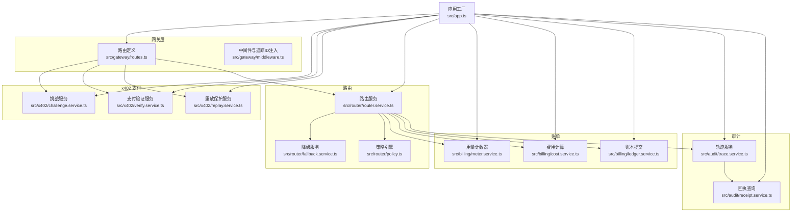
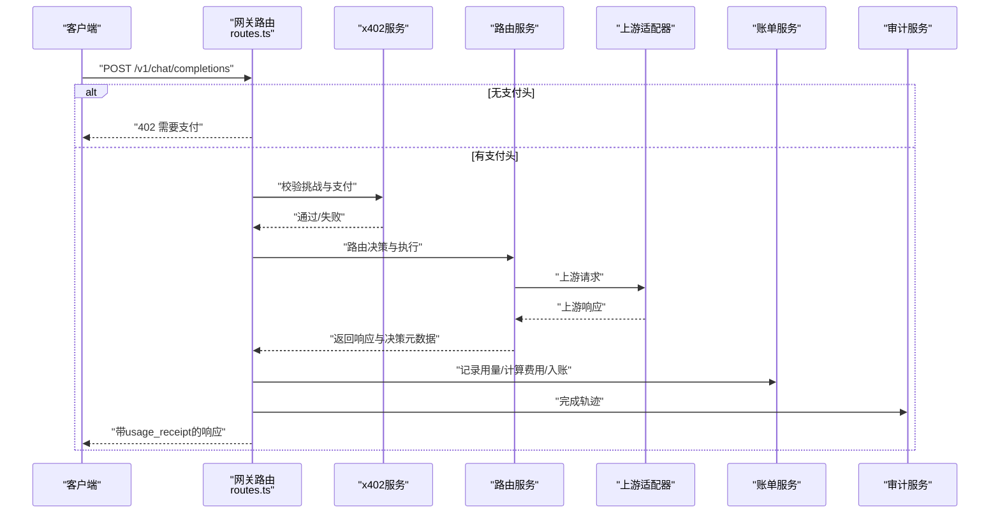
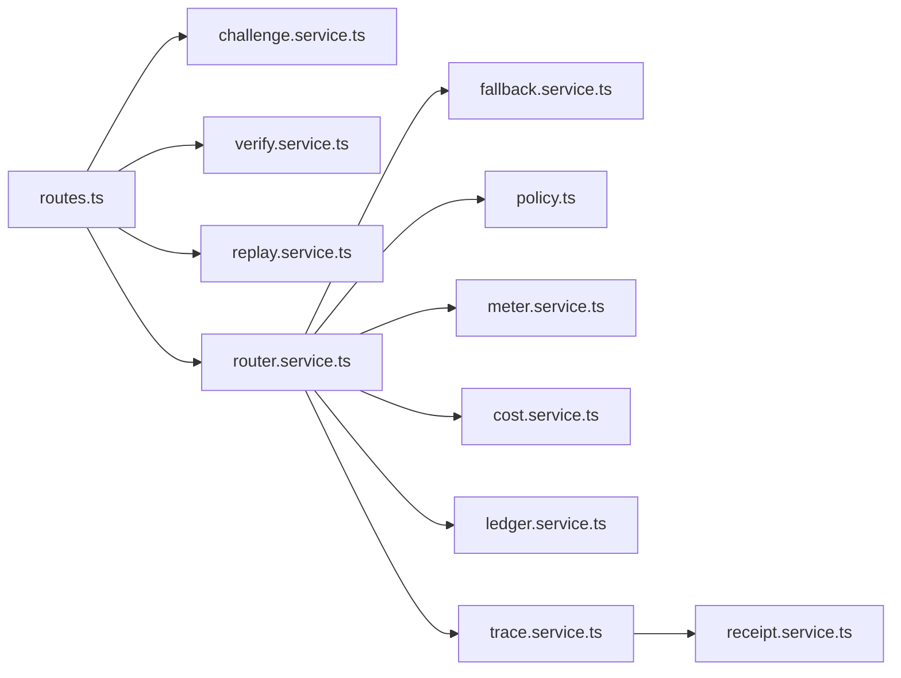
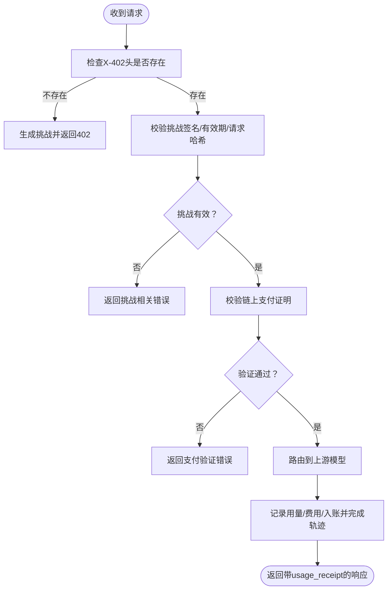

# 故障排除

<cite>
**本文引用的文件**
- [src/app.ts](file://src/app.ts)
- [src/errors.ts](file://src/errors.ts)
- [src/gateway/routes.ts](file://src/gateway/routes.ts)
- [src/gateway/middleware.ts](file://src/gateway/middleware.ts)
- [src/x402/challenge.service.ts](file://src/x402/challenge.service.ts)
- [src/x402/verify.service.ts](file://src/x402/verify.service.ts)
- [src/x402/replay.service.ts](file://src/x402/replay.service.ts)
- [src/router/router.service.ts](file://src/router/router.service.ts)
- [src/router/fallback.service.ts](file://src/router/fallback.service.ts)
- [src/router/policy.ts](file://src/router/policy.ts)
- [src/billing/meter.service.ts](file://src/billing/meter.service.ts)
- [src/billing/cost.service.ts](file://src/billing/cost.service.ts)
- [src/billing/ledger.service.ts](file://src/billing/ledger.service.ts)
- [src/audit/trace.service.ts](file://src/audit/trace.service.ts)
- [src/audit/receipt.service.ts](file://src/audit/receipt.service.ts)
- [src/types.ts](file://src/types.ts)
- [test/integration/flow.test.ts](file://test/integration/flow.test.ts)
- [README.md](file://README.md)
</cite>

## 目录
1. [简介](#简介)
2. [项目结构](#项目结构)
3. [核心组件](#核心组件)
4. [架构总览](#架构总览)
5. [详细组件分析](#详细组件分析)
6. [依赖关系分析](#依赖关系分析)
7. [性能考量](#性能考量)
8. [故障排除指南](#故障排除指南)
9. [结论](#结论)
10. [附录](#附录)

## 简介
本指南面向运维与开发人员，聚焦于启动失败、连接超时、支付验证错误与路由失败等常见问题的诊断与处置。内容覆盖错误日志分析、调试工具使用、问题定位技巧、审计追踪与回放机制、紧急响应流程、问题升级与根因分析方法，并对常见错误代码进行解读与解决建议。

## 项目结构
系统采用模块化分层设计：网关层负责请求接入、参数校验与错误统一处理；x402 模块负责挑战生成、支付验证与重放防护；路由模块负责模型选择与降级链路；账单模块负责用量计量、费用计算与不可变账本；审计模块负责请求轨迹与回执查询。

图表来源
- [src/app.ts:35-100](file://src/app.ts#L35-L100)
- [src/gateway/routes.ts:9-96](file://src/gateway/routes.ts#L9-L96)
- [src/x402/challenge.service.ts:28-71](file://src/x402/challenge.service.ts#L28-L71)
- [src/x402/verify.service.ts:18-34](file://src/x402/verify.service.ts#L18-L34)
- [src/router/router.service.ts:20-50](file://src/router/router.service.ts#L20-L50)
- [src/audit/trace.service.ts:38-68](file://src/audit/trace.service.ts#L38-L68)

章节来源
- [README.md:26-47](file://README.md#L26-L47)
- [src/app.ts:35-100](file://src/app.ts#L35-L100)

## 核心组件
- 应用工厂与全局错误处理：集中注册插件、钩子与全局错误处理器，确保一致的日志与响应格式。
- 路由与参数校验：基于模式的请求体解析与参数校验，保障后续服务调用输入质量。
- 错误体系：以类型化错误类映射到标准 API 错误码，便于前端与监控系统识别。
- 审计与回放：提供请求轨迹的开始、完成、失败标记与按请求 ID 查询完整回执的能力。

章节来源
- [src/app.ts:35-100](file://src/app.ts#L35-L100)
- [src/gateway/routes.ts:9-96](file://src/gateway/routes.ts#L9-L96)
- [src/errors.ts:6-105](file://src/errors.ts#L6-L105)
- [src/audit/trace.service.ts:38-68](file://src/audit/trace.service.ts#L38-L68)
- [src/audit/receipt.service.ts:14-26](file://src/audit/receipt.service.ts#L14-L26)

## 架构总览
下图展示从客户端到上游模型提供商的端到端路径，以及关键断点（挑战、验证、路由、账单、审计）：

图表来源
- [src/gateway/routes.ts:23-67](file://src/gateway/routes.ts#L23-L67)
- [src/x402/challenge.service.ts:36-68](file://src/x402/challenge.service.ts#L36-L68)
- [src/x402/verify.service.ts:20-31](file://src/x402/verify.service.ts#L20-L31)
- [src/router/router.service.ts:27-46](file://src/router/router.service.ts#L27-L46)
- [src/billing/meter.service.ts](file://src/billing/meter.service.ts)
- [src/billing/cost.service.ts](file://src/billing/cost.service.ts)
- [src/billing/ledger.service.ts](file://src/billing/ledger.service.ts)
- [src/audit/trace.service.ts:39-66](file://src/audit/trace.service.ts#L39-L66)

## 详细组件分析

### 组件一：应用工厂与全局错误处理
- 注册 CORS、安全头、限流与通用响应能力插件。
- onRequest 钩子注入追踪 ID，便于跨服务关联日志。
- 全局错误处理器区分业务错误与未知异常，输出标准化错误响应。
- 服务容器装配：挑战、验证、重放、路由、计费、账本、审计等服务实例化并注入路由。

章节来源
- [src/app.ts:35-100](file://src/app.ts#L35-L100)

### 组件二：路由与参数校验
- 对 /v1/chat/completions 的请求体进行模式校验。
- 无支付头时直接返回 402 并附带支付要求信息。
- 已实现占位返回，完整支付流程待实现。

章节来源
- [src/gateway/routes.ts:23-67](file://src/gateway/routes.ts#L23-L67)

### 组件三：x402 支付模块
- 挑战服务：生成挑战、校验挑战、计算请求哈希。
- 支付验证服务：校验链上付款证明，检查金额、资产与收款人。
- 重放保护服务：防止同一支付被重复消费（当前未注入真实存储）。

章节来源
- [src/x402/challenge.service.ts:28-71](file://src/x402/challenge.service.ts#L28-L71)
- [src/x402/verify.service.ts:18-34](file://src/x402/verify.service.ts#L18-L34)
- [src/x402/replay.service.ts](file://src/x402/replay.service.ts)

### 组件四：路由与降级
- 路由服务：手动/自动两种模式，构建候选集与降级链，执行并产出路由证明。
- 策略引擎与降级服务：策略评分与失败重试逻辑（当前未注入真实实现）。

章节来源
- [src/router/router.service.ts:20-50](file://src/router/router.service.ts#L20-L50)
- [src/router/policy.ts](file://src/router/policy.ts)
- [src/router/fallback.service.ts](file://src/router/fallback.service.ts)

### 组件五：账单与审计
- 计量、费用与账本：用量记录、费用拆解与不可变账本提交。
- 审计轨迹：开始、完成、失败与按请求 ID 查询回执。

章节来源
- [src/billing/meter.service.ts](file://src/billing/meter.service.ts)
- [src/billing/cost.service.ts](file://src/billing/cost.service.ts)
- [src/billing/ledger.service.ts](file://src/billing/ledger.service.ts)
- [src/audit/trace.service.ts:38-68](file://src/audit/trace.service.ts#L38-L68)
- [src/audit/receipt.service.ts:14-26](file://src/audit/receipt.service.ts#L14-L26)

## 依赖关系分析
- 组件耦合：路由层依赖策略与降级服务；网关层依赖 x402 与账单/审计服务；x402 依赖链上 RPC 与外部缓存。
- 外部依赖：PostgreSQL（账本/审计）、Redis（重放保护/缓存）、EVM RPC（链上验证）。
- 可能的循环依赖：当前各模块接口清晰，未见直接循环导入。

图表来源
- [src/gateway/routes.ts:9-96](file://src/gateway/routes.ts#L9-L96)
- [src/router/router.service.ts:20-50](file://src/router/router.service.ts#L20-L50)
- [src/audit/trace.service.ts:38-68](file://src/audit/trace.service.ts#L38-L68)

章节来源
- [src/app.ts:77-94](file://src/app.ts#L77-L94)

## 性能考量
- 请求限流：默认每分钟最多 100 次请求，避免突发流量冲击。
- 日志级别：可通过配置调整，生产环境建议使用 info 或更高级别。
- 上游超时与可用性：路由层应捕获上游超时/不可用错误并返回对应状态码，便于快速失败与降级。
- 缓存与去重：重放保护依赖 Redis，需保证其低延迟与高可用。

章节来源
- [src/app.ts:44-47](file://src/app.ts#L44-L47)
- [src/errors.ts:67-81](file://src/errors.ts#L67-L81)

## 故障排除指南

### 启动失败
- 症状：进程无法启动或监听端口失败。
- 排查步骤
  - 检查环境变量与配置加载是否成功（参考应用工厂中配置读取与日志级别设置）。
  - 查看进程绑定端口是否被占用，确认防火墙与容器网络配置。
  - 关注应用工厂中插件注册顺序与错误处理钩子是否触发。
- 建议
  - 在本地先运行数据库与缓存容器，确保外部依赖可达。
  - 使用最小化配置启动，逐步启用功能模块定位问题。

章节来源
- [src/app.ts:35-100](file://src/app.ts#L35-L100)
- [README.md:13-22](file://README.md#L13-L22)

### 连接超时
- 症状：上游模型提供商响应慢或不可达，出现 504/503。
- 排查步骤
  - 观察路由层对上游超时/不可用的错误映射与处理。
  - 检查链上 RPC 与外部服务的可用性与网络连通性。
  - 结合审计轨迹中的耗时指标定位瓶颈。
- 建议
  - 为上游调用设置合理超时与重试策略。
  - 使用降级链路优先保障可用性。

章节来源
- [src/errors.ts:67-81](file://src/errors.ts#L67-L81)
- [src/router/router.service.ts:27-46](file://src/router/router.service.ts#L27-L46)

### 支付验证错误
- 症状：402 支付相关错误，如挑战过期、请求哈希不匹配、验证失败、金额不足、重放等。
- 排查步骤
  - 确认挑战生成与校验流程：请求哈希是否与当前请求一致、签名是否有效、是否过期。
  - 核对链上支付证明：金额、资产、收款地址是否满足挑战要求。
  - 检查重放保护是否生效（当前未注入真实存储，需关注实现进度）。
- 建议
  - 在网关层打印挑战与支付头的关键字段用于交叉验证。
  - 对于金额不足，返回具体“所需 vs 实际”以便用户理解。

章节来源
- [src/x402/challenge.service.ts:36-68](file://src/x402/challenge.service.ts#L36-L68)
- [src/x402/verify.service.ts:20-31](file://src/x402/verify.service.ts#L20-L31)
- [src/errors.ts:17-81](file://src/errors.ts#L17-L81)

### 路由失败
- 症状：自动模式下策略评分或降级链路执行异常，导致请求无法完成。
- 排查步骤
  - 检查策略引擎与降级服务的实现是否正确注入与调用。
  - 核对路由决策元数据与上游响应的一致性。
  - 关注路由证明哈希的生成与校验。
- 建议
  - 在路由服务中增加更细粒度的错误边界与日志埋点。
  - 对失败路径进行回放测试，复现并修复。

章节来源
- [src/router/router.service.ts:27-46](file://src/router/router.service.ts#L27-L46)
- [src/router/policy.ts](file://src/router/policy.ts)
- [src/router/fallback.service.ts](file://src/router/fallback.service.ts)

### 审计追踪与回放
- 作用：提供端到端的请求轨迹与结算证据，支持事后复盘与争议处理。
- 回放机制：通过按请求 ID 查询回执，拼装轨迹、路由决策、用量、费用与支付信息。
- 问题重现：结合回执中的关键字段（如请求哈希、路由决策、费用明细）在测试环境中构造相同输入进行复现。

章节来源
- [src/audit/trace.service.ts:38-68](file://src/audit/trace.service.ts#L38-L68)
- [src/audit/receipt.service.ts:14-26](file://src/audit/receipt.service.ts#L14-L26)
- [src/types.ts:110-119](file://src/types.ts#L110-L119)

### 调试工具与日志分析
- 调试工具
  - 使用测试框架发起最小化请求，观察响应状态码与错误码。
  - 在网关层打印关键头（挑战、支付、幂等键）与请求哈希。
- 日志分析
  - 关注全局错误处理器输出的错误码与消息。
  - 利用追踪 ID 将请求在多模块间串联起来，定位具体失败环节。

章节来源
- [test/integration/flow.test.ts:20-37](file://test/integration/flow.test.ts#L20-L37)
- [src/app.ts:52-70](file://src/app.ts#L52-L70)

### 紧急响应流程与升级机制
- 流程
  - 快速隔离：停止对受影响上游的批量请求，启用降级链路。
  - 信息收集：抓取最近 1 小时内带有特定错误码的请求样本与审计回执。
  - 修复验证：在预生产环境复现并验证修复。
  - 渐进式发布：灰度放量，持续监控错误率与延迟。
- 升级机制
  - 重大故障（如链上验证中断、上游大规模不可用）应升级至值班负责人与技术主管。
  - 保留根因分析报告与回放脚本，形成知识沉淀。

### 常见错误代码与解决方案
- 402 支付相关
  - payment_required：缺少支付头，返回挑战要求。
  - challenge_expired：挑战过期，需重新发起挑战。
  - request_hash_mismatch：请求体变化导致哈希不一致，需保持请求不变重试。
  - payment_verification_failed：链上验证失败，检查金额、资产与收款人。
  - insufficient_payment：金额不足，补齐后重试。
  - payment_replayed：支付已被使用，更换新的支付证明。
- 400/409/504/503/500
  - 400：请求体校验失败或业务参数错误。
  - 409：资源冲突或重放检测。
  - 504：上游超时。
  - 503：上游不可用。
  - 500：内部服务器错误。

章节来源
- [src/errors.ts:17-89](file://src/errors.ts#L17-L89)
- [src/gateway/routes.ts:30-46](file://src/gateway/routes.ts#L30-L46)

## 结论
本指南提供了从启动、连接、支付验证到路由失败的全链路故障排查方法，并强调了审计追踪在问题定位与回放中的关键价值。建议在日常运维中完善日志规范、建立自动化回归测试与回放脚本，以缩短故障恢复时间并提升系统韧性。

## 附录

### 关键流程图：支付验证流程

图表来源
- [src/gateway/routes.ts:23-67](file://src/gateway/routes.ts#L23-L67)
- [src/x402/challenge.service.ts:36-68](file://src/x402/challenge.service.ts#L36-L68)
- [src/x402/verify.service.ts:20-31](file://src/x402/verify.service.ts#L20-L31)
- [src/router/router.service.ts:27-46](file://src/router/router.service.ts#L27-L46)