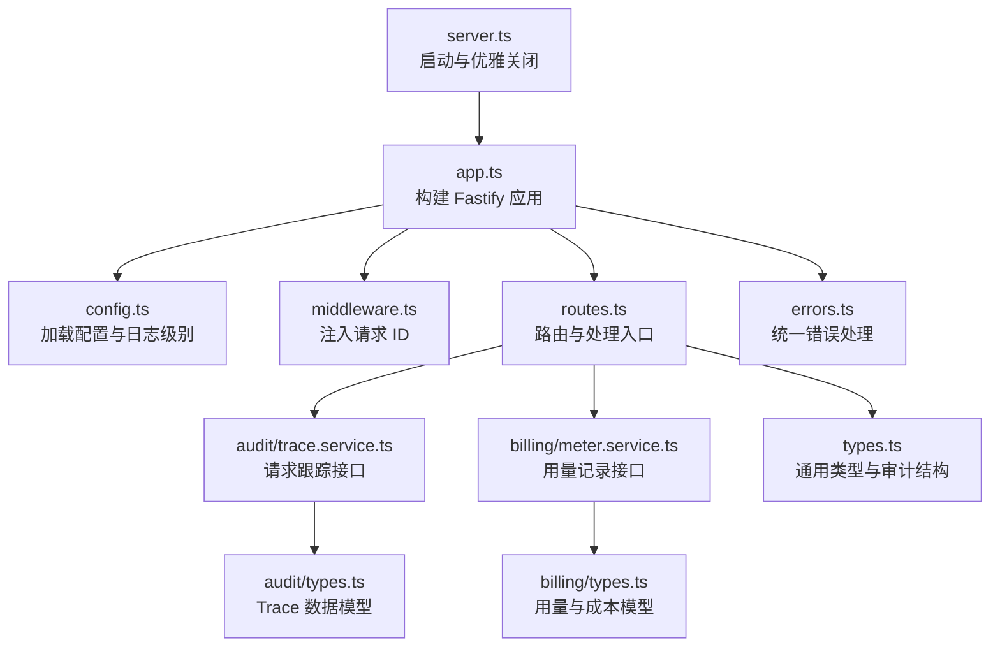
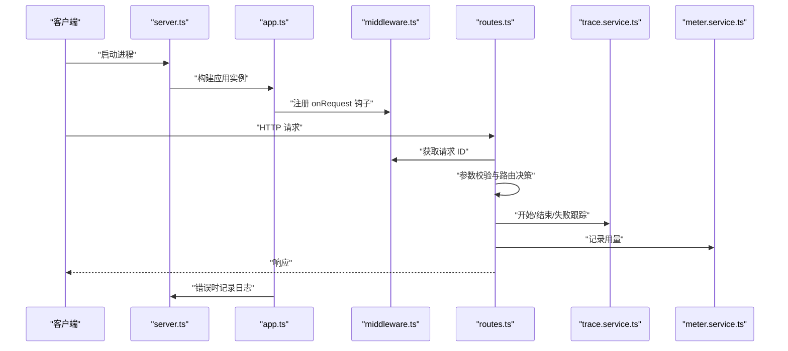
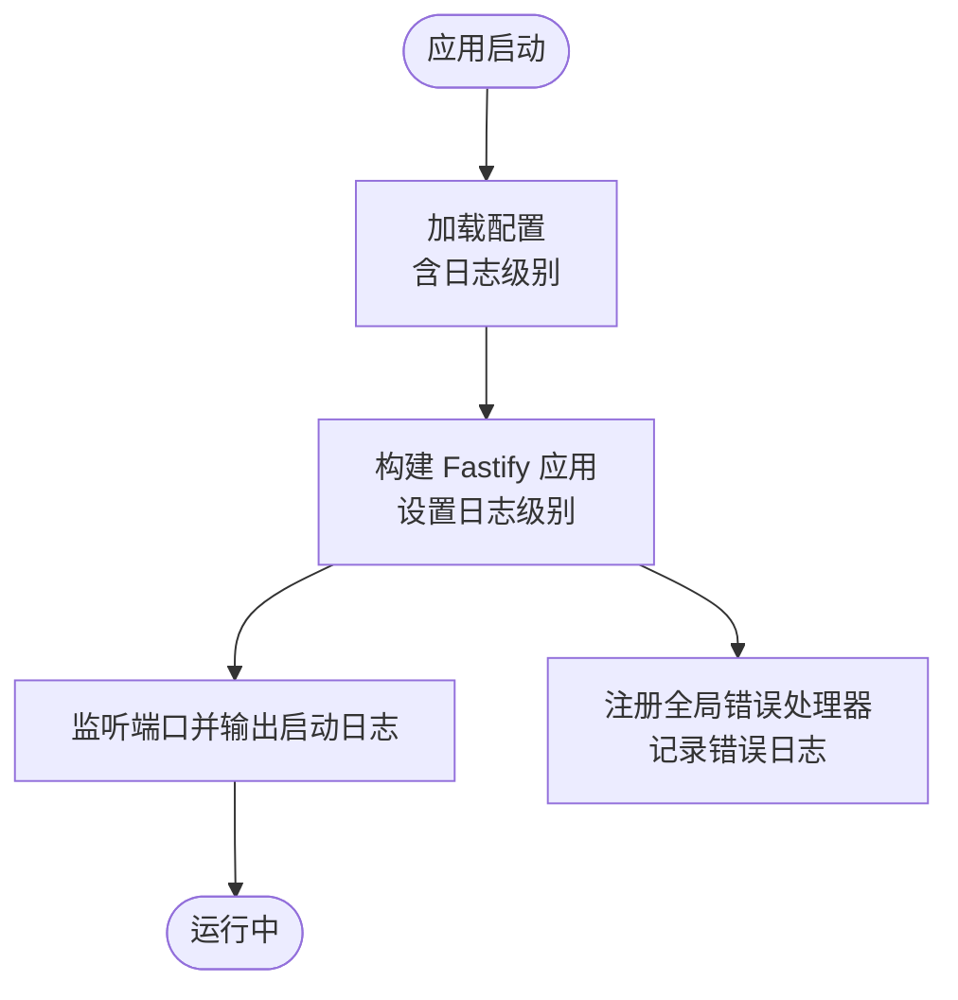
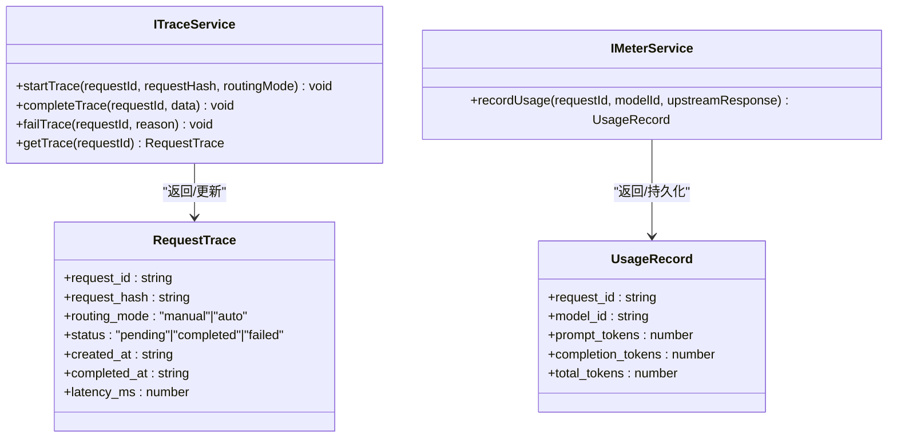
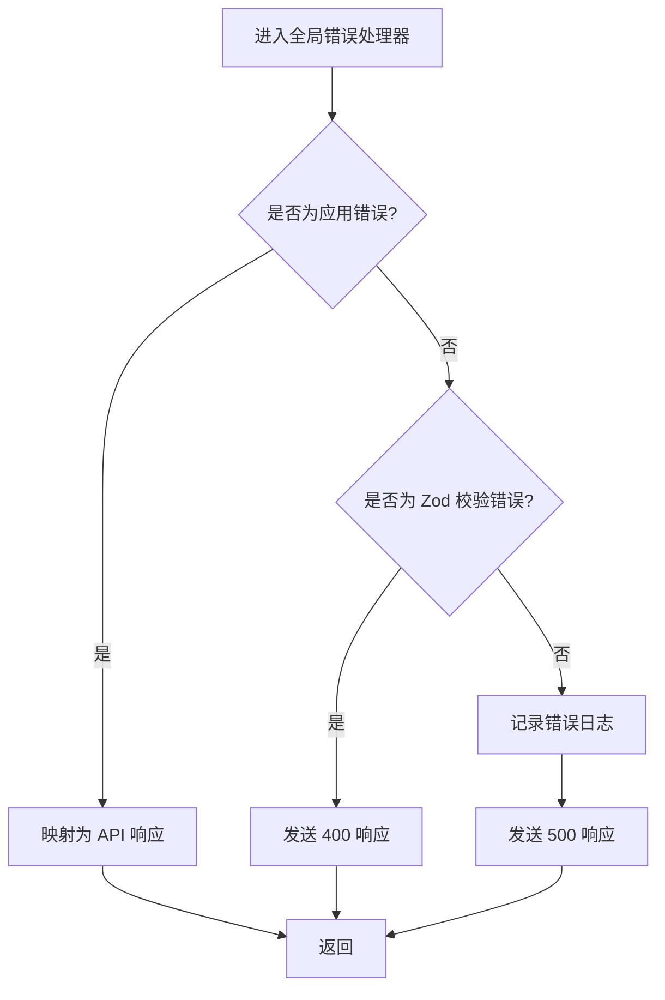
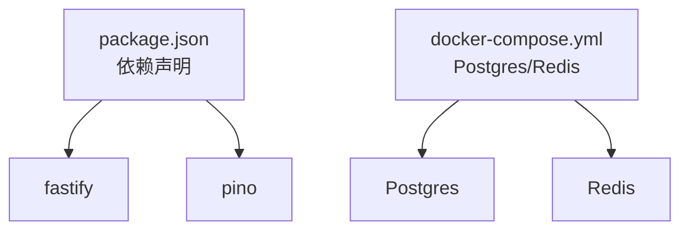

# 日志与监控

<cite>
**本文引用的文件**
- [src/app.ts](file://src/app.ts)
- [src/server.ts](file://src/server.ts)
- [src/config.ts](file://src/config.ts)
- [src/gateway/middleware.ts](file://src/gateway/middleware.ts)
- [src/gateway/routes.ts](file://src/gateway/routes.ts)
- [src/errors.ts](file://src/errors.ts)
- [src/audit/trace.service.ts](file://src/audit/trace.service.ts)
- [src/audit/receipt.service.ts](file://src/audit/receipt.service.ts)
- [src/audit/types.ts](file://src/audit/types.ts)
- [src/billing/meter.service.ts](file://src/billing/meter.service.ts)
- [src/billing/types.ts](file://src/billing/types.ts)
- [src/types.ts](file://src/types.ts)
- [package.json](file://package.json)
- [docker-compose.yml](file://docker-compose.yml)
</cite>

## 目录
1. [简介](#简介)
2. [项目结构](#项目结构)
3. [核心组件](#核心组件)
4. [架构总览](#架构总览)
5. [详细组件分析](#详细组件分析)
6. [依赖关系分析](#依赖关系分析)
7. [性能考量](#性能考量)
8. [故障排查指南](#故障排查指南)
9. [结论](#结论)
10. [附录](#附录)

## 简介
本文件聚焦于本 Fastify 应用的日志与监控主题，涵盖以下内容：
- 日志配置与日志级别
- 请求追踪与审计（Trace）能力
- 监控指标采集与展示建议（吞吐量、延迟、错误率）
- 日志轮转、聚合与实时告警的配置思路
- 日志分析最佳实践、性能指标监控与异常检测策略
- 监控仪表板配置示例与常见监控工具集成方案

当前仓库已具备基础日志框架（Fastify 内置日志），并通过中间件注入请求级唯一标识；审计与计费模块接口已定义，为后续埋点与指标落地提供扩展空间。

## 项目结构
围绕日志与监控的关键文件与职责如下：
- 应用入口与服务容器：构建 Fastify 实例、注册插件、全局错误处理、注入服务容器
- 配置加载：读取环境变量并校验，支持日志级别
- 中间件：在请求生命周期注入唯一请求 ID，便于日志关联
- 路由层：薄处理层，业务逻辑委托给服务层；可在此处埋点
- 审计与计费：定义 Trace、Usage、Cost 等数据模型与服务接口，用于指标采集与审计
- 错误类型：统一错误映射到 API 响应，便于统计错误类别

图表来源
- [src/server.ts:1-33](file://src/server.ts#L1-L33)
- [src/app.ts:35-100](file://src/app.ts#L35-L100)
- [src/config.ts:28-45](file://src/config.ts#L28-L45)
- [src/gateway/middleware.ts:9-12](file://src/gateway/middleware.ts#L9-L12)
- [src/gateway/routes.ts:9-96](file://src/gateway/routes.ts#L9-L96)
- [src/errors.ts:66-89](file://src/errors.ts#L66-L89)
- [src/audit/trace.service.ts:38-67](file://src/audit/trace.service.ts#L38-L67)
- [src/billing/meter.service.ts:13-28](file://src/billing/meter.service.ts#L13-L28)
- [src/audit/types.ts:4-12](file://src/audit/types.ts#L4-L12)
- [src/billing/types.ts:4-10](file://src/billing/types.ts#L4-L10)
- [src/types.ts:110-118](file://src/types.ts#L110-L118)

章节来源
- [src/server.ts:1-33](file://src/server.ts#L1-L33)
- [src/app.ts:35-100](file://src/app.ts#L35-L100)
- [src/config.ts:28-45](file://src/config.ts#L28-L45)
- [src/gateway/middleware.ts:9-12](file://src/gateway/middleware.ts#L9-L12)
- [src/gateway/routes.ts:9-96](file://src/gateway/routes.ts#L9-L96)
- [src/errors.ts:66-89](file://src/errors.ts#L66-L89)
- [src/audit/trace.service.ts:38-67](file://src/audit/trace.service.ts#L38-L67)
- [src/billing/meter.service.ts:13-28](file://src/billing/meter.service.ts#L13-L28)
- [src/audit/types.ts:4-12](file://src/audit/types.ts#L4-L12)
- [src/billing/types.ts:4-10](file://src/billing/types.ts#L4-L10)
- [src/types.ts:110-118](file://src/types.ts#L110-L118)

## 核心组件
- 日志配置与级别
  - Fastify 实例通过配置对象启用日志，并使用配置中的日志级别
  - 启动信息与致命错误通过应用日志输出
- 请求追踪
  - onRequest 钩子注入唯一请求 ID，便于跨服务链路关联
- 全局错误处理
  - 将应用自定义错误映射为 API 响应，并记录错误日志
- 审计与计费接口
  - Trace 接口用于记录请求状态、完成时间与延迟
  - Meter 接口用于提取用量并持久化
- 指标与数据模型
  - 审计与计费的数据模型为指标采集提供结构化支撑

章节来源
- [src/app.ts:36-41](file://src/app.ts#L36-L41)
- [src/app.ts:50](file://src/app.ts#L50)
- [src/app.ts:53-70](file://src/app.ts#L53-L70)
- [src/server.ts:9-11](file://src/server.ts#L9-L11)
- [src/server.ts:11](file://src/server.ts#L11)
- [src/gateway/middleware.ts:9-12](file://src/gateway/middleware.ts#L9-L12)
- [src/audit/trace.service.ts:4-36](file://src/audit/trace.service.ts#L4-L36)
- [src/billing/meter.service.ts:5-11](file://src/billing/meter.service.ts#L5-L11)
- [src/audit/types.ts:4-12](file://src/audit/types.ts#L4-L12)
- [src/billing/types.ts:4-10](file://src/billing/types.ts#L4-L10)

## 架构总览
下图展示了从请求进入、中间件注入 ID、路由处理、服务调用到审计与计费的完整链路，以及日志输出位置。

图表来源
- [src/server.ts:4-14](file://src/server.ts#L4-L14)
- [src/app.ts:35-51](file://src/app.ts#L35-L51)
- [src/gateway/middleware.ts:9-12](file://src/gateway/middleware.ts#L9-L12)
- [src/gateway/routes.ts:23-67](file://src/gateway/routes.ts#L23-L67)
- [src/audit/trace.service.ts:39-66](file://src/audit/trace.service.ts#L39-L66)
- [src/billing/meter.service.ts:14-26](file://src/billing/meter.service.ts#L14-L26)

## 详细组件分析

### 日志配置与输出
- Fastify 实例的日志级别来源于配置对象，确保运行时可调整
- 应用启动与致命错误通过应用日志输出，便于外部系统采集
- 全局错误处理器在捕获非应用错误时记录错误日志，有助于定位异常

图表来源
- [src/config.ts:28-45](file://src/config.ts#L28-L45)
- [src/app.ts:36-41](file://src/app.ts#L36-L41)
- [src/app.ts:53-70](file://src/app.ts#L53-L70)
- [src/server.ts:9-11](file://src/server.ts#L9-L11)

章节来源
- [src/config.ts:8](file://src/config.ts#L8)
- [src/app.ts:36-41](file://src/app.ts#L36-L41)
- [src/app.ts:53-70](file://src/app.ts#L53-L70)
- [src/server.ts:9-11](file://src/server.ts#L9-L11)

### 请求追踪与审计
- 追踪接口定义了开始、完成、失败与查询方法，可用于记录请求状态、完成时间与延迟
- 审计数据模型包含路由决策、用量、成本与支付信息，为指标与报表提供结构化数据
- 计费用量接口定义了用量记录流程，便于统计吞吐量与成本

图表来源
- [src/audit/trace.service.ts:4-36](file://src/audit/trace.service.ts#L4-L36)
- [src/audit/types.ts:4-12](file://src/audit/types.ts#L4-L12)
- [src/billing/meter.service.ts:5-11](file://src/billing/meter.service.ts#L5-L11)
- [src/billing/types.ts:4-10](file://src/billing/types.ts#L4-L10)

章节来源
- [src/audit/trace.service.ts:38-67](file://src/audit/trace.service.ts#L38-L67)
- [src/audit/types.ts:4-12](file://src/audit/types.ts#L4-L12)
- [src/billing/meter.service.ts:13-28](file://src/billing/meter.service.ts#L13-L28)
- [src/billing/types.ts:4-10](file://src/billing/types.ts#L4-L10)

### 错误处理与日志
- 全局错误处理器区分应用错误与验证错误，统一映射为 API 响应
- 对于未捕获的错误，记录错误日志，便于后续分析与告警

图表来源
- [src/app.ts:53-70](file://src/app.ts#L53-L70)
- [src/errors.ts:92-105](file://src/errors.ts#L92-L105)

章节来源
- [src/app.ts:53-70](file://src/app.ts#L53-L70)
- [src/errors.ts:66-89](file://src/errors.ts#L66-L89)
- [src/errors.ts:92-105](file://src/errors.ts#L92-L105)

### 路由与指标埋点建议
- 在路由处理中，结合请求 ID 与审计接口进行开始/完成/失败标记
- 在上游调用后，调用用量记录接口，产出吞吐量与成本指标
- 可在路由层对成功/失败进行分类统计，作为错误率的基础

章节来源
- [src/gateway/routes.ts:23-67](file://src/gateway/routes.ts#L23-L67)
- [src/audit/trace.service.ts:39-66](file://src/audit/trace.service.ts#L39-L66)
- [src/billing/meter.service.ts:14-26](file://src/billing/meter.service.ts#L14-L26)

## 依赖关系分析
- 日志与监控相关依赖
  - Fastify：内置日志与错误处理
  - Pino：日志序列化与传输（通过依赖树可见）
- 外部基础设施
  - Postgres 与 Redis：通过 docker-compose 提供数据库与缓存，可用于审计与计费数据存储

图表来源
- [package.json:21-36](file://package.json#L21-L36)
- [package.json:33](file://package.json#L33)
- [docker-compose.yml:1-31](file://docker-compose.yml#L1-L31)

章节来源
- [package.json:21-36](file://package.json#L21-L36)
- [package.json:33](file://package.json#L33)
- [docker-compose.yml:1-31](file://docker-compose.yml#L1-L31)

## 性能考量
- 日志级别
  - 生产环境建议使用 info 或更高级别，避免 debug/trace 的高开销
- 请求追踪
  - 使用注入的请求 ID 关联所有日志条目，便于按请求聚合分析
- 指标采集
  - 在路由层与服务层埋点，统计每类错误、成功率与延迟分布
- 存储与索引
  - 审计与计费数据建议建立必要索引，优化查询性能

## 故障排查指南
- 启动失败
  - 查看启动日志中的致命错误输出，确认端口占用或权限问题
- 运行时错误
  - 全局错误处理器会记录错误日志，优先检查错误类型与堆栈
- 审计与计费未落库
  - 确认服务实现已启用数据库连接与事务提交
- 日志缺失
  - 检查日志级别配置与外部日志系统采集规则

章节来源
- [src/server.ts:11](file://src/server.ts#L11)
- [src/app.ts:53-70](file://src/app.ts#L53-L70)
- [src/audit/trace.service.ts:44-66](file://src/audit/trace.service.ts#L44-L66)
- [src/billing/meter.service.ts:20-26](file://src/billing/meter.service.ts#L20-L26)

## 结论
本项目已具备完善的日志与请求追踪基础，结合审计与计费接口，可进一步完善监控指标体系。建议在路由与服务层增加埋点，配合数据库与外部监控系统，实现吞吐量、延迟与错误率的可视化与告警。

## 附录

### 日志配置与级别
- 日志级别来源于配置对象，可通过环境变量进行控制
- 建议生产环境采用 info 级别，开发环境可提升至 debug/trace

章节来源
- [src/config.ts:8](file://src/config.ts#L8)
- [src/app.ts:36-41](file://src/app.ts#L36-L41)

### 监控指标与采集建议
- 吞吐量：按路由与方法统计请求数
- 延迟：记录请求开始与结束时间，计算耗时直方图
- 错误率：按错误类型统计失败比例
- 成本：基于用量与单价计算总成本

章节来源
- [src/gateway/routes.ts:23-67](file://src/gateway/routes.ts#L23-L67)
- [src/audit/trace.service.ts:39-66](file://src/audit/trace.service.ts#L39-L66)
- [src/billing/meter.service.ts:14-26](file://src/billing/meter.service.ts#L14-L26)

### 日志轮转、聚合与实时告警
- 日志轮转：使用系统自带轮转工具或日志代理进行切割与归档
- 日志聚合：将 stdout 输出接入集中式日志系统（如 ELK/Vector/Fluent Bit）
- 实时告警：基于日志关键词与阈值触发告警（如错误率突增）

### 监控仪表板与工具集成
- 仪表板：Prometheus/Grafana 或云厂商监控平台
- 工具：APM（如 OpenTelemetry）、日志分析（如 Loki/Promtail）、告警（AlertManager/云告警）